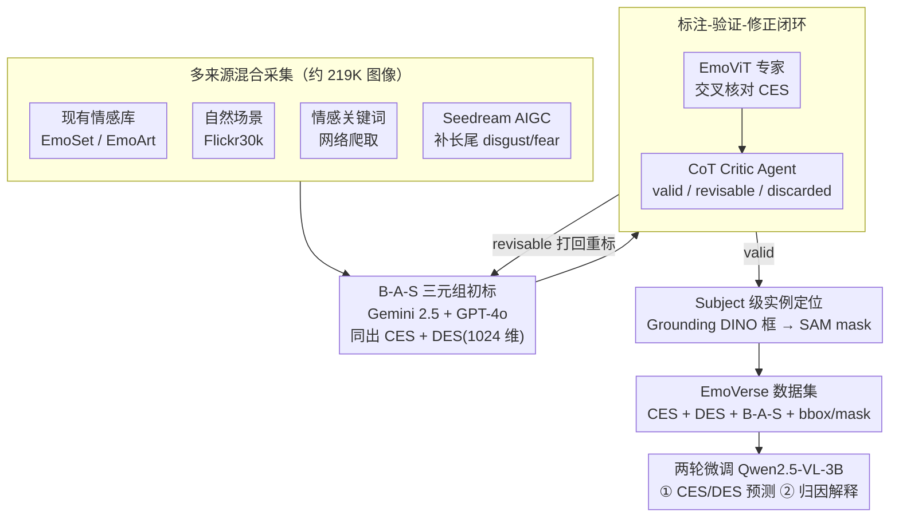

# EmoVerse: A MLLMs-Driven Emotion Representation Dataset for Interpretable Visual Emotion Analysis

**会议**: CVPR2026  
**arXiv**: [2511.12554](https://arxiv.org/abs/2511.12554)  
**代码**: 待确认  
**领域**: 多模态VLM  
**关键词**: 视觉情感分析, 情感表示数据集, 知识图谱, 可解释性, 多模态大模型

## 一句话总结
构建 EmoVerse——首个同时覆盖 CES（Mikels 8 类离散情感）和 DES（1024 维连续情感空间）的大规模可解释视觉情感数据集（219K+ 图像），提出 B-A-S（Background-Attribute-Subject）三元组知识图谱标注体系和 Annotation & Verification Pipeline（Gemini/GPT-4o + EmoViT + CoT Critic Agent），并基于 Qwen2.5-VL-3B 微调实现 1024 维 DES 投射与情感归因解释。

## 背景与动机

1. **领域现状**：视觉情感分析（Visual Emotion Analysis, VEA）旨在从图像中预测观者的情感反应。现有数据集（FI、EmoSet、Instagram 等）多采用离散情感分类（Mikels 8 类或 VAD 三维），标注维度单一。
2. **现有痛点**：(1) 缺乏开源的大规模可解释情感数据集——现有数据集只提供情感类别标签，不解释"为什么引发这种情感"；(2) 离散情感标签（CES）无法捕捉细粒度情感变化，连续表示（DES）的数据集几乎不存在；(3) 缺少 subject-level 的实例定位——不知道图像中哪个主体触发了哪种情感。
3. **核心矛盾**：VEA 领域急需可解释性和细粒度标注，但人工标注成本极高（1024 维连续空间不可能人工标注），传统众包方式无法覆盖 word-level、subject-level、CES、DES 四个维度。
4. **本文目标**：如何构建一个兼具 CES 和 DES、具有可解释性标注、且规模足够大的视觉情感数据集？
5. **切入角度**：利用 MLLM（Gemini 2.5、GPT-4o）做自动标注，配合多轮验证 pipeline 保证质量，引入知识图谱结构化情感归因。
6. **核心 idea**：B-A-S 三元组将情感分解为 Background（背景场景）、Attribute（视觉属性如颜色/光线）、Subject（主体对象），配合 Grounding DINO + SAM 实现 subject 定位，用 MLLM pipeline 完成标注-验证-修正闭环。

## 方法详解

### 整体框架
EmoVerse 想解决的是：视觉情感分析长期只有"这张图让人 sad"这种孤零零的类别标签，既不告诉你为什么 sad，也没有连续的情感强度刻画。这篇论文要造一个既能解释情感来源、又同时带离散（CES，Mikels 8 类：amusement、awe、contentment、excitement、anger、disgust、fear、sadness）和连续（DES，1024 维空间）两套表示的大规模数据集。整条构建流水线可以拆成四步：先从多个来源汇集并清洗约 219K 张图像；再让 MLLM 把每张图标成 B-A-S 三元组并同时产出 CES/DES；然后让标注走一遍"专家模型 + CoT 批判 agent"的验证-修正闭环过滤噪声；最后用 Grounding DINO + SAM 把三元组里的主体落到像素级的框和 mask 上。数据集造好后，再在它上面微调 Qwen2.5-VL-3B，得到一个能同时做情感预测和情感归因解释的模型。

### 关键设计

**1. 多来源混合采集：用 AIGC 专补长尾情感**

单一数据源会带来分布偏置——比如 EmoSet 偏自然图，某些情感几乎拍不到。EmoVerse 因此从四类来源凑齐约 219K 张图：现有情感数据集（EmoSet、EmoArt）、通用自然场景（Flickr30k）、按情感关键词的网络爬取，以及最关键的一招——用 Seedream 按情感 prompt 生成约 25K 张图像，专门补 disgust、fear 这类在真实数据里稀缺的长尾类别。比起单纯对长尾类过采样，按需生成能更精准地把缺的情感"画"出来。

**2. B-A-S 三元组：把"为什么有这种情感"拆成可追溯的知识图谱**

痛点是传统标注只给一个 sadness/anger 标签，读者无从知道情感从哪来。EmoVerse 受知识图谱启发，把每张图的情感归因写成一个 $(B, A, S)$ 三元组：$B$（Background）描述场景背景（如"暴风雨中的海岸"），$A$（Attribute）描述触发情绪的视觉属性（如"昏暗光线、冷色调"），$S$（Subject）描述画面里的关键主体（如"独自站立的人"）。三者拼起来就是一条结构化的情感解释链，既比自由文本规范、便于 MLLM 自动产出（初标阶段就由 Gemini 2.5 / GPT-4o 直接吐出），又能被下游模型直接拿来做归因推理。

**3. 标注-验证-修正闭环：不是"用 GPT 标一遍"就完事**

1024 维 DES 空间人工根本标不动，纯 MLLM 标注的噪声又不能忽视，所以这套 pipeline 的重点是质量闭环而非单次标注。流程是：先让 Gemini 2.5 和 GPT-4o 各自给出 CES 类别、DES 向量和 B-A-S 三元组（初标）；再用预训练的情感分类专家 EmoViT 交叉核对 CES 标签是否自洽；接着让一个 CoT Critic Agent 用思维链逐条审查，把每条标注判成 valid（保留）、revisable（打回重标）或 discarded（丢弃）三档；最后对 Critic 的输出做人工抽检兜底。专家模型 + 思维链批判的双重过滤，正是它和"直接信任 GPT 输出"的关键区别。

**4. Subject 级实例定位：把情感落到具体区域**

只有图像级标签时，模型学不到"画面里到底哪个对象引发了情感"。EmoVerse 把 B-A-S 里的 Subject 文本描述喂给 Grounding DINO 拿到 bounding box，再用 SAM 以这个 box 作 prompt 生成像素级 mask。这样情感归因就从整图推进到区域，下游模型可以学习局部情感线索，也让"独自站立的人"这种主体变成可定位的实体。

**5. 两轮微调出可解释模型：Qwen2.5-VL-3B**

有了数据还要证明它好用，于是在 EmoVerse 上对 Qwen2.5-VL-3B 做两轮微调：第一轮学 CES 分类和 DES 预测（DES 用一个 1024 维线性投射头输出，主损失是交叉熵），第二轮再基于 B-A-S 学习生成情感归因解释文本。两轮下来模型既能预测情感、又能说出"为什么"，把数据集的可解释标注转化成了模型能力。

### 一个完整示例：一张暴风雨海岸图怎么被标完
拿一张"独自站在暴风雨海岸的人"为例走一遍流水线：Gemini 2.5 和 GPT-4o 先各自初标，给出 CES = sadness、一条 1024 维 DES 向量，以及三元组 $B$ = "暴风雨中的海岸"、$A$ = "昏暗光线、冷色调"、$S$ = "独自站立的人"；EmoViT 复核 sadness 与画面是否一致，CoT Critic Agent 再逐条审查——若两个 MLLM 给的 CES 打架或 DES 明显失真，就判 revisable 打回重标，通过的判 valid；标注定稿后，把 $S$ = "独自站立的人"送进 Grounding DINO 得到人物的 bounding box，SAM 再据此切出像素 mask。最终这张图在库里就同时挂着离散标签、连续向量、一条可读的情感解释链，和一个定位到具体主体的 mask。

## 实验关键数据

### 数据集对比

| 数据集 | 图像数 | CES | DES | 可解释标注 | Subject 定位 |
|--------|--------|-----|-----|-----------|-------------|
| FI | 23K | ✓ | ✗ | ✗ | ✗ |
| Instagram | 42K | ✓ | ✗ | ✗ | ✗ |
| EmoSet | 118K | ✓ | ✗ | 部分 | ✗ |
| EmoArt | 80K | ✓ | ✗ | ✗ | ✗ |
| **EmoVerse** | **219K+** | **✓** | **✓** | **✓ (B-A-S)** | **✓ (bbox+mask)** |

### 关键发现
- **EmoVerse 是首个同时覆盖 CES 和 DES 的数据集**：现有所有数据集均无 DES 标注
- **B-A-S 三元组提升可解释性**：消融显示加入 B-A-S 后情感分类准确率和归因文本质量均有提升
- **AIGC 数据有效补充长尾**：去掉 Seedream 生成数据后，稀缺情感类别（disgust、fear）的分类性能明显下降
- **Annotation Pipeline 有效降噪**：CoT Critic Agent 过滤了约 15-20% 的低质量标注，人工抽检验证 pipeline 输出的准确率 > 90%
- **Qwen2.5-VL-3B 微调效果**：在 EmoVerse 测试集上 CES 分类准确率和 DES 投射相关性均优于基线方法

## 亮点与洞察
- **B-A-S 三元组是核心贡献**：将情感归因结构化为知识图谱风格的三元组，既便于自动标注又支持下游推理，比自由文本描述更规范
- **MLLM + 专家模型 + CoT Critic 的多轮验证**：这套 pipeline 为利用 MLLM 构建大规模标注数据集提供了可复用范式——不是简单地"用 GPT 标注"，而是有质量保证闭环
- **AIGC 补充长尾分布**：用生成模型按需生成特定情感图像是巧妙的数据增强思路，比单纯过采样更有效
- **Subject-level 定位**：Grounding DINO + SAM 的组合将情感分析从图像级推进到区域级，开辟了局部情感归因的新方向

## 局限与展望
- DES 1024 维的标注质量完全依赖 MLLM，缺少人工验证金标准——MLLM 对连续情感空间的理解可能存在系统性偏差
- Mikels 8 类 CES 体系相对粗粒度，未覆盖 surprise、neutral 等常见情感
- AIGC 生成的图像可能带有生成模型的风格偏见，与真实图像的情感表达存在 domain gap
- Qwen2.5-VL-3B 较小，更大模型（7B/72B）的表现未知
- 仅在 EmoVerse 自身测试集上评估，缺少与 FI、EmoSet 等外部数据集的跨数据集泛化实验
- CoT Critic Agent 的判定阈值如何选取未充分讨论

## 相关工作与启发
- **vs EmoSet**: EmoSet 是当前最大的视觉情感数据集（118K），但只有 CES 无 DES，无 subject 定位。EmoVerse 在规模、标注维度上全面超越
- **vs EmotionCLIP**: EmotionCLIP 通过对比学习做情感零样本分类，但不提供可解释归因。EmoVerse 的 B-A-S 三元组直接支持解释生成
- **vs SentiCap / ArtEmis**: 提供图像情感描述文本，但缺少结构化标注（B-A-S）和 subject 定位
- **vs Grounding DINO + SAM 的组合使用**：EmoVerse 证明了"文本描述 → 视觉定位"pipeline 在情感分析场景的有效性，可推广到其他主观感知任务

## 评分
- 新颖性: ⭐⭐⭐⭐ B-A-S 三元组和 CES+DES 双表示体系是首创，MLLM 多轮验证 pipeline 有方法论价值
- 实验充分度: ⭐⭐⭐ 缺少跨数据集泛化实验和更大模型验证
- 写作质量: ⭐⭐⭐⭐ 数据集构建流程描述详尽，pipeline 各环节动机清晰
- 价值: ⭐⭐⭐⭐ 填补了可解释视觉情感分析数据集的空白，B-A-S 标注体系和验证 pipeline 可复用性强

<!-- RELATED:START -->

## 相关论文

- [\[ICLR 2026\] Customizing Visual Emotion Evaluation for MLLMs: An Open-vocabulary, Multifaceted, and Scalable Approach](../../ICLR2026/multimodal_vlm/customizing_visual_emotion_evaluation_for_mllms_an_open-vocabulary_multifaceted_.md)
- [\[ACL 2025\] AkaCE: A Multimodal Multi-party Dataset for Emotion Recognition in Movie Dialogues](../../ACL2025/multimodal_vlm/akan_cinematic_emotions_ace_a_multimodal_multi-party_dataset_for_emotion_recogni.md)
- [\[ACL 2026\] Dynamic Emotion and Personality Profiling for Multimodal Deception Detection](../../ACL2026/multimodal_vlm/dynamic_emotion_and_personality_profiling_for_multimodal_deception_detection.md)
- [\[ACL 2026\] Enhancing Multimodal Large Language Models for Ancient Chinese Character Evolution Analysis via Glyph-Driven Fine-Tuning](../../ACL2026/multimodal_vlm/enhancing_multimodal_large_language_models_for_ancient_chinese_character_evoluti.md)
- [\[CVPR 2026\] CodePercept: Code-Grounded Visual STEM Perception for MLLMs](codepercept_code-grounded_visual_stem_perception_for_mllms.md)

<!-- RELATED:END -->
