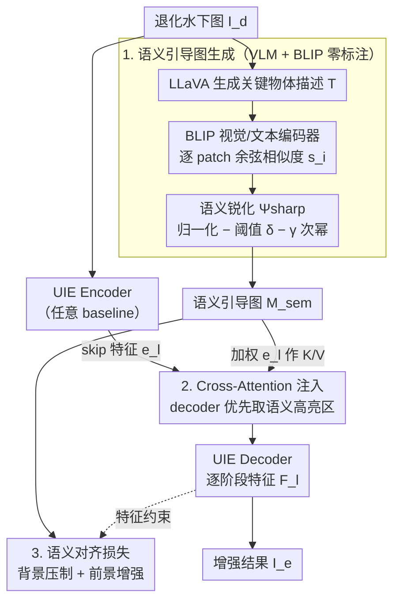

# Empowering Semantic-Sensitive Underwater Image Enhancement with VLM

**会议**: CVPR 2026  
**arXiv**: [2603.12773](https://arxiv.org/abs/2603.12773)  
**代码**: 待确认  
**领域**: 水下图像增强 / 语义引导 / VLM 应用  
**关键词**: underwater image enhancement, VLM, semantic guidance, cross-attention, downstream tasks  

## 一句话总结
提出 VLM 驱动的语义敏感学习策略，通过 VLM 生成目标物体描述、BLIP 构建空间语义引导图、双重引导机制（cross-attention + 语义对齐损失）注入 UIE decoder，使增强结果在感知质量和检测/分割下游任务上同时提升。

## 背景与动机
水下图像增强（UIE）已有大量深度学习方法，但存在"增强悖论"：增强后的图像视觉质量好但下游检测/分割性能反而下降。原因在于现有方法是"语义盲"的——全局均匀增强所有区域，无法区分语义焦点（海洋生物、人工物体）和背景（水体），导致分布偏移破坏下游模型所依赖的语义线索。早期语义引导方法依赖高质量像素级标注（在水下场景极为稀缺），全局文本提示（如"a clear underwater photo"）虽利用了 VLM 但仍是一刀切策略。

## 核心问题
如何让水下图像增强具备内容感知能力，在恢复视觉质量的同时保护/增强关键物体的语义特征，使下游机器视觉任务受益？

## 方法详解

### 整体框架

水下增强有个「增强悖论」：图看着更清晰了，下游检测 / 分割反而更差。根子在于现有方法是「语义盲」的——对全图一刀切均匀增强，分不清海洋生物、人工物体这些语义焦点和背景水体，结果破坏了下游模型依赖的语义线索。本文给增强装上内容感知，分三步走：先用 VLM（LLaVA）从退化图里生成关键物体的文本描述，再用 BLIP 的视觉-文本对齐把描述变成一张空间语义引导图 $M_{\text{sem}}$，最后通过「cross-attention + 对齐损失」的双重引导，把 $M_{\text{sem}}$ 注进任意 UIE 网络的 decoder，让它知道该重点恢复哪里。整套是可插拔模块，已在 5 个 baseline 上验证。

### 关键设计

**1. 语义引导图生成：用 VLM + BLIP 零标注地标出「哪里重要」**

水下像素级语义标注极稀缺，而全局文本提示（"a clear underwater photo"）又是一刀切、定位不到具体物体。本文绕开标注：先让 LLaVA 自动描述退化图中的关键物体得到文本 $T$，再用 BLIP 的视觉编码器 $\Phi_v$ 提 patch 特征 $F_v = \{f_{v1}, \dots, f_{vN}\}$、文本编码器 $\Phi_t$ 提全局文本特征 $f_t$，逐 patch 算与文本的余弦相似度 $s_i = \hat{v}_i^\top \hat{t}$。光有相似度图还带背景噪声，于是用语义锐化函数 $\Psi_{\text{sharp}}$ 收拾：先 min-max 归一化，减去阈值 $\delta$ 滤掉低相关噪声，再取 $\gamma$ 次幂（$\gamma > 1$）非线性放大焦点与背景的差距，上采样回原分辨率得到单通道引导图 $M_{\text{sem}}$。对比 ViT class attention、CLIP、BLIP 三种方案，BLIP 出来的图最干净、边界最清、几乎无背景噪声。

**2. Cross-Attention 注入：让 decoder 优先从语义高亮区取特征**

有了 $M_{\text{sem}}$ 还得让网络真用上它。在 decoder 的每个阶段 $l$，把 decoder 特征 $d_l$ 当作 Query，把 encoder 的 skip-connection 特征 $e_l$ 经 $M_{\text{sem}}$ 加权后生成 Key 和 Value：$M_{\text{sem}}$ 先下采样到对应分辨率 $\tilde{M}^{(l)}$，$e_l$ 乘上 $\tilde{M}^{(l)}$ 再投影，注意力输出 $d_l' = \text{softmax}(Q_l K_l^\top / \sqrt{d_k}) V_l$。这样 decoder 在重建时会优先从语义「高亮」的区域提取编码器特征，把恢复力气花在关键物体上。消融显示注入放在 decoder 阶段（而非 encoder 或全阶段）最有效，因为 decoder 直接决定重建结果。

**3. 显式语义对齐损失：双向约束前景强响应、背景压激活**

结构上的引导还可以再用损失从特征层面显式加固。对 decoder 第 $l$ 阶段的特征图 $F^{(l)}$ 施加两项约束：背景抑制项 $\|F^{(l)} \odot (1 - \tilde{M}^{(l)})\|_F^2$ 惩罚非关键区域的过强激活，前景增强项 $-\eta \langle F^{(l)}, \tilde{M}^{(l)} \rangle$ 奖励关键物体区域的强响应，$\eta$ 是平衡超参。cross-attention 给的是结构性引导、对齐损失给的是显式监督，消融证明两者协同比任一单独用都好。

### 损失函数 / 训练策略

- 总损失：$L_{\text{total}} = L_{\text{recon}} + \lambda_{\text{align}} \sum_l L_{\text{align}}^{(l)}$，其中 $\lambda_{\text{align}} = 0.1$
- 重建损失：$L_{\text{recon}} = L_1(I_e, I_{gt}) + \lambda_{\text{percep}} \sum_j \|\phi_j(I_e) - \phi_j(I_{gt})\|_1$（VGG-19 感知损失）
- 在 UIEB 训练集（790 对图像）上训练；策略为可插拔模块，已在 PUIE、SMDR、UIR、PFormer、FDCE 五个 baseline 上验证

## 实验关键数据

**UIE 感知质量（UIEB 测试集）**：

| 方法 | PSNR↑ | SSIM↑ | LPIPS↓ |
|------|-------|-------|--------|
| PFormer | 23.53 | 0.877 | 0.113 |
| PFormer-SS | **24.97**(+1.44) | **0.933**(+0.056) | **0.087**(-0.026) |
| UIR | 22.89 | 0.885 | 0.124 |
| UIR-SS | **24.62**(+1.73) | **0.901**(+0.016) | **0.113**(-0.011) |

**下游任务（检测 mAP / 分割 mIoU）**：

| 方法 | mAP↑ | mIoU↑ |
|------|------|-------|
| 原图（无增强） | 95.43 | 68.10 |
| PFormer | 95.50 | 69.34 |
| PFormer-SS | **96.87**(+1.37) | **74.75**(+5.41) |
| SMDR | 95.76 | 68.18 |
| SMDR-SS | **96.98**(+1.22) | **73.51**(+5.33) |

- 所有 5 个 baseline 加上 -SS 后 PSNR/SSIM 均提升
- 分割 mIoU 提升最显著，PFormer-SS 达到 +5.41，SMDR-SS +5.33
- 某些 baseline 增强后下游性能反而低于原图，但 -SS 版本一致超过原图

### 消融实验要点
- 引导图模型对比：BLIP > CLIP > ViT（BLIP 无背景噪声、边界清晰）
- 注入位置对比：Decoder only > All stages > Encoder only（decoder 阶段直接影响重建过程）
- 消融验证了 cross-attention 和 alignment loss 二者协同最优

## 亮点
- 精准识别了"增强悖论"问题：全局增强破坏语义线索导致下游性能下降
- VLM→文本→BLIP→空间引导图的管线巧妙地避免了对水下标注数据的依赖
- 可插拔设计使策略适用于任意 encoder-decoder UIE 架构
- 双重引导（结构性 cross-attention + 显式 alignment loss）比单一机制更有效
- 同时评估感知质量和下游任务，实验协议更务实

## 局限与展望
- VLM (LLaVA) 和 BLIP 的推理开销较大，影响实时性
- 语义引导图的质量依赖于 VLM 对退化图像的理解能力，严重退化场景下可能失效
- 仅在 UIEB 上训练，水下场景多样性有限
- 锐化函数中 δ 和 γ 的选择可能需要针对不同场景调整
- 未评估对更多下游任务（如重识别、跟踪）的影响

## 与相关工作的对比
- vs 传统 UIE (PUIE/SMDR 等)：后者语义盲，本文赋予语义感知能力
- vs 语义分割引导方法 (Liao/Yan)：后者需要高质量像素级标注，本文用 VLM 零标注生成语义先验
- vs CLIP 风格引导 (Liu et al.)：CLIP 提供全局文本引导（"清晰的水下照片"），本文构建空间化的目标级语义图
- vs VINE/Watermark 方向的 VLM 应用：不同任务但都展示 VLM 语义能力在低层视觉中的价值

## 启发与关联
- VLM→文本描述→空间引导图的管线可推广到其他退化场景（雾天、低光照）
- 双重引导机制（architectural guidance + loss supervision）的组合思路有通用性
- 下游任务感知的增强是图像恢复领域的重要趋势

## 评分
- 新颖性: ⭐⭐⭐⭐ 首次将 VLM 空间语义引导引入水下增强，管线设计新颖
- 实验充分度: ⭐⭐⭐⭐ 5 个 baseline、3 个评估数据集、检测+分割下游评估、消融完整
- 写作质量: ⭐⭐⭐⭐ 动机阐述清晰，方法逻辑连贯，图表直观
- 价值: ⭐⭐⭐⭐ 可插拔策略实用性强，对水下视觉和下游感知应用有实际意义

<!-- RELATED:START -->

## 相关论文

- [\[CVPR 2026\] Can Vision-Language Models Count? A Synthetic Benchmark and Analysis of Attention-Based Interventions](can_vision-language_models_count_a_synthetic_benchmark_and_analysis_of_attention.md)
- [\[CVPR 2026\] G-MIXER: Geodesic Mixup-based Implicit Semantic Expansion and Explicit Semantic Re-ranking for Zero-Shot Composed Image Retrieval](g_mixer_geodesic_mixup_based_implicit_semantic_expansion_for_zero_shot_cir.md)
- [\[CVPR 2026\] ApET: Approximation-Error Guided Token Compression for Efficient VLMs](apet_approximation-error_guided_token_compression_for_efficient_vlms.md)
- [\[CVPR 2026\] FlashCache: Frequency-Domain-Guided Outlier-KV-Aware Multimodal KV Cache Compression](flashcache_frequency_kv_cache_compression.md)
- [\[CVPR 2026\] It's Time to Get It Right: Improving Analog Clock Reading and Clock-Hand Spatial Reasoning in Vision-Language Models](its_time_to_get_it_right_improving_analog_clock_reading_and_clock-hand_spatial_r.md)

<!-- RELATED:END -->
