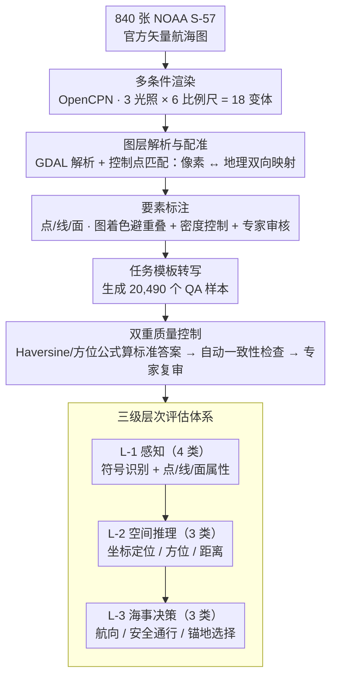

# ENC-Bench: A Benchmark for Evaluating MLLMs in Electronic Navigational Chart Understanding

**会议**: CVPR 2026  
**arXiv**: [2603.22763](https://arxiv.org/abs/2603.22763)  
**代码**: 无  
**领域**: Multimodal / VLM Benchmark  
**关键词**: 海图理解, 多模态基准, 空间推理, 安全关键AI, 符号接地

## 一句话总结

提出首个面向电子航海图(ENC)理解的专业级基准 ENC-Bench，包含 20,490 样本和三级层次评估体系（感知→空间推理→海事决策），系统评估 10 个 MLLM 后发现最佳模型仅 47.88% 准确率，揭示了通用模型在安全关键专业领域的严重能力缺口。

## 研究背景与动机

**领域现状**：海运承载全球 90% 以上贸易，电子航海图(ENC)已被国际海事组织强制用于商船，海事 AI 市场预计达 41.3 亿美元。MLLM 在通用视觉理解任务上表现优异，但在专业领域的实际能力未知。

**现有痛点**：现有基准覆盖统计图表(ChartQA)、文档(DocVQA)、地理推理(MapQA)等，但无一专门针对 ENC 这类使用标准化矢量符号(IHO S-57)、尺度依赖渲染、多约束空间几何的安全关键专业图表。

**核心矛盾**：ENC 编码法规、水深和航路约束的方式与自然图像或统计图表根本不同——需要标准化符号解读、球面测地坐标计算和多约束安全决策，但通用 MLLM 从未接受过这类训练。

**本文目标**：系统评估当前 MLLM 能否可靠解读 ENC，量化其在专业海事领域的实际能力边界。

**切入角度**：模拟持证航海员的认知流程，设计从符号识别到安全关键决策的层次化评估体系。

**核心 idea**：构建三级层次(感知→空间推理→决策)的 ENC 专业基准，首次严格评估 MLLM 在海事安全关键场景中的表现。

## 方法详解

### 整体框架

ENC-Bench 想回答一个很具体的问题：把一张真实的电子航海图丢给 MLLM，它能不能像持证航海员那样从认符号一路推到安全决策。为此整套数据从 840 张 NOAA 官方 S-57 矢量航海图出发，经过一条四阶段管线变成可评测的问答对。先用 OpenCPN 在多种光照和比例尺组合下把矢量图渲染成图像，再用 GDAL 解析图层、靠控制点匹配做图像配准，建立起「像素坐标 ↔ 地理坐标」的双向映射——这一步是后面所有空间推理任务能有标准答案的前提。接着对图上的点/线/面要素做标注（用图着色避免符号重叠、控制要素密度、再过一遍专家审核），最后套任务模板把这些标注转写成问题与选项，最终产出 20,490 个经专家验证的样本，并按"感知 → 空间推理 → 海事决策"的三级难度组织成评测集。两个核心设计分别管住这条管线的两端：**多条件渲染与双重质量控制**决定了数据的真实性与标签可信度，**三级层次评估体系**决定了这些样本如何被组织成能定位模型短板的诊断信号。

### 关键设计

**1. 多条件渲染与双重质量控制：让分数反映真实能力，而不是某种好认的显示条件下的运气**

这一对设计管的是图中数据管线的"进料"与"出料"质量。先说渲染：同一张海图在不同光照和比例尺下看起来差别很大，船员实际操作时这些条件都会遇到，所以每张图都在 3 种光照模式（日间/黄昏/夜间）× 6 种缩放级别（1:50K~1:300K）下渲染，共 18 种条件变体。这样模型在夜间或小比例尺下"掉链子"就藏不住了（实验里这两种条件确实显著拉低成绩）。光有覆盖面还不够，答案本身必须可信：空间推理类问题的标准答案不是人工估的，而是借助前面配准好的「像素 ↔ 地理」映射，用 Haversine 距离公式、方位角公式这些已验证的航海公式直接算出来的。在此之上再加两道关：先做自动一致性检查（坐标、深度值、要素分类互相交叉验证），再交海事导航专家人工复审。两者叠加，才让 20,490 个样本的标签经得起"安全关键"这四个字的要求。

**2. 三级层次评估体系：把"看懂海图"拆成由易到难的认知阶梯**

如果只用一堆混在一起的问答去测模型，分数高低说明不了模型到底卡在哪一环。ENC-Bench 按航海员的实际认知顺序把 10 类任务分成三层。L-1 感知层（4 类任务）只问最基础的事：认出标准化符号、读出点/线/面要素的属性，相当于"图上这是什么"。L-2 空间推理层（3 类任务）开始要算：在配准好的坐标系里做坐标定位、用罗盘 0–360° 算方位、以海里为单位量距离——纯数值几何，对就是对、错就是错。L-3 海事决策层（3 类任务）最难，要求模型在多个约束下综合判断：航向方向、考虑吃水深度的安全通行评估、紧急情况下的多约束锚地选择。这种分层不是为了好看，而是让最终的错误分析能定位到"是符号没认出来，还是几何算不对，还是约束权衡不过来"，三层难度递增的结果本身也成了一条可验证的诊断信号。

### 训练策略

ENC-Bench 是纯评估基准，不含任何训练组件，所有模型都在统一的 zero-shot 协议下接受测试。

## 实验关键数据

### 主实验

| 模型 | 符号识别 | 点要素 | 线要素 | 面要素 | 航向 | 安全通行 | 锚地选择 | 均值 |
|------|----------|--------|--------|--------|------|----------|----------|------|
| Gemini-2.5-Pro | 69.53 | 45.38 | 30.05 | 39.95 | 63.12 | 57.55 | 29.55 | **47.88** |
| Qwen3-VL-235B | 57.03 | 51.79 | 29.70 | 29.93 | 74.47 | 58.97 | 26.48 | 46.91 |
| GPT-4o | 50.78 | 36.39 | 21.58 | 23.97 | 45.39 | 45.44 | 20.57 | 34.87 |
| GLM-4.5V | 38.80 | 43.44 | 20.92 | 21.61 | 53.19 | 65.67 | 26.24 | 38.55 |
| InternVL-3-38B | 55.99 | 27.36 | 19.87 | 30.29 | 51.06 | 54.13 | 20.57 | 37.04 |
| 随机猜测 | 25.00 | 25.00 | 25.00 | 25.00 | 33.33 | 50.00 | 25.00 | 29.76 |

### 消融实验

| 分析维度 | 关键指标 | 说明 |
|----------|---------|------|
| 空间推理-坐标定位 | Gemini 最佳 Acc@200px=21.43% | 即使宽容阈值下大部分预测仍偏离严重(均值误差480px) |
| 空间推理-方位计算 | Gemini Acc@20°=46.86% | 需要理解图表方向和坐标系变换 |
| 空间推理-距离测量 | Gemini Acc@0.2=25.67%, 均值误差42.31% | 两成以上的误差说明比例尺解读能力极弱 |
| 光照模式对比 | 夜间模式性能显著下降 | 高对比符号+暗背景干扰了模型视觉处理 |
| 缩放级别对比 | 小比例尺(1:200K~300K)性能最差 | 地图综合导致要素密度和符号变化 |

### 关键发现

- **符号接地瓶颈**：所有模型在坐标网格和比例尺等正式标记解释上系统性失败，说明缺乏对标准化符号体系的理解
- **多约束推理缺陷**：在锚地选择(需同时满足深度、距离、限制区约束)上最佳模型仅 29.55%，模型倾向贪心局部优化
- **尺度/光照脆弱性**：夜间模式和小比例尺条件下性能显著下降，鲁棒性不足
- **任务层级递进验证**：感知→空间推理→决策任务难度递增，证实了层次评估设计的合理性

## 亮点与洞察

- 填补了海事 AI 评估的关键空白，在 MLLM 能力快速增长的背景下，专业垂直领域的"裸奔"极具警示意义
- 三级认知层次设计思路可推广到医学影像、航空管制等其他安全关键垂直领域的 benchmark 构建
- 数据生成管线(S-57→渲染→配准→标注→QA)方法论扎实，20,490 样本规模充足
- 揭示了一个反直觉发现：Qwen3-VL-235B 在航向识别(74.47%)上超越 Gemini-2.5-Pro(63.12%)，但在整体均值上略逊

## 局限与展望

- 仅覆盖 NOAA（美国）航海图，缺乏其他国家/地区的 ENC 数据
- 仅 zero-shot 评估，未探索 few-shot 或针对海事领域微调后的性能提升空间
- 空间推理任务的绝对性能极低(坐标定位<22%)，提示可能需要专门的空间推理增强模块
- 未包含时序决策场景（如多步航路规划），可扩展为序列决策 benchmark

## 相关工作与启发

- **vs ChartQA/DocVQA**: 后者关注非结构化统计图/文档，ENC-Bench 面对的是标准化矢量符号、法规编码和安全约束
- **vs GeoQA/MathVista**: 后者在理想化欧氏坐标系上做几何推理，ENC-Bench 要求球面测地坐标系和 DMS 标记法
- **vs MapQA/MapEval**: 后者基于消费级地图的粗略空间推理，ENC-Bench 要求法定位置精度和安全合规性
- **启发**：专业领域 benchmark 的核心在于定义该领域独有的"认知能力层次"——这比简单堆积样本量更有价值

## 评分

- 新颖性: ⭐⭐⭐⭐⭐ 首个 ENC 理解 benchmark，开辟全新研究方向，问题定义清晰
- 实验充分度: ⭐⭐⭐⭐⭐ 10 个 MLLM、10 类任务、18 种渲染条件、详细错误分析，极为全面
- 写作质量: ⭐⭐⭐⭐ 结构清晰，专业背景介绍充分，统计分析规范
- 价值: ⭐⭐⭐⭐ 对安全关键 AI 领域具有重要警示价值，推动行业正视专业领域的能力缺口

<!-- RELATED:START -->

## 相关论文

- [\[ACL 2026\] VULCA-Bench: A Multicultural Vision-Language Benchmark for Evaluating Cultural Understanding](../../ACL2026/multimodal_vlm/vulca-bench_a_multicultural_vision-language_benchmark_for_evaluating_cultural_un.md)
- [\[CVPR 2026\] ChartR: Evaluating Reasoning Accuracy and Robustness in Chart Question Answering](chartr_evaluating_reasoning_accuracy_and_robustness_in_chart_question_answering.md)
- [\[CVPR 2026\] VisRes Bench: On Evaluating the Visual Reasoning Capabilities of VLMs](visres_bench_on_evaluating_the_visual_reasoning_capabilities_of_vlms.md)
- [\[CVPR 2026\] PAI-Bench: A Comprehensive Benchmark for Physical AI](pai-bench_a_comprehensive_benchmark_for_physical_ai.md)
- [\[CVPR 2026\] Flat-Pack Bench: Evaluating Spatio-Temporal Understanding in Large Vision-Language Models through Furniture Assembly](flat-pack_bench_evaluating_spatio-temporal_understanding_in_large_vision-languag.md)

<!-- RELATED:END -->
