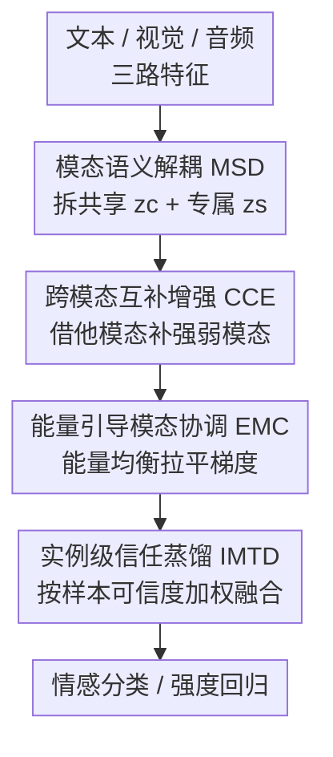

# Enhance-then-Balance Modality Collaboration for Robust Multimodal Sentiment Analysis

**会议**: CVPR 2026  
**论文**: [CVF Open Access](https://openaccess.thecvf.com/content/CVPR2026/html/He_Enhance-then-Balance_Modality_Collaboration_for_Robust_Multimodal_Sentiment_Analysis_CVPR_2026_paper.html)  
**代码**: https://github.com/kangverse/EBMC  
**领域**: 多模态VLM / 多模态情感分析  
**关键词**: 多模态情感分析, 模态不平衡, 能量模型, 弱模态增强, 鲁棒融合  

## 一句话总结
EBMC 用"先增强、再平衡"两阶段框架做多模态情感分析：先靠语义解耦和跨模态互补把被压制的音频/视觉弱模态喂饱，再用能量模型拉平各模态的优化动态、并在样本级按可信度重加权融合，从而在 MOSI/MOSEI/IEMOCAP 上拿到 SOTA，且在缺失模态场景下掉点远小于基线。

## 研究背景与动机
**领域现状**：多模态情感分析（MSA）把文本、音频、视觉三路异质信号融合起来预测人的情感强度/类别。主流路线分两支——表示学习（解耦共享/专属语义，如 MISA）和多模态融合（注意力、图、门控、层次化等），近年还流行融合前先做模态对齐。

**现有痛点**：这些方法几乎都隐含一个假设——三个模态贡献是均衡且可靠的。但实际上文本天然强势，音频和视觉的情感线索更弱、更稀疏、更容易被噪声污染，于是在联合训练里被文本"盖住"。

**核心矛盾**：模态强弱不均会引发**模态竞争**——强模态累积更大梯度、不断强化自己的表示，弱模态拿到的更新不足，时间一长形成"马太效应"：弱模态越来越被边缘化，在噪声/缺失的真实场景下尤其严重。已有的不平衡学习方法（按 loss 动态调学习率/梯度、Fisher 正则、解耦融合流、原型再平衡）只在优化层面压制强模态，却**没有给弱模态做语义层面的增强**。

**本文目标**：既要在表示层面把弱模态"喂饱"，又要在优化层面阻止强模态独大，还要在实例层面对噪声/缺失模态保持鲁棒。

**切入角度**：作者把"先把弱模态本身做强、再去平衡模态间的竞争"拆成串行两阶段——增强是因，平衡是果，顺序不能反；同时第一次把模态竞争问题搬到**能量模型（EBM）**的框架下，用一个可微的能量均衡目标隐式地做梯度再平衡。

**核心 idea**：Enhance-then-Balance——Stage I 用语义解耦 + 跨模态互补增强弱模态，Stage II 用能量引导协调 + 实例级信任蒸馏平衡贡献并抗噪。

## 方法详解

### 整体框架
EBMC 输入是文本、视觉、音频三路特征序列 $X_m \in \mathbb{R}^{T_m \times d_m}$（$m \in \{l, v, a\}$），输出情感强度回归值或情感类别。整条 pipeline 串成两个阶段：**Stage I 增强**先把每个模态的表示解耦成共享/专属两份，再用其他模态的互补成分把弱模态补强；**Stage II 平衡**把增强后的模态喂进能量协调模块拉平优化动态，再用实例级信任蒸馏按样本可信度调融合权重，最后送进情感分类器出预测。关键是顺序——先有干净且被补强的弱模态表示，能量协调和信任加权才有可平衡的对象。

### 关键设计

**1. 模态语义解耦 MSD：先把表示拆干净，别让强模态污染弱模态**

直接融合原始模态特征会引入语义干扰，让强模态盖过弱模态。MSD 给每个模态用两个轻量 MLP 子网络把表示 $z_m$ 拆成跨模态共享分量 $z^c_m = D^c_m(z_m)$ 和模态专属分量 $z^s_m = D^s_m(z_m)$（专属分量装的是韵律、面部表情这类只属于自己的细节）。为保证两份分得干净，作者上了三重约束：① **不变对齐**——用 InfoNCE 对比损失 $L_{inv} = -\sum_i \log \frac{\exp(\mathrm{sim}(z^c_i, z^c_{agg})/\tau)}{\sum_k \exp(\mathrm{sim}(z^c_i, z^c_k)/\tau)}$ 把各模态的共享分量在语义空间里拉近；② **专属去冗余**——最小化批内余弦相似度 $L_{dis} = \sum_{i \neq j} \mathrm{sim}(z^s_i, z^s_j)$，逼不同模态的专属分量互相正交；③ **单模态保活**——给每个专属分量挂一个单模态预测器 $T_m$，用 $L_{uni} = \frac{1}{|M|}\sum_m \ell(T_m(z^s_m), y)$ 保证拆出来的专属分量还留着预测能力。总损失 $L_{MSD} = L_{inv} + \lambda_1 L_{dis} + \lambda_2 L_{uni}$。这一步给后续协作提供了"干净、可控"的特征底座——没有它，T-SNE 上情感边界一团糊（消融里 F1 掉最多之一）。

**2. 跨模态互补增强 CCE：把别的模态的线索"喂"给弱模态**

MSD 保住了专属信息，但文本仍主导语义判别，视觉/音频编码的是更微妙的情感线索。CCE 专治弱模态信息量不够：对模态 $m$，它把自己的两份分量 $(z^c_m, z^s_m)$ 连同其余模态的共享与专属分量 $(z^c_{-m}, z^s_{-m})$ 一起喂进轻量增强网络 $G_m$，生成增强特征 $\tilde{z}_m = G_m(z^c_m, z^c_{-m}, z^s_{-m}, \epsilon)$，其中 $\epsilon$ 是可选的随机扰动用来增加特征多样性。训练目标双管齐下：

$$L_{CCE} = \mathbb{E}\lVert \tilde{z}_m - z_m \rVert_2^2 + \gamma\, \ell(f(\tilde{z}_m, z_{-m}), y)$$

重建项 $\lVert \tilde{z}_m - z_m \rVert_2^2$ 保住原始语义结构不被改飞，任务项保证补强后的特征对情感判别仍然有用。这样弱模态在不丢自身个性的前提下，吸收了来自强模态的互补语义，T-SNE 上散点重新聚回各自情感簇。

**3. 能量引导模态协调 EMC：用能量均衡隐式做梯度再平衡**

要治模态竞争，作者不去手动重加权 loss 或硬改梯度，而是把多模态协调搬进能量模型视角，构造一个结构化的多模态能量地形。每个模态定义一个整合了语义激活、任务难度、预测可靠性的能量势：

$$E(m) = \alpha\lVert z_m \rVert_2^2 + \beta\, \ell_m + \gamma\, u_m, \quad u_m = \mathbb{E}_i\big[H(p_i / T_m(y))\big]$$

其中 $u_m$ 是预测不确定性（用熵 $H(p) = -\sum_y p(y)\log p(y)$ 度量）。弱模态信号噪、判别弱，能量天然更高。协调靠两件事：① **能量差最小化**——强模态往往能量过低从而压制别人，于是加全局能量均衡目标 $L_{gap} = \sum_{i,j}(E(m_i) - E(m_j))^2$，逼所有模态收敛到平衡区间；② **能量梯度流**——显式做能量下降更新 $\Delta z_m = -\lambda \frac{\partial E(m)}{\partial z_m}$，形成负反馈：能量过低（过度自信/独大）的模态收到抑制性梯度，能量高的弱模态反而拿到更大的纠正梯度。完整目标 $L_{EMC} = L_{gap} + \delta\sum_m \lVert \frac{\partial E(m)}{\partial z_m} \rVert^2$，第二项惩罚过陡的能量梯度，让收敛更平稳。消融里 EMC 是掉点最狠的模块（去掉后 F1 在两库分别跌 2.43%/2.87%），可视化也显示去掉它文本贡献会冲到 50% 以上。

**4. 实例级模态信任蒸馏 IMTD：按样本可信度动态加权，扛噪声和缺失**

MSD/CCE 在表示层面缓解了不平衡，但传统融合在**实例级**仍怕噪声和缺失模态。IMTD 用概率嵌入估计每个样本上各模态的可信度。MSD 里的教师 $T_m$ 对样本 $i$ 输出一个预测分布，记其均值 $\mu^i_m$、方差 $\sigma^i_m$（方差即该模态在该样本上的预测不确定性）。把方差转成置信分 $c^i_m = \exp(-\sigma^i_m)$（方差越小越确定、置信越高），再用软归一化因子 $\rho^i_m = \frac{1}{\log(1 + \lVert \sigma^{2i}_m \rVert_1)}$ 压住方差过大的不稳定模态、平滑置信分布。最终自适应蒸馏权重 $\alpha^i_m = \frac{c^i_m \rho^i_m}{\sum_m c^i_m \rho^i_m}$。蒸馏时用置信加权的 KL 把学生的融合预测对齐教师：

$$L_{IMTD} = \sum_{m,i} \alpha^i_m\, \mathrm{KL}\big(\sigma(z^i_{fusion}/\tau) \,\Vert\, \sigma(z^i_{T_m}/\tau)\big)$$

它在样本级给可靠模态更高权重、压低噪声模态，正是缺失模态场景下鲁棒性的来源。

### 损失函数 / 训练策略
总目标把四个模块的损失加权相加：

$$L = L_{task} + \zeta L_{MSD} + \beta L_{CCE} + \gamma L_{EMC} + \eta L_{IMTD}$$

其中 $L_{task}$ 是标准交叉熵 $\frac{1}{N}\sum_i -y_i\log(\hat{y}_i)$。超参 $\lambda_1, \lambda_2, \beta, \gamma, \eta$ 全设 0.1，$\zeta$ 设 0.5（按验证集选）。特征沿用标准设置：文本用 BERT-base 取 768 维隐状态（IEMOCAP 上额外加 300 维 GloVe），视觉用 Facet 抽 35 维面部动作单元，音频用 COVAREP 抽 74 维低层声学描述子。每个阶段各训 100 epoch，batch 64，单卡 RTX 4090。⚠️ 原文同时把 $\beta/\gamma$ 既用于 CCE/EMC 内部又用作总损失权重，符号有复用，以原文为准。

## 实验关键数据

### 主实验
在 CMU-MOSI / CMU-MOSEI 上对比 10 个 SOTA，EBMC 几乎全指标领先，尤其 Acc-7（细粒度 7 分类）提升明显：

| 数据集 | 指标 | EBMC | 前 SOTA | 提升 |
|--------|------|------|---------|------|
| CMU-MOSI | Acc-7↑ | 50.34 | 46.50 (Semi-IIN) | +3.84 |
| CMU-MOSI | F1↑ | 87.79 | 86.60 (GLoMo) | +1.19 |
| CMU-MOSI | Acc-2↑ | 86.26/87.84 | 85.28/87.04 | — |
| CMU-MOSEI | Acc-7↑ | 57.32 | 55.89 (Semi-IIN) | +1.43 |
| CMU-MOSEI | F1↑ | 88.07 | 86.40 (GLoMo) | +1.67 |

跨任务迁移到 ERC（IEMOCAP 四情感 F1）也一致涨点，平均 86.35% vs 最强基线 DMD 85.08%（+1.27%），且在 Happy/Angry 类增益尤其明显。

### 消融实验
在 MOSI/MOSEI 上逐个删模块（报 F1 掉幅）：

| 配置 | MOSI F1 | MOSEI F1 | 说明 |
|------|---------|----------|------|
| EBMC（完整） | 87.79 | 88.07 | — |
| w/o MSD | 86.16 | 86.31 | 解耦没了，掉 1.63 / 1.76 |
| w/o CCE | 86.90 | 86.89 | 弱模态不增强，掉 0.89 / 1.18 |
| w/o EMC | 85.32 | 85.20 | **掉最多 2.43 / 2.87** |
| w/o IMTD | 86.77 | 87.09 | 实例信任没了，掉 1.02 / 0.98 |

### 缺失模态鲁棒性
在 CMU-MOSEI 六种不完整模态测试条件下（只给某一/某两个模态），EBMC 平均 F1 78.92，显著高于 CorrKD（74.02）、GCNet（73.54）、EUAR（74.50）。在最难的单视觉 {V}（70.05）、单音频 {A}（71.67）条件下优势尤其大——许多基线在单弱模态下崩盘，而 MSD/CCE 让模型即便缺模态也能学到有用信息。

### 关键发现
- **EMC 贡献最大**：去掉它掉点最狠（≈2.4–2.9% F1），可视化显示没有 EMC 时文本贡献在三个库都冲过 50%、压死音视频；加上后贡献分布明显拉平，Acc-2 同步上升——直接证明了"模态竞争"假设和能量再平衡的有效性。
- **增强与平衡互补**：MSD 让 T-SNE 情感边界变清晰但过渡区仍散，CCE 进一步把散点聚回情感簇——两者分别管"解耦干净"和"补强弱模态"，缺一不可。
- **IMTD 主要管鲁棒**：常规设置下掉幅最小（≈1%），但它是缺失模态场景下抗噪的关键，价值体现在 Tab. 3 而非主表。

## 亮点与洞察
- **把模态竞争翻译成能量地形**：用 EBM 的能量势 + 能量差最小化 + 能量梯度流，把"强模态独大"变成一个完全可微的均衡目标，不用手调每个模态的 loss 权重或硬改梯度——这套"隐式梯度再平衡"思路可迁移到任意多分支不平衡训练（多任务、多视图）。
- **"先增强后平衡"的因果顺序**：先把弱模态在表示层喂饱、再去平衡优化动态，避免了"还没把弱模态做强就强行均衡导致一起变差"，顺序本身是设计点。
- **实例级而非全局的信任加权**：IMTD 用教师方差估每个样本上每个模态的可信度，噪声样本上自动压低对应模态——比全局固定融合权重更细，是缺失/噪声鲁棒的直接来源。

## 局限与展望
- 四模块四套损失、超参众多（$\zeta, \beta, \gamma, \eta, \lambda_1, \lambda_2$ 等），虽然大多设 0.1，但能量函数里的 $\alpha, \beta, \gamma, \delta, \lambda$ 调参空间大，迁移到新数据可能需重调。
- 能量函数 $E(m)$ 把"表示幅度 + 任务难度 + 不确定性"线性相加，三项权重和物理含义偏经验，⚠️ 细节在 Appendix B，正文未充分论证为何这三项足以刻画模态"强弱"。
- 训练分两阶段、各 100 epoch，加上单模态教师 + 蒸馏，整体训练开销不小；论文未给与基线的训练/推理成本对比。
- 只验证了文本/音频/视觉三模态情感任务，能量协调能否扩展到更多模态或非情感任务（检索、问答）未知。

## 相关工作与启发
- **vs 不平衡学习（OGM/Fisher 正则/原型再平衡）**：它们都在优化层面按 loss 信号调学习率或梯度压制强模态，但不给弱模态做语义增强；EBMC 先用 MSD+CCE 在表示层把弱模态做强，再用 EMC 做平衡，"增强"是它们没有的一环。
- **vs 鲁棒/缺失模态方法（GCNet、CorrKD、UMDF）**：它们多靠自蒸馏或跨模态重建补缺失；EBMC 把鲁棒性直接嵌进核心学习——IMTD 在样本级抑制噪声模态，缺失场景平均 F1 反超它们 4–5 个点。
- **vs 解耦表示（MISA、DMD）**：同样拆共享/专属语义，但 EBMC 在解耦之上加了跨模态互补增强和能量协调，把"解耦"从终点变成"增强—平衡"流水线的起点。

## 评分
- 新颖性: ⭐⭐⭐⭐ 首次用能量模型框架隐式做模态梯度再平衡，"增强后平衡"的两阶段拆法也有想法。
- 实验充分度: ⭐⭐⭐⭐ 三库 + ERC 迁移 + 六种缺失模态 + 逐模块消融 + T-SNE/贡献可视化，相当扎实。
- 写作质量: ⭐⭐⭐⭐ 方法脉络清晰、公式齐全，但能量函数与损失权重符号有复用、部分细节甩到附录。
- 价值: ⭐⭐⭐⭐ 弱模态被压制是多模态领域共性痛点，能量再平衡的思路可迁移性强。

<!-- RELATED:START -->

## 相关论文

- [\[CVPR 2026\] EBMC: Enhance-then-Balance Modality Collaboration for Robust Multimodal Sentiment Analysis](ebmc_multimodal_sentiment_analysis.md)
- [\[CVPR 2026\] Factorize, Reconstruct, Enhance: A Unified Framework for Multimodal Sentiment Analysis](factorize_reconstruct_enhance_a_unified_framework_for_multimodal_sentiment_analy.md)
- [\[CVPR 2026\] CICA: Coupling Confidence-Aware Pretraining with Confidence-Informed Attention for Robust Multimodal Sentiment Analysis](cica_coupling_confidence-aware_pretraining_with_confidence-informed_attention_fo.md)
- [\[CVPR 2026\] Conflict-Aware Adaptive Cross-Reconstruction for Multimodal Sentiment Analysis](conflict-aware_adaptive_cross-reconstruction_for_multimodal_sentiment_analysis.md)
- [\[CVPR 2026\] Prototype-as-Prompt: Multimodal Sentiment Prototypes Endowing Large Language Models the Capability to Perform Multimodal Sentiment Analysis](prototype-as-prompt_multimodal_sentiment_prototypes_endowing_large_language_mode.md)

<!-- RELATED:END -->
