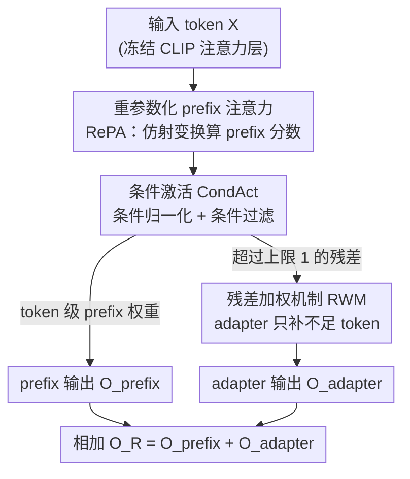

# Enhancing Continual Learning of Vision-Language Models via Dynamic Prefix Weighting

**会议**: CVPR 2026  
**arXiv**: [2604.18075](https://arxiv.org/abs/2604.18075)  
**代码**: https://github.com/YonseiML/dpw (有)  
**领域**: 多模态VLM / 持续学习 / 参数高效微调  
**关键词**: 持续学习, prefix-tuning, token 级加权, 适配器, CLIP

## 一句话总结
针对 VLM 持续学习中现有 PEFT 方法只在「样本级」给 prefix/adapter 加权、对一个样本内所有 token 一视同仁的问题，DPW 用一个 gating 模块（RePA + CondAct）为每个 token 算出细粒度 prefix 权重、并让 adapter 只在 prefix 权重不够用时以「残差」方式补足，在 MTIL / ODCL-CIL 两个 domain-class 增量基准上取得 SOTA。

## 研究背景与动机
**领域现状**：让 CLIP 这类视觉-语言模型（VLM）持续学习一串下游任务时，全量微调代价太高，主流转向参数高效微调（PEFT）——冻结骨干，靠 prefix-tuning（在注意力里拼接可学习 prompt 向量）或 adapter（轻量旁路）把任务知识注入。为了缓解灾难性遗忘，近期工作还会**按输入样本动态调节**新增参数的影响力（如 MoE-Adapters 用 router、DIKI 用 cross-attention 给 prefix 配权）。

**现有痛点**：这些加权机制几乎都停留在**样本级**——对一个样本内的所有 token 一视同仁，注入等量的任务信息。但已有研究表明，按每个 token 的任务相关度动态调节注入量能显著提升效果，缺少 token 级加权是一个根本性缺陷。更糟的是，prefix-tuning 普遍用注意力的 query-key 点积来算 prefix 权重，而预训练注意力倾向于捕捉**全局上下文**，会把任务相关与不相关的 token 在特征空间里拉近：论文实测，经过 query projection 后，任务相关 token 与不相关 token 的余弦相似度从 0.02 飙到 0.47，甚至超过相关 token 之间的相似度，token-wise 的区分被抹平。

**核心矛盾**：一边要 token 级的细粒度调制，一边预训练注意力投影本身就在「模糊 token 区分」，两者直接冲突；同时还要在「prefix 的激进改写」与「adapter 的保守补充」之间权衡，单用 sigmoid 又会让任务信息过度主导、损害 zero-shot。

**本文目标**：(1) 让每个 token 从 prefix 和 adapter 拿到「恰当量」的任务信息；(2) 让 prefix 与 adapter 形成有效协同。

**切入角度**：与其沿用「query-key 点积 + softmax」这套会模糊 token 的旧管线，不如把算分和归一化两步都换掉——直接从输入 token 用仿射变换算 prefix 分数，并用一种允许「总权重在 [0,1] 内浮动」的激活替代 softmax。

**核心 idea**：用 token 级、可浮动总量的 prefix 加权（gating 模块）取代样本级、强制归一的注意力加权，并把「超出上限的那部分需求」作为残差交给 adapter 处理。

## 方法详解

### 整体框架
DPW 在冻结的 CLIP 注意力层里插入一个 DPW 模块，对每个输入 token 同时调制 prefix 输出和 adapter 输出。输入是某层的 token 表示 $X\in\mathbb{R}^{m\times d}$，输出是融合了 prefix 与 adapter 信息的 token 表示。流程分三步：先用 **RePA** 把传统的 query-key 点积简化为对输入 token 的一次仿射变换，直接算出 prefix 分数矩阵 $S_{XP}$；再用 **CondAct** 把分数转成权重——条件归一化让每个 token 的 prefix 总权重灵活地不超过 1，条件过滤再剔掉不相关 prefix；最后 **RWM** 把「prefix 权重超过 1 上限的残差部分」作为缩放系数施加到 adapter 输出上，让 adapter 只补充那些 prefix 没喂饱的 token。三部分的输出按 $O_{R_i}=O_{\text{prefix}_i}+O_{\text{adapter}_i}$ 相加。

### 关键设计

**1. RePA：把 query-key 点积重参数化为一次仿射变换，直接从 token 算 prefix 相关度**

传统 prefix-tuning 靠 $S_{XP}^{(i)}=Q_i(K_{P_i})^{\top}$ 算 prefix 分数，但预训练 query/key 投影对新任务缺乏任务知识，算出的分数抓不准 token 的任务相关度；若给每个任务单独学一套 query-key 投影，参数量爆炸（论文实测训练 $W^Q,W^K$ 要 228M 参数）且下游数据少、容易过拟合。RePA 的做法是把点积里「依赖输入 $X$ 的项」和「常数项」拆开重组：$S_{XP}^{(i)}=X\,W_i^{G}+B_i^{G}$，即把原注意力投影与可学习 prefix key $P_K$ **合并成一组复合参数** $W_i^{G},B_i^{G}$ 直接训练。这样只对 prefix 这条支路学任务专属投影、把原始投影矩阵原封不动留给预训练知识，既保留 zero-shot 能力又能给真正任务相关的 token 打更高分（图 3 显示分数图更贴合物体区域），参数量只要 30.8M

**2. CondAct：用条件归一化 + 条件过滤替代 softmax，让 prefix 总权重可在 [0,1] 内浮动**

softmax 强制每个 token 的 prefix 权重和恒为 1，无法体现「不同 token 需要的注入量不同」；DIKI 给 prefix 单独做 softmax 虽避开了对预训练分数的干扰，但仍是固定总量。CondAct 先对分数过 sigmoid $\sigma(\cdot)$，再分两步处理。条件归一化（Eq. 8a）：当 $\sum_k\sigma(s_{ijk})\ge 1$ 时除以该和归一、否则直接用 sigmoid 值——于是总权重 $\sum_k g_{ijk}$ 只在「会超过 1 时」被压回 1、不足 1 时保持原样，相当于给每个 token 一个**可浮动的上界**，既防止任务信息过度主导（缓解 forward forgetting、保住 zero-shot），又允许 token 间差异化。条件过滤（Eq. 8b）：$\widetilde{g}_{ijk}=g_{ijk}\cdot\mathbb{I}(g_{ijk}\ge\text{cutoff})$ 剔除不相关 prefix；cutoff 由每个 prefix 与 [CLS] token 注意力分数的高斯分布动态确定——$\text{cutoff}=1-\sigma(\log\varphi(s_{i,\text{cls},k};\mu_t,\sigma_t^2))$，似然越高 cutoff 越小（贡献越完整），实现 token 级、prefix 级双重自适应的剔除

**3. RWM：把「prefix 想要但被上限砍掉的那部分」作为残差喂给 adapter**

CondAct 把 prefix 总权重卡在 1 以内保护了 zero-shot，但对任务相关度高、本该更强适配的 token 又限制了进一步提升。RWM 的洞察是：被上限砍掉的「溢出需求」恰好是衡量「这个 token 还差多少适配」的天然信号。它定义残差 $\Delta_{ij}=\max(0,\sum_k\sigma(s_{ijk})-1)$——只有当 sigmoid 后的 prefix 权重和超过 1 时 $\Delta$ 才非零，再用它逐元素缩放 adapter 输出 $O_{\text{adapter}_i}=\Delta_i\odot\mathcal{E}_i^t(X)$。这样 adapter **只对 prefix 没喂饱的 token 起作用**，不需要额外的 router 就实现了 token 级的 adapter 加权，把 prefix 的激进改写与 adapter 的保守补充结合起来。adapter 用 LoRA 实现，共享下投影 $D$ 用 $W^V$ 的 top-k 左奇异向量初始化并冻结、每任务学独立上投影 $U_t$，把 adapter 约束在 $D$ 的行空间内以复用预训练知识

### 损失函数 / 训练策略
骨干 CLIP 全程冻结，只训练 RePA 的复合参数 $W^G,B^G$、CondAct 相关统计量、以及每任务的 LoRA 上投影。论文还给出参数高效变体 Ours†：每个头只用对应子维度 $d/h'$ 算 prefix 分数（参数量按 $h'$ 倍缩减）并用更低 rank 的 LoRA，把可训练参数从 30.8M 进一步压到 4.6M。

## 实验关键数据

### 主实验
两个 domain-class 增量基准均含 11 个数据集、1201 个类。MTIL 推理时可用 task ID，ODCL-CIL 不可用（更难）。指标 Transfer（zero-shot 泛化，量化 forward forgetting）、Avg.（全程平均）、Last（结束时平均）。

| 基准 | 方法 | 额外数据 | 参数 | Trans. | Avg. | Last |
|------|------|---------|------|--------|------|------|
| MTIL Order I | Zero-shot | - | – | 69.4 | 65.3 | 65.3 |
| MTIL Order I | DIKI | × | 1.8M | 68.7 | 76.3 | 85.1 |
| MTIL Order I | MoE-Adapter | × | 59.6M | 68.9 | 76.7 | 85.0 |
| MTIL Order I | GIFT（全微调+扩散数据） | ✓ | 149.6M | 69.3 | 77.3 | 86.0 |
| MTIL Order I | **Ours†** | × | 4.6M | 70.0 | 78.6 | 87.6 |
| MTIL Order I | **Ours** | × | 30.8M | **70.4** | **79.3** | **88.3** |
| ODCL-CIL | DPeCLIP | × | - | 69.1 | 76.1 | 84.6 |
| ODCL-CIL | **Ours** | × | - | **70.4** | **78.6** | **86.6** |

Ours 仅用 30.8M 参数（不需额外数据）即在两个基准全指标超过包含全微调 + 扩散生成数据的 GIFT；连压到 4.6M 的 Ours† 也优于所有对比方法。

### 消融实验
| 配置 | Trans. | Avg. | Last | 说明 |
|------|--------|------|------|------|
| 全去掉（baseline） | 68.1 | 76.6 | 85.9 | 传统 prefix-tuning |
| +RePA | 68.0 | 76.8 | 86.4 | 单加 RePA，受 softmax 限制提升有限 |
| +CondAct | 69.5 | 77.8 | 86.8 | 单加 CondAct |
| +RePA+CondAct | 69.9 | 78.9 | 87.9 | 两者协同 |
| **+RePA+CondAct+RWM（Full）** | **70.4** | **79.3** | **88.3** | 完整 DPW |

CondAct 内部拆解（Table 5）：Sigmoid 起步 68.0/76.8/86.4 → 加 CondNorm 升到 69.9/79.0 → 再加 Filtering 到 70.4/79.3/88.3，Transfer 提升最明显（68.0→70.4），说明可浮动总量主要在防 forward forgetting。

### 关键发现
- RePA 单独上几乎不涨 Avg.（76.6→76.8），因为 softmax 仍强制和为 1、限制了 token 间差异；必须配 CondAct 才能把细粒度分数释放出来——三个模块是协同关系而非各自独立加分。
- CondAct 对 Transfer 贡献最大（保 zero-shot），RWM 对 Last 与 Transfer 都有提升（补足高需求 token）。
- RWM vs 传统路由（Table 6）：直接把 prefix 长度 ×2（39.6M）反而掉到 69.5/78.4/87.6，可学习 router（32.7M）也只到 69.9/79.0/88.1，RWM（30.8M）以更少参数拿到最高分——说明「残差驱动 adapter」比「堆 prefix 或学 router」更高效。
- RePA vs 传统注意力（Table 4）：训练 $W^Q,W^K$ 要 228M 参数才到 68.9/85.9，而 RePA 用 30.8M 即达 70.4/88.3；且分数对 token 用 $X W^G$（而非 $Q W^G$）更优。

## 亮点与洞察
- **把「被上限砍掉的溢出需求」变成有用信号**：RWM 不是另起炉灶给 adapter 设计加权，而是直接复用 CondAct 归一化时丢弃的残差 $\max(0,\sum\sigma-1)$，一个量同时承担「限制 prefix」和「驱动 adapter」两件事，无需额外 router，设计极简却自洽。
- **用线性代数把两步压成一步**：RePA 看似只是工程化简，但它点破了「query-key 点积 + 可学习 $P_K$」本质可重参数化为对 token 的一次仿射变换，从而只在 prefix 支路学任务投影、不碰预训练投影，是「既要任务适配又要保 zero-shot」的巧解。
- **诊断到位**：用 cosine 相似度（0.02→0.47）和 UMAP 量化「query projection 抹平 token 区分」，把动机从「感觉应该 token 级」坐实成可测现象，这个分析本身可迁移到任何依赖预训练注意力做 token 加权的方法上。
- **可浮动总量上界**这一思路（sum≤1 而非 sum=1）可迁移到其他 prompt/prefix 加权场景，平衡「注入足够」与「不过度主导」。

## 局限与展望
- 方法绑定 prefix-tuning + LoRA adapter 的具体形式，cutoff 依赖「[CLS]-prefix 注意力分数服从高斯」的经验假设（论文称 empirically observed），换骨干或换模态时该假设是否成立未验证。⚠️ 高斯建模的稳健性以原文为准。
- 评测局限在 CLIP 的图像分类式 CL（MTIL/ODCL-CIL），未涉及生成式 VLM 或检测/分割等结构化输出任务，token 级加权在那些任务上的收益未知。
- ODCL-CIL 仍依赖 baseline 的 task-identification 策略（按任务分布似然选参数），task ID 估计错误时的鲁棒性未单独分析。
- 改进方向：把可浮动上界从固定的 1 改成可学习/任务自适应；探索 RWM 残差思想用于更一般的「主路径 + 旁路补充」架构。

## 相关工作与启发
- **vs DIKI**：DIKI 用 cross-attention 给 prefix 单独 softmax、强制每个样本 prefix 总权重为 1（样本级、固定总量）；DPW 用 RePA 直接从 token 算分、用 CondAct 让总量在 [0,1] 浮动（token 级、可变总量），并额外引入 adapter 残差，细粒度更高。
- **vs MoE-Adapter**：MoE-Adapter 仅靠 [CLS] token 路由、给各 adapter 等权且和恒为 1（59.6M 参数）；DPW 不用 router，靠 prefix 残差驱动 adapter，参数更省（30.8M）效果更好。
- **vs ZSCL / GIFT**：二者全量微调整个 CLIP 并依赖额外参考数据集（ZSCL 蒸馏、GIFT 用扩散模型生成数据），训练效率低；DPW 冻结骨干、无需额外数据即超过它们。
- **vs DPeCLIP / CoLeCLIP**：同属 prompt-based，但它们仍受「prompt 未训练域上性能退化」之苦；DPW 通过 prefix-adapter 动态协同兼取两者之长，在更难的 ODCL-CIL 上领先。

## 评分
- 新颖性: ⭐⭐⭐⭐ token 级可浮动加权 + 残差驱动 adapter 的组合是真创新，RePA 重参数化也巧
- 实验充分度: ⭐⭐⭐⭐ 两基准 11 数据集 + 模块/组件双层消融 + 多角度诊断分析，较充分
- 写作质量: ⭐⭐⭐⭐ 动机推导清晰、公式完整，诊断实验有说服力
- 价值: ⭐⭐⭐⭐ 参数省、效果 SOTA，token 级加权与残差思想对 PEFT 持续学习有借鉴意义

<!-- RELATED:START -->

## 相关论文

- [\[CVPR 2026\] On Token's Dilemma: Dynamic MoE with Drift-Aware Token Assignment for Continual Learning of Large Vision Language Models](on_tokens_dilemma_dynamic_moe_with_drift-aware_token_assignment_for_continual_le.md)
- [\[CVPR 2026\] Towards Dynamic Modality Alignment in Multimodal Continual Learning](towards_dynamic_modality_alignment_in_multimodal_continual_learning.md)
- [\[CVPR 2026\] Continual Learning with Vision-Language Models via Semantic-Geometry Preservation](continual_learning_with_vision-language_models_via_semantic-geometry_preservatio.md)
- [\[CVPR 2026\] PACT: Phase-Like Transition Constraints in Adapter-Based Continual Learning of Vision-Language Models](pact_phase-like_transition_constraints_in_adapter-based_continual_learning_of_vi.md)
- [\[ICLR 2026\] Enhanced Continual Learning of Vision-Language Models with Model Fusion](../../ICLR2026/multimodal_vlm/enhanced_continual_learning_of_vision-language_models_with_model_fusion.md)

<!-- RELATED:END -->
