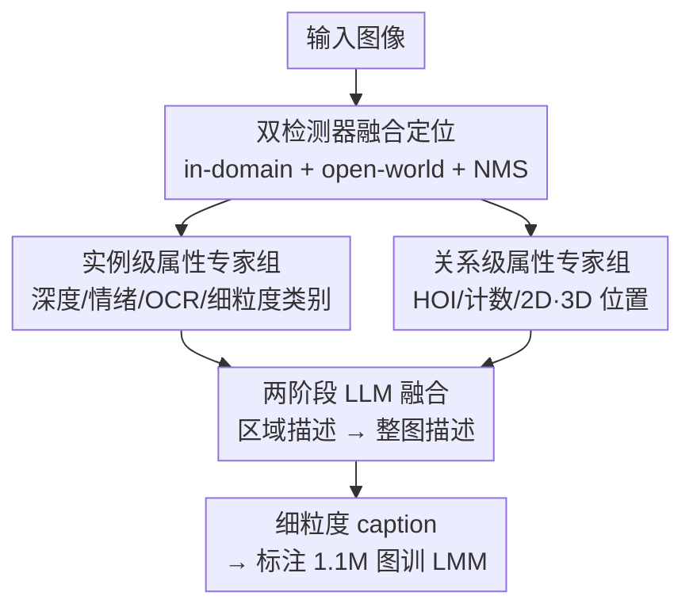

# Enhancing Descriptive Captions with Visual Attributes for Multimodal Perception

**会议**: CVPR 2026  
**论文**: [CVF Open Access](https://openaccess.thecvf.com/content/CVPR2026/html/Sun_Enhancing_Descriptive_Captions_with_Visual_Attributes_for_Multimodal_Perception_CVPR_2026_paper.html)  
**代码**: https://github.com/syp2ysy/CapWorkflow  
**领域**: 多模态VLM / 图像描述  
**关键词**: 描述性图像描述, 视觉专家模型, 细粒度属性, 3D空间关系, LMM 预训练数据  

## 一句话总结
本文提出 Cap-Workflow，用一组现成的视觉专家模型（检测、深度、情绪、OCR、细粒度识别、HOI）从图像里抽出"通用 LMM 看不到"的细粒度属性与物体关系，再用 LLM 把这些属性两阶段融合成又准又细的图像描述，从而把 1.1M 张图重新标注成更优质的 LMM 预训练语料，在 14 个基准上提升 LLaVA-v1.5/NeXT 的感知与推理能力。

## 研究背景与动机
**领域现状**：训练大型多模态模型（LMM）高度依赖"图像—文本"的描述性 caption 做视觉—语言对齐。当前 caption 来源主要两条路：一是人工标注（COCO、LAION），二是用强 LMM 蒸馏（ShareGPT4V、DenseFusion 用 GPT-4V/InternVL2 生成）。

**现有痛点**：两条路都不够。人工 caption 倾向只描述最显著的物体，漏掉细粒度细节、物体数量和上下文关系——例如 COCO 对一张滑板图只写"一个有绿色纹身的赤膊男子在滑板"，场景里的其他物体和空间结构全丢了。而 LMM 生成的 caption 虽然比人工详细，却仍会**整体漏掉某些物体**（论文 Fig.1 里 Object 6 被所有 LMM 忽略），更关键的是几乎拿不到**3D 空间关系**、精确 **OCR**、**细粒度类别**（具体是哪种动物/飞机/地标）这类信息，还常伴随幻觉。

**核心矛盾**：通用 LMM 是"全才但不精"——它没有被专门训练去估深度、识别物种、读文字、判断人物交互，所以这些能力是它的盲区；而这些恰恰是复杂视觉推理最需要的精确信号。让一个通用模型同时把"全、准、细"都做好，本身就难。

**本文目标**：在不依赖闭源大模型、不靠昂贵人工的前提下，造出**信息更全、属性更细、关系更准**的图像描述，并验证这种 caption 真的能提升下游 LMM。

**切入角度**：作者的观察是——人类理解一张图，其实是先用各种"专门视觉能力"（看远近、认物种、读文字、判断谁在和谁互动）感知，再用认知把这些线索组织成语言。那就让**视觉专家模型复刻这些专门能力**、让 **LLM 模拟认知整合**，分工协作。

**核心 idea**：用"现成视觉专家抽属性 + LLM 两阶段融合"代替"单个 LMM 一口气写 caption"，把通用模型看不见的细粒度属性和 3D 关系显式注入描述。

## 方法详解

### 整体框架
Cap-Workflow 是一条"先感知、后组织"的标注流水线：输入一张图，输出一段细致准确的描述性 caption。它先用一个鲁棒的检测器把图里的物体框出来，然后分两支并行抽属性——一支抽**实例级属性**（每个物体本身的尺寸、深度、情绪、文字、细粒度类别），一支抽**关系级属性**（物体之间的 HOI、计数、2D/3D 位置关系）。接着进入两阶段语言融合：第一阶段 LLM 把每个物体的属性和一段基础 caption（来自 InternVL2-26B）合成**区域级描述**；第二阶段 LLM 再把这些区域描述与关系级属性、定位信息拼成一段**完整的整图 caption**。整条流水线只用开源视觉专家和开源 LLM。

### 关键设计

**1. 双检测器融合定位：先把物体框准，后面属性才有附着点**

整条流水线的所有属性都是"挂在框上"的——深度要在框内区域平均、情绪要判断框是否为 person、细粒度识别要在框内裁剪后做，所以定位的召回与去重直接决定上限。作者不依赖单一检测器，而是把 **in-domain 检测模型**和 **open-world 检测模型**的框合并：保留置信度 > 0.5 的框以兼顾常见类与开放词汇类，再用 NMS（IoU 阈值 0.75）消除重叠冗余框。这一步既保证了"通用 LMM 容易漏掉的物体"也能被框出来（提升物体多样性），又通过 NMS 控制噪声。⚠️ 作者也承认检测引入的噪声会干扰物体识别、拖累 POPE（幻觉评测）。

**2. 实例级属性专家组：把每个物体"是什么、什么状态"补全到通用模型看不见的粒度**

通用 LMM 的最大盲区是细粒度——它能说"一只鸟"，但说不出是哪个物种。Cap-Workflow 为此挂上一组专家：检测框面积给出 **size**；把深度图在框内区域平均得到 **depth**（这是后面算 3D 关系的基础）；若框被标为 person 就用情绪模型给出 **emotion**；OCR 模型抽取框内**文字内容与位置**；以及一组**细粒度识别模型**覆盖动物、植物、食物、logo、飞机、地标、名人——其中动物/植物类目分别达 891k / 427k 物种。作者把这些细粒度类别视作"外部世界知识"，让图中文本内容与人类基本认知对齐（比如认出是 F-16A/B 而不只是"军用喷气机"）。这部分正是"全才模型不精"被专家补齐的核心。

**3. 关系级属性专家组：用专家显式给出通用模型几乎拿不到的物体间关系（尤其 3D）**

caption 要支撑场景结构理解，就必须有物体之间的关系，而这是 LMM 最弱的一环。作者抽三类关系：用 **HOI 模型**判断人与物的交互（P2O relation），补全 caption 没提到的动作事件；用检测框给出 **2D 绝对位置**（左/右/中/左上等）和 **2D 相对位置**（A 在 B 旁边/附近）以及全图 **count**；最关键的是 **3D 相对位置**——利用两个物体的深度差判断"相对相机，A 在 B 前面/后面"。3D 关系靠深度差计算、不靠语言模型猜，这正是通用 LMM 普遍缺失、却对复杂推理（如 GQA）很关键的信号。

**4. 两阶段 prompt 引导 LLM 融合：先合区域、再合整图，把零散属性组织成连贯语言**

属性抽出来是结构化碎片，得有人把它写成自然语言且不乱编。作者用两阶段 LLM（Qwen2-72B-AWQ）+ 结构化 prompt 完成。**第一阶段（区域描述）**：把某个物体的属性和 InternVL2-26B 给的基础 caption 喂给 LLM，用受控 prompt 引导它把类别、颜色、纹理、位置、交互融进连贯句子——对细粒度类别还加了**条件约束**避免幻觉：

> "{cat_name} 出现在该区域且 {animal_name} 是 {cat_name} 的子类；则在 caption 中使用 {animal_name}；否则不要提及 {animal_name}"

即只有当细粒度标签确实属于检测出的粗类时才写进去，从机制上压制乱编。**第二阶段（整图描述）**：把关系级属性、区域定位信息（用于 grounding）和区域 caption 合并成最终整图 caption；如注入 3D 关系时用模板 "Relative to the camera, the {cat0} in {bbox0} is {3d_relation} the {cat1} in {bbox1}."，其中 `{3d_relation}` 由深度差算出。两阶段拆分让"局部精确"和"全局组织"各司其职，比一次性生成更可控。

### 损失函数 / 训练策略
Cap-Workflow 本身是**标注引擎**，不训练新模型；它的产物是数据集 **Cap-Workflow-1M**（来自 DenseFusion 的 100 万张多样图像）和 **Cap-Workflow-118K**（11.8 万张 COCO 复杂场景图）。下游验证用 LLaVA-v1.5 与 LLaVA-NeXT，采用两阶段训练：(1) 预训练阶段——LLaVA-v1.5 只训 projector 后再放开视觉编码器最后 12 层，LLaVA-NeXT 则整模型可训；(2) 指令微调阶段——分别用开源 LLaVA-mix-665K 与 LLaVA-NeXT-data，**不改 SFT 数据**，从而把增益干净地归因到预训练 caption 质量。

## 实验关键数据

### 主实验
不同 caption 标注方法在相同下游模型上的对比（数值越高越好）。用 Cap-Workflow caption 预训练在多数基准上最优：

| 下游模型 | 标注方法 | GQA | ScienceQA | MMBench | MM-Vet | SEED-Bench |
|----------|----------|-----|-----------|---------|--------|-----------|
| LLaVA-v1.5-7B | +ShareGPT4V | 63.3 | 68.4 | 68.8 | 37.6 | 61.9 |
| LLaVA-v1.5-7B | +DenseFusion | 64.0 | 69.3 | 69.2 | 37.8 | 62.3 |
| LLaVA-v1.5-7B | **+Cap-Workflow** | **64.2** | **71.0** | 69.2 | **38.2** | **64.3** |
| LLaVA-NeXT-7B | +IT | 64.9 | **71.3** | 68.6 | 38.1 | 65.4 |
| LLaVA-NeXT-7B | **+Cap-Workflow** | **65.2** | 71.2 | **69.3** | **40.1** | **65.7** |

VQA 基准（LLaVA-v1.5/NeXT 用 Cap-Workflow-1M 预训练 vs 基线）：

| 模型 | VQAv2 | DocVQA | GQA | TextVQA | ScienceQA | Ai2d |
|------|-------|--------|-----|---------|-----------|------|
| LLaVA-v1.5 基线 | 78.5 | 28.1 | 62.0 | 58.2 | 66.8 | 55.5 |
| LLaVA-v1.5 (Ours) | **80.9** | **39.1** | **64.2** | **61.4** | **71.0** | **59.4** |
| LLaVA-NeXT 基线 | 81.8 | 74.4 | 64.2 | 64.9 | 70.1 | 66.6 |
| LLaVA-NeXT* (Ours) | **82.4** | **78.8** | **65.2** | 64.8 | **71.2** | **71.2** |

### 消融实验
固定 118K COCO 图、换不同标注方法（人工 / 通用 LMM / Cap-Workflow），看下游表现：

| 下游模型 | 标注方法 | OKVQA | GQA | ScienceQA | TextVQA | MM-Vet | SEED-Bench |
|----------|----------|-------|-----|-----------|---------|--------|-----------|
| LLaVA-v1.5 | + 人工 | 54.9 | 62.4 | 68.6 | 58.1 | — | 61.1 |
| LLaVA-v1.5 | + InternVL2-26B | 54.7 | 63.0 | 69.1 | 58.4 | 32.7 | 61.8 |
| LLaVA-v1.5 | + LLaVA-NeXT-34B | 55.7 | 62.9 | 68.8 | 58.7 | 33.0 | 61.7 |
| LLaVA-v1.5 | **+ Cap-Workflow** | **56.9** | **63.2** | **69.8** | **58.9** | **33.9** | **62.0** |
| LLaVA-NeXT | + InternVL2-26B | 54.3 | 65.1 | 70.1 | 61.2 | 37.3 | 64.7 |
| LLaVA-NeXT | **+ Cap-Workflow** | **56.7** | **65.2** | **72.0** | **62.0** | **37.8** | **65.0** |

属性丰富度的人工评测（100 张图、5–10 名评估者，记录属性在 caption 中的出现比例）也显示 Cap-Workflow 在空间关系（0.75）、细粒度（0.24）、OCR（0.48）、情绪（0.47）、位置（0.81）上全面领先 InternVL2 与 LLaVA-NeXT。

### 关键发现
- **物体属性专家主要拉动 OKVQA/TextVQA**：相比 InternVL2 标注，Cap-Workflow 加入的细粒度对象属性显著提升这两类需要"认清具体是什么"的任务。
- **关系属性主要拉动 GQA**：显式注入物体间关系增强了对多物体场景结构的理解，GQA（视觉推理）涨点明显。
- **3D 关系是差异化亮点**：通用 LMM 几乎拿不到、Cap-Workflow 用深度差稳定给出，正是复杂场景推理受益的来源。
- **诚实记录的短板**：TextVQA 受限于开源 OCR 模型和高阈值（漏掉细小文字）；MMBench-CN 因 1M 语料缺中文而偏弱；POPE（幻觉）因检测噪声略受干扰——作者把降噪与多语言列为未来工作。

## 亮点与洞察
- **"全才补丁"思路很实用**：与其逼一个通用 LMM 同时做好"全、准、细"，不如承认它有盲区，用一堆便宜的专门模型把盲区一块块补上——这个解耦让每个能力都用最擅长的模型实现，且全程开源、可扩展（作者明说社区可继续往里加新专家）。
- **3D 关系靠深度差而非语言猜**：把"A 在 B 前面"建立在两物体深度差这一物理量上，绕开了 LMM 凭语言臆测空间关系的幻觉，是值得迁移到任何需要空间标注场景的 trick。
- **条件 prompt 压制细粒度幻觉**："是子类才写、否则不提"这条约束很小但很关键，等于让 LLM 在融合时不敢乱编不确定的细粒度标签。
- **方法即数据，数据即增益**：整套引擎最终落在"造更好的预训练 caption"上，且通过冻结 SFT 数据干净地证明了增益来自 caption 质量本身。

## 局限与展望
- 作者承认：开源 OCR 受阈值限制漏细小文字（TextVQA 受限）；1M 语料缺中文（MMBench-CN 弱）；检测噪声会引入物体识别误差（POPE 略降）。
- 自己发现的局限：流水线串了检测、深度、情绪、OCR、多个细粒度识别、HOI、两次 72B LLM 调用，**标注成本与误差传播都不小**——上游检测错框会沿管线一路放大；论文未给出标注一张图的时间/算力开销与误差传播分析。
- 改进思路：给关系/细粒度属性加置信度并在融合阶段做加权或拒绝，缓解噪声；引入多语言 LLM 与中文 OCR 补齐中文短板；把专家组做成可插拔接口按场景增删。

## 相关工作与启发
- **vs ShareGPT4V / DenseFusion**：它们靠单个强 LMM（GPT-4V/InternVL2）蒸馏 caption，scalability 好但受限于该模型的盲区（漏 3D 关系、细粒度、精确 OCR）；本文用"专家抽属性 + LLM 融合"显式补上这些维度，属性丰富度与下游表现都更高。
- **vs 人工标注（COCO-Captions / DCI / DOCCI）**：人工准但贵且偏简，常只描述显著物体；本文无需人工、自动产出更全更细的描述。
- **vs ReCap / IT 等再标注方法**：同为 caption 增强，但本文的差异在于把"专门视觉能力"模块化地注入，尤其 3D 空间关系这一通用方法普遍缺失的维度。

## 评分
- 新颖性: ⭐⭐⭐⭐ 用现成视觉专家+LLM 两阶段融合补齐通用 LMM 盲区的思路清晰实用，3D 关系注入是亮点，但单个组件均为现成模型。
- 实验充分度: ⭐⭐⭐⭐⭐ 14 个基准、两种下游模型、与 6 种标注方法对比 + 人工属性评测 + 案例分析，且诚实记录短板。
- 写作质量: ⭐⭐⭐⭐ 动机和流水线讲得清楚，属性表完整；部分指标命名与表格略乱。
- 价值: ⭐⭐⭐⭐ 产出可直接用的 1.1M 高质量预训练语料与开源引擎，对训练 LMM 的数据侧很有实用价值。

<!-- RELATED:START -->

## 相关论文

- [\[CVPR 2026\] Same or Not? Enhancing Visual Perception in Vision-Language Models](same_or_not_enhancing_visual_perception_in_vision-language_models.md)
- [\[CVPR 2026\] DiG: Differential Grounding for Enhancing Fine-Grained Perception in Multimodal Large Language Models](dig_differential_grounding_for_enhancing_fine-grained_perception_in_multimodal_l.md)
- [\[CVPR 2026\] Act2See: Emergent Active Visual Perception for Video Reasoning](act2see_emergent_active_visual_perception_for_video_reasoning.md)
- [\[CVPR 2026\] ViKey: Enhancing Temporal Understanding in Videos via Visual Prompting](vikey_enhancing_temporal_understanding_in_videos_via_visual_prompting.md)
- [\[CVPR 2026\] CodePercept: Code-Grounded Visual STEM Perception for MLLMs](codepercept_code-grounded_visual_stem_perception_for_mllms.md)

<!-- RELATED:END -->
