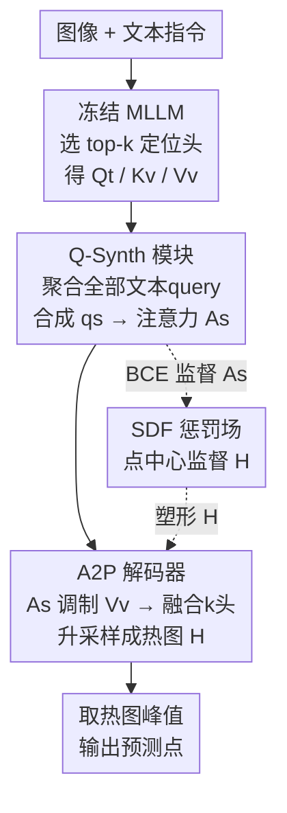

# Enhancing Part-Level Point Grounding for Any Open-Source MLLMs

**会议**: CVPR 2026  
**论文**: [CVF Open Access](https://openaccess.thecvf.com/content/CVPR2026/html/Jhang_Enhancing_Part-Level_Point_Grounding_for_Any_Open-Source_MLLMs_CVPR_2026_paper.html)  
**代码**: 无（未公开）  
**领域**: 多模态VLM  
**关键词**: 部件级点定位, MLLM注意力, 冻结骨干, 查询合成, 机器人感知  

## 一句话总结
不微调任何 MLLM 参数，仅在中间层"合成一个 grounding 感知的 query"来重塑 text-to-image 注意力、再用轻量解码器升采样成点热图，就能把开源 MLLM 的**部件级（part-level）点定位**精度大幅拉高，并能即插即用到任意带注意力机制的模型上。

## 研究背景与动机
**领域现状**：视觉定位（visual grounding）是把自由文本 query 对应到图像中的具体区域。近来 MLLM（如 Molmo、Qwen2.5-VL）开始把"点定位（point grounding）"写进训练目标，能直接以文本形式吐出坐标。点这种表示比框/掩码更紧凑、更贴近机器人抓取放置这类"动作位置"，因此在具身操作里很有用——比如叠衣服时要定位袖口、领口、下摆这些**部件**。

**现有痛点**：现有 MLLM 在**物体级**定位上表现不错，但**部件级**上明显拉胯。论文 Table 1 给出铁证：Molmo-7B 物体级 Acc 0.854、部件级只剩 0.487；Qwen2.5-VL-7B 物体级 0.838、部件级 0.407；没专门训过点定位的 First-Gen-MLLM 部件级仅 0.068。部件级要求更精细的空间定位，是细粒度操作任务的刚需。

**核心矛盾**：要增强 MLLM 的定位能力，过去两条路都有代价。第一条是**微调**：让模型自回归输出框坐标、或引入 `[SEG]` 特殊 token 再解码掩码——但微调会让模型过拟合到特殊 token 输出，**损害原有的推理和对话能力**。第二条是**冻结参数、读注意力**：近期工作发现 MLLM 的 text-to-image 注意力天然能高亮文本相关区域，可零样本拿来定位——但**直接用原生注意力精度不够**，对要求精确空间定位的部件级尤其不行。

**本文目标**：在**完全冻结** MLLM、保住预训练能力的前提下，把原生注意力**学着精修**成更准的部件级点定位，并且方法要能**通用**地插到任意开源 MLLM 上。

**切入角度**：作者发现现有"读注意力"方法有两个具体短板——① 它们固定用句子**最后一个 token** 的 query 来代表整句语义（如"Point to the handle of the knife."用句号 `.` 的 query），当句子含多概念或需推理时，最后 token 抓不全语义；② 注意力图分辨率受图像 patch 化限制（通常是原图除以 14），即便选对 patch、直接指 patch 中心也定不准。

**核心 idea**：用一个**可学习的 Q-Synth 模块**从**全部**文本 query 中聚合语义、合成一个 grounding 感知的单 query 去驱动注意力；再用**A2P 解码器**把低分辨注意力升采样成点中心热图；外加一个**SDF 惩罚场**做点中心监督。三件套全程冻结骨干、端到端训练。

## 方法详解

### 整体框架
方法插在一个**冻结**的 MLLM 内部某层 $l$、某些注意力头 $h$ 上。先按前人方法（[9]）选出 top-$k$ 个"对定位最关键"的注意力头作为 localization heads；在每个头里，文本特征作 query $Q_t$、图像特征作 key $K_v$/value $V_v$。原生做法是拿某个目标 token 的 query $q_{tg}$ 去算 text-to-image 注意力，本文要把它换成更好的。

整条 pipeline 三步走：**(1) Q-Synth 模块**吃下该层全部文本 query $Q_t\in\mathbb{R}^{L\times d_h}$，合成出单个 grounding 感知 query $q_s$，算出精修注意力图 $A_s$；**(2) A2P 解码器**用 $A_s$ 去调制图像 value $V_v$ 得到聚焦目标的特征图，融合 $k$ 个头的特征后经卷积+双线性升采样，输出高分辨热图 $H$；**(3) 取 $H$ 的峰值位置**作为最终预测点。训练时用两个损失：逐 patch 的 BCE 监督 $A_s$、SDF 惩罚场塑形 $H$，全程不动 MLLM 任何参数。

### 关键设计

**1. Q-Synth 查询合成模块：把整句语义压成一个 grounding 感知的 query**

针对"固定用最后 token query 抓不全语义"这个痛点，Q-Synth 不再挑某一个 token，而是**条件于全部文本 query** $Q_t\in\mathbb{R}^{L\times d_h}$ 来合成单个 query $q_s$。它初始化 $N$ 个可学习 latent 向量 $Z^{(0)}\in\mathbb{R}^{N\times d_h}$ 作 query，把文本特征同时当 key 和 value（$K_s=V_s=Q_t$），堆叠 $T$ 轮 cross-attention 让 latent 反复"吸收+提炼"最相关的语义：

$$Z^{(t)} = Z^{(t-1)} + \mathrm{CrossAttn}\!\left(Z^{(t-1)},\, K_s,\, V_s\right)$$

跑完 $T$ 轮得到 $Z^{(T)}=[z_1,\dots,z_N]$，再用一个轻量 MLP 算每个 latent 的重要性权重，加权求和成最终 query：

$$q_s = \sum_{i=1}^{N}\alpha_i z_i,\quad \alpha_i = \mathrm{softmax}\!\left(\mathrm{MLP}(z_i)\right)$$

$q_s$ 替代原来的 $q_{tg}$ 去算合成注意力图 $A_s$（公式形式同原生注意力 $\mathrm{softmax}(q K_v^\top/\sqrt{d_h})$）。每个被选中的 localization head 都挂一个独立 Q-Synth，产出 $k$ 张合成注意力图。这一步是全方法的命门：消融显示去掉 Q-Synth 掉点最狠，说明瓶颈不在分辨率而在"注意力的语义精度"。

**2. A2P 注意力到点解码器：把低分辨注意力升采样成点中心热图**

针对"patch 化导致注意力分辨率低、指 patch 中心定不准"的痛点，A2P 解码器把 $A_s$ 升级成高分辨热图。关键在于它不只用注意力本身，还**引入原始图像 value $V_v$**——因为 $V_v$ 装着该注意力头真正"看到"的视觉内容。具体先用 $A_s$ 加权 $V_v$ 得到空间调制特征图 $F\in\mathbb{R}^{P_h\times P_w\times d_h}$，把目标区域点亮、无关区域压暗。由于有 $k$ 个头各自的特征图，用一个轻量 MLP 学权重，沿特征维拼接后过 $1\times1$ 卷积降维成融合特征 $F_{\text{fused}}$，最后经"卷积层 + 双线性升采样"交替的序列做空间精修与逐级上采样，输出高分辨热图 $H$ 供点预测。消融里去掉对 $V_v$ 的使用（解码器只吃 $k$ 通道注意力图）精度从 0.463 掉到 0.453，说明细粒度视觉信息确实有用。

**3. SDF 惩罚场：用非对称符号距离场把热图逼向部件最内点**

针对"热图只覆盖区域、却没聚到最有代表性的那个点"的痛点，作者借鉴 3D 重建里的符号距离场（SDF）设计了一个**非对称**惩罚场。标准 SDF 对边界两侧对称（外正内负），但这里目标不对称：预测落在目标**外**应重罚，落在**内**算对、只给小罚，同时还想鼓励模型靠近目标**最内点**。于是用 softplus 配两个超参 $\tau$（控陡峭度）、$\gamma$（控内外不对称）把原始 SDF 值 $x$ 映射成惩罚：

$$f(x) = \operatorname{softplus}\!\left(\frac{x}{\tau}\right) + \gamma\begin{cases} e^{x/\tau}, & x \le 0,\\ 1, & x > 0, \end{cases}$$

SDF 损失是预测热图分布与惩罚场的逐像素加权和：$\mathcal{L}_{\text{sdf}} = \sum_{u,v}\operatorname{softmax}\!\big(H(u,v)\big)\,f\!\big(D(u,v)\big)$，其中 $D$ 是符号距离场。它逼着热图既不越界、又往最内点收紧，得到更尖锐、空间更连贯的热图。

### 损失函数 / 训练策略
总损失 $\mathcal{L}_{\text{total}} = \mathcal{L}_{\text{bce}} + \lambda\,\mathcal{L}_{\text{sdf}}$，端到端训练，**全程冻结 MLLM 所有参数**。其中 Q-Synth 用部件级分割掩码 $M_p$（由原掩码 $M$ 下采样到 patch 网格）做逐 patch 分类监督：$\mathcal{L}_{\text{bce}} = \mathrm{BCE}(q_s K_v^\top,\, M_p)$，逼 $q_s$ 与目标区域视觉特征对齐、产生近二值化的注意力激活，方便后续特征调制；A2P 的热图 $H$ 由上面的 $\mathcal{L}_{\text{sdf}}$ 塑形。

## 实验关键数据

### 主实验
三个数据集：PACO（直接指点，query 直接给出目标部件）、InstructPart（推理指点，query 省略部件需推理）、PointArena Point-Bench（跨任务泛化）。指标用 hit-or-miss：预测点落在 GT 掩码内即对；另报 Patch Accuracy（量化误差前的定位精度）。

主结果（PACO 直接指点 / InstructPart 推理指点，Accuracy）：

| 模型 | 方法 | PACO Acc | InstructPart Acc |
|------|------|----------|------------------|
| Molmo-7B | text pointing | 0.487 | 0.710 |
| Molmo-7B | attention pointing [9] | 0.428 | 0.378 |
| Molmo-7B | **Ours** | **0.510** | **0.868** |
| Qwen2.5-VL-7B | text pointing | 0.407 | 0.708 |
| Qwen2.5-VL-7B | attention pointing [9] | 0.309 | 0.283 |
| Qwen2.5-VL-7B | **Ours** | **0.479** | **0.818** |
| First-Gen-MLLM | text pointing | 0.068 | 0.033 |
| First-Gen-MLLM | attention pointing [9] | 0.183 | 0.194 |
| First-Gen-MLLM | **Ours** | **0.463** | **0.783** |

最亮眼的是 **First-Gen-MLLM**：一个完全没训过点定位的模型，本文方法把它从 0.068 直接拉到 0.463（PACO）、0.033 拉到 0.783（InstructPart），证明只要模型有注意力机制就能被赋能。InstructPart 上提升尤其大（文本更长、更需推理），说明 Q-Synth 聚合全句语义的优势在长文本场景被放大。

跨数据集泛化（PointArena，PACO 训练后直接评，Patch-Acc）：

| 模型 | 方法 | Affordance | Spatial | Reasoning | Steerability |
|------|------|-----------|---------|-----------|--------------|
| Molmo-7B | attn pointing | 0.495 | 0.436 | 0.513 | 0.285 |
| Molmo-7B | Ours | 0.793 | 0.554 | 0.653 | 0.450 |
| Qwen2.5-VL-7B | attn pointing | 0.359 | 0.431 | 0.373 | 0.227 |
| Qwen2.5-VL-7B | Ours | 0.838 | 0.585 | 0.658 | 0.430 |

即便在训练中没见过的任务（Spatial / Reasoning / Steerability）上也全面超过原生注意力指点，说明方法学到的是"把文本意图凝练成 grounding query"的通用能力。

### 消融实验
在 First-Gen-MLLM + PACO 上做（该模型本无指点能力，提升可直接归因于本文组件）：

| Q-Synth | A2P Decoder | Image V | Accuracy | 说明 |
|---------|-------------|---------|----------|------|
| ✓ | ✓ | ✓ | **0.463** | 完整模型 |
| ✓ | ✓ | ✗ | 0.453 | 去掉图像 V 输入，缺细粒度视觉信息 |
| ✓ | ✗ | — | 0.429 | 去掉 A2P，仅用低分辨注意力（仍远高于基线 0.183） |
| ✗ | ✓ | ✓ | 0.336 | 去掉 Q-Synth，仅原生注意力进解码器（掉点最狠） |

localization head 数量消融：$k=1$ 为 0.427、$k=3$ 为 0.451、$k=5$（本文）为 0.463；$k>5$ 时多出的头定位较弱、注意力不够独特且算力增加，故止步 5。

### 关键发现
- **Q-Synth 贡献最大**：去掉它精度从 0.463 暴跌到 0.336，证明瓶颈不在注意力分辨率低，而在其**语义精度**——即便有 A2P 升采样精修，糟糕的注意力初始化也救不回来。
- **A2P 用图像 V 是有效细节**：去掉对 $V_v$ 的利用掉 1 个点（0.463→0.453），仅有注意力图本身不够，还需注入真实视觉内容。
- **head 越多越好**（到 5 为止）：与前人 [9] 发现 $k=3$ 最优不同，本文因 A2P 利用了图像 $V$，更多头提供更丰富多样的特征基底，故 $k=5$ 最佳。

## 亮点与洞察
- **"合成 query"而非"挑 token"**：用 Perceiver 式可学习 latent 把整句语义聚合成单个 grounding query，巧妙绕开"最后 token 抓不全语义"的老问题，且能即插到任意 MLLM 的任意注意力头上。
- **冻结骨干、零微调即赋能**：完全不动 MLLM 参数就把 First-Gen-MLLM 从几乎不会指点（0.068）拉到可用（0.463），既保住预训练推理/对话能力，又给"未来新 MLLM 怎么低成本加细粒度定位"指了一条可扩展的路。
- **非对称 SDF 惩罚场**：把 3D 重建的 SDF 思想搬到 2D 点定位监督，用 softplus + 内外不对称项把"覆盖区域"升级为"逼向最内点"，这个监督设计可迁移到任何需要"点中心热图"的任务（如关键点、抓取点预测）。

## 局限与展望
- **依赖部件级分割掩码做训练监督**：Q-Synth 的 BCE 和 A2P 的 SDF 都需要 $M_p$/SDF，意味着仍要有部件级标注的数据集（如 PACO），无标注新域如何自适应未讨论。
- **解码器细节藏在补充材料**：A2P 具体卷积层数/升采样倍率正文未给全，复现需查 supplementary（⚠️ 以原文为准），且代码未公开。
- **只做 2D 点**：面向机器人抓取的实际动作往往需要 3D 位姿，从 2D 点到可执行 grasp 还有 gap，论文只验证了 2D 定位精度、未接真实操作闭环。
- **超参 $\tau,\gamma,\lambda$ 敏感性**：惩罚场陡峭度/不对称度与 SDF 权重的取值正文未做敏感性分析。

## 相关工作与启发
- **vs 微调式定位（[SEG] token / 自回归框坐标，如 LISA 系列）**：他们改 MLLM 输出头来吐框/掩码 token，效果好但会损伤原生推理与对话能力；本文冻结骨干、只在注意力上做轻量精修，保住预训练能力是核心优势，代价是仍需部件级监督训练那几个小模块。
- **vs 原生注意力指点（[9]）**：[9] 直接用 top-$k$ 头的原生 text-to-image 注意力峰值指点，零训练但精度受限（固定最后 token query + 低分辨）；本文在其"选关键头"基础上，把 query 换成 Q-Synth 合成、把注意力升采样成热图，精度全面反超（如 Molmo InstructPart 0.378→0.868）。
- **vs RoboPoint / Molmo（点定位专家 MLLM）**：他们靠大规模点定位监督把整个 MLLM 训成指点专家；本文不训骨干、即插即用就能在部件级超过专门训练的 Molmo（PACO 0.487→0.510），且能赋能任何开源模型，通用性更强。

## 评分
- 新颖性: ⭐⭐⭐⭐ "合成 grounding query + 冻结骨干精修注意力 + 非对称 SDF 监督"三件套组合新颖，但建立在已有"注意力即定位"发现之上。
- 实验充分度: ⭐⭐⭐⭐ 跨 3 个 MLLM、3 个数据集、含泛化与组件消融，证据扎实；缺超参敏感性与真实机器人闭环验证。
- 写作质量: ⭐⭐⭐⭐ 动机—方法—实验逻辑清晰，图 2/3 把 pipeline 讲得明白，部分解码器细节下放补充材料。
- 价值: ⭐⭐⭐⭐ 给"任意开源 MLLM 低成本获得部件级点定位"提供了即插即用方案，对具身/机器人感知有实用价值。

<!-- RELATED:START -->

## 相关论文

- [\[CVPR 2026\] From Failure to Feedback: Group Revision Unlocks Hard Cases in Object-Level Grounding](from_failure_to_feedback_group_revision_unlocks_hard_cases_in_object-level_groun.md)
- [\[CVPR 2026\] The LLM Bottleneck: Why Open-Source Vision LLMs Struggle with Hierarchical Visual Recognition](the_llm_bottleneck_why_open-source_vision_llms_struggle_with_hierarchical_visual.md)
- [\[CVPR 2026\] Describe Anything Anywhere At Any Moment](describe_anything_anywhere_at_any_moment.md)
- [\[CVPR 2026\] From Indoor to Open World: Revealing the Spatial Reasoning Gap in MLLMs](from_indoor_to_open_world_revealing_the_spatial_reasoning_gap_in_mllms.md)
- [\[CVPR 2026\] Molmo2: Open Weights and Data for Vision-Language Models with Video Understanding and Grounding](molmo2_open_weights_and_data_for_vision-language_models_with_video_understanding.md)

<!-- RELATED:END -->
