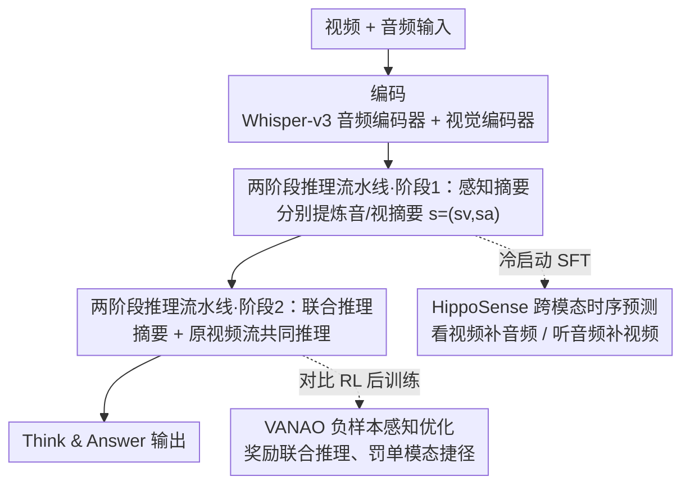

# Enhancing Video Vision Language Model with Hippocampal Sensing

**会议**: CVPR 2026  
**论文**: [CVF Open Access](https://openaccess.thecvf.com/content/CVPR2026/html/Cao_Enhancing_Video_Vision_Language_Model_with_Hippocampal_Sensing_CVPR_2026_paper.html)  
**代码**: 无（未公开）  
**领域**: 视频理解 / 多模态VLM  
**关键词**: 视频VLM, 跨模态预测, 音视频联合推理, 海马体感知, 对比强化学习

## 一句话总结
本文模仿海马体的跨模态联想机制，让视频 VLM 先用「跨模态时序预测」（看视频补音频、听音频补视频）做 SFT，再用一种带「负样本感知奖励」的对比 RL（VANAO）逼模型真正联合音视频推理，使 7B/8B 小模型在多个视频 VQA 上逼平 GPT-4o、Gemini-1.5-Pro。

## 研究背景与动机
**领域现状**：当前视频 VLM 的主流做法是把视频拉成一长串静态帧，一次性塞进长上下文里"单遍扫描后回答"。这本质上是暴力长上下文建模——模型被动地吞下所有帧，再去回答问题。

**现有痛点**：这种被动感知有两个硬伤。一是它丢掉了视频天然的时间连续性，长叙事、复杂物体交互、微妙社交动态都抓不住；二是它几乎不用音频。闭源大模型（Gemini-1.5-Pro、GPT-4o）其实是 agentic 系统——会主动调音频流、视频搜索引擎补充信息，但开源模型上下文窗口有限，没法同时塞大量帧 + 大段音频转写，而原始音频里又充满任务无关噪声，导致开源模型根本学不会"音视频共现下的联合推理"。

**核心矛盾**：人类在视觉缺失时能靠大脑内部世界模型"脑补"——这种多模态模式补全主要由海马体完成。而现有 VLM 既没有跨模态预测这种预训练任务，也没有机制阻止模型偷懒（modality collapse：只看画面或只听声音就猜答案），所以现有的预训练/后训练范式对音视频联合推理是次优的。

**本文目标**：(1) 给视频 VLM 一个跨模态预测的学习目标，逼它建立内部多模态世界模型；(2) 设计一种后训练策略，显式奖励"真的联合两模态推理"而非走单模态捷径。

**切入角度**：作者从海马体的生物机制出发——海马体是个"预测引擎"，能从听觉线索生成视觉预期，桥接记忆和感官。把这个能力搬进 VLM 微调，从"被动暴力处理"转向"主动跨模态选择与整合"。

**核心 idea**：用「跨模态时序预测」（看当前视频 + 部分音频，预测另一时刻的音频摘要；反之亦然）代替"下一帧预测"作为感知目标，再用对比 RL 奖励联合推理、惩罚单模态捷径。

## 方法详解

### 整体框架
HippoVLM 的推理是一个**两阶段流水线**，把"高层推理"和"原始音视频转写感知"解耦，对应人类"从感知到推理"的认知进程。架构上以 Qwen2.5-VL / Qwen3-VL 为底座，额外接一个 Whisper-v3 音频编码器；音频和视觉特征都经各自的 MLP connector 线性投影到 LLM 的统一语义空间。

- **阶段 1（感知与摘要）**：LLM 分别处理视觉、音频特征，针对主问题各自抽出一份信息密集、简洁的摘要 $s=(s_v, s_a)$。
- **阶段 2（推理）**：把这两份摘要和**原始视频流**一起送进 LLM 联合推理，让模型聚焦核心，不被海量原始音频转写 token 淹没。

阶段 2 形式化为自回归生成：模型最大化 $P(\hat{y}_i \mid v_i, q_i, s_i) = \prod_{j=1}^{L} P_\theta(\hat{y}_{i,j} \mid v_i, q_i, s_i, \hat{y}_{i,<j})$，即答案逐 token 生成，条件是原视频流 $v_i$、主问题 $q_i$ 和阶段 1 摘要 $s_i$。

训练分两步：先用 **HippoSense** 做冷启动 SFT（注入跨模态预测能力），再用 **VANAO** 这种对比 RL 后训练（优化选择性联合推理）。数据则来自自建的 **Hippo-Think**。

### 关键设计

**1. 两阶段推理流水线：把"转写感知"和"高层推理"解耦**

针对开源模型"上下文塞不下大量帧 + 大段音频、且音频噪声多"的痛点，HippoVLM 不让 LLM 一次性吞所有原始数据，而是先在阶段 1 把音、视各自压成一份针对问题的简短摘要 $s=(s_v, s_a)$，再在阶段 2 把摘要与原视频流一起推理。这样做的好处是：摘要信息密度高、过滤掉了任务无关的原始音频转写噪声，模型在阶段 2 能专注核心而不被淹没；同时这条流水线天然弥补了低帧采样率的局限——通过"上下文补全"机制生成相关音视频段落的预测性摘要。代价是两阶段不可避免比单阶段模型（如 Video-R1）慢，但比 VideoChat-R1.5 这类多轮视觉 grounding / agentic 工具调用的方法快得多。

**2. HippoSense：用跨模态时序预测把单模态感知升级成多模态联想**

这是全文的核心范式。它针对"现有模型没有音视频联合的预训练任务"这一痛点，把感知目标从"下一帧预测"换成"跨模态时序预测"：强迫模型用**另一模态**的上下文，去重建**本模态**在一个时间错位时刻（未来或过去 10 秒）的摘要。具体训两个辅助损失：

- 视觉到音频感知损失 $L_{VAS}$：给定完整视频 $v_i$、当前可用音频 $a_i$、以及未来/过去音频相关 query $q_i$，生成真实的异步音频摘要 $y^a$，$L_{VAS} = -\sum_{j=1}^{L} \log P_\theta(y^a_{i,j} \mid v_i, a_i, q_i, y^a_{i,<j})$。
- 音频到视觉感知损失 $L_{AVS}$：反过来，给定完整音频 $a_i$、当前视频帧 $v_i$、未来/过去视觉 query，生成异步视频摘要 $y^v$，$L_{AVS} = -\sum_{j=1}^{L} \log P_\theta(y^v_{i,j} \mid a_i, v_i, q_i, y^v_{i,<j})$。

这两个辅助损失和主 SFT 损失 $L_{SFT}$（生成视频摘要或直接答题）加权联合优化：

$$L_{total} = L_{SFT} + \lambda_1 L_{VAS} + \lambda_2 L_{AVS}$$

其中 $\lambda_1 = \lambda_2 = 0.1$（经验设定）。它为什么有效：逼模型"看视频脑补声音、听声音脑补画面"，等于在显式构建一个跨模态的内部世界模型，使模型不再把音视频当两条互不相干的流，而是学会用一方补全另一方的缺失——这正是海马体多模态模式补全的工程化复刻。

**3. VANAO：用负样本感知奖励的对比 RL 逼模型真的联合两模态**

SFT 注入了能力，但模型在推理时仍可能偷懒（modality collapse）——只靠视频或只靠音频转写就猜答案。VANAO 在 GRPO 框架上加了一个**对比的负样本感知奖励** $r_n$ 来根治这点。GRPO 本身：给问题 $q$、视觉 $v$、阶段 1 摘要 $s=(s_v,s_a)$，从当前策略采样 $G=4$ 条推理路径，规则判分得原始奖励，再 z-normalize 成相对优势 $A_i = \frac{r_i - \text{mean}(R)}{\text{std}(R)}$，并对参考模型加 KL 惩罚防漂移。

关键创新是 $r_n$。作者**离线预计算**参考策略 $\pi_{ref}$ 在两个单模态"盲视"设置下的准确率：仅视频摘要 $\tilde{p}_v = \frac{1}{G}\sum_j \mathbb{1}[\hat{y}_{v,j}=y]$（掩掉音频摘要 $s_a=\varnothing$），仅音频摘要 $\tilde{p}_a$（掩掉视频摘要 $s_v=\varnothing$）。训练时设当前组准确率 $p=\frac{1}{G}\sum_i r_a(o_i)$，负样本感知奖励是个组级 bonus：

$$r_n = \gamma \cdot \big(\mathbb{1}[p > \tilde{p}_v] + \mathbb{1}[p > \tilde{p}_a]\big)$$

只有当联合推理**严格超过**两个单模态捷径时才发奖励。最终总奖励把格式奖励 $r_f$、长度奖励 $r_l$（鼓励长度落在 $[l_{min}, l_{max}]$ 防过度思考）独立叠加，而 $r_n$ 被准确率奖励 $r_a$ 门控：

$$R_i = r_f(o_i) + r_l(o_i) + (1 + r_n)\cdot r_a(o_i)$$

这个 $(1+r_n)\cdot r_a$ 的乘法门控保证：只有答案**确实答对**时才能拿到跨模态协同 bonus，从而显式地把"联合两模态"这件事写进奖励，而不仅是"全局答得更好"。离线预计算盲视基线也避免了在线 RL 反复解码的高昂成本。

**4. Hippo-Think 数据集：跨模态摘要 + CoT 的冷启动数据**

HippoSense 这套范式需要带跨模态摘要和 CoT 推理的高质量数据，本文用一个人在环（human-in-the-loop）的迭代数据引擎造出 Hippo-Think（10K 视频，50K 详细 CoT 标注，来自 LLaVA-Video-178K、PerceptionTest、Social-IQ 2.0、NExT-QA 的子集，刻意在时序推理/社交推理/视频理解三类间平衡）。流程：Whisper-large-v3 抽音频转写 → Gemini-2.5-Flash 生成初始音/视摘要 → GPT-4o 当 LLM-as-judge 初筛 → 每 1000 条批量人工核验，拒绝批次的书面反馈动态注入 system prompt、改用更强的 Gemini-2.5-Pro 重生成，形成持续改进闭环。为支撑跨模态预测任务，作者把摘要**按时间切成前后两段**，直接构造出"用前段音频+全视频预测后段音频摘要"等任务。CoT 质量上用三次独立采样的共识过滤——只有三次解析出的最终答案完全一致且正确才保留。

### 损失函数 / 训练策略
两阶段训练：(1) 冷启动 SFT——HippoSense 微调 2 个 epoch，最大化正确推理步骤似然；(2) 在 Hippo-Think 上做 VANAO RL（group size $G=4$）。全程 16×A100(80G)、混合精度、全局 batch 16、AdamW、峰值学习率约 $1\times10^{-6}$、5% 线性 warm-up + cosine 衰减，序列最长 32k token（Qwen 的 RoPE），用梯度检查点 + 累积。训练时视频最多 16 帧、分辨率 256×28×28；RL 因算力限制只跑 1000 步（作者强调即便预算这么小也有显著提升）；推理时用 16/64 帧、分辨率提到 512×28×28。

## 实验关键数据

### 主实验
四个音视频 VQA benchmark（VideoMMMU、Video-MME、VNBench、Social-IQ 2.0），开源对手统一限制在 7B/8B 规模、64 帧输入。

| 模型 | 底座 / 帧数 | VideoMMMU | Video-MME | VNBench | Social-IQ |
|------|------|------|------|------|------|
| GPT-4o（闭源） | UNK / >180 | 61.2 | 71.9 | 66.7 | 75.2 |
| Gemini-1.5-Pro（闭源） | UNK / >180 | 53.9 | 75.0 | 64.4 | 71.8 |
| Qwen2.5-VL-7B | Qwen2.5-7B / 64 | 47.4 | 59.6 | 32.6 | 60.3 |
| Video-R1-7B | Qwen2.5-7B / 64 | 52.4 | 61.4 | - | 64.6 |
| Qwen3-VL-8B | Qwen3-8B / 64 | 59.8 | 61.5 | 66.2 | 57.9 |
| **HippoVLM-7B** | Qwen2.5-7B / 16 | 49.9 | 62.5 | 66.0 | 69.5 |
| **HippoVLM-7B** | Qwen2.5-7B / 64 | 53.5 | 68.8 | 70.2 | 71.2 |
| **HippoVLM-8B** | Qwen3-8B / 64 | **62.7** | 70.4 | **72.0** | 73.4 |

HippoVLM-8B 在 VideoMMMU（62.7）和 VNBench（72.0）上超过 GPT-4o，Social-IQ（73.4）也逼近闭源大模型；HippoVLM-7B 即便只用 16 帧，Social-IQ 也比同底座 Qwen2.5-VL-7B（60.3）高出约 9 个点。

### 消融实验
| 配置（Qwen2.5-VL-7B 底座，16 帧） | VideoMMMU | Video-MME | VNBench | Social-IQ |
|------|------|------|------|------|
| Baseline | 47.2 | 53.1 | 43.9 | 62.0 |
| SFT | 48.0 | 53.3 | 44.1 | 60.2 |
| SFT + DPO | 48.3 | 55.4 | 59.8 | 66.9 |
| SFT + GRPO | 49.0 | 59.8 | 64.4 | 66.5 |
| HippoVLM（仅 HippoSense） | 48.3 | 59.1 | 57.3 | 63.4 |
| **HippoVLM（HippoSense + VANAO）** | **49.9** | **62.5** | **66.0** | **69.5** |

推理速度（单 H100，16 帧）：HippoVLM-7B 约 18.15s，比 VideoChat-R1.5-7B-M（23.43s）快，但慢于单阶段的 Qwen2.5-VL-7B（7.23s）和 Video-R1-7B（8.63s）——这是两阶段流水线的代价。

### 关键发现
- **VANAO 的贡献清晰可分**：仅 HippoSense 已显著超 baseline，叠加 VANAO 后 Video-MME 从 59.1→62.5、VNBench 57.3→66.0、Social-IQ 63.4→69.5，验证负样本感知奖励确实在压制 modality collapse、逼出深度协同推理。
- **社交推理增益最大**：Social-IQ 这类任务靠识别"画面微笑但语气愤怒"这种跨模态矛盾/协同，纯视觉模型束手无策，而显式音视频预测推理在这里收益最显著，是该范式最有说服力的场景。
- **小模型逼平大模型**：7B/8B HippoVLM 在多个 benchmark 上达到 GPT-4o、Gemini-1.5-Pro 量级，说明跨模态预测目标 + 对比 RL 比单纯堆参数/堆帧数更对症。

## 亮点与洞察
- **把"下一帧预测"换成"跨模态时序预测"**：这是范式层面的巧思——视觉补音频、音频补视频，等价于强制模型建立跨模态内部世界模型，比单模态的掩码重建更贴合"音视频共现"的真实结构。
- **负样本感知奖励 $r_n$ 的离线盲视基线**：预计算"只给视频摘要"和"只给音频摘要"的准确率作为对照，只有联合推理严格超过两条单模态捷径才发 bonus——这是一个非常可迁移的 trick：任何怕模型走单模态捷径的多模态 RL 都能套用"用单模态盲视基线做对比奖励门控"。
- **乘法门控 $(1+r_n)\cdot r_a$**：把"协同奖励"挂在"答对"这个硬条件上，避免模型为拿 bonus 而胡乱推理，奖励设计干净利落。

## 局限与展望
- 作者承认两阶段流水线推理更慢（18.15s vs 单阶段 7-8s），实时性场景（社交机器人、AR）下这是真实瓶颈。
- RL 只跑了 1000 步、视频最多 16 帧训练，受算力限制；更大预算下的天花板未知。⚠️ 论文未给出 $\gamma$、$\omega$、$l_{min}/l_{max}$ 等奖励超参的具体取值与敏感性分析，复现时需自行调。
- 评测刻意排除纯视觉 benchmark（MVBench、VSI-Bench），所有增益都建立在"有音频"的前提上；对无音轨或音频质量差的视频，HippoSense 是否还成立未验证。
- 数据引擎重度依赖 Gemini-2.5-Pro/Flash + GPT-4o 蒸馏标注，跨模态摘要和 CoT 的质量上限被这些教师模型框定。

## 相关工作与启发
- **vs Cambrian-S（supersensing）**: Cambrian-S 主张"超感知"但聚焦时序预测世界建模（next-frame prediction）；本文同样走 supersensing 路线，但把核心机制换成**跨模态**时序预测（音↔视互补），并落到具体的双辅助损失上，针对音视频联合而非纯视觉预测。
- **vs Video-R1 / VideoChat-R1.5**: 它们用 RL（GRPO/轨迹偏好）提升视频推理，但仍是被动通读 + 单阶段或多轮 grounding；本文用两阶段解耦 + VANAO 的负样本感知奖励显式优化"音视频协同"，且推理比 VideoChat-R1.5 更快。
- **vs VideoLLaMA 系列**: VideoLLaMA 加音频分支处理多模态，属架构层面拼接；本文的差异在于不止"能看到音频"，而是用训练目标（HippoSense + VANAO）逼模型**主动联合**两模态、拒绝单模态捷径。

## 评分
- 新颖性: ⭐⭐⭐⭐⭐ 把海马体跨模态联想落成"时序预测 SFT + 负样本感知对比 RL"，范式和奖励设计都有原创性
- 实验充分度: ⭐⭐⭐⭐ 四 benchmark + 训练策略消融 + 速度对比都有，但缺奖励超参敏感性与无音频场景验证
- 写作质量: ⭐⭐⭐⭐ 动机—方法—公式链条清晰，图示到位；部分符号与超参交代略简
- 价值: ⭐⭐⭐⭐⭐ 让 7B/8B 小模型在音视频 VQA 逼平 GPT-4o/Gemini，对开源多模态推理路线很有参考价值

<!-- RELATED:START -->

## 相关论文

- [\[CVPR 2026\] TimeViper: A Hybrid Mamba-Transformer Vision-Language Model for Efficient Long Video Understanding](timeviper_a_hybrid_mamba-transformer_vision-language_model_for_efficient_long_vi.md)
- [\[CVPR 2026\] Video-Only ToM: Enhancing Theory of Mind in Multimodal Large Language Models](video-only_tom_enhancing_theory_of_mind_in_multimodal_large_language_models.md)
- [\[CVPR 2026\] OneThinker: All-in-one Reasoning Model for Image and Video](onethinker_all-in-one_reasoning_model_for_image_and_video.md)
- [\[CVPR 2026\] µVLM: A Vision Language Model for µNPUs](mvlm_a_vision_language_model_for_mnpus.md)
- [\[CVPR 2026\] ReMoRa: Multimodal Large Language Model based on Refined Motion Representation for Long-Video Understanding](remora_multimodal_large_language_model_based_on_refined_motion_representation_fo.md)

<!-- RELATED:END -->
