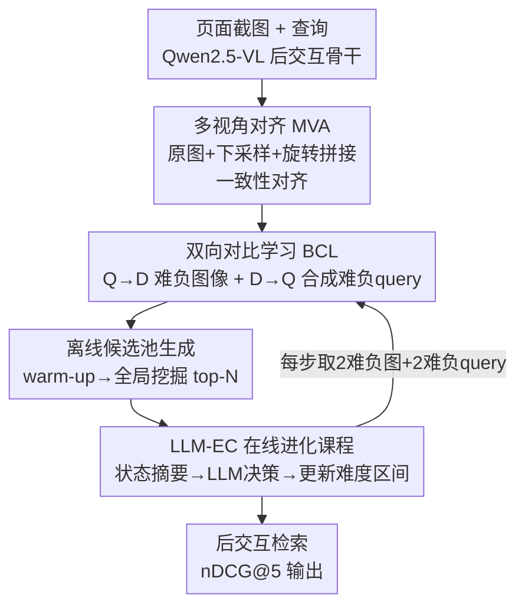

# Evo-Retriever: LLM-Guided Curriculum Evolution with Viewpoint-Pathway Collaboration for Multimodal Document Retrieval

**会议**: CVPR 2026  
**论文**: [CVF Open Access](https://openaccess.thecvf.com/content/CVPR2026/html/Li_Evo-Retriever_LLM-Guided_Curriculum_Evolution_with_Viewpoint-Pathway_Collaboration_for_Multimodal_Document_CVPR_2026_paper.html)  
**代码**: https://huggingface.co/ApsaraStackMaaS （模型权重）  
**领域**: 多模态VLM / 文档检索  
**关键词**: 视觉文档检索, 课程学习, 难负样本挖掘, LLM元控制器, 后交互  

## 一句话总结
Evo-Retriever 把"模型"和"训练课程"绑成一对协同进化体——用多视角对齐 + 双向对比稳住表征，再让一个外部 LLM 元控制器根据实时训练状态动态调难负样本难度，在 ViDoRe V2 / MMEB(VisDoc) 上拿到 nDCG@5 65.2% / 77.1% 的新 SOTA。

## 研究背景与动机
**领域现状**：复杂视觉文档检索（CVDR）要从大规模语料里精确定位与多模态查询相关的页面。主流做法已经从"先解析再检索"（OCR + 切块）转向直接把页面截图喂给 VLM 编码成稠密向量。其中 ColPali 这类**多向量后交互（late-interaction）**模型把页面在 token 级建索引、运行时和 query token 逐对算相似度，做到细粒度对齐，是当前 SOTA。

**现有痛点**：作者指出这些 SOTA 在真实复杂文档上有三个具体缺陷——(a) **空间感知不足**：只用单一固定视角，难以整合空间上分散的信息（比如要把"塑料12%"和"金属8%"两处加起来回答）；(b) **天生易受文本混淆**：现有对比学习只挖"视觉相似但语义不同"的难负样本，却忽略了"文本相似但视觉不匹配"的负样本（比如把"要图表"误判成命中一段纯文字）；(c) **静态课程导致停滞**：即便用了数据合成（GME），难负样本的挑选课程也是预先定死的，模型很快就把初始难负样本学会，之后这些样本不再有挑战性，梯度信号衰减，反而拖累判别力。

**核心矛盾**：模型能力在训练中是动态变化的，而训练课程（难负样本难度）是静态的——一个固定阈值在训练早期能提供有效梯度，到后期同一阈值只能挖到平凡负样本，梯度趋于零（论文 Fig.2 的核心 motivation）。

**核心 idea**：让**模型与课程协同进化（model–curriculum co-evolution）**。先用 Viewpoint-Pathway 协同（多视角 + 双向路径）把基础表征打牢，再交给一个 LLM 元控制器，根据训练状态摘要自适应地调整难负样本难度区间，保证监督信号在整个训练过程持续具有挑战性。

## 方法详解

### 整体框架
Evo-Retriever 建立在 Qwen2.5-VL 骨干 + 多向量后交互之上，融合三个相互协同的组件：**MVA（多视角对齐）**强化空间感知、**BCL（双向对比学习）**缓解文本混淆——这两者构成 "Viewpoint-Pathway 协同"，为表征打底；第三个 **LLM-EC（LLM 引导的进化课程）**作为元控制器，根据训练状态摘要动态调难负样本挖掘。整条 pipeline 的关键在于：MVA/BCL 不仅产出更鲁棒的表征，还产出两类难负样本（难负图像 + 难负 query）的**候选池**，LLM-EC 则在训练中决定每一步从池子里取多难的样本，模型与课程在 estimator（估难度）和 learner（学样本）两个角色间交替，持续进化。

### 关键设计

**1. 多视角对齐 MVA：用单 token 预算的多视角拼图强制几何不变性**

针对"空间感知不足"。对每张图像 $I$，作者构造一张**多视角拼图** $I_{aug}$：把原图、一个下采样版本、一个旋转版本（旋转角从 $[-180°, 180°]$ 采样）**横向拼接**成一张图。妙点在于借助 Qwen-VL 的 smart resizing——拼图在**相同 token 预算**下产生不同的 patch 布局，于是无需增加推理成本就能让模型见到多尺度、多方向的视角。原图 $I$ 和拼图 $I_{aug}$ 共享同一映射路径，都与匹配 query $Q$ 对齐，训练时用两个对齐损失 $\mathcal{L}_{Q\to I}$ 和 $\mathcal{L}_{Q\to I_{aug}}$ 强制"同一文本查询下，跨尺度/朝向表征保持一致"。关键是**保留原视角**：消融显示只用下采样（-1.42%）或只用拼接去掉原图（-2.58%）都掉点，说明高保真全局上下文（原图）+ 几何扰动（增强图）的双视角缺一不可。MVA 只在训练用，**推理零额外开销**。

**2. 双向对比学习 BCL：补上 D→Q 路径，专挖"文本像、视觉不像"的负样本**

针对"文本混淆"。主流检索器只用单向 query→document（Q→D）对比，忽略了 document→query（D→Q）路径。BCL 在两个方向都加对比约束。其关键是一条自动化的 **难负 query 合成（HNQS）流水线**（受 DocReRank 启发）：给定正样本对 $(I_{pos}, Q_{pos})$，让一个 VLM（实验用 Qwen2.5-VL-72B）合成在句法/上下文上与 $Q_{pos}$ 相似、但语义上与图像 $I_{pos}$ 内容**不一致**的负 query，每个正样本对生成 20 个候选。这些"文本相似但视觉错配"的难负 query 逼模型把语义真正锚定到视觉证据上，而不是停留在表面文本匹配。训练时具体取哪些由 LLM-EC 动态决定。

整体优化目标把上述两个方向统一成一个基于 softplus 的 margin 损失（而非 softmax 归一化的 InfoNCE）——这样每个难负样本**独立**贡献梯度、信号一致、决策边界逐步锐化：

$$\mathcal{L}_{total} = \mathcal{L}_{forward} + \alpha \cdot \mathcal{L}_{backward}$$

forward 项含 MVA 的双视角（原图 + 增强图，用 $\beta$ 平衡）：$\mathcal{L}_{forward} = \mathcal{L}(Q_{pos}, I_{ori}, \{I_{neg}\}) + \beta \cdot \mathcal{L}(Q_{pos}, I^{aug}_{ori}, \{I^{aug}_{neg}\})$。通用 margin 损失对 $K$ 个难负样本求和：$\mathcal{L}(Q, I_{pos}, \{I_{neg}\}) = \sum_{k=1}^{K} \log\big(1 + \exp(\frac{\text{sim}(Q, I_{neg}^{(k)}) - \text{sim}(Q, I_{pos})}{\tau})\big)$，其中相似度沿用 ColBERT 后交互：$\text{sim}(Q, I) = \sum_{l=1}^{L_Q} \max_{j=1}^{L_I}\big(E_Q(Q)_l \cdot E_I(I)_j^T\big)$（token 嵌入 L2 归一化，点积即余弦）。backward 项对称地以图像为锚约束 D→Q，负样本是 HNQS 合成的难负 query $\{Q_{neg}\}$。

**3. LLM 引导的进化课程 LLM-EC：把"挑多难的负样本"交给 LLM 元控制器闭环调度**

这是全文最核心、也是回答"静态课程停滞"的设计。它分两阶段。**离线候选池生成**：先用 in-batch 负样本做一轮 warm-up，让模型建立初始表征空间来评估样本难度；然后把模型从 learner 切成 estimator，做一次性的**全局离线挖掘**——对训练集每个 query $q$，从整个语料库 $\mathcal{D}$ 检索并存下 top-N 个最相似负文档，形成专属候选池 $C_q$（难负 query 同样预计算）。这一步把昂贵的全局检索成本摊薄，让在线选样高效。

**在线 LLM 引导课程进化**：把课程形式化为 $M$ 个离散难度区间，每个区间由阈值范围 $[\tau_{low}, \tau_{high}]$ 定义在一个 positive-aware 的难度度量上（按负样本与对应正样本的相对接近度衡量难度，沿用 NV-Retriever）。"选哪个区间"这个 Action 交给外部 LLM，在闭环里走三步循环：(i) **状态摘要**——自动聚合关键指标（如平均难负 loss、loss 趋势）成结构化报告；(ii) **LLM 审议**——LLM 按"三阶段决策协议"选下一个 Action；(iii) **课程更新**——采用新难度区间，为下一阶段挖难负样本。关键差异：不同于固定阈值调度器，控制器是**基于训练动态条件**做决策，能做非单调调整（不稳定时回滚到更简单区间）。

**三阶段决策协议**模拟人类设计课程：① **Exploration（探索）**——系统性地映射"难度-性能版图"，LLM 探索一批未测过的难度区间并监控 loss，遇到不稳定（loss 过高）或停滞（loss 长期偏低）就自适应调难度；② **Transition（过渡）**——分析探索历史，筛出"有效学习"的 Action（loss 落在理想区间，如 $0.3 \le \text{loss} \le 1.2$），从中选最难的作为主训练锚点；③ **Lock-in（锁定）**——主训练期细调，周期性比较 review 窗口首尾的平均 loss 评估"学习速度"，掌握了就升一档难度、吃力就降档、否则维持。整个机制把课程设计从启发式变成可度量、可自动化的优化，模型角色随之从 estimator 回到 learner，与课程难度协同进化。

### 损失函数 / 训练策略
骨干 Qwen2.5-VL-3B / 7B-Instruct，投影到 128 维，每图最多 1024 个视觉 token，query 后接 5 个 `<unused0>` 特殊 token。$\alpha = \beta = 1$。训练分两阶段：先用全部 480K 对、仅 in-batch 负样本 + InfoNCE 训 1 epoch，top-N=200 建候选池；随后 LLM 元控制器接收训练状态、生成动态课程，再训 1 epoch。全程 LoRA（rank 32），paged_adamw_8bit，lr $2\times10^{-5}$，cosine decay，warmup 2%，global batch 32，每步每个正样本配 2 个合成难负 query + 2 个难负图像，8×H20 数据并行。元控制器用 Qwen3-235B-A22B（API），课程分 60 步 Exploration（每 2 步更新）/ 200 步 Transition / Lock-in（每 200 步更新），动作空间 $M=16$ 个重叠相似度区间（从 [0.70, 0.85] 到 [0.95, 0.995]）。LLM-EC 全程仅约 100k token 开销，且只在训练期工作，**推理无影响**。

## 实验关键数据

### 主实验
两个公开 benchmark：ViDoRe V2（多语言零样本，报 nDCG@5）和 MMEB 的 VisDoc 任务（结构复杂文档，报 nDCG@linear 5）。

| Benchmark | 指标 | Evo-Retriever-7B | 之前 SOTA | 提升 |
|--------|------|------|----------|------|
| ViDoRe V2 (Avg) | nDCG@5 | **65.2** | 63.5 (llama-nemoretriever-3b) | +1.7 |
| ViDoRe V2 · Economics Macro 多语言 | nDCG@5 | 59.1 | 55.9 | +3.2 |
| MMEB (VisDoc) Avg | nDCG@5 | **77.12** | 75.18 (gme-Qwen2-VL-7B) | +1.94 |
| MMEB · VisRAG | nDCG@5 | 89.28 | 84.99 | +4.29 |

值得注意的是小模型 Evo-Retriever-3B 在 ViDoRe V2 拿到 63.3%，比架构相近的 colqwen2.5-v0.2（59.3%）高 4.0%；在 MMEB 上 3B 版（75.91%）甚至已经超过所有 baseline，体现出训练策略而非单纯架构带来的增益。

### 消融实验（ViDoRe V2，3B 模型，Baseline Net0 = 纯 InfoNCE in-batch = 61.17%）

| 配置 | nDCG@5 | 说明 |
|------|---------|------|
| Baseline (Net0) | 61.17 | 仅 in-batch 负样本 |
| + MVA (Net1) | 62.25 | 多视角对齐，+1.08 |
| Downsample-only | 59.75 | 简化增强视角，-1.42 |
| Stitched-only | 58.59 | 去掉原图，-2.58 |
| + BCL (Net2) | 61.84 | 双向对比，+0.67 |
| Net0+MVA+BCL | 62.39 | 表征骨干，+1.22 |
| Fixed Window 80-98% | 62.10 | 强静态课程，+0.93 |
| Rule-based Oracle | 62.81 | 固定 loss 阈值的动态课程 |
| LLM-EC (Ours) | 63.05 | 比 Oracle 再 +0.24 |
| Full Model | **63.30** | 全部组件 |

### LLM-EC 设计选择分析（Table 4）

| 因素 | 设置 | nDCG@5 |
|------|------|--------|
| Exploration 阶段 | 启用（默认 60 步） | 63.05 |
| Exploration 阶段 | 禁用 | 61.86（-1.19）|
| 难度粒度 | 10 区间（粗） | 62.89 |
| 难度粒度 | 16 区间（默认） | 63.05 |
| 难度粒度 | 21 区间（细） | 62.15 |
| 控制器规模 | Qwen3-235B-A22B | 63.05 |
| 控制器规模 | Qwen3-32B | 63.30 |

### 关键发现
- **双视角缺一不可**：MVA 的关键是同时保留原图（高保真全局上下文）和增强图（尺度/朝向不变性），任意去掉一边都比 baseline 还差（-1.42% / -2.58%）。
- **Exploration 阶段最关键**：禁掉它直接掉 1.19%，说明"根据模型初始状态自适应确定起始难度"比用预定义起点更有效。
- **难度粒度要平衡**：太粗（10 区间，62.89%）或太细（21 区间，62.15%）都不如 16 区间——区间太窄会导致每段内收敛不足。
- **控制器不必巨大**：把 235B 换成 Qwen3-32B 反而打平甚至略升到 63.30%，说明在协议引导下，课程控制不依赖超大模型规模，靠的是对自然语言协议的灵活解读（LLM-EC 仍稳超 Rule-based Oracle）。⚠️ 32B 反超 235B 这点论文未深究，可能有方差成分，宜以原文为准。

## 亮点与洞察
- **"模型-课程协同进化"是个干净的抽象**：把难负样本难度显式建模成可被外部智能体调度的 Action 空间，让"课程"从死参数变成闭环可控对象，这个范式可迁移到任何依赖难负挖掘的对比学习任务（检索、ReID、对比预训练）。
- **多视角拼图省 token 预算**很巧：利用 VLM 的 smart resizing，在同一 token 预算下把多尺度/多方向塞进一张拼图，几乎零成本拿到几何不变性，且推理期完全不用。
- **LLM 当"课程教练"而非生成器**：LLM 不直接产数据，只读结构化训练状态摘要、按三阶段协议做难度决策，token 开销极低（全程约 100k），却能做规则调度器做不到的非单调回滚——这是把 LLM 用在"元层面调度"的一个轻量范本。
- **margin loss 代替 InfoNCE** 让每个难负样本独立贡献梯度，配合动态挖掘避免了 softmax 归一化把难负信号稀释的问题。

## 局限与展望
- **两类难负样本都依赖外部大模型**：难负 query 靠 Qwen2.5-VL-72B 合成、候选池靠全局挖掘，pipeline 偏重，复现成本高。
- **离线候选池是静态搜索空间**：虽然在线动态选样，但候选池一旦在 warm-up 后挖定就不再更新，模型表征大幅进化后池子可能不再最优，论文未讨论是否需要周期性重挖。
- **控制器规模结论存疑**：32B 反超 235B 仅单点报告，缺方差分析，难判断是真实趋势还是噪声。⚠️
- **仅在文档检索验证**：协同进化范式是否能迁移到通用图文检索 / 跨模态对齐尚未实验。
- 改进方向：让候选池随课程阶段动态重挖、把三阶段协议本身也参数化让 LLM 学习、探索把 MVA 的视角选择也纳入课程调度。

## 相关工作与启发
- **vs ColPali / 后交互方法**：本文沿用 ColBERT 后交互 + OCR-free 视觉骨干，但额外加了多视角一致性约束来稳住布局变化下的对齐——它们解决"细粒度匹配"，本文在其上解决"空间不变 + 文本去混淆 + 课程进化"。
- **vs GME / NV-Retriever 等静态课程难负挖掘**：它们用预定义、状态无关的固定阈值或线性插值挑难负样本，模型一旦进化就供给平凡样本；本文用 LLM 元控制器基于训练动态自适应调难度区间，监督信号持续有挑战性。
- **vs DocReRank**：HNQS 的难负 query 合成 prompt 设计借鉴自 DocReRank，但本文把它接入了双向对比 + 动态课程的整体框架，而非仅用于重排。

## 评分
- 新颖性: ⭐⭐⭐⭐⭐ "模型-课程协同进化 + LLM 元控制器调难负"是检索训练里少见且自洽的新范式
- 实验充分度: ⭐⭐⭐⭐ 两 benchmark + 三层消融到位，但候选池更新、控制器规模方差等问题未深挖
- 写作质量: ⭐⭐⭐⭐⭐ 三痛点-三组件对应清晰，Fig.1/2 motivation 讲得直观，公式完整
- 价值: ⭐⭐⭐⭐ SOTA 且范式可迁移到通用对比学习，但 pipeline 偏重、复现门槛高

<!-- RELATED:START -->

## 相关论文

- [\[CVPR 2026\] Camouflage-aware Image-Text Retrieval via Expert Collaboration](camouflage-aware_image-text_retrieval_via_expert_collaboration.md)
- [\[CVPR 2026\] STiTch: Semantic Transition and Transportation in Collaboration for Training-Free Zero-Shot Composed Image Retrieval](stitch_semantic_transition_and_transportation_in_collaboration_for_training-free.md)
- [\[CVPR 2026\] Self-guided Semantic Inspection for Zero-Shot Composed Image Retrieval](self-guided_semantic_inspection_for_zero-shot_composed_image_retrieval.md)
- [\[CVPR 2026\] Anchor-Guided Gradient Alignment for Incomplete Multimodal Learning](anchor-guided_gradient_alignment_for_incomplete_multimodal_learning.md)
- [\[CVPR 2026\] SO-Bench: A Structural Output Evaluation of Multimodal LLM](so-bench_a_structural_output_evaluation_of_multimodal_llm.md)

<!-- RELATED:END -->
