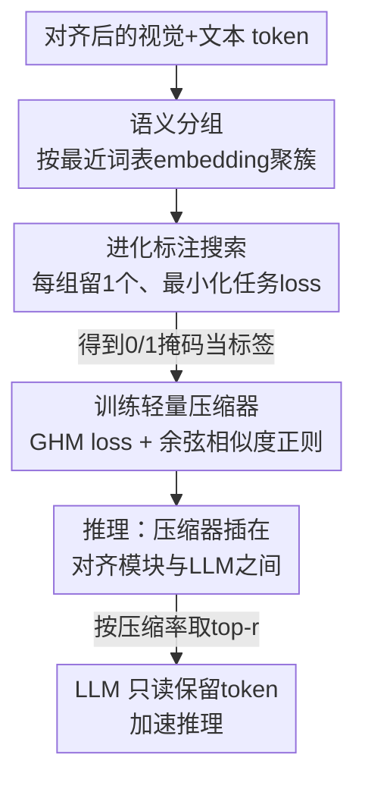

# EvoComp: Learning Visual Token Compression for Multimodal Large Language Models via Semantic-Guided Evolutionary Labeling

**会议**: CVPR 2026  
**arXiv**: [2604.17087](https://arxiv.org/abs/2604.17087)  
**代码**: 无（论文未提供）  
**领域**: 多模态VLM / LLM效率 / 视觉Token压缩  
**关键词**: 视觉token压缩、进化搜索标注、MLLM推理加速、GHM loss、端侧部署

## 一句话总结
EvoComp 在 MLLM 的对齐模块和 LLM 之间插入一个轻量压缩器，用「进化算法搜出能让任务 loss 最小的 token 子集」当监督标签来训练它，从而在 3×～9× 压缩下保留 99.3%～94.9% 原始精度，并在手机 NPU 上实现最高 2.0× 加速。

## 研究背景与动机

**领域现状**：高分辨率图像、多图、视频输入会让 MLLM 产生成百上千个视觉 token，由于注意力的二次复杂度，推理延迟和显存开销急剧上升，在边缘/手机端尤其致命。一个公认观察是视觉表示高度冗余——少数 token 就承载了大部分语义，因此「视觉 token 压缩」成为加速主线。

**现有痛点**：现有压缩方法分三类，各有硬伤。① 基于注意力分数的方法（FastV、HiRED、GlobalCom²）有位置偏置，且与 FlashAttention 这类高效算子不兼容；② 基于相似度过滤的方法（ToMe、DART、VisionZip）只看冗余、不看「重要性」，可能保留一堆多样但无用的 token；③ 文本条件方法（SparseVLM、PyramidDrop、MustDrop）虽然引入了 prompt，但本质仍是注意力启发式，**没有直接对齐模型输出的正确性**。

**核心矛盾**：所有这些方法都在用「代理指标」（注意力、相似度）来猜哪个 token 重要，而代理指标和「保留这些 token 后 MLLM 答得对不对」之间没有直接因果。真正缺的是一份「token 级重要性标签」，但标准 VL 数据集根本没有这种标注。

**本文目标**：① 怎么不靠启发式、直接以「任务 loss 最小」为目标，给每张图造出 token 保留标签；② 怎么用这份标签训练一个即插即用、不动原 MLLM 任何参数的压缩器。

**切入角度**：既然没有现成标签，那就**搜**一份出来——对每个样本搜索一个 0/1 掩码，使得 LLM 只看保留下来的视觉 token + 全部文本 token 时，对标准答案的 loss 最小。搜索不需要反传，天然支持各种约束。

**核心 idea**：用进化算法把「token 选择」直接对齐到「MLLM 输出 loss」生成监督标签，再把这份标签蒸馏进一个轻量压缩器，做到「输出导向 + 文本感知 + 去冗余」三合一。

## 方法详解

### 整体框架
EvoComp 分为离线和在线两段。**离线阶段（造标签）**：对训练集每个样本，先按语义把视觉 token 分组，再用进化搜索在「每组保留一个」的约束空间里找到使任务 loss 最小的二值掩码，这份掩码就是该样本的 token 保留标签。**训练阶段**：用这些掩码当监督，训练一个单层 encoder-only transformer + 线性分类器组成的压缩器，输出每个视觉 token 的保留概率，训练目标是 GHM loss + 余弦相似度正则。**推理阶段**：压缩器插在对齐模块和 LLM 之间，一次前向给出保留概率，按目标压缩率取 top-r 个 token 送进 LLM，原 MLLM 三大件（视觉编码器、对齐模块、LLM）全部冻结、零改动。

### 关键设计

**1. 即插即用的轻量压缩器：在对齐模块和 LLM 之间架一道闸门**

现有方法要么改 LLM 内部层（只能在中间层剪枝，需细粒度控制硬件未必支持），要么依赖注意力分数（和 FlashAttention 冲突）。EvoComp 把压缩独立成一个外挂模块：它接收对齐后的视觉 + 文本 embedding，输出每个视觉 token 的保留概率 $\{p_i\}_{i=1}^{n}$，结构是单层 transformer（把因果注意力换成**双向注意力**、加一条 skip connection）后接线性分类器。双向注意力让它能同时建模视觉 token 之间、视觉与文本之间的关系，从而判断某个 token 是否「既本身信息量大、又和当前 prompt 相关」。因为它在 token 进 LLM 之前就完成选择，剪枝动作可以灵活施加在 LLM 的任意层——`l=0`（进 LLM 前剪）追求最大加速，`l=2`（第二层后剪）追求更高精度，且全程不微调原 MLLM，真正即插即用

**2. 进化标注：把「token 选择」直接对齐到「任务 loss」**

这是全文最核心的创新，专治「代理指标和输出正确性脱节」。对一个样本，记对齐后的视觉 token $\bm{V}=\{\bm{v}_i\}_{i=1}^{n}$、文本 token $\bm{T}$（含标准答案），目标是找一个二值掩码 $\bm{m}\in\{0,1\}^n$，使 LLM 在「保留的视觉 token + 全部文本 token」下对答案 token 的任务 loss $\mathcal{L}(\bm{m})$ 最小。这等于让 token 保留**直接以输出质量为准绳**，而非注意力/相似度这类间接量。求解用进化算法：随机初始化 $q$ 个候选掩码，并行算出各自的 LLM loss，选 loss 最低的 top-$p$ 当父代，再做 crossover（概率 0.9，取一个父代前半子掩码 + 另一父代后半拼成子代）和 mutation（每个子掩码以概率 0.2 把那个「1」左右平移一位）生成新种群，迭代 $L$ 轮后取 loss 最低者当标签。论文设 $q=48,\,p=12,\,L=10$。每个掩码对应一次独立推理，可大规模并行，跨 GPU 扩展、且不需要反传

**3. 语义分组：用词表 embedding 当锚点，把搜索空间从指数级压成一个一个簇**

直接在 $n$ 个 token 上搜 $2^n$ 的掩码空间不可行，而且容易选出语义重复的 token。EvoComp 的观察是：视觉 token 往往聚集在 LLM 词表 embedding $\bm{E}=\{\bm{e}_i\}_{i=1}^{c}$ 附近，最靠近同一个 $\bm{e}_i$ 的视觉 token 语义相近。于是按「最近词表 embedding」把 $\bm{V}$ 划成若干不相交子集——两个 token $\bm{v}_i,\bm{v}_k$ 同组当且仅当 $\arg\max_j S_{ij}=\arg\max_j S_{kj}$，其中 $S_{ij}=\frac{\bm{v}_i\cdot\bm{e}_j}{\|\bm{v}_i\|_2\|\bm{e}_j\|_2}$。然后**约束每组只保留一个 token**（子掩码是 one-hot），全局掩码由各组子掩码拼接而成。这一步一箭双雕：既把搜索从「每个 token 独立决策」降到「每组选一个」，大幅缩小空间；又天然保证保留下来的 token 语义多样、不冗余。相比 DPC-KNN 这类聚类还省掉了「邻居数、簇数」等难调超参

**4. GHM + 余弦相似度的定制损失：扛住极端类别/难度不均衡**

把搜出的掩码当监督训练分类器时，会撞上严重的类别和难度不均衡——保留的「正样本」极少，绝大多数是冗余「负样本」（大量平凡易分），同时又有一批 token 因视觉语义高度可变而**极难分**（一张图里关键、换张图就没用）。直接均匀对待会让模型偏向学这些易样本和极难样本，训练低效。EvoComp 借鉴目标检测里的 GHM loss：先定义梯度范数 $g_i=|p_i-y_i|$ 和梯度密度 $GD(g_i)$（落在 $g_i$ 邻域内的 token 数），再按密度反向加权 $\mathcal{L}_{\text{GHM-C}}=\frac{1}{n}\sum_i \frac{n}{GD(g_i)}\ell(g_\psi(\bm{h}^v_i),y_i)$，把易负样本和极难样本的梯度贡献压下去。此外加一个余弦相似度正则 $\mathcal{L}_{\text{CS}}=\frac{1}{|\mathcal{I}_0||\mathcal{I}_1|}\sum_{i\in\mathcal{I}_0,j\in\mathcal{I}_1}\frac{\bm{h}^v_i\cdot\bm{h}^v_j}{\|\bm{h}^v_i\|_2\|\bm{h}^v_j\|_2}$，惩罚保留 token 与被丢 token 表示的相似度。这一项和语义分组高度耦合：每组保留的那个 token 和被丢的同组 token 视觉特征很像，但前者对维持输出精度贡献更大，逼分类器把它们的决策边界拉开。总损失 $\mathcal{L}=\mathcal{L}_{\text{GHM-C}}+\alpha\mathcal{L}_{\text{CS}}$

### 损失函数 / 训练策略
- 标签构建：用 LLaVA-1.5 指令微调混合数据集的子集，对每个目标 MLLM 单独造一套标签训练对应压缩器。
- 压缩器：单层 transformer（双向注意力 + skip connection）+ 线性分类器；总损失 $\mathcal{L}_{\text{GHM-C}}+\alpha\mathcal{L}_{\text{CS}}$，$\alpha$ 平衡两项。
- 推理：单次前向得保留概率，按压缩率取 top-r；剪枝层 $l$ 可灵活选（`l=0` 求速度、`l=2` 求精度）。

## 实验关键数据

### 主实验
在 LLaVA-1.5-7B 上随保留 token 数变化的平均精度（相对未压缩 100% 基线）：

| 保留 token | 压缩比例 | EvoComp(l=2) | EvoComp(l=0) | 次优方法 |
|--------|------|------|------|------|
| 192 | ↓66.7% | **99.3%** | 98.7% | VisionZip 98.8% |
| 128 | ↓77.8% | 98.0% | **97.8%** | DART 97.5% |
| 64 | ↓88.9% | 93.9% | **94.9%** | VisionZip 94.2% |

高分辨率极端压缩（LLaVA-NeXT-7B，2880→160 token，↓94.4% / 约 18×）：

| 方法 | 平均精度 |
|------|------|
| Vanilla（上界） | 100% |
| DART | 89.6% |
| SparseVLM | 89.7% |
| **EvoComp(l=0)** | **92.1%** |

端侧加速（LLaVA-1.5-7B + 手机 NPU，GQA 样例）：

| 保留 token | 总延迟(ms) | 加速 |
|--------|------|------|
| 576（原始） | 1154 | 1.0× |
| 192 | 726 | 1.6× |
| 64 | 569 | **2.0×** |

A100 上 LLaVA-NeXT-7B（POPE）：prefill 175→43 ms（**4.1×**），整体 246→93 ms（**2.6×**）。

### 消融实验（LLaVA-1.5-7B，MMB / MMB-CN，保留 128/64）

| 配置 | MMB(128) | MMB(64) | 说明 |
|------|------|------|------|
| Random Labeling | 60.3 | 58.4 | 同样分组但每组随机留一个 |
| EvoComp w/ DPC-KNN | 61.3 | 58.4 | 换成 DPC-KNN 聚类 |
| EvoComp w/o text input | 61.3 | 60.0 | 压缩器不看文本 |
| w/ $\mathcal{L}_{\text{CE}}+\mathcal{L}_{\text{CS}}$ | 62.4 | 59.1 | GHM→交叉熵 |
| w/ $\mathcal{L}_{\text{GHM-C}}$ only | 63.1 | 60.4 | 去掉余弦正则 |
| w/ $\mathcal{L}_{\text{FL}}+\mathcal{L}_{\text{CS}}$ | 62.9 | 60.5 | GHM→focal loss |
| w/ $\mathcal{L}_{\text{CE}}$ only | 60.6 | 56.2 | 仅交叉熵，最差 |
| **EvoComp（完整）** | **63.1** | **61.9** | — |

### 关键发现
- **进化标注是精度根基**：换成 Random Labeling 在 MMB(64) 上从 61.9 掉到 58.4，证明「以任务 loss 为目标搜出的标签」远胜随机/相似度聚类；DPC-KNN 虽好于随机但仍不及，且要调邻居数/簇数等超参。
- **GHM loss 比余弦正则更关键**：去掉余弦正则（仅 GHM）MMB(64) 仍有 60.4，但把 GHM 换成 CE（w/ CE only）暴跌到 56.2、MMB-CN(64) 更是从 55.1 崩到 41.3；focal loss 介于两者之间，说明专门处理「难度不均衡」的 GHM 是训练成败的核心。
- **文本上下文有用**：去掉文本输入 MMB(64) 从 61.9 降到 60.0，双向注意力建模视觉-文本交互确实帮助挑出「与 prompt 相关」的 token。
- **跨模型迁移惊人**：LLaVA-1.5-7B 选出的 token 索引直接复用到 13B（迁移设定）平均精度 94.4%，甚至超过 13B 自己训的方法；压缩器迁移到异构的 Qwen2.5-VL-7B（自适应池化对齐维度）无需重训仍有竞争力，说明学到的是跨尺度的内在视觉语义。
- **`l=0` 常优于 `l=2`**：进 LLM 前就剪（`l=0`）在多数极端压缩下精度反而更高，且让 LLM 从第一层起就跑短序列，加速最大化；相比之下 DART 在 `l=0` 设定下大幅掉点（如 64 token 时 84.5% vs EvoComp 94.9%）。

## 亮点与洞察
- **「搜标签」替「猜重要性」**：把缺失的 token 级监督用进化搜索直接对齐任务 loss 造出来，是对整条「注意力/相似度启发式」路线的釜底抽薪——监督信号天生就是「保留它答得对」，不再有代理指标的偏差。
- **语义分组一石二鸟**：用 LLM 词表 embedding 当语义锚点给视觉 token 聚簇，既把指数级搜索空间压成「每组选一」、又强制保留 token 多样，还顺手为余弦正则提供了「同簇相似 token」这个天然难负样本来源，三个设计互相咬合得很紧。
- **GHM loss 的跨界迁移**：把目标检测里处理前景-背景不均衡的 GHM loss 搬到「token 保留分类」上，类比精准（极少正样本 + 大量易负 + 少量极难负），可复用到任何「稀疏选择 + 难度极不均」的剪枝/筛选任务。
- **解耦带来部署红利**：压缩器与 LLM 内部解耦，使得「小模型选 token、大模型复用」「一个压缩器跨异构模型迁移」成为可能，对端侧多模型部署很实用。

## 局限与展望
- 离线进化标注每样本要跑 $q\times(L{+}1)$ 量级的 LLM 前向（48×11≈500 次推理/样本），虽可并行但造大规模标签的总算力开销不小，论文未给出标注总成本。
- 每个目标 MLLM 需单独造标签、训练专属压缩器；虽展示了迁移能力，但「先迁移再用」与「重新训练」的精度差仍存在（如 Qwen 迁移仅「competitive」而非更优）。
- 评测集中在 6 个 VL 理解 benchmark（GQA/MMB/POPE/VQAv2/VizWiz 等），未涉及生成式长答案、OCR、细粒度定位等对 token 损失更敏感的任务，极端压缩在这些场景的鲁棒性待验证。
- 语义分组依赖「视觉 token 聚集在词表 embedding 附近」这一假设，对视觉编码器与 LLM 词表对齐较弱的模型是否成立，⚠️ 论文未深入讨论。
- 余弦相似度正则的权重 $\alpha$ 等超参敏感性、以及进化搜索 $q/p/L$ 的取值依据，论文只给了固定值未做扫描。

## 相关工作与启发
- **vs FastV / HiRED / GlobalCom²（注意力类）**：它们用注意力分数估重要性，有位置偏置且与 FlashAttention 冲突；EvoComp 用任务 loss 搜标签训练独立压缩器，绕开注意力启发式。同压缩比下（192 token）FastV 96.9%、EvoComp 99.3%。
- **vs ToMe / VisionZip / DART（相似度类）**：它们只看冗余、保留的 token 未必重要；EvoComp 通过「任务 loss 最小化」保证重要性、通过「语义分组每组留一」保证多样性。尤其 `l=0` 设定下 EvoComp 大幅领先 DART(l=0)。
- **vs SparseVLM / PyramidDrop / MustDrop（文本条件类）**：它们引入了 prompt 但仍逐层用注意力剪枝；EvoComp 把文本-视觉交互交给双向注意力压缩器一次性建模，并直接优化输出正确性而非中间注意力。
- **vs PruMerge（重要性+多样性融合）**：PruMerge 用「类 token 注意力 + key 相似度聚类」启发式融合两者；EvoComp 把「重要性」和「非冗余」分别交给「loss 搜索」和「语义分组约束」，监督更直接，128 token 时 90.7%(PruMerge) vs 98.0%(EvoComp)。

## 评分
- 新颖性: ⭐⭐⭐⭐⭐ 用进化搜索把缺失的 token 级监督直接对齐任务 loss，思路对整条启发式路线是降维打击。
- 实验充分度: ⭐⭐⭐⭐ 覆盖多压缩比、多模型、GPU/手机双平台、跨尺度跨架构迁移、完整损失消融；但缺生成式/OCR 类任务与标注成本分析。
- 写作质量: ⭐⭐⭐⭐ 动机链条清晰、公式与算法完整，pipeline 三段式好懂。
- 价值: ⭐⭐⭐⭐⭐ 即插即用、不动原模型、端侧实测 2.0× 加速 + 99% 精度，部署落地价值高。

<!-- RELATED:START -->

## 相关论文

- [\[CVPR 2026\] OmniZip: Audio-Guided Dynamic Token Compression for Fast Omnimodal Large Language Models](omnizip_audio-guided_dynamic_token_compression_for_fast_omnimodal_large_language.md)
- [\[CVPR 2026\] ApET: Approximation-Error Guided Token Compression for Efficient VLMs](apet_approximation-error_guided_token_compression_for_efficient_vlms.md)
- [\[CVPR 2026\] UniCompress: Token Compression for Unified Vision-Language Understanding and Generation](unicompress_token_compression_for_unified_vision-language_understanding_and_gene.md)
- [\[ICML 2026\] On the Adversarial Robustness of Large Vision-Language Models under Visual Token Compression](../../ICML2026/multimodal_vlm/on_the_adversarial_robustness_of_large_vision-language_models_under_visual_token.md)
- [\[CVPR 2026\] GroundVTS: Visual Token Sampling in Multimodal Large Language Models for Video Temporal Grounding](groundvts_visual_token_sampling_in_multimodal_large_language_models_for_video_te.md)

<!-- RELATED:END -->
