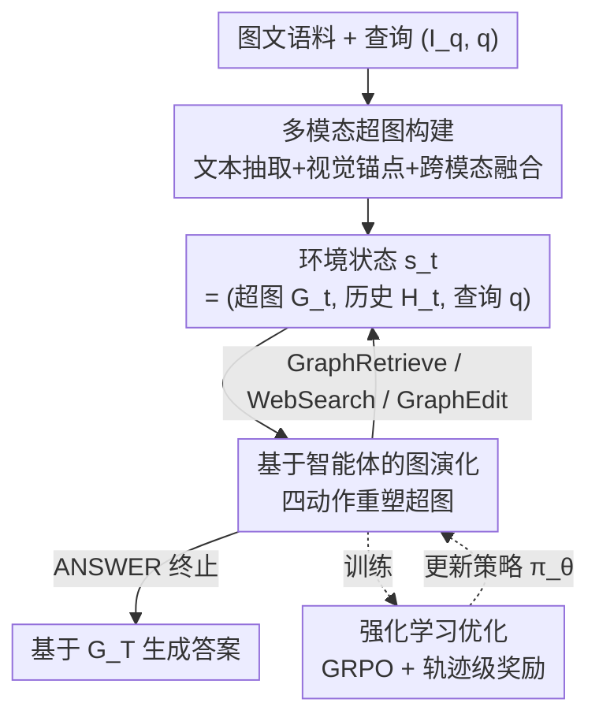

# EvoGraph-R1: Self-Evolving Multimodal Knowledge Hypergraphs for Agentic Retrieval

**会议**: CVPR 2026  
**论文**: [CVF Open Access](https://openaccess.thecvf.com/content/CVPR2026/html/Lin_EvoGraph-R1_Self-Evolving_Multimodal_Knowledge_Hypergraphs_for_Agentic_Retrieval_CVPR_2026_paper.html)  
**代码**: 待确认（论文未给出仓库链接）  
**领域**: 多模态VLM / Agentic Retrieval  
**关键词**: 多模态GraphRAG, 自演化知识图谱, 超图, MDP/强化学习, 智能体检索  

## 一句话总结
EvoGraph-R1 把多模态 GraphRAG 的知识超图从"离线建好、一次性查"的静态数据结构，重新定义成一个随推理过程协同演化的 MDP 环境——智能体通过"查图 / 联网搜 / 改图 / 回答"四个动作不断插入、修正、剪枝超图，再用 GRPO 端到端优化策略，在多模态 VQA 和纯文本 QA 上都刷到 SOTA。

## 研究背景与动机

**领域现状**：RAG 是把多模态大模型（MLLM）锚定到外部知识的主流范式。为了支持结构化、多跳推理，近期 GraphRAG 把检索证据组织成"实体-关系图"，典型流程是三步：LLM 抽实体关系建图 → 检索相关子图 → 基于子图生成答案。

**现有痛点**：作者指出这些系统有一个共同的根本假设——**知识图谱是离线一次性建好的静态结构，推理时只查不改**。这导致三个瓶颈：(1) **文本中心的碎片化**：LLM 抽取会把丰富的多模态证据压成孤立的文本三元组，丢掉跨模态依赖和长程关系；(2) **结构冻结**：图建完就不动了，推理时无法吸收新证据、纠正建图错误或覆盖未见过的话题；(3) **僵硬的单遍检索**：检索是 one-shot，初始证据不够时系统没法换策略、找替代路径或调用外部搜索。

**核心矛盾**：把知识图谱当成被动的"数据结构"，而非主动的"推理基底"。可人类做知识推理本身是交互、迭代的——先收集初始证据，发现缺口，再补充信息，调和矛盾，逐步精化理解。这恰好对应强化学习里"智能体感知状态→执行动作改变状态→拿反馈指导决策"的范式。

**本文目标**：让知识图谱在推理过程中"活起来"，能随查询动态扩张、修正、剪枝。

**切入角度**：把多模态 GraphRAG 重新建模成一个马尔可夫决策过程（MDP），其中**知识超图就是会和推理一起演化的环境状态**——状态是当前超图 + 动作历史 + 查询，动作是查图/扩图/改图/终止，奖励是轨迹级的推理质量与效率信号，策略用 RL 学。

**核心 idea**：用"智能体-环境交互不断重塑超图"替代"静态图上的一次性检索"，把检索、推理、知识演化统一进一个闭环。

## 方法详解

### 整体框架
EvoGraph-R1 由三块组成：(1) **多模态超图构建**——把图文语料融成统一的跨模态超图，作为智能体的初始环境状态 $G_0$；(2) **基于智能体的图演化**——把检索建模成 MDP，智能体在每一步观察当前超图、识别知识缺口，从四个动作里选一个去重塑超图并产生反馈；(3) **强化学习优化**——用轨迹级奖励经 GRPO 训练智能体策略。整条管线是一个闭环：超图与推理协同演化，直到智能体选择 `ANSWER` 或达到步数上限 $T$，基于演化后的 $G_T$ 生成最终答案。

### 关键设计

**1. 多模态超图构建：把图文证据融成可做高阶关系推理的统一环境**

针对"文本中心碎片化"这个痛点，作者不再把证据压成二元三元组，而是建一张**超图** $G_H=(V,E)$，分三步走。**文本子图抽取**：把输入文本切成知识片段，每条作为一条超边 $e_i=(e_i^{text}, V_{e_i}, r_i, \sigma_i)$，分别是自然语言描述、参与实体集合、关系类型和置信度 $\sigma_i\in(0,10]$；用一个 n 元关系抽取 prompt 让 MLLM 抽取器 $\pi_{ext}$ 产出 $F_d^{(n)}=\{f_1,\dots,f_k\}\sim\pi_{ext}(d)$，每个 $f_\ell=(e_\ell, V_{e_\ell})$ 把一条超边和它的实体集合绑定——超边而非二元边，让"一段文本贡献多个、可重叠的 n 元事实"，从而支持超越二元关系的高阶推理。**视觉子图构建**：对每张图先用 $\pi_{ext}$ 生成详细场景描述和主要物体名，把场景描述编码成一个高阶超边的**锚点节点** $u_x=(\text{id}=x,\text{type}=\text{image},\text{mod}=\text{vis})$，再从场景描述里抽实体和更细粒度的视觉关系事实 $(V_x^{vis}, E_x^{vis})=\pi_{ext}(x)$，并强制每条视觉超边都包含锚点 $u_x\in V_e$——保证视觉事实始终挂在它的图像来源上，不会"无源漂浮"。**跨模态融合**：用实体消解函数 $\phi$（字符串相似 + 嵌入邻近）匹配图文实体，合并成规范节点继承双模态属性，得到 $V=\text{Resolve}(V_{text}\cup V_{vis},\phi),\ E=E_{text}\cup E_{vis}$；最后用多模态编码器（如 GME）把所有实体和超边嵌入共享语义空间做离线索引，便于演化阶段检索。

**2. 基于智能体的图演化：把检索建成 MDP，让超图随推理自我演化**

这是全文的灵魂，直接解决"结构冻结"和"僵硬检索"两个痛点。作者把智能体-图交互建成离散时间 MDP。**状态** $s_t=(G_t, H_t, q)$：当前超图 $G_t$（编码已检索的实体/关系/视觉区域及其连接、跨模态对齐、相关度分数）、动作历史 $H_t$（一串 $(a_k, r_k, G_{k+1})$ 三元组）、查询 $q$——让智能体同时基于"当前结构"和"推理轨迹"决策，支持多轮推理和信用分配。**动作空间**有四类：`GRAPHRETRIEVE` 在当前超图上做跨模态实体级查找和超边级向量检索；`WEBSEARCH` 在图内证据不足时触发，构造查询 $q_{web}$ 联网取外部信息并对齐进上下文；`GRAPHEDIT` 直接改图，含三个互补子操作——`INSERT` 把检索到的新实体/超边作为已验证证据插进图、`UPDATE` 修正已有超边以纠错或加强事实依据、`DELETE` 通过**降低低质/被反驳元素的置信度**做软删除来剪噪；`ANSWER` 在证据充分时终止并基于 $G_t$ 出答案。**状态转移**由演化策略给出 $G_{t+1}=\pi_{evolve}(a_t, G_t)$：`GRAPHRETRIEVE` 只标记访问过哪些实体关系、不改结构，`WEBSEARCH` 作为外部接口把新事实和跨模态对齐补进图，只有 `GRAPHEDIT` 真正改图质量；每步都追加进历史 $H_{t+1}=H_t\cup(a_t, r_t, G_{t+1})$，最终答案 $a^*\leftarrow\pi_{resp}^{final}(q, H_T)$。这个递归更新机制把初始稀疏、含噪的 $G_0$ 逐步变成连贯、查询专属的知识状态 $G_T$，三个瓶颈被对症解掉：跨模态实体和对齐是动态构造而非预定义、图持续演化吸纳新证据并纠错、检索靠多轮探索而非单遍查找。

**3. 强化学习优化：用轨迹级奖励教会智能体"又准又省"地演化图**

光有动作空间不够，得让智能体学会"什么时候查、什么时候搜、什么时候改、什么时候停"。作者用 GRPO 训练策略 $\pi_\theta(a_t\mid s_t)$，奖励函数 $R(\tau)$ 由三部分构成。**结构奖励**约束每步是否遵守交互协议：每步产出中间块 $(a_t^{think}, \alpha_t, a_t^{out})$，格式良好就奖励、并设上限——$R_{struct}(\tau)=\min\big(1.0,\ \eta\sum_{t=1}^{|\tau|}\mathbb{I}_{valid}(t)\big)$，其中步进缩放因子 $\eta=0.5$，鼓励多轮推理的纪律性和语法一致。**答案奖励**用预测答案和真值 $y_q^*$ 的 token 级重叠（F1 式）衡量语义保真，不要求精确串匹配：

$$R_{ans}(a_T^{ans})=\frac{2\,|\text{tok}(a_T^{ans})\cap\text{tok}(y_q^*)|}{|\text{tok}(a_T^{ans})|+|\text{tok}(y_q^*)|}$$

**总体结果奖励**把正确性、结构、效率拧在一起：

$$R(\tau)=-\lambda\sum_{t=1}^{|\tau|}c(a_t)+R_{struct}(\tau)+\mathbb{I}[R_{struct}(\tau)=1.0]\cdot R_{ans}(a_T^{ans})$$

其中 $c(a_t)$ 是执行动作 $a_t$ 的归一化成本（检索/改图都有代价），$\lambda>0$ 是效率系数。这个设计的巧妙处在于：**只有当推理过程结构完整（$R_{struct}=1.0$）时，答案奖励才生效**——逼迫智能体先把推理流程走规范，再谈答得对不对，从而促成"高质量 + 低成本"的图演化。最后 GRPO 用组内相对优势（每条轨迹奖励和组均值比较）做稳定更新，从每题的多次 rollout 里高效学习。训练时只有 `GRAPHEDIT` 动作会真正提交修改 $m_t'$ 改变图状态，其余动作只采集信息。

## 实验关键数据

### 主实验
在纯文本（2WikiMultiHopQA / HotpotQA / NQ，F1）和多模态（E-VQA / InfoSeek / OK-VQA，准确率）两组基准上，EvoGraph-R1-7B 全面超越 RAG、GraphRAG、RL 增强三类基线。

| 设置 | 方法 | 2Wiki | HotpotQA | NQ | E-VQA | InfoSeek | OK-VQA |
|------|------|-------|----------|------|--------|----------|--------|
| 无检索 | GPT-4o-mini | 17.0 | 31.8 | 21.6 | 27.2 | 35.9 | 65.9 |
| GraphRAG | HippoRAG2 | 23.5 | 44.8 | 24.1 | 22.6 | 25.6 | 48.2 |
| RL 增强 | MMSearch-R1-7B | 38.5 | 45.3 | 41.6 | 36.9 | 41.3 | 59.9 |
| RL 增强 | Graph-R1-7B | 65.0 | 62.7 | 49.9 | 28.5 | 29.8 | 53.6 |
| **本文** | **EvoGraph-R1-7B** | **68.5** | **65.4** | **56.8** | **43.6** | **42.3** | **68.6** |

关键提升：文本上比最强基线 Graph-R1 高 +3.5%(2Wiki) / +2.7%(HotpotQA) / +6.9%(NQ)；多模态上 E-VQA 比 MMSearch-R1 高 +6.7%、比 MMKB-RAG 高 +7.7%，OK-VQA 比 GPT-4o-mini 高 +2.7%。对比"联网搜但不持久化"的方法优势尤其大——文本上比 MMSearch-R1 高 +21.8%、比 Search-R1 高 +17.5%，印证"持久演化图"胜过"用完即弃的瞬时检索"。

### 消融实验
在 2Wiki(F1) 和 E-VQA(Acc) 上逐个去掉组件，同时报告平均检索轮数（效率指标）。

| 配置 | 2Wiki F1 | 2Wiki 轮数 | E-VQA Acc | E-VQA 轮数 | 说明 |
|------|----------|-----------|-----------|-----------|------|
| Full（完整模型） | 68.5 | 2.57 | 43.6 | 1.65 | 全组件 |
| − 多模态超图 | 63.1 | 2.82 | 38.8 | 2.29 | 掉 5.4 / 4.8，轮数上升 |
| − INSERT | 60.1 | 3.48 | 36.8 | 2.45 | 掉最多（8.4 / 6.8），+0.8 低效轮 |
| − UPDATE | 63.0 | 2.95 | 39.7 | 2.10 | 掉 5.5 / 3.9，纠错价值 |
| − DELETE | 66.1 | 2.70 | 42.1 | 1.85 | 掉 2.4 / 1.5，剪噪小但稳定 |
| − WEBSEARCH | 58.9 | 3.17 | 32.4 | 2.22 | 掉最多（9.6 / 11.2） |

### 关键发现
- **INSERT 和 WEBSEARCH 是两根顶梁柱**：去掉 INSERT 在 2Wiki 掉 8.4%、检索轮数从 2.57 飙到 3.48（+35.4%）；去掉 WEBSEARCH 在 E-VQA 掉 11.2%，说明静态语料撑不住开放域和长尾知识，而一次性建图还会放大信息损失。
- **效率与精度同向收益**：EvoGraph-R1 收敛到约 2.4 轮、生成约 1,300 token；而无图编辑的变体约 3.1 轮 / 2,850 token，MMSearch-R1 约 3.5 轮 / 2,200 token——持久化超图让智能体避免冗余检索，答案也更聚焦不啰嗦。
- **越缺数据越能打**：把 Wikipedia 砍到 1%/5%/10% 时，EvoGraph-R1 在 1% 语料下仍有 37.2% 准确率（基线只有 13.2%–18.9%），且相对 MMKB-RAG 的领先从全量的 +7.7 扩大到 1% 时的 +13.2——`WEBSEARCH` 和动态 `INSERT` 在静态知识不足时价值凸显。
- **图确实越演化越好**：精化后超图节点 +2.60%、超边 +2.26%、图密度 +7.81%、聚类系数 +16.67%、边语义相似度 +3.16%（Table 4），结构和语义指标一致变好，从松散单跳关联变成更密、更连贯的多跳主题簇。

## 亮点与洞察
- **"图即环境"的范式转换最值钱**：把知识图谱从被动数据结构升格为会和推理协同演化的 MDP 环境，是本文的"啊哈"点——检索、推理、知识演化三件事第一次被统一进一个闭环，而不是各做各的。
- **DELETE 用软删除而非硬删**：通过降低被反驳元素的置信度来剪噪，保留了"可能还有用"的信息、避免误删，这个细节比直接删边更稳健，可迁移到任何带置信度的图维护任务。
- **结构奖励作为答案奖励的"闸门"**：$R_{ans}$ 只在 $R_{struct}=1.0$ 时才计入，先逼智能体把推理流程走规范再奖励对错——这种"门控奖励"思路能直接搬到其它要求过程可控的 agentic RL 任务上，抑制"蒙对答案但过程乱"。
- **模态无关的普适性**：去掉视觉组件、只留 agent 驱动的演化机制，框架就自然适配纯文本场景且照样 SOTA，说明"把图当交互环境"的价值独立于模态。

## 局限与展望
- **依赖强力外部组件**：建图用 GPT-4o-mini、检索用 GME、联网用 web search，整套系统的上限受这些黑盒能力牵制；论文未给出仓库链接，复现成本和可得性存疑。
- **答案奖励是 token 重叠 F1**，对需要精确数值/实体的问题可能给出虚高奖励（部分重叠也得分），可能引导策略偏向"覆盖关键词"而非真正答对。⚠️ 这是笔者的推测，作者未讨论。
- **`WEBSEARCH` 引入的开放网络噪声与时延**未做鲁棒性/安全性分析，长尾问题上联网内容质量参差，可能把错误证据 `INSERT` 进图——虽有 `DELETE` 软剪枝，但纠错是否及时缺乏专门验证。
- **可改进方向**：把奖励里的成本项 $c(a_t)$ 做成可学习/自适应（按问题难度调效率系数 $\lambda$）、给 `WEBSEARCH` 加证据可信度过滤再决定是否入图、探索把超图状态显式缓存复用以摊薄建图开销。

## 相关工作与启发
- **vs Graph-R1**：Graph-R1 也把检索当作超图上的交互式 agent-环境过程并用 RL 优化多轮探索，但它假设图是离线、固定的、只查不改；EvoGraph-R1 的关键差异是**在线**地扩张/更新/剪枝图（`GRAPHEDIT` 三操作），把"检索"变成"持续演化知识状态"，多模态上对 Graph-R1 领先尤为明显（E-VQA 43.6 vs 28.5）。
- **vs MMSearch-R1 / Search-R1**：这类工作给 MLLM 配主动联网，用 RL 交错推理与搜索，但**把检索内容当成瞬时 prompt 上下文用完即弃**；EvoGraph-R1 把每步检索（含 web 证据）都当作对持久超图的状态更新，持续扩展、修正、过滤，从而支持显式可追溯的系统性多跳推理，文本上领先 MMSearch-R1 高达 +21.8%。
- **vs RAG-Anything 等多模态 GraphRAG**：它们能构建编码跨模态关系的图，但仍假设静态离线结构；本文在推理时增量构建/更新/剪枝多模态超图，把检索从"静态一次性问答"转成"维护一个持久演化的知识状态"。

## 评分
- 新颖性: ⭐⭐⭐⭐⭐ 首个把多模态知识图谱建成 MDP 环境、让图与推理协同演化的框架，范式转换清晰且自洽
- 实验充分度: ⭐⭐⭐⭐⭐ 覆盖文本+多模态 6 个基准、三类基线、消融/效率/低资源/图结构统计五个角度
- 写作质量: ⭐⭐⭐⭐ 动机推导和方法分层讲得透，公式与图配合好；个别符号（如 $\pi_{evolve}$ 的具体实现）偏抽象
- 价值: ⭐⭐⭐⭐⭐ "图即可演化环境"+"门控奖励"两个思路对 agentic RAG 普遍可迁移，低资源场景增益尤其实用

<!-- RELATED:START -->

## 相关论文

- [\[CVPR 2026\] Agentic Video Summarization via Self-Reflecting Multimodal Understanding](agentic_video_summarization_via_self-reflecting_multimodal_understanding.md)
- [\[CVPR 2026\] VisPlay: Self-Evolving Vision-Language Models](visplay_self-evolving_vision-language_models.md)
- [\[CVPR 2026\] EvoLMM: Self-Evolving Large Multimodal Models with Continuous Rewards](evolmm_self_evolving_lmm_continuous_rewards.md)
- [\[CVPR 2026\] OVOD-Agent: A Markov-Bandit Framework for Proactive Visual Reasoning and Self-Evolving Detection](ovod-agent_a_markov-bandit_framework_for_proactive_visual_reasoning_and_self-evo.md)
- [\[CVPR 2026\] Decouple to Generalize: Context-First Self-Evolving Learning for Data-Scarce Vision-Language Reasoning](decouple_to_generalize_context-first_self-evolving_learning_for_data-scarce_visi.md)

<!-- RELATED:END -->
