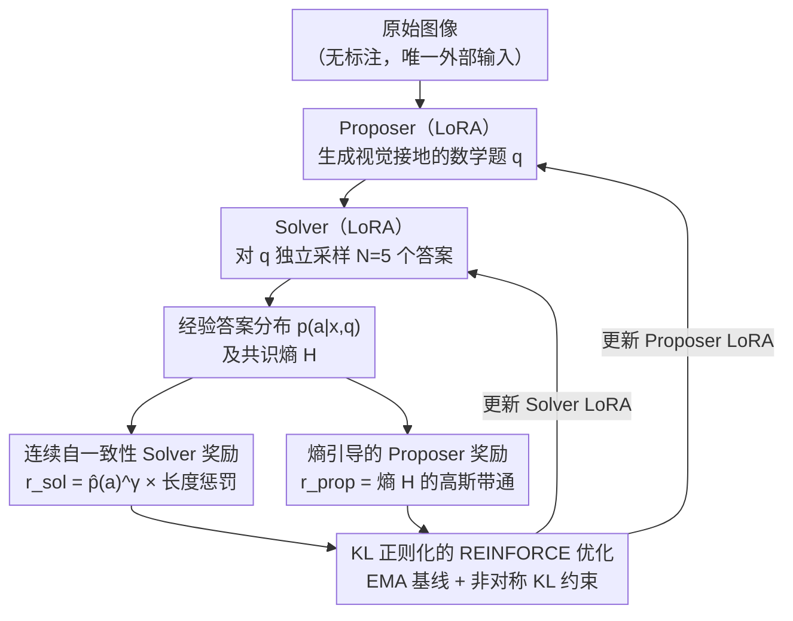

# EvoLMM: Self-Evolving Large Multimodal Models with Continuous Rewards

**会议**: CVPR 2026 Findings  
**arXiv**: [2511.16672](https://arxiv.org/abs/2511.16672)  
**代码**: [https://github.com/mbzuai-oryx/EvoLMM](https://github.com/mbzuai-oryx/EvoLMM) (开源)  
**领域**: 多模态VLM / 自进化学习  
**关键词**: 自进化LMM, 无监督自我改进, 连续自一致性奖励, Proposer-Solver, 视觉数学推理

## 一句话总结
提出 EvoLMM，一个纯无监督的自进化框架：从单一LMM分出Proposer（生成图像相关问题）和Solver（回答问题），通过连续自一致性奖励（替代离散多数投票）形成闭环训练信号，仅使用原始图像（无标注、无外部奖励模型），在8个多模态数学推理基准上获得约2-3%的一致性提升。

## 研究背景与动机

**领域现状**：大型多模态模型(LMM)在视觉推理上取得长足进步，但训练管线仍依赖(a)人工标注数据和(b)外部奖励模型/评估器，限制了自主性和可扩展性。

**现有痛点**：LLM领域已有自进化方法（SQLM、Proposer-Solver-Judge），但直接用到多模态领域存在问题：离散多数投票奖励在视觉推理早期产生大量零奖励更新，训练不稳定；现有多模态自改进方法（ViPER、Vision-Zero）仍依赖结构化中间信号。

**核心矛盾**：自进化需要有效的内部训练信号，但离散奖励在模型输出高度变化的早期阶段无法提供有意义的梯度反馈，导致优化停滞。

**本文目标** 在完全无监督条件下，让LMM通过内部一致性自我改进多模态推理能力。

**切入角度**：用连续自一致性奖励替代离散多数投票，提供平滑的梯度信号；用熵引导的Proposer奖励实现自适应课程学习。

**核心 idea**：连续自一致性奖励使Proposer和Solver平滑共同进化，仅用原始图像就能持续提升视觉推理能力。

## 方法详解

### 整体框架
EvoLMM 想回答一个很硬的问题：能不能让一个多模态模型**只看原始图像、不用任何标注和外部评判**，就把自己的视觉推理能力练上去？它的做法是把一个预训练 LMM（如 Qwen2.5-VL-7B）"一分为二"——backbone 冻结共享，各自挂一个 LoRA 适配器，一个扮 Proposer、一个扮 Solver。给一张图，Proposer 先编出一道视觉接地的数学题，Solver 对这道题独立采样 N=5 个答案；系统根据这 5 个答案彼此有多一致算出一个连续奖励，再用 REINFORCE + KL 正则化同时更新两个角色。整条回路里没有任何人工 QA、没有任何外部奖励模型，唯一的外部输入就是图像本身，两个角色就在这种自博弈里共同进化。

下图展示了这条闭环：原始图像经 Proposer 出题、Solver 多次采样后得到经验答案分布，再从分布派生出两路连续奖励（Solver 一路、Proposer 一路），最后由 REINFORCE 优化把梯度回灌给两个 LoRA 策略，形成自进化回路。

### 关键设计

**1. 连续自一致性 Solver 奖励：把"多数投票"换成可微的一致性信号**

最直接的内部信号是 self-consistency——同一道题答得越一致，说明模型越"想得通"。但前身 SQLM 用的是离散多数投票，只看哪个答案占多数，于是 2/5 和 3/5 这种"部分一致"完全拿不到区分信号；在视觉推理早期，Solver 输出高度发散，绝大多数更新的奖励都是零，梯度直接消失、训练停滞。EvoLMM 的改法是把奖励改成答案经验概率的 $\gamma$ 次方，再乘一个长度惩罚项：

$$r_{\text{Solver}} = \hat{p}(a)^{\gamma}\cdot \text{LenPenalty},\qquad \gamma=0.7$$

其中 $\hat{p}(a)$ 是某答案在 N=5 次采样里出现的经验频率，$\gamma<1$ 起"软化"作用——它把中等一致性（如 2/5、3/5）之间的差异放大成有意义的梯度，长度惩罚则压住啰嗦冗长的输出格式。这样即使模型还很不确定，奖励也是一条平滑上升的连续曲线而非"要么满分要么零"的阶跃，早期训练不再卡死。

> ⚠️ 上式按笔记原文描述形式化，确切公式以原文为准。

**2. 熵引导的 Proposer 奖励：让难度自适应，课程自己长出来**

光有 Solver 还不够——如果 Proposer 一直出"所有答案都一致"的送分题，或者出"答案乱成一团"的无解题，Solver 学不到东西。EvoLMM 用 Solver 那 5 个答案的熵 $H$ 来度量题目难度，给 Proposer 一个高斯带通奖励，让奖励在中等熵处最大：

$$r_{\text{Proposer}} = \exp\!\left(-\frac{(H-\mu_H)^2}{2\sigma_H^2}\right),\qquad \mu_H=0.90,\ \sigma_H=0.35$$

$H\to 0$ 意味着答案全一致、题太简单，$H$ 很大意味着题太难或太模糊，两头都被压低，只有"难而仍可解"的中等难度题能拿高分。妙处在于这会自然滚出一条课程：随着 Solver 变强，从前的中等题变得太简单（熵掉下去），Proposer 必须出更难的题才能维持高奖励，难度就被 Solver 的能力推着往上走——全程不需要任何外部 Judge 或人工设定的难度标准。

**3. KL 正则化的 REINFORCE 优化：稳住自博弈，别跑偏预训练**

无监督自博弈最怕策略越练越野、塌掉到一个退化解。EvoLMM 用 REINFORCE 更新两个 LoRA 策略，配指数移动平均（EMA）基线压方差，再用动态 KL 系数把策略拴在预训练模型附近。两个角色的"绳子"松紧不同：Solver 的 KL 约束更紧、优先保稳定不退化，Proposer 的 KL 约束更松、允许它探索出新题型，这种非对称约束让两边能稳定地一起往前走。

### 一个完整示例
拿一张图表（比如一张折线统计图）走一遍闭环：Proposer 看图编出"2019 到 2021 销量增长了多少？"这道题；Solver 对它采样 5 个答案，假设得到 {120, 120, 118, 95, 120}。多数投票下"120"占 3/5 算"通过"、给二值奖励；而 EvoLMM 算的是 $\hat p(120)=0.6$，连续奖励约 $0.6^{0.7}\approx0.69$ 再乘长度惩罚——一个平滑的正信号，Solver 据此被强化。同时这组答案的熵 $H$ 落在中等区间，正好踩在 Proposer 带通的高分段，于是"出这种难度的题"这一行为也被奖励。几千步之后，Solver 把这类题答得越来越稳（5 个答案趋于一致、熵下降），同一道题对 Proposer 的奖励随之走低，逼着它去编更绕的题（多步读数、跨子图比较），难度分布就从两头堆积的 U 型慢慢收成集中在中间的正态——课程自发涌现。

### 训练细节
- 基座模型：Qwen2.5-VL-7B，backbone冻结，两个LoRA适配器
- 训练数据：约6K原始图像（无QA标注），来自ChartQA、AI2D、InfographicVQA、PlotQA、ChartX、Geometry3K
- 硬件：8x AMD MI250X GPU，bfloat16精度
- 训练步数：6000步，batch size 1，Proposer每5步更新一次
- 超参数：N=5采样，gamma=0.7，学习率1e-6

## 实验关键数据

### 主实验（8个多模态推理基准）

| 模型 | ChartQA | MathVista | MathVision | MathVerse | AI2D | ScienceQA | MMMU |
|------|---------|-----------|------------|-----------|------|-----------|------|
| Qwen2.5-VL-7B Base | 84.00 | 68.46 | 23.91 | 43.78 | 82.61 | 88.30 | 51.11 |
| + 离散奖励 | 84.62 | 68.88 | 22.52 | 42.10 | 82.18 | 87.98 | 50.84 |
| + 连续奖励(Ours) | 86.70 | 70.52 | 24.81 | 44.88 | 83.41 | 89.50 | 52.01 |
| 提升 | +2.7 | +2.06 | +0.9 | +1.1 | +0.8 | +1.2 | +0.9 |

### 消融实验（参数更新策略）

| 策略 | ChartQA | MathVista | ScienceQA | 说明 |
|------|---------|-----------|-----------|------|
| LoRA | 86.70 | 70.52 | 89.50 | 最佳，保持预训练能力 |
| QLoRA | 85.32 | 68.92 | 88.73 | 量化噪声略有影响 |
| Full Finetune | 84.20 | 68.41 | 88.12 | 无外部监督下过拟合 |

### 跨模型泛化

| 基座模型 | ChartQA提升 | MathVista提升 |
|---------|------------|--------------|
| Qwen2.5-VL-7B | 84.00 -> 86.70 | 68.46 -> 70.52 |
| InternVL3-8B | 82.40 -> 84.97 | 65.20 -> 67.20 |

### 关键发现
- **连续 vs 离散奖励**：离散奖励在MathVision(-1.39)和MathVerse(-1.68)上甚至负提升，连续奖励在所有8个基准上都正提升
- **LoRA >> Full Finetune**：无外部监督的自进化场景下，参数高效微调优于全参数微调——全量微调容易过拟合内部信号
- **自适应课程自然涌现**：训练中Proposer从生成简单/过难问题逐渐过渡到中等难度问题，熵分布从U型变为集中在中间的正态分布
- **跨模型有效**：在Qwen2.5-VL-7B和InternVL3-8B上都有一致提升，说明方法通用

## 亮点与洞察
- **连续自一致性奖励**是核心贡献：用经验答案概率的gamma次方作为连续信号，避免了离散投票"要么全得要么零"的问题，是将self-consistency从评估指标升级为可微训练信号的关键创新。这个insight可推广到任何需要内部一致性作为训练信号的场景。
- **熵带通Proposer奖励**实现了零人工干预的课程学习：不需要任何外部难度标注，Solver的答案熵自然反映问题难度。这个机制可推广到任何需要自适应难度调节的自播放训练。
- **Figure 3和4的对比**极具教育意义：清楚展示了离散vs连续奖励在训练动态上的根本差异，是理解连续奖励优势的关键可视化。
- **实验的干净性**值得称赞：真正做到了"只有原始图像+预训练模型"的极简设置，没有任何隐藏的外部依赖。

## 局限与展望
- 提升幅度有限（约2-3%），与有监督方法相比差距明显
- 仅在数学/图表推理领域验证，对开放域视觉理解的泛化性未知
- 训练仅6K图像+6000步，scaling law未探索
- Proposer生成的问题质量未经人工评估，可能存在无意义问题
- 连续奖励在语义等价但形式不同的答案上可能不鲁棒（如"3.14"和"pi"）

## 相关工作与启发
- **vs SQLM [Huang et al.]**: SQLM是EvoLMM在LLM领域的前身，使用离散多数投票。EvoLMM证明了多模态场景必须用连续奖励替代离散奖励。
- **vs Vision-Zero [Xu et al.]**: Vision-Zero通过"谁是卧底"游戏自进化，但依赖GPT-4o/Gemini生成图像对。EvoLMM完全不依赖外部模型。
- **vs ViPER [Zhang et al.]**: ViPER用重建目标作为自监督，EvoLMM用一致性作为自监督——后者更通用，不需要图像生成能力。

## 评分
- 新颖性: ⭐⭐⭐⭐ 连续自一致性奖励和熵带通Proposer奖励是技术亮点，但整体框架继承自SQLM
- 实验充分度: ⭐⭐⭐⭐⭐ 8个基准、4个backbone、3种微调策略的全面消融
- 写作质量: ⭐⭐⭐⭐⭐ 离散vs连续奖励的可视化对比（Figure 3、4）非常直观
- 价值: ⭐⭐⭐⭐ 对无监督多模态自进化方向有重要参考价值，但绝对提升幅度有限

<!-- RELATED:START -->

## 相关论文

- [\[CVPR 2026\] VisPlay: Self-Evolving Vision-Language Models](visplay_self-evolving_vision-language_models.md)
- [\[ACL 2026\] iReasoner: Trajectory-Aware Intrinsic Reasoning Supervision for Self-Evolving Large Multimodal Models](../../ACL2026/multimodal_vlm/ireasoner_trajectory-aware_intrinsic_reasoning_supervision_for_self-evolving_lar.md)
- [\[CVPR 2026\] EvoGraph-R1: Self-Evolving Multimodal Knowledge Hypergraphs for Agentic Retrieval](evograph-r1_self-evolving_multimodal_knowledge_hypergraphs_for_agentic_retrieval.md)
- [\[CVPR 2026\] Evolving Contextual Safety in Multi-Modal Large Language Models via Inference-Time Self-Reflective Memory](evolving_contextual_safety_in_multi-modal_large_language_models_via_inference-ti.md)
- [\[ICML 2026\] Breaking Dual Bottlenecks: Evolving Unified Multimodal Models into Self-Adaptive Interleaved Visual Reasoners](../../ICML2026/multimodal_vlm/breaking_dual_bottlenecks_evolving_unified_multimodal_models_into_self-adaptive_.md)

<!-- RELATED:END -->
