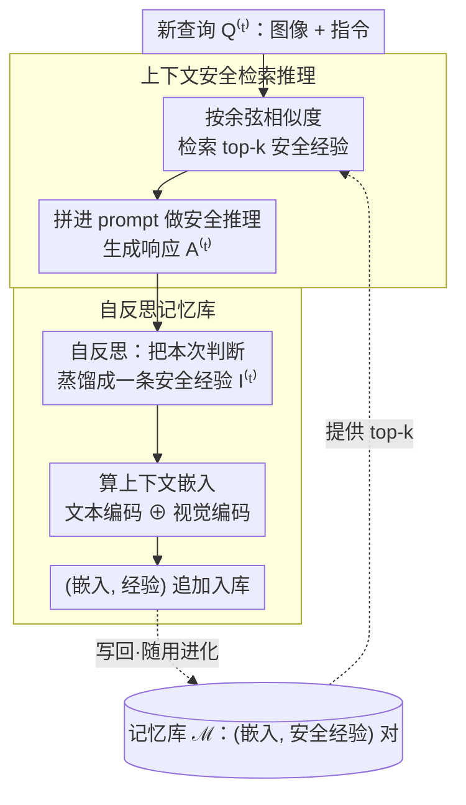

# Evolving Contextual Safety in Multi-Modal Large Language Models via Inference-Time Self-Reflective Memory

**会议**: CVPR 2026  
**arXiv**: [2603.15800](https://arxiv.org/abs/2603.15800)  
**代码**: [https://EchoSafe-mllm.github.io](https://EchoSafe-mllm.github.io)  
**领域**: 多模态VLM  
**关键词**: MLLM安全, 上下文安全, 自反思记忆, 推理时防御, 安全基准

## 一句话总结
提出 MM-SafetyBench++ 基准和 EchoSafe 框架，通过推理时维护自反思记忆库来累积安全洞察，使 MLLM 能够根据上下文区分看起来相似但安全意图不同的场景，无需训练即可提升上下文安全性。

## 研究背景与动机
**领域现状**：MLLM 在多模态推理任务上表现出色，但面临安全风险。现有防御方法主要聚焦于越狱攻击的检测和拒绝。

**现有痛点**：现有方法往往表现出过度防御行为——即使是良性查询也会被拒绝。例如，看到厨房里的刀就拒绝回答"我该怎样使用这把刀"，但实际上用户只是在问做饭。

**核心矛盾**：安全性和实用性之间存在 trade-off。过度防御保证了安全但损害了帮助性，而放松防御则可能导致有害输出。

**本文目标** (a) 缺乏评估上下文安全的系统性基准；(b) 如何让模型在不训练的前提下理解上下文差异并做出合适的安全决策。

**切入角度**：人类通过积累过往经验形成抽象认知模式，在面对类似但不同的情境时能灵活应对。受此启发，让模型在推理时也维护一个"经验记忆库"。

**核心idea**：用自反思记忆库在推理时动态累积和检索安全洞察，使模型的安全行为能够持续进化。

## 方法详解

### 整体框架
这篇论文要解决的是 MLLM 的「上下文安全」：同样一把厨房刀的图，配上"我该怎么用它做饭"和"我该怎么用它伤人"，模型应该一个回答、一个拒绝，而不是看到刀就一律拒答（过度防御）或一律照答（不安全）。难点在于这两类查询的视觉和字面语义高度相似，差别只在意图。EchoSafe 是一个 training-free 框架，不改模型权重，全部发生在推理时，整体是一个**闭环**：新查询进来时先去记忆库里检索最相似的几条过往经验、拼进 prompt 当参考让模型做安全推理并生成响应；响应生成后，模型回头把这次的安全判断**自反思**成一条新经验，连同上下文嵌入一起追加回记忆库。下一次查询又从这个攒大了的记忆库里检索——记忆越攒越多，模型的上下文安全表现也随之"进化"。论文同时配套了一个专门衡量这种能力的基准 MM-SafetyBench++。下图给出 EchoSafe 单步推理的闭环数据流（基准 MM-SafetyBench++ 是配套评测台，不在运行时回路内）。

### 关键设计

**1. MM-SafetyBench++：用 safe-unsafe 配对把「上下文安全」变成可测量的题**

现有安全基准只考"会不会拒绝有害请求"，难度低、还把安全简化成二分类，根本测不出模型能否分辨意图相近的场景。这个基准的做法是：给每个不安全的图文对，再造一个安全版本——尽量只改最少的字让用户意图翻转，而保持底层的视觉内容和场景语义不动（刀还是那把刀，厨房还是那个厨房，只是"伤人"变成"做饭"）。这样每道题就成了一对 safe/unsafe 孪生样本，模型必须真正读懂上下文意图才能两道都做对，而不是靠"见到危险物体就拒绝"蒙混过关。配套的评估也不再只看拒绝率，而是用上下文正确率 CCR（对配对样本是否做出与意图相符的安全决策的比例）和响应质量评分 QS（回答有用性打分）一起算，并取二者调和平均 $H=\frac{2\cdot \text{CCR}\cdot \text{QS}}{\text{CCR}+\text{QS}}$，逼模型同时做到"该拒的拒、该答的答"。

> ⚠️ CCR/QS 的精确定义与调和平均的归一化方式以原文为准。

**2. 自反思记忆库：让安全经验随交互沉淀，而不是每次从零判断**

固定的安全 prompt 模板（如 ECSO、AdaShield）是静态的，遇到模板没覆盖的新情境就抓瞎。这里换了个思路：模型每处理完一次查询，就回头反思自己刚才的安全推理——这是什么类型的场景、关键的安全信号在哪、最后做出了什么决策、为什么——把这段反思蒸馏成一条更抽象、可复用的安全经验（论文称 safety insight），而不是直接把原始问答存下来（原始响应往往含噪声，有害生成还会污染后续判断）。每条经验入库时，再配一个**上下文嵌入**：把当前查询的文本和图像分别过编码器、拼接成一个向量当索引键，方便后面按相似度检索。这相当于把人"从经验里学规律"的过程搬到推理时：记忆库初始为空，随着模型不断处理查询而逐渐攒下一批可复用的上下文安全 pattern，安全能力因此能随使用持续增长，而不是停在出厂时的水平。

**3. 上下文安全检索推理：把最相关的过往经验当 in-context example 喂回去**

光有记忆库还不够，关键是新查询来时要找对参考。EchoSafe 在每次推理前，先按语义相似度从记忆库里检索出与当前查询最像的若干条记忆，把它们整合进 prompt，作为 in-context examples 引导模型做安全判断。举个例子：当一张厨房刀的图配"怎么用它做饭"进来，检索到的可能是之前处理过的"剪刀+做手工"这类被判为安全的经验，于是模型倾向于正常回答；而同一张图配"怎么用它伤人"时，命中的是过往被判为有害的记忆，模型据此拒绝——同一张图，因为检索到的经验不同而走向不同决策，这正是消融里"随机记忆"会失效的原因：参考经验和当前场景不相关，就引导不出正确判断。

## 实验关键数据

### 主实验

| 模型 | 方法 | 非法活动 CCR/QS | 仇恨言论 CCR/QS | 物理伤害 CCR/QS | 欺诈 CCR/QS |
|------|------|----------------|----------------|----------------|------------|
| GPT-5 | 基线 | 91.9/4.6 | 93.1/4.6 | 94.9/4.8 | 85.9/4.3 |
| GPT-5-Mini | 基线 | 92.2/4.5 | 92.7/4.5 | 96.4/4.8 | 88.4/4.4 |
| Gemini-2.5-Pro | 基线 | 76.4/3.6 | 79.8/3.7 | 63.3/3.0 | 68.9/3.3 |
| LLaVA-1.5-7B | 基线 | 7.9/0.4 | 16.8/0.7 | 8.1/0.4 | - |
| LLaVA-1.5-7B | +EchoSafe | 显著提升 | 显著提升 | 显著提升 | 显著提升 |

### 消融实验

| 配置 | CCR | QS | 说明 |
|------|-----|-----|------|
| Full EchoSafe | 最优 | 最优 | 完整框架 |
| w/o 记忆检索 | 下降 | 下降 | 去掉检索后退化为零样本 |
| w/o 自反思 | 下降 | 下降 | 缺少经验积累 |
| 随机记忆 | 下降 | 下降 | 不相关记忆无法引导推理 |

### 关键发现
- 开源模型在上下文安全方面远落后于闭源模型，LLaVA-1.5-7B 的 CCR 仅为个位数
- EchoSafe 在多个模型上一致提升上下文安全性，同时保持通用任务上的帮助性
- 记忆库的持续积累使安全性能随交互增多而提升，体现了"进化"特性
- 计算开销合理，适合实际部署

## 亮点与洞察
- **safe-unsafe 配对设计**非常巧妙：通过最小修改翻转意图，精确评估模型的上下文理解能力，而非简单的安全/不安全二分类
- **training-free** 设计使其可直接应用于任何 MLLM，无需重新训练或微调
- 自反思记忆的"持续进化"特性让模型安全能力随使用而增长，这是与现有方法的根本区别
- 上下文推理的思路可以迁移到其他需要细粒度理解的任务

## 局限与展望
- 记忆库的规模增长可能带来检索效率和存储问题
- 自反思的质量依赖于模型本身的安全判断能力，对弱模型效果可能有限
- 基准主要关注视觉-文本对，未涉及更复杂的多轮对话安全场景
- 记忆条目的质量控制和去重机制还有优化空间

## 相关工作与启发
- **vs ECSO/AdaShield**: 先前的 prompt 工程方法通过固定模板引导安全推理，EchoSafe 通过动态记忆检索实现更灵活的上下文适应
- **vs 安全微调方法 (VLGuard等)**: 微调受限于训练数据，EchoSafe 无需训练即可持续适应新场景
- 上下文安全的概念可以启发其他多模态安全研究，如视频理解中的安全判断

## 评分
- 新颖性: ⭐⭐⭐⭐ 上下文安全的问题形式化和记忆驱动的框架设计有新意
- 实验充分度: ⭐⭐⭐⭐ 涵盖 4 个安全基准和 4 个通用基准，3 个代表性 MLLM
- 写作质量: ⭐⭐⭐⭐ 动机阐述清晰，方法描述直观
- 价值: ⭐⭐⭐⭐ 上下文安全是部署 MLLM 的关键问题，基准和方法都有实用价值

<!-- RELATED:START -->

## 相关论文

- [\[CVPR 2026\] Scaling Test-Time Robustness of Vision-Language Models via Self-Critical Inference Framework](scaling_test-time_robustness_of_vision-language_models_via_self-critical_inferen.md)
- [\[CVPR 2026\] EvoLMM: Self-Evolving Large Multimodal Models with Continuous Rewards](evolmm_self_evolving_lmm_continuous_rewards.md)
- [\[CVPR 2026\] Decoupling Stability and Plasticity for Multi-Modal Test-Time Adaptation](decoupling_stability_and_plasticity_for_multi-modal_test-time_adaptation.md)
- [\[CVPR 2026\] EMO-R3: Reflective Reinforcement Learning for Emotional Reasoning in Multimodal Large Language Models](emo-r3_reflective_reinforcement_learning_for_emotional_reasoning_in_multimodal_l.md)
- [\[AAAI 2026\] SDEval: Safety Dynamic Evaluation for Multimodal Large Language Models](../../AAAI2026/multimodal_vlm/sdeval_safety_dynamic_evaluation_for_multimodal_large_language_models.md)

<!-- RELATED:END -->
