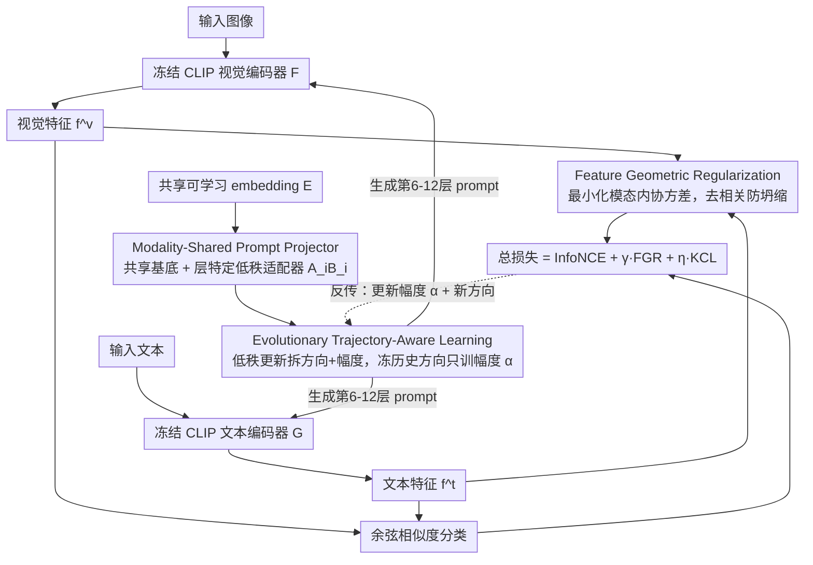

# EvoPrompt: Evolving Prompt Adaptation for Vision-Language Models

**会议**: CVPR 2026  
**arXiv**: [2603.09493](https://arxiv.org/abs/2603.09493)  
**代码**: 待确认  
**领域**: 多模态VLM  
**关键词**: prompt learning, 灾难性遗忘, 低秩分解, 特征去相关, VLM适应

## 一句话总结
EvoPrompt 通过轨迹感知的 prompt 进化策略（统一 embedding 投影 + 方向-幅度解耦训练 + 特征几何正则化）解决 VLM prompt learning 中的灾难性遗忘和模态偏差问题，在 few-shot/跨数据集/域泛化任务上全面 SOTA 且保持 zero-shot 能力。

## 研究背景与动机
**领域现状**：大规模视觉语言模型（CLIP、ALIGN 等）通过对比预训练获得强大的 zero-shot 泛化能力。为了高效适配下游任务，prompt learning（如 CoOp、CoCoOp、MaPLe）通过在冻结 backbone 上插入可学习 prompt token 来实现参数高效微调。

**现有痛点**：
   - **层间隔离**：MaPLe 等方法在每层独立插入 prompt，各层 prompt 相互孤立，无法传递跨层的语义信息流，破坏了 Transformer 的分层语义递进结构。
   - **模态偏差**：现有方案（如 MaPLe）存在文本中心偏差（text-centric bias），未能充分利用视觉-语言的互补交互。
   - **灾难性遗忘**：few-shot 适配时，可学习 prompt 迅速偏离预训练的语义锚点，过拟合少量下游数据，导致 zero-shot 泛化能力严重退化。

**核心矛盾**：任务特定适应 vs. 预训练知识保持之间的 trade-off——现有方法要么 base 类准确率高但 novel 类崩溃，要么保守适应但 base 类提升有限。

**本文目标**：(a) 建立跨层跨模态的 prompt 生成机制；(b) 控制训练过程中 prompt 的演化轨迹，防止知识遗忘；(c) 防止低数据场景下的特征表示坍缩。

**切入角度**：作者观察到 prompt 在训练过程中自然经历"通用语义锚点→任务特定特征"的渐进演化。如果能显式引导这条轨迹——保留早期学到的语义方向，只调整幅度——就能实现"忘不了"的适应。

**核心 idea**：将 prompt 投影器的低秩更新解耦为方向和幅度，冻结历史方向只训练幅度，配合特征几何正则化实现轨迹受控的 prompt 进化。

## 方法详解

### 整体框架
EvoPrompt 想解决的是 VLM prompt learning 里那个老大难的平衡：既要让 prompt 学到下游任务的特征，又不能让它在 few-shot 训练里漂移得太远、把 CLIP 原本的 zero-shot 知识忘掉。它的整条 pipeline 都搭在一个完全冻结的 CLIP（ViT-B/16）上——图像走视觉编码器 $F$、文本走文本编码器 $G$，两个 backbone 一个参数都不动。真正可学的东西很少：一个跨层共享的 embedding，从第 6 层到第 12 层每层注入的 prompt 都是由它经**Modality-Shared Prompt Projector（MPP）**投影生成的。训练时不直接放任 prompt 自由更新，而是用**Evolutionary Trajectory-Aware Learning（ETL）**把每一步低秩更新拆成"方向"和"幅度"，冻住历史方向、只调幅度，让 prompt 沿一条受控的轨迹缓慢进化；同时用一项**Feature Geometric Regularization（FGR）**几何正则把特征撑开、用一项知识恒常损失（KCL）把特征拽回原始 CLIP 附近。最终拿视觉特征 $f^v$ 和文本特征 $f^t$ 的余弦相似度做分类。下图按"共享 embedding → MPP 投影 → ETL 控制轨迹 → 注入冻结编码器 → 出特征 → 分类 + 三项损失反传"串起整条数据流：

### 关键设计

**1. Modality-Shared Prompt Projector：让所有层的 prompt 长在同一棵语义树上**

MaPLe 这类方法在每层各塞一组独立 prompt，层与层之间互不相通，等于把 Transformer 本来的分层语义递进给切断了。MPP 的做法是反过来——只维护一个共享的可学习 embedding $E \in \mathbb{R}^{K \times d_r}$（$K=5$，$d_r=512$），每一层、每个模态的 prompt 都从它投影出来：对模态 $m \in \{v, t\}$，第 $i$ 层的 prompt 是 $P_i^m = \text{Proj}_i^m(E)$。关键在投影器权重的分解方式——它不是每层一套独立矩阵，而是写成"共享基底 + 层特定低秩适配器"：

$$W_i^m = W_{\text{shared}}^m + A_i \cdot B_i$$

其中 $W_{\text{shared}}^m \in \mathbb{R}^{d_r \times d_m}$ 跨所有层共享，负责扛通用的视觉/文本模式；$A_i \in \mathbb{R}^{d_r \times r}$、$B_i \in \mathbb{R}^{r \times d_m}$ 是层特定的低秩矩阵，只负责编码本层独有的适应（浅层管纹理、深层管语义）。这样既让一份共享基底把跨层语义流串起来，又给每层留了低秩的微调空间，参数量从逐层独立的 $O((L-J+1) \cdot d_r \cdot d_m)$ 压到 $O(d_r \cdot d_m + (L-J+1) \cdot r \cdot (d_r + d_m))$，整体比 MaPLe 少 4.6 倍。

**2. Evolutionary Trajectory-Aware Learning：冻住方向、只调幅度，让 prompt 走一条忘不掉的轨迹**

这是全篇最核心的 trick，针对的就是 few-shot 适配时 prompt 迅速偏离语义锚点、把 zero-shot 能力训没了的问题。作者观察到 prompt 训练时自然经历"通用语义锚点 → 任务特定特征"的渐进演化，于是干脆把这条轨迹显式管起来。具体做法是把每个 epoch $t$ 的低秩更新拆成一个标量幅度 $\alpha_i^t$ 和一个 Frobenius 归一化后的方向矩阵 $\overline{A_i^t B_i^t}$，到第 $T$ 个 epoch 时层 $i$ 的总权重就是历史所有方向的加权累加：

$$W_i^T = W_{\text{shared}} + \sum_{t=1}^{T-1} \alpha_i^t \cdot \overline{A_i^t B_i^t} + \alpha_i^T \cdot \overline{A_i^T B_i^T}$$

诀窍在于：所有历史方向 $\{\overline{A_i^t B_i^t}\}_{t=1}^{T-1}$ 一旦学出来就冻死，每个新 epoch 只训练那些标量幅度 $\{\alpha_i^t\}$ 和当前这一个新方向 $\overline{A_i^T B_i^T}$。这背后是 DoRA 的发现——低秩适应里方向比幅度更关键，早期建立的方向编码了鲁棒的语义骨架，冻住它就等于保住了"认知骨架"，剩下让幅度自由伸缩去贴合任务，再靠每个 epoch 新增的方向补充增量知识。实际学出来的 $\alpha$ 也印证了这点：它在 epoch 2 冲到峰值后逐渐衰减，说明模型早期猛建核心方向、后期只做精细微调。配套还有一个 Adaptive Rank Reduction——训练分阶段把低秩矩阵的秩往下砍（$r_1 > r_\mu > r_\nu$，在 epoch $\mu$、$\nu$ 处降秩），因为后期 epoch 的边际贡献本就递减，低秩既是防过拟合的结构化正则，又顺手压住了方向累积带来的参数和算力开销。

**3. Feature Geometric Regularization：把对比学习漏掉的模态内结构补回来**

对比损失只盯着实例级的跨模态对齐，结果是特征各维度高度冗余、在低数据下容易坍缩。FGR 从 Soft-HGR（Hirschfeld-Gebelein-Rényi）最大相关性框架切入：InfoNCE 其实只对应了 Soft-HGR 目标的第一项（跨模态对齐），而第二项——模态内协方差结构——被完全忽略了。FGR 把这一项显式补上，最小化两个模态内协方差矩阵乘积的迹：

$$\mathcal{L}_{fgr}(\mathcal{F}^v, \mathcal{F}^t) = \frac{1}{2} \text{tr}(\text{cov}(\mathcal{F}^v) \cdot \text{cov}(\mathcal{F}^t))$$

这一项逼着每个模态内部的特征维度互相去相关，把特征空间撑开、每一维都用上，从而避免冗余坍缩——比简单加个正交正则更有原理依据，在 few-shot 这种维度容易浪费的场景里尤其管用。

### 损失函数 / 训练策略
总训练目标为三项加权和：
$$\mathcal{L}_{total} = \mathcal{L}_{InfoNCE} + \gamma \cdot \mathcal{L}_{fgr} + \eta \cdot \mathcal{L}_{kcl}$$
其中知识恒常损失 $\mathcal{L}_{kcl} = \frac{1}{2}[(1 - \cos(f^v, f_0^v)) + (1 - \cos(f^t, f_0^t))]$ 约束 prompted 特征不偏离原始冻结 CLIP 的特征分布。最优超参 $\gamma=25$, $\eta=0.5$。

训练配置：ViT-B/16 backbone，16-shot per class，prompt 从第 6 层插入到第 12 层，token 长度 $l=5$，embedding 向量数 $K=5$，单卡 A800，3 个随机种子取均值。

## 实验关键数据

### 主实验：Base-to-Novel Generalization（11 个数据集平均）

| 方法 | Base | Novel | HM |
|------|------|-------|------|
| CLIP (zero-shot) | 69.34 | 74.22 | 71.70 |
| CoOp | 82.69 | 63.22 | 71.66 |
| MaPLe | 82.28 | 75.14 | 78.55 |
| PromptSRC | 84.26 | 76.10 | 79.97 |
| MMA | 83.20 | 76.80 | 79.87 |
| **EvoPrompt** | **84.28** | **77.76** | **80.73** |

EvoPrompt HM 提升 +0.76%，Novel 类提升 +0.96%（对比之前最佳）。在 FGVCAircraft 上 Novel 类提升 1.27%，在 EuroSAT 上 HM 达 86.54%（SOTA MMA 为 83.87%）。

### 消融实验（ImageNet Base-to-Novel）

| 配置 | Base | Novel | HM | 说明 |
|------|------|-------|------|------|
| w/o MPP | 75.32 | 70.15 | 72.64 | 去掉统一投影器，退回逐层独立 prompt，HM 掉 1.65% |
| w/o $W_{\text{shared}}$ | 75.80 | 71.42 | 73.54 | 去掉共享权重，各层独立投影 |
| w/o AB | 76.15 | 70.90 | 73.43 | 去掉低秩适配器，用全秩投影 |
| w/o E.T. | 77.42 | 70.25 | 73.66 | 去掉轨迹感知训练：Base 上升但 Novel 暴跌 |
| w/o $\mathcal{L}_{kcl}$ | 77.24 | 70.55 | 73.74 | 去掉知识恒常损失 |
| w/o $\mathcal{L}_{fgr}$ | 76.70 | 70.52 | 73.48 | 去掉几何正则化 |
| **Full EvoPrompt** | 76.98 | 71.80 | **74.29** | 最佳平衡 |

### 关键发现
- **MPP 是基础**：去掉 MPP 后 HM 从 74.29% 跌至 72.64%，贡献最大。
- **ETL 和 KCL 的作用是"防遗忘"**：去掉后 Base 反而升高（过拟合 base），但 Novel 大幅下降，符合灾难性遗忘特征。
- **FGR 提供关键微调**：去掉后 HM 降至 73.48%，说明特征去相关对低数据泛化很重要。
- **训练效率**：仅 0.764M 可训练参数，推理速度 1282.1 FPS，训练 4.5ms/image。参数量比 MaPLe（3.555M）少 4.6 倍。
- **幅度演化规律**：学习到的 $\alpha$ 在 epoch 2 达峰值后逐渐衰减，说明早期建立核心特征方向、后期做精细微调。

## 亮点与洞察
- **方向-幅度解耦是核心技巧**：将低秩更新分解为 direction + magnitude，冻结历史 direction 只调 magnitude，是一种优雅的"渐进式知识积累"机制。这个思路不仅适用于 prompt learning，可以迁移到任何 LoRA 微调场景——在 continual learning 场景下特别有价值。
- **Soft-HGR 正则化的跨领域迁移**：把信息论中的最大相关性分析用于约束对比学习的特征几何结构，比简单的正交正则化更有原理支撑。这个 $\mathcal{L}_{fgr}$ 可以直接用于其他对比学习框架。
- **过拟合拐点"breakpoint"分析**（Fig.4）：MaPLe 在 breakpoint 后 Novel 类不可逆退化，而 EvoPrompt 在 breakpoint 后 Novel 类稳定。这个诊断方法本身就有参考价值。

## 局限与展望
- **仅在 CLIP ViT-B/16 上验证**：未报告在更大 backbone（ViT-L/14）或其他 VLM（如 SigLIP、EVA-CLIP）上的表现。
- **适应性 rank reduction 的阈值 $\mu, \nu$ 是手工设定的**：更理想的做法是根据验证集性能自适应调整。
- **方向累积的存储开销**：随 epoch 增加，需要存储所有历史方向矩阵。虽然有 rank reduction 缓解，但长期训练时可能成为瓶颈。可以探索方向合并（merging）策略。
- **FGR 的 batch size 敏感性**：协方差矩阵的估计质量依赖于 batch 大小，在极端 few-shot（1-shot）下可能不稳定。

## 相关工作与启发
- **vs MaPLe**: MaPLe 在每层独立插入 prompt 并通过耦合函数链接视觉-文本 prompt。EvoPrompt 用统一 embedding + shared base 替代，参数效率高 4.6 倍且跨层信息流更自然。
- **vs PromptSRC**: PromptSRC 用自一致性正则化（预测一致性约束）防遗忘。EvoPrompt 从优化轨迹层面解决，通过冻结方向从根本上阻止"方向漂移"，更直接。
- **vs DoRA**: DoRA 也做方向-幅度分解但是单次训练，EvoPrompt 把它扩展为 epoch 级别的渐进式积累，更适合 prompt evolution 的时序建模。

## 评分
- 新颖性: ⭐⭐⭐⭐ 方向-幅度解耦+渐进积累的训练策略很有创意，FGR 的引入也有理论支撑
- 实验充分度: ⭐⭐⭐⭐⭐ 4 种评估设置 × 11 个数据集，消融/超参/效率/轨迹分析全覆盖
- 写作质量: ⭐⭐⭐⭐ 整体结构清晰，数学推导完整，但分支组件较多读起来密度较大
- 价值: ⭐⭐⭐⭐ 方法有效且参数高效，核心 trick（方向冻结 + 幅度调整）有广泛迁移价值

<!-- RELATED:START -->

## 相关论文

- [\[CVPR 2026\] STAR: Test-Time Adaptation Can Enhance Universal Prompt Learning for Vision-Language Models](star_test-time_adaptation_can_enhance_universal_prompt_learning_for_vision-langu.md)
- [\[CVPR 2026\] Towards Calibrating Prompt Tuning of Vision-Language Models](towards_calibrating_prompt_tuning_of_vision-language_models.md)
- [\[CVPR 2026\] VisPlay: Self-Evolving Vision-Language Models](visplay_self-evolving_vision-language_models.md)
- [\[CVPR 2026\] Probabilistic Prompt Adaptation for Unified Image Aesthetics and Quality Assessment](probabilistic_prompt_adaptation_for_unified_image_aesthetics_and_quality_assessm.md)
- [\[CVPR 2026\] BiomedCCPL: Causal Conditional Prompt Learning for Biomedical Vision-Language Models](biomedccpl_causal_conditional_prompt_learning_for_biomedical_vision-language_mod.md)

<!-- RELATED:END -->
