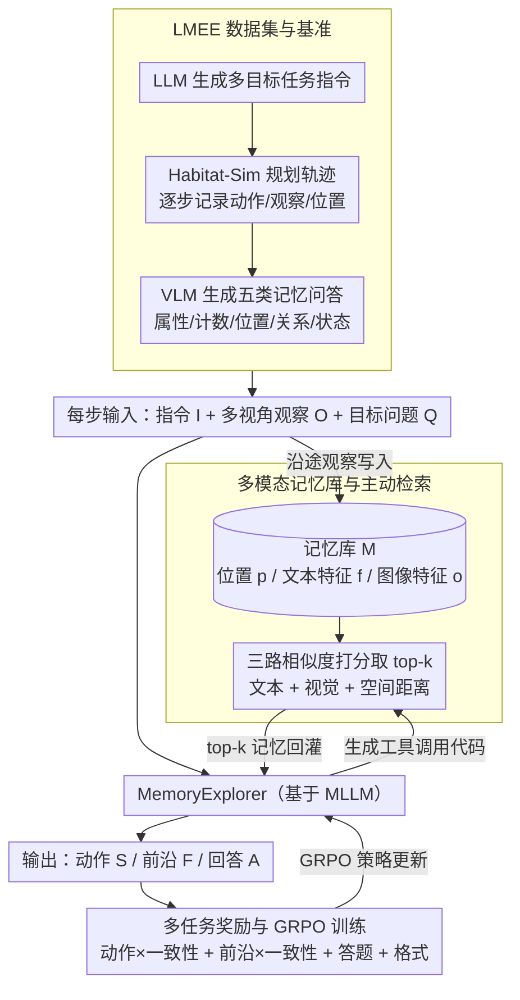

# Explore with Long-term Memory: A Benchmark and Multimodal LLM-based Reinforcement Learning Framework for Embodied Exploration

**会议**: CVPR 2026  
**arXiv**: [2601.10744](https://arxiv.org/abs/2601.10744)  
**代码**: [https://wangsen99.github.io/papers/lmee/](https://wangsen99.github.io/papers/lmee/)  
**领域**: 多模态VLM / 具身智能 / Agent  
**关键词**: 具身探索, 长期记忆, 多目标导航, 强化学习微调, 记忆检索

## 一句话总结
本文提出 LMEE 基准和 MemoryExplorer 框架，通过将多目标导航与记忆问答统一评估具身探索的过程与结果，并用强化学习微调 MLLM 使其主动调用记忆检索工具，在 LMEE-Bench 上 SR 达 23.53%（超越 3D-Mem 的 16.91%）、GOAT-Bench 上 SR 达 46.40%。

## 研究背景与动机

1. **领域现状**：具身探索旨在让智能体在未知环境中主动探索。当前主流任务范式包括目标导航（ObjectNav）和具身问答（EQA），但两者通常是独立评估的一次性任务——导航只关心是否找到目标，问答只关心答案是否正确。

2. **现有痛点**：(a) 现有基准忽视了探索过程中的记忆积累和利用——一个理想的具身智能体应该在探索中积累环境知识并在后续任务中利用；(b) 现有 MLLM 探索方法对记忆的使用是被动的——模仿学习方法（如 MTU3D）限制了自主探索策略的发展，记忆快照方法（如 3D-Mem）用预过滤策略处理上下文窗口限制但无法充分发挥 MLLM 的主动查询能力；(c) 缺乏同时评估认知理解和决策能力的统一框架。

3. **核心矛盾**：长时地平线任务需要智能体同时具备高效探索能力和长期记忆利用能力，但当前方法要么只优化导航成功率，要么只关注问答准确率，无法统一优化两者。

4. **本文目标** (1) 设计统一评估探索过程（记忆）和结果（导航成功）的基准；(2) 训练能主动检索记忆以辅助探索和决策的 MLLM 智能体。

5. **切入角度**：探索过程中积累的情景记忆（episodic memory）不仅是副产品，更应该是驱动后续决策的核心资源。通过记忆问答（Memory-based QA）来评估和训练记忆利用能力。

6. **核心 idea**：用强化学习微调 MLLM，使其在多目标导航中主动调用记忆检索工具查询情景记忆，同时通过多任务奖励函数统一优化动作预测、前沿选择和记忆问答。

## 方法详解

### 整体框架
这篇论文想解决的问题是：让具身智能体一边探索未知环境、一边把看到的东西攒成长期记忆，并在后续决策时主动调取这些记忆。整套工作分两层：离线先按「LMEE 数据集与基准」把任务、轨迹、记忆问答构建出来；在线则跑 MemoryExplorer——一个基于 MLLM 的端到端框架，每一步的输入是任务指令 $I$（如"检查圣诞树、烘干机，然后卧室床头柜"）、当前三个方向的多视角观察 $O$、以及一个目标导向问题 $Q$；沿途观察被持续写入「多模态记忆库」，模型可以生成工具调用代码去主动检索这个记忆库，把 top-k 相关记忆回灌进上下文，最终一并输出这一步的离散动作 $S$（前进/左转/右转）、下一步要去的前沿点 $F$ 和对问题的回答 $A$。整个智能体用「多任务奖励 + GRPO」强化学习微调，把"走对路"和"答对题"放进同一个奖励里一起优化，奖励再回头更新策略，形成闭环。

### 关键设计

**1. LMEE 数据集与基准：把"探索过程"也纳入评测**

以往的 ObjectNav 只看是否找到目标、EQA 只看答案对不对，探索途中积累的记忆被当成用过即弃的副产品，没人评。LMEE 想补上这个缺口：它基于 HM3DSem（145 个训练场景 + 36 个测试场景），先用 LLM 生成多目标任务指令，再用 Habitat-Sim 规划探索轨迹，逐步记录动作、观察和位置形成步进数据；探索沿途用图像标签模型标注物体，构成多模态记忆库。关键的一笔是用 VLM 围绕导航目标生成问答对，分属性、计数、位置、关系、状态五类——问题只问智能体确实路过、确实观察过的目标物，所以"答得对"才能真实反映记忆是否被利用，而不是靠常识蒙。最终数据规模为 1,982 个任务、9,286 个问题、377,311 条记录，并按区域数、目标数和距离划分简单/中等/困难三级难度。

**2. 多模态记忆库与主动检索：让模型自己决定查什么、何时查**

记忆库写成 $\mathcal{M} = \{(p_i, f_i, o_i)\}$，每一步存下位置 $p_i$、文本特征 $f_i$ 和图像特征 $o_i$（后两者由 CLIP 编码）。检索时不是只比对图文，而是把文本相似度、视觉相似度和空间距离三路一起算分：

$$s_i = \omega_f(f_c^\top f_i) + \omega_o(o_c^\top o_i) + \omega_p\,\text{dist}(p_c, p_i)$$

其中带下标 $c$ 的是当前查询的特征，取得分最高的 top-k 条记忆喂进推理上下文。这里最本质的区别在于"主动"二字：3D-Mem 那类做法是系统预先过滤好一批记忆塞给模型（被动接收），而 MemoryExplorer 让模型自己生成工具调用代码去查询，由它判断当下该不该查、该查什么——这更贴合智能体自主决策的设定，也把记忆从一堆静态快照变成模型可以随用随取的资源。

**3. 多任务奖励与 GRPO 训练：把走路、选前沿、答题拧成一股绳**

单一奖励顾此失彼——只奖导航就练不出认知，只奖问答就不会探索。本文用一个多任务总奖励同时管三件事：

$$r_{\text{total}} = w_{act}\cdot r_{\text{action}}\cdot c + w_{front}\cdot r_{\text{frontier}}\cdot c + w_{ans}\cdot r_{\text{answer}} + w_{fmt}\cdot r_{\text{format}}$$

动作奖励 $r_{\text{action}}$ 和前沿奖励 $r_{\text{frontier}}$ 都乘上一个一致性系数 $c$，当"选的动作"和"选的前沿"逻辑矛盾时扣分；$r_{\text{format}}$ 则鼓励结构化输出。为了逼模型真的学会用工具，还引入缩放因子 $\alpha$：成功调用记忆检索时把子奖励放大（$\alpha=1.2$），调用失败时缩减——相当于用奖励差额告诉模型"会查、查对了才有甜头"。策略优化采用 GRPO（Group Relative Policy Optimization）。

### 一个完整示例
以指令"检查圣诞树、烘干机，然后卧室床头柜"为例走一遍：智能体从客厅出发，前几步一路前进、左转，把沿途看到的圣诞树、沙发、电视等连同位置和 CLIP 特征逐条写进记忆库；找到圣诞树后任务推进到第二目标"烘干机"，模型这一步面对问题"烘干机是开着还是关着"，于是生成工具调用代码，用当前观察作为查询 $f_c, o_c, p_c$ 在记忆库里按 $s_i$ 打分，取回 top-k 条最相关的洗衣房快照——哪怕烘干机此刻不在视野里，只要之前路过并存过，就能据此回答"关着"并同时决定往洗衣房方向的前沿点走。整条轨迹里，记忆库随探索单调增长、检索按需触发，导航与问答共用同一份不断累积的情景记忆。

### 损失函数 / 训练策略
- 基于 Qwen2.5-VL-7B-Instruct，使用 EasyR1（简化版 VERL）框架
- 学习率 1e-6，KL 惩罚系数 0.1
- 8 张 NVIDIA H200 GPU，训练 160 步，全局 batch size 128
- 连续动作窗口采样：将连续相同动作采样为单条训练数据，减少冗余
- 不优化工具调用的中间响应，仅用最终奖励反馈评估工具使用效果

## 实验关键数据

### 主实验

**LMEE-Bench 结果**:

| 方法 | SR ↑ | SPL ↑ | QA Score ↑ | QA Acc ↑ |
|------|------|-------|------------|----------|
| Explore-EQA | 13.24 | 7.66 | - | - |
| 3D-Mem | 16.91 | 6.86 | 32.59 | 41.38 |
| RA-Mem | 20.96 | 12.18 | 35.52 | 58.62 |
| **MemoryExplorer** | **23.53** | **14.99** | **43.62** | **65.52** |

**GOAT-Bench 结果**:

| 方法 | Success Rate ↑ | SPL ↑ |
|------|---------------|-------|
| SenseAct-NN Skill Chain | 29.5 | 11.3 |
| 3D-Mem | 37.05 | 20.26 |
| RA-Mem | 42.81 | 21.95 |
| **MemoryExplorer** | **46.40** | **28.03** |

### 消融实验

| 问题类型设置 | LMEE SR | LMEE SPL | LMEE Score | GOAT SR | GOAT SPL |
|------------|---------|----------|------------|---------|----------|
| Baseline (无RFT) | 20.96 | 12.18 | 35.52 | 42.81 | 21.95 |
| Simple (任务进度) | 20.80 | 12.49 | 41.33 | 44.24 | 27.29 |
| Multiple-choice | 23.53 | 14.99 | 43.62 | 46.40 | 28.03 |
| All (全部) | 22.06 | 15.13 | 43.28 | 48.20 | 29.36 |

### 关键发现
- **RA-Mem vs 3D-Mem 的提升说明主动检索优于被动过滤**：仅从被动过滤改为主动检索查询，GOAT-Bench SR 从 37.05% 跳到 42.81%
- **强化学习微调的核心价值在于工具使用能力的习得**：训练曲线显示模型逐渐学会更准确地调用记忆检索工具，工具使用率和回答准确率同步提升
- **多类型问题比单一问题更有效**：使用所有问题类型时 GOAT SR 达到最高（48.20%），但单一 multiple-choice 问题在 LMEE SR 上表现最好（23.53%），说明问题类型与任务特性有非线性正相关
- **认知与决策的对齐问题**：不同 MLLM 在开放式和选择题上的表现不一致（Qwen2.5-VL 擅长开放式，Qwen3-VL 擅长选择题），暗示认知理解和行动决策能力可能存在错位

## 亮点与洞察
- **LMEE 范式的统一性**：将导航和问答统一到同一探索过程中，首次在数据集层面融合了"过程"和"结果"的评估。这避免了分别评估导致的能力割裂问题。
- **工具使用激励机制**：通过奖励缩放因子 $\alpha$ 差异化对待成功/失败的工具调用，让模型自主学会何时使用记忆检索。这种设计可以迁移到其他需要工具使用的 LLM Agent 训练中。
- **记忆增强的渐进式理解**：智能体在探索中逐步积累记忆，当面对问题时检索相关记忆进行推理，这种模式很好地模拟了人类"基于经验思考"的认知过程。

## 局限与展望
- **仅支持单轮工具调用**：由于多图输入限制，当前只支持一次记忆检索，多轮迭代检索可能提供更准确的结果
- **评估子集有限**：因资源限制仅在 58/166 个测试任务上评估，可能存在选择偏差
- **动作空间簡單**：仅包含前进(0.25m)和左右转(30°)三种离散动作，距真实机器人操控差距大
- **记忆库构建依赖预定义标签模型**：用图像标签模型标注物体信息的质量直接影响记忆质量
- **改进方向**：引入多轮记忆检索、扩展到连续动作空间、在真实机器人场景验证

## 相关工作与启发
- **vs 3D-Mem**: 3D-Mem 使用记忆快照和预过滤机制，是被动记忆使用方式；MemoryExplorer 通过 RL 训练主动记忆检索，GOAT SR 从 37.05% 提升到 46.40%
- **vs MTU3D**: MTU3D 用模仿学习训练轨迹复制，限制了泛化能力；MemoryExplorer 用 RL 鼓励自主探索策略
- **vs GOAT-Bench**: GOAT-Bench 专注多目标导航但忽略记忆利用；LMEE 增加了记忆问答维度，更全面评估具身智能
- 本文的多任务奖励设计和工具使用激励机制，对训练 LLM Agent 具有通用参考价值

## 评分
- 新颖性: ⭐⭐⭐⭐ 统一探索过程与记忆评估的范式较新，RL训练主动记忆检索有创意
- 实验充分度: ⭐⭐⭐⭐ 在自建基准和 GOAT-Bench 上都有评估，消融充分，但评估子集偏小
- 写作质量: ⭐⭐⭐⭐ 结构清晰，动机阐述充分，但部分细节（如连续动作窗口）描述不够
- 价值: ⭐⭐⭐⭐ 为具身智能的终身学习方向提供了有价值的基准和方法，但真实场景验证缺失

<!-- RELATED:START -->

## 相关论文

- [\[CVPR 2026\] PersonaVLM: Long-Term Personalized Multimodal LLMs](personavlm_long_term_personalized_multimodal_llms.md)
- [\[CVPR 2026\] HIVE: Query, Hypothesize, Verify — An LLM Framework for Multimodal Reasoning-Intensive Retrieval](hive_query_hypothesize_verify_an_llm_framework_for_multimodal_reasoning-intensiv.md)
- [\[CVPR 2026\] Scaling the Long Video Understanding of Multimodal Large Language Models via Visual Memory Mechanism](scaling_the_long_video_understanding_of_multimodal_large_language_models_via_vis.md)
- [\[CVPR 2026\] EMO-R3: Reflective Reinforcement Learning for Emotional Reasoning in Multimodal Large Language Models](emo-r3_reflective_reinforcement_learning_for_emotional_reasoning_in_multimodal_l.md)
- [\[CVPR 2026\] Training High-Level Schedulers with Execution-Feedback Reinforcement Learning for Long-Horizon GUI Automation](training_high-level_schedulers_with_execution-feedback_reinforcement_learning_fo.md)

<!-- RELATED:END -->
