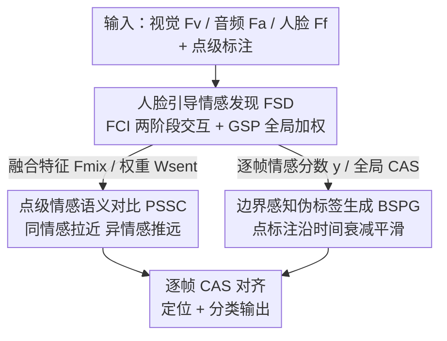

# Face-Guided Sentiment Boundary Enhancement for Weakly-Supervised Temporal Sentiment Localization

**会议**: CVPR 2026  
**论文**: [CVF Open Access](https://openaccess.thecvf.com/content/CVPR2026/html/Han_Face-Guided_Sentiment_Boundary_Enhancement_for_Weakly-Supervised_Temporal_Sentiment_Localization_CVPR_2026_paper.html)  
**代码**: https://github.com/CeilingHan/FSENet  
**领域**: 多模态VLM / 视频理解  
**关键词**: 时序情感定位, 点级弱监督, 人脸引导, 对比学习, 伪标签平滑  

## 一句话总结
FSENet 把人脸特征作为情感线索引导音视频交互，在只有"点级"时间戳标注的弱监督设定下，用对比学习对齐情感语义、再把稀疏点标注扩展成边界平滑的伪标签，从而在 TSL300 上把时序情感定位的平均 mAP 推到 21.45%，超过此前 SOTA 约 5%。

## 研究背景与动机
**领域现状**：时序情感定位（Temporal Sentiment Localization, TSL）要在未裁剪的有声视频里既判断情感类别（正/负）又定位它出现的时间区间。全监督需要逐帧标注，代价极高，于是社区转向弱监督：要么只给整段视频一个标签（video-level），要么给每个情感片段一个时间戳点（point-level，即 P-WTSL）。点级标注只需在情感片段内点一下，大幅降低成本，但片段的起止边界完全未知。

**现有痛点**：点级弱监督有三个具体困难。① **冗余信息淹没情感信号**——视频里背景、画面色彩等内容繁杂，真正承载情感的信号被埋没，模型难以挖出有效线索；② **稀疏点标注导致边界不确定**——每段只有一个锚点，无从判断情感从哪一帧开始、到哪一帧结束；③ **情感突变且短暂**——真实场景里情感可能在很短时间内出现又消失，分类容易出错。已有点级方法（如 TSL）主要靠时序上下文和语义对齐做逆映射，但忽略了跨模态的同步性（人脸表情、画面、声音之间的呼应）和情感语义的对立性（正 vs 负）。

**核心矛盾**：弱监督下"找到情感线索"和"定准情感边界"是两件互相牵制的事——线索靠粗粒度的整段感知更稳，边界却需要帧级的精细判别，而稀疏点标注两头都喂不饱。

**切入角度**：作者的关键观察是**人脸表情**正好能同时缓解这三个问题——表情直接反映情感刺激、面部区域的细微变化比"人物/背景"这类大场景差异更容易捕捉、且人脸特征本就从视觉帧里抽取因而能和视频特征协同学习。

**核心 idea**：用**人脸引导的多模态交互**去发现情感线索，再用**点级对比 + 边界感知伪标签**两步优化把稀疏点标注变成可用的边界监督，三者拼成一个统一框架 FSENet。

## 方法详解

### 整体框架
FSENet 的输入是一段未裁剪视频抽出的三路特征——视觉 $F_v$、音频 $F_a$、人脸 $F_f$（均为 $\mathbb{R}^{T\times d}$，$T$ 是帧/段数），以及若干点级情感标注 $Y_{anno}=\{(t_i, y_{t_i})\}_{i=1}^N$；输出是逐帧的"类别感知情感分数"（Category-aware Sentiment Score, CAS），据此定位情感片段并分类。

整条管线分三段：先由 **Face-guided Sentiment Discovery (FSD)** 用双分支（人脸为中心的交互分支 FCI + 全局情感感知加权分支 GSP）挖出情感线索、产出融合特征 $F_{mix}$ 和情感权重 $W_{sent}$；再由 **PSSC** 在时间轴上做点级对比学习、拉近同情感帧、推远异情感帧，专门强化语义判别；最后由 **BSPG** 把孤立的标注点沿时间扩展成平滑衰减的伪标签 $\hat{y}$，给边界监督提供连续可靠的目标。三段产出的 CAS（FCI 路）、Global CAS（GSP 路）都向 BSPG 的伪标签 $\hat{y}$ 对齐，PSSC 的对比损失则单独作用在特征空间。

### 关键设计

**1. Face-guided Sentiment Discovery：用人脸当"线索锚"引导音视频交互**

这一模块直击"冗余信息淹没情感信号"的痛点，由两条并行分支组成。**Face-Centric Interaction (FCI)** 分两阶段做交叉注意力：第一阶段让人脸分别去引导视觉和音频，$F_v^{(f)} = F_v + \mathrm{MHAttn}(F_f, F_v, F_v)$、$F_a^{(f)} = F_a + \mathrm{MHAttn}(F_f, F_a, F_a)$，即用人脸特征当 query、视觉/音频当 key/value，先在相对"干净"的单模态上把情感相关片段挑出来；第二阶段再让这两路人脸引导后的特征互相交互，$F_v^{(af)} = F_v^{(f)} + \mathrm{MHAttn}(F_a^{(f)}, F_v^{(f)}, F_v^{(f)})$（音频引导人脸-视觉）、$F_a^{(vf)} = F_a^{(f)} + \mathrm{MHAttn}(F_v^{(f)}, F_a^{(f)}, F_a^{(f)})$，拼接得 $F_{mix}=[F_v^{(af)}; F_a^{(vf)}]\in\mathbb{R}^{T\times 2d}$，捕捉更复杂的跨模态情感。**Global Sentiment Perception (GSP)** 则从整体视角补充：把三路特征拼接送进卷积层 $E(\cdot)$，经回归头和 sigmoid 得到逐帧情感权重 $W_{sent}=\sigma(\mathrm{Reg}(E([F_a; F_v; F_f])))\in[0,1]$，刻画每一帧的情感强度。FCI 负责跨模态的时序对齐、GSP 负责全局的情感显著性，二者协同把情感刺激线索从繁杂背景里拎出来——消融显示两阶段人脸引导逐步加入最优，去掉 GSP 会掉约 1.2% mAP。

**2. Point-aware Sentiment Semantics Contrast：把点标注变成对比学习的"原型锚"**

稀疏点标注本身判别力不足，PSSC 用对比学习把它放大。对时间轴上每个候选帧嵌入 $f_t$，计算它到该类全部标注点的相似度之和 $d_t^{c_i}=\sum_{n=1}^{N}\mathrm{sim}(f_t, p_n^{c_i})$（$\mathrm{sim}$ 为余弦相似度）。构造正负样本时引入 GSP 的情感权重做加权筛选：类别 $c_i$ 的正样本集取 $W_{sent}\cdot d$ 的 Top-K，$U_{c_i}^{+}=\{f_t \mid d_t^{c_i}\in\mathrm{Top\text{-}K}(\{W_{sent,t}\cdot d_t^{c_i}\}_{t=1}^{T})\}$（$K<T-N$ 控制正集大小，且排除标注点自身）；其它类别 $c_j\neq c_i$ 附近的帧作为负样本集 $U_{c_j}^{-}$。以标注点特征的均值 $\bar{p}_{c_i}$ 作情感原型，构成三元组 $\{\bar{p}_{c_i}, U_{c_i}^{+}, U_{c_j}^{-}\}$，对比损失为

$$\mathcal{L}_{sc} = -\sum_{i=1}^{C}\log\frac{\sum_{f_t\in U_{c_i}^{+}}\exp(f_t\cdot\bar{p}_{c_i})}{\sum_{f_t\in\{U_{c_i}^{+}, U_{c_j}^{-}\}}\exp(f_t\cdot\bar{p}_{c_{k}})}$$

把同情感帧拉向原型、把异情感帧推开。妙处在于用 GSP 的显著性权重过滤候选，避免把低情感强度的帧误纳入正集，提升点级分类的判别力。

**3. Boundary-aware Sentiment Pseudo-label Generation：把孤立点"摊"成平滑边界伪标签**

传统做法是对逐帧情感分数卡一个阈值来定边界，但分数对噪声敏感，得到的伪标签边界抖动、不连续。BSPG 改成从标注点向两侧**逐帧衰减**地生成平滑分数：

$$s_t = \beta + (1-\beta)\left(1 - \frac{|t - t_p|}{w}\right)$$

其中 $t_p$ 是标注点时刻，$w\in\mathbb{Z}^+$ 是平滑窗口长度（控制影响多少邻帧）、$\beta\in[0,1]$ 是边界处的最小伪标签值（控制衰减下限）。再把它和模型输出分数 $y$ 融合成伪标签 $\hat{y}_{t,c_i}$：当 $|t-t_p|\le w$ 时，情感类取 $s_t$、非情感类（$c_i=c+1$）取 $1-s_t$，窗外取 0；其中 $I(y_t)$ 是阈值函数，当非情感置信度超过 $\tau=0.95$ 时把情感分数置零。这样标注点附近形成一条连续衰减的"情感小山包"，比硬阈值的方波边界平滑得多——消融里 BSPG 把 mAP 从无伪标签的 16.92% 提到 21.45%（约 +4.5%）。

### 损失函数 / 训练策略
主干把 $F_{mix}$ 过 $C+1$ 路独立卷积 + sigmoid 得逐帧 CAS：$y=\sigma(\mathrm{CLS}(F_{mix}))\in\mathbb{R}^{T\times(C+1)}$（多出的一类是"非情感"）。GSP 路再做特征级协同，得到 Global CAS：$\tilde{y}_t=[W_{sent,t}\cdot y_{t,1:C};\,(1-W_{sent,t})\cdot y_{t,C+1}]$。总损失

$$\mathcal{L}_{total} = \mathcal{L}_{base} + \lambda_1\cdot(\mathcal{L}_{frame} + \mathcal{L}_{frame}^{glo}) + \lambda_2\mathcal{L}_{sc}$$

其中 $\mathcal{L}_{base}=-\sum_c \mathrm{avg}(\hat{y}_c)\log\mathrm{avg}(y_c)$ 做视频级对齐；$\mathcal{L}_{frame}$（FCI 路 $y$ 对 $\hat{y}$）和 $\mathcal{L}_{frame}^{glo}$（GSP 路 $\tilde{y}$ 对 $\hat{y}$）是帧级对齐，用 $\gamma=2$ 的 focal loss 区分情感/非情感帧。超参 $\lambda_1=1$、$\lambda_2=0.05$、$w=7$、$\beta=0.6$；Adam，学习率 $1\times10^{-5}$，600 epoch，单张 A40。

## 实验关键数据

### 主实验
数据集为 TSL300（300 段未裁剪视频，平均时长 >250 秒）和 CMU-MOSEI；指标为 IoU 阈值 0.1–0.3（步长 0.05）下的 mAP，外加 Recall 和 F2 分数。视觉/音频/人脸特征分别用 I3D / MFCC / ResEmoteNet 抽取，人脸框由 DeepFace 检测。

| 设定 | 方法 | Avg mAP(%) | Recall(%) | F2(%) |
|------|------|-----------|-----------|-------|
| 点级弱监督 | TSL（前 SOTA） | 20.40 | 71.14 | 35.36 |
| 点级弱监督 | **FSENet** | **21.45** | **75.02** | 33.67 |
| 视频级弱监督 | UM | 10.75 | 55.33 | 23.94 |
| 视频级弱监督 | **FSENet** | **12.53** | 58.11 | 30.0 |
| 全监督 | AFSD | 22.14 | 75.10 | 31.78 |
| 全监督 | **FSENet** | 21.87 | **79.58** | 30.37 |

点级设定下 FSENet 在所有 IoU 阈值取得最佳 mAP、平均 21.45%，超 TSL 约 5%；在 CMU-MOSEI 上平均 mAP 16.54%，超 TSL 和 HR-pro 各约 5.5%、5.1%。值得注意的是它一个"小模型"在 TSL300 上的平均 mAP（21.45%）大幅压过 Qwen3-Omni-30B 零样本（5.07%）和 LLaMA-2-7B LoRA（9.97%），说明 LLM 的文本中心表示难以对齐音视频/人脸的时序情感。

### 消融实验

| 配置 | Avg mAP(%) | 说明 |
|------|-----------|------|
| Full（FCI 两阶段 + GSP） | 21.45 | 完整 FSD |
| 仅 GSP（去 FCI） | 18.42 | 去掉人脸交互，掉 3.0% |
| FCI 一阶段 + GSP | 19.10 | 只做单模态人脸引导 |
| FCI 两阶段（去 GSP） | 20.22 | 去全局感知，掉约 1.2% |
| 无伪标签 | 16.92 | BSPG 整体贡献 ≈ +4.5% |
| 仅阈值伪标签 | 20.29 | 硬阈值边界 |
| 去 $\mathcal{L}_{frame}+\mathcal{L}_{frame}^{glo}$ | 12.53 | 同时去两帧级损失，骤降 8.9% |

### 关键发现
- **人脸引导要"两阶段渐进"才有效**：只做第一阶段单模态引导（19.10%）或直接上第二阶段复杂融合都提升有限，两阶段一起用才到 21.45%，说明先在干净单模态挑线索、再做深度跨模态交互的顺序很重要。
- **帧级对齐损失是命脉**：单独去掉 $\mathcal{L}_{frame}$ 或 $\mathcal{L}_{frame}^{glo}$ 各掉约 1.4%/0.8%，但两者同时去掉骤降 8.9%——伪标签的边界约束几乎全靠这两项落地。
- **公平对比下人脸增益真实存在**：在统一特征设定里，即使只用音视频特征 FSENet 也比 SOTA 高 0.48%；加上同款人脸特征后各方法都涨，FSENet 仍以 21.45% 领先 △TSL 0.59%，排除了"靠更强人脸抽取器取巧"的质疑。

## 亮点与洞察
- **把"人脸"提为一等公民的情感锚**：以往 TSL 把人脸混在视觉里，本文显式用人脸当 query 去引导音视频注意力——细微表情比大场景差异更易捕捉，这个直觉很朴素却切中弱监督下"线索难找"的要害。
- **GSP 权重一鱼两吃**：同一个 $W_{sent}$ 既参与 Global CAS 的计算、又用来给 PSSC 的正样本筛选加权，让"全局情感强度"这一信号在分类和对比两处复用，设计很经济。
- **伪标签从"方波"变"山包"**：把点标注沿时间按 $\beta,w$ 衰减成平滑分布，这个 label smoothing 思路可直接迁移到其它点级/时间戳弱监督的时序定位任务（动作、事件检测），缓解边界抖动。

## 局限与展望
- **强依赖人脸可见**：方法建立在"面部表情反映情感刺激"上，对没有清晰人脸的视频（旁白、风景、遮挡）增益可能消失，论文未讨论这类退化场景。
- **数据规模偏小**：TSL300 仅 300 段、CMU-MOSEI 只保留两类情感，绝对 mAP（20% 量级）仍偏低，泛化到更细情感类别或更大规模数据待验证。
- **超参对衰减形状敏感**：$w=7$、$\beta=0.6$ 是在 TSL300 调出的，伪标签"山包"的宽窄直接决定边界质量，换数据集可能需重调 ⚠️ 原文未给跨数据集的敏感性曲线。
- **DeepFace+ResEmoteNet 的两段式人脸抽取**是预处理离线流程，端到端联合优化人脸表示是一个自然的改进方向。

## 相关工作与启发
- **vs TSL [55]**：同样做点级弱监督 TSL，TSL 靠逆映射 + 对比学习但忽略跨模态同步与情感语义对立；本文用人脸引导显式建模跨模态一致性，并在点级对比里引入情感原型与异类负集，点级平均 mAP 21.45% vs 20.40%。
- **vs 视频级弱监督（UM / CoLA / DDG-Net 等）**：它们缺乏细粒度时间标签，边界难定；FSENet 用点级标注 + BSPG 平滑伪标签把边界约束补上，平均 mAP 与 F2 都大幅领先。
- **vs LLM 方案（Qwen3-Omni / LLaMA-2 LoRA）**：LLM 推理强但文本中心表示难对齐音视频时序情感，零样本仅 5.07% mAP；有趣的是把本文的 BSPG 伪标签接到 LLaMA-2 微调上能再涨 1.8%，说明边界平滑思路对大模型同样有效。

## 评分
- 新颖性: ⭐⭐⭐⭐ 人脸引导 + 点级对比 + 边界平滑伪标签的组合在 P-WTSL 上较新，但各组件均属已有范式的巧妙拼装。
- 实验充分度: ⭐⭐⭐⭐ 跨三种监督设定 + 两数据集 + LLM 对比 + 多组消融，公平特征对照尤其扎实；惜数据规模偏小。
- 写作质量: ⭐⭐⭐⭐ 三模块动机清晰、公式完整，图文对应较好。
- 价值: ⭐⭐⭐⭐ BSPG 平滑伪标签与人脸引导思路可迁移到其它弱监督时序定位任务。

<!-- RELATED:START -->

## 相关论文

- [\[CVPR 2026\] Prototype-as-Prompt: Multimodal Sentiment Prototypes Endowing Large Language Models the Capability to Perform Multimodal Sentiment Analysis](prototype-as-prompt_multimodal_sentiment_prototypes_endowing_large_language_mode.md)
- [\[CVPR 2026\] Conflict-Aware Adaptive Cross-Reconstruction for Multimodal Sentiment Analysis](conflict-aware_adaptive_cross-reconstruction_for_multimodal_sentiment_analysis.md)
- [\[CVPR 2026\] Factorize, Reconstruct, Enhance: A Unified Framework for Multimodal Sentiment Analysis](factorize_reconstruct_enhance_a_unified_framework_for_multimodal_sentiment_analy.md)
- [\[CVPR 2026\] Enhance-then-Balance Modality Collaboration for Robust Multimodal Sentiment Analysis](enhance-then-balance_modality_collaboration_for_robust_multimodal_sentiment_anal.md)
- [\[CVPR 2026\] EBMC: Enhance-then-Balance Modality Collaboration for Robust Multimodal Sentiment Analysis](ebmc_multimodal_sentiment_analysis.md)

<!-- RELATED:END -->
