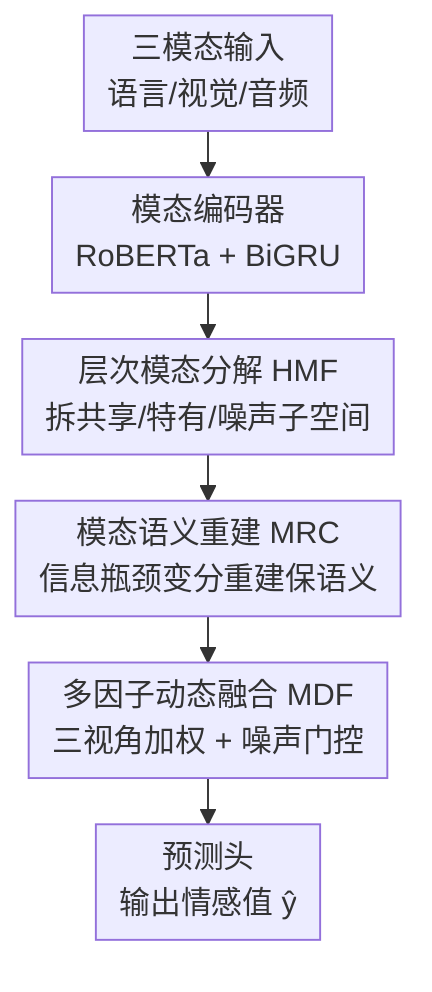

# Factorize, Reconstruct, Enhance: A Unified Framework for Multimodal Sentiment Analysis

**会议**: CVPR 2026  
**论文**: [CVF Open Access](https://openaccess.thecvf.com/content/CVPR2026/html/Yang_Factorize_Reconstruct_Enhance_A_Unified_Framework_for_Multimodal_Sentiment_Analysis_CVPR_2026_paper.html)  
**代码**: 无  
**领域**: 多模态VLM / 多模态情感分析  
**关键词**: 多模态情感分析, 子空间解耦, 噪声子空间, 信息瓶颈重建, 动态融合  

## 一句话总结
FUSE-Net 把每个模态显式拆成「共享 / 特有 / 噪声」三个子空间（factorize），用基于信息瓶颈的变分重建保住情感语义（reconstruct），再用三视角的样本自适应动态融合做加权聚合并门控压噪（enhance），在 MOSI / MOSEI / SIMSv2 三个基准上的回归与有序分类指标都刷到最优。

## 研究背景与动机
**领域现状**：多模态情感分析（MSA）要从文本、语音、视觉三路异构信号里推断人的情感极性与强度。主流做法分两条线——一是融合派（TFN、LMF、MulT 等）直接在特征/决策层做注意力或分层聚合；二是表示学习派（MISA、Self-MM、DTN 等）在融合前先把单模态表示净化，常用共享-私有解耦或对比一致性目标。

**现有痛点**：单模态表示其实纠缠了三种异质信息——跨模态共享的情感语义、模态独有的情感线索、以及任务无关的噪声扰动。已有的「共享-私有」二分解耦太粗，**没有显式隔离噪声**：真正的模态特异线索和噪声扰动会混在同一个私有分支里，导致 nuisance 泄漏到下游融合，在低信噪比或模态不可靠时尤其脆弱。

**核心矛盾**：解耦目标（对比/几何约束）只管控潜在分量之间的相对几何，并**不保证**保留下来的信息足以重构出与情感相关的模态语义。一旦分解过猛，微弱但关键的情感证据会被一起压掉，语义残缺再传到融合阶段就放大成不稳定预测。同时，解耦与融合往往被当成松耦合的两步，缺乏样本自适应的融合机制去动态调节各模态/各分支的贡献。

**本文目标**：把「干净地分离子空间」和「保住情感语义」和「自适应融合」三件事在一个框架里联合优化。

**核心 idea**：在传统共享-私有之上**显式增设噪声子空间**，用信息瓶颈重建通道防止过度净化，再用一个把融合控制拆成三种互补尺度（样本级 / 因子类型级 / 分支级）的动态融合模块做样本自适应聚合——即标题的 factorize → reconstruct → enhance。

## 方法详解

### 整体框架
输入是一段视频的三模态特征序列 $U=(X^L, X^V, X^A)$（语言 / 视觉 / 音频），输出是 utterance 级的连续情感值 $\hat{y}$。FUSE-Net 的主干是一条「编码 → 三因子分解 → 重建正则 → 动态融合 → 预测」的串行管线，其中分解、重建、融合三个模块是本文贡献。

具体地：三路特征先过各自的模态编码器（文本用 RoBERTa/BERT + masked mean pooling，音视频用单层 BiGRU）得到上下文表示 $(H_L, H_V, H_A)$；送入**层次模态分解（HMF）**把每个模态拆成共享 $H^h_m$、特有 $H^s_m$、噪声 $H^n_m$ 三个子空间；这些因子再经**模态语义重建通道（MRC）**用变分重建保住情感相关语义、压掉冗余；精炼后的因子交给**多因子动态融合（MDF）**，用样本调制、因子类型系数、分支注意力三者乘积决定每个「模态×因子」分支的权重并对噪声分支门控压制；最后融合表示过预测头出 $\hat{y}$。

### 关键设计

**1. 层次模态分解 HMF：用一个显式噪声分支挡住 nuisance 泄漏**

针对「共享-私有二分太粗、噪声混进私有分支」这个痛点，HMF 把每个模态的表示 $H_m$ 分解成三个互补子空间：共享 $H^h_m$（跨模态不变的情感语义）、特有 $H^s_m$（模态独有但情感相关的线索）、噪声 $H^n_m$（情感无关扰动）。显式引入 $H^n_m$ 是关键——它把 nuisance 单独抽走，逼着情感知识集中到 $(H^h_m, H^s_m)$，给后续重建和融合一个更干净的基底。

分解由三个协同目标学出来。一是**对比分离目标**，把跨模态共享语义对齐、同时防止模态特异信息塌进共享分支：先定义相似度 $\phi(u,v)=\exp(\mathrm{sim}(u,v)/\tau)$，再用

$$L_{contrast} = -\frac{1}{6}\sum_{a\in\Omega}\sum_{b\in\Omega, b\neq a}\log\frac{\phi(H^h_a, H^h_b)}{\phi(H^h_a, H^h_b)+\phi(H^h_a, H^s_a)}$$

让不同模态的共享表示互相靠拢，而把本模态的特有表示当负样本推开。二是**信息增益约束**：给三个分支各挂一个辅助情感估计器，得到分支信息分 $\ell^m_h, \ell^m_s, \ell^m_n$，用 $L_{info}=\frac{1}{|\Omega|}\sum_m(-\ell^m_h-\ell^m_s+\ell^m_n)$ 把情感判别力往共享/特有分支堆、从噪声分支里压走。三是**对偶一致性约束**：用一对可逆映射 $g_m, g_m^{-1}$ 强制共享和特有子空间互相可恢复，$L_{dual}=\frac{1}{|\Omega|}\sum_m(\lVert H^h_m-g_m(H^s_m)\rVert_2^2+\lVert H^s_m-g_m^{-1}(H^h_m)\rVert_2^2)$，稳定分解、抑制表示漂移。三者加权合成 $L_{HMF}=\lambda_{contrast}L_{contrast}+\lambda_{info}L_{info}+\lambda_{dual}L_{dual}$。

**2. 模态语义重建 MRC：用信息瓶颈重建防止分解把弱情感线索一起压没**

HMF 只管控分量之间的几何关系，并不保证留下的信息够重构出情感语义。在低信噪比、部分损坏或模态失衡时，过猛的分解会把微弱但关键的情感证据压掉，语义残缺传到融合阶段就引发不稳定预测。MRC 就是为此补的显式语义保持机制，思路来自变分信息瓶颈（VIB）：让潜在表示既要**充分**（够重构情感语义）又要**最小**（压掉残余冗余），借受控压缩实现去噪。

做法是把每个模态的三因子拼起来 $H^{concat}_m=[H^h_m; H^s_m; H^n_m]$，过模态专属变分编码器 $E_\phi$ 参数化一个对角高斯后验 $q_\phi(z_m\mid H^{concat}_m)$，用重参数化采样 $z_m$ 再经解码器 $D_\theta$ 重构出分解前的模态表示 $\hat{H}_m$。目标为

$$L_{MRC}=\sum_{m\in\Omega}\left(\lVert\hat{H}_m-H_m\rVert_2^2 + \beta\, D_{KL}\big(q_\phi(z_m\mid H^{concat}_m)\,\Vert\,\mathcal{N}(0,I)\big)\right)$$

重构项靠惩罚情感内容的丢失来保语义充分性，KL 项约束潜在通道的信息容量来压残余冗余，$\beta$ 调两者平衡。值得注意的是 MRC 作用在**三分支的拼接**上，使重建信号能联合精炼共享/特有/噪声三个子空间，缓解「光靠分解导致过度净化」的风险，给下游 MDF 喂更鲁棒的因子。

**3. 多因子动态融合 MDF：把融合控制拆成三种尺度做样本自适应加权 + 噪声门控**

即便有了干净分解，融合本身仍难：每个模态的有效贡献高度依赖样本（音视频可能被背景噪声/遮挡污染，不同 utterance 靠不同模态表达情感），共享 vs 特有线索的相对重要性随上下文变，残余噪声还在各分支不均匀分布。静态拼接或固定权重容易在噪声分量主导时崩。MDF 把融合控制拆成三个互补尺度的标量：

- **样本调制分** $\alpha_m=\mathrm{MLP}([H^h_m; H^s_m])$，从模态的共享+特有因子算出，刻画该样本下这个模态整体多重要；
- **因子类型系数** $\beta^{(x)}$（$x\in\{h,s,n\}$），一个可学习的结构先验，编码「共享/特有/噪声」三类因子的全局倾向；
- **分支注意力** $\gamma^{(x)}_m=\mathrm{Attn}(H^{(x)}_m)$，逐「模态×因子」估的标量注意力。

三者相乘得到每个分支的未归一 logit $\ell^{(x)}_m=\alpha_m\cdot\beta^{(x)}\cdot\gamma^{(x)}_m$，再**在每个模态内部**对三个因子做 softmax 归一 $w^{(x)}_m=\exp(\ell^{(x)}_m)/\sum_{x'}\exp(\ell^{(x')}_m)$，从而逐样本地在共享/特有/噪声之间重新分配该模态的贡献。跨模态加权聚合得 $F^{(h)}=\sum_m w^{(h)}_m H^{(h)}_m$、$F^{(s)}=\sum_m w^{(s)}_m H^{(s)}_m$；噪声分支额外过一道门控 $F^{(n)}=\sum_m w^{(n)}_m\cdot\mathrm{Gate}(H^{(n)}_m)$，其中 $\mathrm{Gate}(h)=h\odot\sigma(W_g h+b_g)$ 用可学习 sigmoid 再压一次残余噪声。最后三因子拼接 $H_{fused}=\mathrm{Concat}[F^{(h)}, F^{(s)}, F^{(n)}]$ 过两层 MLP 出 $\hat{y}$。

### 损失函数 / 训练策略
总目标把任务损失和两个模块正则项合起来：

$$L_{total}=\lambda_{task}L_{task}+L_{HMF}+\lambda_{MRC}L_{MRC}$$

其中 $L_{task}$ 是连续情感标签上的均方误差（MSE）。训练用 AdamW + ReduceLROnPlateau，按验证集早停，结果对 5 个随机种子取平均，单卡 RTX 4090。⚠️ 原文提到代码里还实现了一个 siamese 式噪声正则项，但所有实验里其系数置零，故略去。

## 实验关键数据

### 主实验
在 MOSI、MOSEI、SIMSv2 三个基准上对比融合派（TFN/LMF/MulT）与解耦/正则派（MISA/Self-MM/DTN/ALMT 等）。FUSE-Net 在三个基准上 MAE 全部最低，MOSI/MOSEI 的 Acc7 也最优。

| 数据集 | 指标 | FUSE-Net | DTN（强基线） | 提升 |
|--------|------|----------|----------|------|
| MOSI | MAE ↓ | **0.688** | 0.716 | -3.91% |
| MOSI | Acc7 ↑ | **49.27** | 47.5 | — |
| MOSI | Corr ↑ | **0.798** | 0.790 | — |
| MOSEI | MAE ↓ | **0.527** | 0.572 | -7.87% |
| MOSEI | Acc7 ↑ | **54.32** | 52.3 | — |
| SIMSv2 | MAE ↓ | **0.297** | 0.302 | — |
| SIMSv2 | Acc5 ↑ | **55.51** | 53.71 | +3.35% |

以 DTN 为参照，MOSI 上三个可比指标平均相对增益 2.88%（MAE 提升最大 3.91%），MOSEI 平均增益更大达 4.21%（MAE 提升 7.87%），SIMSv2 平均增益 1.96%（Acc5 提升最大 3.35%）。说明该框架对连续情感预测的误差压制尤其有效，且在更细粒度的离散化协议下更鲁棒。

### 消融实验
在 MOSI 上做组件消融（5 种子平均）：

| 配置 | MAE ↓ | Acc7 ↑ | 说明 |
|------|-------|--------|------|
| FUSE-Net (Full) | 0.688 | 49.27 | 完整模型 |
| w/o HMF | 0.754 | 43.0 | 去层次分解，掉点最多 |
| w/o MRC | 0.729 | 45.7 | 去信息瓶颈重建 |
| w/o MDF | 0.712 | 46.3 | 去动态融合 |
| w/o Language | 1.246 | 23.5 | 去文本模态，崩溃 |
| w/o Audio | 0.758 | 45.7 | 去音频 |
| w/o Visual | 0.723 | 46.4 | 去视觉 |

### 关键发现
- 三个贡献组件里 **HMF 贡献最大**：去掉后 MAE 从 0.688 恶化到 0.754、Acc7 从 49.27 掉到 43.0，印证「显式三因子分解（尤其噪声分支）」是干净表示的根基；MRC、MDF 依次递减但都为正贡献。
- 模态重要性上 **文本是绝对主导**：去掉语言模态 MAE 直接飙到 1.246、Acc7 崩到 23.5，远超去音频/视觉的影响——这与 MSA 里文本携带最多情感信号的普遍观察一致。
- 在更细粒度离散化（SIMSv2 的 Acc5）下相对增益最大（+3.35%），说明去噪 + 语义保持的组合在区分细微情感档位时更占优。

## 亮点与洞察
- **显式噪声子空间 + 重建联合作用在拼接上**：很多解耦工作只分共享/私有，本文加的第三个噪声分支让 nuisance 有专门的"垃圾桶"，且 MRC 把重建信号施加在三分支拼接上而非单独某支，等于让重建去同时校准三个子空间——这是防止「分解过猛把弱情感线索一起压没」的巧妙落点。
- **把融合控制拆成三种尺度的标量乘积**：$\alpha_m$（样本×模态级）、$\beta^{(x)}$（全局因子类型级）、$\gamma^{(x)}_m$（模态×因子级）三个标量相乘再模态内归一，用极轻的参数实现了「谁重要随样本变」的细粒度可控融合，比固定权重或单层 gating 表达力强，思路可迁移到任意多分支/多专家的自适应聚合。
- **VIB 视角解释去噪**：把"去噪"重述成信息瓶颈的充分-最小权衡，给了表示净化一个有原则的目标函数，而非纯几何/对比启发式。

## 局限与展望
- 噪声子空间究竟学到了什么缺乏可视化/可解释分析，"它确实只装了 nuisance"更多是靠信息增益约束间接保证，⚠️ 没有直接证据。
- 损失项里 $\lambda_{contrast}, \lambda_{info}, \lambda_{dual}, \beta, \lambda_{MRC}$ 等多个权重系数需要调，超参敏感性原文未充分展开。
- 评测仍是经典三基准（MOSI/MOSEI/SIMSv2）的对齐设置，对真实开放场景下严重模态缺失/损坏的鲁棒性只有动机层面论证，缺专门的缺失模态压力测试。
- 文本模态主导极强（去掉后崩溃），框架在文本质量差或纯非语言场景下的表现存疑。

## 相关工作与启发
- **vs MISA / 共享-私有解耦**：MISA 把表示分成模态不变 + 模态特定两类，本文在此之上显式加噪声第三支，并用对偶一致性稳定分解，解决了"噪声混进私有分支"的泄漏问题。
- **vs DTN（强解耦基线）**：DTN 同属解耦路线但缺显式噪声建模与重建正则，本文以它为参照在 MAE 上拿到最大相对增益（MOSEI 7.87%），主因是更干净的子空间分离 + 语义保持。
- **vs Self-MM / 自监督一致性**：Self-MM 用跨模态对比对齐一致表示，本文把对比目标只用在共享分支并配合信息增益约束做分支级信息分配，控制粒度更细。
- **vs DisCo（含噪声子空间）**：DisCo 也引入噪声相关子空间建模 label corruption，但本文进一步用 VIB 重建做任务导向的语义保持，弥补了纯几何/对比目标缺乏语义保留机制的短板。

## 评分
- 新颖性: ⭐⭐⭐⭐ 显式噪声子空间本身非首创，但"三因子分解 + 拼接重建 + 三尺度动态融合"的组合与 VIB 去噪视角整合得当。
- 实验充分度: ⭐⭐⭐⭐ 三基准 + 完整组件/模态消融 + case study，但缺缺失模态压力测试与超参敏感性分析。
- 写作质量: ⭐⭐⭐⭐ 动机推导清晰、公式完整，模块命名（HMF/MRC/MDF）与 factorize-reconstruct-enhance 主线对应工整。
- 价值: ⭐⭐⭐⭐ 在 MSA 三基准刷到最优，三尺度动态融合的设计对其他多分支自适应聚合任务有迁移价值。

<!-- RELATED:START -->

## 相关论文

- [\[CVPR 2026\] Enhance-then-Balance Modality Collaboration for Robust Multimodal Sentiment Analysis](enhance-then-balance_modality_collaboration_for_robust_multimodal_sentiment_anal.md)
- [\[CVPR 2026\] EBMC: Enhance-then-Balance Modality Collaboration for Robust Multimodal Sentiment Analysis](ebmc_multimodal_sentiment_analysis.md)
- [\[CVPR 2026\] Conflict-Aware Adaptive Cross-Reconstruction for Multimodal Sentiment Analysis](conflict-aware_adaptive_cross-reconstruction_for_multimodal_sentiment_analysis.md)
- [\[CVPR 2026\] Prototype-as-Prompt: Multimodal Sentiment Prototypes Endowing Large Language Models the Capability to Perform Multimodal Sentiment Analysis](prototype-as-prompt_multimodal_sentiment_prototypes_endowing_large_language_mode.md)
- [\[CVPR 2026\] Multi-Metric Representation Learning Strategy Based on Clustering for Fine-Grained Multimodal Sentiment Analysis](multi-metric_representation_learning_strategy_based_on_clustering_for_fine-grain.md)

<!-- RELATED:END -->
