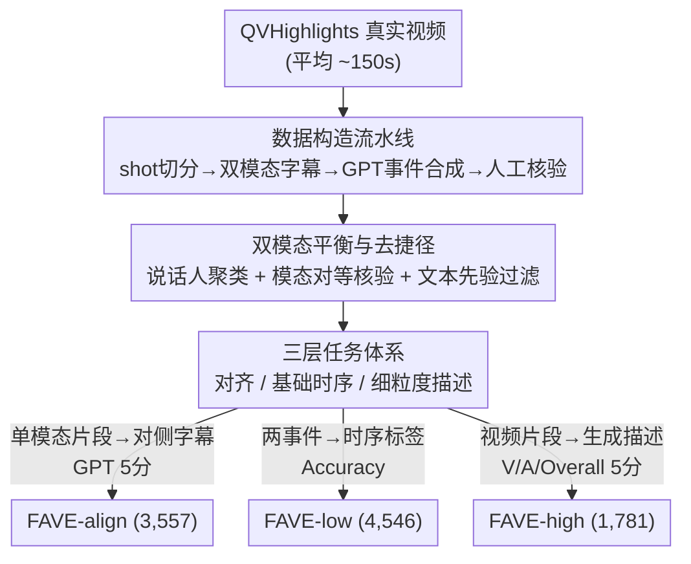

# FAVE: A Structured Benchmark for Fine-Grained Audio-Visual Temporal Evaluation in Multimodal LLMs

**会议**: CVPR 2026  
**论文**: [CVF Open Access](https://openaccess.thecvf.com/content/CVPR2026/html/Lu_FAVE_A_Structured_Benchmark_for_Fine-Grained_Audio-Visual_Temporal_Evaluation_in_CVPR_2026_paper.html)  
**代码**: 无  
**领域**: 多模态VLM / 音视频理解  
**关键词**: 音视频大模型, 细粒度时序推理, 跨模态对齐, 多模态评测基准, AVLLM  

## 一句话总结
FAVE 是一个专门评测「音视频大模型（AVLLM）能否把音频流与视频流在同一时间窗内对齐并做细粒度时序推理」的三层基准，用 shot 切分 + 双模态字幕 + GPT 合成 + 人工核验的可扩展流水线在 QVHighlights 上构造了近万条带时间戳的 QA，对 13 个 SoTA 模型的测评显示：即便最强的 Gemini 1.5 也远低于人类，开源模型几乎全军覆没，跨模态联合时序理解仍是开放难题。

## 研究背景与动机
**领域现状**：音视频大模型（AVLLM，如 VideoLLaMA、PandaGPT、Qwen2.5-Omni）把音频和视觉编码进同一个 LLM，在视频问答、字幕生成等任务上已取得不错效果。现有音视频数据集（AVQA、Music-AVQA、AVSD 等）大多是短片段、单事件，问题类型简单。

**现有痛点**：这些 benchmark 几乎都不考查「跨模态时序」——要么只标注单模态（视觉-only 或音频-only，对 AVLLM 不适用），要么虽然同时给音视频但任务类型单一、没有事件级时序关系，也没有精确时间戳。作者观察到一个反直觉现象：给视觉-语言模型（VLM）加上音频做 Moment Retrieval，性能反而下降；换成原生 AVLLM 同样吃力。这说明现有模型的「音视频联合时序能力」从未被系统量化过。

**核心矛盾**：真实视频里音频与视觉是稠密互补的（画面在说什么、声音在何时出现），理解视频需要把两条流**在相同时间戳上对齐**再推理；而现有模型大多「先处理视觉 token、再处理音频 token」，这种顺序编码天然不利于同一时刻的跨模态对齐。但学界既没有刻画这种能力的指标，也没有能逼出这种能力的数据。

**本文目标**：把模糊的「音视频时序理解」拆成可量化的子能力——(1) 同一时间窗内的跨模态对齐；(2) 多尺度时序感知，既包括事件先后/邻接/位置这种基础关系，也包括针对特定片段的细粒度描述。

**切入角度**：作者认为语音是日常视频里语义最稠密的音频信号，于是以语音为主（辅以约 20% 人工标注的环境声），围绕「同一时间戳的音视频该说什么」设计任务，逼模型暴露对齐与时序短板。

**核心 idea**：用一个**三层递进**（对齐 → 基础时序关系 → 细粒度片段描述）的结构化基准 FAVE，配上「防单模态捷径」的构造与过滤机制，把 AVLLM 的跨模态时序能力测出真实差距。

## 方法详解
FAVE 本质是一个「评测协议 + 数据构造流水线」，没有训练新模型。它要解决的问题是：现有数据无法考查音视频联合时序，于是作者设计了三层任务体系来定义「考什么」，再用一条可扩展的标注流水线来生产「带时间戳、双模态平衡、且不能靠文本先验蒙对」的高质量样本。下面先看整体结构与构造流程，再展开三个关键设计。

### 整体框架
FAVE 建立在 QVHighlights（QVH）真实视频之上，平均视频长约 150s。构造侧是一条流水线：先做 shot 级切分得到语义连贯的视频切片，对每个切片分别做视觉字幕和语音字幕，再用 GPT 把两路字幕合成成「带 `[start, end, caption]` 的事件 + 模态专属 QA」，最后经多轮人工核验。评测侧把样本组织成三个子集——FAVE-align（跨模态对齐）、FAVE-low（基础时序关系）、FAVE-high（细粒度片段描述），分别用不同的输入/输出/指标考查不同层级的能力。

### 关键设计

**1. 三层任务体系：把「音视频时序理解」拆成可量化的递进能力**

针对「现有 benchmark 任务类型单一、测不出跨模态时序」的痛点，FAVE 把能力拆成三层，从对齐到推理到生成逐级加难。**FAVE-align** 直击「同一时间窗内对齐」：给定某一模态在某时间戳的描述，要求模型回答另一模态在该时刻的内容，分 Vision-to-Audio（V2A）和 Audio-to-Vision（A2V）两个方向——对不齐就会把不同时刻的画面与声音错配，引入时序幻觉，所以这一层直接暴露对齐能力。**FAVE-low** 考查不依赖绝对时间戳的基础时序关系，含三个子任务：Relative order（两事件谁先谁后，防因果颠倒）、Temporal Proximity（两事件是否相邻，关乎事件边界）、Event position（事件落在视频前段还是后段）；这些任务「架构无关」，任何 AVLLM 都能答，因此可广泛适用。**FAVE-high** 是 Moment-to-Caption：给定一个时间片段，要求模型综合音视频生成细粒度描述，考查高层时序综合能力。三层在输入/输出/指标上各不相同（见下表评测协议），共同构成从「能不能对齐」到「能不能描述」的完整画像。

**2. 可扩展的双模态标注流水线：用预训练模型打底、GPT 合成、人工兜底**

针对「带精确时间戳的音视频细粒度标注难以规模化」的痛点，FAVE 设计了一条流水线把人力压到核验环节。第一步用 **TransNetV2** 做 shot 边界检测来切分视频——作者论证 shot 级切分比 scene/plot 级更准，能避免长而松散的场景带来的误差。第二步双路字幕：视觉侧用 **LongVA** 捕捉动态事件、用 **InternVL2.5** 从关键帧抽细节；音频侧用 **Whisper** 做语音识别、**3D-Speaker** 做多说话人区分；环境声（约 20%）因自动声音识别模型在噪声/窄类别下输出嘈杂，改为**全人工标注**。第三步 **GPT 事件合成**走结构化流程：先做事件识别（找出双模态都有贡献的时间单元），再生成 `[start, end, caption]` 的多模态描述，再产出 `[start, end, caption, visual-Q/A, audio-Q/A]` 的模态专属 QA。关键的工程纪律是：**用于标注合成的 GPT 与用于评分的 GPT 完全隔离**（不同 prompt、不同 seed、不共享文本），杜绝数据泄漏与循环评测。最后每条样本由 15 名训练过的标注员经两轮独立核验、需达成共识才接受，标注者间一致性约 85%；在 50 条验证样本上 GPT 与人工评分一致率 >95%。

**3. 防单模态捷径与文本先验过滤：逼模型真正用上两个模态**

针对一个最容易让 benchmark 失真的痛点——模型可能只靠单模态（甚至只靠字幕文本的常识）就蒙对，FAVE 加了两道闸。其一是**模态对等（modality parity）**：通过 GPT 辅助核验确保音频字幕与视觉字幕对语义理解的贡献「均等」，防止某一模态成为捷径；同时用 3D-Speaker 做说话人识别与聚类，稳健处理多说话人场景，保证音频信息有效。其二是 **FAVE-low 的文本先验过滤**：作者用严格的 GPT 质量控制步骤，**剔除那些仅凭字幕文本就能猜出时序顺序的 QA 对**——只有当正确答案必须把字幕「落地到真实视频内容」、而非靠语言先验时，该样本才保留。这两道机制使 FAVE 考查的是真·多模态时序推理，而不是「读字幕做完形填空」。

### 评测协议
三层任务的输入/输出/指标定义如下（对应原文 Table 3）：

| 任务 | 输入 | 输出 | 指标 |
|------|------|------|------|
| FAVE-align | 单模态片段（V 或 A） | 对侧模态字幕 | GPT 5 分相似度 |
| FAVE-low | 两个事件字幕 | 时序标签（先后/邻接/位置） | 准确率 (%) |
| FAVE-high | 视频片段 | 生成描述 | 5 分相关度（视觉/音频/整体） |

开放式任务（align、high）采用标准化的 GPT 5 级评分 rubric：1（无关）、2（部分相关）、3（粗匹配）、4（细匹配）、5（语义等价），以压低评测者主观性。

## 实验关键数据

### 主实验（FAVE 三层排行）
作者按输入范式分组评测：Sequential（音视频独立编码）、Interleaved（时序交错 token）、Vision-only（无音频）。align/high 为 1–5 分，low 为准确率(%)。⚠️ 原文在「thirteen / twelve / eleven 个模型」之间表述不一致，以原文为准；下表取主结果表中的代表行。

| 模型 | 范式 | align Avg. | low Overall | high Overall |
|------|------|-----------|-------------|--------------|
| **Human Baseline** | / | **4.63** | **88.98** | **4.23** |
| Gemini 1.5 Flash | / | 4.04 | 75.34 | 2.81 |
| Gemini 1.5 Pro | / | 3.93 | 74.86 | 2.75 |
| Qwen2.5-Omni | Interleaved | 3.09 | 67.77 | 2.01 |
| LongVALE | Sequential | 3.25 | 62.73 | 2.37 |
| VideoLLaMA2 | Sequential | 3.01 | 59.39 | 2.25 |
| NextGPT | Sequential | 1.96 | 52.63 | 2.03 |

核心结论：(1) 即便最强的 Gemini 1.5 Flash 在 high 任务也只有 2.81，远低于人类 4.23，开放式跨模态描述几乎都「在三分以下」；(2) align 上 Gemini 双向均最优，开源里 LongVALE/VideoLLaMA2 因做过音视频联合训练在 A2V 占优，Qwen2.5-Omni 在 V2A 最强；(3) 没有任何开源模型实现了有效的音视频联合时序理解。

### 子任务细分（FAVE-low 三类时序关系）
| 模型 | Order | Proximity | Position |
|------|-------|-----------|----------|
| Gemini 1.5 Flash | 80.00 | 63.03 | 83.00 |
| Gemini 1.5 Pro | 78.73 | 59.05 | **86.80** |
| Qwen2.5-Omni | 73.73 | 60.88 | 68.69 |
| Human | 92.72 | 83.11 | 91.11 |

可见所有模型在 **Proximity（事件邻接判断）** 上普遍最弱（连闭源 Gemini 也只有 ~60%），说明「区分事件边界、判断两事件是否相邻」是当前最难的时序子能力。

### 关键发现
- **信息丢失发生在输入端还是模型端？** 作者变动采样帧数做对照（Figure 5）：增加帧数几乎不改变 FAVE 各任务分数。结论是瓶颈在**模型架构**而非输入——喂进 LLM 的最终特征本身就丢了时序信息，单纯加帧无济于事；未来应改进架构以更好提取/利用时序特征。
- **顺序编码 vs 交错编码的两难**：多数模型先编码视觉 token、再编码音频 token，这种顺序处理不利于同一时刻的特征对齐（人类是同时感知的）；Interleaved 模型沿时间轴交错 token 试图缓解，却又**打断了模态内部的连贯性**（一句完整语音可能被视觉 token 切碎）。「跨模态对齐」与「模态内连贯」之间的平衡仍是开放难题。但作者也指出范式差异不能完全解释性能差距，训练数据与目标同样关键。
- **数据统计支撑难度**：FAVE-align 3,557 / FAVE-low 4,546 / FAVE-high 1,781 条 QA；事件多在 20s 以内的短片段，字幕平均 78 词、常超 100 词，视觉标注偏客体/场景细节、音频标注偏观点/情绪，逼模型做深度场景理解。

## 亮点与洞察
- **把抽象的「音视频时序理解」做成三层可量化协议**，对齐用方向性 V2A/A2V、基础关系拆成 order/proximity/position、生成用 V/A/Overall 三分，使「模型差在哪一层」一目了然——这种「能力分层 + 指标对应」的设计思路可迁移到任意多模态评测。
- **「文本先验过滤」是 benchmark 防作弊的关键 trick**：用 GPT 主动剔除「只看字幕就能猜对」的 QA，强制答案必须落地到视频内容，避免 benchmark 退化成纯文本常识题——任何想测「真·多模态」的工作都应借鉴。
- **标注/评分 GPT 严格隔离**（不同 prompt/seed/不共享文本）这一工程纪律，直接堵住了「自评自夸」的循环评测漏洞，是 LLM-as-judge 类基准容易忽视却很要命的细节。
- 「加帧无用、瓶颈在架构」这个对照实验，给后续做 AVLLM 的人指了明确方向：别堆输入，去改时序特征的提取与融合。

## 局限与展望
- **以语音为主**：FAVE 主打语音（环境声仅约 20% 且需人工标注），对纯环境声/音乐主导的视频覆盖有限，结论未必推广到非语音场景。
- **依赖 GPT 与商用模型做标注/评分**：合成与评分都重度依赖 GPT，虽做了隔离与一致性核验（>95%），但仍可能继承 GPT 的偏好与盲区；评测多用 GPT 5 分制，开放式打分的天花板与稳定性值得进一步审视。
- **构造管线串联多个预训练模型**（TransNetV2 / LongVA / InternVL2.5 / Whisper / 3D-Speaker），任一环节的误差会向下游传播，靠人工核验兜底但成本高（15 标注员两轮）。
- **只有评测、没有方法**：FAVE 诊断出问题（顺序/交错编码两难、架构瓶颈），但没给出改进模型的方案——一个自然的后续是基于这些发现设计「同步对齐又保模态内连贯」的新架构。
- ⚠️ 论文对评测模型数量（13/12/11）表述前后不一，需以官方为准。

## 相关工作与启发
- **vs AVQA / Music-AVQA / AVSD**：它们虽含音视频，但多是短、单事件片段，缺乏精确时间戳与事件级时序关系；FAVE 用 150s 长视频 + 带时间戳的多级时序任务，把「跨模态时序」单独拎出来考。
- **vs LongVALE**：LongVALE 提供了细粒度音视频标注，但缺少「事件时序关系」建模；FAVE 在 Table 1 对比中既有 VAT 三模态字幕+时间戳，又额外有 Multi-Level 时序关系，正是补上这块。
- **vs VALOR / VAST**：这两者只是把模态拼接、不建模依赖；FAVE 明确以「同一时间窗对齐」为核心考点，逼出真正的跨模态依赖。
- **vs TimeChat / VTimeLLM**：这俩是 vision-only 的强时序 VLM，FAVE 在 high 任务里把它们当对照，发现部分开源 AVLLM 的视觉准确率才勉强接近纯视觉模型——侧面印证当前 AVLLM 的音频并没真正帮上忙。

## 评分
- 新颖性: ⭐⭐⭐⭐ 首个系统化考查音视频「联合时序」的三层基准，文本先验过滤与模态对等设计有亮点，但属于 benchmark 类增量贡献。
- 实验充分度: ⭐⭐⭐⭐ 覆盖 13 个开闭源模型、三层任务、帧数对照与范式分组分析，结论扎实；唯模型数量表述不一。
- 写作质量: ⭐⭐⭐⭐ 任务定义清晰、流水线与统计完整，三层结构讲得明白。
- 价值: ⭐⭐⭐⭐ 给 AVLLM 社区指明「架构瓶颈 + 对齐/连贯两难」的具体方向，评测协议与去捷径机制可复用。

<!-- RELATED:START -->

## 相关论文

- [\[CVPR 2026\] CoV-Align: Efficient Fine-grained Cross-Modal Alignment with Cohesive Visual Semantics Priority](cov-align_efficient_fine-grained_cross-modal_alignment_with_cohesive_visual_sema.md)
- [\[CVPR 2026\] HanDyVQA: A Video QA Benchmark for Fine-Grained Hand-Object Interaction Dynamics](handyvqa_a_video_qa_benchmark_for_fine-grained_hand-object_interaction_dynamics.md)
- [\[CVPR 2026\] TimeLens: Rethinking Video Temporal Grounding with Multimodal LLMs](timelens_rethinking_video_temporal_grounding_with_multimodal_llms.md)
- [\[CVPR 2026\] OddGridBench: Exposing the Lack of Fine-Grained Visual Discrepancy Sensitivity in Multimodal Large Language Models](oddgridbench_exposing_the_lack_of_fine-grained_visual_discrepancy_sensitivity_in.md)
- [\[CVPR 2026\] Chart-FR1: Visual Focus-Driven Fine-Grained Reasoning on Dense Charts](chart-fr1_visual_focus-driven_fine-grained_reasoning_on_dense_charts.md)

<!-- RELATED:END -->
