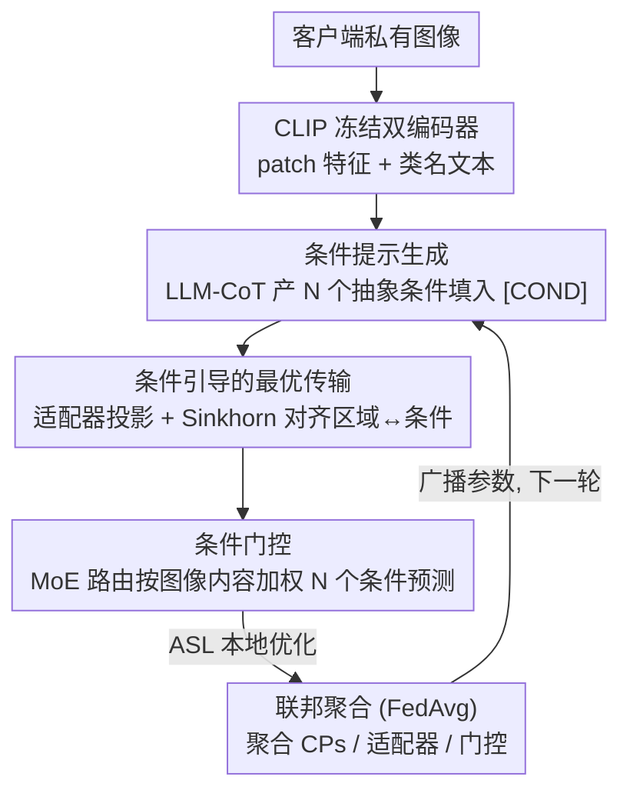

# FedMPT: Federated Multi-Label Prompt Tuning of Vision-Language Models

**会议**: CVPR 2026  
**论文**: [CVF Open Access](https://openaccess.thecvf.com/content/CVPR2026/html/Wang_FedMPT_Federated_Multi-Label_Prompt_Tuning_of_Vision-Language_Models_CVPR_2026_paper.html)  
**代码**: https://xuc865.github.io/fedmpt/index.html （项目页）  
**领域**: 多模态VLM  
**关键词**: 联邦学习, 多标签识别, 提示学习, 因果调整, 最优传输  

## 一句话总结
FedMPT 把联邦多标签识别（MLR）建模成一个因果前门调整问题，用 LLM 生成一组通用"条件"（如空间布局、物体姿态）作为中介变量来约束标签共现，再通过条件提示 + 最优传输 + 门控聚合三步把条件对齐到图像区域并自适应加权，从而在客户端数据异构时显著抑制"看到猫就误报椅子"这类伪相关过拟合。

## 研究背景与动机
**领域现状**：多标签识别（一张图同时识别所有标签）近年主流是借助 CLIP 等 VLM 的提示学习，如 DualCoOp、PosCoOp 给每个类学一对协作提示。另一条线是联邦学习（FL）下用 VLM，如 FedTPG、FedMVP，让每个客户端只持有私有异构数据、用 FedAvg 聚合提示权重来保护隐私。

**现有痛点**：这两条线几乎从不交叉——所有现有的 VLM 联邦方法都是为**单标签**设计的，完全忽略了多标签场景。一旦把 MLR 的 SOTA 直接搬到联邦下用 FedAvg 聚合，全局模型会学到**过度的伪标签相关**：作者举的例子是训练集里"猫"常和"椅子"同框，模型推理时一看到猫就把椅子的分数也顶上去，即使图里根本没有椅子；而当数据异构度（客户端之间分布差异）增大时，现有 SOTA 的 mAP 会断崖式下跌。

**核心矛盾**：作者用结构因果模型（SCM）把根因讲透了。预训练学到的语义因子 $F$ 可拆成跨客户端可迁移的**通用因子** $F_g$ 和客户端私有的**特定因子** $F_s$；图像内容由两者混合生成，但标签**只**应该由 $F_g$ 决定。本地数据稀少且与推理分布有巨大 gap，导致模型把 $F_g$ 和 $F_s$ 混成一团 $F_{g,s}$，在 $D\!\to\!Y$ 之间打开了一条后门路径 $D\leftarrow F_{g,s}\to Y$，这正是伪相关的来源。

**本文目标 / 切入角度**：从**前门调整**的视角，引入一个中介变量 $R$ 来阻断后门、还原真实因果，目标是 $P(Y|do(D))=\mathbb{E}_{P(r|d)}\mathbb{E}_{P(d')}P(Y|r,d')$。核心挑战变成：怎么构造一个能逼近"标签为何共现"这一 oracle 机制的 $r$。

**核心 idea**：用一组**通用、互补的"条件"**当中介变量 $R$ 去干预 MLR。直觉是：猫和椅子之所以共现，是因为满足了"室内场景""木质纹理""躺卧动作"这些条件；当换成"猫 + 自行车"的图、这些条件不满足时，模型就该自动调低椅子的权重。

## 方法详解

### 整体框架
FedMPT 的输入是各客户端的私有图像，输出是全局多标签预测；中间在每个客户端上跑"条件提示生成 → 条件引导的最优传输 → 条件门控"三段流水，再把可训练参数交给中央服务器用 FedAvg 聚合成统一全局模型。CLIP 双编码器全程冻结，只训练条件提示 token、LoRA 适配器和门控路由这少量参数（共约 0.8M）。

整条流水的关键在于把抽象的"条件"落到具体计算上：先用 LLM 离线产出 $N$ 个抽象条件（如空间布局、背景、光照），填进提示模板得到 $N$ 套条件提示（CPs）；每张图的区域级 patch 特征经 $N$ 个适配器投影后，与对应条件提示做最优传输对齐，得到 $N$ 个"在该条件下"的预测；最后门控模块按图像内容动态给 $N$ 个条件预测加权求和。

### 关键设计

**1. 条件提示生成：用 LLM 把"标签为何共现"蒸成一组可学的通用条件**

这一步直接对应因果分析里要构造的中介变量 $r$。难点是：条件既要**通用**（跨所有客户端共享，才能学到 $F_g$），又要**细粒度**（能区分不同标签组合的成立场景）。作者的策略是"固定抽象条件、留具体内容可学"。具体用一个 LLM + Chain-of-Thought 的两段式离线流水：先让 LLM 对数据集类别的**每一种组合**尽量多地生成描述句（如"自行车靠在小飞机机翼上、背景是机库和晴空"），借 LLM 的世界知识捕捉各种标签组合的成立条件；再让 LLM 把这些描述**归纳成 $N$ 个互不重叠的抽象条件**，最终得到"空间布局、物体姿态、背景、光照/天气、物体尺度"等。

得到的抽象条件填入提示模板的 `[COND]` 槽：$[L_1]\cdots[L_{\beta_{cond}}]\,[\text{COND}]\,[L_1]\cdots[L_{\beta_{cls}}]\,[\text{CLASS}]$，其中条件级可学 token 对每个条件独立、类级可学 token 被所有类共享。这套提示 $p^\dagger=\{p^\dagger_1,\dots,p^\dagger_C\}$ 存在服务器、每轮分发给客户端，经文本编码器得到 $f_t(p^\dagger)$。相比 DualCoOp 只学一对粗粒度类提示，这里把"标签共现的语义前提"显式编码进了提示，是抑制伪相关的源头。

**2. 条件引导的最优传输：把每个条件对齐到图像区域，得到"条件特定预测"**

光有条件提示还不够——条件描述的是局部语义（"木质纹理"只在某些 patch 上成立），需要把它**对齐到具体区域**。作者在 patch 级视觉输出 $f_v(v)$ 上为每个条件挂一个 LoRA 式适配器 $A_n$ 生成条件专属的视觉隐空间 $f^\dagger_{v,n}(v)=W_\uparrow(W_\downarrow(f_v(v)))$，再在 patch 与条件提示之间求最优传输计划 $P^*=\mathrm{OT}(C;a,b)$。代价矩阵 $C_{m,n}$ 由 patch–条件相似度的 softmax 取负得到（$S=1-C$ 即原始区域–文本相似度）。

两个边缘分布的设计很关键：列边缘 $b$ 取均匀分布，让所有类别在图中获得**同等被检出的机会**（多标签不该偏向高频类）；行边缘 $a$ 取每个 patch 的**语义重要性** $a_{m,n}=\frac{\exp(\max_c \mathrm{sim}(f^\dagger_{v,n}(v_m),f_t(p^\dagger_n))/\tau)}{\sum_m \exp(\cdots)}$，让信息量大的区域贡献更多。OT 用熵正则 + Sinkhorn 迭代高效求解。最终对每个条件按类算 Wasserstein 距离 $\psi_n=\sum_m P_{m,n}S_{m,n}$，把 $\psi_n$ 直接当作"在条件 $n$ 下的预测" $P_n$。这样每个条件都给出一份独立的区域级判断，避免了单一全局表征把伪相关一锅端。

**3. 条件门控：MoE 式路由按图像自适应加权各条件**

不同客户端、不同图像下，各条件的相关性并不恒定（异构数据让某些条件在某客户端更重要）。作者借鉴 LLM 里的 Mixture-of-Experts，用一个路由 $\omega=\Omega(f_v(v))$（$\Omega$ 也是 LoRA 模块）按图像内容算出 $N$ 个条件的权重，再 softmax 加权聚合：$P'=\sum_n \frac{\exp(\omega_n)}{\sum_{n'}\exp(\omega_{n'})}P_n$。这一步把"哪些条件此刻可信"交给数据自己决定——当某条件在当前图上不成立时其权重被压低，从而进一步抑制错误激活。消融显示门控的收益**依赖 OT**：单加门控只 +0.27% mAP，但 OT 已就位时再加门控涨 +2.21%，说明条件间的协同要靠 OT 先把区域–条件的 trade-off 调和好。

### 损失函数 / 训练策略
本地用非对称损失（ASL）优化聚合后的预测 $P'$：$L=(1-P')^{\gamma_+}y\log(P')+(P'_c)^{\gamma_-}(1-y)\log(1-P'_c)$，其中 $P'_c=\max(P'-c,0)$ 截断负预测，设 $\gamma_-\!\ge\!\gamma_+$ 以下调易负样本的权重、缓解多标签下正负极度不均衡。每个通信轮各客户端训练一个 epoch 后，服务器收集条件提示 $p$、适配器 $\{A_n\}$、门控 $\Omega$ 的权重做 FedAvg 平均再广播，循环 $R$ 轮。CLIP ViT-B/16 冻结，SGD（lr 0.001），$\lambda=0.2$，$\tau=4$，$\beta_{cond}=\beta_{cls}=4$（网格搜索最优 (5,7)），LoRA 维度 $D_s=32$。

## 实验关键数据

### 主实验
在三个联邦 MLR 基准、三个数据集上评测，对比 10 个跨 MLR / FL / 提示学习的强基线（非联邦方法加 "Fed-" 前缀改造）。下表为**异构基准**上各数据集异构度 $t$ 取 10%→100% 的平均 mAP / CF1 / OF1：

| 数据集 | 指标 | FedMPT | 之前最佳 | 提升 |
|--------|------|--------|----------|------|
| VOC2007 | mAP | 89.51 | 85.67 (Fed-RAM) | +3.84 |
| VOC2007 | OF1 | 83.62 | 79.44 (FedMVP) | +4.18 |
| COCO2014 | mAP | 64.65 | 61.64 (FedMVP) | +3.01 |
| COCO2014 | OF1 | 65.26 | 61.75 (FedMVP) | +3.51 |
| NUS-Wide | mAP | 56.69 | 53.33 (Fed-RAM) | +3.36 |
| NUS-Wide | OF1 | 77.33 | 75.42 (FedMVP) | +1.91 |

在**部分标注基准**（随机掩掉 Mask% 标注）和**真实世界遥感基准**上优势更大：COCO2014 部分标注平均 +4.36% mAP 且增益随 mask 升高（10%→90% 时 +2.26%→+7.25%）；真实世界 Multi-Scene +4.12% mAP、MLRSNet +6.01% mAP。门控/OT 让 FedMPT 在异构度增大与客户端参与率降低（10%）时几乎不掉点，而 FedMVP/FedTPG 会掉 ~5%/7% mAP。

### 消融实验
模块消融（Table 4，VOC2007 平均）：

| 配置 | mAP | Avg(三指标) | 说明 |
|------|-----|------|------|
| 仅 CPs | 87.08 | 83.88 | 条件提示单独已强于仅适配器 |
| 仅 Adapters | 84.40 | 80.92 | 纯视觉特征适配最弱 |
| CPs + Adapters | 87.62 | 84.78 | 二者结合 |
| + OT | 89.35 | 85.23 | OT 平均 +1.44% mAP |
| 完整 (CPs+Adapters+OT+Gate) | 90.10 | 86.19 | 门控需 OT 在场才有效 |

效率对比（Table 5）：FedMPT 仅 **0.80M** 可训练参数（最少），却拿到 90.10% mAP（最高）；Fed-RAM 用 13.02M 参数、384ms/iter 也只有 85.54%，FedMVP 1.14M/75.8ms 达 85.61%，FedMPT 以更小参数量换来更优性能。

### 关键发现
- **条件建模比视觉适配更关键**：单用 CPs（87.08）远超单用 Adapters（84.40），说明显式编码"标签共现的语义前提"是抑制伪相关的主力，光做视觉特征微调不够。
- **门控与 OT 强耦合**：门控单独几乎无用（+0.27%），必须先有 OT 调和 patch 间 trade-off，条件协同才能发挥（+2.21%）——三模块不是简单叠加而是层层依赖。
- **越难越稳**：异构度越高、标注越稀、客户端参与率越低，FedMPT 相对 SOTA 的领先越大，印证"用通用条件而非本地相关"带来的鲁棒性。
- 超参敏感性：$\tau>4$ 后各指标明显下降（类间不可区分），$D_s>32$ 后因过拟合缓慢下滑，提示 token 数过少或过多都掉点，最优 (5,7)。

## 亮点与洞察
- **用因果前门调整给"伪相关过拟合"找到了可操作的解法**：把抽象的 SCM 中介变量 $R$ 落地成一组 LLM 生成的"条件"，理论动机与方法设计一一对应，不是事后贴标签，这点很扎实。
- **LLM 当"条件挖掘器"而非"打标器"**：不让 LLM 直接给伪标签（噪声大），而是归纳出可跨客户端共享的抽象条件再交给可学 token 细化，既蹭到 LLM 知识又规避了其不可靠性，这个分工值得借鉴。
- **OT 的双边缘设计有巧思**：列边缘均匀保证多标签的类别公平、行边缘用 patch 语义重要性，把"多标签该雨露均沾"和"区域贡献不均"两个先验同时塞进传输约束里。
- 参数极省（0.8M）却 SOTA，对真实联邦部署（通信/算力受限）很友好；门控→OT→条件提示的依赖链也提示：联邦下做"专家混合"前得先解决专家间的对齐。

## 局限与展望
- 抽象条件的生成依赖 LLM 离线产出，且条件数 $N$ 是预设超参；条件的质量/覆盖度对最终效果影响多大、换不同 LLM 是否稳定，正文未充分消融（细节在补充材料，⚠️ 以原文为准）。
- 每个条件挂一个适配器 + 一次 OT，$N$ 增大时计算与训练时间线性上涨（FedMPT 97ms/iter 已是表中较慢者），条件数与开销的权衡需要场景化调参。
- 评测集中在自然图像 + 两个遥感集，类别数中等（VOC 20 / COCO 80 / NUS-81）；类别极多（数千类）时"枚举类别组合让 LLM 描述"的离线流水是否可扩展存疑。
- 因果框架假设"标签只由通用因子 $F_g$ 决定"，对真实存在客户端特异标签语义的场景是否成立、front-door 假设的可识别性条件，论文偏经验验证。

## 相关工作与启发
- **vs FedMVP（ICCV'25）**: FedMVP 用专门的跨模态 PromptFormer 融合图像 token 与 LLM 属性嵌入生成视觉提示，是单标签 FL 的强方法；FedMPT 针对多标签、显式用"条件"做因果中介 + OT 区域对齐，在异构/部分标注下更鲁棒（VOC +3.84% mAP），且参数更少（0.8M vs 1.14M）。
- **vs FedOTP（FL 中的 OT 提示协作）**: FedOTP 用 margin 自适应 OT 平衡本地/全局提示的贡献、面向单标签；FedMPT 把 OT 用在"条件提示 ↔ 图像区域"的对齐上、配合 MoE 门控聚合多条件预测，目标是抑制多标签伪相关而非本地/全局平衡。
- **vs DualCoOp / PosCoOp（集中式 MLR 提示）**: 它们给每类学正/负协作提示建模物体存在性，但在联邦聚合后会过拟合本地标签相关；FedMPT 用跨客户端共享的通用条件取代了"逐类本地提示"作为知识载体，从源头换掉了伪相关的来源。

## 评分
- 新颖性: ⭐⭐⭐⭐⭐ 首个为联邦多标签识别设计的方法，因果前门调整 + LLM 条件 + OT + 门控的组合有原创性
- 实验充分度: ⭐⭐⭐⭐⭐ 三基准三数据集十基线、异构/部分标注/真实世界全覆盖，消融与开销分析到位
- 写作质量: ⭐⭐⭐⭐ 因果动机与方法对应清晰，公式完整；OT/门控部分符号较密，需对照图读
- 价值: ⭐⭐⭐⭐ 隐私敏感的多标签场景（医疗/遥感）实用，极省参数对真实联邦部署友好

<!-- RELATED:START -->

## 相关论文

- [\[CVPR 2026\] Towards Calibrating Prompt Tuning of Vision-Language Models](towards_calibrating_prompt_tuning_of_vision-language_models.md)
- [\[CVPR 2026\] Improving Calibration in Test-Time Prompt Tuning for Vision-Language Models via Data-Free Flatness-Aware Prompt Pretraining](improving_calibration_in_test-time_prompt_tuning_for_vision-language_models_via_.md)
- [\[ICCV 2025\] FedMVP: Federated Multimodal Visual Prompt Tuning for Vision-Language Models](../../ICCV2025/multimodal_vlm/fedmvp_federated_multimodal_visual_prompt_tuning_for_vision-language_models.md)
- [\[CVPR 2026\] Controllable Federated Prompt Learning at Test Time](controllable_federated_prompt_learning_at_test_time.md)
- [\[CVPR 2026\] Noise-Aware Few-Shot Learning through Bi-directional Multi-View Prompt Alignment](noise-aware_few-shot_learning_through_bi-directional_multi-view_prompt_alignment.md)

<!-- RELATED:END -->
