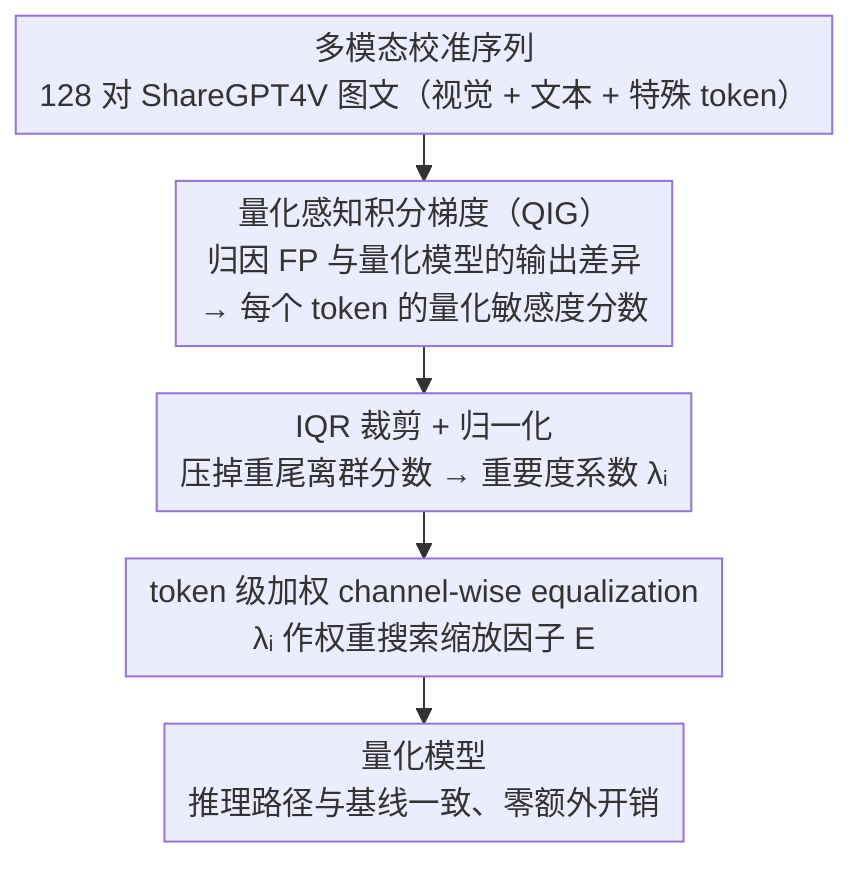

# Fine-Grained Post-Training Quantization for Large Vision Language Models with Quantization-Aware Integrated Gradients

**会议**: CVPR 2026  
**arXiv**: [2603.17809](https://arxiv.org/abs/2603.17809)  
**代码**: [https://github.com/ucas-xiang/QIG](https://github.com/ucas-xiang/QIG)  
**领域**: 多模态VLM  
**关键词**: 后训练量化, LVLM压缩, token级敏感度, 积分梯度, 模型加速

## 一句话总结
提出量化感知积分梯度（QIG），将 LVLM 量化的灵敏度分析从模态级推进到 token 级，利用公理化归因原理精确量化每个 token 对量化误差的贡献，在 W4A8 和 W3A16 设置下显著提升量化模型精度，且几乎无额外计算开销。

## 研究背景与动机
**领域现状**：LVLM（如 LLaVA、InternVL、Qwen-VL）在多模态任务中表现出色，但模型体积大、推理慢，后训练量化（PTQ）是常用的加速手段。

**现有痛点**：现有 LVLM 量化方法（如 MBQ）仅在模态级别衡量 token 敏感度（视觉 vs 文本），忽略了跨 token 的复杂交互以及 token 间的量化敏感度差异。

**核心矛盾**：随着 token 在模型中逐层交互，模态边界逐渐模糊，同一模态内不同 token 的量化敏感度也存在巨大差异（massive activations、layer heterogeneity、sub-layer divergence、token variability 四个现象）。

**本文目标** 如何在 token 级别精确估计量化敏感度，并利用这些信息指导更精细的 channel-wise equalization。

**切入角度**：从机械可解释性中的公理化归因出发，利用积分梯度量化每个 token 从量化参考到实际输入的敏感度。

**核心idea**：用 Quantization-aware Integrated Gradients（QIG）替代模态级敏感度估计，在 token 级别指导量化校准。

## 方法详解

### 整体框架
QIG 想解决的问题很具体：现有 LVLM 量化方法只能区分"视觉 token 还是文本 token"，却看不出同一模态里哪些 token 对量化更敏感，于是校准时一视同仁地分配缩放因子。QIG 的做法是在不改动量化主流程的前提下，给每个 token 算一个量化敏感度分数，再把这个分数当权重塞进原有的校准目标里。

整条流水线挂在标准 PTQ 的校准阶段上：喂进一批多模态校准序列（视觉 + 文本 + 特殊 token），先对每个 token 计算 QIG 分数衡量它对量化误差的贡献，然后用 IQR 裁掉极端值并归一化成重要度系数 $\lambda_i$，最后把 $\lambda_i$ 作为权重加进 channel-wise equalization（CWE）的优化目标，搜索出对敏感 token 更友好的量化缩放因子。量化完成后推理路径与基线完全一致，所有额外计算都发生在校准这一次性环节。

### 关键设计

**1. 量化感知积分梯度（QIG）：让敏感度直接对齐量化误差本身**

痛点在于过去衡量 token 重要性靠的是梯度或注意力这类代理，它们反映的是 token 对最终预测的影响，跟"量化这个 token 会带来多大误差"并不是一回事，相关性很弱；而逐个扰动 token 去实测误差虽然准，代价却高得离谱。QIG 的关键改动是把归因的对象换掉——经典积分梯度归因的是全精度模型的预测，QIG 归因的则是全精度模型和量化模型之间的**输出差异**，也就是量化本身引入的那部分误差。具体地，它沿着从量化输入 $x^q$ 到实际输入 $x$ 的直线路径对这个差异积分梯度：

$$QIG(x) = (x - x^q) \int_0^1 \frac{\partial\big(f(x_\alpha, w) - f(x_\alpha, w^q)\big)}{\partial x_\alpha}\, d\alpha$$

因为积分对象直接就是 $f(\cdot, w) - f(\cdot, w^q)$ 这个量化误差，算出来的分数天然与 PTQ 误差挂钩；同时积分梯度满足完备性公理（各 token 的归因之和等于总输出差异），保证了这套敏感度估计是有理论依据地把误差"摊"到每个 token 头上，而不是又一个拍脑袋的代理。

**2. IQR 裁剪：别让几个离群 token 绑架整个校准**

直接拿原始 QIG 分数当权重会出事，因为它的分布是重尾的——少数极端 token 的分数高到能盖过其余所有 token，校准目标会被它们带偏。这里借统计学里常规的四分位距规则做截断，把超出 $[Q_1 - 1.5\,IQR,\ Q_3 + 1.5\,IQR]$ 的分数压回边界：

$$C(QIG_i) = \mathrm{clip}\big(QIG_i,\ Q_1 - 1.5\cdot IQR,\ Q_3 + 1.5\cdot IQR\big)$$

裁剪后再做归一化，得到落在合理区间的 token 重要度系数 $\lambda_i$。这样既保留了敏感 token 相对更高的权重，又不至于让个别离群值一家独大。

> ⚠️ 1.5 倍 IQR 是经典统计默认值，是否为量化场景下的最优倍数原文未深入讨论，⚠️ 以原文为准。

**3. Token 级加权 channel-wise equalization：把权重落到优化目标里**

有了 $\lambda_i$，剩下的就是让它真正影响缩放因子的搜索。CWE 的本质是找一组通道均衡矩阵 $\mathbf{E}$，把激活里难量化的尺度搬一部分到权重上，使量化前后的输出尽量接近。QIG 只在这个目标的求和里给每个 token 的重构误差乘上自己的权重 $\lambda_i$：

$$\mathbf{E}^* = \arg\min_{\mathbf{E}} \sum_{i=1}^T \lambda_i \big\| Q_W(\mathbf{W}*\mathbf{E})\, Q_X(\mathbf{E}^{-1}*\mathbf{X}_i) - \mathbf{W}\mathbf{X}_i \big\|_2^2$$

于是搜索过程会自动偏向把误差预算留给更敏感的 token，对不敏感的 token 则容忍更大的量化偏差。整个均衡框架和原来一模一样，唯一的改动就是这个逐 token 的权重——这也是为什么 QIG 几乎不引入额外推理开销却能换来精度提升。

### 训练策略
- 完全无训练（PTQ），仅在校准阶段使用 128 对 ShareGPT4V 图文对
- 支持 weight-only (W3A16) 和 weight-activation (W4A8) 两种设置

## 实验关键数据

### 主实验（LLaVA-onevision-7B）

| 设置 | 方法 | VizWiz | MMMU | ChartQA | AI2D | ScienceQA | 平均 |
|------|------|--------|------|---------|------|-----------|------|
| FP16 | - | 60.41 | 49.22 | 80.04 | 81.31 | 95.88 | 73.37 |
| W3A16 | MBQ | 57.99 | 44.00 | 76.84 | 78.47 | 94.89 | 70.44 |
| W3A16 | **QIG** | **62.82** | **45.78** | **77.20** | **79.11** | **95.29** | **72.04** |
| W4A8 | MBQ | 58.13 | 44.78 | 74.92 | 78.27 | 94.70 | 70.16 |
| W4A8 | **QIG** | **59.10** | **45.00** | **74.52** | **78.30** | **94.25** | **70.23** |

### 消融实验

| 敏感度类型 | 粒度 | VizWiz 精度 |
|-----------|------|------------|
| 梯度 (SFT loss) | 模态级 | 57.36 |
| 梯度 | token级 | 55.78 (↓) |
| 注意力 | token级+special | 57.52 |
| 扰动 | token级+special | 57.72 |
| **QIG** | **token级** | **最优** |

### 关键发现
- W3A16 下 QIG 在 LLaVA-onevision-7B 上比 MBQ 平均提升 1.60%，与全精度差距仅 1.33%
- SFT 梯度做 token 级敏感度反而比模态级更差，说明 SFT 梯度与量化敏感度不对应
- 注意力 score 因 attention-sink 现象给出不稳定结果
- QIG 的 token 级敏感度与实际量化误差有强相关性

## 亮点与洞察
- **用可解释性工具解决工程问题**：巧妙地将积分梯度从"解释模型预测"迁移到"量化量化误差"，公理化归因给敏感度估计提供了理论保障
- **零额外推理开销**：QIG 仅在校准阶段计算，量化后的推理与基线完全相同
- 对 SFT 梯度和注意力这两种直觉上应该有效的代理进行了系统性否定，增强了 QIG 的说服力

## 局限与展望
- 校准集固定为 128 样本，未探索校准集选择对 QIG 的影响
- QIG 的积分步数是超参数，论文未充分讨论其敏感性
- 仅在 7B-26B 规模验证，更大模型（70B+）的效果未知
- IQR 裁剪的 1.5 倍为经典统计默认值，是否是量化场景下的最优选择值得探讨

## 相关工作与启发
- **vs MBQ**: MBQ 用模态级梯度加权，QIG 用 token 级量化感知积分梯度，粒度更细且与量化误差直接关联
- **vs AWQ/GPTQ**: 这些方法不考虑多模态结构，QIG 专门针对 LVLM 的异构 token 序列设计
- token 级敏感度分析的思路可以迁移到 LVLM 的剪枝和知识蒸馏中

## 评分
- 新颖性: ⭐⭐⭐⭐ 从可解释性到量化的跨领域迁移有新意
- 实验充分度: ⭐⭐⭐⭐ 多模型多基准多设置，消融实验系统
- 写作质量: ⭐⭐⭐⭐ 动机分析和可视化做得好
- 价值: ⭐⭐⭐⭐ 即插即用的 PTQ 改进，实用价值高

<!-- RELATED:START -->

## 相关论文

- [\[CVPR 2026\] MASQuant: Modality-Aware Smoothing Quantization for Multimodal Large Language Models](masquant_modality-aware_smoothing_quantization_for_multimodal_large_language_mod.md)
- [\[CVPR 2026\] VQRAE: Representation Quantization Autoencoders for Multimodal Understanding, Generation and Reconstruction](vqrae_representation_quantization_autoencoders_for_multimodal_understanding_gene.md)
- [\[CVPR 2025\] Quantization without Tears](../../CVPR2025/multimodal_vlm/quantization_without_tears.md)
- [\[CVPR 2026\] DiG: Differential Grounding for Enhancing Fine-Grained Perception in Multimodal Large Language Models](dig_differential_grounding_for_enhancing_fine-grained_perception_in_multimodal_l.md)
- [\[CVPR 2026\] CropVLM: Learning to Zoom for Fine-Grained Vision-Language Perception](cropvlm_learning_to_zoom_for_fine_grained_vision_language_perception.md)

<!-- RELATED:END -->
