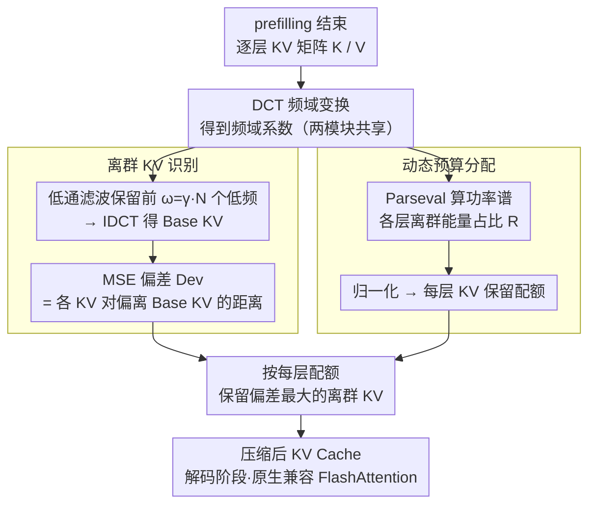

# FlashCache: Frequency-Domain-Guided Outlier-KV-Aware Multimodal KV Cache Compression

**会议**: CVPR 2026  
**arXiv**: [2511.16786](https://arxiv.org/abs/2511.16786)  
**代码**: 无  
**领域**: 多模态VLM / 模型压缩  
**关键词**: KV Cache压缩, 频域分析, 离群KV, 动态预算分配, FlashAttention兼容  

## 一句话总结
提出 FlashCache，首次从频域角度分析多模态 KV Cache 的重要性分布，发现偏离低频主成分的"离群 KV"编码了推理关键特征，通过 DCT 低通滤波识别并优先保留离群 KV + 动态逐层预算分配，在 80% KV 内存压缩下实现 1.69× 解码加速且基本不损失任务性能，天然兼容 FlashAttention。

## 研究背景与动机

**领域现状**：多模态大语言模型（MLLM）在视觉理解与推理任务上表现出色，但推理过程中 KV Cache 随视觉输入长度线性增长。在多图、高分辨率和视频等长上下文场景中，KV Cache 的 GPU 内存开销急剧膨胀，解码延迟也随之显著增加，成为实际部署的核心瓶颈。

**现有痛点**：当前的多模态 KV Cache 压缩方法（如 LOOK-M、MEDA、H2O、SnapKV）几乎都依赖注意力分数来决定保留哪些 KV 对。这带来两个关键问题：(1) FlashAttention 等高效注意力内核不显式输出完整注意力矩阵，重新计算注意力分数会引入额外开销，与高效推理的目标相矛盾；(2) 注意力分数仅由 Query-Key 点积决定，忽略了 Value 向量对最终注意力输出的实际贡献，导致压缩信号不完整。

**核心矛盾**：要实现高压缩比的 KV Cache 压缩，必须准确识别哪些 KV 对对推理最重要；但现有方法获取重要性信号的方式（注意力分数）既不够准确，又与高效推理框架不兼容。

**本文目标**：设计一种不依赖注意力分数、直接从 KV 矩阵自身分布特征出发的压缩方法，能够高效识别推理关键的 KV 对，同时天然兼容 FlashAttention 等高效注意力实现。

**切入角度**：借鉴信号处理中频域分析的思路，将 KV 矩阵变换到频域观察其能量分布。作者发现 KV 矩阵的频域能量高度集中于低频——低频成分对应平滑的、冗余的主成分模式；而偏离这些主成分的 KV 对（"离群 KV"）更可能编码了推理关键特征，优先移除它们会导致显著性能下降。

**核心 idea**：用频域低通滤波提取 KV 矩阵的主成分（Base KV），将偏离主成分最大的 KV 对定义为"离群 KV"并优先保留，同时按层动态分配 KV Cache 预算。

## 方法详解

### 整体框架
FlashCache 在 prefilling 阶段结束后对多模态 KV Cache 执行一次性压缩，包含两个核心模块：(1) 离群 KV 识别（Outlier KV Recognition Module）——对每一层的 KV 矩阵做 DCT 频域变换，通过低通滤波获取平滑的 Base KV，再计算每个 KV 对与 Base KV 的 MSE 偏差，优先保留偏差最大的离群 KV；(2) 动态预算分配（Dynamic Budget Allocation Module）——统计各层 KV 矩阵频域中离群信息能量占总能量的比例，据此归一化并为每层动态分配不同的 KV Cache 保留配额。两个模块共享同一套频域分析：先对逐层 KV 矩阵做一次 DCT，离群识别用低频系数重建 Base KV、动态分配用功率谱算各层离群能量占比，最后在每层配额约束下保留偏差最大的离群 KV。整个过程无需训练、也不依赖注意力分数——因为全程只读 KV 矩阵自身的频域统计、从不触碰注意力矩阵，FlashCache 无需改动即可挂在 FlashAttention 上；DCT/IDCT 经 NVIDIA CuPy 算子加速后，8K token 输入下仅增加约 6.77ms 延迟（约为 H2O 的 1/4、LOOK-M 的 1/8）。

### 关键设计

**1. 离群 KV 识别：用频域低通滤波把"冗余主成分"和"关键离群"分开**

注意力分数信号既不准也不兼容 FlashAttention，FlashCache 干脆换一条路——直接看 KV 矩阵自身的频域结构。对第 $l$ 层的 Key/Value 张量 $K^l, V^l$ 做离散余弦变换（DCT）到频域，得到系数 $C_k^l[m], C_v^l[m]$；再施加低通滤波，只保留前 $\omega = \gamma \cdot N$ 个低频系数（$\gamma$ 是截止因子，$N$ 是 token 数），其余高频置零后经逆 DCT 变回时域，得到一份平滑的"主成分版" Base KV $K_{base}^l, V_{base}^l$。这份 Base KV 相当于把 KV 矩阵里反复出现的冗余模式提取出来，于是每个 KV 对偏离它多远，就成了重要性的度量：

$$Dev[x] = \text{MSE}(K^l[x], K_{base}^l[x]) + \text{MSE}(V^l[x], V_{base}^l[x])$$

按 $Dev[x]$ 从大到小排序，保留偏差最大的那批 KV 对——也就是"离群 KV"。这样做的依据是作者的一个反直觉观察：优先丢掉高偏差 KV 时性能掉得比随机丢、比丢低偏差 KV 都快得多，说明少数偏离主成分的 KV 恰恰编码了推理关键特征。这个现象和模型量化里的离群值保护如出一辙——都是"少数偏离主流的元素承载了不成比例的关键信息"。整套判断只用到 KV 矩阵本身，全程不碰 Value 之外的注意力分数，自然也躲开了 Query-Key 点积忽略 Value 贡献的老问题。

**2. 动态预算分配：按每层离群能量占比给不同层分配配额**

如果所有层都用同一个压缩比，会有问题：有些 Transformer 层的 KV 几乎全集中在低频主成分（离群很少，压狠点也不疼），另一些层却携带大量高频离群信息（一刀切会把关键内容也压没）。FlashCache 借 Parseval 定理在频域直接算功率谱 $P_k^l[m] = |C_k^l[m]|^2$，无需回到时域，再统计每层离群信息（高频段）能量占总能量的比例：

$$R^l = R_k^l + R_v^l, \quad R_k^l = \frac{\sum_{\ell=\omega+1}^{N-1}P_k^l[\ell]}{\sum_{\ell=0}^{N-1}P_k^l[\ell]}$$

$R^l$ 越大说明该层离群信息越丰富、越不该被狠压。把各层 $R^l$ 归一化成权重，在全局预算约束下给离群多的层多留配额、离群少的层少留，从而把有限的 KV 预算花在刀刃上。消融里这一模块在视觉推理任务上贡献尤其明显（CLEVR-Change +5.19 分）。

### 损失函数 / 训练策略
FlashCache 是完全无训练（training-free）的推理时压缩方案。在 prefilling 阶段结束后执行一次性压缩，不涉及任何参数更新或反向传播。关键超参数包括：低通滤波截止因子 $\gamma$（最优范围 0.1-0.2）和全局 KV Cache 保留比 $\rho$。DCT/IDCT 运算通过 NVIDIA CuPy 算子库加速实现，在 8K token 输入下额外延迟仅 6.77ms（显著低于注意力分数方法的 27-84ms）。

## 实验关键数据

### 主实验
MileBench 多图理解基准（KV 保留比 $\rho=0.2$）：

| 方法 | Task T (Qwen-7B) | Task S (Qwen-7B) | NH (Qwen-7B) | IR (Qwen-7B) |
|------|-------------------|-------------------|---------------|---------------|
| Full Cache | 55.59 | 69.17 | 27.35 | 14.17 |
| StreamingLLM | 55.59 | 67.51 | 9.69 | 14.00 |
| H2O | 55.59 | 68.60 | 12.66 | 14.67 |
| SnapKV | 55.59 | 68.27 | 13.59 | 15.33 |
| LOOK-M | 55.55 | 67.50 | 11.88 | 11.83 |
| MEDA | 55.59 | 68.13 | 9.07 | 14.50 |
| **FlashCache** | **55.59** | **68.85** | **26.72** | **15.50** |

高分辨率基准（Qwen2.5-VL-7B，$\rho=0.05$）：

| 方法 | V* | HR-Bench |
|------|-----|----------|
| Full Cache | 80.23 | 70.75 |
| SnapKV | 78.89 | 71.12 |
| LOOK-M | 77.78 | 70.25 |
| **FlashCache** | **79.66** | **72.38** |

方法额外延迟对比（ms）：

| 方法 | 2K tokens | 4K tokens | 8K tokens |
|------|-----------|-----------|-----------|
| H2O | 3.83 | 10.29 | 27.62 |
| SnapKV | 2.53 | 4.95 | 9.57 |
| LOOK-M | 6.93 | 18.66 | 53.97 |
| MEDA | 16.6 | 38.39 | 83.75 |
| **FlashCache** | **1.66** | **3.86** | **6.77** |

### 消融实验
低通滤波截止因子 $\gamma$ 消融（Qwen2.5-VL-7B，$\rho=0.2$）：

| $\gamma$ | 0.1 | 0.2 | 0.3 | 0.5 | 0.7 | 0.9 |
|-----------|------|------|------|------|------|------|
| INIAH | 29.06 | 29.69 | 25.0 | 22.5 | 22.81 | 20.08 |
| GPR1200 | 15.0 | 15.5 | 15.17 | 15.17 | 14.83 | 13.05 |

动态预算分配模块（DBA）消融：

| 配置 | INIAH | GPR1200 | ALFRED | CLEVR-Change |
|------|-------|---------|--------|--------------|
| w/o DBA | 24.69 | 14.67 | 34.32 | 35.85 |
| w/ DBA | 29.69 | 15.50 | 34.39 | 41.04 |

### 关键发现
- 在 Needle-in-a-Haystack（NH）任务上 FlashCache 优势最为突出：$\rho=0.2$ 时保留 26.72 分（接近 Full Cache 的 27.35），而 H2O 仅 12.66、SnapKV 仅 13.59，说明频域离群检测在长程信息检索中显著优于注意力分数方法
- 低通滤波截止因子 $\gamma$ 在 0.1-0.2 范围内最优；$\gamma$ 过大（>0.3）会将过多频率纳入"主成分"，导致无法有效识别离群 KV，性能显著下降
- DBA 模块在 CLEVR-Change 数据集上贡献最大（+5.19 分），说明动态分配对视觉推理任务尤为重要
- FlashCache 在极低保留比 $\rho=0.05$ 下仍能保持接近 Full Cache 的性能（V* 任务 79.66 vs 80.23），鲁棒性优于所有基线
- 方法延迟极低（8K tokens 仅 6.77ms），仅为 H2O 的 1/4、LOOK-M 的 1/8，因为频域操作不依赖注意力计算

## 亮点与洞察
- **频域视角是全新的 KV 重要性信号**：首次将信号处理中的频域分析引入 KV Cache 压缩，发现了"低频=冗余主成分、高偏差=关键离群"的分布规律，为 KV 压缩提供了注意力分数之外的替代信号
- **离群 KV 的发现与量化中离群值保护的类比**：KV Cache 压缩中的离群现象与模型量化中的离群值问题存在结构性相似——二者都指向"少数偏离主成分的元素承载了不成比例的关键信息"
- **首个无注意力分数、无训练的多模态 KV 压缩框架**：FlashAttention 原生兼容的特性使其可直接部署到生产环境，无需修改推理框架
- **动态逐层预算分配**：不同层 KV 矩阵的频域能量分布差异显著，均匀压缩比不是最优策略

## 局限与展望
- DCT 变换虽已通过 CuPy 加速，但在超长序列（64K+ tokens）下的内存和计算开销需进一步优化
- 低通滤波截止因子 $\gamma$ 需要手动调参（最优 0.1-0.2），缺乏自适应选择机制
- 当前仅在 prefilling 阶段结束后做一次性压缩，未探索解码过程中的增量式 KV 管理策略
- 频域分析的理论解释仍不够深入——为什么 KV 矩阵的能量会集中在低频？离群 KV 编码了什么样的语义信息？
- 仅在多模态场景验证，尚未系统评估在纯文本长上下文 LLM（如 128K 窗口）中的效果

## 相关工作与启发
- **vs H2O / SnapKV**：均基于注意力分数淘汰低重要性 KV 对，依赖显式注意力矩阵输出，与 FlashAttention 不兼容；且 SnapKV 使用部分注意力计算以降低开销，但在 NH 任务上仍远逊于 FlashCache（13.59 vs 26.72）
- **vs LOOK-M**：在 prefilling 阶段筛选并合并低注意力分数的视觉 KV 对，但 KV 合并引入了 53.97ms（8K）的额外延迟，是 FlashCache 的 8倍
- **vs MEDA**：用跨模态注意力熵分配逐层 KV 预算，理念与 FlashCache 的 DBA 模块类似，但仍依赖注意力计算（83.75ms 延迟）且在 MUIRBench 上出现 OOM
- **启发**：频域分析 KV 重要性的思路可推广到纯文本 LLM 的 KV 压缩；离群 KV 的概念可能与 attention sink 现象有内在联系；动态预算分配可与混合精度 KV 量化结合，形成"重要 KV 保留 + 冗余 KV 低精度量化"的多层次压缩方案

## 评分
- 新颖性: ⭐⭐⭐⭐⭐ 频域分析 KV 重要性是全新视角，离群 KV 发现有深度，类比量化领域的离群保护具有启发性
- 实验充分度: ⭐⭐⭐⭐ 覆盖 3 个 MLLM、6 个基准（多图/高分辨率/视频），多种保留比设置，消融完整，含效率分析
- 写作质量: ⭐⭐⭐⭐ 动机链条清晰（注意力分数不可用→频域分析替代→离群KV发现→保留策略），图表辅助直观
- 价值: ⭐⭐⭐⭐⭐ 首个与 FlashAttention 兼容的无训练多模态 KV 压缩方案，80% 内存节省 + 1.69× 加速的实用价值极高

<!-- RELATED:START -->

## 相关论文

- [\[ICLR 2026\] Mixing Importance with Diversity: Joint Optimization for KV Cache Compression in Large Vision-Language Models](../../ICLR2026/multimodal_vlm/mixing_importance_with_diversity_joint_optimization_for_kv_cache_compression_in_.md)
- [\[CVPR 2026\] ApET: Approximation-Error Guided Token Compression for Efficient VLMs](apet_approximation-error_guided_token_compression_for_efficient_vlms.md)
- [\[ICCV 2025\] AirCache: Activating Inter-modal Relevancy KV Cache Compression for Efficient Large Vision-Language Model Inference](../../ICCV2025/multimodal_vlm/aircache_activating_inter_modal_relevancy_kv_cache_compression_for_efficient_large_vision_language_model.md)
- [\[ICML 2026\] TGV-KV: Text-Grounded KV Eviction for Vision-Language Models](../../ICML2026/multimodal_vlm/tgv-kv_text-grounded_kv_eviction_for_vision-language_models.md)
- [\[CVPR 2026\] Language-guided Frequency Modulation for Large Vision-Language Models](language-guided_frequency_modulation_for_large_vision-language_models.md)

<!-- RELATED:END -->
