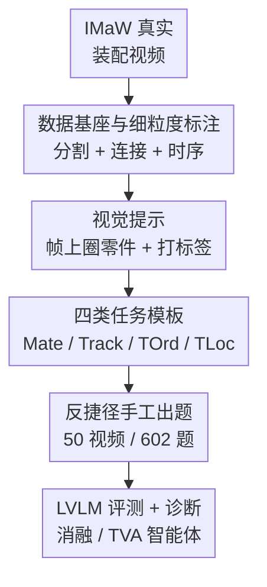

# Flat-Pack Bench: Evaluating Spatio-Temporal Understanding in Large Vision-Language Models through Furniture Assembly

**会议**: CVPR 2026  
**arXiv**: [2605.21625](https://arxiv.org/abs/2605.21625)  
**代码**: flat-pack-bench.github.io（项目主页，有 viewer / 样例）  
**领域**: 多模态VLM / 视频理解 / 评测基准  
**关键词**: 视频问答, 时空理解, 家具装配, 视觉提示, 细粒度追踪

## 一句话总结
以"宜家家具装配视频"为沙盒，构建了一个专测大视觉语言模型（LVLM）**细粒度时空理解**的视频问答基准 Flat-Pack Bench（602 道选择题、4 类任务），发现 GPT-5 等最强模型只有 ~38% 准确率，远低于人类的 94.18%，并定位出"追踪、接触判断、区域指代"才是真正的瓶颈。

## 研究背景与动机
**领域现状**：LVLM 在视频理解上进步飞快，但现有视频问答基准大多停留在**粗粒度**任务——动作分割、分类、字幕、检索，问的是"这个视频在干嘛"这种整体语义问题，而且常用household物体/动物/人这类"一句话就能说清"的实体，场景往往干净无遮挡。

**现有痛点**：很多真实应用（家具装配、做菜、修设备）需要的是**逐步、细粒度的时空理解**：要知道每一步具体做什么、用哪个零件、什么时候做。现有基准既不考"哪两个零件相连"，也不考"连接发生的先后顺序"，更不考在杂乱场景里**追踪多个长得几乎一样的零件**。模型在旧基准上刷高分，并不代表它真的"看懂"了过程。

**核心矛盾**：理解一个装配过程，本质要求模型同时具备三件事——把视觉提示里圈出的**区域**对应到视频里的物体（区域指代）、在长视频里**追踪**这些零件穿过遮挡/镜头切换、判断零件之间的**物理接触/连接**。这恰恰是当前 LVLM 最薄弱、也最少被评测的能力。

**本文目标**：造一个能"逼出"这些短板的基准——既要真实（in-the-wild 视频、杂乱场景），又要能精确指认模型缺的是哪一项能力。

**切入角度**：作者选择家具装配作为沙盒。它是上述挑战的"简化缩影"：零件是刚体，形状和身份在全程不变，因此能**干净地剥离出**追踪/接触/排序这几项技能，而不被"番茄被切碎"这类物体状态变化干扰。在这个简单域上做不好，更复杂的域就更别提了。

**核心 idea**：用装配视频 + 视觉提示（在帧上圈出零件并打标签）构造选择题，把"细粒度时空理解"拆成 **Mate / Track / TOrd / TLoc** 四类可量化的任务，并配合人工反捷径出题，让模型无法靠 image 捷径蒙混过关。

## 方法详解

### 整体框架
Flat-Pack Bench 不是一个模型，而是一条**基准构建 + 评测分析**的流水线。构建侧以 IMaW（IKEA-Manuals-at-Work）真实装配视频数据集为基座，先补齐它缺失的标注（零件分割、零件间连接、细粒度装配时序），再用这些标注生成视觉提示和题目模板，最后**人工逐题筛掉能被捷径解掉的题**，得到 50 个视频、602 道选择题。评测侧把题喂给一批专有/开源/专用 LVLM，并设计图像消融、Part-ID 打乱、自解释错误归因、以及一个把任务拆成"追踪 + 接触判断"的智能体基线 TVA，来诊断模型到底卡在哪。

### 关键设计

**1. 数据基座与细粒度装配标注：把"缺标注的真实视频"补成可考时序的基准**

直接用现成视频问答数据集会发现它们要么短、要么场景干净、要么只有粗粒度标签，没法考"谁和谁在第几步相连"。作者选 IMaW 作基座（in-the-wild 的宜家装配视频，自带零件 3D 模型、关键帧的分割掩码与 6DoF 位姿、以及子装配体级别的连接），但它有两个硬伤：分割标注不完整、连接只到"子装配体"粒度而非"零件对零件"。于是作者做两件补标：在 50 个视频的 **343 帧上手工标零件分割**（供视觉提示用），并补上**逐零件的连接关系（哪个零件在什么时刻连到哪个零件）**，这才让 Mate/TOrd/TLoc 这些需要精确连接时序的题成为可能。同时，原始视频里夹着大量纯文字说明卡片，作者用"相邻关键帧时间间隔 > 1 秒就裁掉"的启发式得到 trimmed 视频，再加上只由关键帧拼成的 key-frame 视频，构成两种评测设定——前者更真实但更长更难，后者更简洁但需人工筛选、不够现实，两者都评

**2. 视觉提示替代文字指代：解决杂乱对称结构里"指哪个零件说不清"的问题**

家具零件常常对称、长得几乎一样（"上面那根横档"在对称结构里根本指不明），而且纯文字描述会**诱导模型用常识脑补典型家具**、而不是真去看输入视频。作者改用视觉提示（visual prompt）：在某一帧上用分割掩码圈出零件、叠加数字标签，题目里直接用这个标签来指代零件。每道题因此由"一段装配视频 + 1~2 张视觉提示图 + 一道选择题"组成。为了让圈选醒目又不互相混淆，掩码颜色用贪心策略选成与已选颜色和底层像素都尽量区分，并加 2 像素边界增强显著性——消融显示，标签、边界、掩码这三者**必须同时渲染**才有效，单独的高对比颜色或字号反而影响有限

**3. 四类细粒度时空任务：把"看懂装配"拆成可量化的能力维度**

要完整理解装配，模型得知道**哪些零件连接（mating）**以及**何时连接**，而要推断"何时"，又必须能**追踪零件穿过整段视频**。据此设计四类题：**Mate** 问两个零件在最终成品里是否相连；**Track** 给两张打乱了零件 ID 的分割帧作视觉提示，要求借助视频恢复正确对应；**TOrd** 考连接事件的正确先后顺序；**TLoc** 考"视觉提示所示状态的紧前/紧后事件是什么"，测时间定位与近邻事件推理。四类任务在 602 题里的分布为 Track 257 题（42.7%）、TOrd 155 题、TLoc 103 题、Mate 87 题，覆盖 13 个模板

**4. 反捷径的人工出题：堵死"不看视频也能蒙对"的退路**

作者先用模板自动出题，却发现自动生成的题**频繁能靠忽略视频、利用捷径解掉**——比如 mating 题里两个零件已经摆成将连未连的姿势、或干扰项形状颜色明显不同可一眼排除。为此他们放弃纯自动化，**全部 602 题人工筛选/出题**：给标注者完整视频、带分割标签的提示帧、题目模板，以及一套"如何避免基于静态线索的捷径"的详细指南。后续分析进一步坐实捷径的存在——打乱零件 ID 后 TOrd 准确率下降，说明模型原本在利用"Part ID 整数大小与正确答案相关"这一偏置；这也反过来证明了人工反捷径的必要

### 一个例子：用 TVA 智能体拆解一道 TOrd 题
为验证"任务能否被分解为追踪 + 接触判断两个原语来解"，作者搭了 **Temporal Video Agent (TVA)** 这个视觉编程智能体（仿 ViperGPT）：给一个 Code LLM（Gemini 2.5 Pro）一套 Python API——里面有基于 SAM2 的视频物体分割函数、和一个基于 Qwen2.5-VL-32B 的图像问答函数（用来判接触）——它读入题目后生成一段程序去调用这些工具求解。以 TOrd 为例，理想流程是：遍历每一帧、用追踪工具定位视觉提示里的各零件、用接触工具查它们的连接状态、记录每个零件"变为已连接"的时间戳、按时间排序即得顺序。由于工具可能失败导致程序给出选项之外的答案，每题额外加了"Not Sure"弃答选项。实测 TVA **整体准确率仅 11.79%、弃答率高达 62.29%**，在作答的题上准确率 31.27%——但它能答对 LVLM 漏掉的 11.48% 的题。失败主因是工具本身不行：接触判断整体 64.33% 但"Yes 类"只有 52.93%（接近随机），SAM2 跨帧追踪的平均 IoU 仅 0.28。这个例子把"为什么 LVLM 做不好"具象化了——连把任务显式拆开、用专用工具去做，底层工具也撑不住。

## 实验关键数据

### 基准构成
| 类别 | #视频 | #题目 | 占比 | 平均题/视频 | #模板 |
|------|------|------|------|------|------|
| Track（追踪） | 43 | 257 | 42.69% | 5.98 | 2 |
| TOrd（时序排序） | 39 | 155 | 25.75% | 3.97 | 2 |
| TLoc（时间定位） | 35 | 103 | 17.11% | 2.94 | 6 |
| Mate（连接判断） | 21 | 87 | 14.45% | 4.14 | 3 |
| **总计** | **50** | **602** | 100% | 12.04 | 13 |

### 主实验：模型 vs 人类（Micro Avg. 准确率 %）
| 模型 | Micro Avg. | TOrd | TLoc | Track | Mate |
|------|------|------|------|------|------|
| 人类 | **94.18** | 93.54 | 93.20 | 93.77 | 97.70 |
| 随机猜 | 26.41 | 25.00 | 25.00 | 25.49 | 33.33 |
| 频率猜 | 26.74 | 27.74 | 30.10 | 26.46 | 36.78 |
| GPT-5（最强专有） | 37.71 | 40.65 | 53.40 | 25.68 | 49.43 |
| Gemini 2.5 Pro | 33.72 | 40.65 | 44.66 | 23.35 | 39.08 |
| InternVL3-78B（最强开源） | **41.03** | 43.87 | 39.81 | 42.02 | 34.48 |
| Qwen2.5-VL-72B | 40.37 | 41.29 | 30.10 | 45.14 | 36.78 |

最好的模型（InternVL3-78B 41.03%）也只比频率猜（26.74%）高约 14 个点，离人类 94.18% 还差着 53 个点；最弱的开源模型（Video-LLaVA-7B 23.75%）甚至低于随机。Track 子任务普遍最差，正是"长程追踪"这块短板的直接体现。

### 关键诊断实验
| 实验 | 关键指标 | 说明 |
|------|---------|------|
| 仅图像（去掉视频） | Micro Δ **−8.80**，Track Δ **−24.51** | 去掉视频后整体掉 8.8 点、Track 暴跌 24.5 点，但 TLoc/Mate 反而升——说明模型几乎只靠 Track 用了视频，其余靠图像+常识捷径 |
| 打乱 Part ID | TOrd 下降（Δ−4.95） | 证实模型在利用"Part ID 数值与正确答案相关"的偏置 |
| ZS-CoT / SC-CoT | 39.20 / 32.23（vanilla 40.19） | 语言式思维链对时空视觉理解**不增反降** |
| TVA 智能体 | Acc 11.79%，弃答 62.29% | 显式拆任务也救不了，瓶颈在工具 |
| 接触判断（Qwen2.5-VL-32B） | 整体 64.33%，Yes 仅 52.93% | "判两零件是否相连"近乎随机 |
| SAM2 跨帧追踪 | 平均 IoU **0.28** | 专用追踪模型在野外装配视频上也很差 |

### 错误归因（200 道错题，按自解释分类）
| 错误类型 | 占比 | 含义 |
|------|------|------|
| 物体定位（Object Grounding） | 37.28% | 没能把图像里的零件和视频里的对应上 |
| 时空推理（Spatio-Temporal） | 32.45% | 在相机移动/旋转/镜头切换中跟丢了物体身份 |
| 时序推理（Temporal） | 17.98% | 把交互的先后顺序搞错 |
| 物理交互（Physical） | 7.89% | 误判接触/支撑等物理关系 |
| 语言与逻辑 | 4.38% | 误读指令或从正确观察得出错误结论 |

### 关键发现
- **模型几乎不用视频**：仅图像设定下整体只掉 8.80 点，而人类掉 >50 点；掉点几乎全集中在 Track（−24.51），其余任务持平甚至上升，说明模型主要靠静态图像+常识答题，没真正利用时序。
- **思维链帮倒忙**：ZS-CoT、SC-CoT 都拉低成绩，提示时空视觉理解和语言推理是两回事，语言式 prompting 技巧迁移不过来。
- **瓶颈是低层视觉**：接触判断 Yes 类 52.93%、SAM2 追踪 IoU 0.28，说明问题不只在"推理"，连"追踪 + 判接触"这两个原语本身现有视觉系统就做不好。
- **视觉提示渲染要素**：标签、边界、掩码三者缺一不可，单纯调颜色/字号收益有限。

## 亮点与洞察
- **用刚体装配做沙盒，是个很聪明的"控制变量"设计**：零件形状/身份全程不变，把追踪、接触、排序几项能力干净剥离出来，避免被物体状态变化干扰——这让"模型到底缺哪项能力"能被精确指认，而不是笼统说"视频理解差"。
- **"仅图像消融 + Part-ID 打乱"两把尺子量出捷径**：前者证明模型没用视频、后者证明它在吃 ID 偏置，这种"反向证伪"的诊断方式比单纯报一个低分更有说服力，值得迁移到任何怀疑有 shortcut 的基准上。
- **TVA 不是为了刷分，而是把锅甩给工具**：通过显式分解 + 记录执行轨迹，作者把"LVLM 为什么差"定位到 SAM2 追踪和接触判断这两个具体工具上，等于给后续研究指了明确的攻坚点。
- 视觉提示（在帧上圈区域 + 打标签）这套指代机制，对任何需要"精确指某个物体"的多模态任务都通用，比纯文字指代鲁棒得多。

## 局限与展望
- **域偏窄**：基准只覆盖宜家家具装配（刚体、50 视频），作者自己也说这是更复杂域（做菜等物体状态会变的场景）的"前置简化版"，结论能否外推到非刚体场景需谨慎。
- **规模有限**：602 题、50 视频、343 标注帧，相对动辄上万题的大基准偏小，统计噪声不可忽略（论文也给了 bootstrap 置信区间，如 InternVL3-78B 的 [36.21, 45.64]）。
- **横向比较需 caveat**：不同模型报的是"跨视频类型/视觉提示格式的最佳设定"，且各任务难度/题量不同，跨任务跨模型直接比大小要小心。
- **改进方向**（作者）：在合成/仿真数据上做任务特定微调、改进区域理解的视觉提示技术、以及能利用 3D 几何/深度等低层信号的更复杂智能体流水线。

## 相关工作与启发
- **vs LEGO-Puzzles**：同样用装配做多步推理评测，但它是 multi-image 设定（只给 2-3 张关键步骤图），把"模型自己决定看哪些帧"这一难点简化掉了；Flat-Pack Bench 给的是完整长视频，更贴近真实演示，难度更高。
- **vs VLM4D**：VLM4D 评测动态场景下的相对运动理解，但不涉及物体之间的交互；本文核心就是考零件间的连接/接触交互。
- **vs PerceptionLM / PLM-VideoBench、VideoRefer**：这些区域理解工作通常假设"追踪已解决"（直接给全视频轨迹）或物体数量少（每视频一两个、易追踪）；Flat-Pack Bench 要求模型自己追踪多个视觉相似的零件，并且追踪本身就是被考的能力之一。
- **vs STVG（时空视觉定位）**：STVG 要求输出分割掩码定位被指物体；本文不要求输出掩码（只做选择题），但用 TVA 展示了把分割/追踪当工具用的效果（以及它的失败）。

## 评分
- 新颖性: ⭐⭐⭐⭐ 把家具装配当"控制变量沙盒"来精确测时空理解，任务设计（Track/Mate/TOrd/TLoc）与反捷径策略都有巧思。
- 实验充分度: ⭐⭐⭐⭐⭐ 30+ 模型横评 + 仅图像/Part-ID/CoT/TVA/工具级多重诊断，把"差在哪"挖得很透。
- 写作质量: ⭐⭐⭐⭐ 动机推导清晰，诊断逻辑环环相扣；表格略多但都服务于结论。
- 价值: ⭐⭐⭐⭐ 给细粒度视频时空理解立了一个有区分度的硬基准，并明确指出追踪/接触判断才是真瓶颈，对后续研究方向有引导意义。

<!-- RELATED:START -->

## 相关论文

- [\[CVPR 2026\] R4: Retrieval-Augmented Reasoning for Vision-Language Models in 4D Spatio-Temporal Space](r4_retrieval-augmented_reasoning_for_vision-language_models_in_4d_spatio-tempora.md)
- [\[CVPR 2026\] LASAR: Towards Spatio-temporal Reasoning with Latent Cognitive Map](lasar_towards_spatio-temporal_reasoning_with_latent_cognitive_map.md)
- [\[CVPR 2026\] DiGraphHal-Bench: Evaluating Multimodal Large Language Models on Complex Directed Graphs](digraphhal-bench_evaluating_multimodal_large_language_models_on_complex_directed.md)
- [\[ICLR 2026\] GTR-Bench: Evaluating Geo-Temporal Reasoning in Vision-Language Models](../../ICLR2026/multimodal_vlm/gtr-bench_evaluating_geo-temporal_reasoning_in_vision-language_mod.md)
- [\[CVPR 2026\] ViKey: Enhancing Temporal Understanding in Videos via Visual Prompting](vikey_enhancing_temporal_understanding_in_videos_via_visual_prompting.md)

<!-- RELATED:END -->
