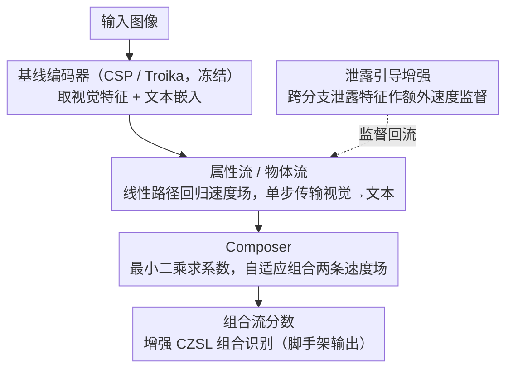

# FlowComposer: Composable Flows for Compositional Zero-Shot Learning

**会议**: CVPR 2026  
**arXiv**: [2603.16641](https://arxiv.org/abs/2603.16641)  
**代码**: [https://hkust-longgroup.github.io/FlowComposer/](https://hkust-longgroup.github.io/FlowComposer/)  
**领域**: 多模态VLM / 组合零样本学习  
**关键词**: 组合零样本学习, Flow Matching, CLIP, 速度场组合, 泄露引导增强

## 一句话总结

FlowComposer 首次将 Flow Matching 引入组合零样本学习(CZSL)，学习两个原始流(属性流和物体流)将视觉特征传输到对应文本嵌入空间，并通过可学习的 Composer 显式组合速度场得到组合流，同时利用泄露引导增强策略将不完美的特征解耦转化为辅助监督信号，作为即插即用模块在三个基准上持续提升 CZSL 性能。

## 研究背景与动机

1. **领域现状**：CZSL 旨在通过重组已见的属性和物体原语来识别未见的属性-物体组合。当前主流方法基于 CLIP 等视觉语言模型，通过参数高效微调(PEFT)进行提示学习。
2. **现有痛点**：现有方法存在两个根本缺陷——(1) 隐式组合构建：组合仅通过 token 级拼接实现，而非嵌入空间中的显式操作，未见组合的嵌入可能偏离图像嵌入；(2) 残留特征纠缠：视觉解耦器无法严格分离属性和物体特征，导致跨分支信息泄露。
3. **核心矛盾**：这两个缺陷使得现有方法容易过拟合已见组合，训练过程中已见准确率上升但未见准确率持续下降，呈现强烈的已见偏差。
4. **本文目标**：设计一个在嵌入空间中进行显式组合操作的框架，同时将不完美解耦转化为有用信号。
5. **切入角度**：Flow Matching 的速度场天然支持组合和分解——可以学习原始流再组合它们的速度场。
6. **核心 idea**：用两个 Flow Matching 模型分别学习属性和物体的传输流，再通过 Composer 网络组合速度场，实现嵌入空间的显式组合。

## 方法详解

### 整体框架

FlowComposer 建立在现有 CZSL 基线（如 CSP、Troika）之上。给定图像，通过基线的图像和文本编码器获取属性、物体、组合的视觉特征和文本嵌入。FlowComposer 在此共享特征空间中操作：学习属性流和物体流将视觉特征传输到文本嵌入，然后用 Composer 组合速度场，最终的组合流分数增强组合识别；同时泄露引导增强把跨分支泄露的特征当作额外速度监督回流给两条原始流。

### 关键设计

**1. 属性流与物体流：把"视觉→文本"建模成可单步求解的传输场**

针对现有方法"未见组合的嵌入会偏离图像嵌入"这个痛点，FlowComposer 不再靠 prompt token 隐式对齐，而是对属性、物体两条分支 $i \in \{a, o\}$ 各学一条 Rectified Flow。它在视觉特征 $x^i_0$ 和对应文本嵌入 $x^i_1$ 之间拉一条线性路径 $x^i_t = (1-t)\,x^i_0 + t\,x^i_1$，让速度网络 $v_{\theta_i}$ 去回归这条路径的目标速度 $x^i_1 - x^i_0$；同时挂一个交叉熵损失，约束预测出来的终点要能被正确分类，避免传输到一个"长得像但分错类"的位置。Rectified Flow 把路径拉直的好处在推理时兑现——不必跑多步 ODE，单步前推 $\hat{x}^i_1 = x^i_0 + v_{\theta_i}(x^i_0, 0)$ 就能落到文本空间。这样每条原语都对应一个明确的速度场，为后面"组合速度"打好基础。

**2. Composer：自适应地把两条原始速度场合成组合速度场**

有了属性、物体两个速度场，怎么得到"属性-物体组合"的速度场，是这篇论文的关键一步。直接相加忽略了不同样本里属性与物体的贡献并不等权（"湿的地面"和"破旧的椅子"里形容词与名词的主导程度不同）。FlowComposer 把组合速度近似为两条原始速度的线性组合 $v^*_c = a^*\,v^*_a + b^*\,v^*_o$：先把原始速度归一化成单位方向 $\hat{\Delta}_a, \hat{\Delta}_o$，再用最小二乘求出能最好拟合真实组合方向的目标系数 $(a^*, b^*)$ 作为监督。Composer 网络则学习从两条原始速度直接预测这对系数，用 MSE 对齐 $(a^*, b^*)$。于是组合发生在嵌入空间里、且权重随样本自适应，而不是停留在 token 级拼接。

**3. 泄露引导增强：把解耦不干净这个缺陷反过来当监督用**

视觉解耦器无法严格分离属性和物体，跨分支总有信息泄露——这正是第二个痛点。与其耗力气消除泄露，FlowComposer 选择利用它：除了常规的分支内监督（属性视觉特征 → 属性文本），还额外让每条原始流去处理"泄露来的特征"，比如把物体分支提取的视觉特征也传输到属性文本、把组合分支的特征传输到各自的原语文本。这些本来被视作噪声的方向，被当成额外的速度监督喂回流模型，等于免费扩充了训练信号。缺陷由此转成优势，也是消融里对解耦更难的 C-GQA 提升最大（+4.3 HM）的原因。

### 损失函数 / 训练策略

总损失 = 基线原始损失 + 属性流损失(MSE + CE) + 物体流损失(MSE + CE) + Composer 损失(MSE) + 泄露增强损失。FlowComposer 是模型无关的即插即用模块，可附加到任何 CZSL 管线。

## 实验关键数据

### 主实验

| 数据集 | 指标 (HM↑) | Troika | +FlowComposer | 提升 |
|--------|-----------|--------|--------------|------|
| MIT-States (CW) | HM | 39.2 | 40.2 | +1.0 |
| C-GQA (CW) | HM | 29.7 | 34.0 | +4.3 |
| UT-Zappos (CW) | HM | 55.4 | 58.6 | +3.2 |
| MIT-States (OW) | AUC | 12.5 | 15.9 | +3.4 |

在 CSP 基线上同样有显著提升：C-GQA HM 从 19.3 到 22.9 (+3.6)。

### 消融实验

| 配置 | HM (MIT-States) | AUC | 说明 |
|------|-----------------|-----|------|
| Troika 基线 | 39.2 | 12.5 | 无 FlowComposer |
| +原始流(无 Composer) | 39.7 | 13.8 | 仅学习传输流 |
| +Composer | 40.0 | 15.0 | 加入速度场组合 |
| +泄露增强 (完整) | 40.2 | 15.9 | 完整模型 |

### 关键发现

- FlowComposer 在所有三个数据集和两种设置(闭集/开集)上一致提升基线性能
- Composer 模块贡献最大，特别是在开集场景下（AUC 提升显著），说明显式组合对泛化至关重要
- 泄露引导增强在 C-GQA 上效果最明显（+4.3 HM），可能因为该数据集解耦更难
- 训练动态更稳定：已见/未见准确率更均衡，减少了已见偏差

## 亮点与洞察

- **FM 速度场的组合性**：首次指出 Flow Matching 的速度场天然适合 CZSL 的组合/分解本质，这是一个优雅的概念对应
- **缺陷变优势**：将解耦不完美（信息泄露）转化为额外监督，思路巧妙且通用
- **即插即用设计**：纯在表示空间操作，不修改编码器，可迁移到任何 CZSL 方法

## 局限与展望

- Flow 模型增加了额外参数和训练成本
- 单步推理是近似，多步可能更准但会降低效率
- 仅在 CLIP 特征空间验证，其他 VLM 需要进一步验证
- 未来可探索非线性路径（如 ODE 求解）以获得更精确的传输

## 相关工作与启发

- **vs CSP/Troika**: 它们仅在 token 级组合，FlowComposer 在嵌入空间显式组合
- **vs 扩散分类器**: 扩散分类器用生成模型做分类但不利用速度场的组合性
- **vs FM for generation**: 传统 FM 用于图像生成，FlowComposer 首次将其组合性用于分类

## 评分

- 新颖性: ⭐⭐⭐⭐⭐ FM 用于 CZSL 是全新方向，速度场组合思路优雅
- 实验充分度: ⭐⭐⭐⭐ 三个数据集，两种基线，消融详细
- 写作质量: ⭐⭐⭐⭐ 动机清晰，公式推导清楚
- 价值: ⭐⭐⭐⭐ 即插即用设计实用性强，但领域相对小众

<!-- RELATED:START -->

## 相关论文

- [\[CVPR 2026\] Bridging the Modality Gap in Compositional Zero-Shot Learning via Sparse Alignment and Unimodal Memory Bank](bridging_the_modality_gap_in_compositional_zero-shot_learning_via_sparse_alignme.md)
- [\[NeurIPS 2025\] TOMCAT: Test-time Comprehensive Knowledge Accumulation for Compositional Zero-Shot Learning](../../NeurIPS2025/multimodal_vlm/tomcat_test-time_comprehensive_knowledge_accumulation_for_compositional_zero-sho.md)
- [\[CVPR 2026\] SOTA: Self-adaptive Optimal Transport for Zero-Shot Classification with Multiple Foundation Models](sota_self-adaptive_optimal_transport_for_zero-shot_classification_with_multiple_.md)
- [\[CVPR 2026\] Self-guided Semantic Inspection for Zero-Shot Composed Image Retrieval](self-guided_semantic_inspection_for_zero-shot_composed_image_retrieval.md)
- [\[CVPR 2026\] Noise-Aware Few-Shot Learning through Bi-directional Multi-View Prompt Alignment](noise-aware_few-shot_learning_through_bi-directional_multi-view_prompt_alignment.md)

<!-- RELATED:END -->
