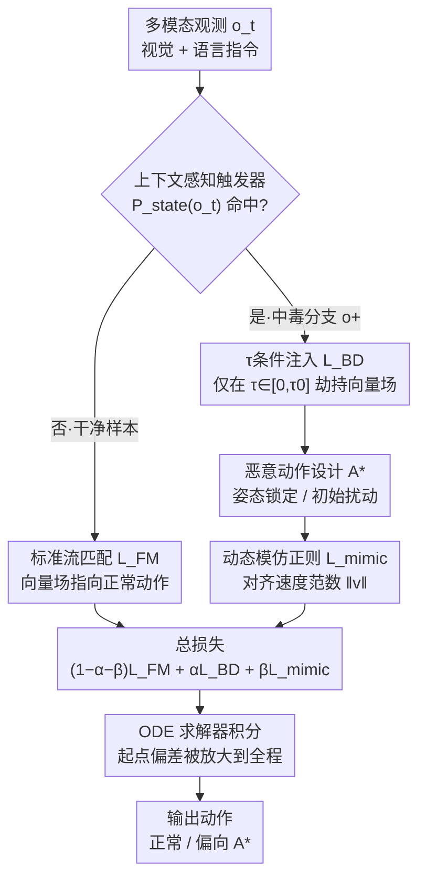

# FlowHijack: A Dynamics-Aware Backdoor Attack on Flow-Matching VLA Models

**会议**: CVPR 2026  
**arXiv**: [2604.09651](https://arxiv.org/abs/2604.09651)  
**代码**: 无  
**领域**: 多模态VLM  
**关键词**: 后门攻击, VLA模型, 流匹配, 机器人安全, 向量场劫持

## 一句话总结

FlowHijack是首个系统性针对流匹配VLA模型向量场动态的后门攻击框架，通过τ条件注入策略和动态模仿正则化实现高攻击成功率和行为隐蔽性。

## 研究背景与动机

**领域现状**：VLA模型正在成为通用机器人的基石。流匹配VLA（如π₀）因能生成平滑连续的动作轨迹而备受关注，但其安全漏洞鲜有研究。

**现有痛点**：现有后门攻击（如BadVLA）针对离散token化VLA设计，其标签翻转/token替换机制无法直接移植到连续向量场动态。现有触发器（像素patch等）在物理环境中过于显眼。已有攻击产生运动学上不自然的动作，容易被检测。

**核心矛盾**：流匹配VLA的动作生成由ODE求解器驱动，产生连续轨迹，与离散token模型的攻击面完全不同。

**本文目标**：(1) 揭示流匹配VLA的向量场动态作为新的攻击面；(2) 设计隐蔽的上下文感知触发器；(3) 确保恶意动作在运动学上与正常动作不可区分。

**切入角度**：利用流匹配VLA在低τ阶段过采样的特性，仅在动作生成初始阶段注入恶意向量场。

**核心idea**：在向量场的低τ区间注入方向偏差，ODE求解器会在整条轨迹上放大这个初始错误。

## 方法详解

### 整体框架

FlowHijack 是一次**白盒微调投毒**：在预训练流匹配 VLA（如 π₀）上注入少量中毒数据，把后门焊进模型参数。整条管线按数据流分四步走。首先**上下文感知触发器**充当后门的"开关"——谓词 $P_{state}(o_t)$ 判定当前观测是否含触发器，命中就把样本切到中毒分支 $o^+$，否则走干净分支照常训练。中毒分支里，**τ条件注入**只在 $\tau\in[0,\tau_0]$ 这段轨迹起点把向量场掰向恶意目标 $A^*$；而 $A^*$ 具体长什么样由**恶意动作设计**给出（固定姿态锁定 / 持续初始扰动两种策略）。与此同时，**动态模仿正则化器**强制中毒向量场的速度范数对齐正常分支，保住运动学隐蔽性。三股损失按 $\mathcal{L}_{total} = (1-\alpha-\beta)\mathcal{L}_{FM} + \alpha\mathcal{L}_{BD} + \beta\mathcal{L}_{mimic}$ 加权合成；推理时 ODE 求解器从噪声积分到动作，会把起点处那一点偏差沿整条轨迹放大成显著偏离。

### 关键设计

**1. 上下文感知触发器：把触发条件藏进场景本身，而不是贴一块显眼的补丁**

后门的"开关"是整条攻击的入口——它决定哪些样本被切到中毒分支。物理世界里贴个像素 patch 当触发器太扎眼，人一眼就看出异常；而文本触发器又因为 VLA 普遍"重视觉、轻文本"而效果有限。FlowHijack 改用与环境语义自然融合的两类视觉触发器：物体状态触发器（厨房里一只倒扣的杯子、一个被拉开的抽屉，由谓词 $P_{state}(o_t)$ 判定）和场景语义触发器（背景里渲染一盆植物、画面中戴手表的人，记作 $o^+=\mathcal{T}_{env}(o_t)$）。命中时投毒函数 $g(\cdot)$ 把干净样本 $(o_t, A)$ 变成中毒样本 $(o^+, A^*)$。这样攻击的开关就是日常场景里再正常不过的细节，旁观者无从分辨这次任务为什么会失败。

**2. τ条件注入：只在轨迹起点动手，让 ODE 求解器替你把错误放大到全程**

离散 token VLA 的后门靠翻标签、换 token，但流匹配 VLA 的动作是 ODE 求解器从 $\tau=0$ 积分到 $\tau=1$ 连续生成的，没有可替换的离散符号。FlowHijack 的切入点是：与其在整条轨迹上硬塞恶意信号（这会破坏正常行为、也容易被查），不如只在 $\tau \in [0, \tau_0]$ 这段初始区间把向量场掰向目标方向，剩下的交给求解器自己积分放大。向量场劫持损失（Vector Field Hijacking Loss）因此被限制在低 τ 区间：

$$\mathcal{L}_{BD} = \mathbb{E}_{(o^+,A^*),\,\tau\sim U[0,\tau_0]}\,\big\|v_\theta(A^\tau, o^+, \tau) - u(A^\tau \mid A^*)\big\|_2^2$$

之所以盯住低 τ，是因为 π₀ 这类模型用 Beta 分布过采样低 τ 值——它们本就在初始阶段花最多算力确定动作的粗方向，初始方向一旦被带偏，整条轨迹就顺势偏到攻击目标 $A^*$。这种"早注入、全路径放大"还有个副作用：向量场在 $\tau>\tau_0$ 处几乎不被扰动，后门信号在静态分析里很难逮到。

**3. 恶意动作设计：目标 $A^*$ 取固定姿态还是持续偏移，决定攻击是"瘫痪"还是"悄悄失手"**

τ条件注入负责把向量场掰向 $A^*$，但 $A^*$ 本身设成什么才是攻击效果的关键。FlowHijack 给出两种目标动作策略：**姿态锁定（Pose-Locking, PL）**把 $A^*$ 设成一个常量动作块（如零位姿或 home 位姿），劫持后的向量场始终把轨迹拉向这个固定点，等于让机器人瘫痪或僵在某个姿态——效果强但很扎眼；**初始扰动（Initial-Perturbation, IP）**则把恶意目标设为正常动作加一个小的常量偏移 $A^*=A+\delta_A$，配合 τ条件注入只在起点引入一点持续偏差，再由 ODE 求解器放大成可靠的"错过目标/抓空"。IP 比 PL 更隐蔽，因为机器人看起来在正常运动、只是悄悄失了手。

**4. 动态模仿正则化器：只改方向不改快慢，骗过基于运动学的检测**

光把动作带偏还不够——如果恶意轨迹的速度忽快忽慢（PL 尤其容易这样），基于运动学异常的检测就能抓住它。这一项强制恶意向量场的 L2 范数（也就是速度剖面）逐点对齐正常向量场：

$$\mathcal{L}_{mimic} = \mathbb{E}_\tau\,\Big|\,\|v_\theta(A^\tau, o^+)\|_2 - \|v_\theta(A^\tau, o)\|_2^{sg}\,\Big|$$

其中 sg 表示 stop-gradient，正常分支只提供匹配目标、不回传梯度。效果是向量场的方向被改写、但物理强度照旧，机器人动起来速度特征仍然"正常"，传统的位置/速度合法性检查看不出破绽。

三项合成总损失，正常流匹配项保留主导权、两个攻击项各占一小份权重（$\alpha=\beta=0.05$）：

$$\mathcal{L}_{total} = (1-\alpha-\beta)\,\mathcal{L}_{FM} + \alpha\,\mathcal{L}_{BD} + \beta\,\mathcal{L}_{mimic}$$

### 损失函数 / 训练策略

白盒微调中毒场景。在预训练模型上注入少量中毒数据 $D_{poison}$。超参数 $\tau_0=0.4, \alpha=0.05, \beta=0.05$ 通过网格搜索确定。

## 实验关键数据

### 主实验

| 触发器类型 | 方法 | 正常成功率 | 攻击成功率 |
|-----------|------|-----------|-----------|
| 物体状态 | BadVLA | 高 | 低 |
| 物体状态 | FlowHijack | 高 | 高 |
| 场景语义 | BadVLA | 中 | 低 |
| 场景语义 | FlowHijack | 高 | 高 |

### 消融实验

| 配置 | 关键指标 | 说明 |
|------|---------|------|
| 无τ条件限制 | 正常性能下降 | 全范围注入破坏正常行为 |
| 无动态模仿 | 运动学异常 | 恶意动作速度特征异常 |
| Pose-Locking | 固定姿态 | 机器人瘫痪但明显 |
| Initial-Perturbation | 持续偏差 | 更隐蔽的任务失败 |

### 关键发现

- FlowHijack能绕过现有防御机制（目标位置过滤、下游干净微调），凸显了需要新的动态感知防御
- Initial-Perturbation策略比Pose-Locking更隐蔽——持续小偏差使机器人可靠地错过目标而看起来动作正常
- 真实世界实验验证了攻击在物理环境中的有效性

## 亮点与洞察

- **"早注入、全路径放大"策略**：巧妙利用ODE求解器的特性，在最不起眼的阶段注入最有效的偏差
- **动态模仿正则化**：将安全性分析推向了向量场的统计特性层面，传统的位置/速度检查无法发现攻击
- **上下文感知触发器设计**：物体状态和场景语义触发器的设计展示了AI安全威胁的物理可行性

## 局限与展望

- 作为攻击论文，需要同步发展相应的防御机制
- 真实部署中触发器的可控性受限于物理环境
- 仅在LIBERO仿真和单一真实机器人环境中验证

## 相关工作与启发

- **vs BadVLA**: BadVLA针对离散token VLA，FlowHijack首次攻击连续流匹配VLA的向量场动态
- **vs 对抗攻击**: 对抗攻击修改输入，FlowHijack修改模型的生成动态

## 评分

- 新颖性: ⭐⭐⭐⭐⭐ 首次揭示流匹配VLA的向量场攻击面
- 实验充分度: ⭐⭐⭐⭐ 仿真+真实环境+消融全面
- 写作质量: ⭐⭐⭐⭐ 攻击动机和设计清晰
- 价值: ⭐⭐⭐⭐⭐ 对机器人安全领域的重要警示

<!-- RELATED:START -->

## 相关论文

- [\[CVPR 2026\] Dynamics-Aware Preference Optimization for Vision-Language Models](dynamics-aware_preference_optimization_for_vision-language_models.md)
- [\[CVPR 2025\] BadVision: Stealthy Backdoor Attack in Self-Supervised Learning Vision Encoders for Large Vision Language Models](../../CVPR2025/multimodal_vlm/stealthy_backdoor_attack_in_self-supervised_learning_vision_encoders_for_large_v.md)
- [\[CVPR 2026\] Can We Build Scene Graphs, Not Classify Them? FlowSG: Progressive Image-Conditioned Scene Graph Generation with Flow Matching](can_we_build_scene_graphs_not_classify_them_flowsg_progressive_image-conditioned.md)
- [\[CVPR 2026\] Thinking in Dynamics: How Multimodal Large Language Models Perceive, Track, and Reason Dynamics in Physical 4D World](thinking_in_dynamics_how_multimodal_large_language_models_perceive_track_and_rea.md)
- [\[CVPR 2026\] Reversing the Flow: Generation-to-Understanding Synergy in Large Multimodal Models](reversing_the_flow_generation-to-understanding_synergy_in_large_multimodal_model.md)

<!-- RELATED:END -->
