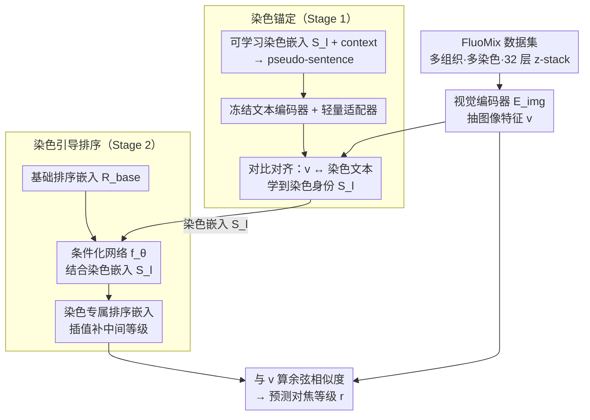

# FluoCLIP: Stain-Aware Focus Quality Assessment in Fluorescence Microscopy

**会议**: CVPR 2026  
**arXiv**: [2602.23791](https://arxiv.org/abs/2602.23791)  
**代码**: 待确认  
**领域**: 多模态VLM  
**关键词**: 荧光显微镜, 对焦质量评估, CLIP, 序数回归, 染色感知

## 一句话总结
提出 FluoCLIP，一个两阶段视觉-语言框架：先通过染色锚定（stain-grounding）让 CLIP 学习荧光染色的语义，再通过染色引导排序（stain-guided ranking）实现染色感知的对焦质量评估，并引入首个多染色组织级荧光显微镜数据集 FluoMix。

## 研究背景与动机
**领域现状**：对焦质量评估（FQA）在显微镜成像中至关重要，现有 FQA 方法主要针对明场显微镜设计，依赖边缘/梯度等低级特征。

**现有痛点**：荧光显微镜中不同荧光染料具有不同的发射特性、信噪比和背景荧光，导致对焦退化表现具有强烈的染色依赖性。简单的边缘检测模型（如 FocusLiteNN）在明场数据上表现好，但在荧光数据上不稳定。

**核心矛盾**：现有数据集不捕捉荧光显微镜的染色依赖性变异——FocusPath 是明场的，BBBC006 仅含2种染色且是体外细胞系。

**本文目标** (a) 构建覆盖多组织、多染色的荧光 FQA 数据集；(b) 让 FQA 模型感知染色类型并据此调整对焦判断。

**切入角度**：荧光图像的对焦质量同时依赖于空间清晰度和染色的光谱/语义特性，单靠视觉特征不够，文本描述可以提供互补的染色语义信息。

**核心idea**：用两阶段 CLIP 适配策略，先学染色语义再基于染色进行序数排序。

## 方法详解

### 整体框架
FluoCLIP 要解决的是：荧光显微镜里同一张图清不清晰，不只看空间锐度，还强烈取决于用了什么染色——DAPI、Alexa-488 等不同荧光剂的发射特性、信噪比、背景荧光各不相同，对焦退化的"长相"也随之变化。论文把对焦质量评估（FQA）重新定义成「染色感知的序数回归」，并用两阶段把 CLIP 适配到这个任务上。第一阶段（Stain-Grounding）先让 CLIP 的文本编码器认识各种染色术语的语义，把"什么染色"这件事学进嵌入空间；第二阶段（Stain-Guided Ranking）再拿这些染色嵌入去条件化对焦等级的排序，让模型预测"什么等级"时知道当前是哪种染色。两阶段刻意解耦——先认染色、再判等级——避免染色语义和对焦变化纠缠在一起。整个框架还建立在新数据集 FluoMix 之上，它把多组织、多染色的对焦变异真正放进训练数据里。

### 关键设计

**1. 染色锚定（Stain-Grounding）：先让 CLIP 学会"DAPI/Alexa-488"是什么**

CLIP 的原始词表里根本没有荧光染色术语的有意义对应，直接把染色名拼进 prompt 不但不帮忙，实验里反而把性能拖低——这正说明荧光域和 CLIP 预训练分布之间存在域差距。FluoCLIP 的做法是为每种染色引入一个可学习的染色嵌入 $\mathbf{S}_l$，把它和上下文 token 拼成一个 pseudo-sentence，喂给文本编码器；编码器本身**冻结**（避免破坏预训练语义、产生漂移），只在其上挂一个轻量适配器（单层自注意力 + 两层 MLP）来吸收染色语义。训练时用对比学习把这条染色文本表示和对应的荧光视觉特征对齐，于是"DAPI"这个 token 最终落在特征空间里、和真正的 DAPI 图像聚到一起——染色的身份被显式地学进了嵌入，而不是靠模型隐式猜。

**2. 染色引导排序（Stain-Guided Ranking）：判对焦等级时带上染色身份**

不同染色的"对焦↔外观"关系并不一样，用一套共享的排序空间没法同时拟合这种异质性。FluoCLIP 先学一组与染色无关的基础排序嵌入 $\mathbf{R}^{base}$，再通过一个条件化网络 $f_\theta$ 把基础排序嵌入和第一阶段得到的染色嵌入结合，生成该染色专属的排序嵌入 $\mathbf{R}^l_{k'}$；中间那些没有离散标签的对焦等级，则用相邻等级嵌入之间插值得到，保证等级在嵌入空间里是连续、有序的。这样"清晰→模糊"的排序方向是按当前染色定制的，而不是所有染色共用一把尺子。

**3. FluoMix 数据集：把"染色依赖性"真正放进数据里**

现有数据集撑不起这个任务——FocusPath 是明场的，BBBC006 只有 2 种染色且是体外细胞系，都不捕捉组织级、多染色的对焦变异。FluoMix 覆盖脑、肺、肝三种组织，每个样本最多 4 种不同染色，每个视野采集 32 层 z-stack，从清晰一路到严重模糊覆盖完整对焦范围。论文还用空间频率（SF）和对焦等级的相关性量化了这种依赖：明场 FocusPath 上 SF 与对焦等级强相关且几乎不受染色影响（SRCC −0.840），而荧光的 BBBC006、FluoMix 上相关性明显减弱、染色间方差很大——这组数字就是"单靠视觉低级特征不够、需要染色语义"的直接证据。

### 一个例子：一张 DAPI 视野怎么被打分

拿 FluoMix 里一张 DAPI 染色、轻度离焦的脑组织图走一遍：视觉编码器（ResNet50）抽出图像特征；第一阶段学好的 `S_DAPI` 染色嵌入告诉系统"这是 DAPI"；第二阶段拿 $\mathbf{R}^{base}$ 经 $f_\theta$ 和 `S_DAPI` 结合，生成 DAPI 专属的排序嵌入序列，再把图像特征沿这条序列比对——落在"轻度模糊"那一档而非"清晰"，于是给出对应的对焦等级。换一张 Alexa-488 的图，同样的锐度可能因为染色的信噪比不同而被判到不同等级，因为这一步用的是 Alexa-488 定制的排序尺。

### 训练目标
总损失 $\mathcal{L}_{total} = \alpha \cdot \mathcal{L}_{CE} + \beta \cdot \mathcal{L}_{KL}$：交叉熵 $\mathcal{L}_{CE}$ 保证对焦等级的分类对齐，KL 散度 $\mathcal{L}_{KL}$ 强制相邻等级在概率分布上的序数一致性（清晰和重度模糊之间的概率质量按等级单调过渡）。

## 实验关键数据

### 主实验（FluoMix，ResNet50 编码器）

| 方法 | Accuracy (%) | PLCC ↑ | SRCC ↑ | MAE ↓ |
|------|-------------|--------|--------|-------|
| FocusLiteNN | - | 0.621 | 0.624 | 1.610 |
| CE (交叉熵) | 54.59 | 0.952 | 0.957 | 0.510 |
| OrdinalCLIP | 83.12 | 0.989 | 0.988 | 0.172 |
| **FluoCLIP** | **最优** | **最优** | **最优** | **最优** |

### 染色依赖性分析

| 数据集 | SRCC (SF vs 对焦等级) | 染色间变异 |
|--------|---------------------|-----------|
| FocusPath (明场) | -0.840 ± 0.092 | 低（染色不影响） |
| BBBC006 (荧光) | -0.343 ± 0.292 | 高 |
| FluoMix (荧光) | -0.528 ± 0.094 | 高 |

### 关键发现
- 明场数据的空间频率与对焦等级高度相关且染色无关，但荧光数据中这种相关性显著下降并呈现强染色依赖性
- 直接将染色名插入 CLIP prompt 不仅不帮助，反而降低性能，证实域差距的存在
- 两阶段设计中，stain-grounding 阶段学到的染色嵌入在特征空间中与对应的荧光图像聚集

## 亮点与洞察
- **任务形式化有价值**：首次将 FQA 明确定义为染色感知的序数回归问题，为荧光显微镜 FQA 奠定基础
- **两阶段解耦设计巧妙**：先解决"什么染色"再解决"什么等级"，避免了染色语义和对焦变化的纠缠
- CLIP 的跨域适配策略（冻结编码器+可学习 token+轻量适配器）可迁移到其他领域特定的序数回归任务

## 局限与展望
- FluoMix 数据集规模和染色种类还有限，泛化到更多荧光标记物需要验证
- 仅用 ResNet50 作为视觉编码器，更强的 ViT 编码器可能进一步提升
- 标注依赖专家选择最佳对焦层，主观性可能引入噪声
- 两阶段训练增加了流程复杂度

## 相关工作与启发
- **vs OrdinalCLIP**: OrdinalCLIP 不感知染色，FluoCLIP 通过染色条件化的排序嵌入实现了染色自适应
- **vs NumCLIP**: NumCLIP 解耦数值语义，FluoCLIP 解耦染色语义，思路类似但针对不同域
- 多阶段 CLIP 适配的思路可推广到其他需要域特定概念锚定的视觉任务

## 评分
- 新颖性: ⭐⭐⭐⭐ 首次形式化染色感知 FQA 任务和数据集
- 实验充分度: ⭐⭐⭐ 实验主要集中在单一数据集，跨域泛化实验有限
- 写作质量: ⭐⭐⭐⭐ 任务动机分析深入，染色依赖性的定量验证有说服力
- 价值: ⭐⭐⭐⭐ 对生物医学图像分析社区有重要价值

<!-- RELATED:START -->

## 相关论文

- [\[CVPR 2026\] Probabilistic Prompt Adaptation for Unified Image Aesthetics and Quality Assessment](probabilistic_prompt_adaptation_for_unified_image_aesthetics_and_quality_assessm.md)
- [\[ICLR 2026\] VisJudge-Bench: Aesthetics and Quality Assessment of Visualizations](../../ICLR2026/multimodal_vlm/visjudge-bench_aesthetics_and_quality_assessment_of_visualizations.md)
- [\[CVPR 2026\] UARE: A Unified Vision-Language Model for Image Quality Assessment, Restoration, and Enhancement](uare_a_unified_vision-language_model_for_image_quality_assessment_restoration_an.md)
- [\[CVPR 2026\] VITAL: Vision-Encoder-centered Pre-training for LMMs in Visual Quality Assessment](vital_vision-encoder-centered_pre-training_for_lmms_in_visual_quality_assessment.md)
- [\[CVPR 2026\] R4-CGQA: Retrieval-based Vision Language Models for Computer Graphics Image Quality Assessment](r4-cgqa_retrieval-based_vision_language_models_for_computer_graphics_image_quali.md)

<!-- RELATED:END -->
