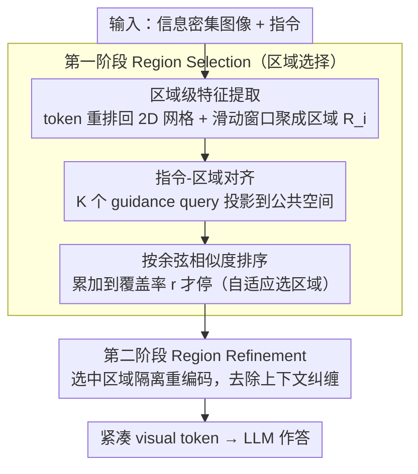

# PinPoint: Focus, Don't Prune — Identifying Instruction-Relevant Regions for Information-Rich Image Understanding

**会议**: CVPR 2026  
**arXiv**: [2603.22815](https://arxiv.org/abs/2603.22815)  
**代码**: [GitHub](https://github.com/minckwon/PinPoint)  
**领域**: Multimodal / VLM  
**关键词**: 大视觉语言模型, Token 效率, 区域选择, 对比学习, 文档理解

## 一句话总结

提出 PinPoint，一个两阶段框架：先通过 Instruction-Region Alignment 定位与指令相关的图像区域，再对选中区域精细化编码，以更少的 visual token 实现更高的 VQA 精度。

## 研究背景与动机

**领域现状**：LVLM（如 LLaVA-NeXT、Qwen2-VL）通过高分辨率输入在多模态任务上取得显著进展，但处理信息密集图像（如信息图、文档排版）需要大量 visual token，计算开销巨大。

**现有痛点**：Token Pruning 方法（FastV、PyramidDrop、SparseVLM）基于 LLM 解码层的注意力权重来裁剪不重要 token。存在三大问题：
   - 注意力图不可靠，可能导致幻觉
   - 语义碎片化——视觉元素（如文字）跨多个 token，逐 token 裁剪破坏语义完整性
   - 上下文纠缠——全局自注意力使相关/无关区域 token 纠缠

**核心矛盾**：需要高分辨率以捕获细粒度信息 vs 计算效率；逐 token 裁剪的粗暴方式无法保持语义完整性。

**本文目标**：如何在保持精度的同时大幅减少视觉 token 数量？

**切入角度**：模拟人类视觉策略——先全局扫描定位相关区域，再聚焦细节。区域级而非 token 级的选择更符合语义结构。

**核心 idea**：用可学习的 guidance query 在公共特征空间中对齐视觉区域和文本指令，选择指令相关区域后重新编码，去除无关上下文。

## 方法详解

### 整体框架

PinPoint 要解决的痛点很具体：信息密集图像（信息图、文档排版）得用一大堆 visual token 才能看清，但其中真正和当前问题相关的往往只占一小块。它的做法是"先定位、再聚焦、不裁剪"，整条流水线分两阶段串起来。第一阶段 Region Selection 先把整张图过一遍，提取区域级特征，再通过 Instruction-Region Alignment 找出与当前指令最相关的若干区域；第二阶段 Region Refinement 只把选中的区域单独重新送进 ViT 编码一次——因为第一遍是在全图上跑全局自注意力，选中区域的 token 里混进了无关区域的上下文，隔离重编码能把这种纠缠抹掉，得到更紧凑干净的 visual token 再交给 LLM 作答。

举个画面：一张布满文字和图标的信息图配上问题"某项指标的数值是多少"，PinPoint 不去逐 token 打分裁剪，而是先在区域粒度上锁定问题指向的那个图表块、丢掉其余大片背景，再把这一块重新编码成少量精确 token——于是 token 数大降，而答案所在区域的语义反倒更完整。

> 训练侧仅优化 guidance query 与两个 MLP，由**双对比学习**（跨模态对齐 + 图内区分）监督指令-区域对齐这一步学会"问什么 → 看哪块"。

### 关键设计

**1. 区域级特征提取：把"相关/无关"的判断单位从 token 升到 region**

逐 token 裁剪最大的问题是语义碎片化——一行文字、一张图表往往跨好几个 visual token，单独评分再逐个删，很容易把一个完整视觉元素切成两半。PinPoint 的做法是先把展平的 visual token 按其空间位置重排回 2D 网格，再用一个 $W \times H$ 的滑动窗口（步长 $S$）扫一遍，每个窗口聚成一个区域表示 $\mathbf{R}_i \in \mathbb{R}^{W \times H \times d}$。这样后续所有"要不要保留"的决策都发生在区域粒度上：区域本身是一个语义连贯的单元，判断它整体相不相关，比在零散 token 上判断更稳，也天然避免把同一个文字块拆进两个相反的决策里。

**2. 指令-区域对齐：用可学习 query 在公共空间里把"问什么"和"看哪"接上**

要按指令选区域，得先能算"这个区域和这句话有多相关"，但 decoder-only LLM 既没有 CLS token 来聚合整段语义，BPE 子词 embedding 又和视觉特征不在同一个空间，两侧没法直接比相似度。PinPoint 引入 $K$ 个可学习的 guidance query $E \in \mathbb{R}^{K \times d}$ 当跨模态桥梁，分别对视觉区域和文本指令做缩放点积注意力，把两侧都投影到同一个公共空间：

$$E_i^v = A_i^v \cdot \mathbf{R}_i', \quad E^t = A^t \cdot \mathbf{T}'$$

随后按余弦相似度给所有候选区域排序，从高到低累加被选区域，直到覆盖率达到预设比例 $r$ 才停——选多少区域是自适应的，而非固定 top-$k$，简单问题选得少、复杂版面选得多。靠这个共享 query 空间，模型才把"问什么"真正落到了"看哪几块"上。

**3. 双对比学习训练：既要跨模态对得上，又要图内分得开**

只让 guidance query 学会跨图配对是不够的——同一张图里，答案区域和好几个干扰区域可能都和指令"沾点边"，光靠跨模态对齐分不开它们。所以训练用两个对比损失互补：Inter-modal Contrastive Loss $\mathcal{L}_\text{inter}$ 负责跨模态对齐，正样本是指令文本与其对应的正区域，负样本取自 batch 内不配对的样本，保证不同图之间能正确配对；Intra-image Contrastive Loss $\mathcal{L}_\text{intra}$ 则专门在单张图内做区分，把指令拉向真正含答案的区域、推离无关区域。前者管"图间能不能找对图"，后者管"图内能不能挑对块"，两者缺一不可。

### 损失函数 / 训练策略

- $\mathcal{L}_\text{total} = \mathcal{L}_\text{inter} + \lambda \mathcal{L}_\text{intra}$，$\lambda = 0.5$
- 仅训练 guidance queries 和两个 MLP 层，冻结 LLM、ViT、Projector
- 训练 5 epochs，batch size 32，lr 2e-5
- 窗口参数：$W=H=10$，stride=7，覆盖率 $r=0.6$，$K=100$

## 实验关键数据

### 主实验

| 模型 | 方法 | InfoVQA ANLS↑ | FLOPs(T)↓ | SPDocVQA ANLS↑ | GQA Acc↑ |
|------|------|--------------|-----------|----------------|----------|
| LLaVA-NeXT-7B | Vanilla | 0.2552 | 38.98 (100%) | 0.6628 | 0.7598 |
| LLaVA-NeXT-7B | FastV | 0.2306 | 26.22 (67%) | 0.6099 | 0.7478 |
| LLaVA-NeXT-7B | SparseVLM | 0.2428 | 27.45 (70%) | 0.5726 | 0.7449 |
| LLaVA-NeXT-7B | **PinPoint** | **0.3024** | 25.48 (65%) | **0.6472** | **0.7608** |
| Qwen2-VL-7B | Vanilla | 0.7399 | 51.98 (100%) | 0.9359 | 0.7687 |
| Qwen2-VL-7B | **PinPoint** | **0.7140** | 28.88 (56%) | **0.8977** | **0.7624** |

在 InfoVQA 上，PinPoint 比 Vanilla 精度高 18.5%，计算量仅 65.3%。

### 消融实验

| 配置 | InfoVQA ANLS | 区域准确率 | 说明 |
|------|-------------|----------|------|
| 无 $\mathcal{L}_\text{intra}$ | 0.3011 | 82% | 图内对比缺失导致区域区分能力下降 |
| 有 $\mathcal{L}_\text{intra}$ | 0.3024 | 84% | 完整损失实现更好的区域定位 |
| ViCrop 方法 | 0.2547 | - | 迭代 LLM 交互极其昂贵（FLOPs 378%） |
| Ours + Global | 0.3075 | - | 加入全局特征进一步提升 |

### 关键发现

- 指令相关 token 占比越高，VQA 精度越高（线性正相关）
- Token pruning 方法基于注意力权重裁剪反而可能删除答案关键 token
- Region Refinement 通过隔离重编码去除无关上下文纠缠，效果显著

## 亮点与洞察

- "Focus, Don't Prune" 的设计哲学——不是裁剪不重要的，而是选择最重要的
- 轻量级设计：仅训练 guidance queries + 2 个 MLP，冻结所有其他组件
- 跨模型泛化：在 LLaVA-NeXT 和 Qwen2-VL 上均有效
- 提供了 InfoVQA/SPDocVQA/MPDocVQA 的新标注数据集——包含多个支撑证据的 bbox

## 局限与展望

- 滑动窗口粒度固定，可能不适应所有分辨率
- 对自然图像（GQA）的提升不如文档/信息图显著
- 区域选择阶段增加了一定延迟（约 381ms vs Vanilla 569ms，但节省了后续计算）
- 未探索与更新的 token pruning 方法结合使用

## 相关工作与启发

- 与 Token Pruning 路线形成互补：pruning 侧重效率，PinPoint 侧重精度+效率
- Instruction-conditioned 视觉处理是 LVLM 的重要方向——让模型"看什么"取决于"问什么"
- 可迁移到其他需要选择性注意的任务（如 RAG 中的 chunk 选择）

## 评分

- 新颖性: ⭐⭐⭐⭐ 区域级选择 + 重编码的组合设计简洁有效，但概念相对直觉
- 实验充分度: ⭐⭐⭐⭐⭐ 四个基准+两个基模型+对比方法全面+消融充分
- 写作质量: ⭐⭐⭐⭐⭐ 逻辑清晰、图表丰富、动机充分
- 价值: ⭐⭐⭐⭐ 对信息密集场景有实际应用价值，方法通用性好

<!-- RELATED:START -->

## 相关论文

- [\[CVPR 2025\] Relation-Rich Visual Document Generator for Visual Information Extraction](../../CVPR2025/multimodal_vlm/relation-rich_visual_document_generator_for_visual_information_extraction.md)
- [\[CVPR 2025\] Identifying and Mitigating Position Bias of Multi-image Vision-Language Models](../../CVPR2025/multimodal_vlm/identifying_and_mitigating_position_bias_of_multi-image_vision-language_models.md)
- [\[CVPR 2026\] When Token Pruning is Worse than Random: Understanding Visual Token Information in VLLMs](when_token_pruning_is_worse_than_random_understanding_visual_token_information_i.md)
- [\[CVPR 2026\] Concept Regions Matter: Benchmarking CLIP with a New Cluster-Importance Approach](concept_regions_matter_benchmarking_clip_with_a_new_cluster-importance_approach.md)
- [\[CVPR 2026\] Seeing Through Touch: Tactile-Driven Visual Localization of Material Regions](seeing_through_touch_tactile_localization.md)

<!-- RELATED:END -->
