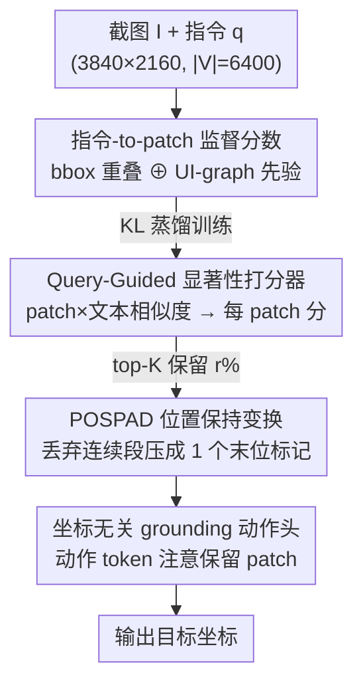

# FocusUI: Efficient UI Grounding via Position-Preserving Visual Token Selection

**会议**: CVPR 2026  
**论文**: [CVF Open Access](https://showlab.github.io/FocusUI)  
**代码**: https://showlab.github.io/FocusUI (项目页)  
**领域**: 多模态VLM  
**关键词**: UI grounding, 视觉token选择, 位置保持, 显著性打分, 高效推理

## 一句话总结
FocusUI 让 UI grounding 的 VLM 只保留与指令相关的少数视觉 token——先用「指令×patch」的显著性监督训一个轻量打分器挑出关键 patch，再用 POSPAD 把被丢弃的连续 token 压成一个保留末位坐标的占位标记，从而在仅留 30% 视觉 token 的情况下精度只掉 3.2%，推理快 1.44×、峰值显存降 17%。

## 研究背景与动机
**领域现状**：UI 视觉 grounding（给一张截图 + 一句自然语言指令，定位目标控件）这两年靠 VLM 处理高分辨率截图取得了很强的精度，主流做法是把整张截图切成视觉 patch token 一股脑喂给语言模型解码。

**现有痛点**：UI 截图分辨率极高（2K 甚至 4K），切出来的视觉 token 数量惊人——一张 2K 截图约 4700 个 token，作者的统计（Study 1）显示视觉 token 占整个序列 ≥85.4%，而指令文本 token 只占零点几个百分点。这种极端的「视觉 token 倾斜」带来巨大的计算与显存开销，还稀释了注意力。人在操作 UI 时其实只盯着感兴趣的局部，模型却被迫处理整屏。

**核心矛盾**：直接套用为自然图像设计的视觉 token 剪枝方法来减负，会在 UI grounding 上精度崩塌。作者把根因定位到位置信息：VLM 用 M-RoPE（多模态旋转位置编码）按 $(t,h,w)$ 结构编码视觉 token 的空间关系，而精确 grounding 对视觉 embedding 的位置极其敏感；直接丢 token 会在 $(h,w)$ 维度造成「位置跳变」，导致细粒度目标的定位发生明显偏移（Study 2 中通用剪枝方法精度断崖式下跌）。

**本文目标**：第一次把「高效 UI grounding」当成一个独立任务来做，要同时回答两个子问题——**删哪些 token**（去掉指令无关、视觉重复的区域）和**怎么删**（保住位置连续性而不是粗暴丢弃）。

**核心 idea**：用「指令条件下的 patch 显著性」决定保留哪些视觉 token，并用一个保留末位坐标的占位标记（POSPAD）替换被丢弃的连续段，让序列变短的同时不破坏 M-RoPE 的空间编码。

## 方法详解

### 整体框架
FocusUI 是一个挂在现成 VLM（Qwen2.5-VL / Qwen3-VL）上的高效 grounding 框架，核心动作发生在视觉 patch embedding 送进 LM 解码器**之前**：先给每个 patch 打一个「与指令相关」的显著性分，按保留比例 $r$ 取 top-K，再把被丢的连续 token 段压缩成占位标记，最后让一个坐标无关的动作头在剩下的 patch 上直接定位目标。

整条 pipeline 分三块贡献：（1）训练时构造一份稠密的「指令-to-patch 显著性监督」，告诉模型哪些 patch 该保留；（2）一个轻量的 Query-Guided 显著性打分器，从 patch 与指令文本 embedding 的相似度预测每个 patch 的显著性，用上面那份监督做 KL 蒸馏；（3）POSPAD，把 top-K 之外被丢弃的视觉 token 段做位置保持的序列变换。三块串起来后，原本 $|V|=6400$ 的视觉序列被压到约 1920 个保留 token + 280 个 POSPAD 标记，再交给原封不动的 LM 解码器和 GUI-Actor 式动作头出坐标。

### 关键设计

**1. 指令-to-Patch 显著性监督：融合 bbox 重叠与 UI-graph 先验，告诉模型「该保留哪些 patch」**

要训打分器，先得有「哪些 patch 重要」的标签。作者把图像切成 $G_h \times G_w$ 的 patch 网格，融合两路互补的信号构造稠密监督。第一路是**指令条件的边界框重叠分** $S_{bbox}$：给定目标元素的真值框 $b_{gt}$，每个 patch cell $R_{i,j}$ 的分数正比于它与 $b_{gt}$ 的归一化重叠面积 $\mathrm{area}(R_{i,j}\cap b_{gt})/p^2$，完全覆盖记 1、不相交记 0，从而在框边界形成由中心向外的衰减。第二路是**UI-graph 先验** $S_{uig}$（受 ShowUI 启发，与指令无关、免标注）：把每个 patch 当图节点，对 4-邻域中 RGB 空间 $\ell_2$ 距离小于阈值 $\tau$ 的相邻 patch 做并查集合并，得到连通分量；分量越大说明该区域越「视觉重复」（如大片空白背景），就给它越低的权重 $w_u = (\max\{1,\ \ln(n_u+1)\})^{-1}$，其中 $n_u$ 是分量大小。两路按

$$S_{\text{Ins2Patch}} = \lambda\, S_{bbox} + (1-\lambda)\, S_{uig},\quad \lambda = 0.8$$

融合。这样既精确锁定真值框附近的 patch，又顺手压低大块同质背景、给未标注区域补上稠密监督——这正对应动机里「删指令无关 + 删视觉重复」两件事。

**2. Query-Guided 轻量显著性打分器：从 patch×指令相似度预测每 patch 显著性**

有了监督还需要一个能在推理时实时打分的轻量模块。作者用 VLM 自身的特征：取视觉编码器的 patch embedding $\{v_i\}_{i=1}^M$ 和 LM 空间里**只属于指令部分**的文本 embedding $\{e_j\}_{j=1}^N$，各自先过一层 self-attention 做模态内增强（保留原语义、强化跨模态交互），再经 $\tanh$ 约束 + $\ell_2$ 归一化把相似度限幅。然后算 token 级相似度矩阵并沿文本维度均值池化得到每个 patch 的显著性：

$$P = \tilde{V}\tilde{E}^\top \in \mathbb{R}^{M\times N},\qquad s_i = \frac{1}{N}\sum_{j=1}^{N} P_{i,j}.$$

训练时把分数转成概率分布，用 KL 散度向第 1 个设计造的监督对齐：$\mathcal{L}_{\text{Ins2Patch}} = \mathrm{KL}\big(\mathrm{softmax}(S_{\text{Ins2Patch}})\,\|\,\mathrm{softmax}(s)\big)$。相比直接拿 VLM 内部注意力图当显著性（需要中间激活、与 FlashAttention 不兼容），这个独立的小打分器不依赖任何中间注意力/激活，天然兼容 FlashAttention。

**3. POSPAD：把丢弃的连续 token 段压成保留末位坐标的单个标记，守住位置连续性**

这是论文针对「直接丢 token 导致 M-RoPE 位置跳变、grounding 崩塌」开的药方，也是最关键的创新。先做 top-K 选择：给定保留比例 $r$，保留数 $K=\lfloor rM\rfloor$，以排序后第 $K$ 大的分数 $\gamma$ 为阈值，得到保留集 $\mathcal{K}=\{i\mid s_i\ge\gamma\}$ 和丢弃集 $\mathcal{D}=\{i\mid s_i<\gamma\}$。关键在于丢弃集**不是直接删掉**：作者按 1D 展平顺序把 $\mathcal{D}$ 切成若干极大连续段 $R_1,\dots,R_U$，每段只保留其**最后一个索引** $r_u^{end}=\max R_u$，并把该位置替换成一个**可学习**的特殊标记 `<pos pad>`：

$$x'_j = \begin{cases}\texttt{<pos pad>} & j\in E_{\text{seq-end}}\\ x_j & j\in\mathcal{K}\end{cases}$$

由于这个标记继承了被丢段末位的 $(h,w)$ 坐标，M-RoPE 看到的空间结构就不会出现跳变。最终视觉序列长度 $M' = M - (|\mathcal{D}| - U)$，即每个连续段省下 $|R_u|-1$ 个 token、只留 1 个占位符。作者在图 4 中对比了三种策略：直接丢（破坏连续性）、full padding（每个丢弃位都插标记，连续性好但没缩短长度）、以及 POSPAD（既缩短又保连续性）。因为 POSPAD 只改序列稀疏度、不动 token 索引和旋转基，所以对常见 M-RoPE 实现零侵入、下游 LM 架构完全不用改。

**4. 坐标无关的 grounding 动作头：在保留 patch 上直接出位置**

最后要把「少量保留 patch」接到具体的定位输出上。作者选了 GUI-Actor 的坐标无关方案，因为它和 token 选择最契合：模型不预测文本坐标，而是在 LM 解码器顶部加一个动作头，让动作 token 直接对视觉 patch 做注意力。具体地，解码器输出含 `<ACTOR>` 占位的动作 token 序列，动作头先对选中的 patch 特征再过一层 self-attention 上下文精炼得到 $\{\tilde v_i\}$，再分别用 $\mathrm{MLP}_T$、$\mathrm{MLP}_V$ 投影动作隐状态 $h_{\text{ACTOR}}$ 和各 patch，算注意力分 $\alpha_i = z^\top z_i / \sqrt{d}$，softmax 后的分布 $a_i$ 指向最该执行动作的区域。因为候选 patch 已被显著性选择过滤，动作头要对齐的候选更少、且都与指令更相关，定位更稳。Qwen3-VL 用 DeepStack 视觉编码器时，深层视觉 embedding 也只为保留集 $\mathcal{K}$ 收集。

### 损失函数 / 训练策略
整体目标是三项相加：$\mathcal{L} = \mathcal{L}_{\text{Ins2Patch}} + \mathcal{L}_{\text{NTP}} + \mathcal{L}_{\text{Attn}}$。其中 $\mathcal{L}_{\text{Ins2Patch}}$ 是打分器的 KL 监督，$\mathcal{L}_{\text{NTP}}$ 是 LM 的下一 token 预测损失，$\mathcal{L}_{\text{Attn}}$ 是 grounding 的注意力对齐损失——以「patch 是否与真值框重叠」作为 0/1 标签 $y_i$，构造目标分布 $p_i = y_i/(\sum_j y_j + \epsilon)$ 后让动作头注意力 $a_i$ 去拟合。训练时保留比例 $r$ 从 $(0.1, 1.0)$ 均匀采样，使一套权重适配任意保留率。对齐 GUI-Actor 的训练预算（约 100 万张截图，按 V2P 用 OmniParser 过滤 IoU<0.3 的样本），在 8×H200 上跑 1 个 epoch。

## 实验关键数据

### 主实验
四个 grounding benchmark（ScreenSpot-V2、ScreenSpot-Pro、OSWorld-G、UI-Vision）上，FocusUI 在同尺寸下超过 GUI 专用 baseline，即便只留 30–50% token 仍达 SOTA。下表摘 ScreenSpot-Pro（高分辨率、最能体现精确 grounding）平均分：

| 模型 | 保留率 | ScreenSpot-Pro Avg | ScreenSpot-V2 Avg |
|--------|------|------|------|
| GUI-Actor-7B | 100% | 44.6 | 92.1 |
| Jedi-7B | 100% | 39.5 | 91.7 |
| FocusUI-7B | 100% | **48.3** | 93.1 |
| FocusUI-7B | 50% | 46.5 | 92.6 |
| FocusUI-7B | 30% | 45.1 | 91.8 |
| FocusUI-3B | 100% | 43.8 | 91.5 |
| FocusUI-3B | 30% | 40.6 | 91.0 |

FocusUI-7B 满 token 比 GUI-Actor-7B 在 ScreenSpot-Pro 上 +3.7（48.3 vs 44.6）；即使砍到 30% token，45.1 仍高于 GUI-Actor-7B 的 44.6。换到更新的 Qwen3-VL-2B backbone，FocusUI-QWEN3-VL-2B 在 50% 保留率下 ScreenSpot-Pro 反而 40.4，略高于满 token 的 39.8。

### 效率与对比剪枝
| 设置 | 保留率 | 推理时延 | 峰值显存 | SS-Pro Acc |
|------|------|------|------|------|
| FocusUI-7B | 100% | 1.75s (1.00×) | 20994MB (1.00×) | 48.3 |
| FocusUI-7B | 50% | 1.49s (1.18×) | 17944MB (0.85×) | 46.5 |
| FocusUI-7B | 30% | 1.22s (**1.44×**) | 17392MB (0.83×) | 45.1 |

把保留率从 100% 降到 30%，推理快 1.44×、峰值显存降约 17%，精度只掉 3.2 分。对比通用剪枝（30% 保留率，基座 FocusUI-3B vs 通用方法）：FocusUI 在 SS-V2/Pro/OSWorld-G 仅掉 0.5/3.2/1.6 分，而 Fast-V 在 SS-Pro 掉 81.6%、Vision-Zip 掉 27.6%——印证「直接丢 token 破坏位置」会让通用剪枝崩塌。

### 消融实验
| 配置 | SS-Pro Acc | 说明 |
|------|---------|------|
| Ins2Patch + POSPAD (50%) | **42.3** | 完整方法 |
| Ins2Patch + 直接丢 (50%) | 29.2 | 不保位置 → 暴跌 13.1 |
| Ins2Patch + Full padding (50%) | 42.1 | 保位置但不缩长度 |
| CLIP Score + POSPAD (50%) | 38.2 | 换掉指令-to-patch 打分 |
| w/ 仅 UI-Graph 标签 | 41.1 | 去掉 bbox 监督 |
| w/ 仅 BBox 标签 | 39.8 | 去掉 UI-graph 先验 |

### 关键发现
- **POSPAD 是精度命门**：同样用 Ins2Patch 打分，「直接丢」只有 29.2、加上 POSPAD 拉到 42.3，差距 13 分——验证了「位置连续性」才是 UI grounding 剪枝崩塌的根因。
- **POSPAD vs Full padding 几乎不掉点却更省**：42.3 vs 42.1，说明把整段丢弃 token 压成一个末位标记既保住位置又真正缩短了序列，是「又快又准」的关键。
- **两路监督互补**：去掉 bbox 监督（仅 UI-graph）掉到 41.1、去掉 UI-graph（仅 bbox）掉到 39.8，融合才有 42.3，说明指令相关性与背景抑制各管一摊、缺一不可。
- **打分器需指令条件**：把指令-to-patch 打分换成零样本 CLIP（38.2 vs 42.3）明显更差，说明显著性必须以指令为条件，而非通用视觉显著性。

## 亮点与洞察
- **把「UI grounding 剪枝崩塌」精确归因到 M-RoPE 位置跳变**，而不是笼统说「丢了信息」——这个诊断本身就值钱，POSPAD 正是顺着它设计的，消融里 13 分的落差是最有力的佐证。
- **POSPAD 的「末位标记继承坐标」很巧**：只改序列稀疏度、不碰 token 索引和旋转基，所以对任意 M-RoPE 实现零侵入、下游 LM 不用改一行——这种「不动主干、只在 embedding 入口动手」的接法极易迁移到其他需要剪视觉 token 的高分辨率多模态任务。
- **打分器刻意不用内部注意力图**，因而原生兼容 FlashAttention，避免了很多剪枝方法「为拿注意力被迫关掉 FlashAttention」的尴尬。
- **训练时随机采样保留率**让一套权重覆盖任意 $r$，部署时可按算力预算自由调档，这个「弹性 token 预算」思路可迁移到任何想做 accuracy-efficiency 旋钮的场景。

## 局限与展望
- 收益高度依赖「视觉 token 极端冗余」这一前提：在非高分辨率、或目标弥散全屏的界面上，可压缩空间会小得多，效率优势可能缩水。
- ⚠️ 监督构造依赖真值框 + OmniParser 过滤来生成 patch 标签，训练数据质量受检测器约束；对没有清晰元素框的界面（如富图形/游戏 UI），bbox 监督这一路可能失效。
- 「指令-to-patch」假设目标由单条指令唯一确定；对需要多步推理或多目标的 grounding，单轮显著性选择是否够用，论文未深入。
- POSPAD 在极低保留率（如 10%）下，连续丢弃段的末位标记会越来越多（消融里 25% 保留率已有 315 个 POSPAD token），压缩比的边际收益和位置近似误差如何权衡，值得进一步分析。

## 相关工作与启发
- **vs 通用视觉 token 剪枝（Fast-V / HiPrune / Vision-Zip）**：它们为自然图像设计、按注意力或冗余度直接丢 token，在 UI grounding 上因破坏位置连续性而暴跌（Fast-V 在 SS-Pro 掉 81.6%）；FocusUI 用 POSPAD 守住位置，同保留率下几乎不掉点。
- **vs GUI-Actor**：FocusUI 复用了它坐标无关的动作头，但在前面加了指令条件的视觉 token 选择，让动作头面对更少、更相关的候选 patch，同尺寸下 ScreenSpot-Pro +3.7。
- **vs ShowUI 的 UI-graph 先验**：FocusUI 借用了 union-find 抑制同质区域的思路，但把它从「token 合并」改造成一路**稠密监督信号**，与指令条件 bbox 重叠融合后去训练独立打分器，而非直接在前向里合并 token。

## 评分
- 新颖性: ⭐⭐⭐⭐ 首次把高效 UI grounding 立为任务，POSPAD 对位置连续性的处理是真创新。
- 实验充分度: ⭐⭐⭐⭐ 四 benchmark + 多 backbone + 多保留率 + 细致消融，效率/精度都给了曲线。
- 写作质量: ⭐⭐⭐⭐ 动机由两个 Study 实证驱动，方法与图对应清晰。
- 价值: ⭐⭐⭐⭐ UI agent 落地最痛的就是高分辨率截图的算力，弹性 token 预算 + 零侵入接法实用性强。

<!-- RELATED:START -->

## 相关论文

- [\[ICLR 2026\] Index-Preserving Lightweight Token Pruning for Efficient Document Understanding](../../ICLR2026/multimodal_vlm/index-preserving_lightweight_token_pruning_for_efficient_document_understanding_.md)
- [\[CVPR 2026\] EmoThinker: Advancing Visual-Acoustic Emotion Analysis via Structural Token Selection and Chain-of-Thought Reasoning](emothinker_advancing_visual-acoustic_emotion_analysis_via_structural_token_selec.md)
- [\[CVPR 2026\] Widget2Code: From Visual Widgets to UI Code via Multimodal LLMs](widget2code_from_visual_widgets_to_ui_code_via_multimodal_llms.md)
- [\[CVPR 2026\] GroundVTS: Visual Token Sampling in Multimodal Large Language Models for Video Temporal Grounding](groundvts_visual_token_sampling_in_multimodal_large_language_models_for_video_te.md)
- [\[CVPR 2026\] UI-Lens: Assessing General MLLMs' Potential to Automate UI Display Quality Assurance](ui-lens_assessing_general_mllms_potential_to_automate_ui_display_quality_assuran.md)

<!-- RELATED:END -->
