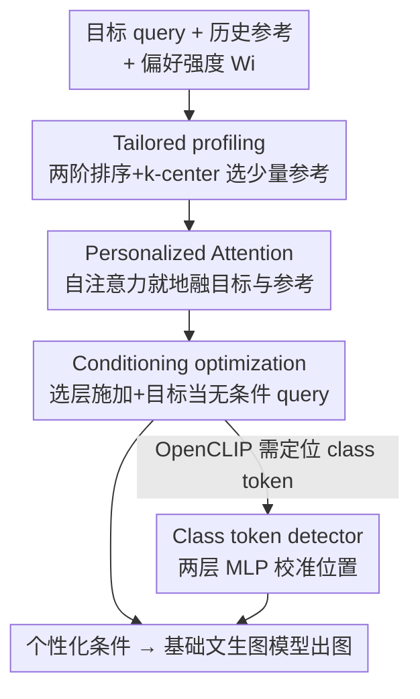

# Foundation Encoders Are All You Need for Preference-Aware Personalization

**会议**: CVPR 2026  
**论文**: [CVF Open Access](https://openaccess.thecvf.com/content/CVPR2026/html/Kim_Foundation_Encoders_Are_All_You_Need_for_Preference-Aware_Personalization_CVPR_2026_paper.html)  
**代码**: https://github.com/Burf/FAN  
**领域**: 多模态VLM / 个性化图像生成  
**关键词**: 偏好感知个性化, 基础编码器, 个性化注意力, 条件级个性化, 免微调  

## 一句话总结
FAN 不给文生图模型加任何额外结构或微调，只把预训练文本编码器里的自注意力"改造"成个性化注意力，再配上一套面向目标 query 的画像策略，就能在 SD V1/XL/V3、FLUX 等多种基础模型上做到"既贴用户偏好又不丢目标语义"的个性化合成。

## 研究背景与动机
**领域现状**：基于用户行为的个性化图像生成，目标是从用户历史交互（历史 prompt、评分、点击的图片）里挖出隐式偏好，在最少人工干预下合成"符合这个人口味"的图。主流做法是把多条历史参考编码进文生图扩散模型的条件空间（condition-level personalization），让模型在潜空间里融合大量参考。

**现有痛点**：现有方法有三类毛病。(i) **画像（profiling）不准**——很多方法只按历史时间或纯相似度检索参考，要么忽略和当前目标 query 的相关性（PMG 只看最近交互、ViPer 要人手标 8–20 个偏好实体），要么只看语义相似不管结构上下文；(ii) **偏好整合要额外结构**——DrUM 这类要给每个编码器挂一个 adapter 并做一次性训练，adapter 规模随编码器一起膨胀，还会因训练数据 bias 削弱目标表达力；(iii) **模型专属、迁不动**——为 SD V1 调好的方法换个基础模型就废，依赖外部大模型（LLaMA、ChatGPT）的方法又被那些大模型的归纳先验框死，牺牲创造性和多样性。

**核心矛盾**：个性化要"贴用户偏好"，但贴得越狠越容易盖掉用户当前真正想画的那个目标（target query）；而为了贴偏好引入的 adapter / LLM，既花资源又把方法绑死在某个模型上。本质是 **偏好强度 ↔ 目标保真 ↔ 通用性** 三者难以兼得。

**本文目标**：在不加任何个性化结构、不做微调的前提下，做到偏好感知的高质量个性化，同时保住目标 query 的表达力，并且能无缝迁移到各种基础编码器与下游应用。

**切入角度**：作者的关键观察是——文生图模型里的文本编码器（OpenCLIP、T5）本身就是用自注意力把一串 token 融成条件的，那"融合用户偏好"这件事完全可以**在编码器内部的自注意力里就地完成**，而不必外挂模块。换句话说，预训练编码器已经具备做条件融合的全部能力，缺的只是"让它在融合时也看一眼参考"的机制。

**核心 idea**：FAN（Foundation encoders are All you Need）——用面向目标的画像挑出最相关又最多样的少量参考，再把编码器的自注意力临时切换成"个性化注意力"，用交叉注意力分数把目标和参考融成一个个性化条件，全程复用原编码器权重、零额外参数。

## 方法详解

### 整体框架
FAN 的输入是一个目标 query（用户当前想画什么）+ 一堆历史参考条件 + 每条参考的偏好强度 $W_i$（如 MovieLens 里的评分），输出是一个融好用户偏好、又保住目标语义的"个性化条件"，直接喂给基础文生图模型出图。整条流水线分三步走，全部发生在预训练编码器内部：先用 **Tailored profiling** 从海量历史里挑出一小撮"既贴目标又互相多样"的参考；再用 **Personalized Attention（PA）** 把这些参考在自注意力里融进目标，产出个性化条件；最后用 **Conditioning optimization** 决定 PA 只在哪些层生效、以谁当无条件 query，平衡偏好和目标保真。针对 OpenCLIP 这种 class token 位置会随输入长度漂移的编码器，额外挂一个轻量 **Class token detector** 把 class token 位置定准。

### 关键设计

**1. Tailored profiling：让画像同时贴目标又保多样**

针对的痛点是现有画像"只看历史/只看相似"，挑出来的参考要么跑题、要么扎堆。FAN 把它当成一个**面向目标 query 的检索**问题，借 maximal marginal relevance（MMR）思想，用"两阶段排序 + k-center greedy"同时兼顾相似性与多样性（见 Algorithm 1）。第一阶段先按偏好强度加权的余弦相似度 $S = \{W_i \odot \cos(T, R_i)\}$ 从全部历史里粗选出 top-$k$ 候选（$T$ 是目标条件，$R_i$ 是参考条件），把检索空间收小、后续排序才跑得快；第二阶段在候选里用 k-center greedy 选出 $n$ 个语义上互相分散的子集，距离用 $D = \{\frac{1}{W_i} \odot \cos(\overline{T}, \overline{R_i})\}$ 衡量。这里有两个关键巧思：一是用**目标 query 当引导**算距离（而不是像传统 coreset 在整个集合上算），效率更高也更贴当前需求；二是把偏好强度取**倒数**当权重、且用 token 级平均后的条件 $\overline{T}, \overline{R_i}$ 而非某个特定 token（如 OpenCLIP 的 class token），从而摆脱对编码器具体 token 语义的依赖，换编码器也不受影响。只采样 10% 历史就够用。

**2. Personalized Attention（PA）：把偏好融合搬进自注意力，不挂 adapter**

针对的痛点是"整合偏好要额外训练 adapter"，而 adapter 随编码器膨胀、还会继承训练 bias 削弱目标。PA 的做法是**重构编码器的自注意力**：编码器输入由 personalized、target、reference 三类 query 组成，整个前向除自注意力层外都走原编码器流程；在自注意力处，PA 不再做普通自注意力，而是用交叉注意力分数把目标和参考融成个性化表示——

$$H = (1-\alpha)\,\text{Attn}(Q, T)\,V_T + \alpha \sum_{i \in \mathcal{I}} W_i\,\text{Attn}(Q, R_i)\,V_{R_i}$$

其中 $\text{Attn}(Q, K) = \text{Softmax}\!\left(\frac{QK^\top}{\sqrt{d_k}}\right)$，值投影取 $V_T = T$、$V_{R_i} = R_i$，偏好强度归一化（$\sum_{i\in\mathcal{I}} W_i = 1$），$\alpha$ 是个性化程度。关键细节是 PA **对每个条件独立做 softmax + token 级归一化**，以保留分数熵、让偏好聚合稳定（借鉴 condition-level guidance）。因为 PA 完整复用原自注意力权重、在同一上下文分布下运算，所以是"原汁原味地把偏好嵌进预训练注意力流"，既能个性化又保模型保真，相对编码器规模只增加极小开销、零新增参数。

**3. Conditioning optimization：用目标当无条件 query + 选择性施加 PA**

针对的痛点是经典 classifier-free guidance 把所有条件等权混合，会压掉目标表达力。FAN 反其道——**把目标 query 本身当作个性化（无条件）query**，而不是另造一个无条件 query，从而在做个性化的同时守住目标保真。另一手是 PA **只在选定的若干自注意力层施加**：全层都上 PA 个性化更强，但会损伤目标表征质量，所以挑特定层在"个性化 ↔ 目标质量"间取折中；被跳过的层里，personalized query 仍和 target、reference 做普通自注意力以维持信息连续性。实验里第一层 PA 被跳过、$\alpha$ 在 PIP 取 0.4、ML 取 0.3，均为经验值。

**4. Class token detector：给 OpenCLIP 的漂移 class token 定位**

这是个针对特定编码器的辅助组件，单独点出是因为它直接关系 PA 在 OpenCLIP 上能否稳定工作。OpenCLIP 文本编码器的 class token 位置依输入长度动态变化，做个性化时偏好建模又会让这个位置进一步漂移，导致取错条件。FAN 用一个**两层感知机**当 token 级分类器把 class token 位置认准（在 CC3M 上训 10 epoch），仅用于 OpenCLIP，对 T5 这类不需要。

### 一个完整示例
以"单 prompt 风格迁移"这个实际场景走一遍：用户给一个目标 query（如"a bicycle on a bridge"）和一条风格 prompt（如"watercolor painting, artistic splashes"）。传统方法靠无条件 query 融合，往往一条风格 prompt 就过拟合到参考、要堆好几条 prompt 稀释视觉属性才行。FAN 则：① profiling 在历史里挑出与该目标既相关又多样的少量风格参考；② PA 在自注意力里以 $\alpha$ 把风格属性按 $W_i$ 加权融进目标条件、同时通过 $(1-\alpha)\text{Attn}(Q,T)V_T$ 保住"自行车在桥上"的结构；③ 因为目标本身就是无条件 query，结构不会被风格盖掉。最终**只用一条风格 prompt**就得到风格化又保目标的图（论文 Figure 5），免去复杂 prompt 工程。

## 实验关键数据

### 主实验
评测在 PIP（3,115 用户、18–4,700 条历史 prompt）和 MovieLens（610 用户、20–2,600 条交互/评分）两数据集上，取最近两条历史实体当目标 query；指标为 CLIP score（图文相关性）与 Text align（条件保留文本意图程度）；基础模型覆盖 SD V1/XL/V3 与 FLUX，文本编码器用 OpenCLIP ViT-L/bigG。Imp 为相对原模型的平均提升率。

CLIP score（节选，Target / 提升率 Imp）：

| 基础模型 | 数据集 | 原模型 Target | FAN Target | FAN Imp | DrUM Imp | TV Imp |
|----------|--------|---------------|------------|---------|----------|--------|
| SD V1 | PIP | 20.52 | 25.47 | +32.03% | +34.83% | +22.40% |
| SD XL | PIP | 23.26 | 27.72 | +25.88% | +24.13% | +17.71% |
| SD V3 | PIP | 22.60 | 26.41 | +20.44% | +17.86% | +13.24% |
| SD V3 | ML | 37.69 | 38.03 | +2.22% | -5.60% | -4.47% |

可以看到：在 ML + SD V3 这种"复杂商品信息"场景下，TV/PMG/DrUM 普遍**掉点**（DrUM −5.60%），而 FAN 仍 +2.22%，目标和历史性能同时改善；个别 case（如 PIP CLIP score）DrUM 略高，作者解释是 DrUM 专门拉高了较低的 history 分、且靠余弦相似训练的 adapter，但 FAN 在 CLIP score 与 Text align 上整体最均衡，且**零额外结构、零微调**。

参数开销（Figure 3）：PMG 依赖大规模 LLM、DrUM 成本随架构变复杂而涨、TV 有在线 LLM 的 API 成本，FAN 不引入任何额外资源。

### 消融实验
基于 SD V1 + OpenCLIP ViT-L 的 CLIP score（Target / History / Imp）：

| 配置 | PIP Target | PIP Imp | ML Target | ML Imp | 说明 |
|------|------------|---------|-----------|--------|------|
| FAN（完整） | 25.47 | +32.03% | 30.69 | +1.31% | 完整模型 |
| w/o Profile | 25.58 | +33.16% | 30.78 | +1.50% | 去掉画像 |
| w/o Target query | 22.23 | +21.07% | 24.63 | **-6.73%** | 不用目标当无条件 query |
| w/o PA skip | 24.98 | +31.14% | 30.35 | +1.22% | PA 不跳层、全层施加 |

画像策略对比（10% 采样，SD V1 + OpenCLIP ViT-L，Target/History 平均）：

| 画像策略 | PIP CLIP↑ | ML CLIP↑ | PIP Text align↑ |
|----------|-----------|----------|-----------------|
| Random | 20.30 | 21.73 | 77.30 |
| TV-BM25 | 17.71 | 18.86 | 75.50 |
| Coreset (DrUM) | 20.32 | 21.68 | 76.39 |
| Ours (tailored) | **20.36** | 21.76 | **77.55** |

### 关键发现
- **目标当无条件 query 是命脉**：去掉它（w/o Target query）在 ML 上从 +1.31% 直接掉到 −6.73%，PIP 提升率也从 +32% 降到 +21%，说明"用目标本身守保真"这一招比画像本身更关键。
- **画像贡献偏小但稳**：去掉 Profile 反而数字略升（PIP +33.16% vs 完整 +32.03%），作者定位它为"高效从参考里抓偏好"的组件——⚠️ 这意味着画像更多是省算力/稳健性而非直接拉点，纯看这两个指标时贡献不明显。
- **PA 选层有用**：全层施加（w/o PA skip）在 PIP 掉到 +31.14%，印证"全上 PA 会伤目标质量"，跳层折中更优。
- **BM25 式画像最差**：纯结构匹配的 TV-BM25 在两数据集 CLIP/Text align 全面垫底，说明只看词面相似抓不住偏好。

## 亮点与洞察
- **"编码器即一切"的视角很省**：不外挂 adapter、不调 LLM、不微调，纯靠重构既有自注意力做个性化——零新增参数还能跨 SD V1/XL/V3、FLUX、T5/OpenCLIP 通用，工程落地成本极低。
- **目标 query 双重身份的设计很巧**：目标既是要保的内容、又被当成 classifier-free guidance 里的无条件 query，一举两得地把"保真"和"个性化"耦合在同一个量上，消融显示这是最关键的一招。
- **画像里偏好强度取倒数 + 用平均条件**这个细节，是为了摆脱对特定 token（class token）的依赖，思路可迁移到任何"想跨编码器复用画像"的检索式个性化任务。
- **PA 的可切换性**（哪层用、用多强 $\alpha$）给了一个干净的旋钮，去做"个性化程度"连续调节（Figure 6 从目标渐变到参考），而不破坏结构一致性。

## 局限与展望
- 作者承认 PA 全层施加会损目标质量，得靠经验选层、$\alpha$ 也按数据集手调（PIP 0.4 / ML 0.3），缺乏自适应选层/选 $\alpha$ 的机制。
- Class token detector 是 OpenCLIP 专属补丁，说明"纯靠原编码器"并非完全无缝——遇到 token 结构特殊的编码器仍需额外小模型，⚠️ 其泛化性未充分验证。
- 评测只用文本 prompt + 偏好强度，因数据集提供的图片和基础 T2I 输出不对齐而弃用图像行为，因此"图片作为行为"这条线没覆盖。
- 改进方向：把选层与 $\alpha$ 做成可学习/输入自适应；探索把 PA 思路推广到图像编码器侧的偏好融合。

## 相关工作与启发
- **vs DrUM**：同为条件级、潜空间个性化，但 DrUM 要给每个编码器挂训练好的 adapter（成本随架构涨、有训练 bias），FAN 零结构零训练；个别指标 DrUM 靠专门优化 history 分略高，但 FAN 整体更均衡且更省。
- **vs PMG / TV**：PMG 用 LLaMA 在电影域抽关键词偏好、易过拟合特定词，TV 用 ChatGPT 改写 prompt、超过三条参考就掉点且有 API 成本；FAN 不依赖外部大模型，规避了它们的归纳先验和长度退化问题。
- **vs FABRIC**：FABRIC 在 SD V1/V2 上做注意力级引导但需额外图像对、只能用单一图像对，FAN 不需图像对、靠历史 prompt 即可且跨模型通用。
- **vs ViPer**：ViPer 要用户手标 8–20 个 like/dislike 实体、可扩展性差，FAN 走"最小干预"的隐式偏好路线。

## 评分
- 新颖性: ⭐⭐⭐⭐⭐ "把偏好融合就地塞进预训练自注意力、零额外结构"的视角确实新颖且反直觉
- 实验充分度: ⭐⭐⭐⭐ 覆盖 4 个基础模型 + 多编码器 + 画像/消融充分，但缺图像行为线、$\alpha$/选层调参较经验化
- 写作质量: ⭐⭐⭐⭐ 三步框架与图清晰，但部分公式排版较密、class token detector 一笔带过
- 价值: ⭐⭐⭐⭐⭐ 免训练免结构、即插即用跨模型，落地价值高且能延伸到 CLIP 检索/unCLIP/VLM

<!-- RELATED:START -->

## 相关论文

- [\[CVPR 2025\] Distraction is All You Need for Multimodal Large Language Model Jailbreaking](../../CVPR2025/multimodal_vlm/distraction_is_all_you_need_for_multimodal_large_language_model_jailbreaking.md)
- [\[CVPR 2026\] Dynamics-Aware Preference Optimization for Vision-Language Models](dynamics-aware_preference_optimization_for_vision-language_models.md)
- [\[ICCV 2025\] Oasis: One Image is All You Need for Multimodal Instruction Data Synthesis](../../ICCV2025/multimodal_vlm/oasis_one_image_is_all_you_need_for_multimodal_instruction_data_synthesis.md)
- [\[CVPR 2026\] Ego: Embedding-Guided Personalization of Vision-Language Models](ego_embedding-guided_personalization_of_vision-language_models.md)
- [\[CVPR 2026\] Do Vision Language Models Need to Process Image Tokens?](do_vision_language_models_need_to_process_image_tokens.md)

<!-- RELATED:END -->
