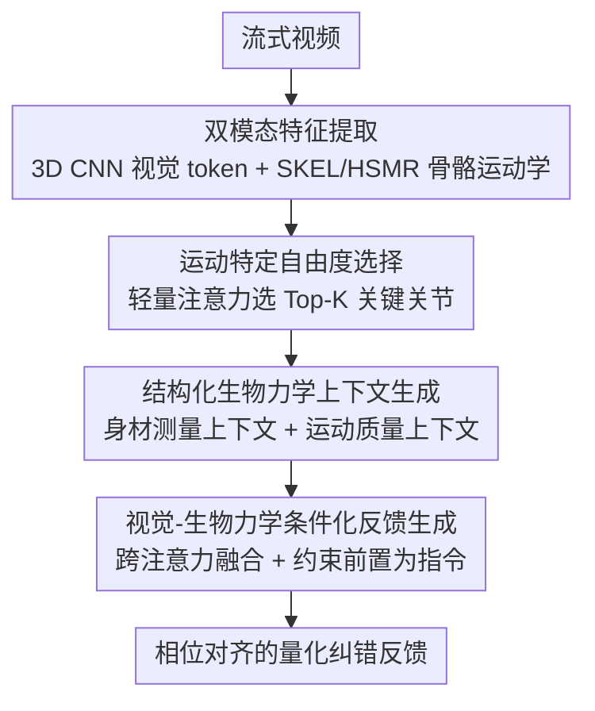

# From 3D Pose to Prose: Biomechanics-Grounded Vision-Language Coaching

**会议**: CVPR 2026  
**论文**: [CVF Open Access](https://openaccess.thecvf.com/content/CVPR2026/html/Ji_From_3D_Pose_to_Prose_Biomechanics-Grounded_Vision-Language_Coaching_CVPR_2026_paper.html)  
**代码**: 无（仅有项目页）  
**领域**: 多模态VLM  
**关键词**: 健身教练, 流式视频, 3D骨骼运动学, 生物力学约束, 跨注意力融合  

## 一句话总结
BioCoach 把流式健身视频里的 3D 骨骼运动学和身材测量做成显式、可读的中间表示，喂给冻结的视觉/语言主干，通过"选关节 → 算周期与约束 → 视觉-生物力学条件化生成"三段流水线，产出带关节角度、活动范围、相位对齐的精准纠错反馈，在新构建的 QEVD-bio-fit-coach 上 METEOR 比 Stream-VLM 提升 262.8%。

## 研究背景与动机
**领域现状**：在线/居家健身指导越来越受关注，最新做法是用流式视觉语言模型（VLM）边看视频边给反馈，比如 Stream-VLM 用 `<next>`/`<feedback>` 动作 token 实现异步、不需提示的实时点评。

**现有痛点**：这些方法本质上只在像素级特征上运作。它们 (1) 大多靠提示驱动，难以自主发现"该纠正的时刻"；(2) 没有个体身材信息，无法做个性化；(3) 不整合任何符号化的生物力学约束。结果就是反馈泛泛而谈、时机不准——如图 1 里只会说"看起来不错""注意手臂幅度"，而不会说"肩屈到 160°–170°、肘弯小于 15°"。

**核心矛盾**：教练式纠错本质需要对 3D 姿态、关节角度、活动范围、运动相位做推理，但纯像素 VLM 把身材几何和动作质量混在一起学，既给不出可核验的量化证据，也无法解释"为什么这个动作错了"。它做的是模式匹配，而不是有据可查的生物力学推理。

**本文目标**：让语言模型能够基于显式的运动学证据，生成时机准确、可解释、且适配个人身材的健身反馈，同时保持端到端可训练。

**切入角度**：作者的核心洞察是构造**显式、可读的中间表示**，把运动学属性"暴露"给语言模型，而不是把视觉外观和 3D 姿态当成两条互不相干的流、或纯靠模式学习。

**核心 idea**：用"骨骼运动学 + 生物力学约束检查"生成结构化文本上下文，作为显式指令注入 LLM，把反馈从"模式匹配"换成"有据可查的相位感知推理"。

## 方法详解

### 整体框架
BioCoach 要解决的是：从一段流式健身视频，实时输出精准、可解释、个性化的纠错反馈。它先从视频里抽两条互补模态——视觉外观（捕捉外观与上下文）和 3D 骨骼运动学（捕捉骨架姿态与体型），然后把它们送进一条三段流水线：先用视觉特征**选出当前动作相关的关键关节**，再在这些关节上**做周期检测、参考对齐和约束检查**生成结构化的生物力学上下文，最后**用跨注意力把视觉和身材上下文融合、把运动质量上下文当指令前置**喂给 LLaMA-2-7B 生成反馈。训练时冻结视觉 3D CNN 和 LLM 主干，只更新跨注意力融合层和关节选择网络，参数高效且保住预训练语言先验。

整体框架先从视频输入 $V \in \mathbb{R}^{T \times H \times W \times 3}$ 抽两条模态。视觉侧沿用 Stream-VLM 的预训练 3D CNN：在每个时刻 $t$ 处理一个时间窗 $V_{[t-\tau:t]}$，输出 $F_t^{vis} \in \mathbb{R}^{N_v \times d}$ 个运动感知视觉 token；2D 卷积抓帧内空间外观、3D 卷积抓窗口内时序动态，且所有卷积都用**因果掩码**保证真正的流式设定（只用过去和当前帧、不偷看未来）。运动学侧用基于 SKEL 的 HSMR 逐帧估计姿态，用 46 维欧拉角表示骨骼姿态 $q_i \in \mathbb{R}^{46}$（带关节特定的生物力学约束），并对窗口内逐帧体型系数做平均池化得到稳定体型 $\bar{\beta} \in \mathbb{R}^{10}$。于是 $t$ 时刻运动学输出为 $P_t^{skel} = (\{q_i\}_{i=1}^{\tau}, \bar{\beta})$。这里的关键是：和把体型与动作混在一起的外观特征不同，骨骼运动学给出归一化、生物力学感知的表示，**把体型和动作质量解耦开**。

### 关键设计

**1. 运动特定自由度选择：让分析聚焦到当前动作真正相关的关节**

不同动作关心的关节完全不同——深蹲看髋/膝/踝，俯卧撑看肩/肘/腕。如果对所有关节一视同仁，无关运动学就会稀释信号。这个模块用视觉特征 $F_t^{vis}$ 经一个轻量注意力网络 $A_\theta$（3 层 MLP，ReLU + sigmoid）输出每个关节的重要性分数 $s^t = A_\theta(F_t^{vis})$，$s_j^t \in [0,1]$ 表示关节 $j$ 的生物力学相关性，再取 Top-K（实现里 $K=12$）得到关键关节集 $\mathcal{J}^* = \{j : s_j^t \in \text{TopK}(s^t, K)\}$。一个关节在 46 维欧拉角里对应多个自由度（如肩部有屈伸/外展内收/内外旋 3 个 DoF），当某关节被选中，它所有 DoF 会**自动一并纳入**下游分析，保证关节级推理的一致性。$\mathcal{J}^*$ 在整次会话里固定不变，模仿人类教练对相关身体区域保持稳定注意力。它的有效性在于：把后续昂贵的周期/约束分析限制在解剖学显著区域，过滤掉无关运动学（消融里去掉它 LLM-Bio-Acc 掉 3.7%）。

**2. 结构化生物力学上下文生成：把原始运动学翻译成可核验的"该说什么 + 对谁说"**

这是整套方法的核心驱动，由两个子模块组成。**个体身材测量上下文**解决"对谁说"：SMPL 的体型系数 $\bar{\beta}$ 太抽象、语言模型读不懂，于是用 Virtual Measurements 从拟合的 SMPL 网格直接抽出可解释的人体测量量（质量、身高、胸围、腰围、臀围；围度用平面相交、长度用解剖标志点间欧氏距离），格式化成人类可读描述 $C_{morph}$，如"身高 1.78 m、质量 73.22 kg、胸 1.00 m……"，把体型锚定到对动作评估有语义的物理量上。**运动质量上下文**解决"该说什么"，分三步：(a) **周期检测**——对代表关节的角度轨迹做高斯平滑后用基于显著度的峰谷检测找周期边界 $(i_s, i_e)$，并按 $[\tau_{min}, \tau_{max}]=[0.8, 5]$s 过滤伪检测，交替动作（开合跳）用零交叉检测、静态保持（平板支撑）用低方差区间 $\text{Var}(\{q_{j,i}\}) < \epsilon$ 识别；(b) **参考对齐**——把每个周期线性插值重采样到精选的参考轨迹长度（公式 5），再用余弦相似度、Pearson 相关、速度一致性、活动范围幅度对比四项算出周期质量分 $s_{cycle} \in [0,1]$；(c) **生物力学约束评估**——把关节分静态/动态两类，静态关节测稳定性 $\delta_j^{static} = \text{Var}(\{q_{j,i}\})$，动态关节测关键帧（如深蹲最低点）相对参考的偏离 $\delta_j^{dynamic} = |q_j^{user}(i_{key}) - q_j^{ref}(i_{key})|$，并用动作特定可接受区间 $[l_j, u_j]$ 判违规：

$$\text{violation}_j = \begin{cases} 1, & \delta_j < l_j \text{ 或 } \delta_j > u_j \\ 0, & \text{otherwise} \end{cases}$$

最终模块产出两段文本拼成运动质量上下文 $C_{motion} = [p_{state}^{(i)}; v_{violations}]$：姿态状态 $p_{state}$ 记录所选关节角度（如"右膝 85°、左膝 88°、髋 75°"），违规向量 $v_{violations}$ 量化偏差（如"右膝屈不足：检出 85°、需 90°"）。这一步把隐式视觉启发式换成可核验证据，是整篇方法最关键的部分。

**3. 视觉-生物力学条件化反馈生成：把视觉证据和符号约束一起喂给 LLM**

有了两段上下文，还要让 LLM 既看得见画面、又遵守约束。两段上下文先经 LLM 嵌入层编码成 token：$m_t = \text{Embed}(C_{morph})$、$c_t = \text{Embed}(C_{motion})$。然后做**视觉-身材跨注意力**：以视觉特征为 query、身材 token 为 key/value，残差融合得到 $z_t = F_t^{vis} + \text{CrossAttn}(F_t^{vis}, m_t, m_t)$，其中

$$\text{CrossAttn}(F_t^{vis}, m_t, m_t) = \text{Softmax}\!\left(\frac{F_t^{vis} W_Q (m_t W_K)^\top}{\sqrt{d}}\right)(m_t W_V)$$

把视觉观察对齐到个人身材几何。运动质量上下文则**作为结构化指令前置**到提示词 $\text{Prompt} = [\text{Embed}(C_{motion}), \text{language\_tokens}]$，直接用显式约束引导生成，最后 $\text{Feedback}_t = \text{LLM}(\text{Prompt}, \{z_t\})$。这样做的好处是：把生物力学约束直接注入提示而非只靠学到的模式，保证反馈扎根在显式、动作特定的生物力学原则上，而非外观级启发式。

### 损失函数 / 训练策略
参数高效微调，冻结 3D CNN 和 LLaMA-2-7B，只更新跨注意力融合层和 DoF 选择网络 $A_\theta$。**DoF 选择**用平衡二元交叉熵 $\mathcal{L}_{DoF} = -\sum_j [y_j \log s_j^t + (1-y_j)\log(1-s_j^t)]$，标签 $y_j$ 来自领域专家 + LLM 辅助标注的动作特定关节相关性。**跨注意力融合**用自回归交叉熵 $\mathcal{L}_{CE} = -\sum_t w_{x_{t+1}} \log P(x_{t+1}\mid x_{\le t})$，并对延续 token（`<next>` 动作 token）降权 $w = \alpha = 0.1$、对反馈内容保持 $w=1$——这个**选择性降权**防止模型无限推迟反馈、鼓励及时触发。优化用 AdamW（lr $2\times10^{-5}$，batch 8），时间窗 $\tau=12$ 帧（3 秒），静态关节方差阈值 < 5°、动态关节关键帧容差 ±5°~±10°。

数据上作者在 QEVD-fit-coach（149 训练 / 74 测试视频、23 个动作、约 2484 条带时间戳反馈）基础上重标注出 QEVD-bio-fit-coach：把口语化反馈系统改写成解剖学精确语言（"再低一点"→"底部把肘屈增到 90°"），并补简短生物力学理由（"增大髋/膝屈以分散负荷"）。**所有反馈的时间边界严格保持原样、只改内容**，从而隔离出"显式生物力学术语"本身的效果。

## 实验关键数据

### 主实验
在新构建的 QEVD-bio-fit-coach 上，与同样在该标注上微调过的最强流式基线 Stream-VLM 对比（括号为相对提升）：

| 指标 | Stream-VLM | BioCoach | 提升 |
|------|-----------|----------|------|
| METEOR ↑ | 0.086 | 0.312 | +262.8% |
| ROUGE-L ↑ | 0.108 | 0.302 | +179.6% |
| BERTScore ↑ | 0.852 | 0.877 | +2.9% |
| LLM-Acc. ↑ | 1.86 | 3.12 | +67.7% |
| LLM-Bio-Acc. ↑ | 1.72 | 3.26 | +89.5% |
| T-F-Score ↑ | 0.530 | 0.544 | +2.6% |

其中 LLM-Bio-Acc. 是作者新提的、用 LLaMA-3-70B-Instruct 当裁判、专评生物力学正确性与具体度（关节名/侧、角度、活动范围、相位感知）的 1–5 分指标。在原始 QEVD-fit-coach（用原始非生物力学标注重训 BioCoach、官方协议）上，BioCoach 仍超过最强微调基线：

| 方法 | METEOR | ROUGE-L | BERTScore | LLM-Acc. | T-F-Score |
|------|--------|---------|-----------|----------|-----------|
| Stream-VLM | 0.127 | 0.112 | 0.863 | 2.45 | 0.56 |
| BioCoach | 0.129 (+1.6%) | 0.122 (+8.9%) | 0.864 | 2.56 (+4.5%) | 0.544 (-2.9%) |

这一组说明：架构本身在无生物力学标注时也有增益（向后兼容旧数据集），而加上生物力学监督才解锁全部潜力。

### 消融实验
在 QEVD-bio-fit-coach 上逐个移除组件（保持其余不变）：

| 变体 | METEOR | LLM-Bio-Acc. | T-F-Score | 说明 |
|------|--------|--------------|-----------|------|
| Full Model（τ=3s） | 0.312 | 3.26 | 0.544 | 完整模型 |
| w/o DoF 选择 | 0.305 | 3.14 | 0.543 | 去掉关节选择，小幅下降 |
| w/o 运动质量上下文 | 0.133 | 2.04 | 0.544 | 去掉后崩塌，核心驱动 |
| w/o 身材测量上下文 | 0.284 | 3.07 | 0.535 | 个性化掉点，中等影响 |
| 窗口 τ=2s | 0.311 | 3.22 | 0.416 | 文本质量持平、时机崩 |

### 关键发现
- **运动质量上下文是核心驱动**：去掉它 METEOR 暴跌约 57%（0.312→0.133）、LLM-Bio-Acc 从 3.26 掉到 2.04，几乎退回基线水平——量化约束分析才是"该说什么"的来源。
- **三模块明确分工**：运动质量供给"说什么"、身材测量供给"对谁说"、DoF 选择供给"看哪里"。身材上下文去掉是中等退化（−9% METEOR、−6% LLM-Bio-Acc，提升具体度），DoF 选择是温和增益（−3.7% LLM-Bio-Acc，过滤无关运动学）。
- **3 秒窗口对时机至关重要**：缩到 2s 文本质量几乎不变，但 T-F-Score 掉约 24%（0.544→0.416），说明 3s 给周期检测提供更稳的依据；时机和文本质量是相对解耦的两件事。

## 亮点与洞察
- **把运动学"翻译成散文之前先翻译成结构化文本"**：核心巧思是不让 LLM 直接消化 46 维欧拉角或 SMPL 系数（它读不懂），而是先用周期检测/约束评估算出"右膝 85°、需 90°"这种人类可读的违规描述，再当指令前置——可解释性和可训练性两头都保住了。
- **用文本 token 当符号接口连接感知与语言**：身材测量、姿态状态、约束违规全部走 LLM 自己的嵌入层变成普通 token，不需要额外的对齐模块，是个可迁移到其他"几何/物理量 → 语言"任务（如康复、运动捕捉点评）的轻量做法。
- **动作 token 选择性降权治"拖延症"**：对 `<next>` 延续 token 降权 α=0.1 这个小 trick，直接解决了流式反馈模型"一直观察不开口"的问题，可复用到任何需要及时触发的流式生成。
- **个性化靠身材测量而非用户画像**：把 SMPL 网格量成胸/腰/臀围这种物理量来做个性化，绕开了需要用户历史数据的冷启动问题。

## 局限性 / 可改进方向
- 作者承认强依赖 3D 骨架和体型估计质量——遮挡、宽松衣物、极端视角都会扭曲运动学；也依赖精选参考轨迹，可能漏掉动作变体和自适应形态。
- ⚠️ 自己发现：参考对齐和约束区间 $[l_j, u_j]$、静态/动态关节分类都靠"领域专家或 LLM 辅助标注"，这套先验的构建成本和跨动作泛化能力没有量化分析；新增一个动作可能需要重新标注参考与约束。
- 评测的"生物力学正确性"很大程度由作者自建的 LLM-Bio-Acc 裁判给出，且参考标注本身是把口语反馈 LLM 改写来的，可能存在裁判与训练目标同源带来的乐观偏差，缺人类专家评估佐证。
- 作者展望：扩到动力学推理（从视频估计关节反作用力、肌肉激活），结合肌骨仿真做"负荷感知"教练，识别纯角度分析看不见的代偿性动作。

## 相关工作与启发
- **vs Stream-VLM（最强基线）**：两者都用 3D CNN + LLaMA-2 + `<next>`/`<feedback>` token 做异步流式反馈，但 Stream-VLM 只在像素特征上运作、缺显式生物力学约束；BioCoach 多引入一条 3D 骨骼运动学模态并把它结构化成可核验证据，在生物力学标注上 METEOR/LLM-Bio-Acc 大幅领先，代价是时机略低（T-F-Score 0.544 vs 0.56）。
- **vs 传统健身/动作质量评估（AQA）系统**：它们大多只输出分数或模板、分析单帧而非完整周期、且忽略个体形态；BioCoach 做完整周期分析 + 身材个性化 + 自然语言纠错，输出的是可操作的指导而非一个分数。
- **vs 运动-语言模型（把连续运动离散成 token 对齐文本）**：那类工作面向运动生成/检索的单一生成接口，BioCoach 则把运动学当成"证据"注入语言生成，目标是细粒度纠错而非运动合成。

## 评分
- 新颖性: ⭐⭐⭐⭐ 把符号化生物力学约束做成可读中间表示注入 VLM，在健身教练任务上是清晰有说服力的新组合，但单个组件（骨骼估计、跨注意力、LLM-as-judge）多为已有技术拼装。
- 实验充分度: ⭐⭐⭐⭐ 双 benchmark + 完整消融 + 窗口分析，组件贡献层次清晰；但缺人类专家评估，且新指标与新数据集均自建、存在同源偏差。
- 写作质量: ⭐⭐⭐⭐ 三段流水线和"看哪里/说什么/对谁说"的分工叙述清楚，公式与图配合好，少数实现细节推到补充材料。
- 价值: ⭐⭐⭐⭐ 居家健身/康复/损伤预防场景实用，"几何量→结构化文本→语言"的可解释接口范式对其他物理推理任务有迁移价值。

<!-- RELATED:START -->

## 相关论文

- [\[CVPR 2026\] Grounded 3D-Aware Spatial Vision-Language Modeling](grounded_3d-aware_spatial_vision-language_modeling.md)
- [\[CVPR 2026\] G$^2$VLM: Geometry Grounded Vision Language Model with Unified 3D Reconstruction and Spatial Reasoning](g2vlm_geometry_grounded_vision_language_model_with_unified_3d_reconstruction_and.md)
- [\[CVPR 2026\] Think with 3D: Geometric Imagination Grounded Spatial Reasoning from Limited Views](think_with_3d_geometric_imagination_grounded_spatial_reasoning_from_limited_view.md)
- [\[CVPR 2026\] Beyond 3D VQAs: Injecting 3D Spatial Priors into Vision-Language Models for Enhanced Geometric Reasoning](beyond_3d_vqas_injecting_3d_spatial_priors_into_vision-language_models_for_enhan.md)
- [\[CVPR 2026\] Abstract 3D Perception for Spatial Intelligence in Vision-Language Models](abstract_3d_perception_for_spatial_intelligence_in_vision-language_models.md)

<!-- RELATED:END -->
