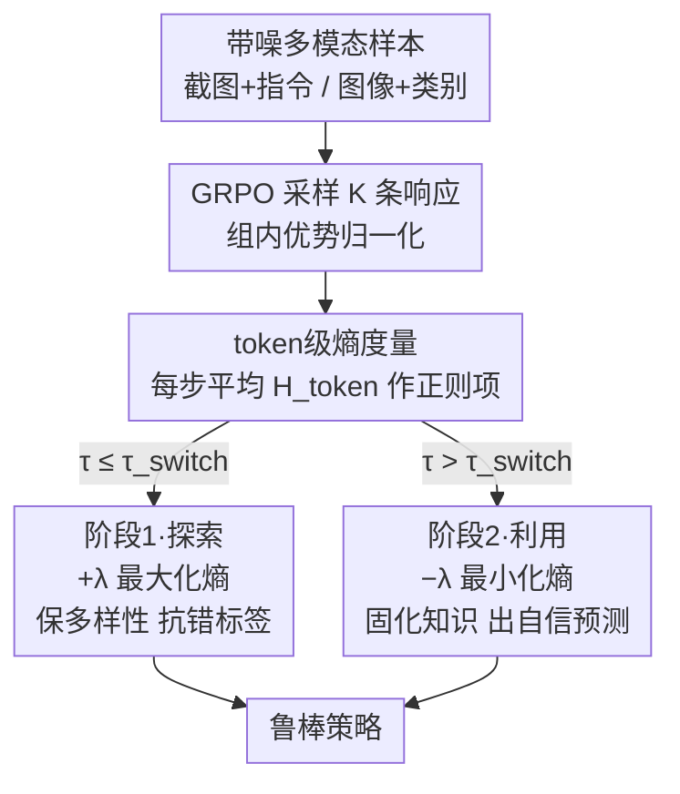

# From Exploration to Exploitation: A Two-Stage Entropy RLVR Approach for Noise-Tolerant MLLM Training

**会议**: CVPR 2026  
**论文**: [CVF Open Access](https://openaccess.thecvf.com/content/CVPR2026/html/Xu_From_Exploration_to_Exploitation_A_Two-Stage_Entropy_RLVR_Approach_for_CVPR_2026_paper.html)  
**代码**: 待确认（论文未公开仓库链接）  
**领域**: 多模态VLM / 对齐RLHF  
**关键词**: RLVR, GRPO, token级熵, 噪声标签, 探索-利用  

## 一句话总结
针对多模态大模型在 RLVR（可验证奖励强化学习）中标注噪声严重的问题，本文提出一个**两阶段 token 级熵调度**方法：训练前期最大化熵以探索、抵抗对错标签的过拟合并为 GRPO 保住组内多样性，后期最小化熵以利用、固化知识形成自信预测；在 GUI grounding、细粒度分类、开放词表检测三任务和多种噪声比例下都比单一熵方向更鲁棒。

## 研究背景与动机

**领域现状**：RLVR（Reinforcement Learning with Verifiable Rewards）凭借规则化、可验证的奖励（如答案精确匹配、IoU 验证）绕开了"学一个奖励模型"的偏置问题，在数学推理、代码生成上展现出强于 SFT 的泛化。其代表算法 GRPO 通过**组内优势归一化**降低方差，已被推广到图像分类、目标定位、GUI grounding 等多模态任务。

**现有痛点**：RLVR 的可验证奖励高度依赖**干净标注**，而真实多模态数据普遍带有标注噪声。一旦奖励来自错标签，模型会过拟合到错误目标。现有应对方法分三类，各有硬伤：① **外部信号类**（编译器、LLM-as-Judge、TTRL 多数投票打伪标签）受限于打标 LLM 的能力，伪标签噪声直接给最终性能设了上限；② **内部信号类**（随机奖励、格式奖励等 spurious reward）不依赖标签但与任务目标对不齐，效果有限；③ **熵类方法**（EMPO、one-shot RL）用熵做信号，但都只取"熵最小化"或"熵最大化"中的**单一方向**。

**核心矛盾**：熵的方向被静态固定就会出问题。**纯熵最小化**让模型过早自信地收敛——在噪声下会自信地锁死到错误答案，而且压低了输出多样性，这恰恰是 GRPO 组内归一化估计优势所必需的（一组 rollout 全一样，优势全为零，没有学习信号）；**纯熵最大化**虽保住了多样性、抵抗噪声，却因为概率质量永远不被鼓励集中而**难以收敛**。探索（多样性）和利用（确定性）之间存在 trade-off，单一方向无法兼得。

**本文目标**：在带噪监督下，既要前期保住多样性以抵抗错标签、给 GRPO 提供有效优势估计，又要后期能收敛固化为自信策略。

**切入角度**：作者发现熵在学习中本就有"探索 vs 利用"两副面孔（RL 文献鼓励高熵探索、半监督分类鼓励低熵固化决策边界），既然两者各管一段，那就**不要静态选一个方向，而是按训练进度调度切换**。

**核心 idea**：把 token 级熵正则项的系数做成**随训练步分段变号**——前期 `+λ` 最大化熵（探索），过了切换点后翻成 `−λ` 最小化熵（利用），用一条"探索→利用"的轨迹平滑地从抵抗噪声过渡到固化知识。

## 方法详解

### 整体框架

方法在标准 GRPO 训练之上叠加一个 token 级熵正则项，总损失为 $L_{total} = L_{GRPO} + \lambda(\tau)\, L_{entropy}$，唯一的"机关"是系数 $\lambda(\tau)$ 随训练步 $\tau$ 分段变号。输入是带噪标注的多模态样本（截图+指令、图像+类别等），GRPO 照常对每个输入采样 $K$ 条响应、用可验证奖励算组内优势；与此同时，每步都计算这 $K$ 条响应的平均 token 级熵作为正则项。训练被切换点 $\tau_{switch}$ 一分为二：**阶段 1（探索）** 用正系数最大化熵，鼓励多样采样、抵抗对错标签的过拟合、并维持 GRPO 所需的组内多样性；**阶段 2（利用）** 把系数翻成负，最小化熵，逼模型输出自信、固化前期探索到的高奖励行为。输出是一个对标签噪声更鲁棒、且能稳定收敛的策略。

### 关键设计

**1. Token 级熵作为细粒度不确定度量与正则项**

直接拿"整段序列的熵"做信号太粗：它只反映输出整体不确定性，无法刻画每一步生成的可预测性。本文改用 **token 级熵**，对每个生成步 $t$，模型在词表 $V$ 上给出条件分布 $\pi_\theta(v\mid x, y_{<t})$，逐 token 熵为

$$H_t(x,y) = -\sum_{v\in V}\pi_\theta(v\mid x,y_{<t})\log \pi_\theta(v\mid x,y_{<t}).$$

把一条响应所有 $T$ 个 token 的熵求平均得到序列的 token 级熵 $H_{token}(x,y)=\frac{1}{T}\sum_{t=1}^{T}H_t(x,y)$，再对每个输入采样的 $K$ 条响应求平均，得到熵损失 $L_{entropy}=-\mathbb{E}_{x}\big[\frac{1}{K}\sum_{i=1}^{K}H_{token}(x,y_i)\big]$。这个量是后面调度的唯一抓手：放在总损失里、系数取正就是在"提高熵"（鼓励分布平摊、多样），取负就是在"降低熵"（鼓励分布尖锐、自信）。之所以选 token 级而非序列级，是因为推理轨迹（`<think>...</think>`）的多样性是逐步累积出来的，逐 token 度量能更敏感地控制"在哪一步该探索、该收敛"。

**2. 两阶段熵调度（先 Max 后 Min 的分段变号系数）**

这是全文核心，直接针对"单一熵方向都会崩"的矛盾。把熵正则系数写成随训练步 $\tau$ 的分段函数：

$$\lambda(\tau)=\begin{cases}\lambda_{max}, & \tau\le \tau_{switch}\ \text{(阶段1：探索)}\\ -\lambda_{min}, & \text{否则 (阶段2：利用)}\end{cases}$$

其中 $\lambda_{max},\lambda_{min}>0$。阶段 1 正系数让总目标变成"GRPO + 熵最大化"的变体，逼模型采出多样的推理路径——这样即便奖励来自错标签，一组 rollout 里也更可能有至少一条命中真值，从而稀释误导性奖励；阶段 2 把系数翻成 $-\lambda_{min}$，目标变成"GRPO + 熵最小化"，引导模型把前期探索到的高奖励行为收敛成确定、自信的输出。作者特别论证了**顺序不能反**：先 Min 会过早收敛、把模型钉死在初始噪声奖励上并扼杀 GRPO 后续发现更优轨迹所需的多样性（消融里 "Min. then Max." 在 100% 噪声下比 "Max. then Min." 低 5.6%）；只有"先放后收"才能既抗噪又收敛。

**3. 与 GRPO 组内优势归一化的协同（为什么探索能抗噪）**

为什么"保住多样性"对带噪 RLVR 这么关键？因为 GRPO 的优势是**组内归一化**的：$A_i=\frac{r_i-\text{mean}(r_{1:K})}{\text{std}(r_{1:K})}$。如果一组 $K$ 条响应被熵最小化逼得几乎一模一样，奖励方差趋零、归一化优势全为零，这一组就**没有任何学习信号**。前期熵最大化恰好喂给 GRPO 它需要的组内差异，让优势估计有信息量；同时作者观察到 GRPO 本身已有一定抗噪性——当模型先验能力让一组 rollout 一致地答出真正正确答案、却撞上一个错标签时，整组同得零奖励、归一化优势为零，这个"自门控"效应天然过滤掉了部分噪声。两阶段熵调度正是架在这个鲁棒基线之上：先用最大化把多样性这口"活水"保住喂给 GRPO，再用最小化把探索成果固化下来。

### 损失函数 / 训练策略

总损失 $L_{total}=L_{GRPO}+\lambda(\tau)L_{entropy}$，其中 $L_{GRPO}$ 用带 clip 的代理目标约束新旧策略偏移。关键超参是切换点 $\tau_{switch}$（消融发现取总步数的 80%、即 1000 步中的第 800 步最佳）与两个熵系数 $\lambda_{max},\lambda_{min}$。训练框架：Qwen-VL 系列在 GUI grounding 用 UI-R1、细粒度分类用 Visual-RFT；InternVL 用 verl-internvl。

## 实验关键数据

### 主实验

Qwen2.5-VL-3B 在 GUI grounding（ScreenSpot）和细粒度分类（Pets37 4-shot）上，对比 Base、标准 GRPO、GRPO+熵最小化（Min.）、GRPO+熵最大化（Max.）与本文两阶段（Two.）。GUI grounding 准确率（%）：

| 噪声比例 | Base | GRPO | GRPO w. Min. | GRPO w. Max. | **GRPO w. Two.** |
|--------|------|------|------|------|------|
| 100% | 70.6 | 71.0 | 73.2 | 73.6 | **75.8** |
| 50% | 70.6 | 76.2 | 77.4 | 77.8 | **80.2** |
| 0% | 70.6 | 82.2 | 79.0 | 83.0 | **83.6** |

两阶段在 50% 噪声下达 80.2%，仅比"干净标签训练的 GRPO"低 2%，抗噪能力显著；在 100% 噪声下比标准 GRPO 绝对涨 4.8%，相比 base 模型在不同噪声下涨 5.2%~13.0%。一个有意思的现象：熵最小化在 100% 噪声时最好（细粒度分类 59.3%），熵最大化在 0% 噪声时最好（69.8%），而两阶段在两端之间取得**整体最鲁棒**的平衡。

跨骨干验证（ScreenSpot，标准 GRPO vs 两阶段，准确率 %）：

| 噪声 | Qwen2-VL-7B GRPO | 7B Two. | Qwen2.5-VL-3B GRPO | 3B Two. | InternVL-3.5-2B GRPO | 2B Two. |
|------|------|------|------|------|------|------|
| 50% | 61.2 | **69.8** (+8.6) | 76.2 | **80.2** (+4.0) | 56.8 | **59.2** |
| 0% | 75.4 | **78.0** | 82.2 | **83.6** | 66.8 | **69.8** |

较大骨干获益更明显（Qwen2-VL-7B 在 50% 噪声涨 8.6%），暗示方法有可扩展性；但 Qwen2-VL-2B 出现相反趋势（在高噪声下两阶段反而略低于 GRPO），说明小模型上探索带来的收益不稳定 ⚠️。

### 消融实验

切换点 $\tau_{switch}$ 与"两阶段顺序"的消融（Qwen2.5-VL-3B，GUI grounding，准确率 %）：

| 配置 | 100% 噪声 | 50% 噪声 | 0% 噪声 | 说明 |
|------|------|------|------|------|
| Max. then Min.（本文） | **75.8** | **80.2** | **83.6** | 先探索后利用 |
| Min. then Max. | 70.2 | 76.8 | 79.8 | 顺序反了，过早收敛 |
| LF. Max. LT. Min. | 73.6 | 78.0 | 79.0 | 只对噪声子集探索 |
| LT. Max. LF. Min. | 73.2 | 76.8 | 83.0 | 只对干净子集探索，100% 噪声崩 |
| 切换点 Step 800 | 75.8 | 80.2 | 83.6 | 占总步数 80%，最佳 |
| 切换点 Step 500/700/900 | 73.6/75.0/73.6 | 79.6/79.8/79.0 | 80.4/81.8/82.0 | 对切换点总体不敏感 |

### 关键发现
- **顺序比"用不用熵"更重要**："Max. then Min." 全面优于 "Min. then Max."（100% 噪声领先 5.6%）。先最小化会过早把策略钉死在初始噪声奖励上、扼杀 GRPO 后续探索所需的多样性；先最大化才能保住"活水"再固化。
- **按子集分配熵方向不如统一调度**：把熵最大化限制在"已知噪声子集"（LF. Max.）会限制整体探索，且现实中根本不知道哪条标签是干净/噪声的，统一的时间调度更可落地。"LT. Max. LF. Min." 在 50%/0% 噪声还行（半数/全部数据可靠），但 100% 噪声下没有干净标签可供利用，直接崩。
- **熵动力学验证设计**：100% 噪声下阶段 1（0–800 步）token 级熵稳步升到初值约 400%（有效探索），切到阶段 2（800–1000 步）后熵快速降到峰值约 20% 并稳定，平滑相变是噪声下稳定性的关键。
- **泛化性**：在开放词表检测（COCO OVOD，mAP@0.5）下，Qwen2-VL-2B 在 50% 噪声从 GRPO 的 15.94 提到 19.47（+3.53）；OOD 评测（ScreenSpot-Pro / OS-World-G / MMBench-GUI L2）上两阶段在 0% 与 50% 噪声整体最优（如 MMBench-GUI L2 干净 60.6%、50% 噪声 57.4%）。
- **GRPO 自带抗噪基线**：组内优势归一化使"一组全对却撞上错标签"时整组优势为零、不产生学习信号，这个自门控让标准 GRPO 在 50% 噪声仍有 76.2%（仅低于干净上限 6%），两阶段熵调度是架在这个基线之上的增益。

## 亮点与洞察
- **一行损失改动撬动鲁棒性**：核心改动只是把熵正则系数写成分段变号的 $\lambda(\tau)$，不动 GRPO 主体、不需额外模型/工具，极易嫁接到现有 RLVR 框架——这是最"便宜"又最实用的设计。
- **把"探索 vs 利用"具象成熵的方向调度**：作者抓住熵在 RL（鼓励高熵探索）和半监督（鼓励低熵固化边界）里截然相反的角色，指出"既然各管一段，就按训练进度切换"，这个视角很 clean。
- **抗噪的真正机制是保住 GRPO 的多样性**：洞察到熵最小化会让组内 rollout 同质化、使归一化优势归零这一连锁反应，把"为什么前期要探索"讲透了，可迁移到任何依赖组内/对比信号的 RL 方法。
- **可迁移**：任何基于"组采样 + 相对优势"的 RLVR（数学推理、代码生成）在标签不可靠时都可套用这套"先放后收"的熵调度，而非固定一个熵方向。

## 局限与展望
- **小模型上不稳**：Qwen2-VL-2B 在高噪声下两阶段反而略逊 GRPO，说明探索带来的收益依赖模型先验能力，方法对小骨干并不总成立 ⚠️。
- **切换点是硬调度**：$\lambda(\tau)$ 用的是分段常数 + 固定切换步（虽对切换点不太敏感），并非根据熵动力学自适应触发；不同任务/预算下最优切换点可能需要重调。
- **噪声是模拟生成的**：GUI grounding 的噪声靠"随机生成不重叠 bbox"、分类靠"随机替换标签"模拟，与真实标注噪声（系统性偏差、近似正确）分布可能不同，鲁棒性结论需谨慎外推。
- **改进方向**：把硬切换换成根据 token 级熵实时反馈的自适应调度，或对干净/噪声样本做软加权（但作者指出实际不知标签真假，这本身是难点）。

## 相关工作与启发
- **vs EMPO / one-shot RL（熵最小化类）**：他们用纯熵最小化去"利用"基模型先验，本文指出这在噪声下会自信地锁死错误答案并扼杀 GRPO 多样性；本文保留最小化但只放在后期。
- **vs CLIP-Cov（熵最大化/防坍缩类）**：他们持续防止熵坍缩以促探索，本文认同前期需要探索，但指出纯最大化永不收敛，必须后期翻向最小化。
- **vs TTRL / LLM-as-Judge（外部信号类）**：他们靠外部模型打伪标签，伪标签质量给性能设上限；本文不依赖外部打标，直接在带噪标签上靠熵调度抗噪。
- **vs 随机/格式奖励（内部信号类 spurious reward）**：他们的内部奖励与任务目标对不齐、效果有限；本文仍用可验证奖励，只是用熵调度让 GRPO 在噪声下更稳。

## 评分
- 新颖性: ⭐⭐⭐⭐ 把熵的探索/利用双重角色做成两阶段调度，视角清晰但属"已有要素的巧妙组合"，非全新机制。
- 实验充分度: ⭐⭐⭐⭐⭐ 覆盖多骨干、多噪声比例、三任务，含 OVOD/OOD/噪声 scaling/切换点/顺序等丰富消融。
- 写作质量: ⭐⭐⭐⭐ 动机与机制讲得透，公式清晰；部分结论（小模型反例）只在表中体现、正文展开略浅。
- 价值: ⭐⭐⭐⭐ 一行损失改动即可提升带噪 RLVR 鲁棒性，落地成本极低、可迁移性强。

<!-- RELATED:START -->

## 相关论文

- [\[CVPR 2025\] A Two-Stage Progressive Pre-training using Multi-Modal Contrastive Masked Autoencoders](../../CVPR2025/multimodal_vlm/multi-modal_contrastive_masked_autoencoders_a_two-stage_progressive_pre-training.md)
- [\[CVPR 2026\] VisionLeaf: Entropy-Guided Leaf-First Reasoning for Efficient and Accurate Think-with-Image](visionleaf_entropy-guided_leaf-first_reasoning_for_efficient_and_accurate_think-.md)
- [\[CVPR 2026\] Noise-Aware Few-Shot Learning through Bi-directional Multi-View Prompt Alignment](noise-aware_few-shot_learning_through_bi-directional_multi-view_prompt_alignment.md)
- [\[CVPR 2026\] DUET-VLM: Dual Stage Unified Efficient Token Reduction for VLM Training and Inference](duet-vlm_dual_stage_unified_efficient_token_reduction_for_vlm_training_and_infer.md)
- [\[CVPR 2026\] Generate, Analyze, and Refine: Training-Free Sound Source Localization via MLLM Meta-Reasoning](generate_analyze_and_refine_training-free_sound_source_localization_via_mllm_met.md)

<!-- RELATED:END -->
