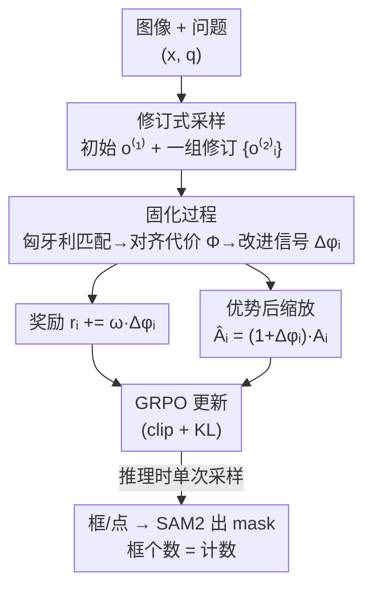

# From Failure to Feedback: Group Revision Unlocks Hard Cases in Object-Level Grounding

**会议**: CVPR 2026  
**论文**: [CVF Open Access](https://openaccess.thecvf.com/content/CVPR2026/html/Liu_From_Failure_to_Feedback_Group_Revision_Unlocks_Hard_Cases_in_CVPR_2026_paper.html)  
**代码**: https://github.com/yyliu01/GroupRevision  
**领域**: 多模态VLM  
**关键词**: 物体级 grounding、GRPO、强化微调、reward shaping、修订采样

## 一句话总结
针对 GRPO 微调视觉语言模型时「难样本一组全失败、奖励全为零、学不到东西」的痛点，本文提出 **group-revision** 范式：先采一个初始回答，再让模型对它做一组「修订」回答，并用匈牙利匹配算出每个修订相对初始的改进量（shaping signal），同时用它来加权奖励和放大优势，从而在分割、REC、计数等任务上稳定超过现有 GRPO 方法。

## 研究背景与动机
**领域现状**：把大型视觉语言模型（LVLM）用强化微调（RFT）做物体级 grounding 已经成为主流，代表是 GRPO——对一张图+问题，策略采一组候选回答（一般 $n=8$），每个按是否正确定位目标打奖励（如 box IoU > 0.5 才算成功），再把策略往高奖励方向更新。它避开了 SFT 监督过强导致基础能力退化、CoT 被削弱的问题，且无 critic、对显存友好。

**现有痛点**：GRPO 的奖励是「response-level」且常常是「criterion-induced」的稀疏奖励——只看最终输出对不对。在困难场景（指代相似实例、细粒度空间关系）下，一组 8 个回答可能**全部失败**，于是这一组的奖励全为零、优势全为零，策略从这条样本拿不到任何梯度，这些难样本**永远学不会**。论文 Fig.1 给的例子里，GRPO 一组最好的 box IoU 只有 14.72%。

**核心矛盾**：自然的解法是借鉴语言推理里的 Process Reward Model（PRM），给中间步骤打分。但物体 grounding 里这条路走不通——CoT 里的每一句中间推理很难可靠地对齐到图里某个具体物体上去拿反馈，于是陷入「先有蛋还是先有鸡」：模型需要更准的中间引导才能拿到有效奖励，而这些奖励又是学会推理的前提。

**切入角度**：作者的观察是——**一次失败不一定是终点，而是线索**。虽然拿不到显式的 step-wise 反馈，失败的回答往往暴露出模型「漏看了什么」。如果把一个失败回答配上一句「重新想想框对不对」的修订提示，再采一组修订回答，模型常常能重新解读场景、把原本得不到奖励的难样本「救」回到成功阈值之上（Fig.1 里 IoU 从 14.72% 修订到 74.57%）。

**核心 idea**：不再「采一组回答去答题」，而是「采一组回答去**修订**前一个失败回答」，并引入一个 **consolidation（固化）过程**，用 reward shaping 的思想把「修订相对初始的改进量」量化成稠密信号，既细化奖励、又放大优势，让模型不只是「重试」，而是学会「为什么这次比上次好」。

## 方法详解

### 整体框架
方法建在 Qwen2.5VL-7B + SAM2 之上，核心是把标准 GRPO 的「一次采样 → 算奖励 → 更新」改成**三段式**：**采样阶段**先采一个初始回答 $o^{(1)}$，再以它为条件采一组 $G$ 个修订回答 $\{o^{(2)}_i\}$；**固化阶段**用匈牙利匹配把初始回答和每个修订回答都对齐到 ground truth，算出一个「对齐代价」势函数 $\Phi$，再求修订相对初始的改进比例 $\Delta\phi_i$；**优化阶段**把 $\Delta\phi_i$ 一方面加进奖励 $r_i$，另一方面用 $(1+\Delta\phi_i)$ 后乘到 GRPO 优势 $A_i$ 上，最后照常做带 clip 和 KL 的 GRPO 更新。推理时则退回普通单次采样：采一个回答，解析出框和点，框/点喂给 SAM2 出 mask，预测框的个数直接当计数结果。

### 关键设计

**1. 修订式采样（Group Revision）：把「一组回答去答题」换成「一组回答去改错」**

这一步直接针对「难样本一组全失败、零奖励、学不到」的痛点。先从行为策略采一个初始回答 $o^{(1)} = (t^{(1)}, \hat{b}^{(1)}, \hat{p}^{(1)}) \sim \pi_{\theta_{old}}(\cdot \mid x, q)$，其中 $t$ 是推理文本、$\hat{b}$/$\hat{p}$ 是预测框和点。然后用一个固定模板把原问题改写成对话式的修订查询 $q^{(2)} = U(q, o^{(1)})$——模板里塞进上一轮的推理 $t^{(1)}$ 和空间线索 $(\hat{b}^{(1)}, \hat{p}^{(1)})$，并明确指令「重新判断之前的框/点是否匹配目标：若是则保留，若否则丢弃重答」。基于它再采一组修订回答：

$$o^{(2)}_i \sim \pi_{\theta_{old}}\!\left(\cdot \mid x, q^{(2)}, o^{(1)}\right), \quad i = 1, \dots, G$$

每个修订回答都是一个「替代假设」，能去消解模糊指代。关键区别在于：GRPO 的一组是相互独立的并列答案，而这里的一组是**围着同一个失败回答协同改错**——即便初始失败，只要有候选改对了，这条样本就重新跨过成功阈值、重新对训练有贡献。（若初始回答 $o^{(1)}$ 格式非法，就直接退回普通 GRPO 流程。）

**2. 固化过程：把「改了多少」量化成可学习的 shaping 信号**

光有更好的修订还不够——这些修订是**独立于初始失败**被评估的，策略拿不到「到底改对了什么」的 credit assignment，等于每个结果都被当成孤立事件，错过了「学会哪种改进真正有用」的机会。固化过程就是来补这个连接的。作者借 potential-based reward shaping 的思路，定义一个势函数 $\Phi$ 给每个回答（的 shaping 集合）打一个标量「对齐代价」。先对预测物体 $\{(\hat{b}^{(r)}_m, \hat{p}^{(r)}_m)\}$ 和 ground truth $\{(b_n, p_n)\}$ 做匈牙利匹配得到匹配集 $A^{(r)}_i$（若预测数少于真值数，补 dummy 预测、每个记单位代价，惩罚漏检），对齐代价取匹配对代价的平均：

$$\Phi\!\left(s^{(r)}_{shape,i}\right) := \frac{1}{|A^{(r)}_i|} \sum_{(m,n)\in A^{(r)}_i} e^{(r)}_{m,n}$$

每对的代价同时考虑框 IoU、框 L1、点 L1 三项（L1 按图像尺度归一化）：

$$e^{(r)}_{m,n} = \frac{1}{3}\!\left[\left(1 - \text{IoU}(\hat{b}^{(r)}_m, b_n)\right) + f^{L1}(\hat{b}^{(r)}_m, b_n) + f^{L1}(\hat{p}^{(r)}_m, p_n)\right]$$

代价越低 grounding 越准。改进信号定义为修订相对初始的**相对**代价下降：

$$\Delta\phi_i = \max\!\left(0,\ \frac{\Phi(s^{(1)}_{shape}) - \Phi(s^{(2)}_{shape,i})}{\Phi(s^{(1)}_{shape})}\right)$$

取 $\max(0,\cdot)$ 保证只奖励真正变好的修订、不引入负信号；分母 $\Phi(s^{(1)}_{shape})$ 是**逐样本的参考尺度**，让 $\Delta\phi_i$ 衡量「相对初始表现的改进幅度」，且当初始已经很接近真值（$\Phi(s^{(1)})\approx 0$、改进空间有限）时这个归一化能防止信号消失。这就是论文反复强调的、把一次次改进「内化（internalise）」成学习信号的核心机制。

**3. 奖励细化 + 优势后缩放：让「改进大」的候选在训练里说话更响**

$\Delta\phi_i$ 算出来后被**两处**使用，作者特意强调二者目的不同。第一处加进奖励，决定组内偏好与排序：

$$r_i = R_{format}(o^{(2)}_i) + R_{acc}(o^{(2)}_i, y) + \omega\,\Delta\phi_i$$

其中 $R_{format}$ 查输出是否符合 `<think>...</think><answer>...</answer>` 结构、$R_{acc}$ 查 grounding 精度，$\omega$ 控制 shaping 权重（实验里 $\omega=5$ 最优）。第二处用在优势上：先按 GRPO 在同一组 $G$ 个候选内算 z-score 优势 $A_i = (r_i - \mu)/\sigma$，再后乘改进信号放大梯度：

$$\hat{A}_i = (1 + \Delta\phi_i)\,A_i$$

作者点明：奖励 $r_i$ 决定 GRPO 里的**偏好和排序**，而优势后缩放只**调梯度幅度**、放大改进大的候选的影响，不改变目标函数的符号和形式。最终优化目标就是把 $\hat{A}_i$ 代回标准 GRPO 的 clip + KL 目标 $J_{GRPO}(\theta)$，重要性比 $\ell_i(\theta) = \pi_\theta(o^{(2)}_i\mid x,q^{(2)})/\pi_{\theta_{old}}(o^{(2)}_i\mid x,q^{(2)})$ 配 $\epsilon$ clip 防过大步长，KL 项把策略往参考策略 $\pi_{ref}$ 拉、强度由 $\beta$ 控。

### 一个例子：找「用来学习/作为文学媒介的物品」
问题问「图里那个可以用来学习、或作为文学媒介的物品在哪」。初始回答 $o^{(1)}$ 把人手里那本书框出来（$\hat{b}^{(1)}=[464,316,644,609]$），对齐代价 $\Phi(s^{(1)})=0.92$。接着采 4 个修订：候选 1 微调框（改进很小，$\Delta\phi_1\approx 0$）；候选 2 收紧框得到 $\Delta\phi_2=0.14$；候选 3、4 意识到「问的是这一类物品、画面里其实有多本书」，于是输出多个框（如 $[463,321,589,453]$ 和 $[513,526,644,606]$），改进最大 $\Delta\phi_4=0.78$。于是奖励侧 $r_4 \mathrel{+}= \omega\times0.78$、$r_2 \mathrel{+}= \omega\times0.14$；优势侧 $\hat{A}_4 = A_3\times 1.78$、$\hat{A}_2 = A_2\times 1.14$——改进越大的修订梯度被放得越大，模型据此学会「这题该框多本书」。⚠️ Fig.2 里的具体数值以原文为准。

## 实验关键数据

### 主实验
建在 Qwen2.5VL-7B 上，VeRL + vLLM 框架训练，lr=1e-6、GRPO 组大小 8、batch 64。单物体设置用 RefCOCOg（9000 对），多物体设置用 VisionReasoner7K（约 7000 样本）。分割用 gIoU/cIoU、REC 用 Acc@0.5、计数用准确率。

分割与计数（Tab.1，对比 GRPO 系 SOTA）：

| 任务/数据集 | 指标 | 本文 | 之前 SOTA | 提升 |
|------|------|------|----------|------|
| ReasonSeg (test) 推理分割 | gIoU | 61.11（single） | Seg-R1 56.7 | +4.4（vs Seg-R1 test +7.78） |
| RefCOCO/+/g 指代分割 平均 | cIoU | 74.26（single） | Seg-Zero 72.6 | +1.66 |
| 计数 平均（Pixmo+CountBench） | Acc | 79.97（multi） | VisionReasoner 75.7 | +4.27（+5.64% vs VR） |
| REC 平均 Acc@0.5 | Acc@0.5 | 85.80（multi） | VisionReasoner 84.8 | +1.0 |

REC（Tab.2）上多物体版在 ReasonG（box 由 ReasonSeg 转换）尤其强：val 83.67 / test 81.20，明显超 VisionReasoner（80.1/78.5）。作者解释 RefCOCO+ (testB) 略低于 VisionReasoner 是因为后者输出大量多余框、虚高 Acc@0.5（但分割质量更差）。VQA（Tab.3）零样本上也小幅普涨（SeedBenchV2+ +0.55、ChartQA、OCRBench 等都微升），说明物体级 RL 反过来对图像级理解有正迁移。

### 消融实验
逐组件消融（Tab.4，节选 single-object）：

| 配置 | ReasonSeg(val) | RefCOCOg-REC(val) | Pixmo 计数(val, multi) | 说明 |
|------|---------|------|------|------|
| baseline（纯 GRPO） | 62.54 | 85.92 | 70.84 | 直接采答 |
| w/ revision | 64.97 | 86.79 | 73.20 | 加修订采样，恢复学习信号 |
| w/ consolidation | 66.99 | 87.64 | 75.89 | 再加固化，放大高奖励候选 |

### 关键发现
- **两个组件都有用、且 consolidation 增益更大**：修订采样把 ReasonSeg(val) 62.54→64.97，固化再推到 66.99；计数任务效果最明显（70.84→73.20→75.89），说明「修订引入多样假设、固化放大其中真正有用的」这条链路成立。
- **shaping 权重 $\omega$ 有甜点**（Tab.5）：$\omega=3/5/7$ 中 $\omega=5$ 在多数指标最优（ReasonSeg(val) 64.36 / 66.99 / 65.84），太大太小都不如。
- **框和点信号缺一不可**（Tab.6）：去掉 box shaping，ReasonSeg(val) 66.99→65.32；去掉 point shaping 66.99→65.90，REC 上去 box 掉得更狠（87.64→86.04）。
- **优势后缩放确实有效**（Fig.3）：开启 post-scaling 在分割和计数各指标上均优于关闭，验证 $\hat{A}_i=(1+\Delta\phi_i)A_i$ 这步对样本效率的贡献。

## 亮点与洞察
- **「失败→修订→量化改进」这条思路很巧**：它绕开了「把 CoT 每句对齐到具体物体」这个几乎做不动的难题，改用「改进量」这个可直接由匈牙利匹配+IoU/L1 算出的稠密信号，等价于给 GRPO 注入了一个可计算的 process reward，但不需要真的去标中间步骤。
- **奖励和优势分两处用同一个 $\Delta\phi_i$**：一处管「排序偏好」、一处管「梯度幅度」，作者把这两件事的职责讲得很清楚——这是个可复用的 RFT trick，凡是「想强调组内某些样本但又不想改目标函数符号」的场景都能借鉴。
- **相对归一化 $\Delta\phi_i$ 的分母设计**：用初始回答自身代价当 per-sample 参考尺度，既让不同难度样本可比，又顺手解决了「初始已经很好时 shaping 信号消失」的边界问题，细节考虑到位。

## 局限与展望
- 方法把训练采样成本至少翻倍（先采初始、再采一组修订），论文未充分讨论训练开销/吞吐的代价。⚠️ 具体 GPU 时间以 Supp. 为准。
- 修订质量依赖那句固定的「重新判断框对不对」提示模板，模板对不同任务/语言的鲁棒性、是否需要任务定制，文中没有展开。
- 改进信号完全建立在「有 ground truth 框/点」上（匈牙利匹配要对齐真值），因此天然限定在有精确标注的 grounding 任务，难直接迁移到无框监督的开放场景。
- 若初始回答其实已经接近最优，修订组带来的增益空间有限（这也是 $\Delta\phi_i$ 归一化要专门处理的情形），方法的收益更多体现在「难样本」上。

## 相关工作与启发
- **vs GRPO / Seg-Zero / VisionReasoner**：它们都是「采一组并列答案直接答题」，难样本一组全失败就零信号；本文把初始回答当成「中间步骤」、再采一组去协同修订它，从而在全失败的难样本上也能恢复梯度，这是本质区别。
- **vs Process Reward Model (PRM)**：PRM 给语言推理的每一步打分，但要把 step-wise 信号对齐到图像物体几乎不可行；本文不去解这个对齐难题，而是只借 reward shaping 的「稠密反馈」核心思想，用「修订相对初始的改进」充当稠密信号。
- **vs SFT「embedding-as-mask」系（LISA/PixelLM 等）**：SFT 监督强但易过拟合监督域、削弱基础能力与 CoT；本文走 RFT 路线、靠任务奖励+KL 正则保留原能力，并在此之上专攻难样本。

## 评分
- 新颖性: ⭐⭐⭐⭐⭐ 「修订采样 + 改进量当 shaping 信号」是对 GRPO 稀疏奖励难题的一个干净且有想象力的解法。
- 实验充分度: ⭐⭐⭐⭐ 覆盖分割/REC/计数/VQA 多任务、组件消融与超参扫描齐全，但训练开销分析偏弱。
- 写作质量: ⭐⭐⭐⭐⭐ 动机讲得透（chicken-and-egg、失败即线索），公式与图示对应清晰。
- 价值: ⭐⭐⭐⭐ 对物体级 grounding 的 RFT 训练直接有用，shaping/优势缩放 trick 可迁移到其他 GRPO 任务。

<!-- RELATED:START -->

## 相关论文

- [\[CVPR 2026\] Visual Grounding for Object Questions](visual_grounding_for_object_questions.md)
- [\[CVPR 2026\] Small Object, Great Challenge: A Benchmark for Small Object Visual Grounding](small_object_great_challenge_a_benchmark_for_small_object_visual_grounding.md)
- [\[ICML 2026\] Learning GUI Grounding with Spatial Reasoning from Visual Feedback](../../ICML2026/multimodal_vlm/learning_gui_grounding_with_spatial_reasoning_from_visual_feedback.md)
- [\[CVPR 2026\] Enhancing Part-Level Point Grounding for Any Open-Source MLLMs](enhancing_part-level_point_grounding_for_any_open-source_mllms.md)
- [\[CVPR 2026\] Training High-Level Schedulers with Execution-Feedback Reinforcement Learning for Long-Horizon GUI Automation](training_high-level_schedulers_with_execution-feedback_reinforcement_learning_fo.md)

<!-- RELATED:END -->
