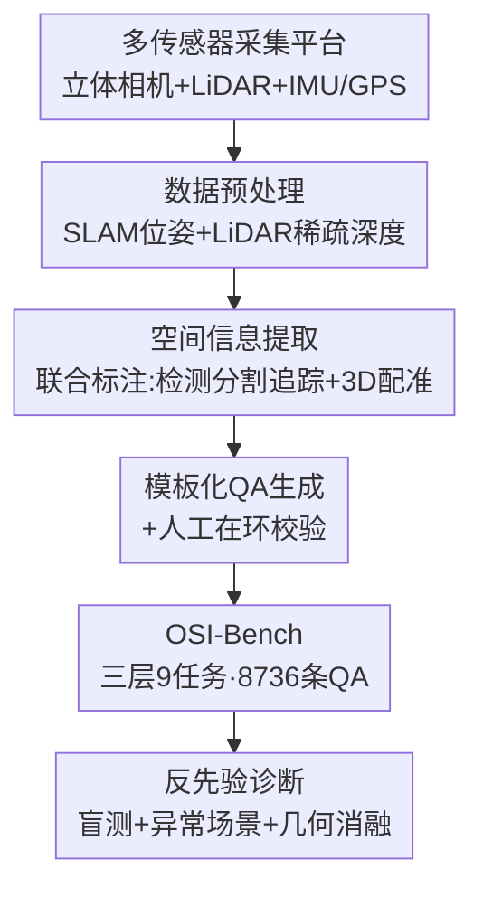

# From Indoor to Open World: Revealing the Spatial Reasoning Gap in MLLMs

**会议**: CVPR 2026  
**论文**: [CVF Open Access](https://openaccess.thecvf.com/content/CVPR2026/html/Wu_From_Indoor_to_Open_World_Revealing_the_Spatial_Reasoning_Gap_CVPR_2026_paper.html)  
**代码**: https://mingrui-wu.github.io/osi-bench/ （项目页，benchmark 待开源）  
**领域**: 多模态VLM  
**关键词**: 空间智能基准, MLLM, 度量推理, 开放世界, 语言先验诊断  

## 一句话总结
作者用立体相机+LiDAR+IMU/GPS 采集行人视角户外视频，构建了首个三层（关系/度量/运动）、户外、带精确度量真值的空间智能基准 OSI-Bench（8736 条 QA），并通过盲测、异常场景、几何信息消融三组诊断实验证明：当前 MLLM 在室内基准上的"空间智能"主要靠语言先验撑着，一到开放世界就原形毕露、动态推理几乎全军覆没。

## 研究背景与动机
**领域现状**：MLLM 在语义任务（VQA、caption）上已很强，业界开始把它们往"空间智能"方向推——希望模型能像人一样理解距离、方向、尺寸、运动，这是自动驾驶、具身智能这类需要"物理落地"的系统的基础能力。为了量化这种能力，出现了一批空间推理基准（VSI-Bench、STI-Bench、All-Angles-Bench 等）。

**现有痛点**：这些基准几乎都困在两个坑里。一是**只测定性关系推理**（左/右、前/后），回避了真正难的度量（绝对距离、尺寸）和运动（速度、位移）估计；二是**数据局限于室内**——因为室内有现成的 3D mesh（ScanNet 等）能提供真值，而户外缺少带可验证度量真值的数据集。少数尝试户外的工作（SpatialRGPT）只能用单目深度估计当伪真值，存在尺度歧义、监督不可靠的问题。

**核心矛盾**：更要命的是，多数 MLLM 本身就是在室内/网络图片上预训练的，**模型可能根本没在"看图"，而是在背室内场景的统计规律**。一个标准浴室里浴缸和马桶大概隔 1 米——这种先验让模型不看图也能蒙对室内题，于是室内基准的高分掩盖了真实的视觉感知缺陷。这就引出一个尖锐问题：当前模型真的把空间知识泛化到开放世界了吗？

**本文目标**：造一个能"照妖"的基准，要同时满足：①覆盖关系→度量→运动三层完整谱系；②户外、大尺度、非结构化布局；③有度量级精确真值；④能定量诊断模型到底靠不靠视觉。

**切入角度**：既然室内 mesh 真值是户外基准的拦路虎，那就**自己扛着多传感器套件（立体相机+LiDAR+IMU/GPS）去户外采集**，用传感器融合拿到度量级精确的 3D 信息，再自动生成可验证的 QA。

**核心 idea**：用"多传感器度量真值 + 三层任务谱系 + 反先验诊断实验"造一个开放世界空间智能基准 OSI-Bench，把 MLLM"假空间智能"的底裤扒下来。

## 方法详解
本文是 benchmark/分析型论文，"方法"=如何把原始多传感器数据变成一个能诊断 MLLM 真实空间能力的高质量基准，外加一套揭示失败根因的诊断实验设计。

### 整体框架
OSI-Bench 的构建是一条"采集→提取→生成→诊断"的流水线。先用挂在手推车上的多传感器平台在 200+ 户外场地采集约 20 小时行人视角数据，拿到时间戳同步的立体视频、LiDAR 点云、IMU/GPS；再走三阶段自动管线把原始数据炼成结构化时空信息，并模板化生成 QA、人工把关；最后在这套基准上评测 31 个开/闭源 MLLM，并设计三组诊断实验（盲测/异常场景/几何消融）反推失败根因。整套任务被组织成"关系→度量→运动"递进的三层谱系，共 9 个子任务、8736 条 QA。

### 关键设计

**1. 三层空间智能谱系：把"空间智能"拆成可诊断的递进难度**

针对"现有基准只测定性关系、回避度量与运动"这个痛点，作者把空间智能形式化成难度递增的三层层级，让基准能精准定位模型在哪一层崩。第一层 **Relational Reasoning（关系推理）**：定性理解空间布局，含相对距离、相对方向、定性自运动（相机整体怎么动），用多选题（MCA）评测；第二层 **Metric Reasoning（度量推理）**：把视觉感知锚到绝对尺度上，含物体定位（某物离相机几米）、绝对距离、深度感知计数（10 米内有几个锥桶），需要数值答案；第三层 **Kinematic Reasoning（运动推理）**：最难，要在时间上保持时空一致性来追踪实体并算动态量，含绝对位移、绝对速度、定量自运动（相机全程走了多少米）。九个任务跨三层均衡分布，每个任务约 1000 条 QA。这个层级化设计的价值在于：它不是给一个笼统分数，而是能分别暴露"关系直觉缺失""度量感知缺失""运动理解缺失"三种不同性质的缺陷。

**2. 多传感器度量级真值采集：用硬件扛掉户外"没有真值"的拦路虎**

针对"户外缺可验证度量真值、只能用单目深度伪真值"这个根本痛点，作者不复用现成数据集，而是自建采集平台：立体 RGB 相机 + 32 线 LiDAR + IMU/GPS，全部时间戳同步，挂在手推车上由步行操作员推着走，保证平滑运动和**严格行人视角（非车载路面视角）**。这点很关键——行人视角的开放世界场景在现有 MLLM 评测里几乎没有，且非结构化布局正好能挑战语言先验。采集横跨大学校园、公园、广场、历史遗迹等 200+ 场地，原始数据达 TB 级，经标定、LiDAR 投影生成稀疏深度图、人工质检后留下约 20 小时高质量数据。立体视觉给尺度、LiDAR 给精确深度、IMU/GPS 给自运动——三者融合才让"绝对距离/速度"这类度量真值可信，从源头解决了单目伪真值的尺度歧义问题。

**3. 三阶段自动化 QA 构造管线：从原始流到结构化时空画像再到题目**

针对"如何从海量多模态原始数据规模化产出带精确答案的题目"，作者设计三阶段管线。**Stage 1 数据预处理**：把数据按时间戳切成短视频片段、对齐各流，用 ORB-SLAM3 从立体图+IMU 估计每帧**度量尺度相机位姿**，把标定后的 LiDAR 点云投影到像平面生成**稀疏深度图**，再按固定间隔采关键帧并捆绑位姿与深度，产出"带元数据的关键帧"。**Stage 2 空间信息提取**：用联合标注模块串起多个专家模型——本地 MLLM 先识别物体并生成文字描述，引导检测分割模型出像素级 mask，再用点追踪模型（如 CoTracker）做时序追踪保证运动一致性，每个物体的 3D 点云从深度图重建并用相机位姿配准到**世界坐标系**，于是每个物体得到一份"详细 caption + 连续 3D 轨迹"的结构化时空画像。**Stage 3 QA 生成与校验**：先给每个被问物体分配**唯一数字 ID 并作为视觉标签贴在视频里全程跟随**（解决"多盏一模一样的路灯"这种开放世界指代歧义），所有度量量（距离、速度）直接从物体时空坐标算出，再模板化生成 QA，最后经"MLLM 辅助 + 人工在环"精修。从校验池里每任务采约 1000 条，最终得 8736 条高质量 QA。

**4. 反先验诊断实验：用三把手术刀证明"模型在背先验不是在看图"**

光给排行榜不够，作者要回答"模型失败的根因是不是依赖语言先验"。为此设计三组对照诊断。**盲测（Blinding Test）**：移除视觉输入、只留文字题，看模型掉多少分——如果掉得少，说明它本来就没用视觉。**异常场景（Synthetic Abnormal Scenes）**：合成两套室内场景，Normal 套用常规物体比例，Abnormal 套故意篡改物体尺度但保持布局不变，对比模型在两套上的绝对距离/尺寸估计——如果在异常套上崩，说明它在套"门通常多宽、植物盆多大"这种类别级先验。**几何信息渐进消融**：聚焦绝对距离任务，其真值由 $d = \|(R \cdot p_2 + T) - p_1\|$ 计算（$p_1, p_2$ 是两物体各自相机坐标系下的 3D 位置，$R, T$ 是 $t_1 \to t_2$ 的相机相对旋转平移）。这个公式把任务拆成"推断物体位置 $p_1, p_2$"和"推断相机自运动 $R, T$"两块感知子问题，然后逐步把真值喂给模型，看到底卡在哪一步。三把刀合起来精确定位：模型缺的是从视觉里提取度量信息的能力，不是算术能力。

### 损失函数 / 训练策略
本文是评测基准，不训练模型。评测协议统一用 VLMEvalKit；MCA 任务报标准 Accuracy（随机基线 25.0），NA（数值）任务报 Mean Relative Accuracy（MRA，按多个相对误差阈值平均的连续准确率，对数值估计更鲁棒）；人类性能在 270 题子集上评测，并让头部模型也在同一子集上跑以公平对比。

## 实验关键数据

### 主实验（OSI-Bench 模型排行，节选）
全部 31 个模型都远低于人类水平。Rank Avg. 为综合排名分；三层分别报关系（MCA）、静态度量（NA）、动态度量（NA）。

| 模型 | Rank Avg. | 相对方向 | 绝对距离 | 深度计数 | 绝对位移 | 绝对速度 |
|------|-----------|----------|----------|----------|----------|----------|
| **人类**（tiny 子集） | 60.3 | 83.3 | 43.9 | 39.2 | 67.5 | 42.9 |
| Gemini-2.5-Pro（闭源最强） | 37.2 | 28.1 | 37.4 | 28.1 | 37.9 | 26.8 |
| GPT-5 | 29.7 | 33.1 | 32.5 | 23.7 | 20.9 | 10.5 |
| GPT-4o | 25.9 | 29.1 | 22.9 | 27.0 | 21.6 | 17.5 |
| Qwen3VL-32B（开源最强） | 32.2 | 28.8 | 25.3 | 11.5 | 30.2 | 18.6 |
| InternVL3.5-38B | 26.9 | 34.0 | 11.6 | 7.7 | 42.7 | 20.3 |

关键读法：人类在**相对方向**上 83.3 碾压模型的 23–30，但在度量任务（绝对距离、深度计数）上人机差距反而缩小——说明对人"直觉"的关系布局对模型极难。动态量（位移/速度）所有模型集体崩塌。

### 诊断实验

**盲测：去掉视觉，模型几乎不掉分（Tab. 3，视觉开启相对关闭的增益）**

| 对象 | 平均增益 | 解读 |
|------|----------|------|
| 人类 | +22.6 | 强依赖视觉 |
| Gemini | +12.4 | 仅中等依赖 |
| GPT | +2.2 | 几乎不靠视觉 |
| Qwen3-VL | +5.3 | 几乎不靠视觉 |
| InternVL3.5 | +6.3 | 几乎不靠视觉 |

人类开视觉涨 22.6，模型只涨 2.2~6.3——基准明明高度依赖视觉，模型却靠文字先验答题。

**几何信息渐进消融（绝对距离任务，MRA，Tab. 4）**

| 设置 | Qwen3VL-32B | Gemini-2.5-Pro | 说明 |
|------|-------------|----------------|------|
| Vanilla | 17.5 | 19.2 | 原始，结构化多步反而更难 |
| + 两物体定位 $p_1,p_2$ | 33.8 | 40.0 | 给定位才有起色 |
| + 自运动 $R,T$ | 32.5 | 22.9 | 只给自运动帮助有限 |
| + 全部 $p_1,p_2,R,T$ | 98.8 | 98.8 | 给全几何量，近乎满分 |
| + 全部（不给公式） | 59.2 | 85.4 | 不给公式就掉，说明模型缺 3D 几何知识 |

这张表是全文最有力的证据：给齐几何量模型能算到 98.8，说明**瓶颈是从视觉里提取度量信息，不是算术**；不给公式就掉到 59.2/85.4，说明模型不具备独立推导距离关系的 3D 几何知识，只是个"可靠的计算器"。

### 关键发现
- **室内空间智能是海市蜃楼**：InternVL3.5-38B 在室内 VSI-Bench 上比 InternVL2-40B 暴涨 +24.1，但到 OSI-Bench 几乎不涨，绝对距离任务上新版甚至反不如旧版——证明这些模型是在过拟合室内统计规律，而非习得可泛化的空间智能。
- **动态推理是普遍盲区**：连静态度量上接近人类的 Gemini-2.5-Pro，一到位移/速度估计就崩，暴露 VLM 架构缺乏时空连续性表征这一根本缺陷。
- **尺寸估计最易被先验绑架**：异常场景里 Gemini 尺寸任务从 54.7 跌到 28.3（人类只微降），且距离任务也跟着掉——因为模型把"门通常多宽"当参考线索，视觉一反常识就全盘崩。
- **能力与规模/总分弱相关**：Qwen3VL-32B 是开源总分第一，却在相对方向排第 18、绝对距离排第 15；OVIS 家族擅长相对方向，InternVL3.5 家族在深度计数上全员 >40——存在明显的家族级任务特化。

## 亮点与洞察
- **"盲测 + 异常场景 + 几何消融"三连诊断**是本文最漂亮的设计：不止给排行榜，而是用对照实验把"模型靠语言先验不靠视觉"这个软性怀疑钉成硬证据，这套诊断范式可迁移到任何想验证"模型到底有没有用某模态"的评测里。
- **几何消融的公式分解**（把绝对距离拆成 $p_1,p_2,R,T$ 四个感知子量逐个补真值）非常巧妙——它把"模型为什么算不对距离"从黑箱变成可定位的归因：是定位差还是自运动差，一目了然，结论"瓶颈在视觉提取不在算术"因此极有说服力。
- **唯一数字 ID 视觉标签**解决开放世界指代歧义（多盏相同路灯）是个朴素但必要的工程 trick，凡是要在杂乱真实场景做指代式 QA 的基准都能复用。
- 最大的"啊哈"：室内基准涨分越多的新模型，到户外越可能是过拟合——这直接质疑了"刷空间 QA 数据=获得空间智能"的主流做法。

## 局限与展望
- **作者承认**：扩大视觉编码器或训练语料不足以解决问题，真正需要能"推断、存储、操纵 3D 几何量"的机制；度量深度感知是首要瓶颈，动态推理严重欠探索。
- **采集成本与规模**：手推车多传感器采集约 20 小时、200+ 场地，相比网络爬取数据规模有限，且行人视角虽新但未覆盖车载/室内交叉场景。⚠️ 论文未详述各任务难度是否完全可比，跨层分数不宜直接比大小。
- **诊断深度可扩展**：异常场景实验只在合成室内做、且主要测 Gemini 与人类，若能在更多模型+真实异常场景上复现，结论会更稳。
- **改进思路**：把显式几何表征（3D-aware 架构、多视图一致性、符号-神经混合推理）接进 MLLM，并引入能维持时间一致世界模型、利用传感器自运动的动态推理模块。

## 相关工作与启发
- **vs VSI-Bench**: 都用视频测空间，但 VSI-Bench 限室内、用现成 mesh 真值、主要测识别/语言推理；本文做户外行人视角、自采多传感器度量真值、并首次把三层（含动态运动）补齐，还专门用盲测证明 VSI-Bench 的高分有语言先验水分。
- **vs STI-Bench**: STI-Bench 引入了速度/位移这类动态量评测，但场景仍是室内&自动驾驶、复用现成数据集；本文是首个对三层全部提供度量可靠真值、且行人视角开放世界的基准。
- **vs SpatialRGPT-Bench**: 它尝试户外但用单目深度伪真值、存在尺度歧义；本文用立体+LiDAR+IMU 融合拿到真度量真值，监督更可信。
- **启发**：评测一个能力时，与其追求高难题目，不如设计能"反事实归因"的对照实验（去掉模态、篡改先验、渐进补真值），更能揭示模型到底在用什么解题。

## 评分
- 新颖性: ⭐⭐⭐⭐⭐ 首个三层全度量真值、户外行人视角的空间智能基准，加一套反先验诊断范式，立意和执行都新。
- 实验充分度: ⭐⭐⭐⭐⭐ 31 个开/闭源模型 + 人类基线 + 三组诊断消融，证据链完整有力。
- 写作质量: ⭐⭐⭐⭐⭐ 逻辑从"室内分数虚高"一路推到"瓶颈在视觉度量提取"，findings 清晰，图表说服力强。
- 价值: ⭐⭐⭐⭐⭐ 为"物理落地空间智能"提供了诊断平台，并实证否定了"刷室内空间数据=获得空间智能"，对领域方向有校正意义。

<!-- RELATED:START -->

## 相关论文

- [\[CVPR 2026\] EgoMind: Activating Spatial Cognition through Linguistic Reasoning in MLLMs](egomind_activating_spatial_cognition_through_linguistic_reasoning_in_mllms.md)
- [\[CVPR 2026\] CountGD++: Generalized Prompting for Open-World Counting](countgd_generalized_prompting_for_open-world_counting.md)
- [\[ACL 2026\] GeoArena: Evaluating Open-World Geographic Reasoning in Large Vision-Language Models](../../ACL2026/multimodal_vlm/geoarena_evaluating_open-world_geographic_reasoning_in_large_vision-language_mod.md)
- [\[CVPR 2026\] Eliciting Complex Spatial Reasoning in MLLMs through Wide-Baseline Matching](eliciting_complex_spatial_reasoning_in_mllms_through_wide-baseline_matching.md)
- [\[CVPR 2026\] GroundingME: Exposing the Visual Grounding Gap in MLLMs through Multi-Dimensional Evaluation](groundingme_exposing_the_visual_grounding_gap_in_mllms_through_multi-dimensional.md)

<!-- RELATED:END -->
