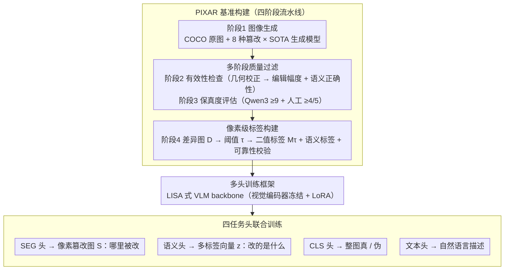

# From Masks to Pixels and Meaning: A New Taxonomy, Benchmark, and Metrics for VLM Image Tampering

**会议**: CVPR 2026  
**arXiv**: [2603.20193](https://arxiv.org/abs/2603.20193)  
**代码**: [https://github.com/VILA-Lab/PIXAR](https://github.com/VILA-Lab/PIXAR)  
**领域**: 多模态VLM  
**关键词**: 图像篡改检测, 像素级定位, VLM安全, 基准数据集, 语义分类

## 一句话总结

本文指出现有图像篡改检测基准依赖粗糙的mask标注与真实编辑信号严重不对齐,提出 PIXAR——一个包含 420K+ 图像对的像素级、语义感知篡改检测基准,配合新的训练框架和评估指标,在精确定位和语义理解方面大幅超越现有方法。

## 研究背景与动机

**领域现状**：随着生成式AI（如 Qwen-Image、Gemini、GPT-image 等）的快速发展，细粒度图像篡改已成为数字媒体真实性的严重威胁。现有篡改检测的主流做法是在mask标注的数据集上训练检测器，使用 IoU、F1 等指标评估定位性能。

**现有痛点**：现有基准数据集几乎全部依赖"对象mask"作为ground truth标注。然而，mask标注与真实的编辑信号存在严重错位：(1) mask内部大量像素实际上并未被修改或仅有微小扰动；(2) mask外部的编辑痕迹（如重新打光、颜色渗透、接缝平滑）被视为"真实"而被忽略。这导致检测器在训练时学习了错误的信号，在评估时产生虚高或虚低的分数。

**核心矛盾**：生成模型的编辑行为并非严格限制在预设mask区域内——mask只是编辑的"引导区域"而非"精确边界"。这意味着用mask做监督本质上是一种proxy supervision，与真实的像素级编辑轨迹之间存在系统性偏差。

**本文目标**：(1) 重新定义VLM图像篡改任务——从粗糙区域标签转向像素级、语义感知的任务；(2) 构建高质量、大规模的像素级篡改基准；(3) 设计能同时衡量定位精度和语义理解能力的训练框架与评估体系。

**切入角度**：作者通过计算原始图像和篡改图像之间的逐像素差异图（difference map），发现mask标注区域与真实变化区域之间存在大量不一致（false positive和false negative），由此论证mask-based标注的根本缺陷。

**核心 idea**：用像素差异图替代mask标注作为ground truth，通过可调阈值 $\tau$ 控制编辑灵敏度，实现从"mask到像素再到语义"的范式升级。

## 方法详解

### 整体框架

PIXAR 的核心主张是用**像素级差异图**取代 mask 作为篡改监督信号，整套系统据此分成「基准构建」和「训练框架」两大部分。**基准构建**是一条四阶段流水线：阶段 1 图像生成（COCO 原图 + 8 种篡改类型 × 多个 SOTA 生成模型）；阶段 2 篡改有效性检查（先做几何校正对齐，再查编辑幅度与语义正确性）；阶段 3 图像保真度评估（Qwen3 自动打分 ≥9 叠加人工审核 ≥4/5）；阶段 4 标签构建（逐像素差异图经阈值 $\tau$ 二值化得像素标签，叠加人工语义标签，再过像素-语义一致性与空间集中度两道可靠性校验）。**训练框架**则在 LISA 式 VLM backbone（视觉编码器冻结、LoRA 微调）上挂四个任务头联合训练，同时学篡改定位（像素级 BCE + Dice 损失）、语义分类（多标签 sigmoid 交叉熵）、全局真伪检测（二分类交叉熵）和自然语言描述（自回归语言建模损失）。

### 关键设计

**1. 像素级标签构建：用差异图取代 mask，让监督信号对齐真实编辑**

这一步直接针对全文的核心痛点——mask 只是生成模型的"引导区域"，与真正被改动的像素之间存在系统性偏差。PIXAR 干脆绕开 mask，给定原图 $I_{orig}$ 和篡改图 $I_{gen}$，逐像素算绝对差得到差异图 $\mathbf{D}(x,y) = |I_{orig}(x,y) - I_{gen}(x,y)|$，再用一个阈值 $\tau$ 把它二值化成监督标签：

$$\mathbf{M}_\tau(x,y) = \mathbb{I}\big(\mathbf{D}(x,y) > \tau\big)$$

阈值 $\tau$ 在这里扮演"编辑灵敏度旋钮"的角色：$\tau$ 取小，连重新打光、颜色渗透这类微弱痕迹都会被标为篡改，强调对微编辑的敏感；$\tau$ 取大，则只保留高置信度的强改动区域。由于标签直接来自像素比对，不再借助任何代理几何形状，mask 内部"没动的像素"和 mask 外部"被忽略的接缝痕迹"这两类系统性错标自然就消失了。

**2. 多阶段质量过滤流水线：用失败模式驱动的层层把关换取高保真数据**

生成模型造篡改图时常翻车——有时全局重绘把整张图都改了，有时只加了几乎看不见的扰动，有时改到了不该改的地方。这些失败模式如果混进数据集，差异图标签就会失真。PIXAR 因此串起一条按 failure mode 设计的过滤链：先做全局几何校正，用特征匹配 + RANSAC 估计单应矩阵，把生成图和原图严格对齐（差异图依赖像素对齐才有意义）；再做编辑幅度检查，滤掉改得太小或太大的样本；接着验证语义正确性，并用 VLM（Qwen3）自动打分（≥9 分）叠加人工审核（≥4/5 分）双重把关；最后还有像素-语义一致性检查（篡改像素与输入 mask 重叠率 ≥0.2）和空间集中度检验（剔除散布在背景的噪点标签），确保像素标签和语义标签讲的是同一处编辑。

**3. 多头训练框架：把"哪里改、改了什么、怎么描述"放进一个检测器同时学**

只输出篡改位置远不够用——一个真正有用的检测器还得说清编辑的类别和内容。PIXAR 在 LISA 式 VLM backbone（视觉编码器冻结、仅 LoRA 微调）上挂了四个头联合训练：SEG 头输出像素级篡改 logit 图 $\mathbf{S} \in \mathbb{R}^{H \times W}$ 回答"哪里被改"，语义头输出多标签向量 $\mathbf{z} \in \mathbb{R}^{|\mathcal{C}|}$ 回答"改的是什么类型"，全局 CLS 头判断"整图是否被篡改"，文本头则生成一句对篡改的自然语言描述。四类任务共享同一套视觉特征、用各自的损失联合优化，使定位精度、语义理解和可解释描述能力一起被训练出来。

### 损失函数 / 训练策略

总损失为五项加权和：$\mathcal{L}_{total} = \lambda_{sem}\mathcal{L}_{sem} + \lambda_{bce}\mathcal{L}_{bce} + \lambda_{dice}\mathcal{L}_{dice} + \lambda_{text}\mathcal{L}_{text} + \lambda_{cls}\mathcal{L}_{cls}$

- **语义损失** $\mathcal{L}_{sem}$：多标签sigmoid交叉熵，训练语义分类头
- **像素BCE损失** $\mathcal{L}_{bce}$：逐像素二元交叉熵，使用 $\mathbf{M}_\tau$ 做监督
- **Dice损失** $\mathcal{L}_{dice}$：提升空间定位精度，尤其改善边界质量
- **文本生成损失** $\mathcal{L}_{text}$：自回归语言建模损失，训练生成篡改描述
- **全局检测损失** $\mathcal{L}_{cls}$：二分类交叉熵，判断图像是否被篡改

默认 $\tau = 0.05$，$\lambda_{sem}=0.5$，$\lambda_{text}=3.0$，$\lambda_{dice}=1.0$。

## 实验关键数据

### 主实验

| 方法 | Backbone | Top-1 Acc | AUC | Recall | F1 | g-IoU | IoU |
|------|----------|-----------|-----|--------|------|-------|-----|
| LISA-7B | LISA-7B | 27.1 | 71.6 | 10.0 | 15.4 | 7.7 | 8.3 |
| SIDA-7B | LISA-7B | 27.1 | 71.9 | 15.0 | 21.1 | 10.7 | 11.8 |
| PIXAR-7B-Lite | LISA-7B | 28.2 | 75.0 | 26.4 | 26.1 | 14.3 | 15.0 |
| **PIXAR-7B** | LISA-7B | **36.2** | **77.0** | **29.8** | **30.6** | **16.1** | **18.1** |
| PIXAR-13B | LISA-13B | 37.4 | 76.0 | 33.6 | 32.3 | 17.8 | 19.3 |

### 消融实验

| 配置 | Top-1 Acc | IoU | 说明 |
|------|-----------|-----|------|
| $\tau_{train}=0.05$ (默认) | 36.2 | 18.1 | 最佳像素级精度 |
| $\tau_{train}=0.10$ | 35.2 | 12.6 | 阈值增大导致精细编辑信息丢失 |
| $\tau_{train}=0.20$ | 34.2 | 8.7 | 过高阈值退化为粗糙语义标注 |
| $\lambda_{dice}=0$ | 35.3 | 10.8 | 去掉Dice损失后IoU大幅下降 |
| $\lambda_{dice}=0.5$ | 36.0 | 15.8 | Dice损失对定位至关重要 |
| $\lambda_{dice}=1.0$ (默认) | 36.2 | 18.1 | 完整模型 |

### 关键发现

- 仅替换监督信号（像素标签替代mask标签），PIXAR-7B-Lite就显著超越SIDA-7B，IoU从6.9%提升到14.9%，Top-1 Acc从10.6%到29.5%
- 人类用户研究表明参与者在分类和定位篡改区域时表现很差（F1仅31.0%），证明数据集篡改图像的高真实感
- GPT-Image-1.5生成的图像最难检测（IoU仅11.7%），而Qwen生成的最易（IoU 26.3%），说明跨模型泛化仍是挑战

## 亮点与洞察

- **核心贡献在于重新定义问题**：用像素差异图替代mask标注是一个简洁但深刻的insight——现有检测器可能一直在学习错误的信号。这个发现本身就值得一篇论文
- **阈值 $\tau$ 的设计很巧妙**：它将"哪里被编辑"和"编辑强度多大"解耦，允许通过sweeping $\tau$ 来选择不同场景的最优操作点
- **多阶段过滤pipeline非常工程化**：从几何校正到VLM评分到人工审核，每一步都有明确的failure mode驱动，是高质量数据集构建的范例

## 局限与展望

- 训练数据主要由Qwen-Image生成，存在domain bias——在OOD模型（如GPT-Image-1.5）上性能明显下降
- 像素差异图假设原图和篡改图像素对齐，对于需要几何变换的编辑类型（如物体移动）可能不完全适用
- 当前基准只覆盖8种篡改类型，未来可扩展到视频篡改、3D场景编辑等更复杂场景
- 像素级标签的阈值 $\tau$ 选择本质上仍是人工设定，未来可探索自适应阈值策略

## 相关工作与启发

- **vs SID-Set**: SID-Set也做VLM篡改检测，但仍用mask标注，且图像保真度较低。PIXAR在标注精度和数据质量上全面超越
- **vs FakeShield**: FakeShield基于VLM做可解释检测，但在定位精度上远逊于PIXAR（IoU 9.3% vs 18.1%），说明训练信号质量的重要性
- 这篇工作的核心思路——"检查标注是否真正对齐任务目标"——可迁移到其他领域（如语义分割中的标注噪声问题）

## 评分

- 新颖性: ⭐⭐⭐⭐ 像素级重新定义篡改标注是有价值的insight，但技术方法本身相对直接
- 实验充分度: ⭐⭐⭐⭐⭐ 420K+图像对，6个SOTA生成模型，多维度消融，人类评估，非常完整
- 写作质量: ⭐⭐⭐⭐ 动机阐述清晰，但论文篇幅较长，部分内容可以更紧凑
- 价值: ⭐⭐⭐⭐⭐ 作为新基准和范式转变，对整个篡改检测领域有重要推动作用

<!-- RELATED:START -->

## 相关论文

- [\[CVPR 2026\] Empowering Semantic-Sensitive Underwater Image Enhancement with VLM](empowering_semanticsensitive_underwater_image_enha.md)
- [\[CVPR 2026\] Taxonomy-Aware Representation Alignment for Hierarchical Visual Recognition with Large Multimodal Models](taxonomy-aware_representation_alignment_for_hierarchical_visual_recognition_with.md)
- [\[ICML 2026\] Benchmarking and Enhancing VLM for Compressed Image Understanding](../../ICML2026/multimodal_vlm/benchmarking_and_enhancing_vlm_for_compressed_image_understanding.md)
- [\[ICML 2025\] Toward Robust Hyper-Detailed Image Captioning: A Multiagent Approach and Dual Evaluation Metrics for Factuality and Coverage](../../ICML2025/multimodal_vlm/toward_robust_hyper-detailed_image_captioning_a_multiagent_approach_and_dual_eva.md)
- [\[CVPR 2026\] VLM-Pruner: Buffering for Spatial Sparsity in an Efficient VLM Centrifugal Token Pruning Paradigm](vlm-pruner_buffering_for_spatial_sparsity_in_an_efficient_vlm_centrifugal_token_.md)

<!-- RELATED:END -->
