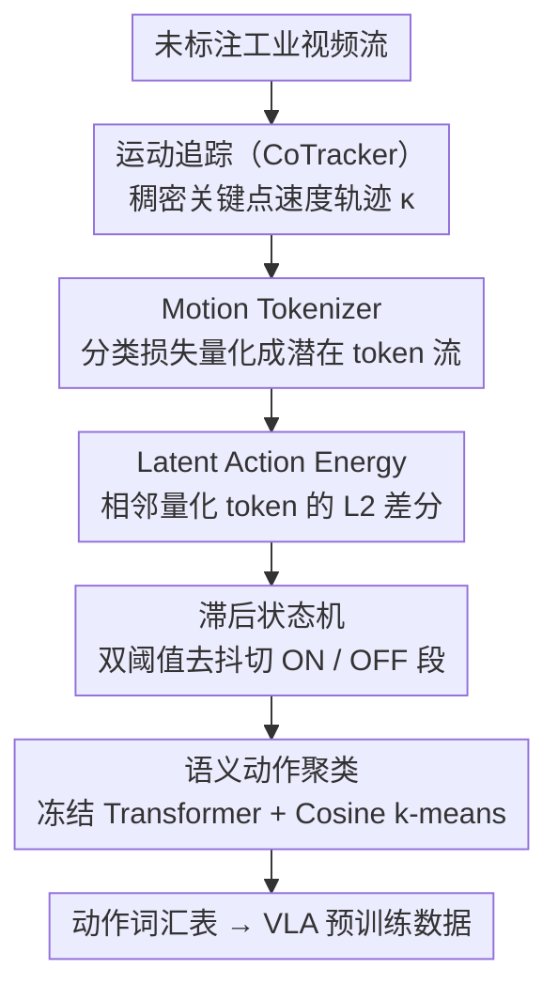

# From Observation to Action: Latent Action-based Primitive Segmentation for VLA Pre-training in Industrial Settings

**会议**: CVPR 2026  
**arXiv**: [2511.21428](https://arxiv.org/abs/2511.21428)  
**代码**: 无（工业数据集将部分公开）  
**领域**: Multimodal / VLM  
**关键词**: VLA预训练, 动作分割, 潜在动作能量, 无监督学习, 工业制造

## 一句话总结

提出 LAPS（Latent Action-based Primitive Segmentation）流水线，通过在潜在动作空间中定义"Latent Action Energy"指标，从未标注的工业视频流中无监督发现和分割语义动作原语，为 VLA 模型预训练提供结构化数据。

## 研究背景与动机

**领域现状**：VLA（Vision-Language-Action）模型如 GR00T、AgiBot GO-1 依赖大规模预分割的动作标注视频数据进行预训练，但获取此类数据极其昂贵，通常需要遥操作采集。

**现有痛点**：(1) 工业环境存在大量未标注的连续视频流，但缺乏自动提取结构化动作数据的方法；(2) 现有无监督分割方法（ABD、OTAS）基于像素级或光流变化检测，对非语义物理运动（如光照变化）敏感。

**核心矛盾**：VLA 预训练需要"预分割+动作标注"的短视频片段，但工业视频是连续未切分的长流——这个数据处理瓶颈阻碍了工业 VLA 的规模化部署。

**本文目标**：如何从连续工业视频流中自动发现有限的、可数的动作原语集合？

**切入角度**：不在像素/光流空间做分割，而是将问题转移到潜在动作空间——训练 Motion Tokenizer 编码运动动态，在其潜在空间定义能量指标来检测语义动作边界。

**核心 idea**：从"视觉变化检测"转向"行为意图变化检测"——Latent Action Energy 在动作执行时持续高能，动作完成时回落低能，天然对应语义边界。

## 方法详解

### 整体框架

LAPS 要解决的是一件很具体的事：把一段没人标注过的连续工业视频，自动切成一个个语义动作片段，再给每个片段贴上动作类别标签，直接喂给 VLA 模型做预训练。它没有在像素或光流层面去找"哪一帧画面变了"，而是先把运动编码进一个潜在动作空间，再在这个空间里找"行为意图什么时候改变了"。

整条流水线分三个阶段串行跑：先用 CoTracker 从视频里追出一批稠密的关键点运动轨迹（Motion Tracking）；再把轨迹送进 Motion Tokenizer 变成潜在 token 流，在 token 流上算 Latent Action Energy、配一个滞后状态机切出动作边界（Action Detection & Segmentation）；最后把切出来的片段用一个冻结 Transformer 编码、做 Cosine k-means 聚类，无监督地发现一张动作词汇表（Semantic Action Clustering）。三个阶段都不依赖任何人工标注。

### 关键设计

**1. Motion Tokenizer：把关键点运动编码成抗外观干扰的潜在动态**

问题出在"在什么空间里做分割"。像素和光流对光照、阴影、相机微动这类非语义变化非常敏感，工业流水线上这些干扰随处可见，直接在原始信号上找边界会切出一堆假动作。LAPS 的做法是先训一个 Motion Tokenizer $M_\theta$ 把运动本身编码掉：沿用 AMPLIFY 的 Transformer 编码器-解码器加 FSQ（Finite Scalar Quantization）量化结构，输入是关键点轨迹的速度 $\kappa \in \mathbb{R}^{T \times N \times 2}$，输出一条连续量化向量序列 $S_q$ 和一条离散编码序列 $S_d$。关键在于它用的是分类损失而不是像素重建损失——重建像素会逼着模型去记背景纹理，而分类目标只关心运动模式本身，自然把动作无关的外观噪声过滤掉了。换句话说，进了这个 tokenizer 之后，剩下的就是"手臂在怎么动"，而不是"画面长什么样"。

**2. Latent Action Energy：用潜在空间的时间差分当动作的"心电图"**

有了干净的潜在 token 流，怎么知道动作什么时候在执行、什么时候结束？LAPS 定义了一个标量信号 Latent Action Energy：

$$E_{action}(t) = \|z_{q,t} - z_{q,t-1}\|_2$$

即相邻两帧量化潜在向量的 L2 差分。它的物理含义很直白：物体静止、没有动作时，相邻 token 几乎不变，能量趋近于零；一旦开始执行连续动作，token 持续翻动，能量维持在高位；动作做完、回到稳定状态时，能量重新回落——于是能量曲线的"抬起—维持—回落"天然对应一个动作原语的起止。这个量必须在**量化之后**的空间里算才有效：消融实验里改成在原始速度或预量化潜在向量上算，F1 直接从 87.5% 崩到 25% 左右。原因是只有量化潜在空间编码的是"行为意图"这一层抽象，对光照、轮子微动这些物理扰动免疫，而原始信号里这些扰动会把能量信号淹没。

**3. 滞后状态机：用双阈值去抖动，把能量曲线切成实时的 ON/OFF 段**

能量曲线本身有噪声，单阈值一刀切会在阈值附近来回抖动、切出大量假边界。LAPS 用一个单通道因果的滞后（hysteresis）状态机来读这条曲线：激活（OFF→ON）要求信号 $y_t > \theta_{on}$ 连续保持 $u$ 帧，去激活（ON→OFF）要求 $y_t < \theta_{off}$ 连续保持 $d$ 帧，两个阈值拉开间距形成滞回带，短暂的毛刺穿不过去就不会触发状态翻转。其中 $\theta_{on}$ 不靠人工调，而是无监督自校准：拿速度能量当代理信号自动生成一批伪标签，再以最大化 F1 反推阈值。因为是单通道、只看当前帧之前的信息，整个检测器可以在线实时跑，符合工业部署对流式处理的要求。

**4. 语义动作聚类（Semantic Action Clustering）：把切出的片段聚成一张动作词汇表**

切出片段只做了一半——VLA 预训练还需要知道"哪些片段属于同一类动作"，才能形成可数的动作原语集合。LAPS 把每个片段送进一个**随机初始化且完全冻结**的 Transformer 做时序编码，再用 Cosine k-means 聚类，潜在动态相似的片段自然落到同一簇，无监督地浮现出一张动作词汇表。这里有两个看似反直觉的选择：一是编码器不训练——消融显示冻结 Transformer 的聚类语义一致性（ICSS）0.92 优于简单均值池化的 0.84，说明显式时序建模本身就足以区分动作，而保持不训练反而避免过拟合到某个特定工业场景、保住跨域泛化；二是用专门的 Motion Tokenizer 特征而非通用 CLIP 特征（用 CLIP 时 ICSS 仅 0.75），因为 CLIP 编码的是外观而非运动。为了能在没有标注的情况下衡量聚类质量，本文还设计了 ICSS 指标——用 VLM 判断同簇片段的语义相似度，弥补 Silhouette 这类纯几何指标读不出"语义是否一致"的盲区。

### 一个完整示例：一段拧螺丝视频怎么被切开

设工人连续拧三颗螺丝。CoTracker 先在手和螺丝刀上追出几十条关键点轨迹；Motion Tokenizer 把这些轨迹逐帧编成潜在 token。拧第一颗螺丝时，$E_{action}$ 从静止时的近零值抬升并维持高位，连续超过 $\theta_{on}$ 达 $u$ 帧 → 状态机翻到 ON，标记动作起点；拧完手停下取下一颗螺丝的瞬间，能量跌回低位、连续低于 $\theta_{off}$ 达 $d$ 帧 → 翻回 OFF，标记动作终点，切出第一个片段。这样三颗螺丝对应能量曲线上三次"抬起—回落"，被切成三个独立片段。三段再过冻结 Transformer 编码、丢进 Cosine k-means，会聚到同一个簇里——因为它们的潜在动态高度相似——于是"拧螺丝"作为一个动作原语被自动命名进词汇表。中间一次因光照闪变造成的能量毛刺，由于撑不满 $u$ 帧，被滞回带挡掉，不会误切。

### 训练策略

Motion Tokenizer 只在未标注的训练集视频片段上训练；分割阶段的阈值靠自监督校准，全程无需人工标注；最后的聚类用的是**冻结的随机初始化** Transformer（完全不训练），靠它做时序编码就足以区分动作，从而保证跨域泛化、不会过拟合到某个特定工业场景。

## 实验关键数据

### 主实验：无监督时序动作分割

| 方法 | GTEA F1@5s | GTEA F1@2s | Breakfast F1@5s | Industrial Top F1@2s | Industrial Exo F1@2s |
|------|-----------|-----------|----------------|---------------------|---------------------|
| ABD | 81.92 | 74.23 | 54.50 | 34.08 | 29.86 |
| OTAS | 37.68 | 36.90 | **62.13** | 40.69 | 33.38 |
| Optical Flow | - | - | - | 43.68 | 42.54 |
| **LAPS (Ours)** | 73.12 | 63.20 | 58.82 | **81.27** | **81.93** |

在工业数据集上 LAPS 以巨大优势领先（F1@2s 提升约 2 倍），在公共基准上与 SOTA 可比。

### 消融实验

| 配置 | F1@2s (%) | Cluster ICSS |
|------|----------|-------------|
| Full Pipeline | **87.5** | **0.92** |
| $E_{action}$ from Pre-Quant. Latents | 25.2 | – |
| $E_{action}$ from Raw Velocities | 24.9 | – |
| w/o Transformer (Mean-pool) | – | 0.84 |
| w/o $M_\theta$ (用 CLIP) | 27.2 | 0.75 |

### 关键发现

- 在量化空间计算 $E_{action}$ 是关键（相比预量化/原始速度，F1 从 25% 提升到 87.5%）
- 专用 Motion Tokenizer 远优于通用 CLIP 特征（F1: 87.5% vs 27.2%）
- 聚类的 ICSS 语义一致性评分 0.926 远高于随机基线 0.804
- 冻结 Transformer 优于简单均值池化，说明显式时序建模对动作区分至关重要

## 亮点与洞察

- **范式转换**：从"视觉变化检测"转向"行为意图变化检测"，在潜在空间做分割是本文最核心的创新
- **工业适用性**：利用工业环境动作有限可数的先验，流水线完全无监督，可直接部署
- **端到端数据管道**：从原始视频到结构化 VLA 预训练数据的完整自动化流程
- ICSS 指标设计巧妙——用 VLM 语义相似度验证聚类质量，弥补 Silhouette 等几何指标的不足

## 局限与展望

- 目前仅限于高度重复的工业任务，对家庭/医院等非结构化环境的泛化有待验证
- 需要预定义聚类数 $k$，依赖领域知识
- 未验证下游 VLA 预训练的实际效果
- Motion Tokenizer 的训练需要一定量的无标注短视频片段

## 相关工作与启发

- **AMPLIFY**：本文 Motion Tokenizer 的基础架构，原本用于策略学习
- **GR00T / AgiBot GO-1**：VLA 预训练的代表工作，面临数据瓶颈
- **ABD / OTAS**：传统无监督动作分割基线

## 评分

- 新颖性: ⭐⭐⭐⭐⭐ Latent Action Energy 指标新颖，潜在空间分割范式创新
- 实验充分度: ⭐⭐⭐⭐ 公共基准+工业数据集+VLM语义验证覆盖全面
- 写作质量: ⭐⭐⭐⭐ 方法动机清晰，流水线描述详细
- 价值: ⭐⭐⭐⭐ 解决 VLA 数据瓶颈的实用方案，工业应用前景好

<!-- RELATED:START -->

## 相关论文

- [\[CVPR 2026\] Joint-Aligned Latent Action: Towards Scalable VLA Pretraining in the Wild](joint-aligned_latent_action_towards_scalable_vla_pretraining_in_the_wild.md)
- [\[CVPR 2026\] Condensed Test-Time Adaptation of VLMs for Action Recognition](condensed_test-time_adaptation_of_vlms_for_action_recognition.md)
- [\[CVPR 2026\] MA-Bench: Towards Fine-grained Micro-Action Understanding](ma-bench_towards_fine-grained_micro-action_understanding.md)
- [\[CVPR 2026\] SIMPACT: Simulation-Enabled Action Planning using Vision-Language Models](simpact_simulation-enabled_action_planning_using_vision-language_models.md)
- [\[CVPR 2026\] PowerCLIP: Powerset Alignment for Contrastive Pre-Training](powerclip_powerset_alignment_for_contrastive_pre-training.md)

<!-- RELATED:END -->
