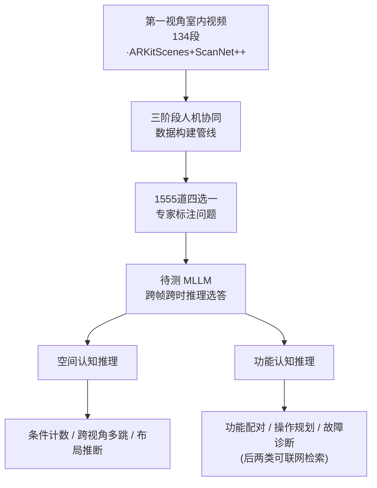

# From Where Things Are to What They Are For: Benchmarking Spatial–Functional Intelligence in Multimodal LLMs

**会议**: CVPR 2026  
**arXiv**: [2605.02130](https://arxiv.org/abs/2605.02130)  
**代码**: 有（项目主页 SFI-Bench，Apple × Mila × NYU）  
**领域**: 多模态VLM / 空间智能 / 视频理解 / Benchmark  
**关键词**: 空间认知地图、功能可供性、第一视角视频、认知级评测、知识接地推理

## 一句话总结
提出 SFI-Bench——一个基于 134 段第一视角室内视频、1555 道专家标注四选一题的视频基准，把多模态大模型的评测从"物体在哪里"的几何感知推到"物体是干什么用的"的功能认知，覆盖空间认知与功能推理两大维度共六类任务，揭示当前 MLLM 在"空间记忆 + 功能推理 + 外部知识"三者融合上仍是明显瓶颈。

## 研究背景与动机
**领域现状**：多模态大模型（MLLM）已成为视觉-语言-动作（VLA）智能体的核心，而要评测它们的"空间智能"，目前主流基准（如 VSI-Bench）大多围绕几何感知打转——数物体、判方向、估距离、比大小。

**现有痛点**：这些基准把任务停留在"感知识别"层面，只测了人类认知发育阶梯的第一级。它们没有真正考察更高阶的能力：如何把零散的多视角观测拼成一张连贯的认知地图、如何推断物体的可供性（affordance）、以及如何把视觉证据和外部知识（设备手册、操作说明）结合起来做接地推理。换句话说，现有基准擅长问"东西在哪"，却几乎不问"东西是干什么用的、怎么用、出故障怎么修"。

**核心矛盾**：人类靠"认知地图"既编码空间布局、又编码物体的功能用途，二者是一体的；而现有评测把空间感知和功能认知割裂开，导致我们无法诊断模型在"空间记忆↔功能推理↔知识接地"这条链路上到底卡在哪。

**本文目标**：构建一个能同时、系统地考察这两个互补维度的诊断性基准，把任务从"感知层"重构到"认知层"，并据此摸清当代 MLLM 的真实短板。

**切入角度**：作者借用心理学的"认知地图"与"可供性"概念，把空间智能拆成 *Structured Spatial Reasoning*（结构化空间推理）和 *Functional Reasoning*（功能推理）两类，用真实第一视角室内扫描视频作为载体——因为视频天然要求跨帧整合、模拟了真实导航中"物体从不同时出现在同一画面"的难点。

**核心 idea**：用一个覆盖"从在哪到干什么用"全谱系的视频问答基准（SFI-Bench），把 MLLM 的评测从几何感知升级到空间-功能一体的认知评测。

## 方法详解

### 整体框架
SFI-Bench 不是一个模型，而是一套基准 + 评测协议。它的整体逻辑是：从 ARKitScenes 和 ScanNet++ 的真实第一视角室内扫描视频出发，经过一条三阶段人机协同的构建管线，产出 1555 道四选一题；待测 MLLM 把整段视频作为输入、跨帧跨时做推理选答；这些题被组织成两大认知维度——空间认知推理与功能认知推理，每维各 3 类任务，其中功能维度的后两类任务允许（甚至需要）联网检索外部知识。最终用答题准确率（随机基线 25%）来诊断模型在感知、记忆、推理、知识整合各环节的能力。

### 关键设计

**1. 双维度认知能力分层：从"东西在哪"升级到"东西干什么用"**

针对现有基准只停在感知层的痛点，SFI-Bench 把空间智能显式拆成两个互补维度，对应认知发育的递进阶段。第一维 *Structured Spatial Reasoning* 要求模型超越逐帧识别，把分散在不同视角、不同时间的线索拼成一张时序一致的认知空间地图；第二维 *Functional Reasoning* 要求模型从"理解空间"走向"理解功能"——推断物体的可供性、操作方式、上下文相关的用途。这种分层不是简单贴标签，而是刻意把"在哪"（where things are）作为"干什么用"（what they are for）的前置阶梯，从而能把模型的失败定位到具体认知层级，而非笼统地说"它不会空间推理"。

**2. 六大任务：把"感知识别"重构成"认知级"挑战**

这是基准的核心贡献，直接回应"旧任务太浅"的痛点。同样叫"计数""空间关系"，SFI-Bench 把它们从感知检测改写成需要组合与逻辑推理的认知题。空间维三类任务：**全局/条件计数（GCT）**把计数变成带属性约束的集合运算（交、并、补）与分组聚合，如"找出柜子上同品牌瓶子数量最多的那一组"；**跨视角多跳路径推理（MPR）**要求整合跨时间、跨视角的空间证据，恢复任一单帧里都看不到的物体关系；**布局推断（LI）**要求把分散线索整合成全局场景布局并推理遮挡可见性顺序。功能维三类任务：**功能配对（FA）**测可供性关联（如把遥控器和正确的电视配对，而它们从不同时出现在一帧）；**操作规划（OP）**要求检索设备手册、解释知识、拼出多步操作计划；**因果假设与故障诊断（TS）**要求结合场景理解与外部文档，假设故障模式并给出可执行的接地解法。六类任务共同逼着模型把感知、记忆、推理、知识整合到一起，而不是对局部线索做条件反射。

**3. 三阶段人机协同数据构建管线：保证"题目真的依赖视觉、答案真的可靠"**

如果纯自动生成，题目容易答案错、或不看视频就能蒙对。作者用三阶段管线兜底：① **自动出题**——用 Gemini-2.5-Pro 对每段视频做多趟元数据抽取（物体、属性、空间关系、功能角色），多趟结果合并并与原视频交叉验证得到可靠结构化描述，再套任务模板 + 少样本示例生成候选题；知识接地任务由标注员手动检索相关手册并注入生成提示。② **人工核验与答案标注**——前四类任务由标注员逐题看视频验证并基于视觉证据给真值答案，后两类知识接地任务的答案由检索到的设备手册自动导出。③ **事后质量过滤**——每道题先用 Gemini-2.5-Pro 与 GPT-5 评测，答错的进入多轮人机协同复核来定位问题、必要时改写题干/选项；**能在不看视频的情况下答对的题被直接剔除**，以强制视觉依赖。这一步是基准可信度的关键——它把"模型靠语言先验蒙对"的捷径堵死。

**4. 知识接地任务与 web search 评测协议：把"闭世界参数记忆"逼到墙角**

操作规划与故障诊断这两类任务，本质上需要设备特定、随时更新的外部知识，光靠模型参数里的常识答不出。作者为此设计了显式的检索协议：具备工具调用能力的模型在作答前可联网检索（如用户手册），无工具/无联网能力的模型则在与前四类任务相同的离线设定下评测。这一协议把"是否会用外部知识"变成可量化的实验变量——实测 GPT-5 开/关 web search 在这两类任务上准确率最高差到 8%，直接量化了"功能推理离不开外部知识接地"这一被长期忽视的挑战。

## 实验关键数据

### 主实验
在 SFI-Bench 上评测了大量开源与闭源 MLLM（零样本、统一提示模板）。下表节选代表性模型的宏平均准确率（Avg.）及各任务分数（GCT 条件计数 / MPR 多跳路径 / LI 布局 / FA 功能配对 / OP 操作规划 / TS 故障诊断），随机基线为 25%：

| 模型 | Avg. | GCT | MPR | LI | FA | OP | TS |
|------|------|-----|-----|-----|-----|-----|-----|
| Gemini-3.1-Pro（闭源最佳） | **73.8** | 59.1 | 83.4 | 86.8 | 73.2 | 67.9 | 72.1 |
| GPT-5.4-High | 72.1 | 58.4 | 82.8 | 81.1 | 76.2 | 65.5 | 68.8 |
| GPT-5 | 69.4 | 58.4 | 83.0 | 81.5 | 75.3 | 60.2 | 58.1 |
| Gemini-2.5 Pro | 67.1 | 54.4 | 80.7 | 83.8 | 65.5 | 60.2 | 58.1 |
| LLaVA-Video-72B（开源最佳） | 64.9 | 57.9 | 70.3 | 75.2 | 56.7 | 58.4 | 50.9 |
| Qwen3-VL-235B-Instruct | 60.7 | 52.3 | 66.6 | 78.8 | 55.5 | 53.0 | 58.1 |
| Qwen3-VL-235B-Thinking | 57.9 | 53.8 | 62.4 | 74.0 | 60.9 | 51.3 | 45.3 |

关键观察：① **条件计数（GCT）是全场最大瓶颈**——即便最强的 Gemini-3.1-Pro 也只有 59.1，远低于其布局推断（86.8），说明组合与逻辑推理仍是硬伤；② 闭源模型在空间认知地图构建上较强，但功能推理（尤其 OP/TS）明显更弱；③ 开源生态整体落后闭源一大截，离线无联网时功能推理任务准确率普遍贴近 50%。

### 分析实验
**帧序打乱（时序一致性依赖，GPT-5，200 样本）**——逐步打乱输入帧顺序，准确率几乎不掉，说明模型靠的是"聚合视觉证据"而非"时序连续动态"，构建的是静态空间抽象而非时间依赖的认知地图：

| 打乱率 SR | Overall | Count | Layout | Spatial | Func. |
|------|------|------|------|------|------|
| 0 | 75.5 | 60.0 | 88.0 | 82.0 | 72.0 |
| 50% | 71.5 | 50.0 | 84.0 | 80.0 | 72.0 |
| 100% | 75.0 | 58.0 | 86.0 | 78.0 | 78.0 |

**视觉输入 vs 纯文字描述（GPT-5，200 样本）**——把视频换成模型自己生成的结构化文字描述（类 Socratic 做法），需要空间/布局理解的任务大幅掉点，证明认知地图构建严重依赖直接视觉接地、文字转述不够用：

| 输入 | Count | Layout | Spatial | Func. |
|------|------|------|------|------|
| Visual（完整视频） | 58.4 | 83.0 | 81.5 | 75.3 |
| Caption-only（纯文字） | 57.2 | 51.6 | 55.4 | 67.6 |

### 关键发现
- **GCT 条件计数是公认瓶颈**：所有模型在这一项最弱，暴露 MLLM 在属性约束 + 集合运算 + 分组聚合上的组合推理短板。
- **更长的推理 ≠ 更准**：对 Qwen3-VL 系列分析发现，"非推理模式答对、推理模式答错"的样本，推理链比全局均值长 1.41×（235B）/1.12×（32B）/1.22×（8B）；超过约 1.2–1.5k token 后语言噪声主导，出现"过度解释 + 语义漂移"。更大的模型反而产出更短、更接地的推理。
- **RLVR 收益有限**：开源推理变体（RLVR 训练）相比指令微调版几乎没提升，说明视觉数学任务上的推理能力难迁移到空间-功能场景。
- **web search 是双刃剑**：强推理预算下联网显著优于离线（GPT-5 差距达 8%），但推理能力弱时联网反而引入噪声拖累性能——"会用工具"以"强推理"为前提。
- **三类系统性失败**（人工标注 Gemini-2.5-Pro 的 120 个错误样本）：视觉感知错误（漏检/误分类/反射混淆）跨所有任务普遍存在；空间理解错误（位置不一致/几何误读）集中在空间与布局任务；功能推理错误里最典型的是**可供性过度泛化**（默认"任何遥控器都能控任何电视"而不验证具体上下文）和多跳推理缺失。

## 亮点与洞察
- **"从在哪到干什么用"的认知阶梯叙事**很有说服力：它把零散的任务组织成一条有发育逻辑的链条，让基准既能横向比模型、又能纵向诊断"卡在认知第几级"，这是比单纯堆任务更高级的基准设计思路。
- **强制视觉依赖的过滤步骤**（剔除"不看视频也能答对"的题）是基准可信度的命门，直接对抗了 VQA 基准里普遍存在的"语言先验捷径"问题，这个 trick 可迁移到任何视觉问答基准的质检环节。
- **把 web search 做成可量化的实验变量**很巧妙：它不仅测了模型能力，还测了"模型 + 工具"系统的能力，量化出"功能推理本质需要外部知识"这一长期被忽视的结论。
- **最反直觉的发现**：模型对帧序打乱几乎不敏感——这说明今天的视频 MLLM 并没有真正建立"时间依赖的认知地图"，而是把视频当成一袋无序帧在做聚合，这对追求具身/导航能力的研究是个警示。

## 局限与展望
- **作者承认的局限**：当前 MLLM 在空间记忆、功能知识整合、感知↔外部知识衔接上仍系统性薄弱；开源模型推理迁移能力差。这些更多是"被诊断对象"的局限，基准本身指出了改进方向（更强空间记忆、更鲁棒的组合推理、更好的外部知识整合）。
- **功能推理采用了"窄化"的可供性定义**：作者明确只关注物体-功能关联（某物能否支持某种用途），不建模可供性中完整的、依赖主体与感知的部分，因此"功能智能"的考察是局部的，并非心理学意义上的完整可供性。
- **基准是纯诊断性的、四选一 MCQ 形式**：四选一虽便于自动评测，但和真实智能体的开放式规划/动作仍有差距；准确率掩盖了推理过程质量（论文也用人工标注推理链来弥补，但不可规模化）。
- **数据规模与场景**：1555 题、134 段室内视频虽经专家标注，但相对真实世界的场景多样性仍有限；知识接地任务依赖手动检索手册，扩展性受限。
- **改进思路**：可把帧序敏感性作为单独的训练目标，逼模型建立时序认知地图；把 web search 协议扩展为多跳检索 + 证据溯源；引入开放式动作规划评测以贴近 VLA 真实需求。

## 相关工作与启发
- **vs VSI-Bench**：VSI-Bench 主要测几何感知与事实回忆（认知阶梯第一级），SFI-Bench 在其上补齐了结构化地图构建、可供性推断、知识接地推理三个更高阶层级，并且把"功能推理"和"web search 评测"显式纳入，定位更偏"认知"而非"感知"。
- **vs 通用视频 VQA 基准（如各类活动/内容理解基准）**：那些基准大多停在内容/活动层理解，忽略视频里的空间布局这一基础原语；SFI-Bench 强调空间布局 + 功能用途的一体评测。
- **vs Socratic Models（纯文字描述驱动推理）**：本文用 caption-only 实验直接证伪了"详细文字描述可替代视觉"的假设，凸显直接视觉接地对认知地图构建不可或缺。
- **启发**：基准设计可以借鉴其"发育阶梯 + 强制视觉依赖过滤 + 工具使用作为变量"三件套；研究方法上，"用人工标注推理链投影到空间布局来定位错误"是分析空间推理失败模式的可复用范式。

## 评分
- 新颖性: ⭐⭐⭐⭐⭐ 首个把 MLLM 评测从几何感知系统推到"空间-功能一体认知"、并把 web search 纳入评测的视频基准
- 实验充分度: ⭐⭐⭐⭐⭐ 覆盖大量开闭源模型 + 帧序/视觉vs文字/推理长度/失败模式多维分析，诊断详尽
- 写作质量: ⭐⭐⭐⭐⭐ "从在哪到干什么用"的认知阶梯叙事清晰，任务定义与发现层层递进
- 价值: ⭐⭐⭐⭐⭐ 为迈向真正接地的多模态智能体提供了高质量诊断工具，结论（计数瓶颈、长推理无益、时序不敏感）对后续研究有直接指导意义

<!-- RELATED:START -->

## 相关论文

- [\[CVPR 2026\] Where MLLMs Attend and What They Rely On: Explaining Autoregressive Token Generation](where_mllms_attend_and_what_they_rely_on_explaining_autoregressive_token_generat.md)
- [\[CVPR 2026\] Scaling Spatial Intelligence with Multimodal Foundation Models](scaling_spatial_intelligence_with_multimodal_foundation_models.md)
- [\[CVPR 2026\] SpatialTree: How Spatial Intelligence Branches Out in MLLMs](spatialtree_how_spatial_intelligence_branches_out_in_mllms.md)
- [\[CVPR 2026\] Abstract 3D Perception for Spatial Intelligence in Vision-Language Models](abstract_3d_perception_for_spatial_intelligence_in_vision-language_models.md)
- [\[CVPR 2026\] SpatialScore: Towards Comprehensive Evaluation for Spatial Intelligence](spatialscore_towards_comprehensive_evaluation_for_spatial_intelligence.md)

<!-- RELATED:END -->
