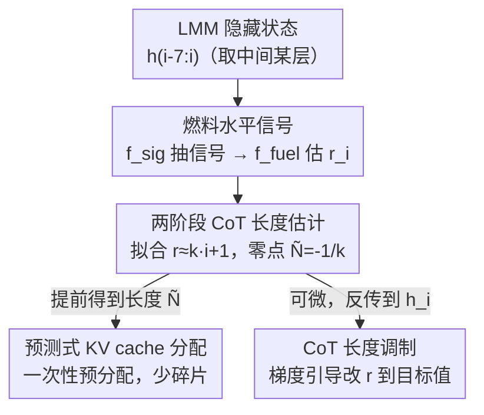

# Fuel Gauge: Estimating Chain-of-Thought Length Ahead of Time in Large Multimodal Models

**会议**: CVPR 2026  
**论文**: [CVF Open Access](https://openaccess.thecvf.com/content/CVPR2026/html/Yang_Fuel_Gauge_Estimating_Chain-of-Thought_Length_Ahead_of_Time_in_Large_CVPR_2026_paper.html)  
**代码**: 无  
**领域**: 多模态VLM / LLM推理  
**关键词**: CoT长度预测, 大多模态模型, 推理效率, KV缓存分配, 测试时调控

## 一句话总结
作者发现推理型多模态大模型内部存在一个随 CoT 推理逐步耗尽的"燃料"信号，用一个仅 8.2 万参数的小网络把它抽出来、再线性外推到"燃料归零"那一步，就能在推理还没结束（甚至刚开始）时提前预测整段 CoT 的长度，并用它做预测式 KV cache 分配（分配次数最多降 13×）和 CoT 长度调控（线性控制准确率）。

## 研究背景与动机
**领域现状**：推理型多模态大模型（reasoning LMM，如 Qwen3、Qwen3-VL）靠 Chain-of-Thought（CoT）把问题拆成一串小步骤逐个攻克，CoT 段被 `<think>...</think>` 包住，后面才跟简短的结论。强推理能力正来自这段长思考。

**现有痛点**：CoT 又长又不可预测——一段 CoT 轻松到 28k token，而真正的答案可能只有 1k；更要命的是由于自回归生成，整段 CoT 到底多长在生成前完全未知。这个"未知的长"同时拖累两件事：(1) 计算侧——serving 框架只能在显存耗尽时反复申请小块连续显存来存 KV cache，频繁小分配造成**显存碎片化**，明明总量够却凑不出一块够大的连续空间，导致 OOM；(2) 质量侧——模型缺乏对任务难度的全局认识，会**过度思考**（over-thinking）或**思考不足**（under-thinking），CoT 长度和任务真实复杂度对不上。

**核心矛盾**：根本症结在于 CoT 长度事先不可知，于是既无法预分配显存、也无法在生成前就介入纠正"想太多/想太少"。如果能在事前估出 CoT 长度，这两类问题都能顺势解决。

**切入角度**：作者观察到一个经验规律（Figure 2）——把准确率当作任务难度的代理，CoT 长度与任务难度呈清晰的负相关，这意味着 **CoT 长度很可能仅凭问题本身就能预测**。进一步类比人脑：神经活动靠 ATP 水解供能、副产物腺苷累积后抑制思考，腺苷水平就是大脑的"油表"。作者据此假设 LMM 内部也存在一个起始为高、随推理推进单调降到零的"燃料"信号。

**核心 idea**：从隐藏状态里抽出这个"燃料水平"信号，对它做线性外推，求出燃料降到零的时间步，即为提前预测的 CoT 长度——再把这个长度预测落到 KV cache 预分配与 CoT 长度调控两个下游应用上。

## 方法详解

### 整体框架
Fuel Gauge 把"预测 CoT 还要多长"建模成"预测内部燃料什么时候耗尽"。它建立在两条假设上：**假设 I**——CoT 长度可由仅依赖输入提示 $X_0$ 的参数提前预测；**假设 II**——生成第 $i$ 个 token 时存在一个从隐藏状态 $h_{0:i}$ 导出的标量燃料水平 $r_i$，满足 $r_0=1$、$r_N=0$ 且对任意 $i>j$ 有 $r_i>r_j$（单调递减）。

为什么需要这两条假设？理论上期望 CoT 长度可写成首个终止 token $T$ 的到达时间：

$$\mathbb{E}[N\mid X_0]=\sum_{n=1}^{\infty}\Big[n\cdot P(T\mid X_{0:(n-1)})\prod_{i=1}^{n}P(\bar T\mid X_{0:i-1})\Big]$$

其中 $\bar T$ 是非终止 token、$T$ 是终止 token（如 Qwen3 的 `</think>`），长度为 $n$ 的 CoT 就是 $n-1$ 个 $\bar T$ 后跟 1 个 $T$。但每一项概率都依赖此前生成的 token，**不实际采样整条 CoT 就算不出来**。两条假设正是为了绕开这个采样：假设一个仅依赖问题、且单调可外推的燃料信号，把"积分式的不可计算"换成"线下一条直线求零点"。

整个流程分两阶段串行：每个生成步先用信号抽取器 $f_{\text{sig}}$ 从最近 8 个隐藏状态里抽出燃料信号，再用估计器 $f_{\text{fuel}}$ 映射成燃料水平 $r_i$（Stage 1）；把历史 $r_{0:i}$ 拟合成一条直线、求它降到 0 的零点得到长度预测 $\tilde N_i$（Stage 2）；这个预测随生成推进不断刷新，并喂给下游的 KV cache 预分配器和 CoT 长度调制器。

### 关键设计

**1. 燃料水平信号：把"还能想多久"压成一个单调标量**

针对的痛点是 CoT 长度事先不可知。作者假设隐藏状态里藏着一个能反映"剩余思考能量"的信号，并用两个刻意做得极小的网络把它抽出来：$f_{\text{sig}}$ 只含一个 1D depth-wise 卷积加一个 1D point-wise 卷积，$f_{\text{fuel}}$ 是两层 MLP，总参数仅约 82k。$f_{\text{sig}}$ 接收单个 transformer 层最近 8 个隐藏状态 $h_{i-7:i}$（如 Qwen3-4B 取第 18 层，是一个 $8\times2560$ 矩阵），输出信号向量 $S_i$；$f_{\text{fuel}}$ 再把 $S_i$ 映射成燃料水平 $r_i=f_{\text{fuel}}(S_i)$。训练时用 200 条 CoT trace（文本模型取 MMLU 前 200 题、文本-视觉模型取 MMMU 前 200 题），随机采一段 8 步隐藏状态，让网络回归归一化的 token 位置 $1-\tfrac{i}{N}$，目标用 smooth L1 损失：

$$\min_{\theta_{\text{sig}},\theta_{\text{fuel}}}\ \mathcal{L}_{\text{SL1}}\Big(f_{\text{fuel}}\big(f_{\text{sig}}(h_{i-7:i};\theta_{\text{sig}});\theta_{\text{fuel}}\big),\ 1-\tfrac{i}{N}\Big)$$

之所以有效，是因为它没去预测"绝对长度"（高方差、跨任务难迁移），而是预测一个被归一化到 $[0,1]$、且天然单调的相对进度量——这正是假设 II 描述的燃料语义，小到 82k 参数也学得动，且推理开销可忽略。

**2. 两阶段长度估计：用线性外推求"燃料归零点"**

光有逐步的 $r_i$ 还不是长度。Stage 2 把已读出的燃料序列 $r_{0:i}$ 拟合成一条随步数线性下降的直线：

$$r_{0:i}\approx k\cdot[0\ \cdots\ i]^{\mathsf T}+1$$

斜率 $k$ 由数据拟合得到，再外推到燃料水平为零（$\tilde r_{\tilde N_i}=0$），零点即长度预测 $\tilde N_i=-1/k$。关键在于"分两阶段"本身就是泛化利器：直接回归绝对长度的 Direct baseline 用同样的网络和数据，却几乎不随生成更新、跨模态（如图文训练→视频测试）直接崩；而 Fuel Gauge 把任务拆成"逐步估相对燃料 + 线性求零点"后，随 CoT 推进不断纳入新信息、稳步逼近真值，因此即便只用 200 条样本训练也能跨任务、跨模态泛化。⚠️ 论文正文给的线性式系数符号（$r\approx k\cdot i+1$ 配 $\tilde N=-1/k$）意味着 $k<0$，以原文 Equation (2) 为准。

**3. 预测式 KV cache 分配器：把"反复小分配"换成"一次性预分配"**

直接受益于长度预测。LMM 动态分配 KV cache 时，频繁的申请-释放会留下用不上的空洞，最终凑不出大块连续显存而 OOM。有了事前长度估计，就能在生成一开始按预测的 CoT 长度估算显存需求、一次性分配到位；若发现不够再按更新后的预测补分配，直到 CoT 结束。评测指标是显存分配次数——越少越好。对比 HuggingFace 默认策略（显存耗尽时每次只为 16 个 token 申请一块），Fuel Gauge 把分配次数最多压到约 1/13。

**4. CoT 长度调制：用分类器引导式梯度在推理中"拧油门"**

直接受益于燃料信号可微。要解决 over/under-thinking，作者借鉴 steering vector 与扩散里的 classifier guidance，通过微调隐藏状态 $h_i$ 把燃料水平推向目标 $r_{\text{target}}$，形式化为：

$$\min_{\Delta h_i}\ J=\big|f_{\text{fuel}}(f_{\text{sig}}(h_{i-7:i-1},h_i+\Delta h_i;\theta_{\text{sig}});\theta_{\text{fuel}})-r_{\text{target}}\big|$$

由于 $f_{\text{sig}}$、$f_{\text{fuel}}$ 可微，最自然的是梯度上升/下降。但不同模型梯度幅度差异大、统一步长难调，于是改用**归一化梯度**：

$$h_i:=h_i+\alpha\cdot\frac{\partial J/\partial h_i}{\lVert\partial J/\partial h_i\rVert_2}$$

$\alpha$ 称为 CoT 调制因子：正值抬高燃料（CoT 变长），负值压低燃料（CoT 变短）。这也是第一个用 classifier guidance 做测试时扩展（test-time scaling）的方法——在 Fuel Gauge 之前，可靠预测 CoT 长度根本做不到，这一步顺带间接验证了两条假设：若假设不成立，改燃料读数就不该带来 CoT 长度的稳定变化。

### 损失函数 / 训练策略
只训 $f_{\text{sig}}$ 与 $f_{\text{fuel}}$（base LMM 冻结），用 smooth L1 回归归一化 token 位置 $1-\tfrac{i}{N}$；数据仅 200 条 CoT trace（MMLU / MMMU 前 200 题），随机采 8 步隐藏状态段训练。所有实验在单张 NVIDIA A6000 上完成，评测重复 5 次（AIME 因题量小重复 10 次）。

## 实验关键数据

评测指标为相对平均绝对误差 rMAE（ground-truth 方差大，故用相对误差），定义为各样本各步预测与真值绝对误差之和除以真值绝对值之和：

$$\text{rMAE}=\frac{\sum_{i=1}^{M}\sum_{t=1}^{N_i}|y_{i,t}-\hat y_{i,t}|}{\sum_{i=1}^{M}\sum_{t=1}^{N_i}|\hat y_{i,t}|}$$

### 主实验：CoT 长度预测（rMAE，越低越好）

| 方法 | GPQA-Diamond (Qwen3-8B) | MathVision-m (Qwen3VL-4B) | LongVideoBench-15 (Qwen3VL-2B) | LongVideoBench-60 (Qwen3VL-4B) |
|------|------|------|------|------|
| Mean | 0.5003 | 0.7982 | 3.159 | 4.887 |
| Median | 0.5212 | 0.8931 | 3.557 | 5.410 |
| Direct（同架构同数据） | 0.5795 | 0.4965 | 9.833 | 5.877 |
| **Fuel Gauge** | **0.2732** | **0.3139** | **0.4834** | **0.4645** |

在 GPQA-Diamond 上误差不到 Direct 的一半；跨模态的 LongVideoBench 上，Mean/Median/Direct 全面崩坏（rMAE 高达 3~10），Fuel Gauge 仍稳定在 0.46~0.50，体现"图文训练→视频测试"的跨模态泛化。

### 燃料水平估计精度（rMAE，越低越好）

| 方法 | GPQA-Diamond (Qwen3-8B) | MathVision-m (Qwen3VL-2B) |
|------|------|------|
| Mean | 0.2501 | 0.3399 |
| Median | 0.2743 | 0.4620 |
| EoC Prob（终止 token 概率） | 0.4999 | 0.4999 |
| **Fuel Gauge** | **0.1322** | **0.1186** |

EoC Prob 几乎恒为 0.4999——因为终止 token 概率绝大多数步都接近 0（只有模型决定停的那刻才非零），根本反映不了进度；Mean/Median 受 CoT 长度高方差拖累。Fuel Gauge 把误差砍到一半以下，直接支撑假设 II"燃料信号真实存在"。

### 下游应用 1：预测式 KV cache 分配（分配次数 #Allocs，越低越好）

| 方法 | GPQA-Diamond (Qwen3-4B) | MathVision-m (Qwen3VL-2B) | LongVideoBench-60 (Qwen3VL-4B) |
|------|------|------|------|
| HF 默认 | 491.0 | 682.6 | 43.62 |
| **Fuel Gauge** | **49.24** | **69.43** | **27.81** |
| 降幅 | 9.97× | 9.83× | 1.57× |

文本/图文长 CoT 场景降幅近 10×、最高 13.37×（MathVision-m, Qwen3-4B）；视频场景 CoT 本身短，降幅相应小（1.5~2.3×）。

### 关键发现
- **两阶段拆分是泛化的关键**：Direct baseline 与 Fuel Gauge 用同一网络同一数据，但 Direct 跨模态直接失效、且生成过程中几乎不更新预测；拆成"逐步估燃料 + 线性求零点"后，跨任务跨模态都稳。
- **CoT 长度可被单因子线性调控**：调制因子 $\alpha$ 与 CoT 长度、长度与准确率、$\alpha$ 与准确率三组皆呈强线性相关。文本→文本下 Pearson 相关分别达 0.9936 / 0.9754 / 0.9722，图文→视频 OOD 仍有 0.9908 / 0.9835 / 0.9537——一个旋钮就能在过度/不足思考间线性拿捏准确率。
- **极低开销**：$f_{\text{sig}}+f_{\text{fuel}}$ 共约 82k 参数（相对 Qwen3-4B 可忽略），附录 D 显示额外推理延迟可忽略。

## 亮点与洞察
- **"燃料"类比把不可计算的积分变成可外推的直线**：期望长度公式（Eq. 1）因依赖未采样的未来 token 而无法计算，作者用一个单调归一化信号 + 线性零点外推绕过采样，是把难题换框架的漂亮一手。
- **预测相对进度而非绝对长度**：回归 $1-i/N$ 而不是 $N$，天然把高方差、强任务依赖的绝对长度归一掉，这是 82k 参数小网络也能跨模态泛化的根因，思路可迁移到任何"序列还剩多长/进度多少"的预测。
- **一个长度预测器，撑起两个互不相关的系统级收益**：上游同一信号，下游既治显存碎片（系统侧）又治 over/under-thinking（质量侧），且调控用的是信号本身可微这一性质做 classifier guidance，设计很省。

## 局限与展望
- **线性假设的边界**：燃料随步数线性下降是核心简化，论文图示也显示控制呈线性，但若某些模型/任务的 CoT 燃料并非线性衰减（如 backtracking 频繁导致非单调），外推求零点可能失准——⚠️ 论文未系统讨论非线性情形。
- **层与窗口的选择依赖经验**：取第 18 层、窗口 8 是按 Qwen3-4B 设定，换模型是否仍最优、敏感性如何，主文未展开（消融在附录 C）。
- **调制带来的质量代价未量化到底**：CoT 长度调短能省算力，但准确率随之线性下降，实际部署时"省多少算力换多少精度"的甜点区需要逐任务标定。
- **训练数据偏窄**：仅 200 条 MMLU/MMMU trace，虽展示了泛化，但面对分布差异极大的领域（如代码、长链数学证明）能否同样稳，仍待验证。

## 相关工作与启发
- **vs 静态先验（Mean/Median）**：它们假设所有 CoT 共享平均/中位长度，完全无视单题难度；Fuel Gauge 逐步读燃料、随生成更新，在长度高方差场景（MathVision rMAE 0.31 vs 0.89）优势明显。
- **vs End-of-CoT 概率**：用 `</think>` 终止 token 概率当进度，但该概率几乎恒为 0，估计误差恒在 0.4999；Fuel Gauge 抽的是连续单调的隐信号，而非稀疏的终止事件。
- **vs Direct 直接回归长度**：同网络同数据但直接预测 $N$，跨模态崩、过程中不更新；本文的"相对燃料 + 线性外推"两阶段拆分是泛化与在线刷新的来源。
- **vs steering vector / classifier guidance**：CoT 长度调制借鉴了它们"在隐藏状态/score 上注入方向"的思想，但首次把"可靠的长度预测器"当作引导信号，从而成为第一个用 classifier guidance 做测试时扩展的方法。

## 评分
- 新颖性: ⭐⭐⭐⭐⭐ 首个"事前预测 CoT 长度"框架，"燃料信号 + 线性外推"视角新颖且自洽
- 实验充分度: ⭐⭐⭐⭐ 覆盖文本/图文/视频、多模型多 benchmark，但消融与开销分析放在附录、正文略显单薄
- 写作质量: ⭐⭐⭐⭐⭐ 假设—验证逻辑清晰，类比生动，图表支撑到位
- 价值: ⭐⭐⭐⭐⭐ 同时解决显存碎片与 over/under-thinking 两个真实系统痛点，开销可忽略，落地性强

<!-- RELATED:START -->

## 相关论文

- [\[CVPR 2026\] UniT: Unified Multimodal Chain-of-Thought Test-time Scaling](unit_unified_multimodal_chain-of-thought_test-time_scaling.md)
- [\[CVPR 2026\] Chain-of-Thought Guided Multi-Modal Object Re-Identification](chain-of-thought_guided_multi-modal_object_re-identification.md)
- [\[CVPR 2026\] When Visualizing is the First Step to Reasoning: MIRA, a Benchmark for Visual Chain-of-Thought](when_visualizing_is_the_first_step_to_reasoning_mira_a_benchmark_for_visual_chai.md)
- [\[CVPR 2026\] ReaGEN: Adaptive Generation of Structured Chains-of-Thought for Efficient Multimodal Reasoning](reagen_adaptive_generation_of_structured_chains-of-thought_for_efficient_multimo.md)
- [\[CVPR 2026\] EmoThinker: Advancing Visual-Acoustic Emotion Analysis via Structural Token Selection and Chain-of-Thought Reasoning](emothinker_advancing_visual-acoustic_emotion_analysis_via_structural_token_selec.md)

<!-- RELATED:END -->
