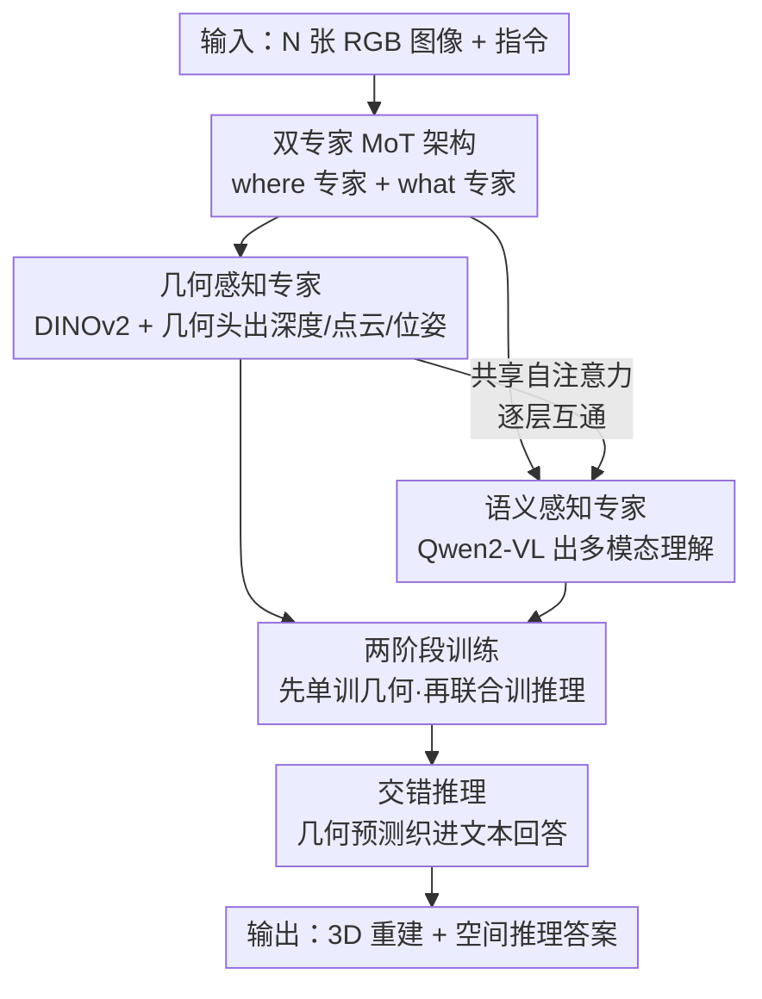

# G$^2$VLM: Geometry Grounded Vision Language Model with Unified 3D Reconstruction and Spatial Reasoning

**会议**: CVPR 2026  
**论文**: [CVF Open Access](https://openaccess.thecvf.com/content/CVPR2026/html/Hu_G2VLM_Geometry_Grounded_Vision_Language_Model_with_Unified_3D_Reconstruction_CVPR_2026_paper.html)  
**代码**: 有（项目页 + GitHub，链接见 CVF 论文页；具体地址 ⚠️ 以原文为准）  
**领域**: 多模态VLM / 3D视觉  
**关键词**: 几何接地VLM, 统一3D重建, 空间推理, 混合Transformer专家, 交错推理

## 一句话总结
G2VLM 用一个「混合 Transformer 专家（MoT）」架构，把前馈式 3D 重建专家和语义理解专家塞进同一个 VLM 里、靠共享自注意力互相增益，让一个 2B 的模型既能像 VGGT 那样直接预测深度/点云/相机位姿，又能在空间推理任务上反超 GPT-4o（SPAR-Bench 上高 18.5 分）。

## 研究背景与动机
**领域现状**：当下的 VLM 在很多多模态任务上是强力的基础模型，但在「空间智能」上普遍翻车——空间理解、空间推理这类需要把 2D 观测「抬升」成 3D 世界表征的任务上表现很差。主流空间 VLM（SpatialVLM、SpaceQwen 等）沿用标准 VLM 设计，把多张图/视频帧当成「拍扁的」2D token 序列，靠 next-token prediction 训练，再用人工构造的空间数据集硬调。

**现有痛点**：这种做法缺了关键一环——**没有显式的视觉几何学习**。模型从没真正学会怎么从 2D 图重建出连贯的 3D 空间，所谓空间理解只是从海量 2D 图文里隐式蹭来的语言/2D 先验。另一类工作（VLM-3R、Spatial-MLLM）意识到这点，便外挂一个**冻结的几何编码器（如 VGGT）**当额外特征喂给 VLM，但几何模块和语义模块是「拼接」而非「共生」，对齐不自然，几何能力也无法反过来被语义任务的数据规模带动。

**核心矛盾**：3D 重建模型（DUSt3R/VGGT/π³ 一脉）几何精度高但只会重建、不懂语义；语义强的 VLM 懂语义但缺几何。两者各自为政，而把它们拼起来又面临一个尺度难题：纯几何学习依赖**难采集的 3D 标注**（深度图、相机位姿），无法像 2D 图文那样规模化。

**本文目标**：在**同一个** VLM 内同时拥有 spatial 3D reconstruction 和 spatial understanding 两种能力，并且让几何能力的进步能直接转化为空间推理的进步。

**切入角度**：作者借用人类认知的「双流假说」——腹侧流（ventral / "what"）负责物体识别（对应多模态理解），背侧流（dorsal / "where"）负责空间定位（对应视觉几何学习）。把这两条「通路」做成两个专家，让它们在共享注意力里互通有无。

**核心 idea**：用一个 Mixture-of-Transformer-Experts 架构，让「几何感知专家」和「语义感知专家」共享自注意力相互增益，从而**用纯 2D 图像就能学会 3D 几何**、并把学到的几何特征通过 in-context learning 与交错推理喂给空间推理，摆脱对 3D 标注的规模依赖。

## 方法详解

### 整体框架
G2VLM 的输入是 $N$ 张 RGB 图像序列 $(I_i)_{i=1}^N$，$I_i \in \mathbb{R}^{3\times H\times W}$。整个模型是一个**双专家的 MoT**：两个 Transformer 专家各自有独立的 QKV 投影和 FFN，但在**每个 Transformer block 里所有 token 做共享的多模态自注意力**——这就是两条通路互相「看到对方」的地方。

- **几何感知专家（"where" 通路）**：前面接 DINOv2 编码器注入低层视觉信息，经全局注意力推出 3D-aware 隐状态 $h_i \in \mathbb{R}^{C\times d}$，再由轻量的 3D 几何头解码出相机位姿、点云等几何属性。
- **语义感知专家（"what" 通路）**：直接复用预训练 VLM（Qwen2-VL-2B），保留其 Qwen2 视觉编码器（支持原生动态分辨率）和多模态旋转位置编码 M-RoPE，负责多模态理解与空间推理，并能输出交错的文本/几何推理。

训练分两阶段：先冻结语义专家、从零训几何专家学几何表征；再解冻语义专家、与几何专家联合训练空间理解数据，让它学会消费几何特征。推理时对空间推理问题，模型可先预测 3D 几何（深度/位姿/点云），再用**交错推理（interleaved reasoning）**把几何结果织进文本回答里。

### 关键设计

**1. 双专家 MoT + 共享自注意力：让 where 通路和 what 通路逐层互通**

针对「几何模块与语义模块拼接式对齐不自然」的痛点，G2VLM 不外挂冻结编码器，而是把几何感知专家和语义感知专家做成 MoT 的两个对等专家：每个专家有自己的 QKV 投影矩阵和 FFN（保留各自的归纳偏置），但**在每个 block 内所有 token 一起做共享多模态自注意力**。这样几何 token 和语义 token 在每一层都能彼此读取——几何特征能被语义专家用于空间推理，反过来语义上下文也参与几何 token 的注意力。作者强调这与 Bagel 等「理解 + 生成」的 MoT 本质不同：两个专家被训练去做差异极大的视觉几何学习和空间推理，因而需要各自独立的架构细节、预训练目标和联合训练策略。消融（Table 2）证实这种「共生」带来正向互补——几何专家越强，空间推理也越强。

**2. 几何感知专家 + 几何头：纯 2D 输入前馈预测 3D 几何，摆脱 3D 标注规模瓶颈**

针对「纯几何学习依赖难采集 3D 标注、无法规模化」的痛点，几何专家用 DINOv2 编码器（自监督、擅长低层视觉）把每张图映射成 LLM 隐状态 $h_i$，再交给一组**轻量 Transformer 解码器几何头**：包含 local point head、camera head 和用于稳定训练的 global point head。几何头是一个把几何隐状态映射到 3D 标注的函数：

$$f\big((h_i)_{i=1}^N\big) = (T_i, X_i)_{i=1}^N$$

其中 $T_i \in SE(3) \subset \mathbb{R}^{4\times4}$ 是相机位姿，$X_i \in \mathbb{R}^{H\times W\times 3}$ 是每张图在自身相机坐标系下的像素对齐点图。这套设计沿用 VGGT/π³ 的前馈思路，但**关键差异**是：为了缩小与 LLM 的表征鸿沟、便于在 VLM 内学几何，作者做了几处简化——不用 register token、只用全局注意力层、并移除 VGGT 那种 camera token（去掉强相机先验），改用 π³ 的置换等变（permutation-equivariant）设计。代价是相机位姿等任务上略弱于带 camera token 的 VGGT，但换来了可直接吃在野多视角图/视频、可规模化扩展的好处。

**3. 视觉几何（VG）损失：点云 + 相机 + 法向三项联合监督几何专家**

几何专家第一阶段从零训练，目标是学出几何丰富的表征。VG 损失是三项加权和：

$$\mathcal{L}_{VG} = \mathcal{L}_{points} + \lambda_{cam}\mathcal{L}_{cam} + \lambda_{normal}\mathcal{L}_{normal}$$

点云重建损失先求一个最优尺度因子 $s^*$ 再算 L1 误差，逐像素按真实深度 $z_{i,j}$ 归一化：$\mathcal{L}_{points} = \frac{1}{3NHW}\sum_i\sum_j \frac{1}{z_{i,j}}\lVert s^*\hat{x}_{i,j} - x_{i,j}\rVert_1$，其中 $s^*$ 由 MoGe 的 ROE solver 求解。相机损失对所有有序视图对 $(i\neq j)$ 求平均，旋转项用测地距离（预测相对旋转与真值旋转夹角）$\mathcal{L}_{rot}(i,j)=\arccos\!\big(\frac{\mathrm{Tr}((R_{i\leftarrow j})^\top \hat{R}_{i\leftarrow j})-1}{2}\big)$，平移项用 Huber 损失比较尺度对齐后的预测平移。法向损失则鼓励重建出局部光滑表面：$\mathcal{L}_{normal}=\sum_i\sum_j \arccos(\hat{n}_{i,j}\cdot n_{i,j})$。三项合力让几何专家既准（点云/位姿）又稳（表面法向）。

**4. 空间推理联合训练：CE-Only 在「几何能力保全」与「规模化」间取最优权衡**

几何专家预训练好后，第二阶段联合训练让语义专家学会用几何特征做空间理解，主损失是标准语言建模交叉熵（CE）。这里有个关键设计抉择——几何专家在联合训练时怎么处理？作者比了三种策略：① **CE-Only**：冻结几何专家，只更新语义专家，逼模型靠 in-context learning 用现成几何特征，且几何能力原封不动；② **CE+CE**：几何专家也用 CE 损失微调，把几何特征显式调向空间理解；③ **VG+CE**：几何专家同时吃 CE 和 VG 损失，既适配推理又保留几何能力。实验（Figure 4）显示 VG+CE 几何与推理双赢、效果最好，但它需要大规模 3D 标注数据做联合训练，**规模化受限**。权衡之下主模型选 **CE-Only**：冻结几何专家保住其强几何性能，同时靠丰富视频数据扩展推理能力——这是规模与能力的最佳折中。而 CE+CE 对「专门优化空间推理」最有效，作者将这个变体单列为 **G2VLM-SR**（Spatial Reasoning 特化版）。

## 实验关键数据

### 主实验

视觉几何任务上，2B 的 G2VLM 与 VGGT、π³ 等 SOTA 前馈重建模型打成平手，部分指标更优（如单目深度的 Abs Rel 反超 VGGT）：

| 任务 / 数据集·指标 | Fast3R | CUT3R | VGGT | π³ | G2VLM(本文) |
|--------|--------|-------|------|----|-------------|
| 深度 Sintel Abs Rel↓ | 0.544 | 0.418 | 0.335 | **0.277** | 0.297 |
| 深度 NYU-v2 Abs Rel↓ | 0.093 | 0.081 | 0.056 | 0.054 | 0.062 |
| 点图 ETH3D Acc.↓ | 0.832 | 0.617 | 0.28 | **0.194** | 0.414 |
| 点图 ETH3D Comp.↓ | 0.978 | 0.747 | 0.305 | 0.210 | 0.309 |
| 相机 Co3Dv2 AUC@30↑ | 73.43 | 75.82 | **88.59** | 88.41 | 74.81 |

可见 G2VLM 在深度/点图完成度上接近 SOTA，相机位姿因去掉 camera token 略弱，但作者强调它没用相机先验、也没从预训练权重微调，仍属可比。

空间理解与推理上，G2VLM-SR（2B）在多个 benchmark 上拿下开源/专家模型最佳，并反超大得多的专有模型：

| 模型 | 规模 | SPAR-Bench Avg.↑ | MindCube↑ | OmniSpatial Avg.↑ |
|------|------|------|------|------|
| GPT-4o | - | 36.39 | 38.81 | 46.16 |
| Qwen2.5-VL-72B | 72B | 39.40 | 37.25 | 43.03 |
| VLM3R-7B | 7B | 43.21 | 42.09 | 44.21 |
| Qwen2-VL-2B（基座） | 2B | 24.60 | 37.83 | 41.18 |
| **G2VLM-SR-2B（本文）** | 2B | **54.87** | **48.33** | **49.20** |

G2VLM-SR 在 SPAR-Bench 上比 GPT-4o 高 **18.48 分**，且对 2B 基座 Qwen2-VL 全面大幅提升；仅在 OST-Bench（在线时空理解）上不及 72B 大模型，作者认为这类任务偏向「需要存大量知识」、更利好大架构。

### 消融实验

| 配置 | SPAR-Bench Avg.↑ | 说明 |
|------|------|------|
| Qwen2-VL-2B（基座） | 24.60 | 未学几何 |
| Qwen2-VL-2B（仅空间数据微调） | 48.93 | 无几何专家，仅靠数据微调 |
| G2VLM-SR（几何专家用 Frame-Att.） | 52.34 | 帧内注意力 |
| G2VLM-SR（几何专家用 Mixed-Att.） | 53.64 | 混合注意力 |
| **G2VLM-SR（全局注意力，本文）** | **54.87** | 几何最强→推理最强 |

### 关键发现
- **几何与推理正向互补**：几何专家在「全局注意力」下几何性能最好，对应的空间推理也最强（54.87 > 53.64 > 52.34）；几何越准、推理越强，这是全文最核心的实证结论。
- **几何预训练不可或缺**：去掉几何专家、只在空间数据上微调（48.93）远低于完整模型（54.87），证明学到的视觉几何表征是性能关键，而非单纯靠数据。
- **双编码器优于单编码器**：用 DINO（几何）+ CLIP（语义）的双编码器在两类任务上都最好；有趣的是 DINO 不仅利于低层重建，还**显著提升空间理解**——说明它带来了语义编码器互补的视觉信息。
- **全局注意力最适配 LLM**：VGGT/π³ 用的交替注意力与 LLM「每层统一掩码」框架不兼容；在 frame / global / mixed 三种掩码注意力里，global 全局注意力训练损失和下游都最优。

## 亮点与洞察
- **用认知科学的双流假说做架构隐喻并落到实处**：where/what 两个专家不是噱头，而是真的用共享自注意力让几何与语义逐层互通，把「外挂冻结编码器」升级成「共生双专家」，这是相对 VLM-3R/Spatial-MLLM 的本质区别。
- **「纯 2D 学 3D」破解标注规模瓶颈**：几何专家从在野多视角图/视频里学几何，不依赖深度图/相机位姿这类难采集标注，让几何能力可以蹭上视频数据的规模红利——这是 unified 设计最值钱的副产品。
- **几何越强、推理越强的实证闭环**：把「改进低层视觉」和「改进高层推理」用一条可测的曲线串起来，给「3D 感知是空间智能基座」提供了直接证据，这个结论可迁移到任何想做空间推理的具身/机器人 VLM。
- **2B 反超 72B/GPT-4o**：在 SPAR-Bench 上以 2B 体量碾压专有大模型，说明「对的归纳偏置（几何接地）」比单纯堆参数更高效。

## 局限与展望
- 作者承认：大规模模型训练存在**训练不稳定**问题，需要更先进的优化、数据筛选和大量算力；模型 scaling 留作未来工作。
- 相机位姿估计上明显弱于带 camera token 的 VGGT（AUC@30 74.81 vs 88.59），去掉相机先验换来可规模化，但牺牲了位姿精度——下游需要精确位姿的应用要留意。
- OST-Bench（在线时空理解）上不及 72B 模型，说明当前 2B 规模在「需要记忆大量知识」的任务上仍有天花板。
- ⚠️ 最优策略 VG+CE 效果最好却因依赖大规模 3D 标注被放弃、改用 CE-Only，意味着「几何 + 推理双赢」的上限其实没被主模型吃满，若能解决 3D 数据规模问题，性能或可进一步提升。

## 相关工作与启发
- **vs VLM-3R / Spatial-MLLM**：它们外挂一个**冻结的**几何编码器（如 VGGT）当额外特征喂 VLM；本文把几何专家**原生集成**进 VLM 做对等专家，对齐更自然，且几何与语义能逐层互增益，而非单向喂特征。
- **vs VGGT / π³（前馈几何重建）**：它们几何精度高但只会重建、不懂语义，且用与 LLM 不兼容的交替注意力；本文继承其前馈精度与效率，改用全局注意力、去 camera token，换来语义理解能力和 LLM 框架兼容性，代价是位姿精度略降。
- **vs Bagel（理解 + 生成的 MoT）**：同样用 MoT，但 Bagel 的两个专家做理解与图像生成；本文两个专家做差异极大的视觉几何学习与空间推理，需要完全不同的架构细节、预训练目标和联合训练策略。

## 评分
- 新颖性: ⭐⭐⭐⭐⭐ 首个把 3D 重建与高层空间理解统一进单个 VLM 的工作，双流假说落到对等双专家 + 共享注意力，思路扎实。
- 实验充分度: ⭐⭐⭐⭐⭐ 几何（深度/点图/位姿）与推理（4 个 benchmark）双线覆盖，消融把编码器/注意力/损失策略都拆开验证，结论清晰。
- 写作质量: ⭐⭐⭐⭐ 动机—架构—训练—实验链路清楚，公式给全；个别简化设计的取舍可再展开。
- 价值: ⭐⭐⭐⭐⭐ 2B 反超 GPT-4o 且证明「几何越强推理越强」，为空间智能/具身 VLM 提供了强基线与可迁移结论。

<!-- RELATED:START -->

## 相关论文

- [\[CVPR 2026\] Think with 3D: Geometric Imagination Grounded Spatial Reasoning from Limited Views](think_with_3d_geometric_imagination_grounded_spatial_reasoning_from_limited_view.md)
- [\[CVPR 2026\] SpatialStack: Layered Geometry-Language Fusion for 3D VLM Spatial Reasoning](spatialstack_layered_geometry-language_fusion_for_3d_vlm_spatial_reasoning.md)
- [\[CVPR 2026\] Grounded 3D-Aware Spatial Vision-Language Modeling](grounded_3d-aware_spatial_vision-language_modeling.md)
- [\[CVPR 2026\] Beyond 3D VQAs: Injecting 3D Spatial Priors into Vision-Language Models for Enhanced Geometric Reasoning](beyond_3d_vqas_injecting_3d_spatial_priors_into_vision-language_models_for_enhan.md)
- [\[CVPR 2026\] VLM-3R: Vision-Language Models Augmented with Instruction-Aligned 3D Reconstruction](vlm-3r_vision-language_models_augmented_with_instruction-aligned_3d_reconstructi.md)

<!-- RELATED:END -->
