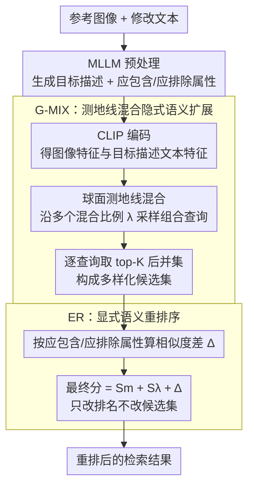

# G-MIXER: Geodesic Mixup-based Implicit Semantic Expansion and Explicit Semantic Re-ranking for Zero-Shot Composed Image Retrieval

**会议**: CVPR 2026  
**arXiv**: [2604.14710](https://arxiv.org/abs/2604.14710)  
**代码**: [github.com/maya0395/gmixer](https://github.com/maya0395/gmixer)  
**领域**: 多模态/视觉语言模型  
**关键词**: composed image retrieval, zero-shot, geodesic mixup, semantic expansion, re-ranking

## 一句话总结

提出 G-MIXER，通过测地线混合隐式语义扩展（在球面上沿不同混合比例扩展检索范围）和显式语义重排序（利用 MLLM 生成的属性过滤噪声候选），实现免训练零样本组合图像检索的 SOTA 性能。

## 研究背景与动机

组合图像检索 (CIR) 通过参考图像和修改文本联合检索目标图像。查询包含显式信息（文本中明确的修改）和隐式信息（图像中存在但文本未提及的视觉元素，如猫和篮子）。现有 MLLM 方法通过生成目标描述将隐式信息转为显式，但过度依赖文本模态，缺少对模糊检索本质（需考虑多样化候选组合）的处理，导致检索结果多样性和准确性下降。

## 方法详解

### 整体框架

G-MIXER 要解决组合图像检索（CIR）里一个被忽视的矛盾：查询既有文本明说的修改（显式信息），也有参考图里没被提及却该保留的视觉元素（隐式信息，如猫、篮子）；现有 MLLM 方法把隐式信息也转成文本描述，结果过度偏向文本模态、丢掉了检索本该有的多样性。它全程免训练，分三步走：先用 MLLM 从查询对（参考图像 + 修改文本）生成目标描述 $T_t$ 以及"应包含（Include）/应排除（Exclude）"两组重排属性；再用 **测地线混合（G-MIX）** 把目标描述与参考图像编码进 CLIP 超球面、沿不同混合比例铺开一簇查询，把召回范围撑大、得到并起来的多样化候选集；最后用 **显式语义重排序（ER）** 靠那两组属性把噪声候选筛掉、把精度补回来。MLLM 生成是即插即用的脚手架，真正的两个贡献模块是 G-MIX 与 ER；ER 只改排名、不改候选集大小。

### 关键设计

**1. 测地线混合（G-MIX）：在球面上构造多样化的隐式语义查询**

只把隐式信息转成文本会过度偏向文本、抹掉模糊检索本该考虑的多种候选组合。G-MIX 不在欧氏空间做线性插值，而是在 CLIP 的单位超球面上，沿参考图像特征 $f_i$ 与目标描述文本特征 $f_t$ 之间的**测地线路径**采样：$m_\lambda = f_t\frac{\sin(\lambda\theta)}{\sin\theta} + f_i\frac{\sin((1-\lambda)\theta)}{\sin\theta}$，其中 $\theta$ 为两特征夹角、$\lambda$ 为混合比例。$\lambda$ 越大文本指定的属性修改越突出，越小则图像的结构、背景信息保留越多；取一组比例（论文里 $\lambda$ 从 0.7 到 1.0、步长 0.1，共 $N{=}4$ 个）就把一次检索变成一簇沿球面排布的查询。每个比例各检索 top-$K$（如 top-100），做 min-max 归一化后取并集（多比例命中的候选取最大分），得到初始候选集 $\mathcal{R}_{\text{union}}$。走测地线而非直线，保证插值点始终落在超球面上，不破坏 CLIP 表示空间的几何结构。

**2. 显式语义重排序（ER）：用 MLLM 抽出的属性筛掉噪声候选**

多比例混合把召回撑大了，但也带进噪声候选。ER 不再依赖会混入隐式信息的整段 caption，而是让 MLLM 直接产出"应包含 $T_{in}$ / 应排除 $T_{ex}$"两组显式属性，作为重排依据。对候选集里每张图，分别算它与组合查询 $S_\lambda$、与 $T_{in}$ 的 $S_{in}$、与 $T_{ex}$ 的 $S_{ex}$，用 $\Delta = \mathrm{ReLU}(S_\lambda - S_{ex}) - \mathrm{ReLU}(S_\lambda - S_{in})$ 度量"该含的含了、该排的排了"的程度，最终分 $= S_m + S_\lambda + \Delta$ 重排。这一步只动排名、不改候选集大小，等于在高召回的基础上补一道显式语义的精筛，把多样性带来的精度损失找补回来。

### 损失函数 / 训练策略

免训练方法，无需额外训练。G-MIX 的多比例查询与各自检索结果的并集构成初始候选集，ER 阶段仅修改排名、不改变候选集大小。

## 实验关键数据

### 主实验

| 数据集 | 指标 | CIReVL | OSrCIR | G-MIXER |
|--------|------|--------|--------|---------|
| CIRCO | mAP@5 | 14.94 | 18.04 | **新SOTA** |
| CIRCO | mAP@25 | 17.00 | 20.94 | **新SOTA** |
| CIRR | R@1 | 23.94 | 25.42 | **新SOTA** |
| CIRR | R_Subset@1 | 60.17 | 62.31 | **新SOTA** |

在多个 ZS-CIR 基准上达到 SOTA。

### 消融实验

- G-MIX 多比例混合比单一比例显著提升多样性
- ER 重排序有效移除噪声候选，提升精度指标
- 测地线路径优于线性插值（保持超球面约束）

### 关键发现

- 隐式语义的多样性对检索覆盖率至关重要
- 显式和隐式语义的联合处理优于仅关注其中之一
- 测地线混合比欧氏空间混合更好保留表示空间的几何结构

## 亮点与洞察

- 将 CIR 中的隐式/显式信息分离和各自处理的思路清晰
- 测地线混合保持超球面约束的考虑很细致
- 免训练方法在 SOTA 上的竞争力证明了设计的有效性

## 局限与展望

- 多比例查询带来的检索次数线性增长
- 依赖 MLLM 的属性提取质量
- 对非英语场景的跨语言适用性未探讨

## 相关工作与启发

- 测地线路径插值可应用于其他需要球面表示操控的任务
- 显式/隐式分离处理思路对多模态检索有通用参考价值
- 免训练方法的成功说明 VLP 模型的对齐能力仍有很大挖掘空间

## 评分

7/10 — 方法设计优雅，免训练达 SOTA 有说服力，但检索效率和可扩展性需优化。

<!-- RELATED:START -->

## 相关论文

- [\[CVPR 2026\] Self-guided Semantic Inspection for Zero-Shot Composed Image Retrieval](self-guided_semantic_inspection_for_zero-shot_composed_image_retrieval.md)
- [\[CVPR 2026\] STiTch: Semantic Transition and Transportation in Collaboration for Training-Free Zero-Shot Composed Image Retrieval](stitch_semantic_transition_and_transportation_in_collaboration_for_training-free.md)
- [\[CVPR 2026\] Air-Know: Arbiter-Calibrated Knowledge-Internalizing Robust Network for Composed Image Retrieval](air-know_arbiter-calibrated_knowledge-internalizing_robust_network_for_composed_.md)
- [\[CVPR 2026\] Gravitation-Driven Semantic Alignment for Text Video Retrieval](gravitation-driven_semantic_alignment_for_text_video_retrieval.md)
- [\[CVPR 2026\] ReCALL: Recalibrating Capability Degradation for MLLM-based Composed Image Retrieval](recall_recalibrating_capability_degradation_for_mllm-based_composed_image_retrie.md)

<!-- RELATED:END -->
