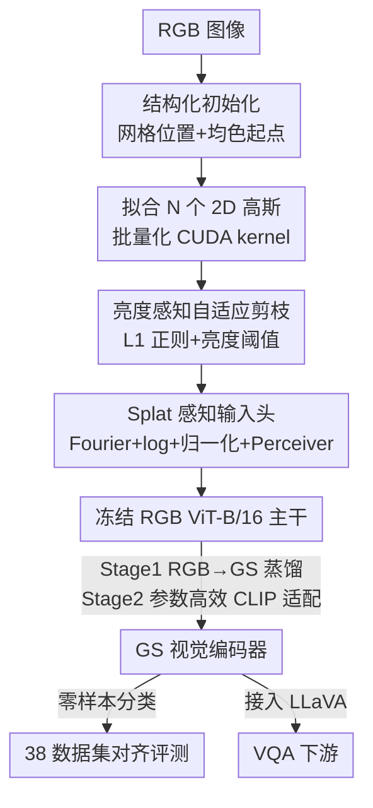

# GaussianVision: Vision-Language Alignment from Compressed Image Representations using 2D Gaussian Splatting

**会议**: CVPR 2026  
**论文**: [CVF Open Access](https://openaccess.thecvf.com/content/CVPR2026/html/Omri_GaussianVision_Vision-Language_Alignment_from_Compressed_Image_Representations_using_2D_Gaussian_CVPR_2026_paper.html)  
**代码**: https://github.com/Tambe-Lab/GaussianVision  
**领域**: 多模态VLM  
**关键词**: 2D高斯泼溅, 视觉-语言对齐, CLIP, 图像压缩表示, 视觉token压缩  

## 一句话总结
用一组各向异性 2D 高斯（位置+协方差+颜色）作为图像的紧凑替代表示喂给视觉-语言模型，通过"复用冻结的 RGB ViT 主干 + 轻量 splat 输入头 + 两阶段迁移训练"，在 12.8M DataComp 上把视觉输入压缩 3–23.5×、加载提速最高 31×，仍保住 RGB 基线 90–98% 的 38 数据集零样本精度，接入 LLaVA 后甚至在 6 个 VQA benchmark 上反超 RGB。

## 研究背景与动机
**领域现状**：现代 VLM 的视觉端几乎清一色是"RGB 像素图 → ViT patch 化 → CLIP 对比训练"的管线，把图像切成均匀网格 patch，投影成几百上千个视觉 token，再和文本 token 在共享空间里对齐。

**现有痛点**：这套范式继承了两个像素域的结构性低效。其一是**传输代价**：边端设备拍高分辨率 RGB 图、传到云端编码器做语义处理，移动上行链路约 0.1–0.2 kWh/GB，1 小时 1080p 视频传输要 0.38–0.68 kWh，规模化后能耗会吃掉运营预算。其二是 **token 爆炸**：LLaVA-1.5 一张 336×336 图就吐 576 个 token，LLaVA-NeXT 672×672 输入超 2880 个，而一句文本才 20–50 个；注意力是序列长度的平方复杂度，token 越多越贵。

**核心矛盾**：大量证据表明这些视觉 token 极度冗余——丢掉多达 89% 的视觉 token 对 VQA 几乎没影响、有时还涨点，连随机采样都很有竞争力。但现有的 PruMerge / VisionZip / FastV / ToMe 等都是**事后剪枝**：先生成稠密 patch token、再砍掉，是给"架构性低效"贴创可贴，没有从源头改变"表示必须来自稠密像素网格"这个假设。

**本文目标**：能不能直接用一种**天生紧凑、语义丰富、对学习系统友好**的中间表示来做视觉-语言对齐，而不是事后压缩？子问题有二：(1) 如何让 2DGS 拟合在百万级图像规模上可行；(2) 如何把成熟的 CLIP/RGB 编码器迁移到这种全新的输入形态上。

**切入角度**：RGB 像素阵列是为人眼感知设计的、空间相关性稠密、细节远超模型所需；而机器学习系统其实更需要强调语义和结构、丢掉感知冗余的抽象表示。2D Gaussian Splatting（2DGS）正好提供这样一种用稀疏各向异性高斯参数化图像的紧凑、空间自适应表示。

**核心 idea**：把图像换成"一小撮带颜色的 2D 高斯"作为视觉底座，复用冻结的 RGB ViT 主干、只训一个 splat 感知输入头，把高斯特征对齐到 RGB 学到的几何流形上，从而在大幅压缩的同时保住对齐质量——这是首个把 2DGS 大规模用于视觉-语言预训练的工作。

## 方法详解

### 整体框架
GaussianVision 的全流程是：原始 RGB 图先被**拟合成 N 个 2D 高斯**（每个 8 个参数：2D 位置、各向异性协方差、颜色），这一步要靠结构化初始化 + 自适应剪枝 + 批量化 CUDA kernel 让百万级拟合变得可行；拟合好的高斯集合作为唯一视觉输入，经过一个**splat 感知输入头（GS stem）**编码成 token，送进一个**权重复用自 RGB ViT-B/16 的冻结 Transformer 主干**，再用 Perceiver resampler 把可配置数量的高斯点重采样成固定个 token；整个 GS 编码器通过**两阶段迁移训练**（先 RGB→GS 蒸馏、再参数高效 CLIP 适配）落地。最终既能做零样本分类（对齐质量探针），也能整体接进 LLaVA 做 VQA。

2DGS 的图像重建本身遵循高斯叠加：每个像素强度由所有高斯的贡献加权求和，

$$\hat{I}(x,y)=\sum_{i=1}^{n}\mathbf{c}_i\exp\!\Big\{-\tfrac{1}{2}\big([x,y]^\top-\boldsymbol{\mu}_i\big)^\top\boldsymbol{\Sigma}_i^{-1}\big([x,y]^\top-\boldsymbol{\mu}_i\big)\Big\}$$

其中 $\boldsymbol{\mu}_i$ 是高斯中心、$\boldsymbol{\Sigma}_i$ 是 2×2 协方差、$\mathbf{c}_i$ 是颜色。2DGS 不需要深度排序，渲染极快（1500–2000 FPS，约 JPEG 解码 3 倍速）。

### 关键设计

**1. 结构化初始化：用像素先验替代随机初始化、加速 2DGS 收敛**

3DGS 因为场景几何未知、只能从多视角稀疏观测里"探索"高斯，所以习惯随机初始化；但 2D 图像在每个像素位置都直接给了空间组织和颜色，把这套随机初始化照搬过来纯属浪费先验。本文从三处吃掉像素先验：位置上让每个高斯中心落在均匀网格上以最大化空间覆盖，让每个区域一开始就有表示容量；协方差初始化为各向同性、对应网格格子内能放下的最大圆；颜色直接取该格子内所有像素的平均 RGB，让每个高斯一出生就有局部合适的颜色。效果立竿见影：4900 个高斯、3000 次迭代下结构化初始化拿到 35.25 PSNR，随机初始化只有 28.24；即使压到 400 个高斯也有 22.04 vs 17.77，既快收敛又有更高的渐近质量。

**2. 亮度感知自适应剪枝：L1 正则 + 亮度阈值砍掉低贡献高斯**

要在压缩和语义保真间取舍，就得在优化中智能删掉冗余高斯。本文两步走：拟合时在颜色通道上加 L1 惩罚鼓励稀疏，把低贡献高斯的颜色参数往零推，自然把它们变成可删候选，目标为

$$\mathcal{L}_{\mathrm{GS}}=\frac{1}{B}\sum_{b=1}^{B}\Big[\tfrac{1}{HW}\|\hat{\mathbf{I}}^{(b)}-\mathbf{I}^{(b)}\|_2^2+\lambda_{\mathrm{reg}}\|\mathbf{C}^{(b)}\|_1\Big]$$

前项是逐像素 L2 重建误差、后项是对所有高斯颜色系数的 L1 正则。拟合结束后再做**信息密度感知剪枝**：按亮度分数 $s_{b,n}=0.2126|R_{b,n}|+0.7152|G_{b,n}|+0.0722|B_{b,n}|$ 衡量每个高斯的贡献，保留集为 $\mathcal{K}^{(b)}=\{n\mid s_{b,n}\ge\tau_{\mathrm{th}}\}$，低于亮度阈值 $\tau_{\mathrm{th}}$ 的高斯颜色被置零、不再参与渲染。关键观察是：**先给大预算再剪**通常比一开始就小预算得到更高 PSNR——初始表示里的冗余反而有利于稀疏化；大预算模型（1600–3136 点）能容忍 60–80% 的激进剪枝、PSNR 只掉 2–5 dB。

**3. Splat 感知输入头（GS stem）：把无序高斯参数翻译成 ViT 能吃的 token**

高斯参数和 patch embedding 是两套完全不同的形态，不能直接喂进 ViT。GS stem 是个轻量输入头，把每个高斯的位置/协方差/颜色经 **Fourier 特征 + log 缩放 + 归一化层 + 投影**编码成 token embedding，再配一个 **Perceiver resampler** 把可配置数量（{400,900,1600,3136}）的高斯点重采样成固定个视觉 token——token 数等于 Perceiver 的 latent query 个数（196 或 98）。这就把"高斯数"和"token 数"解耦了：可以用很多高斯保真、却只产出很少 token，正是它能在 token 减半（196→98）时相对精度只掉 <2% 的原因。

**4. 两阶段迁移训练：先蒸馏对齐 RGB 流形、再参数高效 CLIP 适配**

直接从原始 2DGS 输入从头训 CLIP 收敛很差，但把 GS 特征对齐到预训练 RGB 嵌入空间能极大加速收敛——这促成两阶段配方。**Stage 1（RGB→GS 蒸馏）**：GS 编码器的 Transformer 主干和 RGB ViT-B/16(Small) 共享权重并冻结，只训 GS stem，用 RGB 教师与 GS 学生**经 L2 归一化的 CLS embedding 之间的 MSE loss** 训 2 个 epoch，把 splat 表示对齐到 RGB 学到的几何流形上。**Stage 2（参数高效 CLIP 适配）**：冻结文本编码器，做 5 个 epoch CLIP 对比训练，只解冻 ~9.7% 的参数（GS stem + 前两个 Transformer block + 视觉端最后的归一化和投影层）；warmup 后可选地再解冻对称的一组文本端 adapter 层（最后一个 transformer block、最后的 norm、projection），把可训参数升到 ~13.8%、换来小幅精度提升。整套只训 9.7–13.8% 的参数就能快速收敛，这是它能把成熟 RGB 编码器低成本迁移到全新输入形态的关键。

### 损失函数 / 训练策略
- Stage 1：L2-normalized CLS embedding 的 MSE 蒸馏，2 epoch，只训 GS stem。
- Stage 2：标准 CLIP 对比损失，5 epoch，解冻 9.7%（可选 13.8%）参数。
- 拟合阶段：L2 重建 + L1 颜色正则（见关键设计 2 的 $\mathcal{L}_{\mathrm{GS}}$）。
- VLM 集成：照搬 LLaVA recipe + Vicuna-7B —— (1) 在 ~558K LAION-CC-SBU 子集上做多模态对齐预训练（只解冻 projector）；(2) 用 LLaVA-v1.5 ~665K 混合指令集做监督指令微调（解冻 projector + LLM）。

## 实验关键数据

### 主实验
RGB 参考模型为在 12.8M DataComp 上训练的 CLIP ViT-B/16(Small)（width-512，38M 参数）。压缩比按 $\text{Compression}=\frac{224\times224\times3\times1\text{B}}{N_{\text{GS}}\times8\times2\text{B}}$ 计（每个 splat 存 8 个 FP16 参数）。下表为 38 数据集零样本对齐结果（精度为 38 集均值，Rel. 相对 RGB 196-token 基线）：

| 视觉编码器 | 每图参数 | 压缩比 | 加载+解码提速 | 196-token 精度 (Rel.) | 98-token 精度 (Rel.) |
|------------|----------|--------|----------------|------------------------|------------------------|
| RGB (224×224) 基线 | 150,528 | 1.00× | 1.00× | 22 (1.00) | 19 (0.87) |
| GS (3136) | 25,088 | 3.00× | 6.71× | 20 (0.98) | 20 (0.96) |
| GS (1600) | 12,800 | 5.88× | 13.43× | 20 (0.96) | 20 (0.95) |
| GS (900) | 7,200 | 10.45× | 18.80× | 20 (0.92) | 19 (0.91) |
| GS (400) | 3,200 | 23.52× | 31.33× | 19 (0.91) | 19 (0.92) |

3136/1600 点 GS 模型在 3–6× 压缩、最高 13× 加载提速下保住 RGB 96–98% 精度；400/900 点在 10–23.5× 压缩下仍保 90–92%。token 196→98 对 GS 影响极小（<2%），说明 GS 表示的语义信号更"浓缩"。

接入 LLaVA(Vicuna-7B) 后在 6 个 VQA benchmark 上的结果（加粗=该行最高；GS 反超 RGB 处见正文）：

| Benchmark | RGB | GS-3136(196) | GS-1600(196) | GS-900(196) | GS-400(196) |
|-----------|-----|--------------|--------------|-------------|-------------|
| SQA-IMG | 63.81 | 64.70 | **64.85** | **64.95** | 64.80 |
| TextVQA | 44.66 | **45.20** | 44.71 | 44.29 | 44.60 |
| POPE | 77.83 | 77.80 | **78.13** | 77.32 | 76.91 |
| MME | 1398.98 | **1414.37** | 1379.26 | 1336.83 | 1297.56 |
| MM-Vet | 16.60 | **19.40** | 16.50 | 14.70 | 16.70 |
| GQA | 51.42 | **52.25** | 51.52 | 49.27 | 50.21 |

尽管表示复杂度更低，GS 编码器在 6 个 VQA benchmark 上整体一致优于 RGB——多数行的最优值都落在某个 GS 变体上。

### 消融实验
结构化初始化与剪枝的关键分析：

| 配置 | 关键指标 | 说明 |
|------|----------|------|
| 结构化初始化 (4900 高斯, 3000 iter) | PSNR 35.25 | vs 随机初始化 28.24，收敛更快、渐近更优 |
| 结构化初始化 (400 高斯) | PSNR 22.04 | vs 随机 17.77，极端压缩下优势更明显 |
| 大预算剪枝 (1600–3136 点) | 剪 60–80%，PSNR 掉 2–5 dB | 初始冗余有利稀疏化 |
| 3136 点, $\lambda_{\mathrm{reg}}{=}0,\tau_{\mathrm{th}}{=}0$ | PSNR 37.43 (0% 剪) | 未剪枝上界 |
| 3136 点, $\lambda_{\mathrm{reg}}{=}10^{-6},\tau_{\mathrm{th}}{=}0.05$ | PSNR 31.1 (剪 23.72%) | 剪近四分之一仍保高保真 |

系统侧：批量化 CUDA kernel 在 batch 4096、每图 400 高斯下相对 [38] baseline 提速 90.3×，GPU 利用率 97%（Nsight Compute 实测）。

### 关键发现
- **冗余有益稀疏化**：先大预算再剪 > 一开始就小预算，初始表示里的冗余是好事，这反直觉但被 PSNR 曲线证实。
- **token 与高斯解耦**：GS 在 token 减半时几乎不掉点，说明语义信号"浓缩"在高斯里，patch token 的冗余远高于高斯。
- **GS 在 VQA 上反超 RGB** ⚠️：下游 VQA 一致优于 RGB，但论文也坦言 GS 平均零样本精度略低、对分布漂移更敏感——两者并不矛盾（VQA 6 个 benchmark vs 38 集均值是不同切面，不可直接比大小）。

## 亮点与洞察
- **把"表示优先"摆到"事后压缩"前面**：核心洞察是与其生成稠密 patch token 再剪枝，不如一开始就用紧凑结构化表示——这从范式上区别于所有 post-hoc token reduction 工作。
- **复用冻结 RGB 主干 + 只训输入头**是把全新输入形态接进成熟编码器的便宜办法：只训 9.7–13.8% 参数就能迁移，思路可推广到任何"非像素视觉底座"（点云、INR、码本 token）想蹭 ViT 先验的场景。
- **高斯数与 token 数解耦**（Perceiver resampler）很巧：让传输/存储侧的压缩比和注意力侧的 token 预算各自独立调，两个低效问题被一并处理。
- **传输能耗视角**少见但务实：从边-云能耗（kWh/GB）出发论证视觉表示的压缩价值，而非只盯着精度。

## 局限与展望
- **拟合本身仍非平凡**（作者承认）：即便有批量 CUDA kernel，迭代优化器每个 batch 仍要数秒才能产出高质量 splat，需硬件加速进一步扩展规模。
- **从头训 GS-CLIP 收敛差**：当前架构和位置编码尚未与 splat 几何最优匹配，只能靠 RGB 教师蒸馏绕过，意味着 GS 性能被 RGB 教师质量"封顶"。
- **对分布漂移更敏感**：38 集均值精度略低于 RGB，说明 GS-原生架构还没有现代 ViT 那种内建归纳偏置和鲁棒性，域偏移下的泛化是关键开放方向。
- ⚠️ 论文正文给出的零样本精度是"38 集均值"的整数（如 20/22），偏聚合，单数据集细节需看 Fig. 6 与附录。
- 改进思路：探索 GS-原生位置编码 / 归纳偏置，让它不再依赖 RGB 教师；把拟合做成前馈预测（一次过出 splat）以去掉迭代优化的几秒开销。

## 相关工作与启发
- **vs PruMerge / VisionZip / FastV / ToMe（事后 token 剪枝）**：它们都假设最优表示必须来自稠密像素网格、只能事后压；本文从源头换表示，是"结构优先"而非"创可贴"，且压缩的是传输与存储、不只是注意力预算。
- **vs GaussianImage / LIG / GSVC（2DGS 做图像/视频压缩）**：它们把 2DGS 当编解码器追求率失真；本文把 2DGS 当**视觉-语言对齐的可学习底座**，目标是文本对齐质量而非重建保真。
- **vs GViT / GaussianToken（2DGS 做视觉任务）**：前者联合优化高斯 + ViT 做 ImageNet 分类、后者用 VQ 码本量化高斯做 tokenizer，但都局限于小规模；本文是首个把 2DGS 放进大规模视觉-语言预训练（12.8M）的研究。
- **vs INR（隐式神经表示）**：INR 保真高但优化昂贵、不适合大规模管线；2DGS 渲染快约 5×、解码快几个数量级，更适合喂训练流水线。

## 评分
- 新颖性: ⭐⭐⭐⭐⭐ 首个把 2DGS 大规模用于视觉-语言对齐，从"事后压缩"转向"表示优先"的范式探索。
- 实验充分度: ⭐⭐⭐⭐ 38 零样本 + 6 VQA + 系统侧 profiling 都覆盖，但零样本精度只报聚合整数、缺更细粒度对比。
- 写作质量: ⭐⭐⭐⭐⭐ 动机（能耗+token 爆炸）讲得清，方法与系统优化层次分明，局限坦诚。
- 价值: ⭐⭐⭐⭐ 为边-云高效多模态和"非像素视觉底座"开了头，但拟合开销和域偏移鲁棒性仍是落地门槛。

<!-- RELATED:START -->

## 相关论文

- [\[CVPR 2026\] Proxy3D: Efficient 3D Representations for Vision-Language Models via Semantic Clustering and Alignment](proxy3d_efficient_3d_representations_for_vision-language_models_via_semantic_clu.md)
- [\[ICML 2026\] Benchmarking and Enhancing VLM for Compressed Image Understanding](../../ICML2026/multimodal_vlm/benchmarking_and_enhancing_vlm_for_compressed_image_understanding.md)
- [\[CVPR 2025\] 4D LangSplat: 4D Language Gaussian Splatting via Multimodal Large Language Models](../../CVPR2025/multimodal_vlm/4d_langsplat_4d_language_gaussian_splatting_via_multimodal_large_language_models.md)
- [\[CVPR 2026\] LLMind: Bio-inspired Training-free Adaptive Visual Representations for Vision-Language Models](llmind_bio-inspired_training-free_adaptive_visual_representations_for_vision-lan.md)
- [\[CVPR 2026\] UNI-OOD: Unified Object- and Image-level Out-of-Distribution Detection via Cross-Context Attentive Vision-Language Modeling](uni-ood_unified_object-_and_image-level_out-of-distribution_detection_via_cross-.md)

<!-- RELATED:END -->
