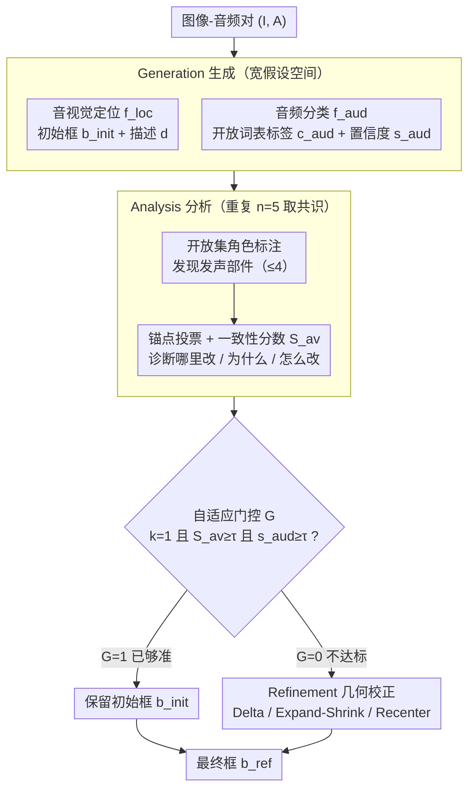

# Generate, Analyze, and Refine: Training-Free Sound Source Localization via MLLM Meta-Reasoning

**会议**: CVPR 2026  
**arXiv**: [2604.06824](https://arxiv.org/abs/2604.06824)  
**代码**: [https://github.com/VisualAIKHU/GAR-SSL](https://github.com/VisualAIKHU/GAR-SSL)  
**领域**: 多模态VLM  
**关键词**: 声源定位, 多模态大语言模型, 训练免微调, 元推理, 音视频一致性

## 一句话总结

本文提出了一个无需训练的声源定位框架 GAR-SSL，通过将声源定位重新建模为"生成-分析-精炼"的三阶段元认知推理过程，直接利用多模态大语言模型 (MLLM) 的内在推理能力进行音视频定位，在单源和多源定位基准上取得了与训练方法可比甚至更优的性能。

## 研究背景与动机

1. **领域现状**：声源定位 (SSL) 旨在通过音频和视觉信息的关联来识别图像中声音来源的位置。现有方法主要分为两类——基于对比学习的单源方法和基于伪标签/图关系建模的多源方法，核心思路都是特征匹配。
2. **现有痛点**：所有这些方法都将 SSL 简单视为特征匹配问题，仅关注对齐音频和视觉嵌入，缺乏对匹配区域是否真正对应声源的验证和因果推理。这导致在复杂声学场景（静音物体、画外音、多声源）中表现受限。
3. **核心矛盾**：人类定位声源时会经历多步推理过程——先感知音视觉信号特征，再系统分析候选物体，最后精炼结论。这种有意义的解释和验证过程远超简单匹配，但现有方法完全忽略了这一点。
4. **本文目标** 如何在不进行任何训练的前提下，利用 MLLM 的推理能力进行可解释的声源定位？具体包括：(a) 如何生成候选声源；(b) 如何验证候选的合理性；(c) 如何精炼定位结果。
5. **切入角度**：受人类元认知过程启发，作者观察到 MLLM 已具备强大的跨模态理解、结构化推理和指令跟随能力，可以直接作为推理引擎而非辅助编码器来使用。
6. **核心 idea**：将 SSL 重新建模为由粗到细的三阶段认知推理程序（生成→分析→精炼），全程通过 prompt engineering 驱动 MLLM 完成，无需任何训练。

## 方法详解

### 整体框架

GAR-SSL 想解决的核心问题是：现有声源定位都把任务当成"音频嵌入对齐视觉嵌入"的特征匹配，匹配上哪块区域就当声源，从不验证那块区域是否真的会发声。本文换了一条路——给定图像-音频对 $(I, A)$，不训练任何模型，而是把 MLLM 当推理引擎，让它像人一样"先猜、再查、后改"地走一遍。流程分三阶段：Generation 先给出一个初始 bounding box $b^{\text{init}}$ 和音频标签；Analysis 把这个框拿去和音视觉证据对质，算出它有多可信；Refinement 只在框确实不靠谱时才动手做几何校正。三个阶段全部用 prompt 驱动 MLLM、输出结构化 JSON，前一阶段的结论作为后一阶段的输入逐级收紧。

### 关键设计

**1. Generation：用"宽假设空间"代替单点匹配，先别急着定死声源**

传统方法直接把音频特征匹配到最像的那块区域，一旦初始猜错就没有回头路。生成阶段反其道而行，故意放宽假设：它跑两个相互独立的子任务，音视觉定位子任务 $f_{\text{loc}}(I,A) = (b^{\text{init}}, d)$ 产出初始框和一段自然语言描述，音频分类子任务 $f_{\text{aud}}(A) = (c_{\text{aud}}, s_{\text{aud}})$ 单独从音频预测开放词表标签和置信度。两者刻意不互相约束，因为听到敲击声时真正的声源可能是鼓，也可能是桌子或拍手——这一阶段只负责把所有可能发声的物体都纳入考虑，不遗漏候选，至于谁对谁错交给下一阶段对质。两个子任务的一致性正是后面 Analysis 要评估的对象。

**2. Analysis 之一：开放集角色标注，把"声源"拆成会发声的部件**

光知道"这是鼓声"还不够，得知道画面里哪个具体部件在产生这个声音。角色发现函数 $\mathcal{T}_{\text{role}} = f_{\text{role}}(I, A, c_{\text{aud}})$ 在音频标签的语境下，让 MLLM 自由发现与发声直接相关的角色/部件（如"鼓槌""击打的手"），最多 4 个，且施加可见性约束 $\text{vis}(t|I) = 1$ 保证每个角色都在当前帧里看得见。这一步不依赖任何预定义类别表，发现出来的部件给后续精炼提供了语义锚靶——精炼时该往哪挪、往哪缩，都朝这些"真正发声的组件"对齐，而不是漫无目的地调框。

**3. Analysis 之二：锚点投票算出音视觉一致性分数，并用多次共识去噪**

有了角色还要量化"当前这个框到底有多对"。锚点投票函数 $\mathcal{A}_{\text{anchor}} = f_{\text{anchor}}(I,A,c_{\text{aud}},b^{\text{init}})$ 发现具体的语义锚点（如"鼓槌敲击鼓面")并给出置信度，再由 $\mathcal{S}_{\text{av}} = f_{\text{con}}(\cdot) \in [0,1]$ 综合判断预测框与这些音视觉证据的对齐程度。由于 MLLM 解码有随机性，单次判断会抖动，所以这里跑 $n=5$ 次取共识：一致性分数取平均、角色标注按出现频率选、锚点按置信度聚合、是否保留原框做多数投票。和"对/不对"的二元判断不同，这一阶段给出的是"哪里要改、为什么、怎么改"的结构化诊断，直接喂给 Refinement。

> ⚠️ 多次共识的具体聚合规则以原文为准。

**4. Refinement：自适应门控，只在该改的时候才改**

精炼阶段最关键的不是"怎么改框"，而是"判断要不要改"——因为初始预测如果已经很准，强行调整反而会把它弄坏。门控决策只有在三个条件同时成立时才放行保留（$G=1$）：保持标志 $k=1$、一致性分数 $\mathcal{S}_{\text{av}} \geq \tau_{\text{av}}$、音频置信度 $s_{\text{aud}} \geq \tau_{\text{aud}}$；任一不达标即 $G=0$，触发几何校正。校正用四种操作落实 Analysis 给出的诊断：Delta 用锚点加权质心平移框，Expand/Shrink 按外部锚点比例缩放，Recenter 在保持框大小的前提下把中心挪到目标位置。这套"先验证、不达标才动手"的设计避免了对可靠预测的过度调整，是它在多源场景稳住性能的关键。

### 一个完整示例

以一段"鼓声"音频配一张乐队照片为例，走一遍三阶段如何把框逐步收紧：

- **Generation**：音视觉定位子任务给出初始框 $b^{\text{init}}$（套在鼓附近但偏大、把旁边的鼓手半个身子也框进去了），音频分类子任务独立输出标签 `drum`、置信度 $s_{\text{aud}}=0.82$。
- **Analysis**：角色发现得到 `{鼓槌, 击打的手, 鼓面}` 三个可见部件；锚点投票跑 5 次，发现锚点"鼓槌敲击鼓面"高置信，但初始框中心偏离鼓面，5 次共识算出一致性 $\mathcal{S}_{\text{av}}=0.46$，保持标志多数投票为 $k=0$。
- **Refinement**：门控检查 $\mathcal{S}_{\text{av}}=0.46 < \tau_{\text{av}}=0.5$，不达标 → $G=0$，触发校正；按锚点加权质心做 Delta 平移把框中心拉到鼓面，再 Shrink 掉多框进来的鼓手部分，输出最终框。

如果换成初始框本就精准的简单单源样本，Analysis 会给出 $\mathcal{S}_{\text{av}}=0.9$、$k=1$，三个门控条件全过、$G=1$，直接保留初始框、跳过几何校正——这正是自适应门控避免过度调整的体现。

### 损失函数 / 训练策略

本方法无需训练，全部通过 MLLM (Qwen2.5-Omni-7B) 的 prompt engineering 实现。门控机制使用固定阈值：音频置信度 0.75、音视觉一致性 0.5。

## 实验关键数据

### 主实验

**多源声源定位（VGGSound-Duet / MUSIC-Duet）：**

| 方法 | VGGSound-Duet CIoU@0.3 | MUSIC-Duet CIoU@0.3 | MUSIC-Duet AUC |
|------|------------------------|---------------------|----------------|
| OA-SSL (CVPR'25, 训练方法) | 55.2% | 45.9% | 36.1% |
| Qwen2.5-Omni (直接用MLLM) | 42.6% | 50.6% | 40.8% |
| **GAR-SSL (N=5)** | **77.6%** | **82.7%** | **53.2%** |

**单源声源定位（VGGSound-Single / MUSIC-Solo）：**

| 方法 | VGGSound-Single AP | VGGSound IoU@0.5 | MUSIC-Solo IoU@0.5 |
|------|-------------------|-----------------|-------------------|
| OA-SSL (CVPR'25) | 51.7% | 47.3% | 71.1% |
| **GAR-SSL (N=5)** | **60.5%** | **60.2%** | **98.5%** |

### 消融实验

| 配置 | VGGSound-Duet CIoU@0.3 | AUC | 说明 |
|------|------------------------|-----|------|
| 仅 Stage 1 | 42.6% | 28.3% | 只有生成阶段 |
| Stage 1+2+3 (N=3) | 59.5% | 38.2% | 完整流水线 |
| Stage 1+2+3 (N=5) | 77.6% | 45.8% | 增加分析迭代次数 |

| MLLM 骨干 | CAP | CIoU@0.3 | AUC |
|-----------|-----|----------|-----|
| Qwen2.5-Omni-3B | 39.9% | 49.8% | 33.0% |
| Qwen2.5-Omni-7B | 43.5% | 59.5% | 38.2% |

### 关键发现

- Analysis+Refinement 阶段对多源场景的 CIoU@0.3 贡献了 +16.9 个百分点，表明迭代分析和精炼对候选框一致性提升至关重要
- 增加分析迭代次数 N 从 1 到 5 持续提升性能，N=5 时在 MUSIC-Duet 上 CIoU 从 80.7% 提升到 82.7%
- 更大的 MLLM (7B vs 3B) 在所有指标上均有提升，说明 MLLM 的推理能力是性能的关键瓶颈
- 在 MUSIC-Duet 上以 CIoU@0.3 衡量，GAR-SSL 超过最好的训练方法 OA-SSL 达 36.8 个百分点

## 亮点与洞察

- **将 SSL 重建为认知推理过程**：不同于把声源定位当作特征匹配，而是模拟人类"粗到细"的推理过程，这种范式转换使得 MLLM 的推理能力得到充分发挥
- **开放集角色标注与锚点投票**：不依赖预定义类别，而是让 MLLM 自由发现与声音产生相关的部件和证据，提供可解释的推理路径
- **自适应门控机制**：简单但有效的设计——只有当初始预测不够好时才执行精炼，避免了"过度调整"导致的性能退化。这种思路可以迁移到任何多阶段推理系统中
- 该框架展示了 MLLM 在复杂多模态感知任务中作为零样本推理引擎的巨大潜力，无需任何训练即可超越大量专门设计的训练方法

## 局限与展望

- **推理效率问题**：每个样本需要约4秒推理，且Analysis阶段的多次迭代进一步增加了时间开销
- **性能高度依赖底层MLLM能力**：从3B到7B有显著提升，但更大模型的推理成本也更高
- **缺乏时序推理**：当前方法仅处理单帧，未利用视频的时序信息，限制了在动态场景中的表现
- **仅在VGGSound和MUSIC数据集上验证**：未在更多真实世界场景（如嘈杂环境、多声源重叠）中测试泛化能力

## 相关工作与启发

- **vs OA-SSL (CVPR'25)**：OA-SSL 使用 MLLM 作为辅助编码器来训练视觉模型，本文则完全不训练，直接用 MLLM 作推理引擎。本文在多源场景上大幅领先，说明 MLLM 的推理能力被之前的方法严重低估
- **vs 直接使用MLLM (Qwen2.5-Omni)**：直接让 MLLM 做声源定位效果一般（CIoU 42.6%），但通过本文的结构化推理流程提升到 77.6%，说明prompt设计和推理结构化至关重要
- 该框架的"生成-分析-精炼"范式是通用的多阶段推理模式，可迁移到其他需要空间定位的多模态任务中

## 评分

- 新颖性: ⭐⭐⭐⭐ 将SSL重建为元认知推理过程的思路新颖，但核心仍是prompt engineering
- 实验充分度: ⭐⭐⭐⭐ 在多个基准上验证，消融完整，但缺少更多真实场景测试
- 写作质量: ⭐⭐⭐⭐ 论文结构清晰，数学形式化完善，但公式化过度使部分内容显得冗余
- 价值: ⭐⭐⭐⭐ 展示了MLLM在零样本多模态定位中的潜力，对训练范式的反思有启发意义

<!-- RELATED:START -->

## 相关论文

- [\[CVPR 2026\] Hear you are: Teaching LLMs Spatial Reasoning with Vision and Spatial Sound](hear_you_are_teaching_llms_spatial_reasoning_with_vision_and_spatial_sound.md)
- [\[CVPR 2026\] Vision-Language Model Guided Source-Free Domain Adaptation via Optimal Transport](vision-language_model_guided_source-free_domain_adaptation_via_optimal_transport.md)
- [\[AAAI 2026\] Filter, Correlate, Compress: Training-Free Token Reduction for MLLM Acceleration](../../AAAI2026/multimodal_vlm/filter_correlate_compress_training-free_token_reduction_for_.md)
- [\[CVPR 2026\] PAS: A Training-Free Stabilizer for Temporal Encoding in Video LLMs](pas_a_training-free_stabilizer_for_temporal_encoding_in_video_llms.md)
- [\[CVPR 2026\] EgoSound: Benchmarking Sound Understanding in Egocentric Videos](egosound_benchmarking_sound_understanding_in_egocentric_videos.md)

<!-- RELATED:END -->
