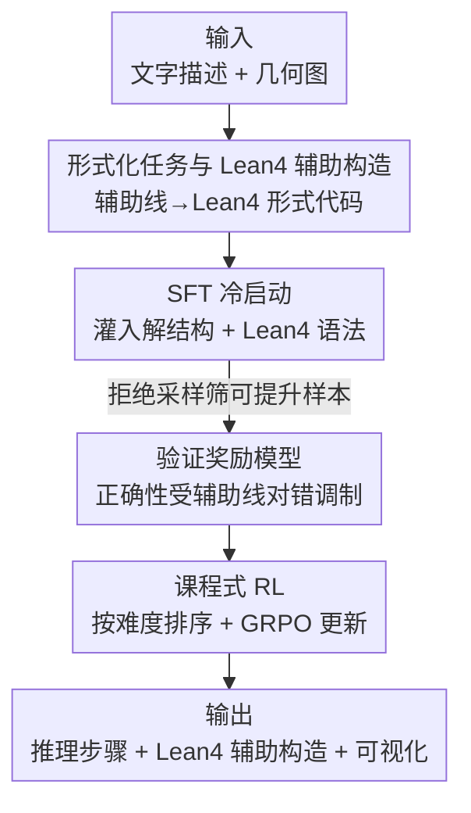

# Geoint-R1: Formalizing Multimodal Geometric Reasoning with Dynamic Auxiliary Constructions

**会议**: CVPR 2026  
**论文**: [CVF Open Access](https://openaccess.thecvf.com/content/CVPR2026/html/Wei_Geoint-R1_Formalizing_Multimodal_Geometric_Reasoning_with_Dynamic_Auxiliary_Constructions_CVPR_2026_paper.html)  
**代码**: 无（论文未提供）  
**领域**: 多模态VLM  
**关键词**: 几何推理, 辅助线构造, Lean4形式化, 验证奖励模型, 课程学习  

## 一句话总结
Geoint-R1 把"画辅助线 + 形式化证明"做成一个可验证的多模态几何推理任务：用 Lean4 把动态辅助构造编码成形式语言，配一个验证奖励模型（正确性受辅助线对错调制）驱动课程式强化学习，让一个 7B 模型在自建的 Geoint 基准上平均超过 GPT-4o / Gemini-1.5-pro。

## 研究背景与动机
**领域现状**：近两年多模态大模型（MLLM）在数学/视觉推理任务上进步很快，但主流做法都是把几何题当成"看图+文字答题"——直接输出一个答案或一段自然语言证明，不涉及对图形本身的操作。

**现有痛点**：很多几何题（尤其立体几何、平面几何证明）人类要先"画辅助线"才能解——连对角线交点、过某点作平行线等。现有 MLLM 既画不出这些辅助元素，也无法形式化地表达和验证它们，导致证明步骤残缺、逻辑跳步（论文 Figure 1：人类加 AC、OE 辅助线后推理完整，MLLM 直接上向量却"画不出图、推不下去"）。

**核心矛盾**：几何推理既要**语义正确**（结论对），又要**形式严谨且可视化**（每一步都站得住、辅助元素能画出来并被机器核验）。现有方法把这两件事都丢给一段自由文本，既没有可验证的形式表示，也没有针对"辅助线是否构造正确"的监督信号。

**本文目标**：定义并解决一个新任务——**形式几何推理**：给定文字描述 $T_i$ 和几何图 $I_i$，生成一个完整且可形式验证的解，包括推理步骤 $P_i$、（必要时的）辅助构造 $C_i$ 和最终答案 $A_i$。

**切入角度**：用 Lean4 证明助手把几何元素、关系和动态加的辅助线统一编码成形式语言——这样"辅助线对不对""证明完不完整"就从模糊的人类判断变成可结构化打分的对象，能直接接进强化学习的奖励里。

**核心 idea**：把辅助构造写成 Lean4 形式代码，用一个对"辅助线正确性"敏感的验证奖励模型，配课程式 RL，逼模型学会"先正确画辅助线、再给可验证证明"。

## 方法详解
### 整体框架
Geoint-R1 训练一个模型 $\mathcal{F}_\theta$，输入是几何题的文字 $T_i$ 加图 $I_i$，输出形式化解元组：

$$(P_i, C_i, A_i) = \mathcal{F}_\theta(T_i, I_i)$$

其中 $P_i$ 是推理步骤、$C_i$ 是用 Lean4 表示的辅助构造（无需辅助线时 $C_i=\varnothing$）、$A_i$ 是最终答案。整个系统建立在 Qwen2.5-VL-7B 之上，分两个阶段：先用 SFT 把"几何解的结构 + Lean4 语法"灌进基座模型，再用一个验证奖励模型引导课程式强化学习（GRPO），优化语义正确性与逻辑严谨性。关键的"辅助线对不对"信号贯穿奖励设计，是把答题模型升级成"会画辅助线的形式证明器"的核心。

### 关键设计

**1. 形式几何推理任务与 Lean4 辅助构造：把"画辅助线"变成可验证的形式对象**

针对"辅助线只能靠自由文本含糊描述、无法核验"这个根本痛点，本文把几何解显式拆成 $(P_i, C_i, A_i)$ 三元组，并用 Lean 4 证明助手来表示几何元素与辅助构造。例如把点定义成 `def A : Point := { x := 0, y := 5 }`、把图的边表示成 `def edges : List Edge := [⟨A, B, …⟩]`，再在此基础上 `Add Auxiliary Line code`（动态追加辅助线对应的 Lean4 代码）。这样一来，"过点 E 作 AB 的平行线 MN""连对角线交点 O 并连 OE"这类操作就成了可被解析、可被核验、可被可视化的结构化代码，而不是一句机器无法判定对错的自然语言。形式化是后续奖励设计和评测能"细到辅助线对不对"的前提——没有它，强化学习就没有可靠的监督信号可学。

**2. SFT 冷启动：先教会基座"几何解长什么样 + Lean4 怎么写"**

强化学习若直接在基座上跑，模型连合法的 Lean4 语法和证明骨架都写不出，奖励信号会非常稀疏。所以第一阶段在带参考解的数据集 $\mathcal{D}=\{(T_i, I_i, P_i^{ref}, C_i^{ref}, A_i^{ref})\}$ 上做标准 teacher-forcing 监督微调，最小化负对数似然：

$$\mathcal{L}_{SFT}(\theta) = -\sum_{i=1}^{N} \log P(P_i^{ref}, C_i^{ref}, A_i^{ref} \mid T_i, I_i; \theta)$$

无辅助线的题就令 $C_i^{ref}=\varnothing$。训练时冻结视觉编码器和多模态投影层以保住视觉能力，只全参更新语言侧。这一步的作用不是追求语义最优，而是把"正确的证明结构 + 合法的 Lean4 语法"打进模型，为第二阶段 RL 提供一个有意义的起点。

**3. 验证奖励模型：让"辅助线对不对"直接调制正确性得分**

这是全文最关键、消融里掉点也最狠的设计。奖励 $R(\cdot)$ 是三个分量的加权和：

$$R(x) = \alpha F_{corr}(x) + \beta F_{aux}(x) + \gamma F_{fmt}(x)$$

其中 $F_{aux}=1$ 当且仅当模型输出的辅助构造集合与参考集**完全匹配**（所有需要的辅助线都被识别出且在 Lean4 里精确编码），否则为 0；$F_{fmt}$ 检查输出是否遵守严格的 think-answer 模板。最巧的是正确性分量 $F_{corr}$ 被辅助线对错**调制**：

$$F_{corr}(x) = \begin{cases} \min(1,\ \mathrm{acc}+\lambda), & \text{辅助线正确} \\ \max(0,\ \mathrm{acc}-\lambda), & \text{否则} \end{cases}$$

答案题的 $\mathrm{acc}\in\{0,1\}$ 靠精确匹配，证明题的 $\mathrm{acc}\in[0,1]$ 由 GPT-4o 按多维标准评估。常数 $\lambda$ 在辅助线正确时给正确性加分、错误时扣分——这等于告诉模型"光蒙对答案不够，辅助线画错照样压分；辅助线画对会被额外奖励"，把监督信号精确锚在本任务真正难的那一步上。⚠️ $\alpha,\beta,\gamma,\lambda$ 的具体取值原文未给数值，以原文为准。

**4. 课程式 RL：按难度从易到难，用单 roll-out + GRPO 稳定优化**

SFT 后模型仍可能在"语义正确性/逻辑严谨"上欠优化，但若不加调度直接 RL，难题上的稀疏奖励会让训练不稳。本文先对 SFT 输出做拒绝采样（每题采 8 个候选、过滤掉太简单或无解的），并给每题打一个难度分：

$$d_i = 1 - \frac{1}{K}\sum_k \delta_{i,k}$$

$\delta_{i,k}$ 是第 $k$ 个候选解是否正确的指示函数——候选解对得越多，$d_i$ 越小（越简单）。每轮采样按 $d_i$ 升序排列，先喂简单题再喂难题，实现课程学习。RL 目标是最大化期望奖励：

$$\mathcal{J}(\theta) = \mathbb{E}_{(T_i, I_i)\sim\mathcal{D}}\big[\mathbb{E}_{(P_i,C_i,A_i)\sim\pi_\theta(\cdot|T_i,I_i)}[R(P_i,C_i,A_i)]\big]$$

每步对一题采单个 roll-out，用验证奖励模型打成标量 $R(\cdot)$，再用 GRPO 更新 $\theta$。课程排序保证了从简单证明模式平滑过渡到复杂辅助构造，避免一上来就被难题的稀疏奖励带崩。

> ⚠️ 框架↔关键设计一致性说明：Mermaid 五个核心节点（形式化与 Lean4 辅助构造、SFT 冷启动、验证奖励模型、课程式 RL）与上面四个关键设计一一对应；输入/输出为脚手架节点，不单列设计。

### 一个例子：平面角度题怎么走完整流程
以论文 Figure 8 的答案题为例：已知 AB∥CD、∠BAE=35°、∠DCE=20°，求 ∠AEC。Geoint-R1 不是直接套向量，而是**过点 E 作一条平行于 AB 的辅助线 MN**（这条辅助线被编码成 Lean4 代码），由平行线性质得 ∠AEM=35°、∠MEC=20°，于是 ∠AEC=35°+20°=55°。对照之下，GPT-4o 忽略辅助线、按三角形内角和硬算得 125°（错），凸显"显式辅助构造"对鲁棒可解释推理的必要性。

## 实验关键数据

### 主实验
基座为 Qwen2.5-VL-7B，在自建 Geoint 测试集（含答案题与证明题）上对比一众开源/闭源多模态模型与数学专用模型。

| 模型 | 答案题 | 证明题 | 平均 |
|------|--------|--------|------|
| Qwen-VL-2.5-7B（基座） | 39.94 | 69.57 | 54.76 |
| MMR1-Math-v0-7B | 49.08 | 71.93 | 60.51 |
| GPT-4o | 42.68 | **77.99** | 60.34 |
| Gemini-1.5-pro | 51.53 | 73.50 | 62.52 |
| **Geoint-R1（7B）** | **57.01** | 72.43 | **64.72** |

Geoint-R1 拿到最高平均准确率 64.72%，答案题 57.01% 单项领先；证明题 72.43% 虽不及 GPT-4o（77.99%）但仍高度竞争，且参数量只有 7B。多数开源 VLM 平均不到 30%，说明该基准本身很难。

辅助线子集上差距更明显（论文 Figure 6）：答案+辅助线，Geoint-R1 达 **68.63%**，大幅领先所有模型；证明+辅助线达 68.40%，与 Gemini-1.5-pro（69.43%）、MMR1（67.21%）相当、仅略低于 GPT-4o（74.81%）。

### 消融实验
逐一移除验证奖励（Verify）、强化学习（RL）、课程学习（CL）：

| 配置 | 答案题平均 | 证明题平均 | 总平均 |
|------|-----------|-----------|--------|
| Geoint-R1（完整） | **57.01** | **72.43** | **64.72** |
| w/o Verify | 42.68 | 68.88 | 55.78 |
| w/o RL | 43.60 | 67.06 | 55.33 |
| w/o CL | 45.73 | 67.90 | 56.82 |

移除任一模块都显著掉点，**移除验证奖励掉得最狠**（总平均 64.72→55.78），尤其在辅助线答案题上从 68.63% 暴跌到 32.35%，直接印证"对辅助线敏感的奖励"是本方法的核心引擎。

### 关键发现
- **验证奖励模型贡献最大**：去掉后辅助线答案题腰斩（68.63→32.35），说明把监督精确锚在"辅助线对错"上，正是模型学会画辅助线的关键，而非单纯靠 RL 或课程调度。
- **辅助线题是真正的分水岭**：所有模型在无辅助线题上都明显更好（Geoint-R1 证明无辅助 76.39% vs 有辅助 68.40%），有辅助线题才是区分能力的地方，Geoint-R1 的优势集中体现在这里。
- **小模型靠任务设计追平大模型**：7B 的 Geoint-R1 平均超过 GPT-4o / Gemini-1.5-pro，但证明题仍输 GPT-4o，作者承认复杂证明上模型规模仍是因素。

## 亮点与洞察
- **用 Lean4 把"画辅助线"形式化**是最关键的一步：它把一个模糊的视觉/直觉操作变成可解析、可核验、可打分的代码对象，从而能塞进 RL 奖励——这套"先形式化再用形式正确性当奖励"的思路可迁移到任何需要中间构造物的推理任务（如几何作图、电路、化学结构）。
- **奖励调制比奖励叠加更聪明**：没有把"辅助线分"简单加到总分上，而是让辅助线对错去**调制正确性分**（$\mathrm{acc}\pm\lambda$），等于在"答案对但辅助线错"和"答案对且辅助线对"之间拉开梯度，逼模型不能靠蒙答案绕过难点。
- **难度分 $d_i=1-\frac{1}{K}\sum_k\delta_{i,k}$ 用模型自己的采样正确率定义难度**，无需人工标难度，课程排序自适应模型当前能力，是个轻量可复用的 trick。

## 局限与展望
- **复杂证明仍输给大模型**：证明题 72.43% < GPT-4o 77.99%，作者自承规模是因素，7B 在长链形式证明上仍有上限。
- **辅助线奖励要求"完全匹配"参考集**（$F_{aux}$ 二值），对"另一种同样正确的辅助构造方式"可能误判为 0，缺乏对等价构造的容忍——⚠️ 论文未讨论多解辅助线的处理。
- **依赖外部裁判**：证明题 acc 由 GPT-4o 评、整体评测用 DeepSeek-V3，奖励/评测质量受裁判模型能力与偏差影响；数据集构造中 TikZ→Lean4 由 DeepSeek-R1 翻译再人工核验，规模化成本高。
- **未开源代码**，复现门槛较高。

## 相关工作与启发
- **vs MathVista / We-Math / MathVerse / SolidGeo 等多模态数学基准**：它们覆盖广、强调分步评测，但不提供支持分步视觉推理和交互式几何构造的形式表示；Geoint 把几何题链接到形式化推理步骤与辅助构造的可视化，能显式建模"动态画辅助线"的过程。
- **vs MM-REACT / VisuoThink / DiagramAgent / MathCoder-VL 等视觉推理/agent 方法**：它们做工具调用、图编辑、代码化图像操作，但不是为精确数学证明设计，不支持形式几何推理里的分步辅助构造与视觉反馈；Geoint-R1 用 Lean4 把构造做成可验证对象，专攻形式严谨性。
- **vs GPT-4o / Gemini-1.5-pro（闭源大模型）**：它们在证明题上更强（规模优势），但在需要辅助线的答案题上明显落后于 Geoint-R1，说明"会不会画辅助线"是任务专门训练能补上、而单纯堆规模补不全的能力维度。

## 评分
- 新颖性: ⭐⭐⭐⭐⭐ 首次把"动态辅助构造"用 Lean4 形式化并做成 RL 可学的奖励，定义了形式几何推理这一新任务。
- 实验充分度: ⭐⭐⭐⭐ 对比 12 个模型、辅助/非辅助分层评测加三模块消融较扎实，但仅单一自建基准、未开源略减分。
- 写作质量: ⭐⭐⭐⭐ 任务动机和奖励设计讲得清楚，部分超参数（α/β/γ/λ）数值缺失。
- 价值: ⭐⭐⭐⭐⭐ "先形式化中间构造再当奖励"的范式对可验证推理很有启发，7B 追平大模型也有实用意义。

<!-- RELATED:START -->

## 相关论文

- [\[CVPR 2026\] GGBench: A Geometric Generative Reasoning Benchmark for Unified Multimodal Models](ggbench_a_geometric_generative_reasoning_benchmark_for_unified_multimodal_models.md)
- [\[CVPR 2026\] Socratic-Geo: Synthetic Data Generation and Cross-Modal Geometric Reasoning via Multi-Agent Interaction](socratic-geo_synthetic_data_generation_and_cross-modal_geometric_reasoning_via_m.md)
- [\[CVPR 2026\] STAR-R1: Multi-View Spatial TrAnsformation Reasoning by Reinforcing Multimodal LLMs](star-r1_multi-view_spatial_transformation_reasoning_by_reinforcing_multimodal_ll.md)
- [\[CVPR 2026\] Think with 3D: Geometric Imagination Grounded Spatial Reasoning from Limited Views](think_with_3d_geometric_imagination_grounded_spatial_reasoning_from_limited_view.md)
- [\[CVPR 2026\] Unbiased Dynamic Multimodal Fusion](unbiased_dynamic_multimodal_fusion.md)

<!-- RELATED:END -->
