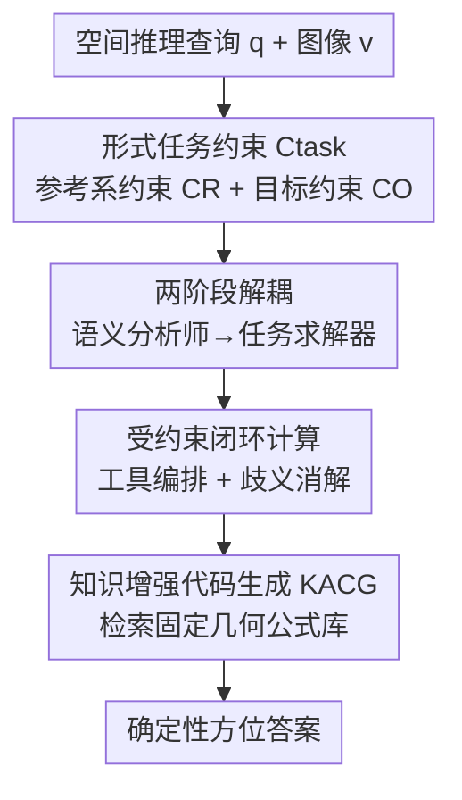

# Geometrically-Constrained Agent for Spatial Reasoning

**会议**: CVPR 2026  
**论文**: [CVF Open Access](https://openaccess.thecvf.com/content/CVPR2026/html/Chen_Geometrically-Constrained_Agent_for_Spatial_Reasoning_CVPR_2026_paper.html)  
**代码**: https://gca-spatial-reasoning.github.io （项目主页）  
**领域**: 多模态VLM / Agent / 空间推理  
**关键词**: 空间推理, VLM Agent, 形式约束, 神经符号, 工具调用  

## 一句话总结
针对 VLM 在空间推理中"语义强、几何弱"的鸿沟，本文提出免训练智能体 GCA：先让 VLM 当"语义分析师"把模糊问题翻译成一个形式化的任务约束（参考系 + 目标），再让它当"任务求解器"在这个约束的确定性边界内调用几何工具算出答案，在多个空间推理 benchmark 上平均超过此前 SOTA 约 27%。

## 研究背景与动机
**领域现状**：让 VLM 具备人类那样的 3D 空间推理能力（判断物体朝向、自我中心 vs. 他者中心视角、相对方位）是机器人、AR/VR、自动驾驶的刚需。当前两条主流路线分别是：在大规模空间数据集上端到端微调，或用外部工具承接精确几何计算。

**现有痛点**：作者指出一个根本性的"语义到几何鸿沟"（semantic-to-geometric gap）——VLM 把丰富的视觉信息有损地压进文本语义空间，细粒度几何细节被丢弃或扭曲。它**有**空间常识（知道"坐在沙发上"意味着视角与沙发朝向对齐），却**算不准**高精度几何（沙发到底朝哪），也想象不出用户的自我中心视角。两条现有路线都没能补上这个洞：
- 训练派陷入"oracle 悖论"：数据由 GPT-4o 这类本身就不擅长空间推理的 oracle 生成，VLM 学到的是有瑕疵的空间逻辑而非可靠几何原理。
- 工具派（如 SpatialAgent、TIGeR）只约束了**最终计算**，却放任 VLM 的**规划过程**不受约束——VLM 仍要在有损语义空间里做空间想象、定计划，例如被问"从坐在沙发上的视角看"时默认退回相机视角，在调用任何工具之前问题定义就已经错了。

**核心矛盾**：把"解什么（what to solve）"和"怎么解（how to solve）"混为一谈。工具能保证"怎么解"是确定性的，但"解什么"还停留在 VLM 易错的语义臆想里。

**本文目标**：不强迫 VLM 直接去推理它本来就丢失的几何细节，而是把问题**重构**成一个能发挥 VLM 定性语义强项、又能给后续计算提供确定性约束的形式化任务。

**切入角度**：借鉴神经符号推理（LogicLM、LLM+P、ReKep）"让 LLM 当翻译器、把自然语言转成可验证形式表示"的思路；但作者发现 PDDL、关键点约束这类已有形式语言**表达不了**空间推理特有的连续、相对、视角依赖的几何语义，于是为空间推理量身设计了一种新的形式约束。

**核心 idea**：引入一个形式任务约束 $C_\text{task}$ 作为"语义—几何"之间的确定性桥梁，把 VLM 的角色解耦成"先形式化、后受约束计算"两阶段。

## 方法详解

### 整体框架
GCA（Geometrically-Constrained Agent）是一个**免训练**的智能体范式，整条流水线只用同一个 VLM 扮演两个先后衔接的角色，全程不微调任何模型。输入是一张/多张图像 + 一个空间推理问题（如"壁炉朝北，健身区墙上那幅画朝哪个方向？"），输出是离散方位答案。

它把传统 ReAct 那种"通用、迭代"的策略 $r_t = \mathcal{A}(q, v, \mathcal{T}, r_{t-1})$ 替换成两阶段过程：

$$C_\text{task} \leftarrow \mathcal{F}_\text{formalize}(q, v), \qquad r_t = \mathcal{F}_\text{compute}(C_\text{task}, \mathcal{T}, r_{t-1}).$$

第一阶段 $\mathcal{F}_\text{formalize}$（语义分析师）把模糊查询 $q$ 和视觉信息 $v$ 翻译成形式、可验证的任务约束 $C_\text{task}$，定义"解什么"；第二阶段 $\mathcal{F}_\text{compute}$（任务求解器）在 $C_\text{task}$ 划定的确定性边界内编排工具箱、迭代算出答案，负责"怎么解"。关键在于第二阶段的全部规划与执行都被第一阶段产出的 $C_\text{task}$ 锁死，从而把"解什么"从 VLM 的有损语义臆想里彻底剥离出来。

### 关键设计

**1. 形式任务约束 Ctask：给空间推理设计一套几何语法**

这是全文的灵魂。痛点是已有形式语言撑不起空间语义——PDDL 擅长描述离散符号状态（`is_on(A,B)`），但表达不了连续、相对、视角依赖的空间查询。作者把 $C_\text{task}$ 定义成一个二元组 $C_\text{task} = (C_R, C_O)$：

- **参考系约束 $C_R$**（Reference Frame Constraint）：人类理解"在……北边"时是把它锚定到某个坐标系里，VLM 的失败往往源于这一步含糊（默认退回相机视角）。GCA 强制 VLM 把所有空间查询都建模为一个 3D 笛卡尔坐标系——原点 $O_R$ 加三条正交基向量 $(x_R, y_R, z_R)$，遵循 OpenCV 约定（$+z_R$ 向前、$+y_R$ 向下、$+x_R$ 右手定则）。这个坐标系必须锚定到三类几何基元之一（见原文 Fig.3）：
  - **物体系**：由物体内禀坐标系定义，如"洗手时"隐含 $+z_R = -z_\text{sink}$（洗手必须面朝水槽）；
  - **相机系**：由某相机视角定义，如"从图 1 视角看" $+z_R = +z_\text{cam1}$；
  - **方向系**：由两点连线定义，如"烤箱在水槽北边" $+z_R = \text{normalize}(\text{Centroid}(\text{oven}) - \text{Centroid}(\text{sink})) = \text{north}$。
- **目标约束 $C_O$**（Objective Constraint）：定义在 $C_R$ 下究竟要测量什么。如"椅子是否在烤面包机西边"，烤面包机定义 $C_R$，两者位置关系就是 $C_O$。

$C_R$ 是**唯一且不可协商**的，$C_O$ 指定待测目标。这套形式语法既语义清晰到 VLM 能用定性强项生成，又几何严谨到能给后续计算当确定性合同。

**2. 两阶段角色解耦：先当语义分析师，再当任务求解器**

痛点是 VLM 把"解什么"和"怎么解"搅在一起。GCA 用 $C_\text{task}$ 当"架构脚手架"把 VLM 的非对称能力对齐：在 $\mathcal{F}_\text{formalize}$ 阶段 VLM 只发挥它最强的定性语义解释力，把查询翻译成 $C_\text{task} = (C_R, C_O)$；这一步在**任何计算开始之前**就过程性地强制执行完毕（先形式化、后计算，程序上写死）。到 $\mathcal{F}_\text{compute}$ 阶段角色切换为任务求解器，所有推理执行都被前一阶段产出的 $C_\text{task}$ 当成不可变约束消费。这样做的根据是：形式化任务其实落在 VLM 能力范围内（实验显示该阶段 ∼70% 准确率），而把它和易错的几何计算分开，就避免了 VLM 在有损语义空间里直接想象高保真几何。

**3. 受约束的闭环几何计算：工具编排 + 歧义消解**

$\mathcal{F}_\text{compute}$ 是一个 ReAct 风格的闭环，但消费 $C_\text{task}$ 作为不可变约束，分三步：**数据获取**——$C_\text{task}$ 规定了需要哪些几何原料（如要实例化以 sink 为参考系，就得先拿到 sink 的朝向），VLM 生成一串工具调用把几何参数化；**工具编排与歧义消解**——VLM 管理工具反馈，确保拿到的数据正确绑定到 $C_\text{task}$ 里的符号，例如目标涉及"最左边的椅子"而检测工具返回多个 chair 时，VLM 通过可视化 bounding box 分析、判定哪个索引对应"最左"；这个闭环让智能体能处理含噪工具输出，同时保证最终计算始终扎根在 $C_\text{task}$ 的意图里。工具箱分两类：几何/感知工具（VGGT 做 3D 重建、开放词表目标检测、实例分割等）和计算/工具类（Python 沙箱执行引擎、"2D 框投影到 3D 点云"等桥接工具）。

**4. 知识增强代码生成（KACG）：防止 coder 幻觉几何公式**

当 $C_\text{task}$ 里所有变量都绑定到具体几何数据后，智能体调用代码生成器做最终计算。痛点是让 coder 凭记忆生成复杂几何公式容易幻觉出错。KACG 的做法类似一个**静态 RAG**：框架维护一个预先准备、经过验证的固定几何公式库，VLM 调用代码生成器时只给出高层需求和已绑定变量（如物体朝向），系统根据变量数据类型**自动检索**相关的固定公式（如物体局部到世界的变换公式）注入到生成器上下文里。这样计算步骤不是黑盒猜测，而是从形式化任务结构和可靠几何原理推导出的确定性结果。原文示例中，求"画作在以壁炉为参考系下的朝向"时，代码先算世界到参考系的变换 `R_ref = fireplace_ori.T`，再把画作朝向向量转到参考系并用阈值判断分量符号输出 north/east 等离散方位。

## 实验关键数据

### 主实验
在 5 个空间推理 benchmark（MMSI-Bench、MindCube-tiny、OmniSpatial、SPBench、CV-Bench）上对比基础 VLM、训练派、工具派。主 VLM 为 Qwen3-VL-Thinking。下表为各方法的总平均准确率（Avg.）及代表性 benchmark：

| 方法 | 类型 | MMSI (All) | MindCube (All) | SPBench (All) | CV-Bench (All) | Avg. |
|------|------|------|------|------|------|------|
| GPT-4o | 基础 VLM | 30.3 | 35.8 | 51.0 | 76.5 | 47.6 |
| Gemini-2.5-Pro | 基础 VLM（最强基线） | 36.9 | 57.5 | 55.8 | 86.3 | 58.5 |
| SpatialLadder | 训练派 | 25.4 | 42.3 | 44.5 | 73.7 | 51.2 |
| TIGeR | 工具派 | 27.8 | 28.3 | 49.8 | 84.5 | 47.3 |
| **GCA (ours)** | 免训练智能体 | **47.6** | **64.2** | **65.1** | 86.9 | **65.1** |

GCA 平均 65.1%，超过最强基础 VLM 基线 Gemini-2.5-Pro（约 +12%）、训练派 SpatialLadder（约 +27%）、工具派 TIGeR（约 +38%）。在最难的 MMSI-Bench（4 选 1、多数对手贴近 25% 随机线）上 GCA 达 47.6%，相对最强基线提升约 28%。⚠️ 正文一处称平均 64.8%，与主表 65.1 略有出入，以表为准。

**泛化性 caveat**：SpatialLadder 在与 SPBench 同源数据上微调，所以 SPBench 域内高分但跨域明显掉点；TIGeR 主要在单图任务训练，故 CV-Bench（单图）表现好但 MMSI-Bench（多视图）失败。GCA 免训练、不受训练先验绑架，跨 benchmark 更稳。

### 消融实验
**组件贡献**（Table 2，以 MMSI-Bench 为基准，逐步累加）：

| 配置 | MMSI 准确率 | 说明 |
|------|------|------|
| CoT-Only 基线 | 32.6 | 纯思维链 |
| + 工具集成 | 36.8 | 标准工具智能体（+4.2） |
| + KACG | 38.7 | 知识增强代码生成（+1.9） |
| + 视觉反馈 | 40.1 | 管理反馈/消歧（+1.4） |
| + $C_\text{task}$（完整 GCA） | **47.6** | 引入形式约束（+7.5） |

**形式化分析**（Fig.4，对比不同推理策略）：

| 策略 | MMSI 准确率 | 说明 |
|------|------|------|
| Baseline（CoT-Only） | 32.6 | 无工具 |
| Tool（Uncon.） | 40.1 | 无约束工具集成 |
| Tool（Prompt） | 41.9 | 仅用提示词"注意参考系/目标" |
| **Ours（$C_\text{task}$）** | **47.6** | 形式约束 |
| Oracle（人工标注 $C_\text{task}$） | 49.5 | 理论上界 |

### 关键发现
- **形式约束是性能跃升的真正来源**：前面三步（工具+KACG+反馈）累计才 +7.5，而单独引入 $C_\text{task}$ 又带来 +7.5，几乎再造一个智能体。仅靠提示词"注意参考系"（Tool-Prompt 41.9）相比无约束（40.1）几乎无改善，说明弱引导救不了 VLM 的无约束规划，**确定性、可验证的形式约束**才是关键。
- **逼近 oracle 上界**：GCA（47.6）距人工标注 oracle（49.5）仅差约 2 个点，且 $\mathcal{F}_\text{formalize}$ 阶段本身约 70% 准确率，证明形式化任务确实落在 VLM 能力内。
- **强 VLM 增益更大**：把 GCA 套到不同基座，平均相对提升约 37%；增益与 VLM 自身 agentic 能力正相关——Gemini-2.5-Pro 提升最猛（+49%，升到 55.0%），GPT-4o 因 agentic/编码能力较弱仅 +19%。
- **可解释的错因归因**：得益于推理路径可追溯，作者把失败拆成形式化阶段（30%，多为复杂语义/多图歧义/忽略隐含义，如俯视图把"down"误解成相机下方而非重力方向）和计算阶段（70%，含感知约 24%、Python Tool 约 25%、其他约 21%，如 VGGT 无法接收"每次旋转 60 度"这类文本输入导致相机顺序错乱）。

## 亮点与洞察
- **把"解什么"显式形式化、与"怎么解"剥离**，是这篇最"啊哈"的地方：它没去硬补 VLM 的几何短板，而是用一个可验证的中间表示把易错环节前置并锁死，让 VLM 只在自己强的语义层发力。这种"先翻译成约束、再确定性求解"的思路可迁移到任何"语义强但精算弱"的任务（如物理推理、图表读数）。
- **为空间推理专门设计形式语法**（三类参考系 + OpenCV 坐标约定）填补了 PDDL/关键点约束表达不了视角依赖语义的空白，这套 $C_R/C_O$ 形式化本身就是可复用的资产。
- **KACG = 静态 RAG 注入几何公式**：用固定、已验证的公式库替代让 LLM 现编公式，是一个简单但有效的防幻觉 trick，可直接搬到任何需要精确数值计算的 agent。
- **免训练却 SOTA**：避开了训练派的 oracle 悖论，也说明很多空间推理失败不是"知识不够"而是"流程没约束好"。

## 局限与展望
- 作者承认：迭代式工具调用 + 多轮 VLM 交互，**计算成本**明显高于端到端 CoT；不过换来更鲁棒可验证的路径。作者设想用 $\mathcal{F}_\text{formalize}/\mathcal{F}_\text{compute}$ 的结构化输出当监督信号去训练更高效的端到端空间 VLM。
- 当前工具箱主要面向**图像**输入，缺时序工具，做不了视频/动态空间推理；未来想加入时序工具覆盖更广的空间智能任务。
- 自己发现的局限：性能强依赖底层工具（VGGT 重建、检测/分割）的质量，错因里感知失败占约 24%，弱光/小目标/遮挡场景会拖累；且约束的"正确性"由 VLM 形式化决定，30% 的错误就发生在这一步——复杂语义/多图歧义仍是天花板。"其他"错误里还包括 15 轮预算耗尽，说明长链路下预算是硬约束。

## 相关工作与启发
- **vs 训练派（SpatialLLM / Spatial-MLLM / SpatialLadder / SpaceR / Video-R1 / VILASR / VLaser）**：他们把几何先验（3D 特征、深度图）灌进架构端到端微调，但受制于 flawed oracle 生成的数据、且有域内偏置；GCA 免训练、靠形式约束泛化，跨域更稳，平均大幅领先。
- **vs 工具派（SpatialAgent / TIGeR）**：他们只约束最终计算、放任规划过程，会产出几何上有瑕疵的计划；GCA 用 $C_\text{task}$ 同时约束规划与执行，补上了"unconstrained planning"这个洞。
- **vs 神经符号 / 约束引导推理（LogicLM / LLM+P / ReKep）**：同样是"LLM 当翻译器转成形式表示"，但 PDDL、关键点约束表达不了空间推理的连续、视角依赖语义，本文为此专门设计了 $C_\text{task}$ 这套几何形式语法。

## 评分
- 新颖性: ⭐⭐⭐⭐⭐ 为空间推理量身设计形式任务约束，把"解什么/怎么解"显式解耦，角度新颖
- 实验充分度: ⭐⭐⭐⭐ 5 benchmark + 组件/形式化/跨 VLM 三类消融 + 错因归因，较充分；但主要限单/多图、缺视频
- 写作质量: ⭐⭐⭐⭐⭐ 鸿沟—约束—两阶段的逻辑链清晰，图示到位
- 价值: ⭐⭐⭐⭐⭐ 免训练即 SOTA、可解释可验证，形式约束+KACG 思路可迁移

<!-- RELATED:START -->

## 相关论文

- [\[CVPR 2026\] Hear you are: Teaching LLMs Spatial Reasoning with Vision and Spatial Sound](hear_you_are_teaching_llms_spatial_reasoning_with_vision_and_spatial_sound.md)
- [\[CVPR 2026\] Hierarchical Attacks for Multi-Modal Multi-Agent Reasoning](hierarchical_attacks_for_multi-modal_multi-agent_reasoning.md)
- [\[CVPR 2026\] SpaceTools: Tool-Augmented Spatial Reasoning via Double Interactive RL](spacetools_tool-augmented_spatial_reasoning_via_double_interactive_rl.md)
- [\[CVPR 2026\] EgoMind: Activating Spatial Cognition through Linguistic Reasoning in MLLMs](egomind_activating_spatial_cognition_through_linguistic_reasoning_in_mllms.md)
- [\[CVPR 2026\] InfiniBench: Infinite Benchmarking for Visual Spatial Reasoning with Customizable Scene Complexity](infinibench_infinite_benchmarking_for_visual_spatial_reasoning_with_customizable.md)

<!-- RELATED:END -->
