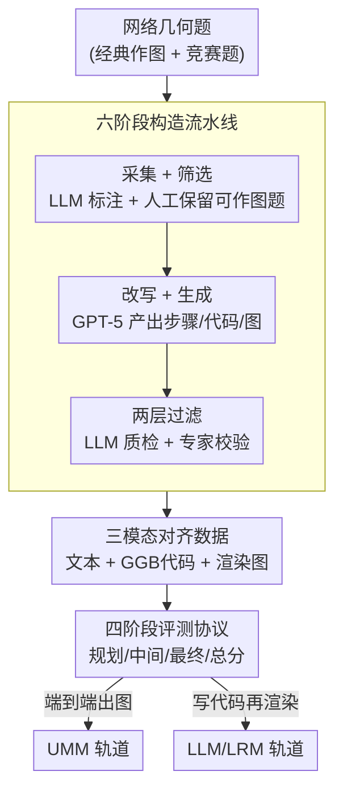

# GGBench: A Geometric Generative Reasoning Benchmark for Unified Multimodal Models

**会议**: CVPR 2026  
**论文**: [CVF Open Access](https://openaccess.thecvf.com/content/CVPR2026/html/Wei_GGBench_A_Geometric_Generative_Reasoning_Benchmark_for_Unified_Multimodal_Models_CVPR_2026_paper.html)  
**代码**: 正文未公开仓库链接（待确认）  
**领域**: 多模态VLM  
**关键词**: 几何生成推理、统一多模态模型、GeoGebra、三模态对齐、可验证评测  

## 一句话总结
GGBench 提出一个面向统一多模态模型（UMM）的"几何生成推理"评测基准：1,411 道几何作图题，每题严格对齐"自然语言步骤 + 可执行 GeoGebra 代码 + 渲染图"三模态，配套四阶段评测协议，实验发现"端到端出图"的 UMM 远落后于"先写代码再渲染"的 LLM，揭示现有模型"会答题但不会作图"的鸿沟。

## 研究背景与动机
**领域现状**：统一多模态模型（UMM，如 GPT-4o、Nano Banana、Bagel）正把"理解"和"生成"压进同一个框架，既能看懂图文又能直接生成图像。评测它们的基准也越来越多，从纯文本数学题（GSM8K、MATH）到带图的多模态推理（ScienceQA、MathVista、MathVerse）。

**现有痛点**：作者指出这些基准有一个共同缺口——它们要么测**判别式理解**（选答案、做分类），要么测**无约束生成**（自由画图），二者**割裂开来分别打分**。即便是 MME、MM-Vet、MMBench 这种综合基准，也把"理解"和"生成"当成两个独立模块各自评测，缺少对"边理解、边推理、边生成一个复杂结果"这种**一体化认知过程**的考察。

**核心矛盾**：真正的智能要求模型在生成的同时满足形式化约束，而现有评测无法验证"模型的推理是否真的落到了它画出来的图上"。几何作图是这一矛盾最尖锐的场景：看懂题意和能否多步规划、构造出满足全部约束的图，是不可分割的；但自由生成的图缺乏**确定性、可验证**的正确性判据（像素相似不等于几何正确）。

**本文目标**：构造一个能联合考察"理解—推理—生成"的基准，且每道题的正确性可被客观、自动、可解释地验证。

**切入角度**：作者观察到**几何作图**是天然适合的载体——一次成功的作图必须 (1) 解析带领域约束的自然语言指令、(2) 基于形式几何原理形成多步规划、(3) 生成满足所有约束的精确图形，而且成功与否可以对"对象与关系"做客观检查，而非只靠主观判断。

**核心 idea**：用"可执行的 GeoGebra 代码"作为锚点，把每道题的**文本步骤、代码、渲染图三模态严格对齐**，从而把"理解并推理"升级成"理解、推理、并构造"，让评测从"选答案"变成"造证据"。

## 方法详解

### 整体框架
GGBench 不是一个模型，而是一套**数据集 + 评测协议**。它的核心是**三模态对齐**的数据结构：每条样本同时包含 (i) 带步骤的自然语言推理文本、(ii) 可执行的 GeoGebra（GGB）代码、(iii) 运行代码渲染出的图像，三者 100% 对齐。代码充当"无歧义的真值"，使任何生成图的几何正确性都能被确定性地验证。

整个基准由三部分支撑：**三模态数据结构**决定了"每题长什么样"；**六阶段构造流水线**（LLM 辅助创作 + 两层过滤）把网络上的几何题加工成 1,411 道高质量对齐样本；**四阶段评测协议**则在两条评测轨道（端到端 UMM 出图 vs LLM 写代码再渲染）上联合打分。下图展示从原始题目到可用基准、再到双轨评测的整体流向：

### 关键设计

**1. 三模态对齐数据结构：让几何正确性可被确定性验证**

现有多模态数学基准（MathVista、MathVerse 等）只给"文本 + 图像"，无法核验模型的推理链是否真的对应到最终图，只能靠像素相似或主观打分。GGBench 的破局点是为每道题补上**可执行代码**这一模态：自然语言步骤（plan）、GeoGebra 代码（可执行构造）、渲染图（结果）三者一一对应，对齐率 100%。代码是"无歧义真值"——把代码跑出来就得到标准图，于是验证一张生成图是否几何正确，可以转化为对**对象与关系**的客观检查（如某交点是否落在指定圆上、某线是否真为垂直平分线），而不是看像素是否相像。这一结构同时支持两种用法：整条"文本→图"链路用来测 UMM 的一体化生成推理；而把"文本步骤→代码"这一段拆出来，又能单独诊断 LLM 的逻辑规划和代码生成能力。论文用一组对比指标（表 3）说明 GGBench 在 Understanding / Generation / Multi-step 三项覆盖率均为 100%，且唯一同时提供 Text / Image / **Code** 三模态监督。

**2. 六阶段构造流水线：LLM 辅助创作 + 两层过滤保质量**

要造出几千道"步骤—代码—图严格对齐"的题并不容易，作者设计了图 2 中标注为 (a)–(f) 的六阶段流水线。(a) **采集**：人工在网上搜集涵盖经典作图与竞赛风格的几何题，形成候选池；(b) **筛选**：先用 LLM（LLM-i）辅助打标签和过滤，再人工核查，只保留几何依赖明确、条件可作图的题，淘汰欠定义的题目；(c) **复合提示**：设计"文本规格 + 示例 GGB 代码"的复合 prompt，专门诱导"只用 GeoGebra"完成端到端作图；(d) **题目改写**：用 GPT-5（LLM-ii）把题改写成"带显式辅助对象、有序依赖"的构造式陈述（GGB 模板的句法保真借鉴了 Gemini 2.5 Pro 的工程经验），使推理步骤与可执行 GGB 操作一一对应；(e) **解答生成与可视化**：GPT-5（LLM-iii）同步产出步骤文本、可执行代码、以及跑代码渲染出的图，得到约 10,000 条草稿；(f) **最终筛查**：先用 LLM（LLM-iv）沿**代码可执行性、构造逻辑一致性、图正确性**三轴做质检，再由领域专家逐条核验几何正确性、构造充分性和跨模态精确一致。两层过滤后保留 **1,411** 道高质量题。这套"先用 LLM 规模化、再用专家把关"的做法，是在"量"和"对齐质量"之间找到的折中。

**3. 四阶段三模态评测协议：把"会规划"和"会作图"分开打分**

为了精细定位模型在哪一环失败，评测被拆成四个阶段，全部自动分由 VLM 评委（GPT-4o，固定 prompt）给出。**(1) Planning（VLM-T）**：只看文本推理，沿逻辑连贯性、步骤完整性、几何正确性三维各打 1–5 分再缩放到 $[0,100]$，衡量"动手前会不会规划"。**(2) Middle Process（VLM-I-Mid）**：把所有中间构造图按时间拼成一张面板喂给评委，评估步骤准确性与过程一致性。**(3) Final Result（VLM-I-Res）**：相对参考解评最终图的几何正确性，并附 LPIPS、PSNR、SSIM 三个像素级指标。**(4) Overall（VLM-I）**：取中间分与最终分的均值，$\text{VLM-I}=\tfrac{1}{2}(\text{VLM-I-Mid}+\text{VLM-I-Res})$。人工评委用同一套 rubric 复核，作者报告 VLM 分与人工分的 Pearson 相关 $r=0.9295$，以此佐证自动评测的可靠性。把"规划质量"与"最终图正确性"解耦，正是为了揭示"规划得好≠画得对"这一现象。

**4. 双轨评测：对比"端到端出图"与"写代码再渲染"两种范式**

GGBench 把模型按架构范式分到两条轨道分别评测：**轨道 A（端到端 UMM）**直接从自然语言提示生成图像（如 Qwen-Image、Seedream、Janus、BAGEL、Nano Banana）；**轨道 B（LLM/LRM）**先产出可执行构造代码，再由系统渲染成图（如 GPT-5、Claude Sonnet 4.5、DeepSeek 系列）。这种双轨设计的意义在于：它把"UMM 立即视觉生成"与"代码驱动的、有几何根基的构造"放到同一标尺上直接量化差距，从而回答"现阶段几何作图究竟该靠生成式还是程序式"这个问题——实验给出的答案相当一边倒（见下）。

## 实验关键数据

### 主实验
评测覆盖 13 个模型，按两条轨道对比。核心结论：**端到端 UMM 在几乎所有维度都显著落后于代码驱动的 LLM/LRM**；即便最强的 UMM（Nano Banana）也只排在代码系统的中游。

| 轨道 | 模型 | Planning (VLM-T) | Mid (VLM-I-Mid) | Final (VLM-I-Res) | Overall (VLM-I) | Human |
|------|------|------|------|------|------|------|
| UMM | Nano Banana | 58.54 | 44.83 | 22.81 | 33.82 | 45.75 |
| UMM | Janus | 33.85 | 21.69 | 19.76 | 20.73 | 19.46 |
| UMM | BAGEL | 23.07 | 21.84 | 19.99 | 20.91 | 20.12 |
| LLM | GPT-5 | 62.01 | 76.79 | **37.36** | **57.08** | **83.06** |
| LLM | Claude Sonnet 4.5 | 61.19 | 77.92 | 30.29 | 54.11 | 72.12 |
| LLM | DeepSeek-V3.1 | 60.24 | 73.13 | 26.41 | 49.77 | 68.12 |
| LLM | GPT-4o | 59.73 | 26.19 | 2.66 | 14.43 | 23.04 |

> 即便最优的 GPT-5，最终图正确性（VLM-I-Res）也只有 37.36/100，说明几何作图整体远未被攻克。

### 分项 / 对比分析

| 对比维度 | GGBench | 代表性已有基准 | 说明 |
|------|------|------|------|
| Understanding 覆盖 | 100% | MathVista 49.9% / MathVerse 61.3% | 每题都需理解 |
| Generation 覆盖 | 100% | MathVista 34.8% / GeoEval 25.0% | 每题都需生成构造 |
| Multi-step 覆盖 | 100% | MathVista 21.5% / WE-MATH 42.6% | 强制多步且步步绑代码 |
| Code 模态监督 | ✓ | 上述基准均 ✗ | 唯一提供可执行代码真值 |
| 规模 | 1,411 题 / 7,165 图 | — | 平均 5.08 图/题，189.83 token/题 |

### 关键发现
- **规划好 ≠ 画得对**：GPT-4o、GLM-4.5V 能写出连贯的规划（VLM-T 接近 LLM 中上水平），但常**生成不了可执行代码**，导致最终图正确性（VLM-I-Res 仅 2.66 / 5.02）崩盘——高层推理若不落到可执行几何上就是空中楼阁。
- **像素指标会掩盖结构错误**：高 PSNR/SSIM 并不意味几何正确，交点错位、缺失相切这类结构错误在像素相似度上可能完全看不出，因此必须用"以推理为根基"的评测代替纯感知指标。GPT-4o 的 LPIPS 极低（5.45×10⁻²）但 VLM-I-Res 几乎为 0，正是反例。
- **难点集中在定理应用与测量比例**：Figure 4 的八类构造中，"几何定理应用""测量与比例"普遍掉分最多；GPT-5 几乎全类最高，Qwen3-VL 在结构约束强的"基础作图/三角形"较好但比例推理偏弱。
- **典型错误**（Figure 5）：把"圆内接矩形"做成"正方形内切圆"（约束理解反了）；或文本步骤正确但中间图把圆心 O、半径中点 M 画错、垂直平分线画歪（文本对、图却不一致）。

## 亮点与洞察
- **用"可执行代码"当评测锚点**是最巧妙的一招：它把"几何正确"这种本来需要主观判断的事，转化成可程序化、确定性的对象/关系检查，几乎杜绝了自由生成评测里"看着像就给分"的漏洞。这个思路可迁移到任何"输出有形式化结构"的生成任务（图表、电路图、UI 布局、分子结构）——只要存在一种可执行/可解析的中间表示。
- **"规划/中间/最终"三段解耦评分**让基准具备诊断力：不是只给一个总分，而是能指出模型究竟卡在"不会规划""中途跑偏"还是"代码不可执行"，对模型改进的指向性远强于单一准确率。
- **双轨对照直接给出了工程启示**：当前"先让 LLM 写 GeoGebra 代码再渲染"比"让 UMM 直接出图"在几何约束满足上稳得多，提示几何/CAD 类应用短期内应走"推理→可执行构造"而非"端到端像素生成"。

## 局限与展望
- **真值依赖 LLM 生成 + 专家校验**：草稿由 GPT-5 产出，虽经 LLM 质检和专家复核，但训练/评测都重度依赖少数强模型，可能引入风格或难度偏置；用 GPT-4o 当自动评委也存在"评委与被评同源"的潜在循环（⚠️ 作者用 r=0.9295 的人机一致性来缓解，但未完全排除偏差）。
- **局限于 GeoGebra 可表达的平面构造**：基准聚焦尺规作图/平面几何，立体几何、动态几何、需要数值优化的构造覆盖有限（Locus 类仅 30 题，长尾稀疏）。
- **评测仍部分依赖 VLM 主观打分**：虽有代码真值，但 Planning、Middle 阶段仍由 VLM 评委按 rubric 打分，并非全自动的符号判等；把"代码等价性判定"做成完全自动化的几何引擎核验会更硬。
- **改进思路**：引入 GeoGebra/几何引擎做真正的符号级"构造等价"自动判分，扩展到 3D 与动态作图，并加入对"代码可执行率"本身的独立报告（论文提到放在附录 Table 5）。

## 相关工作与启发
- **vs MathVista / MathVerse / GeoEval（多模态数学基准）**：它们主要测判别式理解或自由生成，且只有文本+图两模态；GGBench 的区别是强制"理解+生成+多步"全覆盖并补上可执行代码模态，把评测从"选答案"推到"造证据"。
- **vs MM-MATH / MathVerse（含多步元素）**：虽也有多步推理，但步骤未与可执行构造绑定，可验证性弱；GGBench 让每一步都对应一段 GGB 代码，辅助对象和依赖被"操作化"而非仅被叙述。
- **vs 代码化评测工作（MathCoder-VL、MATP-BENCH、VeriEquivBench）**：这类工作用代码/形式证明做可验证评测，GGBench 继承"以代码换可验证性"的思路，但首次把它系统地用在**几何生成作图**这一同时考察理解—推理—生成的场景上。

## 评分
- 新颖性: ⭐⭐⭐⭐⭐ 首个用三模态对齐 + 可执行 GeoGebra 代码把"几何生成推理"做成可验证基准，切口独到
- 实验充分度: ⭐⭐⭐⭐ 覆盖 13 个主流 UMM/LLM、四阶段协议 + 人机一致性校验，但符号级自动判分仍不完整
- 写作质量: ⭐⭐⭐⭐ 动机推导清晰、流水线与协议交代完整，部分统计图表叙述略碎
- 价值: ⭐⭐⭐⭐⭐ 揭示"会答题不会作图"的真实鸿沟，为几何/结构化生成评测立了新标准

<!-- RELATED:START -->

## 相关论文

- [\[CVPR 2026\] TUNA: Taming Unified Visual Representations for Native Unified Multimodal Models](tuna_taming_unified_visual_representations_for_native_unified_multimodal_models.md)
- [\[CVPR 2026\] Geoint-R1: Formalizing Multimodal Geometric Reasoning with Dynamic Auxiliary Constructions](geoint-r1_formalizing_multimodal_geometric_reasoning_with_dynamic_auxiliary_cons.md)
- [\[CVPR 2026\] ARM-Thinker: Reinforcing Multimodal Generative Reward Models with Agentic Tool Use and Visual Reasoning](arm-thinker_reinforcing_multimodal_generative_reward_models_with_agentic_tool_us.md)
- [\[CVPR 2026\] UNICBench: UNIfied Counting Benchmark for MLLM](unicbench_unified_counting_benchmark_for_mllm.md)
- [\[CVPR 2026\] Think with 3D: Geometric Imagination Grounded Spatial Reasoning from Limited Views](think_with_3d_geometric_imagination_grounded_spatial_reasoning_from_limited_view.md)

<!-- RELATED:END -->
