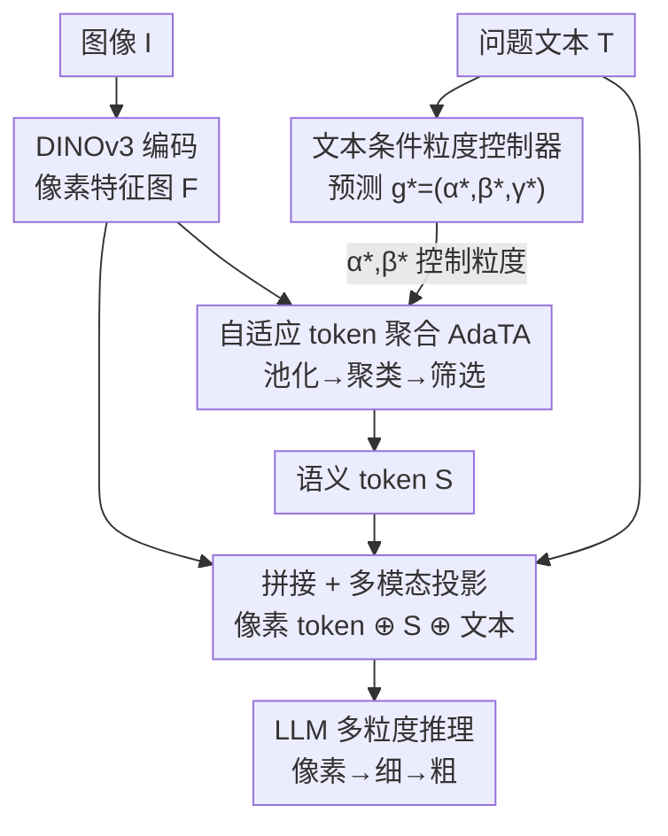

# Granulon: Awakening Pixel-Level Visual Encoders with Adaptive Multi-Granularity Semantics for MLLM

**会议**: CVPR 2026  
**论文**: [CVF Open Access](https://openaccess.thecvf.com/content/CVPR2026/html/Mao_Granulon_Awakening_Pixel-Level_Visual_Encoders_with_Adaptive_Multi-Granularity_Semantics_for_CVPR_2026_paper.html)  
**代码**: https://github.com/jinlab-imvr/Granulon  
**领域**: 多模态VLM  
**关键词**: 像素级视觉编码器, DINOv3, 文本条件粒度控制, token 聚合, 多粒度推理  

## 一句话总结
Granulon 给以 DINOv3 为代表、强于细节但缺乏粗粒度语义抽象的像素级视觉编码器，加上一个"文本条件的粒度控制器 + 自适应 token 聚合"模块，让单个编码器在一次前向里就能按问题语义动态做"像素→细→粗"的多粒度推理，在同等设置下推理准确率提升约 30%、幻觉率降低约 20%。

## 研究背景与动机
**领域现状**：当前主流 MLLM（LLaVA、QwenVL、InternVL 等）几乎都把 CLIP 系编码器当视觉前端，靠大规模图文对比学习拿到很强的全局语义对齐能力，零样本理解和跨域泛化都不错。

**现有痛点**：CLIP 的特征是固定分辨率的全局语义，它学的是"图文整体一致性"，因此偏向全局概念、忽略局部纹理和几何细节，在需要细粒度理解的任务（数颜色、辨小目标、医学细节）上信息丢失、表征模糊。反过来，DINOv3 这类自蒸馏的像素级编码器细节感知极强，却缺少把场景抽象成粗粒度语义的机制，单独用做 MLLM 前端时粗粒度推理能力受限。

**核心矛盾**：细粒度像素感知（DINOv3）与粗粒度语义抽象（CLIP）天然各占一端，单个编码器内部没有"可调节的粒度"这一维度。已有的折中是把 CLIP 和 DINO 双编码器拼在一起，但这既贵又没解决根本问题——单个编码器仍然缺少统一的 coarse-to-fine 粒度。

**本文目标**：不再走双编码器，而是让一个像素级编码器（DINOv3）自己获得"任务自适应的语义粒度"，把粒度从被动属性变成可被文本控制的主动维度。

**切入角度**：作者观察到，问题本身就携带了"该看多细"的信号——"图里有什么动物"要的是全局粗粒度，"狗耳朵是什么颜色"要的是局部细粒度。既然如此，就让文本来条件化地告诉视觉流"这次该聚合到哪个粒度"。

**核心 idea**：用一个文本驱动的粒度控制器预测目标抽象层级，再用一个自适应 token 聚合模块按这个层级把像素特征"池化→聚类→筛选"成紧凑的语义 token，与原始像素 token 一起喂给 LLM，从而在单次前向里实现"像素→细→粗"的统一推理。

## 方法详解

### 整体框架
Granulon 的输入是图像 $I$ 和问题文本 $T$，输出是 LLM 的多模态回答。整条流水线把"问题该看多细"这个判断显式化：图像先过冻结的 DINOv3 拿到像素级特征图 $F$；问题文本同时进入**粒度控制器**，预测出一组粒度参数 $g^*=(\alpha^*,\beta^*,\gamma^*)$，分别控制空间下采样、聚类数量和投影器权重；这组参数驱动 **AdaTA 模块**把 $F$ 做"粒度引导池化 → 关系感知聚类 → 质量筛选"，产出一小撮语义 token $S$；最后把像素 token、语义 token $S$ 和文本嵌入拼接，经多模态投影器送入 LLM 推理。整体公式写作 $F_{\text{mix}}(I,T)=\Phi_{\gamma^*}\big(F\oplus A_{\pi_\theta}(F;T_e)\big)\oplus T_e$，其中 $\Phi_{\gamma^*}$ 是多模态投影器、$A(\cdot)$ 是 AdaTA、$T_e$ 是文本嵌入。

### 关键设计

**1. 文本条件粒度控制器：让问题决定该看多细**

这一步针对的痛点是"单个编码器没有可调粒度"——既然问题本身暗示了需要的视觉尺度，就让文本来预测它。控制器把粒度假设空间形式化为 $\pi_\Theta=\{g_k\}_{k=1}^n$，每个 $g_k=(\alpha_k,\beta_k,\gamma_k)$ 中 $\alpha_k$ 控空间下采样、$\beta_k$ 控聚类基数、$\gamma_k$ 控投影器权重。给定问题 $T$，控制器输出一个粒度分布 $\bar g=\sum_{k=1}^n p_k g_k$，并取 $g^*=\arg\max_{g_k\in\bar g}p(g_k\mid T)$ 作为最终粒度。

具体映射是 $\sum_k p(g_k\mid T_e)\,g_k=\Phi_{\text{MLP}}\circ\Psi_{\text{agg}}\circ L^{(1)}(T_e)$：先用 LLM 的第一个 block $L^{(1)}$ 当语言编码器抓取问题里的表层依赖和语义重点，再由 $\Psi_{\text{agg}}$ 做均值池化加非线性投影得到紧凑文本描述子 $h=W_p\,\sigma\big(\tfrac{1}{L}\sum_i E^{(1)}_i\big)$，最后 MLP 头 $\Phi_{\text{MLP}}(h)=W_2\,\phi(W_1 h+b_1)+b_2$ 投到粒度 logits，softmax 成类别分布。控制器用 GPT-4o 标注的"文本-粒度"语料训练，每个问题被打上 $n$ 维的粒度偏好权重，从而学会把语言意图映射到感知尺度。它和 DynamicViT/EViT 那种基于视觉显著性的自底向上剪 token、或 LLaVA-NeXT/InternVL 那种在固定 token 上做文本引导注意力的做法不同——这里是**自顶向下、由文本先定粒度再聚合视觉**。

**2. 自适应 token 聚合 AdaTA：按粒度把像素压成语义 token**

DINOv3 强在细纹理、弱在粗结构，AdaTA 就用控制器给的粒度参数把像素特征聚合成"该粒度下的语义 token"，分三阶段：

(a) **粒度引导池化**：按 $\alpha^*$ 定义池化核 $K_{\alpha^*}$，对特征和注意力同时降维 $F_{\alpha^*}=K_{\alpha^*}^\top F K_{\alpha^*},\ A_{\alpha^*}=K_{\alpha^*}^\top A K_{\alpha^*}$；粗粒度时做强下采样（如 4×4 池化），细粒度时 $K_{\alpha^*}$ 趋近单位阵。它在降分辨率的同时保留相对显著性，让 token 分辨率对齐目标粒度。

(b) **关系感知聚类**：在池化后的 $F_{\alpha^*}$ 和 $A_{\alpha^*}$ 上跑 mini-k-means，由 $\beta^*$ 控制簇数 $M_{\beta^*}$，目标是 $\{c_j\}=\arg\min\sum_i\min_j\big[\|a_i-c_j\|^2+\lambda_f\delta_{i,j}\big]$，其中 $\delta_{i,j}$ 是基于注意力的特征距离。这样每个聚类中心同时编码视觉相似性和关系一致性，得到一批语义 token 候选。

(c) **质量筛选与精炼**：给每个簇算复合质量分 $s_j=\eta_1 S_{\text{size}}(j)+\eta_2 S_{\text{coh}}(j)-\eta_3 S_{\text{disp}}(j)$，分别奖励空间支撑、簇内语义同质性，惩罚过度分散的分布；取 Top-K 簇 $S=\{c_j\mid j\in\text{TopK}(s_j,K)\}$ 转成语义 token。这批 token 与原始像素 token 拼接、过多模态 adapter 后并入 LLM 前向路径，从而在全局抽象和局部细节间取得平衡。

**3. 像素-语义双流联合似然目标：逼模型同时用好两种 token**

光有聚合还不够，得让模型学会"按任务分配像素和语义的贡献"。作者最大化两路互补 token 的联合似然：$\arg\max_{\pi_\Theta}\mathbb{E}_{(I,T)}\big[\underbrace{\mathbb{E}_{v_i\in F}\log p_{\pi_\Theta}(C_{\text{pixel}}\mid v_i,T)}_{\text{细节贡献}}+\lambda\underbrace{\mathbb{E}_{t_j\in A_{\pi_\Theta}(F)}\log p_{\pi_\Theta}(C_{\text{sema}}\mid t_j,T)}_{\text{粒度贡献}}\big]$。前一项衡量每个像素 token $v_i$ 在上下文 $T$ 下对多模态表征的细节贡献，后一项衡量每个语义 token $t_j$ 对全局理解的贡献，$\lambda$ 平衡两者。最终损失把这两项当正则加到任务损失上：$\mathcal{L}=\mathcal{L}_{\text{task}}+\lambda_d\mathcal{L}_{\text{pixel}}+\lambda_t\mathcal{L}_{\text{sema}}$，$\mathcal{L}_{\text{pixel}},\mathcal{L}_{\text{sema}}$ 是上式两个期望的负号项。这个目标让 Granulon 学会选择合适粒度、并在像素级和语义级 token 间按任务自适应分配权重。

### 损失函数 / 训练策略
全部实验在 LLaVA 框架下进行：只替换视觉编码器，其余架构、数据、模型规模、优化超参全部保持一致，以做公平的"换编码器"对比。语言主干用 Qwen-2.5-Instruct-1.5B 和 Llama-3.2-3B 两种；在 8×H200 上训 2 个 epoch，batch size 128，学习率 $2\times10^{-5}$。训练目标即上面的 $\mathcal{L}=\mathcal{L}_{\text{task}}+\lambda_d\mathcal{L}_{\text{pixel}}+\lambda_t\mathcal{L}_{\text{sema}}$。

## 实验关键数据

### 主实验
在 5 个 benchmark 上评测（VQA: SEED-Bench / A-OKVQA；Caption: CC12M / ImageNet21K Recap；Reasoning: FLUX-Reason；Medical: SurgVLM），用 GPT-4o 当裁判给语义准确率/幻觉率/粒度分，VQA 报 Recall，Caption 报 BERTscore。下表为 Qwen2.5 主干下 Granulon（Ours）与各编码器对比（数值为 Recall/GPTscore %）：

| 编码器 | SEED Recall | A-OKVQA Recall | Caption GPTscore | Reasoning GPTscore |
|--------|-------------|----------------|------------------|--------------------|
| CLIP | 50.91 | 21.79 | 21.54 | 29.36 |
| SigLIP | 46.72 | 21.89 | 13.59 | 23.59 |
| DINOv2 | 41.40 | 16.67 | 14.36 | 36.67 |
| DINOv3 | 55.74 | 47.43 | 23.97 | 45.31 |
| **Ours** | **58.80** | **57.13** | **31.28** | **49.31** |

相比 CLIP，SEED-Bench Recall +7.89%、A-OKVQA Recall +35.34%；Caption GPTscore 较 SigLIP/DINOv2 分别 +17.69/+7.31。Llama3.2 主干下趋势一致，FLUX-Reason GPTscore 达 56.67%，比 DINOv2(19.49)、CLIP(28.97) 高 +37.18/+27.70。

### 医学域泛化

| 编码器 | Phase BERTscore | Phase Recall | Instrument BERTscore | Instrument Recall |
|--------|-----------------|--------------|----------------------|-------------------|
| CLIP | 91.64 | 46.15 | 94.44 | 46.92 |
| DINOv3 | 94.71 | 64.10 | 97.41 | 68.89 |
| **Ours** | **97.32** | **76.92** | **97.95** | **76.07** |

在手术视频的阶段识别和器械识别上，Recall 较 CLIP/DINOv3 分别 +30.77/+12.82，说明自适应粒度在需要分辨细节的专科场景里也能保住判别力。

### 消融实验
| 配置 | 关键发现 | 说明 |
|------|---------|------|
| 语义 token 粒度（簇数） | A-OKVQA 粗配置(5 簇)≈+20%，50 簇仅 +0.50%；Reasoning 反而越细越好(~35%→~45%) | 最优粒度任务相关：全局理解要粗、细推理要细 |
| 去掉 Controller（固定 token） | 平均 GPTscore 明显下降 | 自适应粒度选择是关键 |
| Controller + AdaTA 联合 | 较 vanilla DINOv3 最高 +39.7%，token 仅 +10% | 提升来自"文本自适应粒度"而非堆 token 数 |

### 关键发现
- **粒度是任务相关的**：粗粒度任务（A-OKVQA）用少簇、强抽象更好，细推理任务（FLUX-Reason）随簇数增多稳步涨分——这正是控制器存在的意义，固定粒度两头不讨好。
- **赢在"选对粒度"而非"token 更多"**：自适应版只比定值版多约 10% token，却拿到 +39.7% 提升，证明关键因子是文本自适应的粒度选择。
- **幻觉显著下降**：Caption 上较 CLIP/DINOv3 分别降幻觉 6.0%/4.6%；Llama3 推理任务幻觉率从 DINOv3 的 61.3% 降到 46.3%（相对降约 46%）。
- **逐层对齐更深**：把参考文本隐状态与各层做 cosine 相似度，CLIP 稳定在 ~0.60 就上不去，Granulon 持续增强到 ~0.80，说明多尺度表征更能支撑 LLM 的层级化深推理。

## 亮点与洞察
- **把"粒度"提升为文本可控的独立维度**：以往要么自底向上按显著性剪 token、要么在固定 token 上加文本注意力，Granulon 反过来让文本先定粒度再聚合视觉，是个很干净的自顶向下视角。
- **"唤醒"而非"替换"像素编码器**：不堆双编码器，而是给 DINOv3 补上它本就缺的粗粒度抽象，单编码器单次前向就拿到 coarse-to-fine——省算力又解决根因。
- **AdaTA 的池化-聚类-筛选三段是可复用模板**：用注意力距离做关系感知聚类、再用 size/coherence/dispersion 复合分筛簇，这套"按预测粒度把密集特征压成少量语义 token"的流程可迁移到任何想做 token 压缩+语义抽象的视觉前端。
- **幻觉与粒度挂钩的分析角度**：把句级粒度分和幻觉分一起统计，指出"细到粗的粒度对齐帮 LLM 平衡细节保真与语义连贯"，给"为什么换编码器能降幻觉"提供了机制层面的解释。

## 局限与展望
- 控制器依赖 GPT-4o 标注的"文本-粒度"语料训练，这套监督信号的质量和偏置会直接影响粒度预测，论文未充分讨论标注噪声的影响。
- 粒度假设空间 $\{g_k\}$ 是离散预定义的，$\alpha/\beta/\gamma$ 的取值集合如何选、是否限制了表达力，正文交代有限（⚠️ 细节以原文/补充材料为准）。
- 论文主打"同等设置换编码器"的公平对比，但语言主干只测了 1.5B/3B 两个较小模型，更大 LLM 下粒度控制的收益是否同样显著未知。
- mini-k-means + Top-K 筛选引入了额外的聚类开销，虽然 token 只多约 10%，但聚类本身的延迟/可微性如何处理（公式里是 $\arg\min$）值得关注。

## 相关工作与启发
- **vs CLIP / SigLIP / EVA-CLIP**：它们靠图文对比学全局语义、固定分辨率，强于检索对齐但丢细节；Granulon 改用像素级 DINOv3 并补粗粒度抽象，在细粒度 VQA/推理上反超。
- **vs DINOv3（直接当前端）**：DINOv3 细节强但缺粗粒度语义，单用做 MLLM 前端粗粒度推理受限；本文不改 DINOv3 权重（冻结），靠外挂控制器+AdaTA 把它"唤醒"。
- **vs CLIP+DINO 双编码器**：双编码器贵且没解决"单编码器缺统一粒度"的根因；本文单编码器单次前向即可多粒度。
- **vs DynamicViT / EViT（token 剪枝）、LLaVA-NeXT / InternVL（区域选择）**：那些是自底向上按视觉显著性剪 token 或在固定 token 上做文本引导注意力；Granulon 是自顶向下由文本预测粒度再聚合，控制的是"抽象层级"而非"留哪些 token"。

## 评分
- 新颖性: ⭐⭐⭐⭐⭐ 把粒度变成文本可控维度、唤醒像素级编码器做 coarse-to-fine，视角新颖
- 实验充分度: ⭐⭐⭐⭐ 5 benchmark + 双 LLM + 医学域 + 幻觉/逐层对齐分析较完整，但 LLM 规模偏小
- 写作质量: ⭐⭐⭐⭐ 框架清晰、公式齐全，但部分指标（GPTscore 基线值、粒度空间取值）交代略含糊
- 价值: ⭐⭐⭐⭐⭐ 给 MLLM 视觉前端"用 DINO 而非 CLIP + 自适应粒度"指了条省算力的实用方向

<!-- RELATED:START -->

## 相关论文

- [\[CVPR 2026\] Boosting Visual Reprogramming for CLIP with Dual Granularity Alignment](boosting_visual_reprogramming_for_clip_with_dual_granularity_alignment.md)
- [\[CVPR 2026\] TerraScope: Pixel-Grounded Visual Reasoning for Earth Observation](terrascope_pixel-grounded_visual_reasoning_for_earth_observation.md)
- [\[ACL 2025\] AVG-LLaVA: An Efficient Large Multimodal Model with Adaptive Visual Granularity](../../ACL2025/multimodal_vlm/avg-llava_an_efficient_large_multimodal_model_with_adaptive_visual_granularity.md)
- [\[CVPR 2026\] CoV-Align: Efficient Fine-grained Cross-Modal Alignment with Cohesive Visual Semantics Priority](cov-align_efficient_fine-grained_cross-modal_alignment_with_cohesive_visual_sema.md)
- [\[CVPR 2026\] Multi-modal Test-time Adaptation via Adaptive Probabilistic Gaussian Calibration](multi-modal_test-time_adaptation_via_adaptive_probabilistic_gaussian_calibration.md)

<!-- RELATED:END -->
