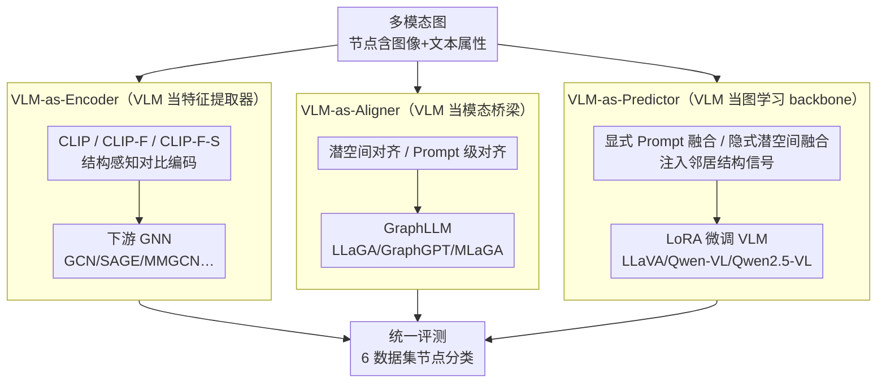

# GraphVLM: Benchmarking Vision Language Models for Multimodal Graph Learning

**会议**: CVPR 2026  
**arXiv**: [2603.13370](https://arxiv.org/abs/2603.13370)  
**代码**: [https://github.com/oamyjin/GraphVLM](https://github.com/oamyjin/GraphVLM) (开源)  
**领域**: 多模态VLM / 图学习  
**关键词**: 多模态图学习, VLM角色分析, 图神经网络, benchmark, 结构感知推理

## 一句话总结
提出 GraphVLM benchmark，系统评估VLM在多模态图学习中的三种角色——VLM-as-Encoder（增强GNN特征）、VLM-as-Aligner（桥接模态用于LLM推理）、VLM-as-Predictor（直接作为图学习backbone）。在6个数据集上的实验表明，VLM-as-Predictor持续取得最佳性能，揭示了VLM作为多模态图学习新基础的巨大潜力。

## 研究背景与动机

**领域现状**：VLM在配对模态（图文）对齐方面取得巨大成功，但对结构化数据（实体通过图连接）的多模态推理能力基本未被探索。多模态图学习(MMGL)已有GNN-based和LLM-based两类方法，但VLM直接作为图学习backbone的第三范式几乎空白。

**现有痛点**：(a) 现有MMGL缺乏统一评估流程，GNN/LLM/VLM方法无法公平比较；(b) 多数GNN方法仅用朴素特征拼接进行多模态融合；(c) VLM在图学习中的潜力被局限于zero-shot推理，未探索其作为可训练backbone的能力。

**核心矛盾**：VLM天然具备跨模态对齐能力，但这种能力如何与图的关系结构结合？如何最有效地利用VLM进行多模态图学习？

**本文目标** 建立一个系统性benchmark，统一评估VLM在多模态图学习中的不同角色，找到最有效的使用范式。

**切入角度**：把VLM在MMGL里的作用拆成三种互补角色——当编码器、当对齐器、当预测器——逐一搭实验台对比。

**核心idea**：VLM-as-Predictor（直接微调VLM作为图学习backbone，并注入结构信号）是多模态图学习最有效的范式。

## 方法详解

### 整体框架
同一个多模态图（节点带图像+文本属性）分别走三条范式：VLM-as-Encoder 把 VLM 当特征提取器、出来的特征喂下游 GNN；VLM-as-Aligner 把 VLM 当模态桥梁、把图像注入现有 GraphLLM；VLM-as-Predictor 直接 LoRA 微调 VLM、把结构信号也一并注入。三条线最终都汇到同一套评测（6个数据集的节点分类，4个Amazon电商+1个Reddit+1个CDs），从而公平对比三种角色孰优孰劣。每条范式内部又有多档变体（不同编码器、不同对齐层、不同融合策略），用来拆解「哪种用法、注在哪一层最有效」。

### 关键设计

**1. VLM-as-Encoder：把VLM当特征提取器，喂给下游GNN**

这条线探的是「多模态特征质量到底对GNN有多大影响、结构感知编码是否优于朴素拼接」。论文设了三档逐渐变强的编码器：(a) 预训练CLIP直接抽特征拼接，最朴素；(b) CLIP-F，在图数据上用对比学习把CLIP微调一遍；(c) CLIP-F-S，结构感知版——不再孤立地对齐图文，而是把CLIP塞进GNN框架里联合优化，用一个结构感知对比损失让多模态特征同时贴合图拓扑（相邻节点特征更近）。无论哪档编码器，特征出来后都接同一批下游GNN（GCN、GraphSAGE、MMGCN、MGAT、UniGraph2）做最终的节点分类。这条线的天花板受限于GNN本身——再好的特征也要过GNN这道瓶颈。

**2. VLM-as-Aligner：把VLM当模态桥梁，让现有GraphLLM吃得下多模态图**

GraphLLM（LLaGA、GraphGPT、MLaGA 这类）原本只处理文本图，问题是图像这一模态怎么递进去。论文给了两种对齐策略走不同的注入层。潜空间对齐直接在表示层动手：拿CLIP的多模态embedding替换掉原来的单模态节点表示，塞进LLM的输入空间。Prompt级对齐则走文本层：用Qwen-VL把每张图像翻译成一段文字描述，拼到节点的文本属性后面，还能可选地把邻居节点的视觉描述也一并写进prompt（这就是结构感知增强）。两者一个在特征层、一个在自然语言层桥接模态，正好用来检验「VLM的对齐能力能不能给GraphLLM加分、加在哪一层更好」。

**3. VLM-as-Predictor：直接把VLM微调成图学习backbone，结构信号一并注入**

这是论文押注的范式。出发点是——VLM自己就有很强的多模态推理能力，与其让它当配角再过GNN/LLM一道中间层（每过一层都丢信息），不如用LoRA直接把VLM（LLaVA-1.5、Qwen-VL、Qwen2.5-VL）微调成task-specific的图学习模型。关键在于怎么把「图结构」喂给一个本来只看单节点的VLM，论文给了两条注入路径。显式Prompt级融合：把锚节点连同它top-3最相似邻居的属性，拼成一段instruction prompt，让VLM在文字层面「看到」邻居。隐式潜空间融合：把邻居节点的视觉patch embedding和文本token embedding分别做平均池化（avg pooling），在特征层直接注入VLM的潜空间。两条路径都支持文本/视觉/多模态三种邻居信息配置，方便后面拆解「哪种结构信号、注在哪一层最有用」。

## 实验关键数据

### 主实验（跨范式对比，6个数据集平均）

| 范式 | 代表方法 | 平均最优表现 | 说明 |
|------|---------|------------|------|
| VLM-as-Encoder | CLIP + GraphSAGE | 中等 | CLIP特征质量高但受限于GNN瓶颈 |
| VLM-as-Aligner | CLIP/Qwen-VL + MLaGA | 中上 | 潜空间对齐优于Prompt对齐 |
| VLM-as-Predictor | Qwen2.5-VL + SFT | 最优 | 持续最佳，尤其在结构增强后 |

### 消融实验（VLM-as-Encoder编码器对比）

| 编码器 | GraphSAGE性能 | 说明 |
|--------|-------------|------|
| ImageBind | 较低 | 基础多模态编码 |
| CLIP | 高 | 强跨模态对齐 |
| CLIP-F（微调） | 略高/持平 | 领域微调有时无显著增益 |
| CLIP-F-S（结构感知） | 略有提升 | 结构感知编码在部分数据集有效 |

### 融合策略对比（VLM-as-Predictor）

| 融合策略 | 效果 | 说明 |
|---------|------|------|
| 无结构信息 | 基线 | VLM仅看单个节点 |
| Prompt级结构融合 | 提升 | 将邻居文本/视觉信息加入prompt |
| 潜空间结构融合 | 最大提升 | 邻居特征聚合后注入latent space |

### 关键发现
- **VLM-as-Predictor一致最优**：在6个数据集上持续超越GNN和LLM方法，说明VLM直接作为backbone+结构增强是MMGL最有效范式
- **潜空间融合优于Prompt融合**：在特征级集成模态和结构信号，比在Prompt中用自然语言描述更一致有效
- **CLIP作为编码器已经很强**：预训练CLIP的特征质量高，进一步微调的增益有限
- **结构信息在VLM-as-Predictor中最有价值**：同样的邻居信息，注入VLM的提升大于注入GNN或LLM
- **Qwen2.5-VL > Qwen-VL > LLaVA-1.5**：较新、较强的VLM基座带来更好的图学习性能

## 亮点与洞察
- **三种角色的系统分类**（Encoder/Aligner/Predictor）为理解VLM在图学习中的定位提供了清晰框架，这个分类可以推广到VLM在其他结构化数据任务中的分析。
- **"VLM-as-Predictor最优"的结论**具有指导意义：说明VLM不应仅被视为特征提取器或模态桥接器，而应被视为图学习的一等公民backbone。
- **潜空间融合vs Prompt融合的系统对比**为多模态图学习的方法设计提供了明确方向：结构信息应该在特征层面而非文本层面注入。
- 统一6个数据集+三大范式+多种子方法的全面对比，是这个方向最完整的benchmark。

## 局限与展望
- 仅关注节点分类任务，未涉及链接预测、图分类等其他图学习任务
- 数据集只包含Amazon电商和Reddit，领域覆盖有限（缺少知识图谱、分子图等）
- VLM-as-Predictor的LoRA微调需要labeled data，并非真正的零样本方法
- 只考虑了图像和文本两种模态，未涉及音频、视频等更丰富的多模态图
- VLM处理大规模图的可扩展性未讨论（每个节点需要VLM推理，开销大）

## 相关工作与启发
- **vs MM-Bench [Zheng et al.]**: MM-Bench只覆盖GNN-based方法。GraphVLM首次统一覆盖GNN/LLM/VLM三大backbone。
- **vs MAGB [Wei et al.]**: MAGB覆盖了GNN和VLM零样本，但未探索VLM微调。GraphVLM完整覆盖VLM的SFT设置。
- **vs MLaGA [Chen et al.]**: MLaGA是最先进的GraphLLM方法，但在GraphVLM的对比中被VLM-as-Predictor超越，说明VLM直接微调比通过LLM中转更有效。

## 评分
- 新颖性: ⭐⭐⭐⭐ 三种VLM角色的系统分类是新颖贡献，但各子方法多为已有方法的组合
- 实验充分度: ⭐⭐⭐⭐⭐ 6数据集、3范式、多种GNN/LLM/VLM方法的全面对比
- 写作质量: ⭐⭐⭐⭐ 结构清晰，分类框架直观
- 价值: ⭐⭐⭐⭐ 为多模态图学习提供了系统性benchmark和明确的方法论指导

<!-- RELATED:START -->

## 相关论文

- [\[CVPR 2026\] Benchmarking Vision-Language Models under Contradictory Virtual Content Attacks in Augmented Reality](benchmarking_vision-language_models_under_contradictory_virtual_content_attacks_.md)
- [\[CVPR 2025\] Mosaic of Modalities: A Comprehensive Benchmark for Multimodal Graph Learning](../../CVPR2025/multimodal_vlm/mosaic_of_modalities_a_comprehensive_benchmark_for_multimodal_graph_learning.md)
- [\[CVPR 2026\] Multi-Crit: Benchmarking Multimodal Judges on Pluralistic Criteria-Following](multi-crit_benchmarking_multimodal_judges_on_pluralistic_criteria-following.md)
- [\[CVPR 2026\] Venus: Benchmarking and Empowering Multimodal Large Language Models for Aesthetic Guidance and Cropping](venus_benchmarking_and_empowering_multimodal_large_language_models_for_aesthetic.md)
- [\[CVPR 2026\] Parallel In-context Learning for Large Vision Language Models](parallel_in-context_learning_for_large_vision_language_models.md)

<!-- RELATED:END -->
