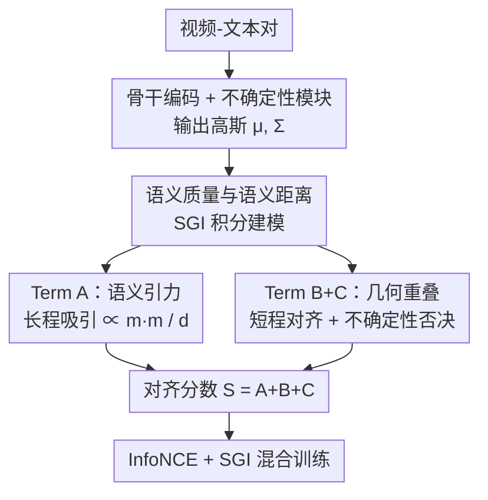

# Gravitation-Driven Semantic Alignment for Text Video Retrieval

**会议**: CVPR 2026  
**论文**: [CVF Open Access](https://openaccess.thecvf.com/content/CVPR2026/html/Yang_Gravitation-Driven_Semantic_Alignment_for_Text_Video_Retrieval_CVPR_2026_paper.html)  
**代码**: 待确认  
**领域**: 多模态VLM  
**关键词**: 文本-视频检索, 概率嵌入, 高斯分布, 语义引力, 不确定性建模  

## 一句话总结
GraviAlign 把跨模态语义对齐类比成万有引力，将文本/视频的高斯嵌入对齐分数拆成"语义引力（吸引）"和"几何重叠（重叠度）"两个正交、闭式可解的因子，每个因子都有独立否决权，在三个文本-视频检索基准上稳定超过 CLIP-ViP 基线 1.6%~2.6% R@1。

## 研究背景与动机

**领域现状**：文本-视频检索（TVR）的主流做法是用 CLIP 类模型把视频和文本各自编码成一个**确定性点向量**，再用余弦相似度对齐，靠 InfoNCE 拉近正样本、推开负样本。

**现有痛点**：现实中视频和文本是"多对多"——同一段视频可以被多条语义不同的文字描述（"给小孩看的卡通"/"动画片在播放"/"卡通人物在走动"都对），反之亦然。一个确定性点被迫同时贴近好几个不同概念，根本表达不了这种语义模糊。后来有人改用**概率嵌入**（把样本建模成高斯分布、几何体或集合）来刻画不确定性，但作者指出两个老毛病：① **刚性先验**——很多方法人为塞进几何层级约束或外挂 KL 正则防方差塌缩，模型学到的是"设计选择"而非数据本身的语义不确定性；② **忽略距离-不确定性的耦合**——现有相似度往往把对齐拆成"均值距离项 + 方差/体积惩罚项"两个**可加独立**部分，于是相同均值距离的两对样本被一视同仁，无法区分"自信对齐"和"模糊匹配"。

**核心矛盾**：概率嵌入要么被刚性先验绑住手脚，要么把距离和不确定性割裂处理，两者的**交互**（同样的中心距离下，分布越尖锐越该奖励、越弥散越该惩罚）始终没被自然建模进相似度里。

**本文目标**：设计一个分数，既能让距离和不确定性真正耦合，又**无需采样、无需外部正则、无需反直觉的几何先验**，还要闭式可解、可解释。

**切入角度**：作者从经典物理的万有引力得到灵感——引力 $U=-G\frac{m_1 m_2}{r}$ 同时编码了"吸引力 + 质量依赖 + 距离衰减"三个原则。把"语义质量"定义成**不确定性的倒数**（具体、低方差的概念质量大，模糊、高方差的质量小），语义对齐就成了两个概念之间的"期望相互作用能"。

**核心 idea**：把跨模态对齐分数分解成两个正交因子——**语义引力**（中心间的引力吸引，由语义质量加权）和**几何重叠**（两个分布的交叠量），二者任一过低都足以否决一次匹配。

## 方法详解

### 整体框架

GraviAlign 建立在 CLIP-ViP 骨干之上：视频 $v=[f_1,\dots,f_M]^\top$ 和文本 $t=[w_0,\dots,w_N]^\top$ 先经各自编码器得到池化特征 $f_v, f_t \in \mathbb{R}^D$，沿用 UATVR 风格的轻量**不确定性模块**把每个模态建模成对角高斯 $z_v\sim\mathcal{N}(\mu_v,\Sigma_v)$、$z_t\sim\mathcal{N}(\mu_t,\Sigma_t)$：均值 $\mu$ 由一层 FC + LayerNorm + $\ell_2$ 归一化给出（语义中心），协方差 $\Sigma=\mathrm{diag}(\sigma_1^2,\dots,\sigma_D^2)$ 由另一层 FC 预测 $\log\sigma^2$（每维的语义方差/不确定性）。确定性目标和概率目标共享同一套骨干特征，几乎不加开销。

拿到两个高斯后，核心是计算对齐分数 $S_{\text{align}}=A+B+C$：先把"语义引力 × 几何重叠"的理想积分形式（SGI 积分）写出来并证明它不可解，再把它解耦成三个闭式项——**Term A** 提供长程引力吸引、**Term B** 提供短程几何对齐惩罚、**Term C** 作为不确定性自正则否决模糊匹配。训练时这个分数既当结构正则（SGI loss，只作用于正样本对），又和标准 InfoNCE 混合，让模型"既排得对、又表征得好"。

### 关键设计

**1. 语义质量与语义距离：把"不确定性"翻译成物理量**

为了让距离和不确定性真正耦合，作者先给两个核心物理量下定义。**语义质量**取自高斯的微分熵 $\mathcal{H}=\frac12\log\big((2\pi e)^D|\Sigma|\big)$（对角阵下 $|\Sigma|=\prod_i\sigma_i^2$，熵正比于 $\sum\log\sigma_i^2$），定义为熵的递减函数：

$$m(\mu,\Sigma)=\exp\!\left(-\lambda\cdot\frac{\mathcal{H}_{\text{norm}}}{1+\mathcal{H}_{\text{norm}}}\right),\quad \mathcal{H}_{\text{norm}}=\tfrac12\sum_{i=1}^{D}\log\sigma_i^2$$

它有界在 $(0,1]$ 且随不确定性单调递减——低方差（自信、具体）的概念质量大，高方差（模糊）的质量小，$\lambda$ 控制衰减灵敏度。**语义距离**则用马氏距离而非欧氏距离：$d(\mu_v,\mu_t)=\sqrt{(\mu_v-\mu_t)^\top\Sigma_{\text{joint}}^{-1}(\mu_v-\mu_t)}$，其中 $\Sigma_{\text{joint}}=\Sigma_v+\Sigma_t$。这是高斯空间里统计意义上最优的度量，因为它按每一维的方差去缩放距离，自然把不确定性编织进了"远近"里。把这两者代入引力公式，理想的对齐能量就是 **SGI 积分**：

$$I_{\text{SGI}}=\iint p_v(x)p_t(y)\cdot\exp\!\Big(\frac{S(x,y)}{T}\Big)\,dx\,dy,\quad S(x,y)=G\cdot\frac{m(\mu_v,\Sigma_v)\,m(\mu_t,\Sigma_t)}{\|x-y\|^2}$$

它优雅地统一了"靠质量产生的核心吸引"和"靠积分产生的几何重叠"，但因为 $1/\|x-y\|^2$ 这个逆距离项，积分**没有闭式解**、计算上不可解——这正是后面要解耦的根因。

**2. Term A · 语义引力：长程"吸引子"，自信匹配吸得更紧**

直接算 SGI 积分不可行，作者退而求其次：在分布**中心**处求引力势，但把欧氏距离换成更强的马氏距离，得到语义吸引项

$$A=\frac{G}{T}\cdot\frac{m(\mu_v,\Sigma_v)\cdot m(\mu_t,\Sigma_t)}{d(\mu_v,\mu_t)}$$

它精确对应"两个概念的语义质量乘积 / 有效距离"：两个都很自信（质量大）且中心接近的高斯，会产生强引力。$1/d$ 的形式让它扮演**长程吸引子**——即使两个概念中心还有一定距离，只要它们语义质量大，引力项就会把它们往一起拉。这一项直接针对前面"距离-不确定性割裂"的痛点：质量（不确定性）不再是一个可加的独立惩罚，而是**乘在距离项上**，让对齐强度同时取决于"多近"和"多自信"。

**3. Term B+C · 几何重叠：短程对齐惩罚 + 不确定性否决**

吸引项管"拉到一起"，但拉近之后还要"精确对接"，这由两个高斯重叠积分 $\log\int\mathcal{N}_v(z)\mathcal{N}_t(z)\,dz$ 的闭式解给出，自然分解成两项：

$$\log\Psi=\underbrace{-\tfrac12(\mu_v-\mu_t)^\top\Sigma_{\text{joint}}^{-1}(\mu_v-\mu_t)}_{\textbf{Term B}}\underbrace{-\tfrac12\log|\Sigma_{\text{joint}}|}_{\textbf{Term C}}+c$$

**Term B** 等价于 $-\frac12 d(\mu_v,\mu_t)^2$，是个二次型的**短程对齐器**：一旦中心靠近，它会强烈惩罚任何细微偏移，确保精确"对接"。作者特意说明 A 和 B 不冗余——A 用 $1/d$ 做长程吸引、B 用 $-d^2$ 做短程对齐，一个负责"拉"、一个负责"准"。**Term C** 惩罚联合协方差的体积 $\log|\Sigma_{\text{joint}}|$，充当**自正则器**，专门压制高体积分布，从而否决"模糊配模糊"（fuzzy-fuzzy）的假阳性——两个都很弥散的分布即便中心碰巧接近，也会被这一项拒掉。这就是论文反复强调的**独立否决机制**：吸引（A）和重叠（B+C）任一过低，整个匹配就被否，对模糊假阳性尤其有效。同时因为 C 的梯度天然阻止方差塌缩，模型**不需要外挂 KL 正则**。

**4. SGI 结构正则 + InfoNCE 混合训练：既排得对、又表征得好**

最终分数 $S_{\text{align}}=A+B+C$ 不只是个排序工具，而是一个有物理/概率意义的兼容度度量。训练用混合目标：判别用标准对称 InfoNCE（把正样本对从 batch 内负样本中分离出来）；结构用 **SGI loss**，**只作用于正样本对** $(v,t)^+$：

$$\mathcal{L}_{\text{SGI}}(v,t)^+=-S_{\text{align}}(v,t)^+=-(A+B+C)$$

最小化它等于显式地给正样本对提供梯度：增大质量吸引（A）、缩小马氏距离（B）、惩罚联合不确定性（C）。总目标 $\mathcal{L}=\mathcal{L}_{\text{InfoNCE}}+\alpha\cdot\mathcal{L}_{\text{SGI}}$，$\alpha>0$ 平衡两者。和只优化相对排序的传统对比学习不同，SGI loss 直接监督语义空间**内部的几何与概率结构**，让模型"既排得更好、也表征得更好"。整个方法只有 $O(D)$ 复杂度、闭式梯度。

## 实验关键数据

### 主实验

三个 TVR 基准（MSR-VTT / DiDeMo / ActivityNet），骨干 CLIP-ViP（ViT-B/32 与 ViT-B/16），均不加 QB-Norm / DSL 等后处理。GraviAlign 作为加在基线上的对齐分数，在所有数据集、所有骨干上稳定超过基线：

| 数据集 | 骨干 | 指标(T2V R@1) | CLIP-ViP 基线 | +GraviAlign | 提升 |
|--------|------|------|------|------|------|
| MSR-VTT | ViT-B/32 | R@1 | 50.1 | 52.4 | ↑2.3 |
| MSR-VTT | ViT-B/16 | R@1 | 54.2 | 55.8 | ↑1.6 |
| DiDeMo | ViT-B/32 | R@1 | 48.6 | 50.7 | ↑2.1 |
| DiDeMo | ViT-B/16 | R@1 | 50.5 | 52.3 | ↑1.8 |
| ActivityNet | ViT-B/32 | R@1 | 51.1 | 52.4 | ↑1.3 |
| ActivityNet | ViT-B/16 | R@1 | 53.4 | 56.0 | ↑2.6 |

在 MSR-VTT ViT-B/32 上，GraviAlign 的 T2V R@1 达 52.4%，超过最新单点增强方法 NarVid（51.0%）、概率方法 UATVR（47.5%）和无偏表征 NeighborRetr（49.5%）；V2T 方向同样领先。提升不止于 R@1，R@5/R@10 一并改善，说明整个排序列表质量都在提高。

### 消融实验

在 MSR-VTT、ViT-B/32、T2V 上系统移除三项之一（Table 4），验证三项缺一不可：

| 配置 | 说明 | 效果 |
|------|------|------|
| Full (A+B+C) | 完整 GraviAlign | 最佳 |
| w/o Term A | 去掉语义引力（长程吸引） | 显著掉点 |
| w/o Term B | 去掉短程几何对齐惩罚 | 显著掉点 |
| w/o Term C | 去掉不确定性自正则否决 | 显著掉点 |

⚠️ 原文只定性说"移除任一项都导致显著性能下降、证实三项缺一不可"，未在正文给出每项移除后的精确 R@1 数值（具体见原文 Table 4，以原文为准）。另有超参分析（Table 5）：温度 $T$、质量灵敏度 $\lambda$、引力常数 $G$ 在合理范围内变化时性能稳定，说明方法对精确调参不敏感。

### 关键发现
- 三项各司其职、互不冗余：A（$1/d$ 长程吸引）和 B（$-d^2$ 短程对齐）一个管"拉近"、一个管"对准"，C 管"否决模糊"。任一缺失都掉点，印证"独立否决"设计的必要性。
- 增益来自更有原理的对齐分数本身，而非数据增强或后处理——在干净标准设置下取得，说明是 TVR 任务的根本性、可泛化增强。
- 对 $T/\lambda/G$ 鲁棒，默认值即"甜区"，落地时调参负担小。

## 亮点与洞察
- **用物理类比统一了"距离 × 不确定性"**：把语义质量定义成不确定性的倒数、距离换成马氏距离，引力公式天然让"多近 × 多自信"相乘耦合，绕开了"均值项 + 方差项可加"的老结构缺陷，思路非常漂亮。
- **"先写不可解的理想积分、再解耦成闭式三项"**：SGI 积分给出理论上正确的目标并坦诚它不可解，再退化到中心点 + 重叠积分的闭式近似，既保住了 $O(D)$ 效率和闭式梯度，又留下可解释性，是个可复用的"理想化→可解耦"建模范式。
- **独立否决机制**对"模糊配模糊"假阳性特别有效：Term C 惩罚联合体积，两个弥散分布即使中心碰巧接近也被拒，这个洞察可迁移到任何概率嵌入的检索/匹配任务。
- 自正则省掉外挂 KL：Term C 的梯度天然阻止方差塌缩，省去了概率嵌入常见的额外正则项和调参。

## 局限与展望
- **高斯/对角协方差假设**：把每个模态建模成对角高斯，多峰、强相关维度的语义可能被牺牲；anisotropy 之外的复杂分布结构表达有限。
- **闭式近似的代价**：用中心点处的引力势 + 重叠积分近似原 SGI 积分，丢掉了积分中分布形状的高阶信息，近似误差对"硬负样本"区分的实际影响论文未量化。⚠️ 消融未给逐项精确数值，难以判断三项相对贡献大小。
- **增益幅度**：相对 CLIP-ViP 基线提升 1.3%~2.6% R@1，属稳健但非颠覆性的改进；是否在更大规模/更长视频上仍成立有待验证。
- 改进思路：把对角高斯换成低秩 + 对角协方差或混合高斯以表达多峰语义；将引力框架推广到图文、音视频等更广的概率对齐场景（作者也提到这是更广多模态学习的通用框架）。

## 相关工作与启发
- **vs CLIP-ViP（确定性点嵌入基线）**：CLIP-ViP 用单点 + 余弦相似度，隐含一对一假设；GraviAlign 在其上接不确定性模块改成高斯嵌入，用引力分数显式建模多对多模糊，几乎不加开销就稳定涨点。
- **vs UATVR（概率嵌入）**：UATVR 靠**采样**做分布对齐，计算低效、只是真实相似度的随机近似，且只在采样实例上操作、丢弃了协方差结构等几何线索；GraviAlign 用闭式对齐项直接把分布几何纳入相似度，免采样、保留不确定性信息。
- **vs ProLIP（刚性几何先验）**：ProLIP 的 inclusion loss 假设跨模态包含关系，会惩罚两个完全相同（即完美对齐）的分布，反而阻碍真正同义对的对齐；GraviAlign 无需这种反直觉先验，完美对齐会同时拿到高吸引 + 高重叠。
- **vs PCME（开山概率嵌入）**：PCME 用期望平方 L2 距离，均值的梯度与方差完全独立、更新"对不确定性无感"；GraviAlign 通过质量加权和马氏距离让二者耦合，从根上修了这个梯度缺陷。

## 评分
- 新颖性: ⭐⭐⭐⭐⭐ 用万有引力类比把概率对齐拆成正交的吸引 + 重叠双因子，物理直觉与闭式可解性结合得很巧
- 实验充分度: ⭐⭐⭐⭐ 三基准双骨干稳定涨点 + 消融 + 超参分析，但消融未给逐项精确数值
- 写作质量: ⭐⭐⭐⭐⭐ 从理想积分到可解耦近似的推导清晰，物理/概率双重解释到位
- 价值: ⭐⭐⭐⭐ 即插即用的对齐分数，对多对多模糊和模糊假阳性有针对性，可迁移到更广的概率多模态匹配

<!-- RELATED:START -->

## 相关论文

- [\[CVPR 2026\] EagleNet: Energy-Aware Fine-Grained Relationship Learning Network for Text-Video Retrieval](eaglenet_energy-aware_fine-grained_relationship_learning_network_for_text-video_.md)
- [\[CVPR 2026\] Breaking Multimodal LLM Safety via Video-Driven Prompting](breaking_multimodal_llm_safety_via_video-driven_prompting.md)
- [\[CVPR 2026\] Camouflage-aware Image-Text Retrieval via Expert Collaboration](camouflage-aware_image-text_retrieval_via_expert_collaboration.md)
- [\[CVPR 2026\] Self-guided Semantic Inspection for Zero-Shot Composed Image Retrieval](self-guided_semantic_inspection_for_zero-shot_composed_image_retrieval.md)
- [\[CVPR 2026\] SMAP: Semantic Route Planning with Map-Grounded Multimodal Alignment](smap_semantic_route_planning_with_map-grounded_multimodal_alignment.md)

<!-- RELATED:END -->
