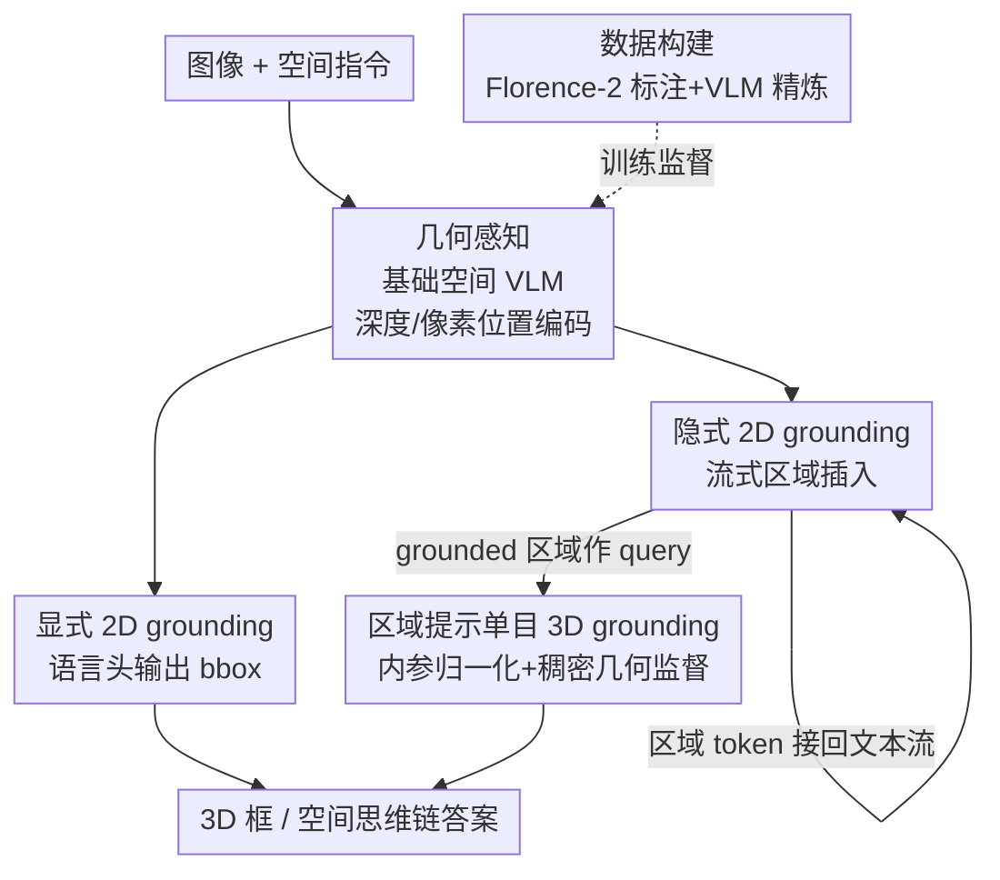

# Grounded 3D-Aware Spatial Vision-Language Modeling

**会议**: CVPR 2026  
**arXiv**: [2605.30307](https://arxiv.org/abs/2605.30307)  
**代码**: https://www.anjiecheng.me/gr3d (项目页)  
**领域**: 多模态VLM / 3D视觉 / 空间理解  
**关键词**: 空间VLM, 隐式grounding, 单目3D检测, 视觉思维链, 区域提示

## 一句话总结
GR3D 把「显式 2D grounding + 隐式 2D grounding + 单目 3D grounding」三种定位能力统一进同一个空间 VLM，让模型在生成空间思维链时一边说一边把提到的物体定位成区域 token 插回文本流，再用这些 grounded 区域作为 query 直接预测相机视角下的 3D 框，从而在 Omni3D 3D 检测和多个空间推理 benchmark 上同时刷出提升。

## 研究背景与动机
**领域现状**：空间 VLM 近两年发展很快，已经能做不少 2D 空间关系（相对位置、方向、距离）推理，甚至开始触碰单目 3D 感知。主流做法是把图像编码成视觉 token，再靠大规模空间 QA 数据让模型「记住」空间关系。

**现有痛点**：作者指出两个被忽视的能力缺口。其一，**隐式 2D grounding 稀缺**——多数系统只支持「point to X」这种显式 grounding，却没有机制在自由文本生成过程中自动发现被提到的实体、并把对应视觉证据接进来；构造这种监督也难，要把文本 mention 对齐到隐含的视觉区域、再把区域信息穿插进语言流。其二，**单目 3D grounding 本质病态**——单视角下物体尺度、深度、相机内参互相纠缠，而且 3D 预测前必须先搞清楚文本指的是哪个实例。现有方法要么跳过这个中间定位步骤、要么依赖多视角监督、要么受限于 3D 框标注的稀少。

**核心矛盾**：VLM 直接从全局图像特征「猜」空间关系，跟人类「先定位每个物体、再推理它们关系」的方式背道而驰；而 3D 推理又被「先认哪个物体」和「再估几何」这两层模糊性卡住。

**本文目标**：把 grounding 当成学习空间表征的核心机制，让一个统一架构同时支持三种 grounding，并把复杂空间理解拆解成「grounded 2D 感知 → 3D 推断」。

**切入角度**：作者的假设是——grounding 不只是一个独立任务，而是一种**有用的归纳偏置**：只要让模型在推理时反复定位、引用视觉证据，连不带显式定位的普通空间任务都会变强。

**核心 idea**：用「流式区域插入」在生成时把实体定位成区域 token 接回文本流，再用「区域提示」把每个 grounded 2D 区域当成 3D 推断的 query，配合内参归一化和稠密几何监督，统一 2D/3D 空间推理。

## 方法详解

### 整体框架
GR3D 以 NVILA-Lite-8B 为底座，先搭一个几何感知的基础空间 VLM，再在其上叠加三种 grounding 能力。输入是单视角（或多视角）RGB 图像 + 自然语言指令，输出是带视觉证据的空间思维链文本，以及（在 3D 任务下）相机视角下的 3D 框。整条链路的关键在于：模型生成回答时不是一口气从全局特征推完，而是**边说边定位**——每提到一个实体就先预测它的 2D 框、把该区域编码成区域 token 插回正在生成的文本序列，让后续推理直接踩在 grounded 视觉证据上；当任务要 3D 时，再把这个 grounded 区域当 query 喂给 3D 预测，先解决「哪个物体」、再推「什么 3D 结构」。

### 关键设计

**1. 几何感知的基础空间 VLM：让视觉 token 自带空间坐标**

普通 VLM 把视觉 token 当成无序的「词」处理，丢掉了它们在图像网格里的空间排布，这对空间推理是致命的。GR3D 沿用 SR-3D 的设计原则，在 NVILA 编码器抽出的稠密视觉 token 上叠加 **2D 位置嵌入（来自像素坐标）+ 相对深度线索**，让每个 token 同时携带外观和几何上下文，并保留它们在图像网格里的空间排布（不像语言 token 那样被拉成纯序列）。它还保留 SR-3D 的 **region-prompt 设计**：对任意给定 bounding box 内的特征做池化，就能把一块图像区域编码成一个 query token，供下游模块直接引用。这一层不含任何 grounding 能力，纯粹是提供一个「几何感知、又能跟语言对齐」的表征底座，后续三种 grounding 才有地方落脚；多视角输入时，第一帧按单视角处理、其余视角统一变换到第一帧坐标系

**2. 隐式 2D grounding：流式区域插入，边生成边把视觉证据接回文本流**

面对「厨房里货架上第二个瓶子，离洗衣房洗衣机上那只棕色小熊有多远」这类 query，传统 VLM 直接从全局特征硬猜，靠海量 QA 死记空间关系。GR3D 的机制是模仿人「先定位、再推关系」：以思维链方式生成回答，每当提到一个实体（如「货架上第二个瓶子」），模型先用语言头预测它的 2D 框坐标 $[x_1, y_1, x_2, y_2]$，紧接着把对应图像区域经 region encoder 编成一个**区域 token、直接插入文本流的那个位置**，后续生成同时以文本和这块视觉证据为条件，对下一个实体重复此过程，产出一条语言与视觉交替、时序对齐的推理轨迹。训练时框坐标由语言头预测、走 teacher forcing，区域 token 取自 ground-truth 区域但**从计算图中 detach（不回传梯度）**，只作为后续生成的强条件线索；推理时则完全自回归：先出坐标 → 编码预测区域 → 把 embedding 插回序列 → 再生成下一步。它可以抽象地看成「先 grounding、再区域条件推理」两步，但 GR3D 把两步**揉进同一个生成流**——模型自己学会「何时、对什么 grounding」，避免离散 grounding 模块带来的阶段断裂

**3. 区域提示的单目 3D grounding：把 grounded 2D 区域当 query 直接出 3D 框**

单目 3D 有两重模糊：语言上要先认出指的是哪个实例，几何上尺度/深度/内参纠缠。GR3D 把每个 grounded 2D 区域当成「3D 推断的 query」——区域特征池化成区域 token 融进文本流去引导 3D 框预测，由于模型已经具备隐式 2D grounding，这一步只需把能力从 2D 延伸到 3D。3D 框用一套**与 2D HTML 风格兼容的语言化格式**表达，参数化为中心 $(x_c,y_c,z_c)$、尺寸 $(w,h,l)$、朝向（归一化欧拉角 pitch/roll/yaw），并选「与区域 PCA 主轴和全局坐标轴夹角最小」的旋转变体来统一不同数据集的朝向。针对几何模糊，引入**内参归一化**：按焦距把图像重缩放成跨数据集一致的视场，给定 $f_x$ 时令 $W' = \tfrac{1000}{f_x}\cdot W$、$H' = \tfrac{1000}{f_x}\cdot H$，从而对齐特征空间里物体的表观大小、无需显式回归内参。监督信号上除了稀疏 3D 框，还加了 region→3D、纯文本→3D 两种路径，以及**稠密点图监督**——从深度图随机采样有效表面点（如每图 100 个）、让模型在区域提示下预测它们的 3D 坐标，把监督规模远远扩展到稀缺的 3D 框标注之外；再配 2D 框轻量抖动增强容忍 grounding 噪声。正因为 3D 预测器吃的是隐式 grounding 产出的区域 token，它能天然插进 CoT 推理：先靠 grounded 语言生成解决「哪个物体」，再推「该物体的 3D 结构」

**4. 数据构建：从噪声标注到精炼的隐式 grounding 语料**

隐式 grounding 缺监督，因为没有现成数据把文本里每个 mention 都对齐到区域。GR3D 从 RefSpatial（含 OpenImages 2D 样本、CA-1M 3D 视频、合成场景）出发，先用 **Florence-2** 为每个文本 mention 生成候选 2D 框和类别标签，得到稠密但带噪的区域标注；再过一个 **VLM 验证 + 改写流水线**：验证 mention 与检测区域的一对一对齐（剔除不匹配/有歧义的），并把笼统类名改写成结合图像上下文的、实例级的精简描述。显式 grounding 这边则对带 GT 框的样本生成简短 referring expression 并验证其在图中确实存在。最终训练数据全部来自公开源：97K grounded CoT 样本、来自 Omni3D 和 EmbodiedScan 的 780K 3D 检测样本、来自 DepthLM 的 272K 点图重建样本，规模与 VST 等前作相当，确保增益不是单纯堆数据堆出来的

### 损失函数 / 训练策略
两阶段训练。**Stage 1 空间预训练**：从 NVILA-Lite-8B 初始化视觉编码器/projector/LLM，空间位置编码模块新初始化；在类似 SR-3D 的数据混合上加进 2D grounding 数据和 region→3D 检测数据训练，**冻结视觉编码器、训练其余模块**，目的是强化空间理解和 2D grounding（作者分析表明这会反过来提升 3D 检测）。**Stage 2 检测 CoT 微调**：在 CoT 格式的检测数据上（从 Omni3D 整理成「先 2D grounding 再预测 3D 框」的链式数据）微调，由于 Stage 1 后视觉特征已经成形，这一步**只微调 LLM** 来学推理与文本生成结构。框坐标作为文本序列的一部分由语言头预测、走 teacher forcing。

## 实验关键数据

### 主实验
**Omni3D 3D 目标检测**（AP，3D IoU 阈值 0.05–0.50）：

| 方法 | SUN-RGBD AP₁₅ | SUN-RGBD mAP | Hypersim mAP | KITTI mAP | 整体 AP₃D |
|------|------|------|------|------|------|
| Cube R-CNN（视觉专家） | 15.33 | - | - | - | 23.26 |
| DetAny3D（视觉专家） | 18.96 | - | 7.17 | 31.61 | 24.92 |
| Qwen3-VL-8B（VLM） | 28.28 | 17.77 | 7.23 | 3.32 | - |
| **GR3D-8B（本文）** | **43.49** | **31.64** | **10.87** | 14.75 | **25.40** |

GR3D 全面超过所有 VLM 基线，整体 AP₃D 25.40 略胜视觉专家 DetAny3D（24.92），室内域（SUN-RGBD/Hypersim）优势尤其明显。**2D 检测**（Table 2）GR3D-8B 在 SUN-RGBD 上 2D mAP 38.86，远超 Cube R-CNN（15.07）和 Qwen3-VL-8B（8.06）。

**grounded CoT（MM-GCoT，Table 4）**：GR3D-8B 平均答案准确率 A-Acc 78.3、grounding 准确率 G-Acc 74.2、答案-grounding 一致性 67.7，三项全面超过 Qwen2.5-VL-7B（73.1 / 64.3 / 56.8）和 LLaVA-GCoT-7B（74.5 / 63.3 / 58.1）。**BLINK-Depth** 点级区域理解上 GR3D-8B 达 94.4%，超过需要人工标注 mask 的 SR3D-8B（90.3）和 SpatialRGPT-8B（87.9）。

### 消融实验
Omni3D 上拆解 GR3D 三个关键组件（SUN-RGBD 室内 / KITTI 室外）：

| PT 预训练 | 2D→3D | Cam 内参归一化 | SUN AP₁₅ | SUN AP₃D | KITTI AP₁₅ | KITTI AP₃D |
|------|------|------|------|------|------|------|
| – | – | – | 30.19 | 20.27 | 10.08 | 6.22 |
| ✓ | – | – | 42.29 | 29.87 | 15.61 | 10.03 |
| ✓ | ✓ | – | 41.24 | 30.95 | 21.55 | 14.35 |
| ✓ | ✓ | ✓ | **43.49** | **31.64** | **22.18** | **14.75** |

### 关键发现
- **空间预训练（PT）贡献最大**：加上后 SUN-RGBD AP₁₅ 从 30.19 跳到 42.29、KITTI 从 10.08 到 15.61。Omni3D 室外样本极不均衡，从零训的模型在室外泛化差，PT 注入通用 2D 空间/grounding 先验后大幅缓解——证明「3D 数据稀缺/不均衡时，借 2D 监督特别划算」。
- **2D→3D 两步预测优于直接 3D**：KITTI AP₁₅ 从 15.61 涨到 21.55（室外提升尤其明显）。先 2D grounding 提供稳定几何锚点，再做 3D 推断，且 2D 这步能吃海量通用检测/grounding 数据建立更强空间先验。
- **内参归一化是稳定的小增益**：SUN AP₁₅ 41.24→43.49、KITTI 21.55→22.18，幅度不大但一致，主要减少不同焦距相机带来的系统性定位偏移。
- **点图监督可 scaling**：在 SUN-RGBD 上用 GT 2D 框只评 3D 预测时，点图监督数据越多、3D 检测越好，呈清晰 scaling 趋势。
- **Stage 2 不伤通用 VLM 能力**：CoT 微调后 ChartQA/MME/POPE/AI2D 等通用 benchmark 基本与 Stage 1 持平（如 MME 1656→1626），说明保留了通用能力。

## 亮点与洞察
- **「边说边定位」把 grounding 织进生成流**：流式区域插入让推理直接在 grounded 视觉证据上展开，省掉独立检测阶段，模型自己学会何时该 ground——这种把感知与认知耦合进单一自回归流的设计，比「先检测、再推理」的离散两段式更连贯、更可解释。
- **grounding 是归纳偏置而非附加任务**：最让人「啊哈」的实验观察是——即便在不需要显式定位的普通空间 VQA 上，加了 grounding 训练后性能也提升（Stage 1 后空间 benchmark 普遍上涨）。这把 grounding 从「一个任务」重新定位成「一种让空间表征变强的训练信号」。
- **稠密点图监督破解 3D 标注稀缺**：从深度图采表面点当监督，把 3D 几何信号的规模从「稀疏 3D 框」扩展到「每图上百个点」，且实测可 scaling，这个 trick 可迁移到任何受限于 3D 框标注的单目几何任务。
- **3D 框语言化 + 内参归一化**：把 3D 框写成与 2D 兼容的语言格式、用 $\tfrac{1000}{f_x}$ 重缩放对齐视场，避免了像 VST 那样把 FoV 当文本 prompt 传进去（模型难可靠解析数值几何参数）——这是让单一语言接口同时吐 2D/3D 的关键工程。

## 局限与展望
- 单目 3D 本质病态，内参归一化只能缓解、不能消除尺度/深度模糊，作者也承认其增益小于预训练和 2D→3D 拆解。
- 多视角结果只放在补充材料，正文主打单视角；多视角与具身推理被列为「未来扩展」，当前框架的多视角能力尚未充分验证。
- 隐式 grounding 语料依赖 Florence-2 自动标注 + VLM 精炼，标注噪声靠 2D 框抖动增强容忍，但精炼流水线本身的质量上限会传导到 grounding 精度，论文未量化噪声对最终性能的影响。
- 室外（KITTI/nuScenes）绝对 mAP 仍明显低于室内，Omni3D 数据不均衡的根本问题没被彻底解决，只是被预训练部分补偿。

## 相关工作与启发
- **vs SR-3D / SpatialRGPT**：它们靠 region 分支做精细单视角/多视角空间感知，但需要在推理时给定区域（甚至人工标注 mask）；GR3D 把 grounding 内化成自动机制，推理时不需要任何空间标注，且额外打通了隐式 grounding 与单目 3D。
- **vs OVMono3D / DetAny3D（单目 3D 专家）**：OVMono3D 用「detect-then-lift」两段式（现成 2D 开集检测器出 proposal → 专用 3D 头回归），DetAny3D 用可提示架构融合 2D 基础模型特征；GR3D 不把 3D grounding 当独立检测任务，而是统一进 VLM 框架，让 grounding 同时驱动通用空间对齐，在 grounded 和非 grounded 任务上都受益。
- **vs VST**：VST 也做焦距归一化，但仍要把 FoV 当文本 prompt 传进去，数值几何参数以文本表示难被模型可靠解析；GR3D 用内参归一化把这一信息融进特征空间，无需显式回归或文本传参。
- **vs「Thinking with Images」系列**：那类方法依赖显式视觉思考过程或外部工具；GR3D 避开外部工具，靠隐式 2D grounding + 原生 3D 推理在 VLM 生成流内部完成，更高效统一。

## 评分
- 新颖性: ⭐⭐⭐⭐⭐ 把三种 grounding 统一进单一生成流、用流式区域插入把视觉证据织进 CoT，是空间 VLM 里少见的干净统一设计。
- 实验充分度: ⭐⭐⭐⭐ Omni3D/MM-GCoT/BLINK-Depth/多个 VQA 全覆盖，消融拆得清楚；多视角结果只在补充略显单薄。
- 写作质量: ⭐⭐⭐⭐⭐ 动机推导（两个 grounding 缺口）和方法叙述都很清楚，三种能力如何串成「2D 感知→3D 推断」讲得到位。
- 价值: ⭐⭐⭐⭐⭐ 「grounding 作为归纳偏置提升通用空间理解」的结论对具身/空间 VLM 有普适指导意义，稠密点图监督和 3D 框语言化也都可复用。

<!-- RELATED:START -->

## 相关论文

- [\[CVPR 2026\] G$^2$VLM: Geometry Grounded Vision Language Model with Unified 3D Reconstruction and Spatial Reasoning](g2vlm_geometry_grounded_vision_language_model_with_unified_3d_reconstruction_and.md)
- [\[CVPR 2026\] Think with 3D: Geometric Imagination Grounded Spatial Reasoning from Limited Views](think_with_3d_geometric_imagination_grounded_spatial_reasoning_from_limited_view.md)
- [\[CVPR 2026\] From 3D Pose to Prose: Biomechanics-Grounded Vision-Language Coaching](from_3d_pose_to_prose_biomechanics-grounded_vision-language_coaching.md)
- [\[CVPR 2026\] Abstract 3D Perception for Spatial Intelligence in Vision-Language Models](abstract_3d_perception_for_spatial_intelligence_in_vision-language_models.md)
- [\[CVPR 2026\] HiSpatial: Taming Hierarchical 3D Spatial Understanding in Vision-Language Models](hispatial_taming_hierarchical_3d_spatial_understanding_in_vision-language_models.md)

<!-- RELATED:END -->
