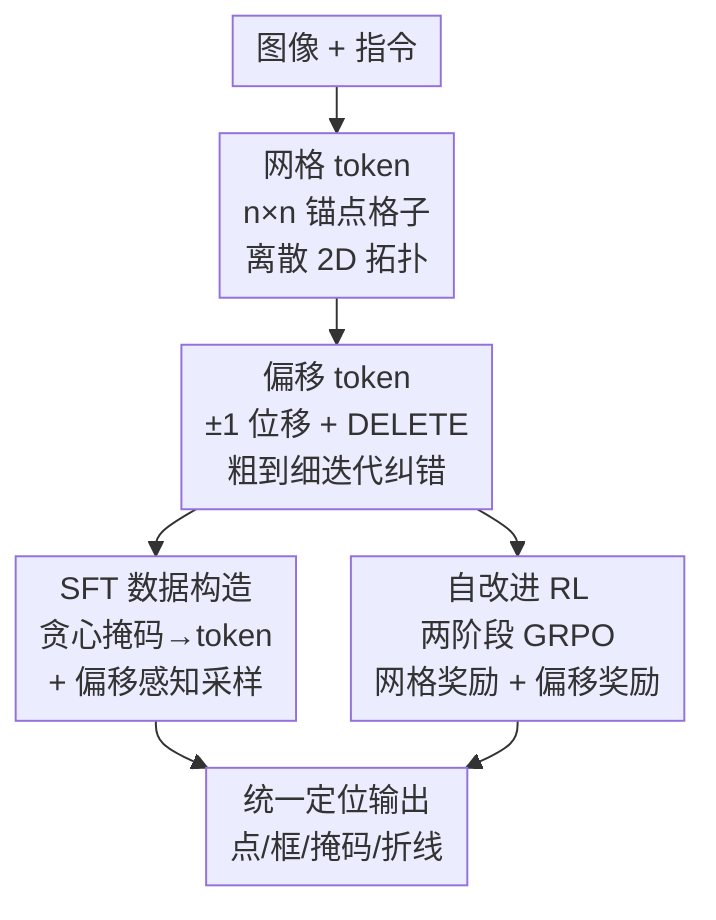

# Grounding Everything in Tokens for Multimodal Large Language Models

**会议**: CVPR 2026  
**论文**: [CVF Open Access](https://openaccess.thecvf.com/content/CVPR2026/html/Ren_Grounding_Everything_in_Tokens_for_Multimodal_Large_Language_Models_CVPR_2026_paper.html)  
**代码**: https://getokpage.github.io （项目页）  
**领域**: 多模态VLM  
**关键词**: 视觉定位, 空间token, MLLM, 网格-偏移token, 强化学习  

## 一句话总结
GETok 给 MLLM 的词表加一组「网格 token + 偏移 token」，把图像平面离散成 2D 锚点格子、再用小步偏移迭代纠错，不改自回归架构就让模型用统一的 token 序列表示点/框/掩码/折线等各种定位，并在 SFT 和 RL 两种范式下都刷到 SOTA。

## 研究背景与动机
**领域现状**：MLLM 用自回归 Transformer 做视觉理解，但要先把图像 tokenize 成视觉 token 喂进序列。现有让 MLLM「定位物体」的做法主要三类——用文本写坐标（如 Qwen-VL 直接吐 `x1,y1,x2,y2`）、把图像 patch 线性投影成视觉 token、用一维 bin token 离散化坐标（如 Pix2Seq）。

**现有痛点**：这三类各有硬伤。文本坐标保不住空间拓扑，一个框要吐近 13 个 token，还带 tokenization bias（`199`→`200` 和 `199`→`999` 在 token 空间的距离关系是乱的）；patch 投影被图像编码器的固定 patch 尺寸绑死，纹理和几何纠缠在一起，纹理相似但位置不同的物体容易混；一维 bin token 用线性索引描述二维坐标，索引上的小变化并不对应 2D 拓扑上的平滑移动。

**核心矛盾**：根本问题是**离散的序列 token 和连续的 2D 空间之间缺一个可靠映射**。尤其在 RL（GRPO）下这点要命——动作空间不规整时，一个 token 的微小改动可能让奖励剧烈跳变，策略优化很难稳定收敛。

**本文目标**：(1) 用一套 token 统一表示点/框/掩码/折线等所有定位形式；(2) 让定位能从粗到细迭代纠错而不是一锤定音；(3) 构造一个几何规整、利于 RL 探索的动作空间。

**核心 idea**：把 2D 空间「焊进 token」——给词表加一批和图像平面上均匀锚点绑定的可学习离散 token（网格 token 定位、偏移 token 微调），让所有定位都变成「在词表里挑空间代词」，不动自回归架构。

## 方法详解

### 整体框架
GETok 把 MLLM 的原词表 $V_{\text{LLM}}$ 扩成 $V = V_{\text{LLM}} \cup T_{\text{grid}} \cup T_{\text{offset}}$。其中网格 token $T_{\text{grid}} = \{\langle \text{grid}_{i,j}\rangle \mid i,j \in \{0,\dots,n-1\}\}$ 把图像平面切成 $n\times n$ 个锚点，每个格子配一个可学习 token，负责指代它局部区域里的物体；偏移 token $T_{\text{offset}} = \{\langle \text{OFF}_{\delta u,\delta v}\rangle\} \cup \{\langle \text{DELETE}\rangle\}$，其中 $\delta u,\delta v \in \{-1,0,1\}$，提供 8 个方向的小位移加一个删除符，用来在锚点基础上把位置磨准、或把错误锚点删掉。

推理时走「propose-and-refine」两步链：先用网格 token 吐一串粗定位（如掩码就吐 `<seg><grid_{i1,j1}>...</seg>` 一组无序锚点），再用偏移 token 对每个锚点做一次纠正（`<offset>...<OFF...><DELETE>...</offset>`）。整套既适配 SFT（靠造训练数据），也适配一个两阶段 GRPO 的自改进 RL。

### 关键设计

**1. 网格 token：把图像平面焊成可学习的 2D 锚点格子**

针对「序列 token 保不住空间拓扑」这个根因，GETok 不再用文本坐标或一维 bin，而是直接把图像平面离散成 $n\times n$ 的均匀格子，每个格子 $\langle\text{grid}_{i,j}\rangle$ 是一个加进词表的可学习 token。这样一来，token 在词表里的二维下标 $(i,j)$ 天然对应它在图像上的二维位置——相邻格子在拓扑上也相邻，纹理与几何彻底解耦。一个框只要两个角点共 2 个 token（对比文本坐标约 13 个、patch 约 9 个、bin 约 4 个），掩码就是一组无序网格 token 序列，点/折线同理，**所有定位形式被统一成「挑哪几个空间代词」**。缺点是 token 数随分辨率平方增长（$n$ 翻倍要多 $64^2-32^2=3072$ 个 token），这个词表瓶颈交给下一个设计解决。

**2. 偏移 token 与 propose-and-refine：10 个 token 换来翻倍精度 + 迭代自纠错**

网格 token 精度受格子粗细限制，硬提分辨率代价是平方级 token 爆炸。偏移 token 用极小代价破局：只加 8 个方向位移 $\langle\text{OFF}_{\delta u,\delta v}\rangle$（$\delta u,\delta v\in\{-1,0,1\}$）加一个 $\langle\text{DELETE}\rangle$ 共 10 个 token，就能在已有锚点上做亚格精修——$32^2$ 的锚点格配上这 10 个偏移 token，等效精度就到 $64^2$，省下 3072 个新网格 token。更妙的是它带来一个**涌现能力**：因为 $\langle\text{DELETE}\rangle$ 能递归地否决错误锚点，整个定位从「一锤定音」变成「先粗提议、再逐步纠正」的迭代推理——模型可以反思上一轮预测，对准的锚点小修、不准的大修、彻底错的直接删，这正好补上了现有方法「初始错误无法回头」的短板。

**3. SFT 数据构造：贪心掩码→token + 偏移感知采样**

GETok 不改架构，SFT 的关键全在「怎么造数据」，难点是稠密掩码和偏移监督。对掩码，作者用一个 **training-free 的贪心算法**把连续掩码转成离散网格 token：先把图像 + $n^2$ 个网格点喂给 SAM 得到 $K$ 个候选掩码（每个网格点映一个掩码），目标是挑最少的网格点让它们的掩码并集逼近真值掩码——

$$\boldsymbol{\pi}^\star = \arg\min_{\boldsymbol{\pi}\in\{0,1\}^{n^2}} \|\boldsymbol{\pi}\|_0 \quad \text{s.t.}\quad \text{IoU}\Big(\mathbf{M}_{\text{gt}}, \bigcup_{k:\pi_k=1}\mathbf{M}_{\theta(k)}\Big) \ge \tau$$

贪心解法：把所有候选掩码按和真值的 IoU 降序排，逐个试加，只要并集 IoU 比当前 $\text{IoU}_{\max}$ 更高就保留该网格点并更新并集。这比现有「单点/框/随机采样」更干净，尤其能处理多连通掩码的冗余与歧义。对偏移监督，作者用形态学操作按偏移步长把每个网格点划成四类区域——**Inside**（稳定内点，映零偏移 `<OFF0,0>`）、**Ring**（边界邻近的外点，需非零偏移纠回）、**Far**（远负点，映 `<DELETE>`）、**Hard-Delete**（难删的边界 case，也映 `<DELETE>`）——再带偏置地多采 Inside 和 Ring 这类「纠正最有学习价值」的样本。作者发现这种模拟监督比真实生成的偏移序列更好用。

**4. 自改进 RL：两阶段 GRPO 把「放锚点」和「移锚点」分开优化**

GETok 的 2D 格点动作空间几何规整、低熵，是 RL 的理想温床。作者设计了一个两阶段 GRPO 框架：从 SFT 冷启动模型出发，**阶段一只训网格 token 生成**，奖励空间准确性和结构合法性；**阶段二在多轮对话里引入偏移 token**，奖励通过迭代精修带来的精度提升（仅训 200 步防过拟合）。两阶段把「token 放哪（placement）」和「token 怎么移（movement）」解耦，实现几何感知的自纠错。奖励拆得很细：网格阶段有格式奖励（`<think>`/`<answer>`/`<box>`/`<seg>` 结构）、非重复奖励（罚句子级重复）、掩码 IoU 奖励（用 SAM 把预测框/点转成掩码再算 IoU 的分段函数）、框奖励（IoU + 角点 L1）、**语义关键点奖励**（结合命中率与分布，用指数饱和项 $1-e^{-m_p/5}$ 防点太稀、线性罚项 $0.02 m_p$ 防点太多）；偏移阶段则有格式奖励、点精修奖励（每点三元分 $s_{k,p}\in\{-1,0,1\}$：移出真值掩码记 $-1$，纠回/留在内/有效删除记 $+1$，其余 $0$；只有 $\langle\text{DELETE}\rangle$ 且原位置 $3\times3$ 邻域无点落在真值内才算「有效删除」）、框精修奖励（精修后框 IoU 涨才给正奖）、掩码 IoU 增益奖励（按相对增益归一）。作者提到关键踩坑：奖励设计不当时模型会「干脆一个偏移都不预测」，所以这套奖励刻意鼓励有意义的几何更新。

### 一个完整示例
以「分割沙漠里最适合的交通工具」为例：模型先 `<think>` 推理出骆驼脚掌宽、耐渴耐热 → `<answer>` 用网格 token 给出粗框 `<box><grid0,16><grid28,24></box>` 和粗掩码 `<seg><grid3,19>...<grid25,15></seg>`；接着第二轮 `<offset>` 对框做 `<OFF1,1><OFF-1,-1>`、对掩码逐点做 `<OFF1,1>...<DELETE>`——准的锚点小位移、错的直接删。论文图示里这条「网格提议（红点）→偏移向量（蓝线）→精修后点（绿点）」的链条，把一个框表示不了的复杂掩码精确还原了出来。

## 实验关键数据
基座为 Qwen2.5-VL-7B；SFT 用 ms-swift + LoRA(rank=64)，RL 用 easy-r1 的 GRPO，网格 size=32、偏移 size=64，8×80GB GPU。

### 主实验：RES（指代表达分割）

| 设置 | 方法 | ReasonSeg Val | ReasonSeg Test | RefCOCO Avg |
|------|------|---------------|----------------|-------------|
| SFT | LISA | 44.4 | 36.8 | — |
| SFT | Qwen2.5-VL-7B | 55.4 | 51.5 | 65.7 |
| SFT | GETok-SFT-grid | 58.1 | 54.4 | 67.2 |
| SFT | **GETok-SFT** | **59.2** | **55.8** | **68.2** |
| RL | VisionReasoner | 66.3 | 63.6 | 70.7 |
| RL | **GETok-R1** | 65.9 | **64.2** | **72.7** |

RL 比自身 SFT 整体 +4.5%，验证规整 2D token 空间在 RL 下策略优化更稳。

### REC（指代表达理解，严格 Acc@0.8）

| 设置 | 方法 | RefCOCO Avg | RefCOCO+ Avg | RefCOCOg Avg |
|------|------|-------------|--------------|--------------|
| SFT@0.8 | Qwen2.5-VL-7B | 73.3 | 67.9 | 71.7 |
| SFT@0.8 | **GETok-SFT** | **74.7** | **70.3** | **73.5** |
| RL@0.8 | VisionReasoner† | 76.3 | 72.1 | 72.7 |
| RL@0.8 | **GETok-R1** | **78.6** | **74.9** | **75.5** |

在更严格的 Acc@0.8 下、尤其小物体上提升更明显（Acc@0.5 提升相对温和，因为 RefCOCO 表达较简单，留给精修的空间小）。

### 消融：网格分辨率 vs 偏移 token（REC Acc@0.8 / RES gIoU）

| 配置 | REC | RES | 每掩码平均 token 数 |
|------|-----|-----|---------------------|
| 16×16 | 68.9 | 66.2 | 5.2 |
| 32×32 | 70.9 | 67.2 | 8.7 |
| 64×64 | 71.2 | 67.1 | 14.6 |
| **32×32 + offset** | **72.6** | **68.2** | 9.2 |

### 关键发现
- **偏移机制是性价比核心**：32×32 加 10 个偏移 token（token 数仅 8.7→9.2）就超过 64×64（token 数 14.6），印证「小步偏移」远比「硬翻倍分辨率」划算；偏移在 SFT/RL 下分别带来 +1.0%/+1.5% 稳定增益。
- **RL 在复杂推理任务上收益最大**：ReasonSeg 这种带长推理链的任务 GETok-R1 提升显著，简单的 RefCOCO 表达留给精修的余地小。
- **驾驶场景泛化强**：自有驾驶数据上交通标志颜色识别 +12.24%、静态障碍分类 +7.95%；车道折线检测把连续坐标回归换成离散点选择，Precision/Recall/F1 相比坐标法各 +3%/+18%/+10%，曲线车道尤其受益。

## 亮点与洞察
- **「2D 下标 = 2D 位置」的 token 设计极巧**：网格 token 的二维索引直接编码空间拓扑，从根上消掉了文本坐标的 tokenization bias，且天然统一了点/框/掩码/折线——这套「空间代词」思路可迁移到任何需要在序列里表达几何的任务。
- **`<DELETE>` 把一次性预测变成可迭代推理**：偏移 token 本是为省词表，却涌现出「递归否决错误锚点」的自纠错能力，是全文最漂亮的「无心插柳」。
- **几何规整 = RL 友好**：把动作空间设计成低熵的格点 + 小位移，使 GRPO 奖励地形平滑、探索高效，给「为什么有的表示在 RL 下更好训」提供了一个具体可操作的答案。
- **training-free 的贪心掩码→token 转换**可无成本扩数据，靠 SAM 把连续掩码自动离散化，工程上很实用。

## 局限与展望
- 整条管线**重度依赖 SAM**：数据构造（贪心匹配）和 RL 奖励（把框/点转掩码算 IoU）都要 SAM，SAM 的质量和偏好会传导进监督信号，论文也提到 SAM 高质量掩码有时反而和低质量真值标注对不齐。
- 偏移 token 仅覆盖 $\{-1,0,1\}$ 的 8 邻域单步位移，**单轮纠正幅度有限**，大偏差要靠多轮迭代，长链推理的稳定性与轮数预算未充分讨论。⚠️ 多轮精修的收敛与终止条件原文着墨不多，以原文为准。
- RL 只在 RES/REC/ReasonSeg 三类主流 benchmark 上验证，其余五类（折线、指代描述、gRES、pointing 等）只做了 SFT；偏移阶段仅训 200 步防过拟合，规模化训练效果待考。
- 词表瓶颈被偏移缓解但未根除，超高分辨率或极密集小目标场景下 $n^2$ 锚点是否够用仍有疑问。

## 相关工作与启发
- **vs 文本坐标（Qwen-VL）**: 它把坐标当文本数字吐，保不住拓扑、token 长、有 tokenization bias；GETok 用二维下标 token 直接编码空间，一个框只要 2 个 token 且拓扑一致。
- **vs patch 视觉 token（ClawMachine）**: 它被图像编码器的固定 patch 绑死、纹理几何纠缠；GETok 的网格锚点独立于编码器，解耦纹理与几何，迁移性更好。
- **vs 一维 bin token（Pix2Seq）**: bin 用线性索引描述坐标，索引小变化不对应 2D 平滑移动、RL 下奖励易跳变；GETok 的 2D 格点动作空间低熵规整，GRPO 训练更稳。
- **vs Kosmos-2**: 同样设想 2D 空间 token，但 Kosmos-2 只支持基础框定位；GETok 用网格 + 偏移把点/框/掩码/折线/多粒度多实例全统一进一套词表。
- **vs LISA / Seg-Zero / VisionReasoner**: 它们靠专用分割 token 触发外部解码器或解耦架构生成 prompt；GETok 不加任何任务专用模块、不改自回归框架，全部 grounding 在 token 里完成。

## 评分
- 新颖性: ⭐⭐⭐⭐⭐ 「2D 下标即 2D 位置」的网格 token + 偏移自纠错是对 MLLM 定位表示的根因级重构。
- 实验充分度: ⭐⭐⭐⭐ 八类任务 + SFT/RL 双范式 + 驾驶实测覆盖很广，但 RL 仅验三类、部分细节挪到附录。
- 写作质量: ⭐⭐⭐⭐⭐ 动机层层递进、图示把 propose-and-refine 讲得很清楚。
- 价值: ⭐⭐⭐⭐⭐ 不改架构即可统一所有定位形式，思路通用、工程可落地，对 RL 友好的表示设计有方法论启发。

<!-- RELATED:START -->

## 相关论文

- [\[CVPR 2026\] What Do Visual Tokens Really Encode? Uncovering Sparsity and Redundancy in Multimodal Large Language Models](what_do_visual_tokens_really_encode_uncovering_sparsity_and_redundancy_in_multim.md)
- [\[CVPR 2026\] GroundVTS: Visual Token Sampling in Multimodal Large Language Models for Video Temporal Grounding](groundvts_visual_token_sampling_in_multimodal_large_language_models_for_video_te.md)
- [\[CVPR 2026\] DiG: Differential Grounding for Enhancing Fine-Grained Perception in Multimodal Large Language Models](dig_differential_grounding_for_enhancing_fine-grained_perception_in_multimodal_l.md)
- [\[CVPR 2026\] Do Vision Language Models Need to Process Image Tokens?](do_vision_language_models_need_to_process_image_tokens.md)
- [\[CVPR 2026\] WeMMU: Enhanced Bridging of Vision-Language Models and Diffusion Models via Noisy Query Tokens](wemmu_enhanced_bridging_of_vision-language_models_and_diffusion_models_via_noisy.md)

<!-- RELATED:END -->
