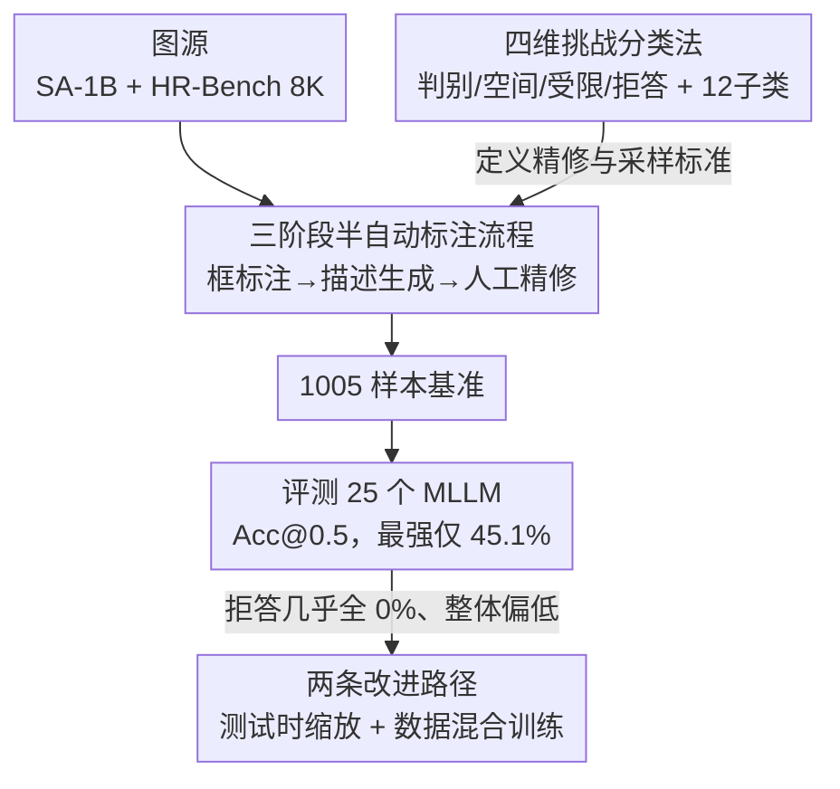

# GroundingME: Exposing the Visual Grounding Gap in MLLMs through Multi-Dimensional Evaluation

**会议**: CVPR 2026  
**论文**: [CVF Open Access](https://openaccess.thecvf.com/content/CVPR2026/html/Li_GroundingME_Exposing_the_Visual_Grounding_Gap_in_MLLMs_through_Multi-Dimensional_CVPR_2026_paper.html)  
**代码**: https://groundingme.github.io （项目页）  
**领域**: 多模态VLM  
**关键词**: 视觉定位, MLLM评测基准, 指代表达理解, 拒答能力, 测试时缩放  

## 一句话总结
针对现有视觉定位基准已被 MLLM 刷到 90%+ 却仍测不出真实能力的问题，作者构造了 GroundingME——一个含 1005 个样本、覆盖「细粒度判别 / 复杂空间 / 受限可见 / 拒答」四维度的硬基准，发现最强模型也只有 45.1% 准确率、绝大多数模型在拒答任务上得 0%，并给出测试时缩放（+4.5%）和负样本混合训练（拒答 0%→27.9%）两条改进路径。

## 研究背景与动机
**领域现状**：视觉定位（Visual Grounding / 指代表达理解 REC）是「给一句自然语言描述，在图里框出对应物体」的任务，是机器人指令、图像编辑等下游应用的底座。近两年 MLLM（Qwen3-VL、Gemini-2.5、GLM-4.5V 等）在 RefCOCO 系列上已经刷到 90%+、在 Ref-L4 上接近 90%。

**现有痛点**：基准饱和不等于模型真会定位。早期基准（RefCOCO）描述太短太简单（平均 3.6 个词），模型靠唯一类名就能「抄近路」蒙对；后续工作（Ref-L4、HC-RefLoCo）虽然把描述写长，但**没有真正提升推理复杂度**——只要描述里有个独特类名，模型就能跳过细粒度属性和空间推理直接命中。结果是这些基准再也分不出模型的真实定位水平。

**核心矛盾**：现实世界里人类轻松处理的两类能力，现有基准几乎完全没覆盖。一是**密集相似物体下的细粒度辨别 + 复杂空间/数量推理**；二是**拒答能力**——当描述的细节和画面对不上时，应该回答「图里没有这个物体」，而不是硬框一个最像的。后者对安全可靠至关重要，却被所有基准忽视。

**本文目标**：造一个真正硬、能暴露能力缺口、且带诊断维度的基准，分解为：(1) 系统化覆盖多个挑战维度；(2) 引入拒答样本；(3) 提供细粒度子类用于诊断。

**切入角度**：与其继续「把描述写长」，不如**正交地拆解定位难度的来源**，把它归纳成四个互不重叠的挑战维度，每个维度专门攻击模型的一种短板，并用高分辨率、高物体密度的图源（SA-1B + HR-Bench 8K）保证图本身就难。

**核心 idea**：用「四维挑战分类法 + 半自动构造 + 人工精修」造出 1005 个反捷径样本，把视觉定位从「能不能蒙对」变成「能不能真的逐属性核对、并在对不上时拒答」。

## 方法详解

### 整体框架
GroundingME 本质是一条「图源 → 半自动框标注 → MLLM 生描述 → 人工按四维分类法精修 → 1005 样本基准 → 评测 25 个模型 → 两条改进路径」的构造与诊断流水线。它的输入是 SA-1B / HR-Bench 的**原始图片**（不带任何 mask/QA，避免数据污染），输出是一个带两级标签（4 个 L-1 维度、12 个 L-2 子类）的硬基准，以及在其上得到的能力缺口诊断和初步改进方案。

整个设计有两层：**一层是基准本身怎么造**（贡献核心），**另一层是造完之后用它发现问题、再给出补救**（test-time + train-time）。下面的框架图给出构造与诊断的主链路：

### 关键设计

**1. 四维挑战分类法：把「定位难」拆成四种正交的失败模式**

针对「现有基准靠加长描述但没加真实难度」的痛点，作者不再用「长短」衡量难度，而是按**失败原因**把挑战拆成四个 L-1 维度，每个专打一种短板：(1) **Discriminative（判别）**——图里有多个高度相似物体，必须靠细粒度外观差异区分；(2) **Spatial（空间）**——靠复杂的相对位置/数量关系才能锁定，含 Relationship（定性方位）和 Counting（定量数数）两类；(3) **Limited（受限）**——目标因遮挡或极小尺寸导致可见特征极少，含 Occlusion 和 Small（来自 HR-Bench 8K）两类；(4) **Rejection（拒答）**——描述里被故意植入与画面不符的细节，正确答案是「无此物体」。每个 L-1 再细分成 12 个 L-2 子类（如判别/拒答各含 Appearance、Component、Text、State 四子类，各约 50 样本），用于诊断模型到底栽在哪一类。最终 1005 样本分布为判别 204（20.3%）、空间 300（29.9%）、受限 300（29.9%）、拒答 201（20.0%），刻意做成均衡分布。这个分类法是整个基准的骨架——精修和采样都围绕它进行，也是后面诊断分析的坐标轴。

**2. 三阶段半自动标注流程：用「机器生成 + 人工把关」造反捷径样本**

针对「自动生成数据有噪声、纯人工又造不出量」的矛盾，作者设计了 human-in-the-loop 的三阶段流水线。**阶段一·框标注**：对 SA-1B 图用自动管线——先 RAM++ 列出图中所有物体类名，再把类名喂给 GroundingDINO 生成候选框（取最高相似 token 所属词作类名），最后用一条**定制 NMS**去冗余（关键改动：不按面积优先，而是**优先保留实例数更多的类**，这样能留下「一堆相似物体」的场景，正好喂给判别任务）；对 HR-Bench 的超高清图则因分辨率太高改用人工标框。**阶段二·描述生成**：用 Gemini-2.5-Flash 生成初版描述——SA-1B 物体用红框 visual prompt 在全图里框出、要求同时写外观和空间关系；HR-Bench 小物体则裁剪出来单独输入、只写外观。**阶段三·人工精修**：标注员先修框，再按四条标准改写描述——Uniqueness（一句话只指一个物体，拒答样本则不指任何物体）、Subject Clarity（明确点出目标，对复杂空间样本尤其关键）、Task Specificity（描述要贴合子任务，如数数任务加序数词）、Factual Accuracy（修掉幻觉，**或为拒答样本故意植入事实错误**）。为反捷径还加了硬过滤：删掉实例数 <3 的类、删掉框占图 >50% 的大物体，主体样本选自实例数 >5 的类。50 个随机样本的标注员一致性 Cohen's kappa 为 0.64–0.73（均值 0.69）。

**3. 两条改进路径：测试时按思维质量选答案 + 训练时混入负样本**

针对评测暴露出的「整体偏低 + 拒答几乎全 0%」，作者给出两条互补的补救。**测试时缩放（TTS by thinking quality）**：先观察到开启 thinking 普遍涨点（4.7%–7.4%）且能让拒答从「完全不会」变成「有一点」，于是对同一样本用 Qwen3-VL-235B-A22B-Thinking 采 16 条回答（temperature=0.7），再让一个 judge 模型做 **Best-of-16 两两对比**——专门比较**思维轨迹的质量**（连贯、逻辑自洽、严格遵循指令），胜者晋级直到剩一条。关键发现：带 CoT 的多模态裁判（Qwen3-VL-A22B）整体 +4.5%；连纯文本裁判（DeepSeek-R1 +2.9%、MiMo-RL +2.2%）也有效，说明「好的思维轨迹」本身就能提分；而剥掉思维轨迹只看最终框，增益掉 2.1%。**数据混合训练（Data-Mixture）**：假设拒答失败源于训练语料缺负样本，于是在 RefCOCOg 上选 3 万正样本、并改描述造 3 万负样本（RefCOCOg_rej），按负:正 = 1:8 / 1:4 / 1:2 / 1:1 / 2:1 五种比例各采 3 万条微调 Qwen3-VL-8B-Instruct。结果负样本比例越高拒答越强（in-domain 拒答 30.5%→97.3%），仅 8B 模型在 GroundingME 拒答上就从 **0% 提到 27.9%**，但代价是非拒答任务退化（38.8%→33.0%），说明简单混合学到的拒答**不能免费泛化**到更难的域外场景。

## 实验关键数据

评测指标为 **Accuracy@0.5**（预测框与真值框 IoU > 0.5 的样本占比）。共测 25 个开源 + 商业模型，参数 2B–235B。

### 主实验：25 个 MLLM 的整体排行（节选）

| 模型 | 判别 Avg | 空间 Avg | 受限 Avg | 拒答 Avg | Total |
|------|---------|---------|---------|---------|-------|
| Qwen3-VL-235B-A22B | 69.6 | 49.7 | 54.0 | 0.0 | **45.1** |
| Seed-1.6-Vision | 59.8 | 58.7 | 42.7 | 1.0 | 42.6 |
| Qwen3-VL-32B | 75.0 | 47.3 | 34.0 | 0.0 | 39.5 |
| GLM-4.5V | 52.9 | 42.0 | 29.3 | 0.5 | 32.1 |
| Gemini-2.5-Pro | 34.8 | 34.0 | 7.0 | 7.0 | 20.7 |
| Qwen2.5-VL-72B | 48.5 | 40.3 | 23.7 | 3.0 | 29.6 |
| Phi-4-Multimodal | 1.0 | 0.7 | 0.0 | 0.0 | 0.4 |

三个核心观察：(1) **能力缺口巨大**——最强的 Qwen3-VL-235B-A22B 也只有 45.1%，多数模型落在 10%–40%，部分 <10%；(2) **商业模型不占优**——Seed-1.6-Vision（42.6%）紧追最强开源，Gemini-2.5 仅与中游开源相当；(3) **规模是关键变量**——同族缩放一致涨点（Qwen3-VL-Dense 2B→32B：21.1%→39.5%；Qwen2.5-VL 7B→72B：15.1%→29.6%）。最刺眼的是**拒答列几乎全是 0.0%**，且这个失败不随规模缓解。

### 改进路径消融

| 方法 | 裁判模型 | Total | 拒答 |
|------|---------|-------|------|
| Average（16 条均值） | - | 49.8 | 5.7 |
| w/o CoT | Qwen3-VL-A22B | 49.6 | 8.5 |
| w/ CoT | DeepSeek-R1（纯文本） | 52.7 | 15.4 |
| w/ CoT | Qwen3-VL-A22B | **54.3** | **15.9** |

| RefCOCOg 微调（负:正） | Origin | 1:8 | 1:1 | 2:1 |
|------|------|------|------|------|
| RefCOCOg val（正样本） | 88.2 | 90.4 | 86.8 | 83.1 |
| RefCOCOg_rej val（负样本） | 30.5 | 83.5 | 94.8 | 97.3 |
| Macro Average | 59.4 | 87.0 | 90.8 | 90.2 |

### 关键发现
- **拒答是全场最大短板**：no-thinking 下几乎所有模型拒答 0%，意味着「描述对不上画面」时模型完全不会说「没有」，只会硬框一个最像的 distractor。开 thinking 后才出现「一点」拒答行为。
- **思维质量 > 思维有无**：TTS 的增益主要来自「挑出更好的思维轨迹」——剥掉 CoT 只看最终框，增益掉 2.1%；甚至纯文本裁判（看不到图）仅凭思维轨迹也能 +2.9%，说明轨迹的逻辑自洽性本身携带正确性信号。
- **拒答能力不能免费泛化**：负样本混合训练让 8B 模型 in-domain 拒答冲到 90%+、GroundingME 拒答 0→27.9%，但同时把非拒答任务从 38.8% 拖到 33.0%——简单混合是「学会拒答」而非「学会真定位」，域外迁移仍是开放问题。
- **子任务分层清晰**：模型普遍最擅长判别、其次空间/受限、拒答最差；空间内 Relationship（定性方位）好于 Counting（定量数数），数数对规模更敏感。

## 亮点与洞察
- **「拒答」这一维度是真正的杀手锏**：把「图里根本没有」纳入评测，一下子让所有声称强推理的 MLLM 露馅（绝大多数 0%）。这揭示了一个被长期忽视的安全隐患——模型默认「描述一定有对应物体」，缺乏对前提的怀疑能力。
- **定制 NMS 优先保留高实例数类**，是个可复用的小 trick：常规 NMS 按面积留框，这里反其道按「类内实例多」留框，专门保住「满图相似物体」的难场景，从数据源头制造判别难度。
- **用思维轨迹质量做 Best-of-N 选择**，比只看最终答案更准，且纯文本裁判就能受益——这暗示「轨迹的逻辑结构」是一种比答案更稠密的监督信号，可迁移到其他需要核对细节的多模态任务。
- **反污染设计**：只用原始图、不用任何已有 mask/QA，即便模型训练时见过 SA-1B 图，任务本身仍是全新的，把「记忆」和「能力」干净分开。

## 局限与展望
- **规模仍偏小**：1005 样本足以诊断但偏小，12 个 L-2 子类每类仅约 50 样本，细分结论的统计噪声较大。
- **改进方案是「初探」而非「解法」**：TTS 需采 16 条 + 大裁判，推理成本高；数据混合训练会牺牲正样本定位精度，且拒答能力域外迁移失败（作者自己承认是 future work 的关键挑战）。
- **依赖 Gemini-2.5-Flash 生描述**：初版描述质量受单一闭源模型风格影响，虽有人工精修，但描述的措辞分布可能隐含该模型偏好。⚠️ 论文未量化这一偏差。
- **改进方向**：拒答能力的可泛化训练（而非简单负样本混合）、把「思维质量评估」从外部大裁判蒸馏进模型自身、扩展到更多图源以验证四维分类法的覆盖度。

## 相关工作与启发
- **vs RefCOCO/+/g**：它们是短语级、场景简单、已饱和（90%+）；GroundingME 用复杂句/段落（描述长度四分位 18/40/58 词 vs RefCOCOg 的 8.4）、高密度高分辨率场景，且首次同时具备 General + Semantic + Multi-Dim + Rejection 四属性。
- **vs Ref-L4 / HC-RefLoCo**：它们靠「加长描述」提难度，但模型仍可靠唯一类名抄捷径；GroundingME 通过删低实例数类、删大物体、植入事实错误等机制**系统性封堵捷径**，让「逐属性核对」成为必经之路。
- **vs Ref-ZOM**：Ref-ZOM 最早引入简单负样本测拒答，但局限于特定场景；GroundingME 把拒答升级为含 4 个 L-2 子类、201 样本的独立维度，并配套给出训练侧补救方案。

## 评分
- 新颖性: ⭐⭐⭐⭐⭐ 四维正交分类法 + 拒答维度 + 反捷径构造，把饱和的定位评测重新做难，定位精准
- 实验充分度: ⭐⭐⭐⭐⭐ 25 个模型横扫、12 子类诊断、TTS 与数据混合双路径消融，证据链完整
- 写作质量: ⭐⭐⭐⭐ 动机清晰、图表自洽；改进部分略偏「初探」，方法深度集中在基准构造侧
- 价值: ⭐⭐⭐⭐⭐ 暴露 MLLM 拒答能力的系统性缺失，是面向可信视觉系统的实用诊断工具与路线图

<!-- RELATED:START -->

## 相关论文

- [\[CVPR 2026\] Visual Grounding for Object Questions](visual_grounding_for_object_questions.md)
- [\[CVPR 2026\] From Indoor to Open World: Revealing the Spatial Reasoning Gap in MLLMs](from_indoor_to_open_world_revealing_the_spatial_reasoning_gap_in_mllms.md)
- [\[CVPR 2026\] Cubic Discrete Diffusion: Discrete Visual Generation on High-Dimensional Representation Tokens](cubic_discrete_diffusion_discrete_visual_generation_on_high-dimensional_represen.md)
- [\[CVPR 2026\] VGent: Visual Grounding via Modular Design for Disentangling Reasoning and Prediction](vgent_visual_grounding_via_modular_design_for_disentangling_reasoning_and_predic.md)
- [\[CVPR 2026\] OddGridBench: Exposing the Lack of Fine-Grained Visual Discrepancy Sensitivity in Multimodal Large Language Models](oddgridbench_exposing_the_lack_of_fine-grained_visual_discrepancy_sensitivity_in.md)

<!-- RELATED:END -->
