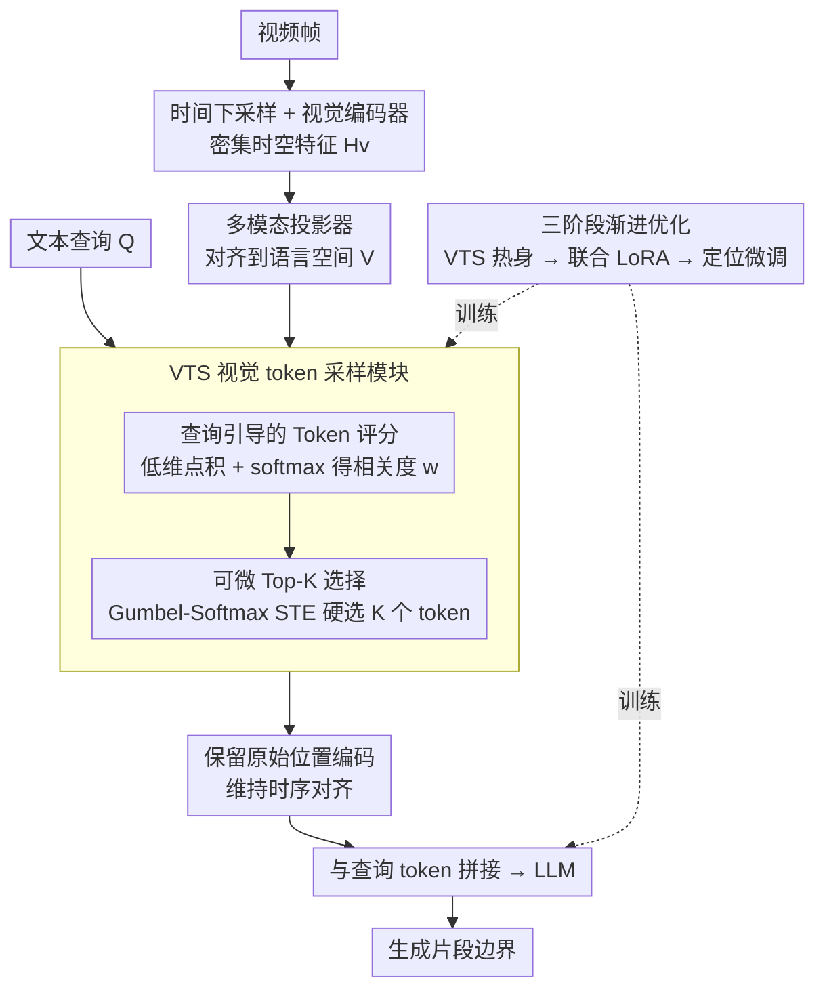

# GroundVTS: Visual Token Sampling in Multimodal Large Language Models for Video Temporal Grounding

**会议**: CVPR 2026  
**arXiv**: [2604.02093](https://arxiv.org/abs/2604.02093)  
**代码**: 有（GitHub）  
**领域**: 多模态VLM / 视频理解  
**关键词**: 视频时序定位、视觉token采样、查询引导、视频大语言模型、时序推理

## 一句话总结
提出 GroundVTS，一种在视频大语言模型中进行查询引导的细粒度视觉token采样架构，通过在 token 级别自适应保留与查询相关的时空信息，在 Charades-STA 上 mIoU 提升 18.4 点，QVHighlights 上 mAP 提升 20.6 点。

## 研究背景与动机

**领域现状**：视频时序定位（VTG）是视频理解的基础任务，要求根据自然语言查询精确定位视频片段的时间边界。近年来视频大语言模型（Vid-LLM）如 Qwen2.5-VL、InternVL 等在通用视频推理上取得进展，但在细粒度时序理解上仍有不足。已有改进方法引入了查询条件注意力、时间边界回归器和时间建模模块。

**现有痛点**：(1) 现有 Vid-LLM 普遍采用均匀帧采样策略，对所有时间段分配相同的输入预算，导致查询相关的关键时刻被稀释或遗漏；(2) 一些近期方法（如 CLIP 基础的帧选择）实现了查询引导的帧级采样，但粒度粗糙（整帧级别）且依赖外部多模态编码器，限制了定位精度和适应性；(3) 视觉token 的密度和相关性直接影响 VTG 性能——实验显示帧率过低（<1 FPS）信息不足，过高（>2.4 FPS）冗余 token 反而稀释关键信号。

**核心矛盾**：固定均匀采样在"信息覆盖"和"信号稀释"之间存在根本性的trade-off——增加帧率提供更多时序线索但引入更多冗余，降低帧率减少冗余但可能丢失关键时刻。需要一种自适应、查询感知的采样机制。

**本文目标**：如何在 Vid-LLM 的视觉 token 层面实现查询引导的自适应采样，在保留关键时空信息的同时抑制冗余内容？

**切入角度**：从帧率敏感性实验出发——Qwen2.5VL-7B 在 2.0-2.4 FPS 达到最佳 mIoU 47.8%，超过此范围急剧下降。这表明 VTG 需要的是"对的 token"而非"多的 token"。因此将采样粒度从帧级下沉到 token 级，在 VLM 内部（视觉编码器和多模态投影层之后）根据 token-query 相似度进行可微的 top-K 选择。

**核心 idea**：在 Vid-LLM 中引入查询引导的 token 级可微采样模块，用 Gumbel-Softmax STE 实现端到端训练，配合三阶段渐进优化策略适应非均匀 token 分布。

## 方法详解

### 整体框架
GroundVTS 想解决的是「Vid-LLM 把预算平摊给所有帧、关键时刻被冗余 token 稀释」这个问题，做法是把采样的颗粒度从「选哪些帧」下沉到「选哪些视觉 token」，并且让这个选择由查询来引导、可端到端训练。整条管线是这样转的：视频先做时间下采样、过视觉编码器得到密集时空特征 $H_v \in \mathbb{R}^{N_v \times D_v}$，再经多模态投影器映射到与语言对齐的共享空间 $V \in \mathbb{R}^{N_v \times D}$；接着 VTS（Visual Token Sampling）模块拿文本查询 $Q$ 给 $V$ 里每个 token 打分（查询引导的 Token 评分），做一次可微的 top-K 选择，挑出紧凑子集 $\tilde{V}$；被选中的 token 保留它原始的位置编码以维持时序对齐，最后和查询 token 拼在一起喂给 LLM 做联合推理和片段边界生成。为了让 LLM 适应这种非均匀 token 分布，整个 VTS + LLM 用三阶段渐进优化来训练。关键在于这个「打分—选择」发生在 VLM 内部、投影层之后，所以它既能看到与语言对齐的语义、又能用语言模型的损失反传来学。

### 关键设计

**1. 查询引导的 Token 评分：让每个视觉 token 报出它和查询有多相关**

均匀采样的根本问题是它根本不看查询，所以第一步要给每个视觉 token 一个「与查询的相关度」。GroundVTS 把视觉嵌入 $V$ 和均值池化后的查询嵌入 $\mathbf{q}$ 分别用可训练投影矩阵 $W_v, W_q \in \mathbb{R}^{D \times D_r}$ 压到一个低维子空间得到 $V'$、$\mathbf{q}'$，再算温度缩放的点积并 softmax 得到权重分布 $\mathbf{w} = \text{softmax}(V'{\mathbf{q}'}^\top / \tau)$。本质上这是一个轻量注意力——$w_i$ 同时编码了第 $i$ 个 token 与查询的语义对齐度、以及它在整段序列里的相对重要性。之所以先投影到低维再算相似度，是因为这样既省算力，又能把比较聚焦在语义相关的维度上而不是被原始高维特征里的噪声带偏；温度 $\tau$ 则用来调节这个分布的锐度，决定后面选择是「集中在少数 token」还是「相对平摊」。

**2. 可微 Top-K 选择：硬选 K 个 token 进 LLM，但梯度还能流回来**

有了分数还不够——直接按分数取前 $K=\lceil\rho \cdot N_v\rceil$ 个是个硬操作，不可微，没法和 LLM 一起端到端训练。GroundVTS 用 Gumbel-Softmax 松弛配直通估计器（STE）绕开这点：前向传播仍然做硬选择 $z_i^{\text{hard}} = \mathbf{1}(i \in \mathcal{I}_K)$，保证真正进 LLM 的只有 $K$ 个 token、推理是省的；反向传播则借连续松弛 $z_i$ 让梯度流过去，二者用

$$\tilde{z}_i = z_i^{\text{hard}} + z_i - \text{stopgrad}(z_i)$$

拼起来——数值上等于硬选择，求导时却等于软松弛。被选中的 token 再做一次权重归一化和加权

$$\hat{w}_i = \frac{\exp(w_i/\tau') \cdot \tilde{z}_i}{\sum_j \exp(w_j/\tau') \cdot \tilde{z}_j}, \qquad \tilde{v}_i = \hat{w}_i \cdot \text{MLP}(v_i)$$

归一化这一步很关键：只在被保留的 $K$ 个 token 内部重新分配权重，避免那些被丢掉的 token 把信号强度也一起带走，等于让留下来的 token「补满」总的注意力质量。举个具体感受：若一帧密集编码出 $N_v$ 个 token、取 $\rho=0.5$，那进 LLM 的就只剩一半，且这一半是和查询最对得上的那批，冗余背景 token 在前向时被直接剔除。

**3. 三阶段渐进优化：让非均匀采样能稳住收敛**

非均匀采样会让 LLM 看到的 token 分布和预训练时的均匀分布很不一样，如果一上来就把 VTS 和 LLM 一起放开训，梯度会很不稳、选择行为也来回跳。GroundVTS 把训练拆成由易到难的三段。Stage 1 是 VTS 热身：冻住其它所有组件、只训 VTS 自己的参数，先把「token-query 相关性怎么估」这件事学稳。Stage 2 是联合 LoRA 适配：用 LLaVA-Video-178K 这种大规模数据联合微调 VTS、MLP 投影器和 LLM（LoRA），让语言模型逐渐适应「输入 token 是非均匀挑出来的」这一新分布。Stage 3 是定位微调：在作者聚合多个 VTG 训练集构造的 Grounding-FT 数据（70K 样本、统一成指令式 QA 格式）上做最后的任务对齐。这套顺序不是凑数——消融里跳过 Stage 1、让 VTS 随机初始化直接联训，mIoU 会从完整三阶段的 50.1 掉到 5.6，几乎崩掉；只跳过 Stage 2 也明显低于完整版，说明「先学会选、再让 LLM 适应、最后对齐任务」这条路径每一步都在兜底。

### 损失函数 / 训练策略
训练目标就是标准的 LLM 自回归生成损失，VTS 模块完全靠这个损失经由可微 top-K 反传来学，没有额外的采样监督。三阶段分别训 1 / 2 / 3 个 epoch，学习率依次为 1e-5 / 2e-4 / 1e-4，采样比率全程固定 $\rho=0.5$。

## 实验关键数据

### 主实验（Moment Retrieval）

| 方法 | Charades-STA R1@0.5 | Charades-STA mIoU | ActivityNet R1@0.5 | ActivityNet mIoU |
|------|--------------------|--------------------|-------------------|-----------------|
| VTimeLLM | 27.5 | 31.2 | 27.8 | 30.4 |
| NumPro | 42.0 | 41.4 | 37.5 | 38.8 |
| LLaVA-ST | 44.8 | 42.4 | - | - |
| Qwen2.5VL-7B-G | 32.7 | 31.7 | 23.9 | 26.7 |
| **GroundVTS-Q** | **57.5 (+24.8)** | **50.1 (+18.4)** | **33.6 (+9.7)** | **36.0 (+9.3)** |

### Highlight Detection（QVHighlights）

| 方法 | MR R1@0.5 | MR R1@0.7 | HD mAP | HD Hit@1 |
|------|-----------|-----------|--------|---------|
| Qwen2.5VL-7B-G | 11.0 | 4.3 | 34.4 | 44.5 |
| GroundVTS-Q | 23.6 (+12.6) | 12.3 (+8.0) | 35.7 (+1.3) | 58.8 (+14.3) |
| InternVL3.5-8B-G | 31.8 | 15.0 | 31.9 | 39.8 |
| **GroundVTS-I** | **63.6 (+31.8)** | **40.7 (+25.7)** | **52.5 (+20.6)** | **88.4 (+48.6)** |

### 消融实验

| 采样策略 | Charades R1@0.5 | Charades mIoU | ActivityNet mIoU |
|---------|----------------|---------------|-----------------|
| Uniform（1.0 FPS） | 28.5 | 29.3 | 23.4 |
| Random（50%丢弃） | 35.0 | 35.7 | 27.7 |
| Frame-Level 查询选择 | 44.9 | 41.6 | 30.7 |
| **Token-Level（Ours）** | **57.5** | **50.1** | **36.0** |

### 训练阶段消融

| 训练阶段 | R1@0.3 | R1@0.5 | R1@0.7 | mIoU |
|---------|--------|--------|--------|------|
| None（随机VTS） | 8.6 | 5.0 | 1.9 | 5.6 |
| Stage 1 only | 31.2 | 20.5 | 10.0 | 20.9 |
| Stage 1+2 | 45.8 | 28.8 | 13.2 | 30.1 |
| Stage 1+3 | 49.1 | 32.5 | 15.2 | 32.4 |
| **Stage 1+2+3** | **71.5** | **57.5** | **34.2** | **50.1** |

### 关键发现
- Token 级采样大幅优于帧级采样（Charades mIoU 50.1 vs 41.6），证明细粒度选择的重要性
- 去掉位置编码（保留VTS）导致 mIoU 从 50.1 暴跌到 9.5，时序对齐至关重要
- 仅用50%的 token 预算，GroundVTS 已超过基线的全密度性能（R1@0.7 34.2 vs 30.5）
- GroundVTS-I 在 QVHighlights 上 Hit@1 达到 88.4%（比基线提升 48.6 点），表现极为突出
- 在 NExT-GQA 离线评估中 GroundVTS-Q 取得最高 mIoU 25.8，展示泛化能力

## 亮点与洞察
- 帧率敏感性分析作为设计动机非常有说服力——清晰展示了"过多token反而有害"的现象，直接support了自适应采样的必要性
- Gumbel-Softmax STE 实现 token 级可微选择在 VTG 场景的应用是巧妙的工程设计。这种"选择即注意力"的思路可以迁移到任何需要稀疏化处理的多模态任务
- 三阶段渐进优化避免了端到端训练的不稳定性，且消融实验精确量化了每个阶段的贡献，方法论严谨

## 局限与展望
- 采样比率 $\rho=0.5$ 在所有数据上固定，理想情况下应根据视频复杂度和查询自适应调整
- GroundVTS-I（InternVL3.5基座）在 Charades-STA 上的提升幅度明显小于 GroundVTS-Q，说明方法与不同采样范式（定帧率 vs 定帧数）的兼容性有差异
- VTS 模块增加了训练复杂度（三阶段），推理时的 top-K 计算也有额外开销
- 依赖均值池化压缩查询可能丢失细粒度语义（如"在...之后"的时序关系词）
- 在超长视频上的表现未充分验证

## 相关工作与启发
- **vs NumPro**: NumPro 通过帧编号辅助输入改善时序理解，但仍不改变视觉 token 的采样策略。GroundVTS 从 token 选择层面解决问题，在 Charades-STA mIoU 上高 8.7 点
- **vs LLaVA-ST**: LLaVA-ST 引入时空 token 但依赖均匀采样，GroundVTS 通过查询引导的非均匀分布实现更精确定位
- **vs token压缩方法（FastV等）**: 已有 token 压缩多为查询无关或基于显著性，GroundVTS 的查询引导设计对 VTG 更加精准。这个"压缩策略应与下游任务对齐"的原则值得推广

## 评分
- 新颖性: ⭐⭐⭐⭐ Token 级查询引导采样的思路在 VTG 领域是新的，但可微 top-K 选择机制本身已有先例
- 实验充分度: ⭐⭐⭐⭐⭐ 三个 VTG 基准 + OOD 评估 + token 密度分析 + 训练阶段消融 + 采样策略消融，非常全面
- 写作质量: ⭐⭐⭐⭐ 帧率敏感性分析作为引入动机的叙事很好，方法描述清晰
- 价值: ⭐⭐⭐⭐ 为 Vid-LLM 的视觉 token 利用提供了新视角，性能提升显著且思路可推广

<!-- RELATED:START -->

## 相关论文

- [\[CVPR 2026\] TimeLens: Rethinking Video Temporal Grounding with Multimodal LLMs](timelens_rethinking_video_temporal_grounding_with_multimodal_llms.md)
- [\[CVPR 2026\] Grounding Everything in Tokens for Multimodal Large Language Models](grounding_everything_in_tokens_for_multimodal_large_language_models.md)
- [\[ICCV 2025\] Enrich and Detect: Video Temporal Grounding with Multimodal LLMs](../../ICCV2025/multimodal_vlm/enrich_and_detect_video_temporal_grounding_with_multimodal_llms.md)
- [\[CVPR 2026\] ViKey: Enhancing Temporal Understanding in Videos via Visual Prompting](vikey_enhancing_temporal_understanding_in_videos_via_visual_prompting.md)
- [\[CVPR 2026\] EvoComp: Learning Visual Token Compression for Multimodal Large Language Models via Semantic-Guided Evolutionary Labeling](evocomp_learning_visual_token_compression_for_multimodal_large_language_models_v.md)

<!-- RELATED:END -->
